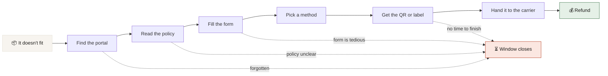
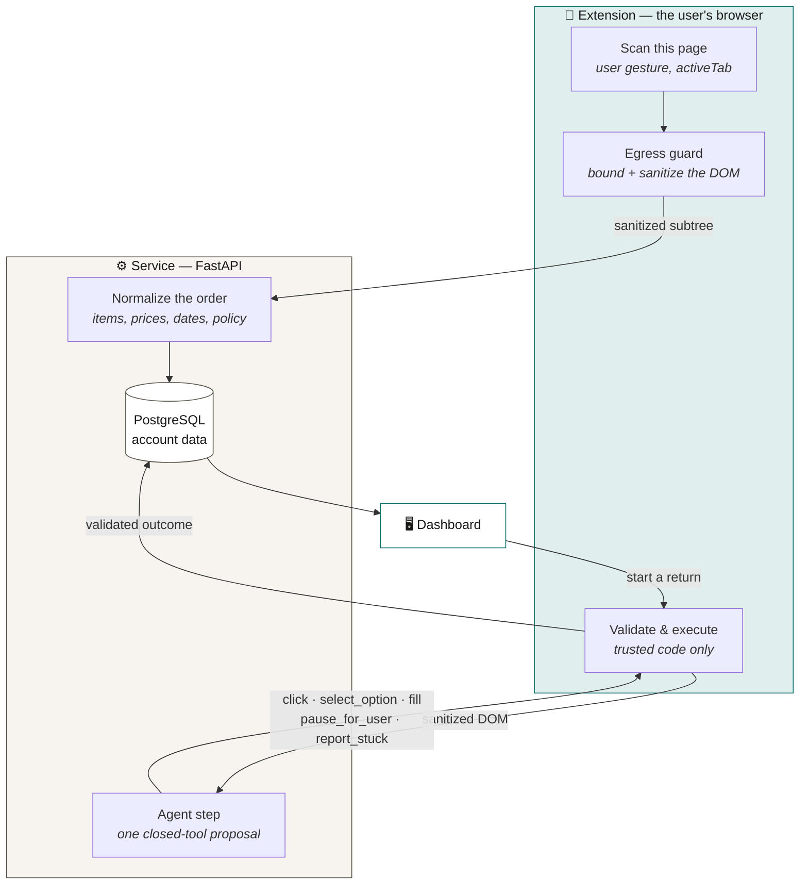

<div align="center">

# 🪃 Boomerang

### The reverse-logistics concierge

**Buying online is one click. Returning something is a sequence of small, deferrable chores with a deadline.**
Boomerang keeps the return visible — and carries out the tedious parts for you.

<br>

[](docs/ARCHITECTURE.md)
[](LICENSE)
[](#the-rules-that-arent-style-preferences)

<br>

[](client/)
[](client/)
[](server/)
[](server/)
[](server/app/db)
[](extension/)
[](plan/ai-pipeline.md)

</div>

---

## The problem

Every handoff in a return is another chance for it to be forgotten until the window closes.



**The dashed edges are the product.** Boomerang exists to get you across each point where a valid
return would otherwise stall.

---

## How it works

Two cooperating surfaces, with a strict division of labour:

<table>
<tr>
<td width="50%" valign="top">

### 🖥️ The dashboard is the **home**

Sign in with Google and see the returns that still need action — deadlines, remaining returnable
value, current state, and recommendations ranked by your preferences.

Sorted by *closing soonest*, because that's the only ordering that matches the deadline.

</td>
<td width="50%" valign="top">

### 🧩 The extension is the **hands**

It reads the retailer page **in your existing session** — no credentials, no scraping service — and
drives the visible return flow step by step, pausing for you to review and confirm.

You watch it work. It never submits behind your back.

</td>
</tr>
</table>

### The loop



The model never touches the browser. It returns **one proposal from a closed vocabulary**, and
trusted extension code decides whether to carry it out. That asymmetry is the whole security model:
retailer DOM is attacker-influenced input, so there is no path where it talks the agent into an
action outside the list.

---

## The rules that aren't style preferences

These come out of research, not taste. Breaking one breaks the product.

| | Rule | Why |
|---|---|---|
| 🚫 | **No Google restricted scopes. Ever.** | One Gmail or Calendar scope triggers verification, CASA, ~$540–$1,800/yr and a 6–12 week lead time. The architecture exists to avoid that regime. |
| 🚫 | **No Gmail, in any form.** | Not the API, not scraping. Order data comes from retailer pages you are already looking at. |
| 🔐 | **`activeTab`, `scripting`, `storage` — nothing else at install.** | `activeTab` grants access only on a user gesture, so the first run *cannot* inject on page load. Standing access is requested later, in context, once you've seen it work. |
| 🧱 | **Nothing leaves the page unguarded.** | The capture never reads a form value or an image's data. The guard strips cards, emails, long digit runs, declared-sensitive fields and address containers before anything is sent. |
| 👤 | **Never pick the return method for the user.** | Where the retailer offers a choice, every option is shown with its price. Buying a paid label out of your refund to satisfy our own precondition is the exact failure this prevents. |
| 🗄️ | **The server only ever sees what the extension sends.** | There is no background job reaching into your data — there is no credential that would let one work. |

Full reasoning, with decision IDs, lives in [`docs/ARCHITECTURE.md`](docs/ARCHITECTURE.md).

---

## Quick start

```bash
git clone https://github.com/jacklvd/boomerang.git && cd boomerang
./scripts/setup-hooks.sh          # once per clone — installs the repo-wide pre-commit hook
docker compose up --build         # client :3000 · server :8000
```

<details>
<summary><b>Working on the extension</b></summary>

<br>

```bash
cd extension
bun install
bun run dev        # loads an unpacked MV3 build with hot reload
bun run compile    # tsc --noEmit
bun run test       # builds, then runs vitest
```

The popup flow is driven from fakes, not a live retailer — `tests/fakes/` contains a fake
`chrome.storage`, `chrome.tabs`, `chrome.scripting` and clock, so the same code the popup runs is
what the tests drive.

</details>

<details>
<summary><b>Working on the server</b></summary>

<br>

```bash
cd server
make check         # fmt · lint · typecheck · coverage · audit — what the hook enforces
```

Python 3.13, FastAPI, SQLAlchemy 2 async over PostgreSQL, Claude on Bedrock for normalization.

</details>

<details>
<summary><b>Working on the dashboard</b></summary>

<br>

```bash
cd client
bun install
bun run dev        # :3000
```

Next.js 16, React 19, Tailwind 4, Base UI. Type is Fraunces + Instrument Sans; the palette lives in
[`app/globals.css`](client/app/globals.css).

</details>

---

## Repo map

| Path | What lives there | Phase |
|---|---|---|
| [`extension/`](extension/) | MV3 extension — reads order pages, drives return flows | Popup flow built against fixtures; egress guard landed |
| [`client/`](client/) | Next.js dashboard, the account-facing surface | Landing, sign-in, dashboard and privacy pages built |
| [`server/`](server/) | FastAPI service — account data, parsing, model gateway | Domain + PostgreSQL model work in progress |
| [`infra/`](infra/) | Earlier Lambda-oriented Terraform scaffold | Not the settled production topology |
| [`docs/`](docs/) | Product sketch, architecture decisions, workflow contract | — |
| [`design/`](design/) | Requirements, high-level and low-level design, data model, API contract | Current spec |
| [`plan/`](plan/) | Milestones, decision record, AI pipeline | — |

**New here?** Read [`docs/SKETCH.md`](docs/SKETCH.md) for the product, then
[`docs/ARCHITECTURE.md`](docs/ARCHITECTURE.md) for the shape and the decisions behind it.
[`docs/README.md`](docs/README.md) maps every document to its authority, so you don't mistake an old
review for the current contract.

---

## Scope

**In v1:** order ingestion from retailer pages · normalized orders, policies and deadlines ·
agent-driven return flows with user confirmation · retailer QR and label outcomes.

**Deliberately not in v1:** carrier pickup scheduling · interruption and resumption of a running
flow · storing QR or label artifacts. Google Calendar reminders are a separately authorized
priority 2.

The target is **one retailer end to end**, not two retailers halfway.

---

## Contributing

Branch from `main` — don't commit to it directly. Conventions, workspace phases and the per-directory
guides are in [`AGENTS.md`](AGENTS.md). When a doc and the code disagree, the doc is stale: fix it in
the same PR.

## License

[MIT](LICENSE) © 2026 jacklvd
