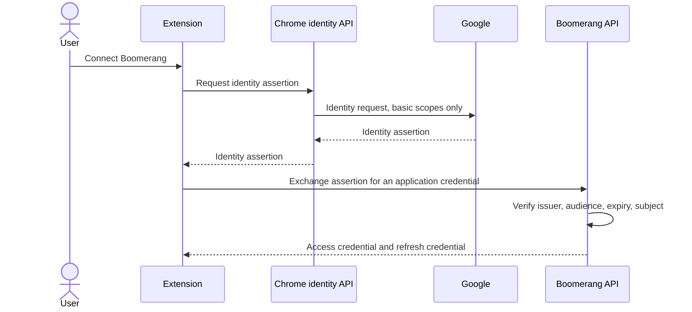
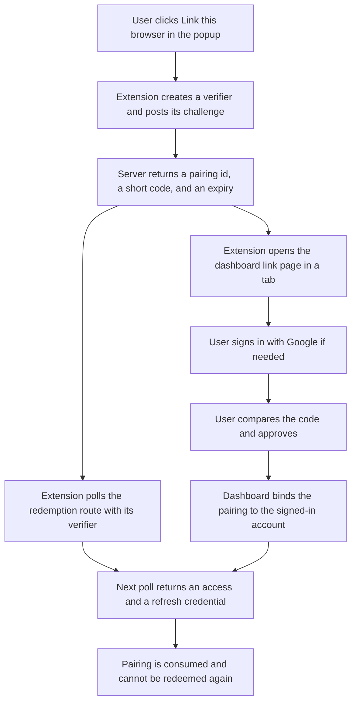
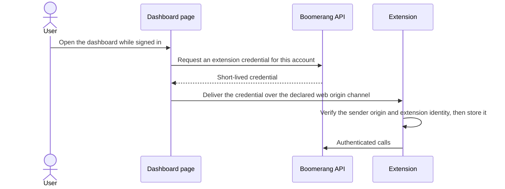

# Boomerang — Extension-to-Server Authentication Proposal

> **STATUS: ACCEPTED — 2026-09-13.**
>
> The user accepted the recommendation in section 11 on 2026-09-13: **Option B — server-brokered
> browser linking with proof-of-key redemption**, with a bearer credential on the extension leg and
> a first-party cookie on the dashboard leg. The decision was taken under deadline, deliberately
> choosing to proceed with the design as it stands rather than revise it further. This document is
> therefore **normative** for extension-to-server authentication. Sections 6, 8, 9 and 10 are the
> specification. Sections 5 and 7 are retained as the record of what was rejected and why; they are
> not implementable alternatives.
>
> The decision is registered in [`../plan/boomerang-decisions.md`](../plan/boomerang-decisions.md)
> as `MIG-15`, and as gate `ARCH-B9`, closed 2026-09-13. Section 12's edits to
> [`boomerang-api-contract.md`](boomerang-api-contract.md) have been made. Section 12's edits to the
> data model, the low-level design, the extension guidance, the repo-wide guardrails and the privacy
> copy have **not** been made; they are outstanding work tracked against `MIG-15`.
>
> Written 2026-09-13, in response to the high-level design review of the same date, which found
> that the extension's authentication path is asserted as settled in the trust-boundary table,
> required by five frozen interfaces, and specified nowhere. Accepted the same day.

---

## 1. The decision this closes

The frozen wire contract names the extension as a caller of the profile, dashboard, item-detail,
preferences, and summary-publication interfaces, and states that every one of them requires an
authenticated application principal. The high-level design states, separately, that the extension
holds no server, model-provider, Calendar-client, or retailer secret. Neither document reconciles
those two statements, and the trust-boundary table records the extension-to-API crossing as
"authenticated" without naming a mechanism.

This proposal answers five questions:

1. How the extension obtains an authenticated identity.
2. Whether the credential travels as a cookie or a bearer token, and what each choice means for
   cross-origin access and request forgery on a Chrome extension origin.
3. Where the credential lives inside the extension, and what an attacker who reaches that storage
   gets.
4. How long the credential lasts, how it is renewed, and how it dies — on sign-out and on account
   deletion.
5. Which parts of this belong to the dashboard-to-extension bridge gate and which do not.

It does not decide the bridge, the return initiator, the retailer target, the AI runtime contracts,
or the deployment topology.

---

## 2. Constraints every option is scored against

These are taken from the accepted documents and the repo-wide guardrails. An option that violates
any of them is not a candidate, however convenient it is.

| # | Constraint | Source |
|---|---|---|
| C1 | Google sign-in is identity only. No scope beyond basic identity, ever, in v1. | Repo guardrails, requirements, architecture record |
| C2 | Accounts are keyed by the stable OpenID Connect subject claim, never by email. | Data model, architecture record |
| C3 | The manifest declares `activeTab`, `scripting`, `storage` and nothing else at install. No broad host access. First page access requires a user gesture. | Repo guardrails, requirements |
| C4 | The server never initiates. It only ever sees what the extension explicitly sends it. | Repo guardrails, requirements |
| C5 | The extension holds no secret that would let it act as a confidential client. | Requirements, high-level design |
| C6 | The extension never becomes a second authoritative store for account data, and page content is never durable. | Requirements, data model |
| C7 | Cross-account access is indistinguishable from not-found; the caller never selects an account. | Wire contract, data model |

C1 deserves emphasis because it is the project's most-repeated rule and it is the one an
authentication design is most likely to erode by accident. The restricted-scope verification regime
is avoided structurally, not by discipline — which means the right design is one where the extension
has *no* relationship with Google at all, so there is no place a scope could later be added.

C5 is the constraint that eliminates the largest part of the obvious solution space. A public client
cannot hold a client secret, and "ship it in the bundle but call it non-confidential" is exactly the
pattern the requirement forbids.

---

## 3. Untangling this from the dashboard-to-extension bridge

The review found these two decisions are routinely conflated and says untangling them is step one.
They are genuinely separate, and the dependency runs one way only: the extension needs to
authenticate to the server whether or not the dashboard is ever able to talk to the extension,
because ingestion and summary publication are extension-to-server calls that exist in core v1
regardless.

| Concern | Belongs to extension authentication | Belongs to the bridge gate |
|---|---|---|
| Who the API caller is, and which account it maps to | Yes | No |
| How the extension obtains, renews, and loses a credential | Yes | No |
| Cross-origin rules for the extension origin calling the API | Yes | No |
| Where the credential is stored in the browser | Yes | No |
| What an extension without a credential is allowed to do | Yes | No |
| Revocation on sign-out and on account deletion | Yes | No |
| How a dashboard click reaches the correct browser | No | Yes |
| The enumerated command vocabulary the dashboard may send | No | Yes |
| Acknowledgement and delivery semantics for those commands | No | Yes |
| Addressing when one account has grants in several browsers | No | Yes |
| Whether the extension manifest declares a web origin as externally connectable | No | Yes |

One boundary case is worth naming, because it is the seam where the two decisions are usually
welded together. "Is a compatible extension connected?" — the state the dashboard is required to
show — has two possible definitions:

- **"This browser holds a valid grant for this account."** Answerable by authentication alone. The
  extension knows it, composes it locally, and the wire contract's existing statement that
  connection state is not a server field remains true.
- **"The dashboard can currently reach the extension and command it."** Only answerable by the
  bridge.

The first definition is sufficient for the dashboard's required display and is the one this
proposal assumes. Adopting it shrinks the bridge gate rather than enlarging it, and it also answers
the review's separate question about whether account-to-browser binding needs a durable server
record: it does, but as an authentication grant, not as a "connection" entity with its own
lifecycle.

---

## 4. What is eliminated before scoring

Four families were considered. Two survive as full options, one survives as a third option with a
sequencing objection, and one is eliminated outright.

**Eliminated: the extension reusing the dashboard's session cookie.** This is the cheapest-looking
answer and it fails on several independent grounds, any one of which is sufficient:

- A cookie set by the API host is *cross-site* relative to a `chrome-extension://` origin. It would
  have to be `SameSite=None; Secure`, which makes it a third-party cookie subject to Chrome's
  third-party cookie controls and to any user or enterprise setting that blocks them. Authentication
  would then fail for some users with no remedy the product can offer.
- To carry cookies reliably from the extension's service worker, the extension needs a host
  permission for the API origin. That is a manifest change against C3, and it is a change the
  bearer-token alternative does not require.
- Cookies are ambient authority. Every mutating route — the preferences write, the summary
  publication, the account deletion — would need request-forgery defenses, and the extension origin
  would have to be in a credentialed cross-origin allowlist, which is precisely the configuration
  where one mis-entered origin turns into full account access from a hostile page.
- It couples the extension's credential lifetime to the dashboard's browser session, so closing the
  dashboard or expiring a web session silently breaks ingestion.

The cookie transport is revisited in its own right for the *dashboard* leg later in this document,
where it is a good choice. It is a bad choice for the extension leg.

**Eliminated as a variant: PKCE against Google's authorization server using a bundled client.**
Google does not support a secretless web-application OAuth client; the code exchange requires the
client secret. An installed-application client would place a secret in the extension bundle. Google
documents that this particular secret is not treated as confidential, but the requirement that the
extension hold no Google OAuth client secret is written without that carve-out, and C5 is a rule
this proposal should not quietly reinterpret. The surviving Google-native variant is Chrome's own
identity API, which is Option A below.

---

## 5. Option A — Chrome-native Google identity in the extension

### Mechanism

The extension acquires its own Google identity assertion through Chrome's identity API — either the
token-fetch call bound to the browser profile's signed-in Google account, or a launched web auth
flow whose redirect is the extension's own `chromiumapp.org` address — requesting basic identity
only. It posts that assertion to a server exchange route. The server verifies it against Google,
resolves the subject claim to an account, and returns a Boomerang credential. From then on the
extension calls the API with that credential.

### Security analysis

- The verification burden is real and correct — issuer, audience, signature, expiry, and presence of
  a subject claim must all be checked server-side. This is the same obligation the dashboard leg has,
  so it is not new work, but it now has two callers and two audiences to get right.
- The account the extension binds to is determined by **whichever Google account is signed into the
  Chrome profile**, not by whoever signed into the dashboard. On a shared or multi-account browser
  these diverge silently, and the failure mode is not an error — it is a second Boomerang account
  quietly created and populated with the wrong person's orders. This is the sharpest risk in the
  option and it cannot be fully engineered away, only detected after the fact.
- It puts a *second* Google OAuth client into the project, of extension type, bound to the published
  extension ID. That client has its own scope list. The project's central rule is that no scope
  beyond basic identity is ever requested; this option creates a second place where that rule has to
  hold, in an artifact (the manifest's OAuth block) that a future contributor may treat as a
  configuration detail rather than a compliance boundary.
- It makes the extension a direct party to a Google authorization flow. Everything the product has
  done to keep the extension's Google relationship at zero is given up for a convenience.
- The user consents twice — once on the dashboard, once in the extension — which the store listing
  and privacy copy must both describe accurately.

### Constraint scorecard

| Constraint | Result |
|---|---|
| C1 identity-only scopes | Holds as written, but the surface where it could be broken doubles |
| C2 subject-keyed accounts | Holds |
| C3 minimal manifest | **Violated.** Requires the `identity` permission, and the token-fetch variant also requires an OAuth client block in the manifest |
| C4 server never initiates | Holds |
| C5 no bundled secret | Holds for the Chrome identity API variant; violated for any direct Google PKCE variant |
| C6 no second account store | Holds |
| C7 account scoping | Holds, but the *wrong account* can be bound without any rule being broken |

### Implementation cost

Moderate. A second Google client and consent configuration; one server exchange route that must
accept two distinct audiences; the extension-side identity call and its error states; and a
reconciliation story for the profile-account-versus-dashboard-account divergence, which is the
expensive part and has no clean answer.

---

## 6. Option B — Server-brokered browser linking with proof-of-key redemption

### Mechanism

The Boomerang server is the authorization server. The extension is a public client of *Boomerang*,
not of Google, and never speaks to Google at all.

1. The user clicks **Link this browser** in the extension popup. The extension generates a random
   verifier, derives a challenge from it, and posts the challenge to a pairing route. It receives a
   pairing identifier, a short human-readable code, an expiry, and a polling interval. Nothing is
   bound to an account yet.
2. The extension opens a tab to the dashboard's link page, carrying the pairing identifier in the
   URL. The user is already signed in with Google, or signs in at that moment.
3. The link page shows what is being approved and the same short code the popup is displaying. The
   user compares them and approves. The dashboard calls an approval route with its own authenticated
   session; the server binds the pairing to that account.
4. The extension, which has been polling a redemption route with its verifier, receives an access
   credential and a refresh credential on the first poll after approval. The pairing is consumed.

Every step is client-initiated, including the polling, so the rule that the server never initiates
is preserved exactly.

### The role of proof-of-key redemption, and its limits

The extension is a public client. It cannot prove it is the Boomerang extension rather than an
impostor, because no client secret is available to it and no server-side attestation of an extension
binary exists. What the verifier-and-challenge exchange *does* provide is worth stating precisely,
because it is routinely over-claimed:

- **It binds redemption to the client instance that started the pairing.** An attacker who learns
  the pairing identifier or the short code — from the URL bar, from a screenshot, from shoulder
  surfing — still cannot redeem it, because the verifier never leaves the extension until redemption
  and is never displayed.
- **It replaces the redirect-URI registration that a normal public-client flow would rely on.** This
  flow has no redirect at all; the extension polls its own API instead. That removes an entire class
  of redirect-interception and open-redirect problems, and it is the reason this flow needs no
  browser-identity permission. It also removes the one weak client-identification signal a registered
  redirect URI provides, which the human approval step must compensate for.
- **It does not authenticate the client.** Any local software could run the same flow and present the
  same prompt to the user.
- **It does nothing after issuance.** Once the credential exists it is a bearer credential, and every
  protection from that point forward comes from lifetime, rotation, revocation, and storage
  discipline — covered later in this document.

### The residual risk, stated honestly

This flow is shaped like a device-authorization grant, and it inherits that grant's characteristic
weakness: a remote attacker can start a pairing on their own machine and try to talk a victim into
approving it, which would hand the attacker a credential for the victim's account. The mitigations
are behavioural and must be built in deliberately:

- **No manual code entry anywhere.** The only path to the approval page is the link the extension
  itself opened. Removing the "type this code into the website" affordance removes the phishing
  script's easiest instruction.
- **The code is shown for comparison, not entry.** The popup and the page display the same code; the
  user confirms they match.
- **Short expiry and one-shot redemption.** A pairing that is not approved within a few minutes dies.
  A pairing that has been redeemed cannot be redeemed again.
- **Explicit approval copy.** The page says what is being granted (this account's returns data) and
  what is not (no Google access beyond sign-in, no retailer access, no ability to act without the
  user watching), and says to **close this page** if the user did not just install the extension in
  this browser, and that the request expires on its own within a few minutes with nothing linked.
  An earlier revision of this bullet said *decline*, which the rest of this document could not
  deliver: section 12's route list contains no decline route, and none ships. That is the copy being
  wrong rather than the route list, because a decline buys almost nothing here — the only actor who
  can approve a pairing is the signed-in user themselves, on the page the extension opened, so a
  pairing the user looks at and walks away from stays pending, is approvable by nobody else, and
  dies within minutes. No `rejected` pairing status exists either, for the same reason; adding both
  later, if a decline route is ever wanted, is purely additive and changes nothing on the wire.
  *Close this page* is also the stronger instruction, because it is the one that works whether or
  not the page the user is looking at is genuine.
- **Approval is visible and reversible.** Every grant appears in a linked-browsers list on the
  dashboard with its creation time and last-use time, and can be revoked from there. A mistaken
  approval is discoverable rather than silent.
- **Rate limits on pairing creation and redemption**, surfaced through the contract's existing
  rate-limited error.

### Security analysis

- The extension's Google relationship is exactly zero. The scope rule is not enforced by discipline;
  there is no place in the extension where a scope could be written. This is the strongest property
  of the option.
- Account binding is unambiguous and correct by construction: the account is the one signed into the
  dashboard at the moment of approval, resolved from the subject claim. The profile-versus-dashboard
  divergence that Option A cannot solve does not arise.
- All Google assertion verification happens on exactly one server route, called by exactly one
  client. That makes the verification obligations the review separately flagged a single chokepoint
  rather than a rule spread across two callers.
- The extension holds no secret before linking and a revocable, rotatable, account-scoped credential
  after. It is never a confidential client.
- The credential is independent of the dashboard's browser session, so ingestion does not break when
  the user closes the dashboard or a web session expires.

### Constraint scorecard

| Constraint | Result |
|---|---|
| C1 identity-only scopes | Holds structurally — the extension has no Google client at all |
| C2 subject-keyed accounts | Holds; the subject claim never appears in any credential or response |
| C3 minimal manifest | **Holds with no manifest change.** Opening a tab needs no permission; the API call is an ordinary cross-origin fetch from the service worker; the credential lives in the already-declared storage |
| C4 server never initiates | Holds; polling is client-initiated |
| C5 no bundled secret | Holds |
| C6 no second account store | Holds |
| C7 account scoping | Holds |

### Implementation cost

Moderate, and almost all of it is work milestone one needs anyway.

- Server: a pairing record and a grant record; four routes (create pairing, approve pairing, redeem,
  refresh) plus a revoke route; the Google assertion verification for the dashboard sign-in; an
  authentication dependency that resolves a credential to an account; expiry sweeping and rate limits.
- Dashboard: a sign-in flow (required regardless), one link-approval page, and a linked-browsers list
  with a disconnect control.
- Extension: a popup link button, the verifier generation, a polling loop with backoff, a credential
  store confined to the service worker, and a single authenticated fetch wrapper that refreshes once
  on expiry and clears everything on revocation.

The parts that would not exist otherwise are the pairing record, three small routes, one dashboard
page, and the extension's credential module. That is the real marginal cost of this option.

---

## 7. Option C — Dashboard-mediated credential handoff

### Mechanism

The extension manifest declares the dashboard's production origin as externally connectable. When a
signed-in user loads the dashboard, the page asks the server for a short-lived extension credential
and pushes it to the extension by messaging the extension directly. Linking is automatic; the user
does nothing.

### Security analysis

- The credential passes through the dashboard page's JavaScript heap. Any script-injection flaw on
  the dashboard origin — including one in a third-party dependency — can mint and exfiltrate an
  extension credential, which is longer-lived and more privileged in practice than a web session
  because it is designed to survive the page.
- The extension must verify the sender rigorously. Every page on the declared origin can message the
  extension, so the message handler becomes an exposed, remotely reachable API surface on the
  extension's service worker. That handler must be treated as an untrusted-input boundary of the same
  class as retailer DOM.
- It requires the production hostname to be chosen and baked into a reviewed artifact. Concrete host
  patterns only — a wildcard is rejected at manifest load — so preview and branch deployments cannot
  link, and changing the hostname later means a store re-review. The hostname is currently unchosen
  and is already recorded as blocking the manifest.
- It is the best user experience by a wide margin: no codes, no comparison step, no extra click.

### The sequencing objection

This option *is* the bridge, at least in its first half. Declaring the dashboard origin as
externally connectable and building a message handler on the extension's service worker creates
exactly the dashboard-to-extension channel the bridge gate exists to design, and it creates it as a
side effect of an authentication decision. It makes extension authentication depend on the bridge
gate, which inverts the dependency the review identified: the bridge needs authentication to be
settled first, not the other way round.

If the bridge is later designed differently — a different transport, a different addressing model —
the authentication mechanism has to be revisited with it. That is the coupling the review asked to
avoid.

### Constraint scorecard

| Constraint | Result |
|---|---|
| C1 identity-only scopes | Holds structurally; the extension has no Google client |
| C2 subject-keyed accounts | Holds |
| C3 minimal manifest | Holds on permissions — the externally-connectable declaration is not a permission and shows no install warning — but it is a manifest change that hard-codes a reviewed hostname |
| C4 server never initiates | Holds; the dashboard page is the initiator and it runs in the user's browser |
| C5 no bundled secret | Holds |
| C6 no second account store | Holds |
| C7 account scoping | Holds |

### Implementation cost

Low on paper — no pairing record, no polling, no approval page — but the true cost includes choosing
the production hostname, settling the dashboard's rendering mode, hardening the message handler, and
accepting that a bridge decision has been partly made without the bridge's other questions being
asked.

---

## 8. Cookie versus bearer, concretely

This is a separate axis from the scheme, and the honest answer is that the two legs of the API want
different transports. Treating them uniformly costs security on one leg or reliability on the other.

### The extension leg

The extension's service worker issues `fetch` calls whose `Origin` is `chrome-extension://<id>`.

**With a bearer credential in the `Authorization` header:**

- The header is not on the cross-origin safelist, so every call is preflighted. The server answers
  the preflight with `Access-Control-Allow-Origin: chrome-extension://<published id>`,
  `Access-Control-Allow-Headers: authorization, content-type`, an `Access-Control-Max-Age` long
  enough to avoid a preflight per request, and `Vary: Origin` so the allowlist decision is never
  cached across origins.
- `Access-Control-Allow-Credentials` is **not** set for the extension origin. It is not needed and
  setting it is a liability.
- No host permission is required, because a cross-origin fetch with an explicit allowlist is an
  ordinary web request. This is what lets the option keep the manifest untouched.
- **There is no request-forgery exposure at all**, because the credential is not ambient. A hostile
  page cannot cause the browser to attach it. Nothing on the mutating routes — the preferences
  write, the summary publication, the account deletion — needs a forgery token on this leg.
- The cost is storage: the credential is readable by anything that can read extension storage, which
  is the subject of the next section.

**With a cookie:**

- It must be `SameSite=None; Secure` because a `chrome-extension://` origin is cross-site to the API
  host. That makes it a third-party cookie, subject to Chrome's third-party cookie controls and to
  user and enterprise blocking. Silent, unfixable auth failures for an unknown fraction of users.
- The extension needs a host permission for the API origin to carry it reliably from the service
  worker. Manifest change, against C3.
- `Access-Control-Allow-Origin` cannot be `*` when credentials are involved, so the extension ID must
  be explicitly allowlisted *anyway* — the cookie buys nothing the bearer does not already require.
- Ambient authority means every mutating route needs a forgery defense, and the credentialed
  allowlist becomes a high-consequence configuration: one wrong entry is full account access from a
  hostile origin.

The bearer credential wins on this leg on every axis except storage, and the storage problem is
manageable while the third-party cookie problem is not.

### The dashboard leg

The dashboard is a normal first-party web application, and the calculus reverses.

- A `Secure; HttpOnly; SameSite=Lax` cookie cannot be read by page script, so a script-injection flaw
  on the dashboard cannot exfiltrate the session — it can only ride it, which is a strictly smaller
  loss. A bearer credential in page-reachable storage is stolen outright by the same flaw.
- If the dashboard and the API share a registrable domain, `SameSite=Lax` permits the dashboard's
  own cross-origin calls while blocking genuinely cross-site ones. The cross-origin exchange still
  needs the dashboard origin explicitly allowlisted with credentials permitted.
- Because it is ambient, this leg **does** need forgery defenses on every mutating route: require an
  `Origin` header matching the allowlist and reject the request when it is absent or mismatched, in
  addition to the `SameSite` attribute. That is the whole of the defense, on the account-deletion
  route as on every other. This bullet previously added that "a per-session double-submit token is a
  reasonable belt-and-braces addition on the account-deletion route in particular, since that one is
  irreversible." It is withdrawn, and the reasoning is in the wire contract's section 3.5: a
  double-submit token must be readable by page script, which means a companion cookie without
  `HttpOnly` and costs this leg the one property the first bullet above is built on; and strict
  `Origin` matching is the stronger control anyway, since `Origin` is set by the browser and cannot be
  forged from script, while double-submit is defeated by an attacker who can write a cookie on the
  registrable domain the second bullet requires the two origins to share. The irreversibility of
  account deletion is answered where it belongs — the route requires a dashboard principal, so a
  stolen extension credential cannot reach it.

### The resulting posture

| Leg | Transport | Cross-origin rule | Forgery defense |
|---|---|---|---|
| Dashboard to API | `Secure; HttpOnly; SameSite=Lax` cookie | Dashboard origin allowlisted, credentials permitted, `Vary: Origin` | `SameSite` plus strict `Origin` matching on mutating routes, account deletion included. This cell previously added "plus a double-submit token on account deletion"; that token is withdrawn, per the bullet above and the wire contract's section 3.5 |
| Extension to API | `Authorization: Bearer` | Published extension origin allowlisted, credentials **not** permitted, long preflight cache, `Vary: Origin` | Not applicable — the credential is never ambient |

Two transports, one principal model. The authentication layer resolves either into the same account
principal, and every route's authorization logic is unchanged.

Two additional rules fall out of this and should be written down with it:

- **The credential records which client kind it was issued to**, and routes that the contract already
  restricts to one caller enforce it. Summary publication is extension-only; account deletion is
  dashboard-only. Today the contract states the intended caller in a table but nothing enforces it.
- **The allowlist is exact and environment-specific.** The published extension ID and the production
  dashboard origin in production; a development extension ID and localhost in development. An
  unpacked development extension gets a different ID unless its key is pinned, so the development
  allowlist has to account for that. No wildcards in either environment.

---

## 9. Where the credential lives, and what that exposes

### The honest statement

`chrome.storage.local` is not a secret store. It is a plaintext key-value database in the browser
profile directory. Chrome provides extensions with no encrypted storage, no OS keychain access, and
no hardware-backed store. Anything that runs with the user's privileges, and anything that can read
or copy the profile directory — malware, a backup, a synced disk image, a forensic tool, another
person on an unlocked machine — reads it. Any design that treats the credential as confidential at
rest is wrong.

Two further exposures are specific to this product and easy to miss:

- **The extension's own content scripts can read extension storage.** This extension injects content
  scripts into retailer pages, which are attacker-influenceable by design. A content-script
  compromise — a flawed message handler, a prototype-pollution bug, a mistake in the isolated-world
  boundary — becomes credential theft if the credential is reachable from that context.
- **Synced storage would replicate the credential to Google's servers** across every device on the
  user's Chrome profile. That is a far larger blast radius and an unnecessary disclosure.

### The resulting storage rules

| Item | Where | Why |
|---|---|---|
| Access credential | In the service worker's memory, backed by session-scoped extension storage with access restricted to trusted contexts | Session-scoped storage is not written to disk and is cleared when the browser session ends; restricting access keeps it unreachable from content scripts. Backing memory with it is necessary because the service worker is terminated when idle |
| Refresh credential | Local extension storage, service worker only | It must survive browser restarts, so it must be on disk. It is never read from a content script, never sent anywhere but the refresh route, and never logged |
| Anything credential-related | **Never** synced storage | Would replicate the credential across devices via Google |
| The API base origin | A build-time constant in the bundle | A runtime-configurable API host is a credential-redirection bug waiting to happen |

Supporting discipline, all of which belongs in the extension's own guidance if this is adopted:

- No content script ever calls extension storage or performs an authenticated fetch. All network
  access and all credential access live in the service worker. Content scripts exchange only
  structured, validated messages with it.
- The credential never enters a log, a telemetry event, an error body, or a `dev-note`.
- On sign-out, revocation, account change, or account deletion, the credential and the extension's
  local workflow records are cleared **together**. The review separately notes that local workflow
  state currently has no clearing rule on account change; the same clearing routine should satisfy
  both, so one user's item identifiers, chosen method, and confirmed reason do not survive into
  another user's session on a shared machine.

### What theft actually gets an attacker

Worth stating plainly, because it bounds how much the storage weakness matters. A stolen credential
grants: read access to the account's normalized orders, deadlines, policies, and preferences; the
ability to write preferences; and the ability to publish return-summary states. It does **not**
grant: anything at Google beyond the fact that an account exists; any retailer session or retailer
credential; any ability to act on a retailer page, because the server cannot initiate anything and
holds no retailer authority; or any stored label, QR artifact, address, or protected URL, because
the product never stores them. The account-deletion route is dashboard-only under the client-kind
rule above, so a stolen extension credential cannot destroy the account.

That is a real breach and should be treated as one. It is not a catastrophic one, and the asymmetry
is a direct dividend of the architecture's existing restraint.

### Optional hardening, not proposed for v1

The refresh credential can be bound to a non-extractable key generated in the extension and held in
its own storage, so that redemption requires a signature the key produces but never reveals. This
defeats an attacker who can read storage through a software path but who cannot execute inside the
extension. It does **not** defeat an attacker who copies the whole browser profile, since the browser
holds the key material there too. It is a meaningful increment against content-script compromise and
a meaningless one against host compromise, and it adds a signing path to every refresh. Recommended
as a later hardening step with that limitation stated, not as v1 scope.

---

## 10. Lifetime, refresh, and revocation

### Credential shape

Short-lived **opaque** access credentials, resolved against a server-side grant record, are proposed
in preference to self-contained signed tokens. The reason is revocation: account deletion and
disconnect must take effect immediately and provably, and a self-contained token either survives
until expiry or needs a revocation list that reintroduces the lookup it was meant to avoid. The
server already has a relational database on the critical path of every authenticated request. If a
later deployment decision makes a stateless, multi-region check necessary, a signed credential
carrying a grant identifier and a per-account version counter is the migration, and it does not
change any response body.

### Lifetimes

| Credential | Proposed lifetime | Behaviour |
|---|---|---|
| Access credential | Minutes, not hours | Expiry is an ordinary condition; the extension refreshes once and retries the call exactly once |
| Refresh credential | Long, with both an idle limit and an absolute limit | Rotated on **every** redemption; the previous value is immediately invalid |
| Pairing | A few minutes | One-shot; expires unapproved; consumed on redemption |
| Dashboard session | Ordinary web session length | Independent of any extension grant |

Rotation with reuse detection is the load-bearing control given that the refresh credential sits in
plaintext storage. If a rotated-away refresh credential is ever presented again, that is proof of
either theft or a client bug, and the correct response is to revoke the entire chain of credentials
descended from that grant and require re-linking. This converts a silent, indefinite compromise into
a noisy, bounded one. The concrete numbers are deliberately left blank here: credential lifetimes are
explicitly within the scope of the open retention gate, and this proposal should not quietly close
part of that gate. What it does claim is that the *shape* — short access, rotating refresh, idle and
absolute limits, reuse detection — is an architectural property and not a tuning parameter.

### Revocation events

| Event | Effect |
|---|---|
| User disconnects a browser from the dashboard's linked-browsers list | That grant is revoked. The extension's next call returns unauthenticated with a reason meaning the grant is gone; it clears its credential and its local workflow records and renders as not linked |
| Dashboard sign-out | **The dashboard session ends and every live extension grant on the account is revoked**, with exactly the effect already specified for an explicit disconnect: the extension's next call returns unauthenticated with `grant_revoked`, and it clears its credential and its local workflow records. That sign-out revokes was decided by the user 2026-09-13; that the scope is account-wide rather than same-browser was decided by the user later the same day, and section 13 item 1 carries both. This row previously read “the extension grant linked from that same browser” and named a browser or session correlator as required and unspecified; **no correlator ships, in any form**, so there is nothing to scope on and nothing left unspecified here |
| Refresh reuse detected | The whole descendant chain is revoked; re-linking is required |
| Idle or absolute limit reached | The grant expires; re-linking is required |
| **Account deletion** | **Every grant for the account, in every client, is revoked synchronously before the deletion route returns.** The extension's next call returns unauthenticated with `not_linked`, and it clears its credential *and* its local workflow records and checkpoints, which are now references to identifiers that no longer exist. This row previously said the reason *means the account is gone*; no such reason can be produced, because the same deletion removes the rows that would carry it, and no credential tombstone is built to outlive them. The extension's behaviour is unchanged — what changes is only the signal that triggers it, and the extension selects its terminal branch on whether *it* presented a credential, which it reads from its own storage |

The account-deletion case deserves emphasis because the wire contract currently promises less than
this. It says the deleted account's authenticated session — singular — is invalidated. With two
client kinds and potentially several linked browsers, that has to become all grants for the account
in every client, and it has to happen before the response is returned, not on a sweep.

What the server can *say* afterwards is narrower than an earlier draft of this section assumed, and
the narrowing is worth stating plainly because it is a promise being withdrawn rather than refined.
There is no post-deletion signal meaning *the account is gone*: producing one requires something
that survives the deletion, and the only candidate — a credential tombstone holding a digest, a
reason and two timestamps outside any account — is a durable artifact surviving a deletion the
product tells the user is a deletion, which is the wrong trade for one enum value. So the server
answers `not_linked` and the extension, which alone still knows whether it presented a credential,
decides from that what to clear. The cost is message precision: the extension can no longer
distinguish a deleted account from a revoked or reaped link when composing its empty state, and
*this browser is no longer linked to Boomerang* is truthful under both. Adding the tombstone later
is additive and migrates nothing, if that precision is ever judged worth it.

The extension half of the cleanup is best-effort by nature: it only happens the next time the extension makes a
call, and if the user uninstalls the dashboard's browser first it may never happen. The review
separately flags that orphaned extension-local records after deletion are unaddressed; this is the
mechanism that addresses as much of it as is technically possible, and the residual gap should be
stated rather than papered over.

### What an unlinked extension may do

This has to be decided alongside the scheme, or it will be decided by accident during
implementation.

An extension with no valid credential **may**: show its popup, explain what Boomerang is, and offer
to link the browser. It **may not**: read a retailer page, send any page-derived data anywhere, start
a supervised return run, publish a summary, or buffer or queue page content locally against a future
credential. The last prohibition matters most — queuing page content to upload after linking would
turn a transient representation into a durable one, which the never-persist rules forbid outright,
and it would also replay an observation against a page the extension can no longer see.

---

## 11. Recommendation

**Adopt Option B — server-brokered browser linking with proof-of-key redemption — with a bearer
credential on the extension leg and a first-party cookie on the dashboard leg.**

The decisive reason is that it is the only option that keeps the extension's Google relationship at
exactly zero while still giving it a first-class, independently revocable credential. The project's
single most-repeated rule is that no Google scope beyond basic identity is ever requested, and that
rule is worth enforcing structurally rather than by vigilance: under this option there is no OAuth
client in the extension, no consent screen the extension can influence, and therefore no artifact in
which a scope could be added later by someone who has not read the architecture record.

Three supporting reasons:

- **It requires no manifest change at all.** Opening a tab needs no permission, the API call is an
  ordinary allowlisted cross-origin fetch, and the credential lives in already-declared storage. The
  minimal-permission posture — which is the extension's entire review strategy — is untouched. Both
  other options change the manifest.
- **It does not touch the bridge gate.** The approval page is an ordinary authenticated dashboard
  page that never speaks to the extension; the extension learns of approval by polling its own API.
  The review asked for these two decisions to be untangled and for authentication to be decided
  first; this is the option that actually permits that ordering.
- **Account binding is correct by construction.** The account is whichever account is signed in on
  the dashboard at the moment of approval. Option A's silent divergence between the Chrome profile's
  Google account and the dashboard's account cannot occur.

The costs accepted in exchange are a linking step the user must perform once per browser, a pairing
record and three small routes, and the device-code-shaped phishing risk described above, which is
mitigated by removing manual code entry, showing the code for comparison only, short one-shot
expiry, explicit approval copy, and a visible, revocable linked-browsers list.

Option C should be reconsidered — as an *addition*, not a replacement — once the bridge gate closes
and the production hostname is chosen. At that point automatic linking on a dashboard visit becomes
a user-experience improvement layered over an authentication design that already works, rather than
an authentication design that silently depends on an unmade decision. Option A should be reopened
only if a future requirement genuinely needs the extension to work for a user who has never opened
the dashboard, and even then its account-divergence problem needs a real answer first.

---

## 12. What would have to change to adopt this

The recommendation was adopted on 2026-09-13. This is the list of edits acceptance requires, kept as
written so it can be worked through and checked off.

**Done.** The API contract row below has been folded into
[`boomerang-api-contract.md`](boomerang-api-contract.md): sections 1, 2, 3.2, 3.4, 3.5, 4.1, 5, 5.1,
5.2, 12, 13, 14 and 15 of that document. Working from this list against the contract's actual text
turned up four things this list does not cover, all now handled there: the contract's opening claim
that *every* `/v1` route requires an authenticated principal, which the pairing routes break; the
absence of any `reason` value for a caller of the wrong client kind, since the enum is closed and
`forbidden` does not exist; the caching rule, which said nothing about credential-bearing responses;
and the scope list in section 1, which named no authentication surface at all. The dashboard
sign-out route itself is still not enumerated anywhere, and the same-browser correlator section 13
describes is still unspecified; both are recorded as open in the contract.

**Registered.** [`../plan/boomerang-decisions.md`](../plan/boomerang-decisions.md) carries the
decision as `MIG-15` and the gate as `ARCH-B9`, closed, with the bridge gate's description amended
to say that extension-to-server authentication is not part of it.

**Outstanding.** The data model, the extension manifest note, and everything under "Elsewhere"
below.

### The API contract

| Where | Change |
|---|---|
| Authentication and account-scope rules | Replace "the session transport is deliberately unresolved" with the decided posture: the dashboard presents a first-party cookie, the extension presents a bearer credential, both resolve to the same account principal via the subject claim, and the caller still never selects an account |
| Stability boundary | Remove "whether the application session is carried by a secure cookie or bearer token" and "the Google credential-exchange endpoint" from the not-frozen list; they become frozen |
| New cross-origin section | State the exact allowlist per environment, that credentials cross only on the dashboard origin, that `Vary: Origin` is always sent, and that no wildcard origin is ever used |
| New routes | Google credential exchange for the dashboard; create pairing; approve pairing; redeem pairing; refresh; revoke. These are currently listed as deferred and would move into the contract |
| Request-forgery posture | State that the dashboard leg requires `Origin` matching on every mutating route and that the extension leg requires none, with the reason |
| Caller enforcement | State that summary publication requires an extension-kind principal and account deletion requires a dashboard-kind principal. The contract already names the intended caller per route; this makes it enforceable rather than advisory |
| Error contract | Keep the unauthenticated reason value — adding an enum value is a breaking change — and carry the discriminator in the details object instead: credential expired, grant revoked, account deleted, not linked. The extension's retry behaviour differs per case, so it must be able to tell them apart |
| Account deletion | Change "the deleted account's authenticated session is invalidated" to all grants for the account, in every client, revoked synchronously before the response |
| Contract tests | Add: an extension-origin preflight is answered without credentials permitted; an unknown origin is refused; a bearer credential minted for one account cannot read another's item; a revoked grant is refused; a rotated-away refresh credential revokes its chain; account deletion revokes every grant before returning |

### The data model

| Change | Detail |
|---|---|
| New persistence record for an authentication grant | Grant identifier, owning account, client kind, status, creation, last use, idle and absolute expiry, revocation time and reason, a hashed refresh credential, a chain identifier and generation counter, and a human-readable browser label for the linked-browsers list |
| New persistence record for a pairing | Pairing identifier, the challenge, status, creation and expiry, the account bound at approval, approval and redemption times. Short-lived and swept |
| No change to the account record | The subject claim remains the identity key, remains server-only, and never appears in a credential or any response |
| No change to any read model | No credential, grant, or pairing field appears in the profile, dashboard, item-detail, or preference responses. The connection state remains composed client-side, exactly as the contract already says |
| Never-persist list | Unaffected. These records hold no page content and no retailer data |
| Retention | Grant and pairing lifetimes are in scope for the open retention gate. Both are removed with the account on deletion |

Note for the register: this adds a durable server record that binds an account to a browser. That
partially answers the review's separate question about whether account-to-browser binding needs a
server record — it does, but as an authentication grant with an authentication lifecycle, not as a
"connection" entity. The distinction is worth keeping, because conflating them is how the bridge
gate acquires scope it does not need.

### The extension manifest

**No change.** That is a deliberate property of the recommendation and one of the main reasons to
prefer it.

For contrast, the rejected options would require: Option A, the browser-identity permission and an
OAuth client block; Option C, an externally-connectable declaration naming a concrete production
hostname that has not been chosen. The bearer-over-allowlisted-cross-origin approach also avoids a
host permission for the API origin, which the cookie transport would have needed.

One adjacent manifest item that is *not* strictly a change but should be settled with this work: the
published extension ID must be known to build the cross-origin allowlist, and an unpacked
development build needs a pinned key so its ID is stable across machines.

### Elsewhere

- **The dashboard** needs the Google sign-in flow it needs anyway, plus a link-approval page and a
  linked-browsers list with a disconnect control. Its rendering mode — currently unresolved, with the
  workspace guidance and the framework configuration disagreeing — has to be settled before the
  session cookie is implemented, because whether the session is established and read on the server or
  in the browser changes both the cookie handling and the cross-origin posture.
- **The repo-wide guardrails** would gain a rule for this: the extension never speaks to Google, the
  credential never enters synced storage, and no content script ever touches the credential or the
  network. The guardrail document is also already out of step with the design on the size of the
  action vocabulary, so it needs a pass regardless.
- **The blocker register** has gained this as a named, owned gate — the review's central procedural
  point is that an unregistered decision is one nobody is holding. It is `ARCH-B9` in
  [`../plan/boomerang-decisions.md`](../plan/boomerang-decisions.md), recorded as closed on
  2026-09-13 by `MIG-15`, and the bridge gate's description now says that extension-to-server
  authentication is not part of it and was decided separately and first.
- **Privacy and store-listing copy** must describe the linking step and what the grant permits, and
  the two must say the same thing, since a reviewer reads both.

---

## 13. Questions that need the user's product judgment, not an engineering call

1. **Does signing out of the dashboard revoke the extension grants? — DECIDED 2026-09-13; its
   scope AMENDED by the user later the same day.** The user's mental model said yes — sign out
   means signed out — and that is the answer given. This is the user's product call, made against
   the engineering default recorded above, not an instance of that default being adopted by silence,
   and it should be treated as decided rather than reopened.

   **As first written, this item read: “signing out of the dashboard revokes the extension's grant
   in the same browser. Sign-out means signed out everywhere in that browser.”** The substance —
   that sign-out revokes — was never in question and is unchanged. The *scope clause* was, and it is
   the part that has now moved:

   > **Signing out of the dashboard revokes every live extension grant on the account, in every
   > linked browser.** Amended by the user 2026-09-13, registered as `MIG-19`.

   The amendment happened because implementation could not deliver the same-browser clause honestly.
   Recognising “the same browser” at sign-out time requires a durable per-browser correlator, and
   every ordinary way that correlator is missing — cookies cleared, a private window, a sign-out
   from a different machine, a fresh profile — makes the revocation do **nothing at all**, silently:
   the user believes they are signed out and the extension in that browser keeps working. It fails
   quietly and in the exact direction the original decision was protecting. Account-wide revocation
   has no quiet failure mode, needs no new per-browser identifier in the privacy copy, and is blunter
   than what was asked for. The user chose blunt and reliable over precise and silently unreliable.
   The full argument is in
   [`boomerang-auth-open-decisions.md`](boomerang-auth-open-decisions.md), sections 2.4 and 4.

   The decision is not free, and its consequences follow from what Sections 9, 10, and 12 already
   say. Three of the four below were written under the same-browser scope and are updated in place;
   the second is **superseded outright** and is retained rather than deleted so the record shows what
   it used to require:

   - **It is a revocation event, and Section 10's revocation events list now says so.** That table
     previously read "The dashboard session ends. Whether it also revokes extension grants is a
     product question, raised below." That sentence was stale once the product question was
     answered, and the row has been rewritten with this acceptance: dashboard sign-out revokes the
     grant, with the same effect already specified for an explicit disconnect from the
     linked-browsers list (the extension's next call returns unauthenticated with `grant_revoked`,
     and it clears its credential and its local workflow records). Under the amended scope that row
     now names **every live extension grant on the account** rather than one browser's, which is the
     only change the amendment makes to it — the effect per grant is identical.
   - **SUPERSEDED by the scope amendment above, and retained rather than deleted because it is the
     record of what same-browser scoping would have cost.** Its requirement no longer holds.
     Account-wide revocation needs no correlation between a dashboard session and a grant, so there
     is no new field on either record, no new piece of client-side state to generate and keep, and
     no open question about what happens when a correlator is absent, cleared, or shared across
     profiles. **No correlator ships, in any form, and that is now permanent rather than
     provisional.** Where this bullet ended — "the correlator is required by the accepted decision
     and its design is unspecified" — is the sentence the amendment retires: nothing requires it,
     so nothing about it is unspecified. What the bullet said was this:

     **The same-browser scoping this decision requires is a real data-model requirement, and Section
     12 does not cover it.** Revoking "the grant in the same browser," rather than every grant on the
     account, requires the server to know, at the moment a dashboard sign-out happens, which grant was
     linked from that particular browser. Nothing in the grant or pairing records listed in Section 12
     carries that correlation today: the grant's "human-readable browser label" is a display string
     for the linked-browsers list, not a machine-checkable link back to a dashboard session, and the
     pairing record captures the account bound at approval but no identifier of the browser doing the
     approving. Making this decision real means adding a browser or session correlator that the
     dashboard sets when it establishes its own session and that gets captured again when a pairing is
     approved from that same browser, so the two can be matched at sign-out time. That is a new field
     on both records, a new piece of client-side state that has to be generated and kept somewhere, and
     an open question of what happens when it is absent, cleared, or shared across profiles — none of
     which Section 12 answers, and none of which acceptance answered either. **The correlator is
     required by the accepted decision and its design is unspecified.** It is recorded as an open
     implementation detail in the wire contract's authentication section and against `MIG-15` in the
     decision record; it is not invented here.

     What replaces it is one named service-layer seam, `revoke_grants_for_sign_out(account_id)`,
     which already defaults to account-wide. The user's answer changes no schema, no route and no
     contract — it is implemented by that default. The wire contract's authentication section and
     its deferred-contracts table have both been amended to drop the correlator rather than carry it
     as open work.
   - **Mid-return stranding is the sharp edge.** If a user signs out on the dashboard in one tab while
     a supervised return is still open in another, the extension's very next authenticated call — the
     next poll, the next item write, the eventual summary publication — now fails as unauthenticated
     where it would previously have succeeded. The extension has no move available beyond what
     Section 10 already prescribes for a revoked grant: surface the unauthenticated reason, clear its
     own credential and workflow records, and stop. But the durable summary the run has already
     published sits wherever it reached — very possibly `in_progress` — and the monotonic transition
     table has no legal path out of that state until a QR or label outcome is validated. This is not a
     new failure mode created by this decision; it is the same stranding the high-level design review
     flagged for any abandoned return, and dashboard sign-out is simply a new, product-chosen trigger
     for it. The transition-table gap was closed on 2026-09-13, in the same wave as this acceptance,
     by an `ARCH-B1` sub-decision: a validated extension-published reset to `not_started`, specified in
     the wire contract's summary-publication section. **That fix does not reach this trigger**, and the
     distinction matters. The reset requires a live extension grant, and sign-out is precisely the
     event that takes the grant away; a revoked extension cannot publish anything, and after re-linking
     it has already cleared the workflow records that would tell it which items were stranded. So an
     item stranded by sign-out stays stranded. This document still does not propose a
     sign-out-specific patch — the residual is recorded against `ARCH-B1`, where the rest of the
     interruption behavior lives.

     **Under the amended scope this widens, and it must be stated plainly rather than left to be
     inferred from the scope clause.** A sign-out on any machine now unlinks every linked browser,
     so it ends any half-finished return in *every* one of them, not only the browser signed out
     from. Those returns cannot be resumed — the reset above needs a live grant, and the grant is
     what sign-out removed — so each of them goes back to `not_started` and is begun again from the
     retailer page. A user signing out on a work laptop can therefore strand an in-progress return
     on a home machine they are not looking at. The mitigation is unchanged and is the only one that
     costs no new architecture: the dashboard's sign-out confirmation warns when the account has
     in-progress returns, composed from the `in_progress_count` the dashboard aggregate already
     returns. That converts a silent data defect into a stated consequence the user chooses. The
     residual itself stays recorded against `ARCH-B1`.
   - **Re-pairing friction is the ongoing cost, and it is now account-wide.** Every dashboard
     sign-out ends the extension pairing in *every* linked browser, so the next time the user wants
     to scan a return in any of them, they redo the full linking flow — open the dashboard tab,
     compare the short code, approve — even when the sign-out had nothing to do with the extension
     and even in a browser that was not signed out of. That is the price of the mental model the
     user asked for, paid across machines instead of on one, and it should be stated plainly rather
     than discovered later: a user who signs out and back in on one machine for an unrelated reason
     pays for it in an extra approval step on every machine they use.
2. **How many browsers may one account link at once?** Unlimited, capped, or one at a time. This
   changes the pairing flow, the linked-browsers screen, and eventually how the bridge addresses the
   right browser. A cap is the safer default; unlimited is the friendlier one.
3. **Must a user visit the dashboard before the extension can do anything?** The recommendation says
   yes, and that shapes the acquisition funnel: install from the store, open the popup, link the
   browser, then scan. If the product wants "install and scan immediately, create the account later",
   that is a different funnel and it would push back toward Option A with its account-binding problem,
   or toward deferring authentication until the first server call — which would mean holding page
   content while unauthenticated, and that is forbidden.
4. **How long may a linked browser sit idle before it must be re-linked?** A short limit is safer and
   more annoying; a long one is the reverse. This overlaps the open retention gate and should be
   decided with it rather than separately.
5. **Should the approval screen show anything that identifies the browser being linked** — an
   operating system and browser label, an approximate location, a time? Each one helps the user spot a
   phishing attempt and each one is a small new piece of data being stored about the user. The privacy
   copy has to match whatever is chosen.
6. **Is the browser-identity permission acceptable in the manifest at all, in principle?** The
   recommendation avoids needing it. If the answer is a firm never, that also closes off some future
   options and should be recorded as a constraint rather than left as an accident of this decision.
7. **When the bridge gate closes, should automatic linking be layered on top?** It is a real
   user-experience win and it is safe *after* the authentication design exists. Worth flagging now so
   it is remembered as an intentional follow-on rather than rediscovered as a gap.

---

## 14. What this proposal does not resolve

- The dashboard-to-extension bridge, in any part. Deliberately.
- Which surface starts a return in core v1. The recommendation is compatible with the extension popup
  or the dashboard as initiator and forces neither.
- The Google identity assertion verification obligations themselves — issuer, audience, signature,
  expiry, and the requirement that a subject claim be present and that a missing one be a refusal.
  This proposal concentrates them onto a single route and a single caller, which makes them cheaper
  to specify and test, but they still need to be written down.
- Concrete credential lifetimes, which belong to the open retention gate.
- Transport and at-rest encryption expectations, the secret store, and the deployment topology, all
  of which the review flags separately.
- Rate-limit values for the pairing and refresh routes. The shape is proposed; the numbers belong
  with the other measured ceilings.
