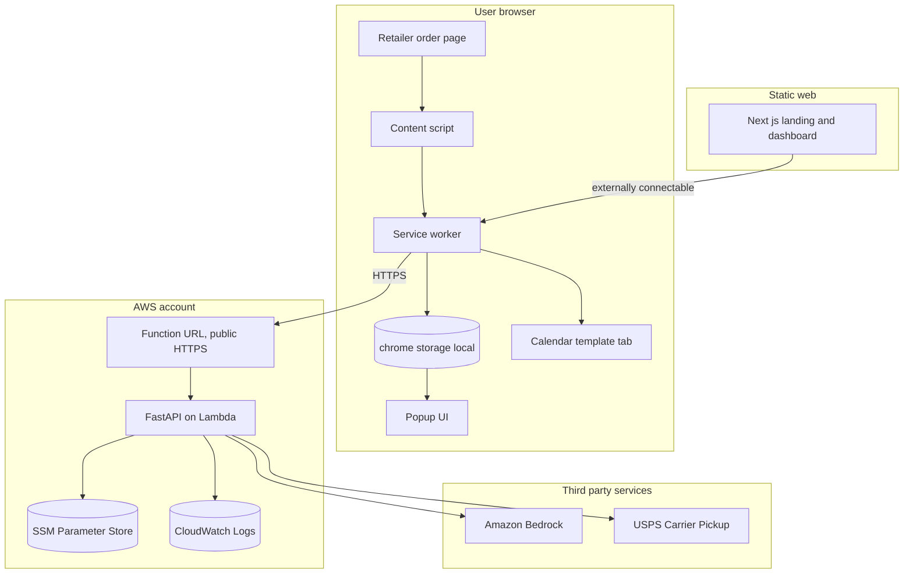
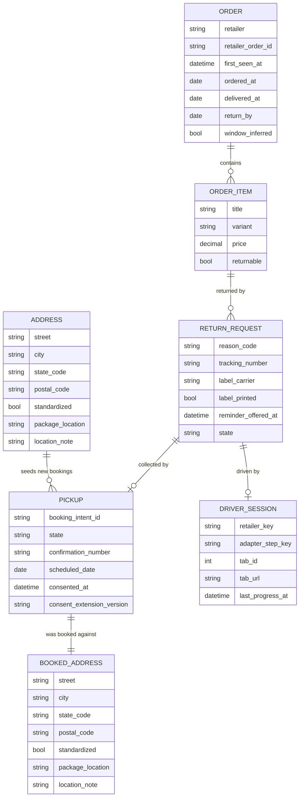
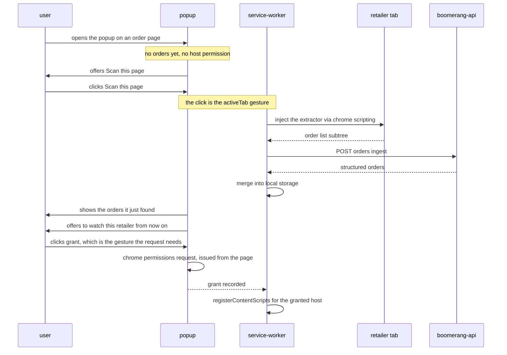
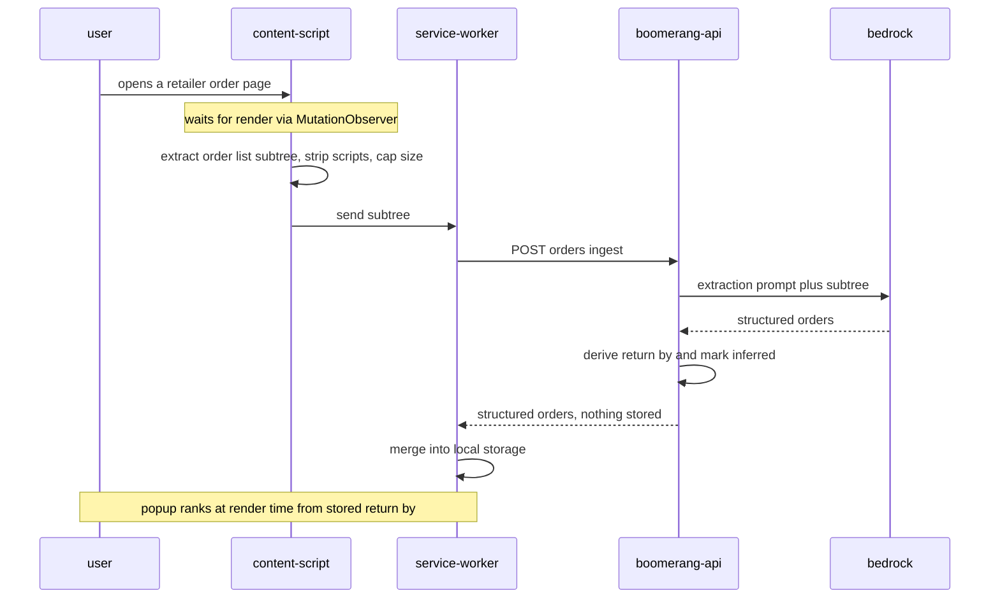
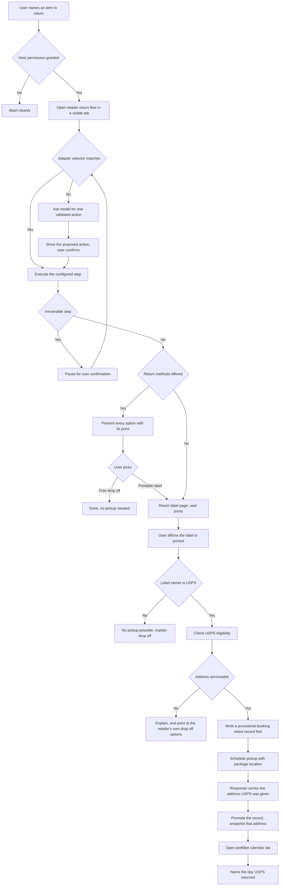
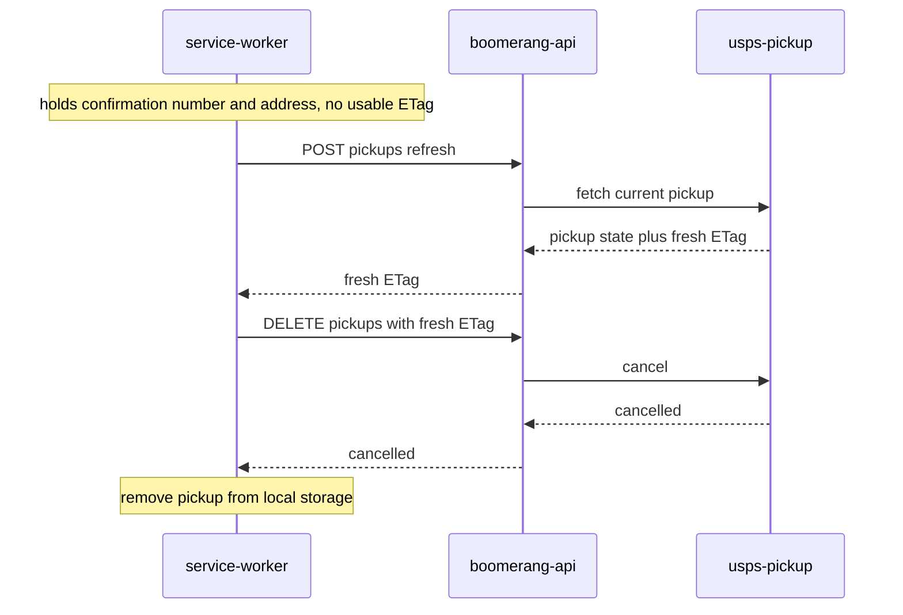
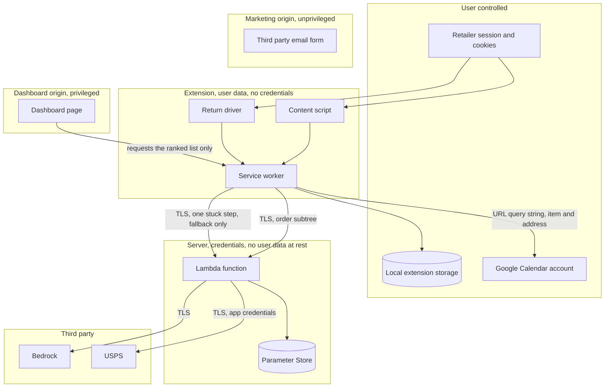
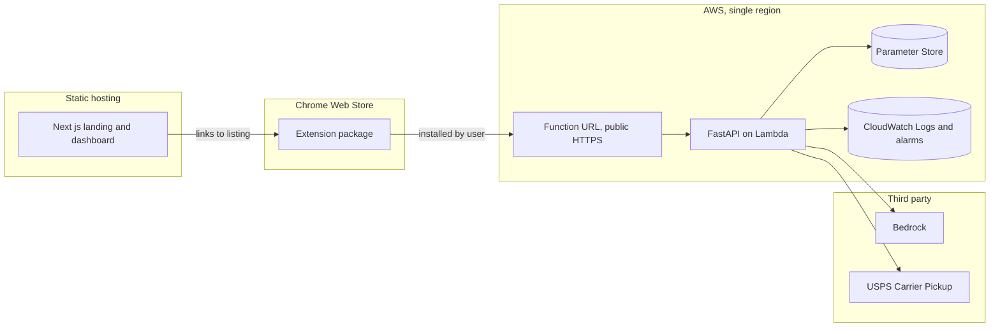

# Boomerang — High-Level Design

## 1. Overview

Boomerang is a reverse-logistics concierge. A Manifest V3 browser extension reads retailer order
pages the user is already viewing, a stateless FastAPI service on AWS Lambda parses them with
Amazon Bedrock and brokers USPS Carrier Pickup calls, and the user gets a printed return label,
a booked pickup, and a calendar reminder without visiting the retailer's site themselves.

The architecture is shaped by one fact established in
[`../docs/ARCHITECTURE.md`](../docs/ARCHITECTURE.md): **Boomerang holds no OAuth grant for any
user.** The backend has no independent path to user data and cannot act while the user is away.
Everything follows from that — no database, no background workers, no accounts, and all user state
living on the install rather than the server.

Requirements: [`boomerang-requirements.md`](boomerang-requirements.md). Decisions D1 through D7 are
settled in [`../docs/ARCHITECTURE.md`](../docs/ARCHITECTURE.md) and are treated here as given;
section 6 covers only the architectural decisions this document adds.

**Key technology choices at a glance:** WXT-built MV3 extension in TypeScript, FastAPI on AWS
Lambda behind a public Function URL, Amazon Bedrock for extraction, USPS Carrier Pickup for
collection, SSM Parameter Store for credentials, GitHub Actions and CloudWatch for operations. No
database, no VPC, no message queue.

---

## 2. Architecture Summary

Two properties of this diagram are load-bearing. The **only** arrow leaving the browser toward
Boomerang infrastructure is the service worker's HTTPS call — there is no other data path. And
**no arrow points back into the browser** from AWS: the server is incapable of initiating
anything.

---

## 3. Core Components

### 3.1 Browser Extension

The extension is the only component with access to user data. It reads pages, drives return flows,
owns all persistent state, and holds no credential of any kind.

| Subcomponent | Execution context | Responsibility | Communicates With |
|---|---|---|---|
| **Content script** | Isolated world, injected into the retailer tab | Recognises order pages, waits for render, extracts the order-list subtree, strips scripts and caps size | Retailer page DOM, service worker |
| **Retailer adapters** | Data in the extension bundle, read by the service worker | Per-retailer URL patterns, step selectors and return-method selectors; bundled into the extension build | Content script, return driver |
| **Return driver** | Service worker, acting on the tab through `chrome.scripting` | Walks the retailer return flow in a visible tab from configured selectors, pausing at irreversible steps and at the choice of return method | Retailer page DOM, service worker |
| **Action validator** | Service worker, before any injection | Checks every model-proposed action against the closed vocabulary before it touches the page | Return driver |
| **Service worker** | Extension background context | The only network egress point; calls the API, owns local storage, opens the calendar tab, requests host permissions | API, local store, popup, dashboard |
| **Popup** | Extension page, own origin | Primary surface; ranks orders by urgency **at render time**, starts returns, and offers **"Scan this page"** on the first run | Local store only |
| **Local store** | `chrome.storage.local`, reachable only from extension contexts | Orders, items, address, pickup confirmation numbers, and the return driver's session state | Service worker |

**The middle column is a security boundary, not a deployment note.** The content script is the only
subcomponent that shares a process with a retailer page, and it runs in Chrome's isolated world, so
the page can see the DOM it reads but not the code reading it. Everything that makes a decision —
validation, egress, storage — sits in the service worker, which no page script can reach: it is
addressable only over `chrome.runtime` messaging, and only from extension contexts and the one
origin §6.7 admits.

**The action validator specifically must not run in the page.** It is the component that decides
whether a model-proposed action is allowed to touch the DOM, and a retailer page that could reach it
could disable it — which would give the page's own content, laundered through the model, the ability
to authorise arbitrary actions inside the user's authenticated session. So the validator runs in the
service worker and the *result* of validation is what crosses into the tab, as a concrete
`chrome.scripting` call. The page never sees the proposal, the vocabulary, or the check.

**Why the extension owns state rather than the server:**
- Nothing the server could store would survive the absence of a grant to fetch it again.
- A server restart cannot orphan a real USPS booking if the confirmation number lives on the client.
- It removes a database, a backup story, and a category of privacy exposure from the design.

The mirror of that third point is stated in §4.3: the client can orphan a real USPS booking, and the
design has to say what it does about that.

#### The service worker is ephemeral; the return flow is not

Chrome terminates an MV3 service worker after roughly 30 seconds of inactivity. Three states in the
FR-3.3.9 machine — `AwaitingConfirm`, `AwaitingLabelChoice`, `LabelReady` — block on a human and
will routinely outlive it. Worker memory is therefore not somewhere state can live, and the design
does not put it there.

- **The return session is written to `chrome.storage.local` on every state transition.** The record
  carries the state, the item, the tab ID, the adapter and step position, and anything already
  obtained — `tracking_number`, `label_carrier`, the chosen return method.
- **The driver reconstructs its position from that record plus the current tab URL** when the worker
  restarts cold. If the tab is gone, or has navigated somewhere the adapter does not recognise, the
  session moves to `Stalled` and the user is told where it stopped. The driver never acts on a stale
  assumption about what is on screen.
- **A long-lived `runtime.connect` port from the driving tab keeps the worker alive while driving is
  active**, so the common case never pays the rehydration cost. The port is an optimisation; the
  persisted record is the correctness guarantee, and nothing depends on the port surviving.
- **Nothing resumes by itself.** A rehydrated session waits for the user, consistent with FR-3.3.3.
  There is no timer that carries a flow forward after a restart.

#### Retailer adapters ship inside the extension bundle

They are configuration — URL patterns and CSS selectors — but configuration that is executed against
pages inside the user's authenticated retailer session, which makes their origin a security question
rather than a packaging one.

Fetching selectors from the API was rejected. It would make the selector payload a new trust
boundary crossing, and a compromised or coerced server could then steer the driver at any element on
any retailer page, inside a live session, with the user's cookies attached — precisely the
capability §6.8 exists to deny the *model*. It would also read to a Chrome Web Store reviewer as
remotely configured behaviour, a category the store treats with suspicion.

**The consequence is stated rather than hidden: adapter update latency is store review latency.**
When a retailer changes its return flow, the fix is a new extension version and a review cycle,
typically days. That is the resilience story NFR-6.3 actually has, and §8.4 carries it into the
deployment model. Selector-first driving is what makes it survivable — a miss degrades to a
supervised model-proposed action rather than a broken flow — but it is a real limitation, and not a
comfortable one.

### 3.2 API Service

A stateless FastAPI application on AWS Lambda. It parses, ranks, brokers carrier calls, and holds
every credential in the system. It never initiates anything and stores nothing between invocations.

| Subcomponent | Responsibility | Communicates With |
|---|---|---|
| **Ingestion handler** | Order-page subtree to structured orders via Bedrock | Bedrock |
| **Window deriver** | Derives `return_by` and marks it inferred. Does **not** rank — ranking is a render-time concern on the client | none, pure computation |
| **Return step advisor** | Fallback only, when the retailer adapter has no matching selector. Proposes one action from a closed vocabulary via forced tool use | Bedrock |
| **Carrier broker** | USPS eligibility, schedule, refresh, cancel | USPS, Parameter Store |
| **Credential loader** | Fetches and caches USPS credentials at cold start | Parameter Store |

**Why Lambda:**
- The workload only exists while a user is present; there is nothing to keep warm between sessions.
- No state means no reason for a long-lived process.
- A Function URL supplies a stable HTTPS origin with a managed certificate, which the extension
  requires and which would otherwise mean an ALB, an ACM certificate and a domain.

### 3.3 Web Client

A Next.js application serving the landing page, the install funnel, and the dashboard. It is a
read-only view and never touches retailer page data, holds a credential, or calls a carrier.

Because the server is stateless, the dashboard obtains orders **from the extension** via
`externally_connectable` messaging, not from an API endpoint, and degrades to an install prompt
when the extension is absent.

### 3.4 External Services

| Service | Role | Failure Posture |
|---|---|---|
| **Amazon Bedrock** | DOM to structured orders; next-step reasoning for the return driver | Retryable; surfaces as `upstream-unavailable` |
| **USPS Carrier Pickup** | Eligibility, scheduling, cancellation | Eligibility, refresh and cancel are retryable; **the schedule call is not** — see §5.2. Eligibility failure is a normal outcome, not an error |
| **Google Calendar** | Receives a prefilled template URL opened in a tab | No integration to fail; a URL either opens or does not |

---

## 4. Data Models

### 4.1 Entity Relationships

Every entity below lives in `chrome.storage.local`, scoped to one install. The server holds none of
them.

There is no `INSTALL` entity. `chrome.storage.local` is already partitioned per extension per
browser profile, so an install identifier would restate what the storage boundary already
guarantees, and nothing in the system reads one. `ORDER` is the root of the graph.

### 4.2 Key Entities

| Entity | Purpose | Key Attributes | Relationships |
|---|---|---|---|
| **Order** | A purchase observed on a retailer page; the root of the graph | `retailer`, `return_by`, `window_inferred` | Contains items |
| **OrderItem** | A single returnable line | `title`, `price`, `returnable` | Belongs to an order, may have a return |
| **ReturnRequest** | An attempt to return one item; an item may have several over time | `reason_code`, `tracking_number`, `label_carrier`, `label_printed`, `reminder_offered_at`, `state` | Belongs to an item, may have a pickup |
| **Pickup** | A booked USPS collection, or an attempt to book one | `booking_intent_id`, `state`, `confirmation_number`, `scheduled_date` | Belongs to a return, owns one booked-address snapshot |
| **BookedAddress** | An immutable copy of the address a pickup was actually booked against | `postal_code`, `standardized`, `package_location` | Owned by exactly one pickup, never edited |
| **DriverSession** | The durable record of an in-progress return, rehydrated after the service worker is terminated | `retailer_key`, `adapter_step_key`, `tab_id`, `tab_url`, `last_progress_at` | Owned by at most one return request |
| **Address** | The current collection address, standardized by USPS, plus where the carrier should look | `postal_code`, `standardized`, `package_location` | Singleton in the store, seeds new bookings |

**`ADDRESS` is editable; `BOOKED_ADDRESS` is not, and they cannot be the same record.** USPS refresh
and cancel both take the address the pickup was booked against, and FR-3.4.6 requires storing the
confirmation number *and* that address. A single editable singleton cannot serve both roles: a user
who moves, or who corrects a typo, after booking would destroy the only copy of the address their
live pickup is registered under, and could no longer cancel it through the product. So the singleton
is the default that seeds a new booking, and the snapshot taken at schedule time — of USPS's own
standardized form, per FR-3.4.3 — is what refresh and cancel read. Editing the singleton afterwards
changes where the *next* pickup goes and leaves existing bookings exactly as USPS holds them.

**An item may have more than one return request, and this is not an edge case.** `Aborted` and
`HandedOff` are terminal, so a single-request cardinality would say that a user who abandons a
return — or finishes one manually — can never start another for that item, inside the window, on a
product whose entire purpose is that the item is returnable. The cardinality is `||--o{`, with one
invariant: **at most one return request per item may be in a non-terminal state**, and that one is
the current request every surface shows. Terminal requests are kept rather than overwritten, because
"you already tried this and stopped" is the context a user needs when they come back to it.

**`PICKUP` has a lifecycle, and the entity has to carry it.** `booking_intent_id` is generated locally and
written *before* the schedule call; `state` runs over `Booking`, `Confirmed`, `Cancelled`,
`Collected` and `Abandoned`. `confirmation_number` is therefore nullable — a pickup in `Booking` does not have one
yet, and may never get one if the response is lost. Two mechanisms elsewhere in this design need
predicates that only these attributes make expressible: §5.2's write-ahead booking intent *is* a
`PICKUP` in state `Booking`, and §4.3's eviction carve-out has to ask whether a pickup "has not been
cancelled or collected". Without `state` neither sentence has a schema behind it.

`Collected` is not observable. No component watches for the carrier, and there is no `GET /pickups`
to ask. It is set when the user says so, or inferred once the scheduled date is more than
`PICKUP_SETTLED_AFTER_DAYS` in the past — three days at the PoC — and it exists so that a completed
pickup eventually stops pinning an order against eviction. A pickup whose date has passed but which
was never confirmed collected is still safe to evict, because its confirmation number can no longer
be acted on.

**`Booking` needs a terminal exit, or the eviction carve-out becomes a leak.** A pickup stranded in
`Booking` by a lost response has no `confirmation_number` and no `scheduled_date` — so the
`Collected` inference above, which keys on that date, can never fire for it. It is also never
`Cancelled`, because there is no number to cancel with. Under an eviction rule that exempts anything
"not cancelled or collected", such a record pins its order forever and `MAX_STORED_ORDERS` stops
being a ceiling. A `Booking` record therefore moves to `Abandoned` after
`BOOKING_ABANDONED_AFTER_HOURS` — 24 at the PoC — or immediately when the user resolves it through
the enumeration §4.3's clear action already builds. `Abandoned` means "we never learned whether this
booked", which is the honest content of the record, and it is evictable. The eviction carve-out
reads *not cancelled, collected or abandoned*.

Five attributes carry design weight:

- **`window_inferred`** exists so that no surface can accidentally present a derived return window
  as authoritative. Concretely, an inferred window is shown as an approximation and is never given
  a bare date: the popup renders *"about N days left, estimated"* where a read window renders
  *"return by <date>"*, the estimate carries a one-line reason — the retailer's standard policy
  window applied to the order date — and it is still ranked, because a policy-derived estimate is a
  far better warning than none. What it must never do is read like a fact the retailer stated. The
  distinction has a cost attached: a user who misses a deadline because we presented a guess as a
  date loses the refund.
- **`label_carrier`** exists because a printed label is not enough for a USPS pickup — the postage
  must be USPS postage. A prepaid UPS label on the box produces a booking nobody honours, and the
  user finds out by watching the box sit there.
- **`package_location`** holds a carrier-neutral value, not a USPS field value, because UPS is a
  planned fast-follow and the three carriers' vocabularies do not align. `mailbox` in particular is
  legally exclusive to USPS.
- **`BOOKED_ADDRESS.package_location`** is snapshotted alongside the address for the same reason the
  address is. It is part of what the carrier was told, so it is part of what a refresh or a
  cancellation has to reproduce.
- **`BOOKED_ADDRESS.standardized`** records whether the snapshot came from USPS's own standardized
  form or from the client's provisional copy. The two are not interchangeable, and §5.2's lost-
  response path can leave a snapshot that was never standardized. A refresh or cancel against an
  unstandardized snapshot is surfaced to the user for confirmation rather than attempted silently.

**`DRIVER_SESSION` is the entity behind §3.1's correctness guarantee.** `RETURN_REQUEST.state` holds
the *name* of the state and nothing about where the driver is standing, which is not enough to
resume: rehydration needs the adapter, the step within it, and the tab. `tab_url` is stored
alongside `tab_id` because a tab ID alone cannot be validated after a restart — the tab may have
been closed and its ID reused, or navigated elsewhere, and comparing the URL is what turns "the tab
exists" into "the tab is still the one we were driving". `last_progress_at` is what makes a session
that will never resume identifiable as such. Since MV3 terminates an idle worker after roughly
thirty seconds, this record's durability is load-bearing rather than incidental.

**Nothing stores a countdown.** Days remaining is computed from `return_by` at render time. The
popup reads from local storage with no network call, so a stored urgency figure would silently
decay and the product's core signal would be stale exactly when it mattered most.

### 4.3 Data Lifecycle

**Created** when a user visits an order page and the extension merges the parsed result into local
storage, keyed on retailer plus retailer order ID so revisits update rather than duplicate.

**Updated** as the return progresses through its state machine, and when a pickup is booked.

**Evicted** oldest-first once the configured retention ceiling is reached — **except** for any order
carrying a return in a non-terminal state or a pickup that has not been cancelled, collected or
abandoned.
Those are never evicted, regardless of age. Eviction orders on ingestion time, recorded when the
order first enters the store, because `ordered_at` and `delivered_at` are page-extracted and may be
absent or wrong.

**Deleted** entirely by a user-initiated clear action, and implicitly when the extension is
uninstalled or the browser profile is removed. There is no server-side copy to also delete, and no
deletion request to service.

**Deletion is the one place where local-only state is dangerous, and it needs a carve-out.** A USPS
pickup is a real commitment: a carrier will arrive at the user's home. The extension holds the only
record of it — the design deliberately keeps no identifier the server could use to look one up, and
there is no `GET /pickups` — so an eviction or a bulk clear that removes the last copy of a
`confirmation_number` leaves a booking that the user can no longer cancel through Boomerang at all.
Their remaining option is USPS by telephone.

Therefore:

- Eviction skips orders with a live return, or a pickup that is neither cancelled, collected nor
  abandoned, as above.
- The clear action does not silently proceed when live bookings exist. It enumerates them and offers
  to cancel them first; if the user clears anyway, the confirmation numbers and their scheduled
  dates are shown one last time so they can be kept.
- Booking confirmation copy tells the user the confirmation number is theirs to keep, rather than
  implying Boomerang can always retrieve it.

This is the client-side mirror of the property §3.1 claims for the server — "a server restart cannot
orphan a real USPS booking" — and it is only true of the client once these rules exist.

**Never persisted at all:** raw page DOM and the structured result on the server side. Both are
transient within a single invocation.

**Deliberately not stored long-term:** the USPS `ETag`. It is valid for one hour or one use, so a
cancellation the following day refreshes the pickup to obtain a current one rather than presenting
a stale token.

---

## 5. Data Flows

### 5.1 Order Ingestion

Ingestion has two shapes, and the first run is the one that constrains the design. `activeTab`
grants access to a page **only on a user gesture**, so on a freshly installed extension there is no
content script running on page load and nothing to ingest. The first scan has to be something the
user clicks. FR-3.7.2 calls this the thing without which the product cannot start.

**First run — the gesture path:**

The order of those last three steps is the whole of FR-3.7.2. The standing permission is requested
**after** the user has seen the product work once, on a page they were already looking at, with
results in front of them — not at install time against an empty popup. Two Chrome constraints make
this the only available shape: `chrome.permissions.request` must itself be called from a user
gesture, and `chrome.scripting.registerContentScripts` is what converts a granted host permission
into automatic ingestion on later visits.

**The request has to be issued by the popup, not by the service worker.** A worker has no user
gesture to spend — a message forwarded to it from the click does not carry one, and
`chrome.permissions.request` rejects. Only the registration that follows a granted permission
belongs in the worker. This is a placement constraint rather than a policy one, and it is the
reason the popup appears in the sequence above as the caller rather than as a relay.

Declining the grant is a supported end state, not an error. The extension keeps working exactly as
it did on the first run — every scan is a click — and does not re-prompt on a schedule.

**Steady state — once the retailer is granted:**

### 5.2 Return and Pickup

The two pauses in this flow are not the same kind of pause. Confirming an irreversible step
protects the user from the agent being wrong. Presenting the return methods protects the user from
the agent being *expensive* — on Amazon the printable label is often a paid deduction while the QR
drop-off is free, so an agent that auto-selects "printable" to satisfy its own pickup precondition
would be spending the user's refund to reach a feature they never asked for.

#### A model-proposed action is always confirmed

The flow pauses at irreversible steps, but *irreversibility is a property the adapter knows* — it is
configured per retailer alongside the selectors. On an adapter miss the driver has, by definition,
no configured knowledge of the step it is looking at, which is exactly the case where the model is
proposing the action. The safety property would be weakest precisely where the model has the most
control.

So the rule is not "pause at irreversible steps" but **"pause at irreversible steps, and at every
model-proposed action."** The user sees the proposed action in plain language — what will be
clicked, what will be typed — and confirms it before it touches the page. This is deliberately more
friction than the configured path: a miss means Boomerang does not know where it is, and the honest
response to not knowing where you are is to ask.

The closed vocabulary of §6.8 constrains the *form* of the action. This constrains its *execution*.
Neither is sufficient alone.

#### How `label_carrier` is determined

`label_carrier` gates the entire pickup path, so where it comes from has to be stated. FR-3.1.3
forbids *transmitting* the label page — it carries the tracking number and the return address — but
it does not forbid reading it in the browser, and the distinction is what makes this tractable.

In order of preference:

1. **From the return method the user chose.** Under FR-3.3.4 the user explicitly picks a return
   method from options the adapter presented, and the adapter knows which option yields which
   carrier's postage. This is the primary source: it is already confirmed by the user, it needs no
   label-page parsing, and it is available before the label page is even reached.
2. **From adapter-configured recognition on the label page, client-side.** Carrier branding and the
   tracking-number format are both on the page. The content script reads them locally; nothing is
   transmitted.
3. **By asking the user.** "Whose label is this?" is a question a person holding a printed label can
   answer in one glance.

**When the carrier cannot be determined, the flow does not schedule.** Defaulting to USPS would
produce exactly the silent failure `label_carrier` exists to prevent — a booking nobody honours,
discovered when the box is still on the porch and the window has closed. The return still completes;
it just completes as a drop-off.

#### The snapshot has to come back from the server, not from the client

`BOOKED_ADDRESS` exists so that a refresh or a cancellation can reproduce the address USPS holds.
That makes its provenance load-bearing, and the obvious implementation gets it wrong: the client
already knows an address, so it is tempting to snapshot that one. But FR-3.4.1 requires an
eligibility call before *every* schedule call, and FR-3.4.3 requires the standardized form to be
what is submitted — so the address USPS is actually given is produced **server-side, at schedule
time**, and the client has never seen it. A locally written snapshot can therefore differ from what
the carrier holds, in exactly the field both refresh and cancel key on. The fix for an orphaned
booking would itself orphan the booking.

So `POST /pickups` returns the standardized address it submitted, alongside the confirmation
number, the ETag and the scheduled date, and the write happens in two steps:

- **Before the call**, the client persists a provisional record: a `PICKUP` in state `Booking` with
  a locally generated `booking_intent_id` and its own best-known address, marked `standardized = false`.
  This is a recovery aid, not a snapshot — it exists so a lost response leaves evidence.
- **After the response**, the client promotes the record to `Confirmed` and overwrites the snapshot
  from the address the server returned, with `standardized = true`.

This is the one place a `BOOKED_ADDRESS` is ever written twice, and the second write is the
authoritative one. A record still carrying `standardized = false` is a record whose address was
never confirmed against USPS, which is why §4.2 makes a refresh or cancel against one ask the user
first rather than proceed silently.

#### A lost schedule response, and why there is no idempotency key

`POST /pickups` books a real carrier visit. If the call succeeds at USPS but the response never
arrives — a 60-second Lambda timeout, a dropped connection — the client has no confirmation number,
and there is no `GET /pickups` to discover the booking with, because lookup requires the very number
that was lost.

A server-side idempotency key cannot fix this. Deduplicating on a key means remembering keys, and
the server remembers nothing between invocations by design; adding a store for this one purpose
would trade the design's central property for one failure path. So the mitigation lives on the
client, which does have durable state:

- **The extension writes a booking intent record before it calls.** A `PICKUP` in state `Booking`,
  carrying a locally generated `booking_intent_id` and a provisional, unstandardized address, is persisted
  first. See the preceding subsection for why that address is provisional and not the snapshot.
- **A lost response leaves that record in `Booking`, and the UI says so honestly** — "we could not
  confirm this went through" — rather than showing either a success or a clean failure.
- **The client never retries the schedule call automatically.** `upstream-unavailable` is not
  blanket retry-safe; see §5.4.
- **Recovery is a user-visible path, not a silent one.** The user is told a pickup may exist at
  their address for that date and how to confirm it with USPS directly.

The residual risk is real and is not fully closed here: whether USPS rejects a second same-address,
same-date request outright, or books a duplicate, has to be confirmed against the live API before
this path is built. It is recorded as an open question in §11.

#### The reminder is offered, not created, and the record has to say so

Boomerang opens a prefilled Google Calendar tab. It never learns whether the user pressed Save —
there is no scope, no callback and no read path, by design. So `reminder_offered_at` records what
actually happened: *we opened the tab*. Nothing in the system may record, display or reason about a
reminder *existing*.

The distinction is not pedantic. A record that claims a reminder exists produces a confirmation
screen saying the user will be reminded, for a user who closed the tab without saving — and the
failure surfaces as a box still sitting inside the front door on collection day. So the copy after
the tab opens describes what was offered, not what was created, and if the user returns to the
pickup later the extension offers the reminder again rather than showing it as done. Offering twice
is cheap; claiming a reminder that does not exist is not.

**The `.ics` fallback of FR-3.5.3 lives here.** Not every user is on Google Calendar, and the
template URL is Google-specific. The extension therefore also offers a downloadable `.ics` file,
generated locally from the same fields — it needs no network call, no scope and no third party, and
it is the only calendar path that sends nothing anywhere. It sets `reminder_offered_at` on the same
terms: a downloaded file is not an imported event, and we cannot see the difference.

#### When the prices cannot be read

FR-3.3.4 requires presenting each return method with its price, and §11 keeps open whether the
driver can always read one. The design needs a branch for when it cannot, because the alternative —
presenting methods without prices as though they were free — is the specific harm §5.2 exists to
prevent, on Amazon in particular, where the printable label is often a paid deduction.

- **Methods with unreadable prices are presented with the price shown as unknown, and labelled as
  such.** They are not hidden: a hidden free option is as expensive a mistake as a mispriced one.
- **The agent never selects one on the user's behalf when any price in the set is unknown**, even if
  a pickup would otherwise be possible. The precondition for a USPS pickup is a printed label, and
  auto-selecting "printable" to satisfy our own feature while its cost is unknown is spending the
  user's refund to reach a feature they did not ask for.
- **The user is told that the page did not state the prices**, which is a fact about the retailer's
  page rather than an error, and is pointed at the page they are already looking at.

The residual is honest: a user who cannot see prices makes a less informed choice than one who can.
That is strictly better than a confident wrong number, and it is visible to us as an adapter-health
signal in the §6.8 sense — a retailer whose prices stop being readable has changed its flow.

#### Cancelling a pickup does not cancel the return

A cancelled `PICKUP` leaves a real, printed label and a real box. §5.3 removes the pickup; it must
not remove or terminate the `RETURN_REQUEST`, which stays at `LabelReady` — where it has been for
the whole life of the pickup, since FR-3.3.6's print affirmation writes the `label_printed` field
without moving the state. From there the user can schedule another pickup or drop the box off, and
the return reaches `LabelPrinted` when the box actually goes.

**The pickup lifecycle runs alongside the return machine and touches it exactly once.** Scheduling
is not a transition and cancelling is not a transition; the single point of contact is a refresh
that reports the carrier already collected, which moves the request to `LabelPrinted` because the
box has left. Anything else a pickup does — booked, abandoned, cancelled — is a fact about the
`PICKUP` record alone. This is worth stating because the obvious implementation invents a return
state per pickup outcome, and two lifecycles in one field is how a cancelled pickup ends up looking
like a finished return.

Terminating the return alongside the pickup would be the more obvious implementation and the wrong
one: it would drop the item out of the ranked list while the return window is still running, which
is exactly the silent-deadline failure §7.4 treats as an attack when a page causes it. We should not
build it as a feature.

#### Ineligibility, and what the design can honestly offer

When eligibility returns a negative, FR-3.4.2 asked for "the nearest drop-off location" and "a
priced alternative with the price stated". **Neither is deliverable, and the requirement has been
narrowed rather than left as an aspiration.** No component in this design sources drop-off
locations: there is no locations API in the carrier broker and no such endpoint anywhere. And paid
pickup products are explicitly out of scope in the requirements' own scope section, so a "priced
alternative" contradicts the boundary the same document draws.

What the design can deliver, and now says: the address is not serviceable for free carrier pickup,
the return is still valid, and the retailer's own return page — which the user is already looking at
— lists where to drop it off. Boomerang points at that rather than pretending to a locations
capability it does not have. Sourcing drop-off locations is recorded in §10 as deferred.

### 5.3 Cancellation

The stored `ETag` is assumed stale. Cancellation is always a two-step refresh-then-delete.

### 5.4 Failure Paths

| Failure | Behaviour | User-visible outcome |
|---|---|---|
| Page not recognised | Server returns `unrecognized-page`; nothing stored | Silent; ingestion simply does not happen |
| Bedrock unavailable | Returns `upstream-unavailable`; the extension retries **read-only** calls with backoff, never the schedule call | "Could not read this page, try again" |
| Payload over ceiling | Rejected before transmission by the extension | Silent; logged locally |
| No host permission yet | Not a failure. `activeTab` cannot inject on load, so the popup offers "Scan this page" | The first scan is a click; the standing grant is offered after it works |
| Host permission declined | Supported end state; every scan stays a click | No nagging, no degraded messaging |
| Service worker terminated mid-flow | Session was persisted on every transition; driver rehydrates from storage plus the tab URL | Invisible if the tab is intact |
| Driving tab closed or navigated away | Session cannot be reconstructed; moves to `Stalled` | "We stopped at the reason-code step — continue from here" |
| Adapter selector misses | Driver falls back to one model-proposed action, **shown to the user for confirmation first**; the fallback request carries retailer, step and steps-driven so a miss rate is computable — §6.8 | An explicit "about to click X — OK?" prompt |
| Return flow DOM unrecognised | Driver stops, leaves the tab open at the current step | "Continue from here manually" |
| Model proposes an out-of-vocabulary action | Validator rejects it and treats it as `report_stuck` | "Continue from here manually" |
| Only a QR code offered | Not a failure. Flow ends at `DroppedOff` | "This one's a free drop-off — the retailer's page shows where" |
| Label is not USPS postage | Server rejects the schedule call with `wrong-carrier-label` | "This one needs dropping off — it's a UPS label" |
| Address not serviceable | Eligibility returns a normal negative, not an error | "No free pickup at your address — drop it off, the retailer's page shows where" |
| Label carrier cannot be determined | No schedule call is made; never defaults to USPS | "Whose label is this?", then drop-off if still unknown |
| Schedule response lost in flight | Local intent record stays in `Booking`; no automatic retry | "We could not confirm this went through" plus how to check with USPS |
| Package location unservable by carrier | Re-ask with the reduced set; never substitute | "UPS can't use a mailbox — where else?" |
| Eligible at the offer, ineligible at the schedule call | The schedule call is the authority; the offer is not a reservation. Return stays at `LabelReady`, no pickup record is kept | "USPS can't collect from your address after all — the label is still good for drop-off" |
| Return method prices unreadable | Methods presented with price shown as unknown; nothing auto-selected | "The page didn't show the prices — pick from these" |
| Calendar tab fails to open | `reminder_offered_at` is not set; the `.ics` download is offered instead | "Couldn't open Calendar — download the reminder instead" |
| User closes the calendar tab without saving | Indistinguishable from saving, by design. Only the offer is recorded | The reminder is offered again next time the pickup is opened |
| Pickup cancelled | Pickup removed; the return stays at `LabelReady`, not moved to a terminal state | "Pickup cancelled — the label is still good, drop it off or book again" |
| Cancel finds the box already collected | No cancel is attempted; the pickup reads `Collected` and the return moves to `LabelPrinted`, its FR-3.3.9 terminal for the box having left | "The carrier already picked this up — nothing left to cancel" |
| Label not confirmed printed | Server rejects the schedule call | "Print the label first" |
| Reserved concurrency saturated | Requests are throttled at the platform level | "Busy, try again in a moment" |
| ETag expired mid-flow | Returns `etag-expired` | Transparent; the client refreshes and retries |
| Lambda cold start latency | Request simply takes longer | A spinner, no failure |
| USPS access not yet granted | Mock adapter serves the same interface | Full flow works in development |

There are no queues, no dead-letter handling, and no retry workers, because there is no
asynchronous work anywhere in the system. Every operation is a synchronous request made while the
user is watching.

---

## 6. Key Design Decisions

D1 through D7 in [`../docs/ARCHITECTURE.md`](../docs/ARCHITECTURE.md) are settled and not
re-argued here. The decisions below are the ones this document adds.

### 6.1 Serverless compute with no VPC

**Decision:** FastAPI on AWS Lambda behind a public Function URL, running outside any VPC.

**Rationale:**
- The workload is bursty and only exists while a user is present. There is nothing to keep warm.
- With no database there is nothing private to reach, so a VPC buys no isolation.
- Bedrock, USPS and Parameter Store are all reached over public or AWS-service endpoints. Placing
  the function in a VPC would require a NAT Gateway purely to reach USPS — roughly $32 a month plus
  data charges, to protect nothing.
- A Function URL provides a managed TLS certificate on a stable origin, which the extension needs.
  An ALB path would add a certificate, a domain and a Route 53 record.

**Consequence, stated plainly:** this supersedes the existing `infra/` Terraform. The scaffolded
VPC across two availability zones, the EC2 instance, and the security group are all unnecessary
under this design. The `allowed_cidr` validation and the two-AZ floor recorded in
`infra/AGENTS.md` become moot along with them. See section 11.

**Alternatives considered:**

| Alternative | Why not |
|---|---|
| EC2 behind an ALB, as scaffolded | Keeps existing Terraform but needs an ALB, ACM certificate and domain that do not exist yet, and pays for an idle instance to serve traffic that only occurs when a user is present |
| Fargate behind an ALB | Preserves the container story from docker-compose, but carries the same ALB and certificate work and the same idle cost |
| Lambda inside a VPC | A NAT Gateway to reach a public carrier API, for isolation that protects no private resource |

### 6.2 A public endpoint with no user authentication

**Decision:** the Function URL uses auth type `NONE`. Abuse is mitigated by a computable spend
ceiling rather than by authenticating users.

**Rationale:**
- There is no user identity in the system to authenticate. Introducing one would mean accounts,
  sessions and stored PII, all of which this design deliberately excludes.
- A browser extension cannot hold an AWS credential to sign requests, so `AWS_IAM` is unavailable.
- Any secret shipped inside the extension bundle is readable by anyone who unzips it, so a shared
  key is a speed bump, not a control.

**This is the weakest point in the architecture and is named as such.** An unauthenticated endpoint
that invokes Bedrock is a cost-amplification target: an attacker who finds the URL can run up a
model bill. Mitigations in this design:

| Control | Effect |
|---|---|
| CORS allowlist of one pinned `chrome-extension://` origin | Stops browser-based abuse; forgeable by any non-browser caller |
| Hard payload ceiling, 256 KB | Bounds the cost of any single request |
| `max_tokens` of 4096 and a 60 s timeout | Bounds the cost of any single request from the other end |
| `reserved_concurrent_executions` of 5 | **The actual ceiling.** Bounds total spend per unit time, with no shared state required |
| Alarm on Bedrock `InputTokenCount`, plus an AWS Budget | Detects spend the above miss |
| Alarm on Lambda `Throttles` | Detects saturation, which the spend alarm structurally cannot |

**One exposure here is not about spend, and it is easy to miss.** FR-3.4.4 has the server reject a
schedule request whose `label_printed` is false or whose `label_carrier` is not USPS. Both fields
arrive in the request body, from the caller they are checking, and the server holds no state that
could contradict either — so these are client-integrity checks that catch our own bugs and malformed
requests, not enforcement. The residual is that a forged request books a real carrier visit to a
real address for a box with no postage on it. That costs nothing in Bedrock tokens and trips none of
the controls above; reserved concurrency bounds only how *often* it can happen. It is stated here
rather than described as prevented.

**Two controls named in an earlier draft were removed because they cannot be built here.**

*Per-source rate limiting* requires counting requests per caller across invocations, which requires
shared state — and section 6.3 removes every datastore from the design. Lambda Function URLs have
no built-in throttling either, and AWS WAF does not attach to them: it supports CloudFront, ALB,
API Gateway, AppSync and Cognito only. Adding WAF therefore means putting CloudFront in front of the
function, which is a real change, not a checkbox.

*A "Bedrock spend alarm"* is not a thing that exists. There is no real-time spend metric to alarm
on; billing metrics lag by hours. The buildable equivalent is an alarm on `InputTokenCount`, which
is real-time and proportional to cost, backed by an AWS Budget for the daily figure.

#### Multiplying the ceiling out, because a ceiling nobody has computed is not a ceiling

The point of reserved concurrency is that its worst case is calculable in advance. It is worth
actually calculating, because the result is larger than the phrase "spend ceiling" suggests and it
changes what the alarm thresholds should be.

A 256 KB payload of retailer HTML is on the order of **65,000 input tokens** at roughly four
characters per token. Output is capped at 4,096. So one worst-case request is about 65 K in and 4 K
out.

The rate is where the intuition fails. **Concurrency bounds how many run at once, not how many run
per hour** — a slot that frees in five seconds is reused eleven more times in the minute a slower
request would have occupied it. Two bounds, then:

| Per-request latency | Requests per hour | Input tokens per hour |
|---|---|---|
| 60 s, the timeout | 300 | ~20 M |
| 5 s, a fast parse | 3,600 | ~234 M |

At Opus-class list pricing — order of $15 per million input tokens; confirm the current figure
against the Bedrock price list before relying on it — that is roughly **$300 per hour** at the slow
end and **$3,500 per hour** at the fast end. *Faster responses make the ceiling worse*, which is the
opposite of the usual intuition and the reason this is written out rather than asserted.

**So the Budget threshold is derived from legitimate use, not from the ceiling.** PoC traffic is a
handful of installs producing at most a few dozen ingests a day — dollars, not hundreds of dollars.
A **daily budget alert at $20** therefore sits an order of magnitude above anything real use will
produce and roughly two orders of magnitude below one hour of the fast-path abuse case, which is the
separation an alert needs to be worth waking up for. The `InputTokenCount` alarm carries the
real-time half, since the Budget lags by hours; its threshold follows the same reasoning — set it
just above the busiest legitimate hour, not just below the ceiling.

**What none of this buys is availability** — a caller who saturates those five slots denies service
to real users while spending almost nothing. That is an acceptable trade for a PoC and an
unacceptable one for a launch, which is why section 11 keeps the question open.

**And that failure mode is invisible to every spend control above, which is why `Throttles` is
alarmed separately.** Reserved concurrency works by rejecting invocations once the five slots are
full, so a saturation attack produces a flat `InputTokenCount` and a flat bill — the spend alarm is
silent precisely when the outage is happening. The `Throttles` metric is the only signal that
distinguishes "nobody is using it" from "everybody is being turned away", and without it the design
has a control whose success and whose failure look identical from the console.

### 6.3 All persistent state on the client

**Decision:** orders, addresses and pickup confirmation numbers live in `chrome.storage.local`. The
server persists nothing.

**Rationale:**
- Without a grant, the server cannot re-derive anything it loses, so server storage is a liability
  rather than a cache.
- It removes a database, its backup and restore story, and a standing body of user data from the
  system entirely.
- A restart or redeploy cannot orphan a live USPS booking.

**Alternatives considered:**

| Alternative | Why not |
|---|---|
| SQLite on the instance | Requires a persistent instance, which the compute decision removes; also reintroduces user data at rest server-side |
| Managed database | Cost and operational surface for data that the client already holds |
| In-memory on the server | A restart would orphan real USPS bookings the user could then cancel only by telephone |

**Cost:** no cross-device sync, and the dashboard must be fed by the extension rather than by an
endpoint.

### 6.4 WXT for the extension

**Decision:** build the Manifest V3 extension with WXT.

**Rationale:**
- It generates the manifest from configuration, keeping `optional_host_permissions` and
  `externally_connectable` in one reviewed place rather than hand-edited JSON.
- File-based entrypoints map directly onto the content script, service worker and popup that the
  requirements already describe.
- Hot reload materially shortens the loop on the return driver, the component that will need the
  most iteration.

**Alternatives considered:** Vite with CRXJS offers more control but has historically lagged
Manifest V3 changes and needs a hand-written manifest; plain esbuild means owning the manifest, the
build and the reload loop for no gain at this size.

### 6.5 Credentials in SSM Parameter Store

**Decision:** USPS credentials are `SecureString` parameters read at cold start via the execution
role and cached for the warm lifetime of the container. Bedrock uses the execution role directly.

**Rationale:**
- The secret never enters Terraform state, which is a plaintext file retained across every
  historical version.
- Free at this scale with the AWS-managed KMS key.
- Satisfies the existing repository rule against placing credentials in a `tfvars` file.

**Alternatives considered:** Lambda environment variables are encrypted at rest but place the
plaintext in Terraform state and expose it to anyone able to describe the function; Secrets Manager
adds paid rotation that USPS credentials cannot use.

### 6.6 A pinned extension identity

**Decision:** the manifest carries a generated public `key`, fixing the extension ID across
unpacked development loads, CI builds, and the published listing. The private half is a secret,
never in the repository — §8.4 names where it lives.

**One key per environment, not one key overall.** §8.2 gives `dev` and `prod` separate Function URLs
and separate CORS allowlists, and a single shared key would give every developer's unpacked build
the published extension's ID — which would put it inside the production allowlist. Two pinned keys
keep both IDs stable, which is all this decision needs; what it does not need is for them to be the
same ID.

**Rationale:**
- Without it, Chrome derives the extension ID from the packing key, so the ID differs between every
  developer's unpacked load and the store build.
- Section 6.2's only browser-side control is a CORS allowlist naming one `chrome-extension://`
  origin. A nondeterministic ID makes that allowlist unwritable — you would either allow all
  extension origins, which is no control at all, or break local development.
- It also makes `externally_connectable` on the dashboard side stable, and keeps CI able to produce
  a build that behaves identically to a developer's.

**Cost:** one more secret to manage, and losing it means a new extension ID and a new listing.

### 6.7 The dashboard is a real static site on a fixed origin

**Decision:** the Next.js client builds with `output: "export"` and is served from a fixed
production hostname. The extension's `externally_connectable.matches` lists exactly that origin plus
`http://localhost:3000/*` for development.

**Rationale:**
- `externally_connectable.matches` accepts only concrete host patterns; a bare wildcard is rejected
  at manifest load. There is no way to defer the hostname past packaging.
- The client has no server-side work to do — it renders static content and talks to the extension —
  so a static export removes a hosting runtime the design has no other use for.
- docker-compose keeps the dev server for local work; nothing about the production artifact depends
  on it.

**Consequence:** choosing the production hostname is now a prerequisite for shipping the extension,
not a later detail. It is unresolved — see section 11.

**That origin is privileged, and nothing else may share it.** `externally_connectable` is granted to
an *origin*, not to a page: every script that origin loads can message the extension and read the
user's complete order history. The email capture form in §9 is a third-party embed, and putting it
on the dashboard origin would hand the vendor — or anyone who compromises the vendor's CDN — read
access to every order Boomerang has ever seen for that user. Two individually reasonable decisions
combine into a real exposure.

Therefore:

- **The marketing site and the dashboard are separate origins.** The email form lives on the
  marketing origin, which is *not* in `externally_connectable.matches`. Only the dashboard origin is
  listed.
- **There is no exception for embedding it as an iframe.** An earlier draft allowed one on the
  grounds that a cross-origin frame does not execute in the dashboard's context. That is true and
  beside the point: the form belongs to the pre-install funnel and the dashboard is a post-install
  surface, so the case for putting it there never arises. A conditional exception that nothing needs
  is a conditional exception someone will later satisfy.
- **The extension's message surface is narrow and enumerated.** The dashboard requests the ranked
  order list it renders; the extension serves that and nothing else. There is no general-purpose
  "read storage" message, so the blast radius of a compromised dashboard origin is bounded by what
  the dashboard was going to display anyway.
- **Every `onMessageExternal` handler checks `sender.origin` before doing anything else.** Listing
  an origin in `externally_connectable.matches` decides which origins Chrome will *deliver* from; it
  does not tag the message with a verified caller for us. The `sender` on each message carries the
  origin, and comparing it against the one shipped constant is what turns the manifest entry into an
  enforced check. A handler that trusts delivery alone is one manifest edit away from serving the
  order list to whatever else gets listed later.
- **The extension declares `content_security_policy.extension_pages`.** The popup is the privileged
  surface of §7.4 — it holds every order the user has and it can message the service worker — and
  MV3's default policy for extension pages is only as tight as the default. Declaring it explicitly
  makes the popup's script policy a reviewed line in the manifest rather than an inherited one, and
  it is the second half of the escaping rule: escaping stops injected markup from being parsed as
  markup, and the policy stops any that slips through from loading or executing anything remote.
- **No third-party script on the dashboard origin, enforced by CSP.**

### 6.8 The model gets a closed action vocabulary, and is the exception rather than the loop

**Decision:** the return driver executes from configured selectors and calls the model only when no
selector matches. Every Bedrock call in the system uses tool calling with a forced tool choice, and
the extension validates the returned action against a closed vocabulary — `click`, `select_option`,
`fill`, `pause_for_user`, `report_stuck` — before executing it.

**Rationale:**
- **It is a security boundary, not a convenience.** The model reasons over DOM from a third-party
  page, which is attacker-influenced input. A page can carry text engineered to steer it. With a
  closed vocabulary validated client-side, a successful injection can at most produce a wrong click
  on a page the user is watching; it cannot express a navigation, a fetch, or an exfiltration.
- **It removes free-text parsing entirely.** Structured output arrives by construction rather than
  by regex over prose, so there is no parser to be wrong.
- **It keeps the common path off the network.** Calling the model per step would send the whole
  return flow — including pages carrying tracking numbers and the return address — to a server whose
  stated contract is that it receives an order-list subtree and nothing else.

**`fill` is the member of the vocabulary that needs its own bound.** The other four carry no
attacker-chosen payload: `click` and `select_option` name an element or an option that already
exists on the page, and `pause_for_user` and `report_stuck` end the turn. `fill` writes a string the
model produced — derived from page text — into a field inside the user's authenticated retailer
session, which is the one action in the set that can carry content rather than just direct
attention. So it is constrained on three axes:

- **Target.** The preferred form takes a field the adapter has declared fillable, by key rather than
  by selector. The model chooses among a list we wrote; it does not name an arbitrary element.
- **Length.** A per-field maximum, with a low global ceiling behind it. Return-reason free text is a
  sentence, not a document; nothing legitimate needs kilobytes.
- **Character class.** An allowlist per field kind, so a field expecting free text does not accept
  control characters or markup, and a field expecting a number accepts digits.

The residual is stated: an adapter miss means there is no declared field, and the fallback then
accepts a selector-targeted `fill` under the same length and character bounds plus confirmation.
That is weaker, and it is the price of the flow continuing at all when an adapter is stale.

**Limits, stated honestly:** this constrains the *form* of an action, not whether it is the right
one, so the human confirmation at irreversible steps stays load-bearing. And it does nothing to
reduce what is *sent* to the model; that is the minimisation contract's job.

**Consequence:** the retailer adapter grows from one label selector to a step map, and adapter miss
rate becomes an operational metric — the only early warning the system has that a retailer changed
its flow.

#### That metric has to be made producible, or it is not a metric

A miss *rate* needs a denominator, and the denominator is steps driven from selectors — which never
leave the browser. The server sees fallback invocations and nothing else: no retailer, no step, no
total. Left there, the design's named early warning is a bare count of "something went wrong
somewhere", and with §8.4 putting adapter repairs on a store-review cycle of days, the real
discovery channel would be user complaints.

**The fallback request carries three additional fields**, and nothing else changes:

| Field | Value |
|---|---|
| `retailer_key` | The adapter's own identifier, e.g. `amazon` |
| `step_key` | The adapter step the driver was attempting when it missed |
| `steps_driven` | Count of steps executed from selectors in this session before the miss |

These are the denominator, the subject and the location of the failure. Together they answer the
question an operator actually has — *which retailer changed, and where* — which a raw invocation
count cannot.

**The disclosure cost is close to zero, and that is the argument for doing it.** This request
already exists and already carries a full DOM step across the trust boundary. Three identifiers
naming our own adapter are strictly less sensitive than the payload they travel with, they describe
Boomerang's internals rather than the user, and they add no new egress path — so NFR-6.2's "strictly
necessary" test is met by the same reasoning that admits the fallback itself. They are covered by
FR-3.7.3's disclosure, which is amended to name them.

**What is deliberately not sent:** no install identifier, no session identifier, no timing, nothing
that survives the request. `steps_driven` is a per-session integer, not a running total, so it
cannot be used to correlate two requests to one user. The metric is computed by aggregating over
requests server-side, in CloudWatch, from data that was already crossing.

---

## 7. Security Architecture

### 7.1 Authentication and Authorization

There is **no user authentication anywhere in the system**, by design. No accounts, no sessions, no
tokens, no OAuth of any kind. There is not even an install identifier — `chrome.storage.local` is
already scoped per extension per profile, so nothing needs one, and not having one means there is
no value that could later be repurposed into a user identifier.

Three distinct authentication relationships do exist, none of them involving a Boomerang user:

| Relationship | Mechanism | Notes |
|---|---|---|
| Extension to retailer | The user's own pre-existing session | Boomerang never sees credentials; the content script runs inside the session the user already has |
| API to USPS | Application-level OAuth client credentials | Authenticates *Boomerang*, not the user. The pickup request carries no account field at all, which is what makes on-behalf scheduling possible |
| API to Bedrock | Lambda execution role | No key material anywhere |

Authorization is structural rather than enforced: the extension holds no credential that would let
it call a carrier directly, and the server holds no credential that would let it read user data.
Neither can be compromised into the other's capabilities.

### 7.2 Trust Boundaries

The boundary that matters is between the extension and the server. The extension has user data and
no credentials; the server has credentials and no user data at rest.

**There are two crossings, not one.** Ingestion sends the order-list subtree. The return driver's
fallback sends the DOM of a single step it could not handle from its selectors. An earlier version
of this diagram labelled the boundary "order subtree only", which was the document's central
security claim and was false — the return driver is a second egress path for retailer page content,
and it operates deeper inside the user's session than ingestion does. Both paths are bound by the
same minimisation contract.

**The label-page exclusion is a guard, not a guarantee, and the difference matters.** An earlier
version of this paragraph said the label page "is never sent on either" path. On the ingestion path
that holds structurally — ingestion sends the order-list subtree and nothing else. On the fallback
path it does not, because the fallback fires *precisely when the adapter does not recognise the
page*, and "this is the label page" is adapter knowledge. The exclusion cannot be enforced by the
component that has just admitted it does not know where it is.

What is buildable is a content-based guard that runs on the outbound payload and depends on no
adapter at all: before any fallback request leaves, the candidate DOM is scanned for
tracking-number and postal-address patterns, and a match aborts the send. The driver then treats
that as `report_stuck` — it stops and hands the user the page — rather than transmitting and
apologising afterwards. Failing closed is correct here: the cost of a false positive is one step the
user finishes themselves, and the cost of a false negative is the tracking number and the user's
home address in a request body.

A pattern match is a heuristic and will not catch every layout. The honest statement of the
property is therefore: **ingestion structurally cannot send the label page, and the fallback path
refuses to send anything that looks like it.** Those are different strengths of claim and the design
no longer collapses them into one sentence.

The Google arrow is also an egress, not merely navigation. Boomerang requests no scope and receives
nothing back, but the prefilled template URL carries the item description and the collection address
to Google in a query string.

**The dashboard origin is inside the trust boundary; the marketing origin is not.** Anything the
dashboard origin loads can message the extension, so the third-party email form is kept on a
separate, unlisted origin — §6.7. The two are drawn apart here because a diagram that placed them
together would understate what `externally_connectable` actually grants.

### 7.3 Data Protection

| Data Category | At Rest | In Transit | Access Control |
|---|---|---|---|
| Retailer session cookies | Browser cookie jar, never read by Boomerang | Never transmitted to Boomerang | Browser only |
| Order page subtree | Not stored | TLS to the Function URL, then TLS to Bedrock | Transient within one invocation |
| Return-flow step DOM | Not stored | TLS to the Function URL, then TLS to Bedrock, **fallback path only** | Transient within one invocation |
| Label page DOM | Not stored | Structurally excluded from ingestion; on the fallback path, guarded by an outbound content scan that fails closed — best effort, not a guarantee. See §7.2 | The browser, except on an undetected fallback |
| Structured orders | Browser local storage, per profile | TLS on the ingest response | The browser profile; no server copy |
| Home address | Browser local storage | TLS to the API then to USPS, **and to Google in the calendar URL** | The profile, USPS, and Google |
| Package location | Browser local storage | TLS to the API, then to the carrier | The profile and the carrier |
| Pickup confirmation number | Browser local storage | TLS | The profile and USPS |
| USPS credentials | Parameter Store, KMS encrypted | TLS from Parameter Store to the function | Lambda execution role only |
| Bedrock credentials | None exist | Not applicable | Execution role, no key material |
| Google account data | Nothing is held | Nothing is requested | No scope of any kind |
| Data sent *to* Google | Not stored by Boomerang | Item description and collection address, in the calendar template query string | Google, on the user's own save click |
| Logs | CloudWatch, encrypted at rest | TLS | Operators; order contents, item titles, addresses and confirmation numbers are excluded at **every** level, enforced by a redacting formatter rather than by log-level convention |

Two rows above were weakened deliberately in this revision, and the weakening is the point. The
label-page row previously claimed the page "never leaves the browser", which §7.2 has since
withdrawn as unenforceable on the fallback path; a data-protection table that keeps a guarantee the
security section has retracted is worse than one that states the guard honestly, because the table
is what a reader treats as normative. The logs row previously read "excluded above `INFO`", which
documented an exposure as though it were a protection — see §7.1's claim that the server holds no
user data at rest, which CloudWatch would otherwise falsify by a one-parameter change.

The last two rows were previously one row reading "Nothing is held / Nothing is requested". That was
accurate about what Boomerang *receives* from Google and silent about what it *sends*, which made
the table read as though no data flowed in either direction. Splitting them keeps the genuine claim
— no scope, no grant, no Google data held — while stating the outbound flow plainly. It is
user-initiated and visible in the address bar, which is the point of the design, but it is an egress
of personal data to a third party and belongs in a data-protection table as one.

### 7.4 Model output is untrusted input

The closed action vocabulary in §6.8 protects the *return driver* from a crafted retailer page. The
ingestion path has the same threat model, and the same protection has to reach it.

The chain is short and attacker-controllable end to end: a hostile or compromised retailer page
supplies the DOM, the DOM becomes the model's prompt, and the model's output becomes `ORDER` and
`ORDER_ITEM` values that are stored and then rendered in the popup and the dashboard. Forced tool
use guarantees the *shape* of that output. It guarantees nothing about the *values*.

**Values are validated on receipt, not merely parsed.** Types, lengths and character classes per
field, applied before anything reaches local storage. A `title` is a bounded string, `price` is a
decimal in a plausible range, dates are dates.

**Model-derived content is rendered as text, never as markup**, in both the popup and the dashboard.
The popup is a privileged context: it holds every order the user has, it can message the extension,
and it sits behind the permission-request gesture. An `ORDER_ITEM.title` carrying markup that
executes there is stored cross-site scripting in the most sensitive surface in the product, injected
by any page the user happens to visit.

**Range checks carry as much weight as escaping, and are easier to overlook.** An injected `return_by`
five years out does not break anything visibly — it silently drops the order out of the ranked
list, which is the product's *only* warning that a window is closing. A page that can suppress its
own return deadline is a page that can cost the user the refund, quietly, which is a better attack
than a popup alert. `returnable: false` does the same thing more directly. So `return_by` is
range-checked against `ordered_at` and rejected when implausible, and an order that fails validation
is surfaced as unparsed rather than stored with attacker-chosen values.

**Rejected is not the same as silent.** Nothing that fails validation is stored, but the user is
told the page could not be read. The alternative — dropping it quietly — is indistinguishable from
a broken extension to the person standing in front of the page, and it is the failure most likely
to be caused by a retailer redesign rather than an attack, so it is exactly the signal we want
reaching a human. The notice names the page and nothing else; the rejected values are not repeated
back into a privileged surface.

The general rule, stated once: **the model is a parser operating on hostile input, not a trusted
source.** Everything it returns is treated the way any other untrusted input from a retailer page
would be.

---

## 8. Deployment Model

### 8.1 Production

Single region. The region must host the configured Bedrock model. There is no load balancer, no
VPC, no NAT gateway, no database, and no instance to patch.

**FastAPI reaches Lambda through Mangum, and its lifespan setting is load-bearing.** Mangum is the
ASGI adapter that turns the Function URL's invocation event into an ASGI scope. It can run the
ASGI lifespan protocol or skip it, and §6.3's "in-process, cold-start credential cache" depends
entirely on which: the SSM fetch and the model-configuration check both belong in FastAPI's
`lifespan` startup, which Mangum executes once per cold start and never again for the warm
container. With lifespan handling off, that startup never runs — the cache is never populated, the
misconfiguration check never fires, and every request pays a Parameter Store round trip instead.
Nothing errors; it just quietly costs more and validates less. So lifespan is on, and it is written
down here because the failure mode is invisible.

**The model is addressed by a regional inference profile, not a bare model ID.** Recent Anthropic
models on Bedrock are invocable only through a `us.`-prefixed profile identifier; passing the bare
ID raises a validation error at invoke time — that is, on a user's first parse, inside a Lambda,
not at deploy. `BEDROCK_MODEL` therefore has **no default in code**: it is required, and the
startup check above turns a missing or malformed value into a cold-start failure with a message
naming `ListInferenceProfiles`. The identifier is region-specific, so the exact string is a
per-environment configuration value rather than a constant this document can pin.

> **Unverified.** `server/.env.example` carries `us.anthropic.claude-opus-5` as the expected shape.
> It has not been confirmed against a live account — there is no AWS credential in this workspace —
> and it is flagged as unverified in that file too. Confirm it with
> `aws bedrock list-inference-profiles --region $AWS_REGION` before the first deploy. Guessing the
> string here would be worse than saying it is unchecked.

### 8.2 Local Development

The server runs under docker-compose as it does today, on port 8000, with the extension configured
to point at `localhost` instead of the Function URL. The Next.js client runs on port 3000 under
`bun`. The extension runs under WXT's development server with hot reload, loaded unpacked.

The USPS integration sits behind an adapter interface with a mock implementation, so the full
return and pickup flow is exercisable before API access is granted. Switching to live is a base URL
and a credential, nothing more.

Bedrock is called for real in development, resolving credentials from the standard AWS chain via
environment variables.

#### There are two deployed environments, and they do not share anything

One environment is not enough once the endpoint is unauthenticated and the credentials are real:
there would be nowhere to exercise a schedule call against the USPS sandbox without pointing at the
same parameters, the same log group and the same Function URL that installed users depend on.

| | `dev` | `prod` |
|---|---|---|
| Function URL | Its own | Its own |
| SSM path | `/boomerang/dev/usps/*` | `/boomerang/prod/usps/*` |
| USPS base URL | `apis-tem.usps.com`, the sandbox | Production |
| CORS origin | The dev extension ID only | The published extension ID only |
| Log group | `/aws/lambda/boomerang-dev` | `/aws/lambda/boomerang-prod` |
| Reserved concurrency | 5 | 5 |

The IAM execution role is path-scoped, so the `dev` role cannot read `/boomerang/prod/*`. That is
what makes the separation a control rather than a convention.

**This forces a correction to §6.6: there are two pinned keys, not one.** A single pinned `key`
gives unpacked, CI and store builds one extension ID — which is exactly what §6.6 wants *within* an
environment, and exactly wrong *across* two, because the prod CORS allowlist would then admit every
developer's unpacked build. So the key is pinned per environment: a `dev` key the team shares, a
`prod` key used only by the release build. Both IDs stay stable, which is all §6.6 actually needed.

**docker-compose is a `dev`-only target and holds no AWS credential path to `prod`.** It runs the
server with `ENVIRONMENT=dev`, the mock USPS adapter by default, and a local `.env` for Bedrock. It
never resolves a `/boomerang/prod/*` parameter; there is no compose profile that points at one.

### 8.3 Infrastructure Requirements

| Resource | Purpose | Sizing |
|---|---|---|
| Lambda function | The API | 1024 MB, 60 s timeout, ARM, `reserved_concurrent_executions = 5` |
| Lambda Function URL | Public HTTPS with a managed certificate | Auth type `NONE`, CORS restricted to the single pinned `chrome-extension://` origin |
| IAM execution role | Bedrock invoke, Parameter Store read, KMS decrypt, log write | Least privilege, path-scoped |
| SSM parameters | USPS client ID and secret | Two `SecureString` values, AWS-managed key |
| CloudWatch log group | Structured logs | **30-day retention**, set explicitly; never the account default of *never expire* |
| Bedrock model invocation logging | **Explicitly disabled** | No S3 or CloudWatch destination configured, asserted in Terraform rather than left unset |
| CloudWatch alarms | Error rate, Lambda `Throttles`, USPS failure rate, Bedrock `InputTokenCount` | Four alarms |
| AWS Budget | Daily spend alert, since no real-time spend metric exists | One budget, threshold derived in §6.2 |
| Static hosting | Landing page and dashboard, `output: "export"` | A host that lets us set **custom response headers** on a per-path basis, on a fixed hostname |

The reserved concurrency is not a tuning parameter. It is the spend ceiling for an unauthenticated
endpoint that invokes a model, and removing it removes the only bound on what an attacker can cost.

**Bedrock model invocation logging is off, and that is a security control rather than a cost one.**
It is disabled by default, so this row exists to stop someone enabling it for debugging. With it on,
Bedrock writes full request and response bodies to S3 or CloudWatch — and the request body on the
ingest path *is* the user's order-page DOM. §7.3 claims no user data reaches durable storage, and
NFR-6.1 bans logging order contents at any level; both of those are claims about our own code, and
model invocation logging is the one remaining path that would falsify them without any of our code
changing. Terraform asserts it off rather than leaving it unconfigured, so the state is visible in a
diff.

**Thirty days is chosen against how long a booked pickup stays live, not picked as a round number.**
A pickup is scheduled for the next delivery day and settles within `PICKUP_SETTLED_AFTER_DAYS`, so
any log line worth reading during an investigation is at most a few days old. Thirty days covers a
user reporting a problem late and a month-boundary billing question, and it is short enough that the
retention setting is not itself a data-exposure decision. The value that matters is that it is set:
an unset CloudWatch log group retains forever.

**The static host requirement is a real constraint, not boilerplate.** §7.3's clickjacking defence
needs `frame-ancestors`, and `frame-ancestors` is ignored when CSP is delivered by `<meta>` tag —
it is only honoured in a response header. A host that serves files and nothing else therefore cannot
carry that control, which rules out the simplest options and needs to be known before one is chosen.

**The existing `infra/` Terraform does not describe this.** It provisions a VPC across two
availability zones, an EC2 instance and a security group, none of which this design uses. It needs
replacing rather than extending.

### 8.4 Extension Release

The extension is the component that does the work, and it is the only one whose release path is not
under our control. It belongs in the deployment model for that reason rather than despite it.

| Aspect | Position |
|---|---|
| Channel | Chrome Web Store, the only distribution gate; there is no second channel |
| Review latency | Days, not minutes, and not predictable. Plan around it rather than against it |
| Rollout | Staged percentage rollout for a version that changes the return driver or the manifest |
| Rollback | Re-publish the previous version; there is no instant kill switch for an installed extension |
| Identity | The pinned manifest `key` keeps the ID stable across unpacked, CI and store builds — §6.6 |
| Disclosure | The store listing's data-use disclosure and the landing page's claims are one artifact reviewed together, per FR-3.7.3 and FR-3.6.2 |

**This is the slowest and most consequential release channel in the system, and §3.1 puts retailer
adapters on it.** When a retailer changes its return flow, the fix ships through review. That is the
cost of keeping selectors out of a server-delivered payload, and it is why selector-first driving
degrades to a supervised model action rather than to a broken flow — the fallback is what makes the
latency survivable, not a nice-to-have on top of it.

#### Everything the extension is configured with is compiled in, and nothing is fetched

The API base URL, the dashboard origin, the retailer adapters, the ingest size ceiling, the pinned
`key` and the UPS flag of §10 are all **build-time constants, resolved per environment at bundle
time**. The extension performs no configuration fetch at startup or at any other point.

This follows from §3.1's adapter argument rather than repeating it. A runtime configuration fetch
would reintroduce precisely what bundling adapters removed: a server-controlled input that steers
extension behaviour, arriving after review, with no reviewer having seen it. It is also what a
Chrome Web Store reviewer reads as remotely configured behaviour. The cost is the honest one — a
configuration change is a release — and it is already the cost of an adapter change, so it adds no
new class of latency.

The `dev` and `prod` builds differ only in those constants, which is what makes the environment
separation of §8.2 a build target rather than a runtime mode.

#### The ingest ceiling exists in two places and they are coupled deliberately

`MAX_INGEST_BYTES` appears on the server, where it rejects an oversized body, and in the extension,
where it caps the extracted subtree before sending. These are not duplicates of one value:

- **The server value is the ceiling and the only enforced one.** The endpoint is public; a client
  bound is not a control.
- **The client value is a build-time constant that SHALL NOT exceed it**, and should sit below it
  with margin, so a legitimate page is truncated politely by us rather than rejected with an error
  by the server.
- **Lowering the server value is a breaking change**, because installed extensions still hold the
  older, larger client constant and will send bodies the server now refuses. It ships like any other
  breaking change, under the compatibility rule below. Raising it is safe.

#### The server has to stay compatible with the last published extension, not with `main`

There is no instant kill switch for an installed extension and no way to force an update, so at any
moment the live population spans several published versions. The server is deployed in minutes; its
clients are not.

- **The API remains compatible with the oldest extension version still in meaningful use**, judged
  from the store's version-distribution figures rather than from how long ago a version shipped.
- **A change that cannot be made compatible returns its own `reason` code** — `client-too-old` —
  rather than a generic validation failure. Every other `reason` describes something about the
  user's order or the carrier; this one describes the extension itself, and collapsing it into
  `bad-request` makes an update-needed state indistinguishable from a broken retailer page.
- **That `reason` maps to copy that says what to do**: the extension is out of date, here is the
  listing, updating fixes it. It is the one failure the user can actually resolve, and the only one
  where naming the remedy is useful rather than noise.

#### Where the pinned private key lives

This closes open question 4. Each environment's key is a `SecureString` in SSM under
`/boomerang/release/<env>/extension-key`, in the **same account but outside the path the Lambda
execution role can read** — the release role reads it, the runtime role cannot. It is written by
hand, like the USPS credentials and for the same reason: Terraform grants access and never holds the
value, because state is a plaintext file retained across every historical version.

A second copy of the `prod` key is held offline in the team password manager. That is not belt and
braces for its own sake: losing this key means a new extension ID, a new store listing, and every
existing install stranded on an extension that no longer receives updates. It is the one secret in
the system whose loss is not recoverable by rotating it.

---

## 9. Technology Choices

| Category | Choice | Rationale |
|---|---|---|
| Extension platform | Manifest V3, TypeScript, WXT | Generated manifest, file-based entrypoints, hot reload on the component needing most iteration |
| Server language | Python 3.13, FastAPI | Already scaffolded; Bedrock client is Python |
| Compute platform | AWS Lambda, ARM | Stateless, bursty, present-user-only workload; no idle cost |
| Public entry point | Lambda Function URL | Managed TLS on a stable origin without an ALB, certificate or domain |
| Networking | No VPC | Nothing private to reach; a VPC would need a NAT gateway to call USPS |
| Primary database | None | The client holds all state; the server cannot re-derive anything it loses |
| Cache | In-process, cold-start credential cache only | Nothing else is worth caching in a stateless function |
| Message queue | None | No asynchronous work exists; every operation is synchronous and user-present |
| API style | REST over JSON, single error shape carrying a `reason` code and a `request_id` | Interfaces branch on `reason`; the identifier is the only correlator surviving the logging ban |
| ASGI-to-Lambda adapter | **Mangum**, with lifespan handling **on** | The one piece that makes FastAPI a Lambda handler; its lifespan setting is what decides whether cold-start caching runs at all |
| Model inference | Amazon Bedrock, Claude, addressed by **regional inference profile** | Resilience against retailer DOM churn, the largest maintenance risk; a bare model ID is not invocable |
| Model interface | Tool calling with a forced tool choice, everywhere | Structured output by construction; no free-text parsing anywhere in the system |
| Model selection | Per call site, overridable; one default | The parse and the action fallback have different latency budgets — NFR-6.4 — and the fallback's is the tighter one |
| Return driving | Configured selectors first, model on a miss | Keeps the common path off the network and makes model egress the exception |
| Abuse control | Reserved concurrency | The only spend bound buildable without shared state; WAF does not attach to Function URLs |
| Carrier | USPS Carrier Pickup | The only carrier whose pickup request has no account field; free on both sides |
| Calendar | Prefilled template URL | No scope, no SDK, no host permission; the save click is the consent moment |
| Auth | None for users; OAuth client credentials to USPS; execution role to AWS | There is no user identity in the system to authenticate |
| Secrets | SSM Parameter Store `SecureString` | Keeps the secret out of Terraform state; free at this scale |
| Front end | Next.js 16 with `output: "export"`, shadcn over Base UI, Tailwind 4 | Already scaffolded; nothing needs a server runtime |
| Email capture | Third-party form, posting from the static page, on the **marketing origin only** | No endpoint, no credential, no PII in the AWS account, and signup traffic cannot starve ingestion. Kept off the dashboard origin because that origin can message the extension — see §6.7 |
| Observability | CloudWatch logs, metrics and alarms | No agent to run; proportionate to a PoC |
| CI/CD | GitHub Actions | Lint, typecheck and test per workspace; deploy on merge to main |
| Local development | docker-compose, WXT dev server, mock USPS adapter | Full flow exercisable before USPS access is granted |

---

## 10. What This Design Defers

- [ ] **A database of any kind** — the client holds state; revisit only if cross-device sync becomes a requirement
- [ ] **Cross-device sync** — follows directly from local-only storage
- [ ] **User accounts, login and sessions** — the email subscribe is a mailing list, not an identity
- [ ] **A VPC, load balancer and the existing EC2 scaffold** — superseded by the compute decision
- [ ] **Multi-region and any failover** — a PoC serving a demo does not need it
- [ ] **UPS and FedEx pickup** — FedEx requires an invoiced account. UPS is a fast-follow, and "behind
      a flag" means a build-time constant in the extension bundle that gates whether the UPS adapter
      is registered at all, per §8.4 — not a runtime toggle and not a server-delivered value. The
      carrier vocabularies do not reconcile (§4.2's `package_location` note), so the flag gates a
      whole code path rather than a branch inside one
- [ ] **Paid pickup products** — including the guaranteed two-hour window
- [ ] **A second retailer** — Amazon end to end first
- [ ] **Unattended background monitoring** — no grant exists that would permit it
- [ ] **Asynchronous processing, queues and workers** — nothing in the system is asynchronous
- [ ] **Provisioned concurrency** — accept cold starts until measurement says otherwise
- [ ] **Availability under attack** — reserved concurrency bounds spend, not denial of service
- [ ] **Per-source rate limiting and AWS WAF** — needs CloudFront in front of the function
- [ ] **Multi-package pickups** — one box per pickup; `PICKUP` carries no package count
- [ ] **Per-carrier package location overrides** — one neutral value, re-asked when unservable
- [ ] **A `/subscribe` endpoint** — the email form posts to a third party, not to us
- [ ] **Sourcing drop-off locations** — no component can produce them; the retailer's own return page is what the user is pointed at (FR-3.4.2, narrowed)
- [ ] **Server-side idempotency for `POST /pickups`** — deduplication needs state the design does not have; mitigated client-side in §5.2
- [ ] **Model training on collected data** — a disclosure question rather than a prohibition, but out of scope
- [ ] **Browsers other than Chrome** — WXT keeps the option open without exercising it

---

## 11. Open Questions

> **Revised 2026-08-27.** The plan review recorded in
> [`../plan/boomerang-decisions.md`](../plan/boomerang-decisions.md) closed or assigned six of these.
> A question is struck through when it is genuinely answered, and marked **assigned** when the
> answer now has a task that produces it — the distinction matters, because an assigned question is
> still open, it just has a date. **`plan decision Dn` below refers to that record**, not to the
> `D1`–`D7` product decisions in [`../docs/ARCHITECTURE.md`](../docs/ARCHITECTURE.md), which this
> section also cites and which keep their own numbering.

1. ~~**What is the production hostname for the dashboard?**~~ **Resolved by removal (plan decision D6).**
   FR-3.6.3 is out of PoC scope, so the extension declares no `externally_connectable` key and there
   is no host pattern to fill in. This was the only question here with a hard dependency on
   shipping, and it is discharged by not shipping the surface that created it rather than by
   choosing a name. It returns the moment the dashboard does.

2. **Is an unauthenticated public endpoint acceptable at launch?** *Still open, unchanged.* Section
   6.2 bounds *spend* with reserved concurrency, a payload ceiling and token limits, and detects the
   rest with an `InputTokenCount` alarm and a budget. It does not bound *availability*: five
   concurrent slots are trivially saturated. The alternatives all cost something — WAF requires
   adding CloudFront, and a proof-of-work challenge or install attestation adds real complexity.
   **Recommendation:** ship the listed controls for the PoC, revisit before any public launch, and
   treat the availability gap as known rather than discovered. Task I.1 builds the listed controls
   and nothing beyond them, deliberately.

3. ~~**What should `infra/` become?**~~ **Answered, and now assigned (plan decisions D7 and D8).** It becomes the
   §8.3 topology: Lambda, Function URL, IAM execution role, Parameter Store, CloudWatch log group
   with explicit 30-day retention, four alarms and a Budget, with Bedrock model invocation logging
   asserted off. The implementation plan's deployment track carries it — Task I.1 replaces the VPC,
   EC2 and security group and deletes the `vpc_cidr`, `instance_type` and `allowed_cidr` variables;
   Task I.2 deploys it and smoke-tests CORS from a real loaded extension. One correction to the
   original wording of this question: `infra/AGENTS.md` does **not** record contradictory guidance.
   It was rewritten on 2026-08-26, documents the target state above in full, and quarantines the
   `allowed_cidr` and two-AZ rules inside a labelled "Legacy scaffold" section that ends with its own
   instruction to delete itself when the Lambda resources land. Task I.1 carries out that
   instruction. The document is stale in the same way a correctly-written TODO is stale.

4. ~~**Where does the pinned extension private key live?**~~ **Answered in §8.4.** A `SecureString`
   at `/boomerang/release/<env>/extension-key`, readable by the release role and *not* by the Lambda
   execution role, with an offline copy of the `prod` key in the team password manager. Losing it
   means a new extension ID and a new store listing, which is why it is the one secret held twice.
   **Now assigned (plan decision D20):** plan Task 1.4 generates both keypairs, pins the dev public key in
   `wxt.config.ts`, writes both private keys to those paths, gitignores `*.pem`, and records both
   derived extension IDs — which is what Task I.1's single-origin CORS allowlist and Task 10.1's
   prod-bundle assertion both read.

5. **Can the return driver read the price of each return method?** *Assigned (plan decision D1).* This is
   the second of the three go/no-go criteria in plan Task 0.1: a human walks the real flow and
   records whether prices are readable from the DOM. If they are not, FR-3.3.4 cannot be met as
   written and the fallback is presenting the options without prices — a decision the plan makes
   before Batch 3 encodes the adapter, not after.

6. **Does the PoC retailer expose a reachable print-at-home label path?** *Assigned (plan decisions D1 and D2).*
   The first and hardest of Task 0.1's three go/no-go criteria, and still the single largest
   feasibility risk in the product. The original recommendation — "prototype this before writing
   anything else in `extension/`" — is now the plan's Batch 0, which runs in parallel with the Batch
   1 scaffolding and gates Tasks 2.8, 3.13, 3.14, the 7.7–7.10 flows and the Batch 9 driving rows.
   A negative answer changes the shape of the plan rather than slipping its dates.

7. **Is automating a logged-in retailer session compatible with its terms?** *Still open,
   unassessed.* The scraping precedent cited for ingestion covers reading, not driving a flow. This
   is a legal question and no task in the plan produces an answer to it; it is recorded here so that
   it is a decision someone makes rather than a decision the code makes by default.

8. ~~**Will `externally_connectable` messaging survive Chrome Web Store review?**~~ **Moot for the
   PoC (plan decision D6).** The key is not declared, so there is no widened surface for review to
   assess. The question returns with FR-3.6.3.

9. **Which model and what latency budget?** *Assigned (plan decision D4).* Plan Task 0.3 measures parse
   and action latency against the configured inference profile before Batch 4 builds anything on top
   of it, and writes the numbers to `docs/spikes/bedrock-latency.md`. NFR-6.4's two budgets and the
   `BEDROCK_TIMEOUT_*_MS` defaults in requirements §5.1 are currently estimates; the spike is what
   turns them into measurements, and Task I.2 records the cold start separately.

10. **Is one region acceptable given the Bedrock model's availability?** *Still open.* The chosen
   region must host the configured model, which constrains the choice more than latency does. Task
   0.3 will surface the constraint as a side effect of needing a working profile to measure, and
   `infra/AGENTS.md` already carries the rule that `var.region` must be one where the model is
   available — but nothing in the plan formally decides the region.

11. **Does USPS reject a duplicate same-address, same-date pickup request, or does it book a second
   one?** *Assigned (plan decision D12).* This is the residual risk in §5.2's lost-response handling. The
   client writes a booking intent record before calling and never auto-retries, so Boomerang will
   not double-book on its own — but if the user retries manually after an unconfirmed booking, the
   carrier's own behaviour is what decides whether that is harmless or produces two pickups. Plan
   Task I.3 answers it empirically against the sandbox, together with the other three assumptions
   `UspsAdapter` was written against. The original recommendation was to answer it *before* building
   the schedule path; the plan answers it after, because USPS credentials are requested in Batch 0
   and may not have arrived — which is why Task I.3 is explicit that it does not run without
   credentials and must be marked as not-run rather than quietly closed.

---

*This is a high-level architecture document. Code structure, class design, and implementation
details belong in the low-level design document.*
