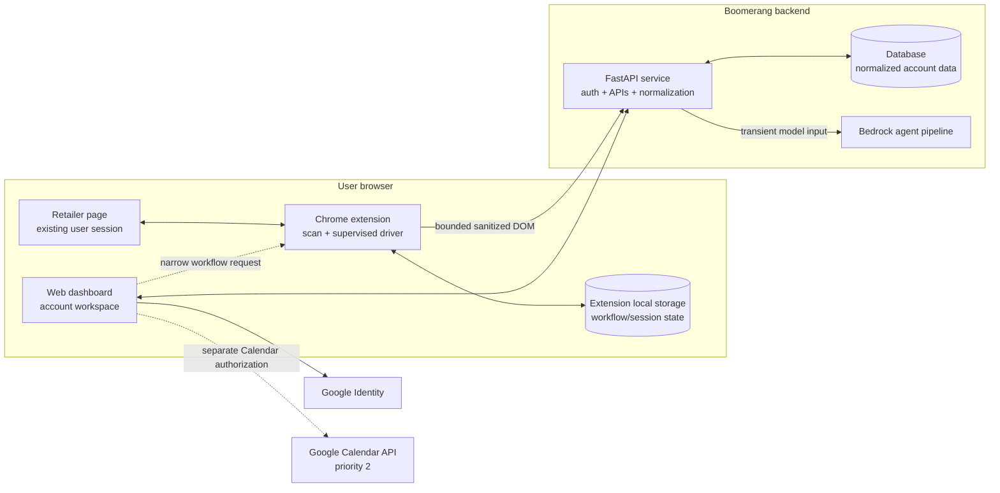
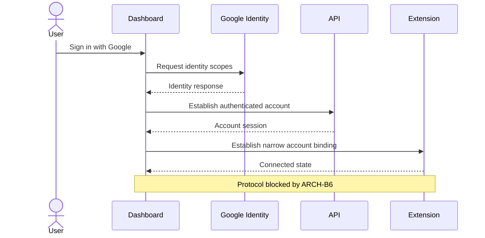
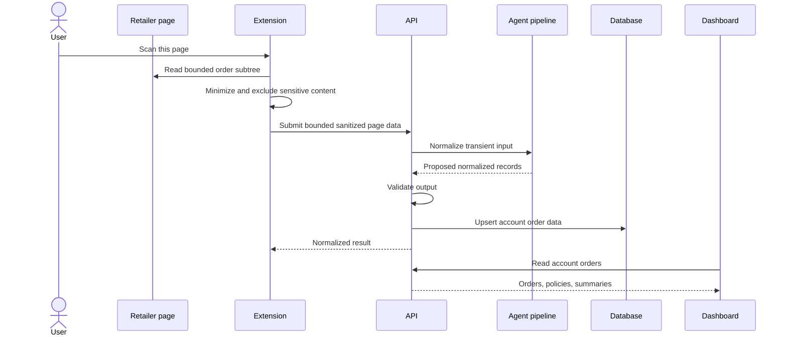
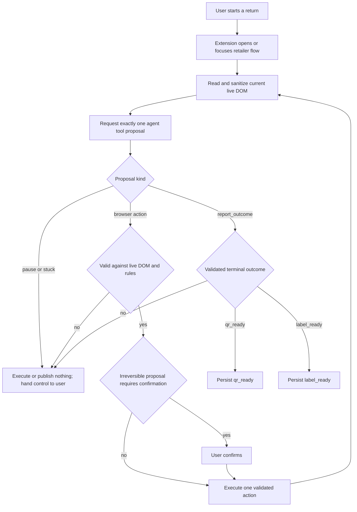

# Boomerang — High-Level Design

> **Status:** Rewritten for the product direction approved on 2026-09-05.
>
> This document is derived from [`../docs/`](../docs/), which remains the source of truth.
> [`boomerang-requirements.md`](boomerang-requirements.md) expresses the resulting testable
> requirements. The low-level design may refine this document but may not fill an architecture
> blocker with an unapproved assumption.

## 1. Purpose and scope

Boomerang combines a web dashboard, a Chrome extension, and a backend service to make online
returns visible and reduce the browser work needed to complete them.

The design has two distinct centers:

- The dashboard is the durable account-level workspace.
- The extension is the only component capable of acting inside a live retailer session.

The backend joins those surfaces, but it does not erase their boundary. It can store normalized
account data; it cannot independently open a retailer page, reuse the user's retailer session, or
continue a browser workflow while the extension is absent.

This design covers core v1, the priority-1 QR status, and the priority-2 Calendar boundary. It does
not design carrier pickup, resumable automation, or a specific retailer adapter.

## 2. Design constraints

1. **Retailer access originates in the browser.** The extension reads only pages available in the
   user's current retailer session.
2. **Normalized data may be durable; page content may not.** The database stores account records,
   while raw DOM and bounded, sanitized DOM representations remain transient.
3. **Execution stays local and supervised.** Detailed workflow/session state belongs to the
   extension, and the user sees the retailer tab being changed.
4. **Return execution is agent-first but extension-authorized.** Every step sends a bounded,
   sanitized representation of the current live DOM to the agent for exactly one closed-tool
   proposal. Trusted extension code validates browser actions before execution and terminal outcomes
   before publication.
5. **Selectors assist; they do not plan.** Bundled selectors may help recognize a page or resolve
   and validate an agent target, but cannot advance the return flow without an agent proposal.
6. **Recommendations do not grant authority.** Preferences rank options; the user selects the
   method and confirms irreversible actions.
7. **Identity grants are separate.** Google sign-in establishes the account; Calendar access is a
   later, incremental authorization; neither grants Gmail or retailer access.
8. **Unsettled architecture remains visible.** The blocker identifiers `ARCH-B1` through `ARCH-B8`
   are defined in the [requirements blocker register](boomerang-requirements.md#3-architecture-blocker-register).

## 3. System context

The dashboard-to-extension arrow is intentionally conceptual. Its authentication, addressing, and
transport are blocked by `ARCH-B6`. The Calendar arrow likewise does not choose token custody;
that is blocked by `ARCH-B5`.

## 4. Components

### 4.1 Web dashboard

The dashboard is the user's durable view of returns. It:

- authenticates the user with Google;
- displays database-backed orders, deadlines, values, policies, and current return summaries;
- captures and displays return preferences;
- shows whether a compatible extension is connected;
- starts a return by requesting work from the extension;
- presents a carrier-neutral view of returns that reached handoff; and
- provides the Privacy surface and the optional Calendar action.

The dashboard does not read retailer pages, hold retailer credentials, or execute browser actions.
It must not treat an old database summary as proof of the current retailer page state.

### 4.2 Chrome extension

The extension is the browser-execution surface. It:

- obtains page access through a user gesture and later optional retailer host permission;
- recognizes supported retailer pages;
- extracts bounded, sanitized representations of relevant live DOM;
- sends minimized input for normalization;
- opens or focuses the visible return flow;
- requests exactly one agent tool proposal for every return-flow step;
- uses bundled selectors only to assist page recognition, target resolution, and validation;
- validates each browser-action proposal against the current live DOM and confirmation rules before
  execution, and validates a terminal outcome before publication;
- stops for user choice and irreversible confirmation;
- records detailed workflow/session state and safe checkpoints locally; and
- publishes a minimal current return summary to the account backend.

The extension does not contain model-provider, Google OAuth client, backend, carrier, or retailer
secrets. It does not promise to resume an interrupted v1 run merely because a checkpoint exists.

### 4.3 FastAPI service

The API is the authenticated application boundary. It:

- validates Google-linked account identity;
- accepts minimized page data supplied by the extension;
- invokes the normalization and return-step agent pipeline;
- validates normalized results;
- writes and reads account records;
- serves the dashboard;
- accepts current return-summary updates from the extension.

The service cannot initiate access to a retailer session. Every retailer-derived input begins with
a browser request.

### 4.4 Database

The database holds durable account data:

- the user identity keyed by Google's `sub` claim;
- normalized orders and items;
- prices, ordered dates, and delivered dates;
- parsed policy facts, deadlines, fees, and available provenance/confidence;
- user preferences; and
- the current return summary for each item.

It does not hold raw DOM, bounded sanitized DOM representations, raw label or QR artifacts, retailer
cookies, or the extension's detailed workflow/session record.

### 4.5 Normalization and return-step agent pipeline

The pipeline has two logical uses:

1. Normalize a bounded order-page subtree into validated account data.
2. For every return-flow step, accept a bounded, sanitized representation of the current live DOM
   and propose exactly one tool call from the closed vocabulary. The proposal may be a browser
   action or `report_outcome` for a terminal page.

The API treats agent output as untrusted input. The extension performs its own action validation
against the current live DOM and user-confirmation rules before any proposal reaches the page.
Bundled selectors may assist that validation, but never replace the agent request. The final
normalization and per-step agent runtime contracts remain provisional under `ARCH-B2`.

### 4.6 Google services

Google has two separate relationships with Boomerang:

- **Identity:** Sign in with Google establishes the account, keyed by `sub`.
- **Calendar:** priority 2 creates a deadline or follow-up event after separate, incremental
  authorization.

No Gmail relationship exists. Calendar does not read availability. Because Calendar is priority 2,
its component ownership, wire contracts, scope, and token custody remain deferred under `ARCH-B5`.

## 5. Logical data model

This is a logical model, not a physical database schema. Keys, indexes, cascades, and retention
jobs remain low-level or blocked decisions.

| Record | Authoritative store | Minimum responsibility |
|---|---|---|
| User | Database | Google `sub` and profile fields needed by the account |
| Order | Database | Retailer identity, retailer order reference, ordered/delivered dates |
| Order item | Database | Stable database identifier, description, price, and return relevance |
| Policy facts | Database | Rules, deadlines, fees, and available provenance/confidence |
| Preference set | Database | `lowest_cost`, `fastest_refund_or_replacement`, `no_printer`, `more_sustainable` |
| Return summary | Database | One current dashboard projection per item |
| Workflow/session | Extension local storage | Current run, tab context, retailer step, fields filled, choices, checkpoint, attempts, timestamps |
| Extension connection | Undecided | Account/browser binding and availability; blocked by `ARCH-B6` |
| Calendar credential | Undecided | Present only if the final Calendar design requires storage; blocked by `ARCH-B5` |

### 5.1 Return-summary state

The durable dashboard projection uses:

| State | Meaning |
|---|---|
| `not_started` | No current return action is recorded |
| `in_progress` | A return has started but no retailer handoff artifact is ready |
| `qr_ready` | The retailer produced a QR-code outcome; v1 stores no QR representation |
| `label_ready` | The retailer produced a printable-label outcome |
| `handed_to_carrier` | The item was handed off, with the evidence source named |
| `complete` | Meaning, evidence, and legal transitions remain blocked by `ARCH-B8` |

`handed_to_carrier` is not evidence that Boomerang scheduled or observed a pickup. The supported
evidence source is blocked by `ARCH-B3`. That decision does not define `complete`, which is
independently blocked by `ARCH-B8`.

### 5.2 Workflow/session state

The extension-local record contains enough information to describe the current browser execution:

- workflow/session identifier;
- database order and item identifiers;
- current workflow state and retailer step;
- tab ID and last validated URL;
- latest safe checkpoint;
- fields Boomerang filled;
- suggested and user-confirmed reason;
- selected return method; and
- attempt count and timestamps.

This record improves safety and debuggability. In v1 it is not a promise of Stop/Continue or
interrupted-run recovery. The exact interruption fallback is blocked by `ARCH-B1`.

## 6. Primary flows

### 6.1 Sign-in and extension connection

Signing in does not grant Calendar, Gmail, or retailer access. The connection must bind the correct
account to the correct browser without exposing a general-purpose extension command channel.

### 6.2 Scan, normalize, and persist

The exact synchronous response, timeout, retry behavior, and fallback to an asynchronous job model
remain blocked by `ARCH-B2`.

### 6.3 Dashboard use

The dashboard reads account data from the API, computes or renders urgency from the latest known
deadline, and orders candidates by closing soonest. It displays uncertain or missing policy facts
honestly. Preferences may change ranking and explanations, but never remove choices or authorize a
fee.

The carrier-handoff view is a filtered return-status view. It contains no USPS booking semantics.

### 6.4 Return execution

The agent plans every iteration and can express only `click`, `select_option`, `fill`,
`pause_for_user`, `report_stuck`, or `report_outcome`. Trusted extension code owns authority and
execution. It may use bundled selectors to resolve and validate the proposed target, but a selector
match cannot produce an action independently. `fill` cannot target password, payment, or file-upload
inputs. The user chooses among all visible methods and prices and confirms final submission.

A terminal-page request contains only bounded structural and non-sensitive facts. The egress guard
removes raw label artifacts, QR contents, addresses, barcodes, and protected URLs.

If the user takes over or the page diverges, v1 hands off instead of claiming it can reconcile and
resume. The precise interruption acceptance criteria remain blocked by `ARCH-B1`.

### 6.5 Return-summary publication

The extension publishes only the minimal durable summary needed by the dashboard. It does so after
validating the live page or receiving an explicit user action. The backend never commands a
retailer workflow from a summary alone.

For QR outcomes, only `qr_ready` is stored. For carrier handoff, the evidence source must accompany
the update; which evidence sources are accepted remains blocked by `ARCH-B3`. Publishing `complete`
remains blocked separately by `ARCH-B8`.

### 6.6 Calendar event, priority 2

The product intent remains to create a deadline or follow-up event after the user chooses **Add to
calendar**, with authorization separate from sign-in and no availability reads. This design does not
assign the feature to the dashboard or API, define a wire contract, or select token custody. Those
decisions and implementation work remain deferred until priority 2 is taken up and `ARCH-B5` is
resolved.

## 7. Trust boundaries and security

| Boundary | Permitted crossing | Prohibited crossing |
|---|---|---|
| Retailer page → extension | Selected order/return facts and visible controls | Script authority over the service worker or validator |
| Extension → API | Authenticated, bounded, sanitized current-DOM data, including sanitized terminal-page facts, and validated summary updates | Retailer cookies, authorization headers, passwords, payment fields, file inputs, raw label artifacts, QR contents, addresses, barcodes, protected URLs |
| API → agent pipeline | Transient minimized input | Durable model logging of retailer page content |
| Dashboard → API | Authenticated account reads and mutations | Access to another account's records |
| Dashboard → extension | Narrow return workflow requests | Arbitrary scripting, arbitrary tab access, general storage reads |
| Identity → account | Stable Google subject and required profile data | Gmail or Calendar authority |
| Calendar authorization → Calendar | Event creation for the user's explicit action | Availability reads or implicit authorization at sign-in |

Agent output is not trusted merely because it is structured. Server validation protects the
database; extension validation against the current live DOM and user-confirmation rules protects
the retailer page. Page-derived text is rendered as text, never markup.

## 8. API capability boundaries

This design defines capability groups, not final routes. Concrete endpoints are deferred to the
low-level design only when their blockers are settled.

| Capability | Caller | Durable effect | Blocker |
|---|---|---|---|
| Establish/read account session | Dashboard, extension | User/session records | None at this level |
| Normalize order page | Extension | Validated orders and policy facts | `ARCH-B2` for final runtime contract |
| Propose one return-step tool call | Extension | None; request and response are transient | `ARCH-B2` for final runtime contract |
| Read dashboard data | Dashboard | None | None at this level |
| Update preferences | Dashboard | Preference set | None at this level |
| Publish current return summary | Extension | Return summary | `ARCH-B3` for handoff evidence |
| Bind/request extension work | Dashboard, extension | Connection metadata if needed | `ARCH-B6` |
| Calendar event integration | Undecided; deferred to priority 2 | Credential/event metadata if needed | `ARCH-B5` |
| Delete account or order data | Dashboard | Account records | `ARCH-B4` for detailed lifecycle |

There are no v1 carrier eligibility, schedule, refresh, cancel, or tracking capabilities.

## 9. Deployment posture

The current documents settle these deployment-relevant facts:

- the application has a web dashboard, FastAPI service, database, extension, and Bedrock agent pipeline;
- account APIs require authentication;
- page content is transient while normalized account data is durable;
- retailer credentials remain in the browser; and
- Calendar is a separately authorized priority-2 integration.

They do **not** settle the production compute topology, database product, network layout, frontend
hosting mode, secret store, environment split, or deployment pipeline. The previous Lambda
Function URL/no-VPC/no-database design cannot be carried forward as a current architecture because
its central no-database assumption has been replaced.

Core-v1 deployment choices should be made after the data model, authentication flow, AI runtime,
and blocked extension-connection contract are sufficiently defined. They do not wait for the
priority-2 Calendar contract. The core topology must preserve a clean boundary for a later,
separately authorized Calendar integration, whose ownership, wire contract, and credential custody
remain blocked by `ARCH-B5`. Until the core prerequisites are settled, local development may keep
using the existing scaffolds without treating them as the target production topology.

## 10. Deferred designs

The following belong in short scope notes, not active component or API designs:

- carrier pickup eligibility, scheduling, confirmation, refresh, cancellation, and tracking;
- carrier-specific postage and package-location rules;
- user-controlled stopping and resuming;
- cross-browser support;
- unattended retailer-account access;
- QR representation storage;
- Calendar component ownership, wire contracts, and implementation; and
- asynchronous parsing unless `ARCH-B2` requires it.

## 11. Open architecture blockers

| ID | Required decision before affected design can close |
|---|---|
| `ARCH-B1` | Choose manual handoff, stop-only behavior, or resumable interruption behavior for v1 |
| `ARCH-B2` | Measure realistic payloads and agent latency, then choose normalization and per-step tool request shapes, timeout/retry contracts, and hosting fit |
| `ARCH-B3` | Choose user-confirmed, retailer-observed, or both as carrier-handoff evidence |
| `ARCH-B4` | Choose record, checkpoint, token, deletion, recovery, and backup lifetimes |
| `ARCH-B5` | When priority 2 begins, choose Calendar component ownership, wire contracts, scope, credential custody, refresh/revocation, and event-update support |
| `ARCH-B6` | Choose and secure the dashboard-to-extension binding and command protocol |
| `ARCH-B7` | Select the first retailer before authoring adapters, fixtures, and retailer-specific acceptance criteria |
| `ARCH-B8` | Define the meaning, evidence, and legal transitions for `complete` independently of carrier handoff |
