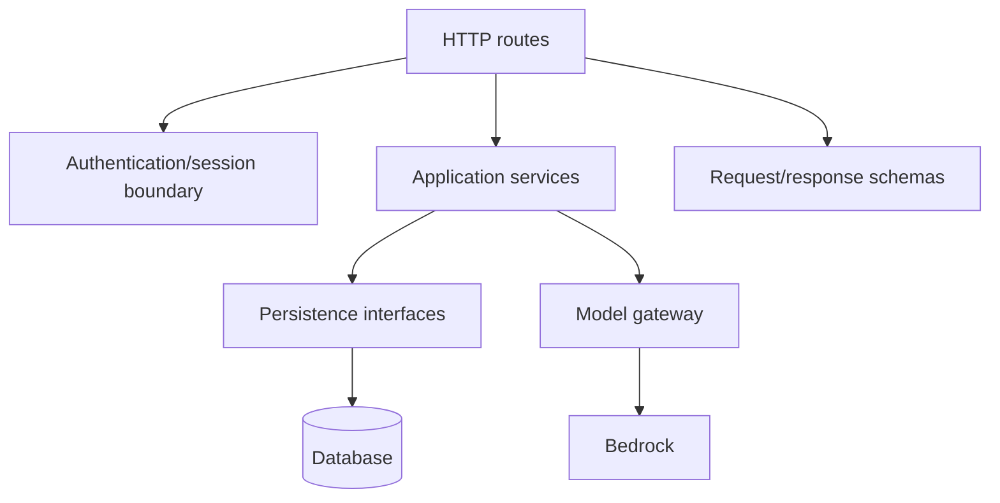

# Boomerang — Low-Level Design

> **Status:** Rewritten for the product direction approved on 2026-09-05.
>
> The source of truth is [`../docs/`](../docs/). This document refines the
> [requirements](boomerang-requirements.md) and
> [high-level design](boomerang-high-level-design.md) into implementation boundaries. It does not
> make decisions that those documents leave open.
>
> Blocker identifiers `ARCH-B1` through `ARCH-B8` refer to the
> [architecture blocker register](boomerang-requirements.md#3-architecture-blocker-register).
> A blocked section states the usable boundary and stops before inventing a contract.

## 1. Design goals

This design should make the following properties difficult to violate accidentally:

1. Dashboard data is account data in the database.
2. Browser-execution state is local to the extension.
3. Raw DOM and bounded, sanitized DOM representations never become durable records.
4. The backend cannot initiate retailer access.
5. Page content and agent output are untrusted at every boundary.
6. Every return-flow step requires exactly one agent proposal from current sanitized DOM.
7. Bundled selectors may assist resolution and validation but never bypass the agent.
8. Agent proposals cannot escape the closed tool vocabulary.
9. Preferences influence presentation, not authority.
10. Irreversible actions remain under user control.
11. QR and printable-label outcomes are valid without carrier pickup.
12. Unresolved architecture decisions remain explicit in code and planning interfaces.

This is a target design. The milestone plan has been reconciled; the current code, task files under
`plan/tasks/`, and workspace guidance must be reconciled against it separately.

## 2. Runtime boundaries

### 2.1 Web application

The web application owns account-facing presentation and user intent:

- Google sign-in;
- authenticated dashboard data fetching;
- urgency and return-state presentation;
- preference editing;
- the Privacy surface;
- extension connectivity and return-start controls.

Calendar is priority 2 and has no current internal implementation boundary in this design.

It does not read retailer DOM or execute actions in retailer tabs. A return-start control sends a
narrow request to the extension bridge; the exact bridge is blocked by `ARCH-B6`.

Recommended internal boundaries:

| Boundary | Responsibility |
|---|---|
| Identity client | Obtain Google identity response and establish the application session |
| Account API client | Read/write authenticated account data |
| Returns view model | Combine orders, policies, summaries, preferences, and current time for display |
| Preferences editor | Validate and persist the four supported preference values |
| Extension bridge client | Report connection state and send enumerated workflow requests |
| Privacy view | Describe actual collection, persistence, model processing, and deletion behavior |

The framework-specific file layout should follow the installed web stack after its workspace guide
is reconciled. These are ownership boundaries, not prescribed filenames.

### 2.2 Browser extension

The extension is divided by execution context:

| Boundary | Context | Responsibility |
|---|---|---|
| Popup or extension UI | Extension page | Scan gesture, connection state, local workflow prompts |
| Content script | Retailer tab, isolated world | Read live page state and return bounded, sanitized representations |
| Service worker | Extension background | Network egress, orchestration, trusted validation, local writes, tab control |
| Local store | `chrome.storage.local` | Detailed workflow/session state and latest safe checkpoint |

Recommended modules:

| Module | Responsibility | Must not do |
|---|---|---|
| Page recognizer | Match supported URL and DOM signatures | Fetch remote adapter behavior |
| Extractor | Select, bound, and sanitize the relevant current DOM | Return a complete document or sensitive input |
| Egress guard | Enforce size and sensitive-content rules before transmission | Depend on the model to redact its own prompt |
| Adapter registry | Provide bundled page hints, selectors, and step metadata for recognition and validation | Construct actions or bypass the agent |
| Return driver | For each visible step, acquire current DOM, request one agent proposal, and coordinate validation, execution, or outcome publication | Advance the flow from selectors alone |
| Proposal validator | Validate the closed tool union against current live DOM, target restrictions, confirmation state, and terminal evidence | Trust an agent-provided target or outcome without validation |
| Step executor | Execute only a validated action | Accept arbitrary scripts or navigation commands |
| Workflow store | Read/write local workflow/session records | Store account-level order history as its authority |
| Account API client | Send authenticated ingest and summary requests | Send retailer cookies or credentials |
| Bridge endpoint | Receive enumerated dashboard requests | Expose arbitrary tab, script, or storage operations |

The service worker is the trusted coordination boundary. Content scripts return observations; they
do not decide whether an agent action or reported outcome is safe. Only a validated browser action
crosses back into the tab, and only a validated outcome reaches the summary publisher. No adapter or
selector helper can call either path without a proposal from the current agent iteration.

### 2.3 Backend service

The backend separates transport, application logic, persistence, and external integrations:



Recommended backend boundaries:

| Boundary | Responsibility |
|---|---|
| Authentication/session | Verify Google identity, resolve the current user, protect account APIs |
| Ingestion service | Validate minimized input, invoke normalization, validate output, persist account records |
| Orders service | Query orders, items, policy facts, deadlines, and dashboard projections |
| Preferences service | Validate and persist the supported preference set |
| Return-step agent service | Validate bounded current-step input and request exactly one closed-tool proposal |
| Return-summary service | Validate state transitions and evidence supplied by the extension |
| Extension-connection service | Bind dashboard intent to the correct browser workflow |
| Model gateway | Invoke normalization and return-step tools without exposing provider details to application services |
| Persistence layer | Own database transactions and account scoping |

HTTP routes may depend on schemas, authentication, and application services. Application services
may depend on persistence and integration gateways. Persistence and gateways must not depend on
HTTP or UI code.

### 2.4 Database

The database is an application dependency, not a cache of extension storage. It is authoritative
for the account-level records in section 3. Physical database selection, migrations, indexes,
backup topology, and retention jobs should be designed after `ARCH-B4` is resolved sufficiently to
define their lifecycle.

### 2.5 Model integration

The model gateway exposes two capabilities:

- normalize a bounded order-page representation; and
- propose exactly one closed tool call for every return-flow step from a bounded, sanitized
  representation of the current live DOM.

Both use structured output. Free-form prose is never parsed into an executable action or publishable
outcome. The gateway does not persist prompts or responses as application records. Provider
invocation logging must not be enabled in a way that stores retailer page content.

The final invocation protocols, models, budgets, retries, and sync/async boundaries for
normalization and per-step tool proposals are blocked by `ARCH-B2`.

## 3. Data design

The concrete shared logical and wire models for current dashboard and extension work are defined in
[`boomerang-data-model.md`](boomerang-data-model.md). This section retains the architectural
ownership rules that constrain that contract.

### 3.1 Database records

The following are logical records. Field names may change during schema implementation, but the
ownership and relationships may not.

#### User

Required concepts:

- Google `sub`, used as the stable account identity key;
- basic profile fields required by the product; and
- account creation/update timestamps.

#### Order

Required concepts:

- internal order identifier;
- owning user;
- retailer identity;
- retailer order reference when available;
- ordered date when available;
- ingestion timestamps.

Re-scanning the same retailer order should update its normalized record rather than create an
unbounded duplicate. The exact uniqueness key is retailer-specific and remains blocked by
`ARCH-B7` without another live-page validation.

#### Order item

Required concepts:

- stable internal item identifier;
- parent order;
- normalized description and variant when available;
- delivered date when available;
- price and currency when available; and
- return relevance or eligibility facts when available.

The stable database identifier is the value an extension workflow stores locally. Display text is
not an identity key.

#### Policy facts

Required concepts:

- association with the applicable order or item;
- normalized rule, deadline, or fee;
- whether the value was stated by the retailer or derived;
- available source/provenance; and
- available confidence or parse-quality information.

A missing fact remains missing. The presentation layer may explain uncertainty but must not turn it
into an authoritative retailer statement.

#### Preference set

One account-level set containing zero or more of:

- `lowest_cost`;
- `fastest_refund_or_replacement`;
- `no_printer`; and
- `more_sustainable`.

Preferences are inputs to ranking and explanation only.

#### Return summary

Required concepts:

- owning order item;
- current summary state;
- last update time;
- update source; and
- evidence source when the state is `handed_to_carrier`.

The state union is:

```text
not_started
in_progress
qr_ready
label_ready
handed_to_carrier
complete
```

For `qr_ready`, no QR representation is stored in v1. For `handed_to_carrier`, accepted evidence is
blocked by `ARCH-B3`. The meaning, evidence, and legal transitions for `complete` are independently
blocked by `ARCH-B8`.

#### Extension connection

The product needs a way to report whether a compatible extension is connected and to bind a return
request to the intended browser. Whether this requires a durable record, a short-lived channel, a
challenge, or another mechanism is blocked by `ARCH-B6`. No database table should be created until
that decision requires one.

#### Calendar authorization

No Calendar credential record is defined in the current low-level design. Calendar is priority 2;
component ownership, token custody, and any resulting data model remain deferred under `ARCH-B5`.

### 3.2 Extension-local workflow record

The extension stores one detailed record per active or retained browser workflow with these
concepts:

```text
workflow_session_id
database_order_id
database_item_id
workflow_state
retailer_step
tab_id
last_validated_url
safe_checkpoint
fields_filled
suggested_reason
user_confirmed_reason
selected_return_method
attempt_count
started_at
updated_at
```

The record may contain only data needed to run or explain the browser workflow. It is not a second
copy of the normalized order database.

The store should use a schema version and defensive reads. An unsupported record must not be acted
on as though it matched the current page. Exact cleanup and migration behavior are blocked by
`ARCH-B4`; interruption behavior is blocked by `ARCH-B1`.

### 3.3 Transient data

The following may exist only for the duration needed to process the current browser/API operation:

- selected raw DOM nodes;
- bounded, sanitized DOM representations, including permitted terminal-page representations;
- agent prompts containing retailer page content;
- unvalidated agent output; and
- non-sensitive terminal-page facts.

Transient data must not be written to the account database, extension local storage, application
logs, analytics, or durable model invocation logs.

Before a terminal-page representation leaves the browser, the egress guard removes raw label
artifacts, QR contents, addresses, barcodes, and protected URLs.

## 4. Application interfaces

The concrete non-AI HTTP surface for parallel dashboard, extension UI, and server implementation is
defined in [`boomerang-api-contract.md`](boomerang-api-contract.md). Agent-pipeline and bridge
contracts remain outside that API surface until their blockers are resolved.

The following interfaces define responsibilities without fixing HTTP paths. Concrete wire contracts
should be added when their blockers are resolved.

### 4.1 Account identity

```text
establish_account(identity_assertion) -> account_session
current_account(account_session) -> user
end_session(account_session) -> none
```

The backend verifies the identity assertion and resolves the user by Google `sub`. The application
session representation is an implementation choice, but every account operation must resolve one
authenticated user before reaching persistence.

### 4.2 Order normalization

```text
normalize_order_page(
  account,
  page_url,
  minimized_page_content
) -> normalized_order_result
```

The service validates the request, resolves retailer context, calls the model gateway, validates
the result, and writes the resulting order graph in one application transaction.

The final response timing, request size, retry semantics, and possible job identifier are blocked
by `ARCH-B2`. The interface must therefore remain behind an application client rather than being
spread as direct fetch calls through the extension.

### 4.3 Return-step agent

```text
propose_return_tool(
  account,
  workflow_context,
  observation_id,
  bounded_sanitized_current_dom
) -> exactly_one_proposed_tool_call
```

The extension calls this capability for every return-flow step, never only after a selector miss.
`workflow_context` contains only the bounded facts needed to plan the current step. The response is
tied to the observation that produced it and contains exactly one member of the closed tool union.

For a browser action, trusted extension code resolves the target and validates the proposal against
the current live DOM and user-confirmation state before execution. For `report_outcome`, trusted
extension code validates the reported terminal state before publishing it. If the page no longer
matches the observation, the proposal is stale and executes or publishes nothing. Bundled selectors
may assist recognition, resolution, and validation, but there is no selector-only path to the
executor or outcome publisher.

The concrete request schema, observation binding, payload ceiling, latency budget, timeout, and
retry rules are blocked by `ARCH-B2`. A transport failure or timeout hands control to the user; it
does not authorize a local deterministic action.

### 4.4 Dashboard reads

```text
list_return_candidates(account, sort, filters) -> return_candidate[]
get_return_candidate(account, item_id) -> return_candidate
get_return_metrics(account) -> return_metrics
```

These reads return normalized account records and current summaries. They do not reach into the
extension and do not fetch retailer pages.

Days remaining is derived from the current time and the latest known deadline. Stored deadlines may
be facts; a decaying countdown should not be the authoritative stored value.

### 4.5 Preferences

```text
get_preferences(account) -> preference_set
update_preferences(account, preference_set) -> preference_set
rank_methods(preference_set, visible_methods) -> ranked_methods
```

`rank_methods` must preserve every visible method. If required price, timing, printer, or
sustainability facts are unknown, the result explains the limitation instead of fabricating an
order.

### 4.6 Return-summary publication

```text
publish_return_summary(
  account,
  item_id,
  state,
  update_source,
  evidence_source?
) -> return_summary
```

The API verifies account ownership and validates the state. The extension calls this only after a
live-page validation or explicit user action. `qr_ready` rejects any attached QR representation in
v1. `handed_to_carrier` requires an evidence source once `ARCH-B3` settles the permitted values.
`complete` remains rejected until `ARCH-B8` defines its evidence and legal transitions.

### 4.7 Dashboard-to-extension bridge

The bridge must eventually support an enumerated surface resembling:

```text
connection_status
start_return(item_id)
focus_active_return(item_id)
```

This is not yet a wire contract. Authentication, browser selection, account binding, stale-client
handling, acknowledgements, and revocation are blocked by `ARCH-B6`.

The final bridge must not expose arbitrary code, arbitrary selectors, arbitrary URLs, unrestricted
tab access, or a general-purpose storage read.

### 4.8 Calendar, priority 2

No module, route, interface, credential record, or client/server ownership is defined here. The
product intent remains in the requirements and high-level design; implementation design is deferred
until priority 2 is taken up and `ARCH-B5` is resolved.

### 4.9 Deletion

```text
delete_account(account) -> none
clear_local_workflows() -> none
```

Account deletion removes normalized orders, items, policy facts, preferences, summaries, and any
stored Calendar credential. Clearing local workflows removes extension sessions and checkpoints but
does not delete the web account.

Single-order deletion, recovery periods, asynchronous cleanup, backup expiry, and retention-driven
deletion are blocked by `ARCH-B4`.

## 5. Order ingestion flow

### 5.1 Page acquisition

1. The user opens a supported retailer order page.
2. On first use, the user invokes **Scan this page**, granting temporary `activeTab` access.
3. The extension recognizes the page from bundled retailer metadata.
4. The content script waits until the relevant order region is available.
5. The extractor selects only that region and creates a simplified representation.
6. The egress guard enforces the local size and sensitive-content rules.
7. The service worker sends the authenticated request.

Concrete recognition, readiness, and extraction rules are blocked by `ARCH-B7`. The final payload
and timing limits are blocked by `ARCH-B2`.

### 5.2 Server normalization

1. Resolve the authenticated user.
2. Validate request shape and the bounded input.
3. Invoke the normalization tool through the model gateway.
4. Parse structured output into strict application schemas.
5. Reject invalid, implausible, or unsafe values.
6. Upsert the order, items, policy facts, and initial summaries in an account-scoped transaction.
7. Return the normalized result or a typed failure the extension can present.
8. Release the transient page representation.

No log line should include the submitted page representation or unvalidated model output.

### 5.3 Rescan behavior

A rescan updates the known retailer order while preserving stable database item identifiers where
items can be matched safely. It must not overwrite newer explicit user state with an ambiguous parse.
Retailer-specific identity and reconciliation rules remain blocked by `ARCH-B7`.

## 6. Return execution flow

### 6.1 Starting

1. The user selects an item from the dashboard or extension.
2. The extension verifies that the item belongs to its authenticated account binding.
3. The extension opens or focuses the retailer return page in a visible tab.
4. It creates or updates the local workflow/session record.
5. It publishes `in_progress` only after the live flow is validated.

Step 2's binding protocol is blocked by `ARCH-B6`. Retailer entry URLs and validation are blocked
by `ARCH-B7`.

### 6.2 Agent-first step loop

For each visible retailer step:

1. Re-read the current live DOM after the preceding action has settled; never plan from an old DOM
   snapshot.
2. Extract the relevant current state into a bounded, sanitized representation and pass it through
   the egress guard.
3. Send the representation, observation identity, and bounded workflow context to the agent.
4. Require exactly one proposed tool call from the closed union. Missing, multiple, or free-form
   proposals fail validation.
5. For a browser action, resolve the proposed target against the current live DOM in the extension's
   trusted context. Bundled page metadata and selectors may assist resolution and page recognition.
6. Validate the tool kind, current page state, and applicable target, user-choice, confirmation, or
   terminal-outcome rules. A selector match is evidence for validation, never an independent plan.
7. If validation fails or the observation is stale, record the safe checkpoint and hand control to
   the user without executing an action or publishing an outcome.
8. If a user choice is required, present every visible option and known price. Before an
   irreversible action, require explicit confirmation.
9. Dispatch exactly one validated tool call: execute a browser action, hand control to the user for
   `pause_for_user` or `report_stuck`, or publish one terminal outcome.
10. After a browser action settles, re-read the page, update the local workflow record, and begin a
    new agent iteration. A terminal outcome ends the step loop.

The agent owns step planning; trusted extension code owns authority, execution, and outcome
publication. There is no deterministic selector-first path and no selector fallback when the agent
is unavailable.

### 6.3 Closed tool union

```text
click(target)
select_option(target, value)
fill(target, value)
pause_for_user(reason)
report_stuck(reason)
report_outcome(outcome_kind)
```

Validation rules:

- `kind` must be one of the six values above.
- Required and forbidden fields are checked per kind.
- A browser-action target must resolve to an element visible in the current validated step.
- `fill` is allowed only for configured reversible field kinds.
- Password, payment, and file-upload targets are always rejected.
- Values are bounded and treated as text.
- No action may encode arbitrary JavaScript, network access, credential access, or unrestricted
  navigation.
- An irreversible target remains blocked until the user confirms it.
- `report_outcome` accepts only `qr_ready` or `label_ready` in v1 and carries no artifact or
  sensitive terminal-page content.
- `report_outcome` is published only after trusted extension validation against the current page.

### 6.4 Return-method choice

The driver reads the currently visible methods and represents each as:

```text
method_id
label
price | unknown
printer_requirement | unknown
refund_or_replacement_timing | unknown
sustainability_facts | unknown
outcome_kind | unknown
```

The preference ranker may order and explain this list. It may not remove an option, turn unknown
into free, or select for the user. The selected method is written to the local workflow record
before the driver continues.

### 6.5 Final submission and outcome

1. The user reviews the suggested reason, filled fields, selected method, and visible price.
2. The user explicitly confirms final submission.
3. The next agent iteration receives a bounded, sanitized terminal-page representation.
4. The agent proposes `report_outcome(qr_ready)` or `report_outcome(label_ready)` when supported by
   that representation.
5. Trusted extension code validates the report against the current page before publication.
6. A QR outcome publishes `qr_ready` and stores no QR representation.
7. A printable-label outcome publishes `label_ready`.
8. An unknown outcome hands the page to the user and publishes no stronger claim.

A later `handed_to_carrier` update requires evidence defined by `ARCH-B3`. A `complete` update remains
blocked independently by `ARCH-B8`. Retailer-specific outcome validation is blocked by `ARCH-B7`.

### 6.6 Interruption

The known v1 rule is conservative:

- no new action starts after the extension loses a validated page state;
- the tab remains available for the user;
- the latest safe checkpoint remains local; and
- the product does not claim it can resume after manual edits or interruption.

Whether v1 ends the run immediately, supports stop-only behavior, or promotes a resumable design is
blocked by `ARCH-B1`. No additional pause/resume states or reconciliation algorithm should be
implemented until that blocker is resolved.

## 7. State and consistency rules

### 7.1 One authoritative home

| Fact | Authority |
|---|---|
| Account identity and profile | Database |
| Normalized order/item/policy data | Database |
| Preferences | Database |
| Current dashboard return summary | Database |
| Current retailer step and tab | Extension local storage |
| Fields filled and selected method | Extension local storage |
| Latest safe checkpoint | Extension local storage |
| Retailer session and credentials | Browser cookie/session store |
| Raw DOM or bounded, sanitized DOM representation | No durable authority |

Code that needs a fact must read its authoritative home or receive an explicit projection from it.
It must not choose between two copies based on whichever is convenient.

### 7.2 Publishing a projection

The return summary is a projection of validated workflow milestones, not a copy of the workflow
record. Publishing it should be idempotent for the same item, state, source, and evidence. A stale
or repeated update must not move an item backward without an explicit reconciliation rule.

The full transition policy needs `ARCH-B3` for handoff evidence, `ARCH-B8` for `complete`, and
`ARCH-B1` for interrupted runs.

### 7.3 Checkpoint writes

The extension writes the local session after each validated reversible action and before waiting on
the user. A checkpoint records what was observed and performed; it never authorizes the next action
without another agent proposal and live-page validation.

Cleanup timing and handling of forward or unreadable schema versions are blocked by `ARCH-B4`.

## 8. Error handling

Every user-visible failure should contain:

- a stable machine-readable category;
- a concise message describing what happened;
- the safe next action; and
- an opaque request reference when a server request was involved.

The categories should cover behavior rather than preserve the previous USPS-era taxonomy:

| Category | Safe behavior |
|---|---|
| Authentication failed | Ask the user to sign in again; do not expose account data |
| Extension unavailable | Show disconnected state; preserve dashboard data |
| Unsupported retailer/page | Leave the page unchanged and explain that it is unsupported |
| Payload rejected | Send nothing further; explain that the page could not be read |
| Normalization failed | Store no partial success; allow a deliberate retry |
| Agent proposal rejected | Execute and publish nothing; hand the step to the user |
| Page diverged | Execute nothing; retain the safe checkpoint and hand off |
| Summary update failed | Preserve local workflow truth and show that dashboard sync is pending |
| Deletion failed | Do not claim deletion completed; identify the affected scope |

Retry behavior must be operation-specific. Reads and normalization attempts may be retryable within
the final `ARCH-B2` budget. A per-step agent request may be retried only after re-reading the live
DOM and only when no action was executed or outcome published; the final rules remain blocked by
`ARCH-B2`.
Irreversible retailer actions are never repeated automatically merely because the caller did not
receive a response.

Logs may include request references, route names, timings, counts, and validation outcomes. They
must exclude raw or bounded sanitized DOM representations, retailer credentials, sensitive fields,
Calendar tokens, and agent payloads containing retailer content.

## 9. Configuration

Configuration should be typed, validated at startup or build time, and grouped by owner.

| Owner | Configuration class | Blocker |
|---|---|---|
| Web app | API origin, Google identity client settings, extension bridge settings | `ARCH-B6` for bridge values |
| Extension | API origin, manifest identity, local payload bound, bundled retailer adapters | `ARCH-B2`, `ARCH-B7` |
| API | Google identity verification, database connection, model gateway | `ARCH-B2` for model/runtime values |
| Data lifecycle | retention and cleanup intervals | `ARCH-B4` |

Secrets must not be compiled into the web or extension bundles. Retailer adapters may be bundled as
reviewed data and code; they must not be fetched as remote executable behavior.

The previous USPS credentials, carrier adapter selection, pickup timings, confirmation prefixes,
and carrier endpoints are not v1 configuration. The previous no-database Lambda Function URL
settings are not assumed by this design.

## 10. Verification strategy

### 10.1 Requirement coverage map

This map identifies the primary implementation and verification home for every requirement family.
A blocker reference limits only the unresolved portion; it does not suspend the unblocked baseline.

| Requirement family | Primary implementation home | Primary verification | Blocker, where applicable |
|---|---|---|---|
| `AUTH-*` | Web identity flow and API authentication middleware | Unit and account-isolation integration tests | None named |
| `CONN-*` | Web connection UI, extension bridge, connection API | Contract and browser tests | `ARCH-B6` |
| `EXT-*` | Manifest, popup, page recognizer, permission manager | Manifest review and browser acceptance | `ARCH-B7` for retailer-specific behavior |
| `INGEST-*` | Extractor, sensitive-data guard, ingestion service, model gateway | Unit, contract, and ingestion integration tests | `ARCH-B2`, `ARCH-B7` |
| `DATA-*` | Database repositories and extension workflow store | Schema, ownership, and lifecycle integration tests | `ARCH-B3`, `ARCH-B4`, `ARCH-B8` for unresolved details |
| `DASH-*` | Web dashboard and order-query service | Component and account-isolation integration tests | None named |
| `PREF-*` | Preference service and method ranker | Unit and dashboard component tests | None named |
| `RETURN-*` | Return driver, proposal validator, browser executor, summary publisher | Unit and real-browser acceptance | `ARCH-B1`, `ARCH-B2`, `ARCH-B7` |
| `OUTCOME-*` | Return driver and summary publication service | Integration and real-browser acceptance | `ARCH-B3`, `ARCH-B7`, `ARCH-B8` |
| `CAL-*` | No implementation home until priority 2 | Deferred design review | `ARCH-B5` |
| `PRIV-*` | All boundaries, persistence stores, and deletion paths | Privacy review and lifecycle integration tests | `ARCH-B4` for retention details |
| `SEC-*`, `REL-*`, `PERF-*`, `COMP-*` | Cross-cutting runtime and delivery controls | Unit, contract, integration, and review gates | `ARCH-B2` where targets depend on AI runtime design |

### 10.2 Unit verification

| Area | Minimum coverage |
|---|---|
| Identity | `sub` is the identity key; Calendar/Gmail grants are absent at sign-in |
| Extraction | Relevant subtree only; sensitive fields removed; local size rejection |
| Normalization validation | Unknown fields, unsafe markup, implausible values, partial results rejected |
| Preferences | All visible methods preserved; unknown facts remain unknown |
| Tool validation | Six allowed kinds; illegal shapes, sensitive targets, and invalid outcome reports rejected |
| Return driver | Agent called for every step; exactly one proposal; irreversible confirmation; manual handoff on divergence |
| Local store | Authority boundaries, defensive schema reads, checkpoint persistence |
| Return summaries | Allowed states, account ownership, QR representation rejection, `complete` rejected pending `ARCH-B8` |
| Dashboard | Database-backed metrics, urgency presentation, privacy copy, connection state |

### 10.3 Contract verification

Maintain canonical examples for each implemented account/API capability. Both caller and server
tests should consume the same examples without generating them from either implementation.

Blocked contract suites:

- normalization and per-step agent timing, payload, retry, and job shapes — `ARCH-B2`;
- handoff evidence — `ARCH-B3`;
- complete-state evidence and transitions — `ARCH-B8`;
- Calendar authorization and event lifecycle — `ARCH-B5`;
- dashboard-to-extension bridge — `ARCH-B6`.

### 10.4 Integration verification

Integration coverage should prove:

- a signed-in user can see only their own database records;
- a scan persists normalized data and never persists its source DOM;
- the dashboard reflects a summary published by the extension;
- an agent proposal cannot bypass extension validation;
- a terminal-page request excludes raw label artifacts, QR contents, addresses, barcodes, and
  protected URLs;
- `report_outcome` carries no artifact and is validated before summary publication;
- a bundled selector cannot create or execute an action without a proposal from the current agent
  iteration;
- selecting a paid or free method remains a user decision;
- QR produces `qr_ready` without storing a QR representation;
- printable label produces `label_ready` without implying pickup.

### 10.5 Browser acceptance

A real-browser acceptance run must cover the chosen retailer from explicit scan through retailer
outcome. Exact fixtures, selectors, test account requirements, and assertions are blocked by
`ARCH-B7`.

Interruption acceptance is blocked by `ARCH-B1`. Normalization and per-step agent latency
acceptance are blocked by `ARCH-B2`. Handoff-status acceptance is blocked by `ARCH-B3`.
Complete-status acceptance is blocked independently by `ARCH-B8`.

### 10.6 Privacy verification

Tests and review should verify that:

- source DOM is absent from database tables, local workflow records, logs, and analytics;
- terminal-page agent requests exclude raw label artifacts, QR contents, addresses, barcodes, and
  protected URLs;
- account deletion removes the baseline account records;
- clearing extension data does not silently delete the web account;
- product copy matches implemented data handling.

Retention-window and backup-expiry tests remain blocked by `ARCH-B4`.

## 11. Implementation-readiness matrix

| Area | Status | Blocking decision |
|---|---|---|
| Google identity and `sub` account key | Ready for detailed planning | None named in current architecture |
| Database-backed dashboard data | Ready for schema exploration | Retention portions blocked by `ARCH-B4` |
| Extension permission posture | Ready for detailed planning | Retailer entries blocked by `ARCH-B7` |
| Page minimization and transient processing | Ready for detailed planning | Numeric/runtime limits blocked by `ARCH-B2` |
| Preferences rank, user chooses | Ready for detailed planning | None named in current architecture |
| Agent-first closed tool loop | Ready for detailed planning | Runtime contract blocked by `ARCH-B2`; retailer targets blocked by `ARCH-B7` |
| Uninterrupted return flow | Partially ready | Interruption fallback blocked by `ARCH-B1` |
| QR status-only outcome | Ready for detailed planning | QR representation remains deferred |
| Printable-label outcome | Ready for detailed planning | Retailer recognition blocked by `ARCH-B7` |
| Carrier handoff status | Blocked | `ARCH-B3` |
| Complete status | Blocked | `ARCH-B8` |
| Normalization and return-agent APIs and hosting runtime | Blocked | `ARCH-B2` |
| Calendar implementation | Deferred until priority 2 | `ARCH-B5` before detailed design |
| Dashboard-to-extension command path | Blocked | `ARCH-B6` |
| Retention, deletion, and backup lifecycle | Blocked beyond baseline | `ARCH-B4` |
| Retailer adapter and end-to-end acceptance | Blocked | `ARCH-B7` |
| Carrier pickup integrations | Deferred from v1 | No active design work |

## 12. Explicit exclusions from this design

This low-level design intentionally contains no active design for:

- USPS eligibility, pickup scheduling, confirmation numbers, ETags, or cancellation;
- UPS or FedEx pickup;
- carrier postage detection or package-location vocabularies;
- prefilled Calendar template URLs as a substitute for the Calendar API;
- a local-only order database owned by the extension;
- a dashboard that reads order history directly from extension storage;
- unauthenticated account APIs;
- user-controlled Stop/Continue or resumption reconciliation;
- background access to retailer accounts;
- a fixed Lambda/no-VPC/no-database production topology;
- Calendar component ownership, routes, token storage, or implementation before priority 2; or
- deterministic selector-first return execution or model-as-fallback behavior.

These exclusions prevent the previous PoC architecture from re-entering the implementation through
low-level details after it has been removed from product scope.
