# Boomerang — Low-Level Design

> **Status:** Implementation-ready specification.
> Upstream: [requirements](boomerang-requirements.md) and
> [high-level design](boomerang-high-level-design.md). Where this document and those disagree,
> **they win** — this one refines, it does not re-decide.
> Repo conventions live in the per-workspace `AGENTS.md` files and are not repeated here.
>
> **Section references.** A bare `§n` always means a section of *this* document. A section of an
> upstream document is always written with the document named — "requirements §4.2", "high-level
> design §6.3". All three documents have a §4.2 and a §5.2, so an unqualified number was ambiguous
> in the first draft of this document and is now reserved for local use.

---

## 1. Overview

This document specifies module structure, type design, collaboration and testing for the two
surfaces that carry the PoC's critical path:

| Surface | Covered here | Why |
|---|---|---|
| **Extension** (WXT, MV3, TypeScript) | Fully | Owns ingestion, the return driver, all persistent state, and most of the functional requirements |
| **Server** (FastAPI, Python 3.13) | Fully | Owns the model calls, the carrier integration and every credential |
| **Client** (Next.js) | **Not covered** | It is a read-only view over data the extension hands it (`client/AGENTS.md`). Phase 1 is a landing page with no logic; Phase 2 renders a list it does not compute. It has no class design worth specifying, and inventing one would imply logic that must not live there |

The extension side of the dashboard contract — the enumerated `externally_connectable` message
surface of FR-3.6.3 — **is** specified, because it lives in the extension.

### 1.1 The four constraints that shape every decision below

These come from the high-level design and are restated because they are the reason the structure
looks the way it does, rather than preferences an implementer may trade away.

1. **The service worker dies mid-flow, routinely.** MV3 terminates an idle worker after ~30 s, and
   three states in the FR-3.3.9 machine block on a human. So no module may hold flow state in
   memory, and every state transition is a write.
2. **The server is stateless.** There is no repository layer on the server, no session, no cache
   beyond a cold-start credential cache. Anything that looks like server-side memory is a bug.
3. **Model output is hostile input** (high-level design §7.4). Validation is a boundary, not a helper — it gets its
   own module on both sides, and nothing bypasses it.
4. **The action validator must be unreachable from the page** (§3.1). It runs in the service
   worker; only the *result* of validation crosses into the tab.

---

## 2. Package and Module Structure

### 2.1 Server

One Python package, layered. The layering rule is one-directional and is the only structural
invariant worth enforcing in review:

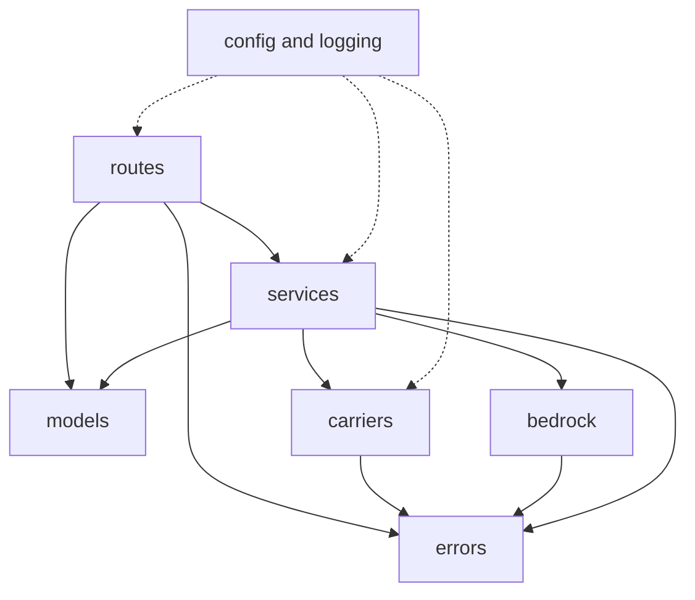

**Routes never call `carriers` or `bedrock` directly, and services never import `fastapi`.** The
first keeps HTTP concerns out of the carrier integration; the second is what makes services
testable without a client. Unlike the extension graph in §2.2, this one draws the layering rule
rather than every edge — `main` and `prompts` are omitted because they sit outside the layering, not
because importing them is forbidden. **`app/middleware.py` is omitted for a different reason and it
is worth separating:** middleware is not above routes in this graph, it is *around* the whole app.
It runs before routing has chosen a handler and after that handler has returned, which is exactly
why §7.1's `request_id` binding lives there and nowhere else. Drawing it as a layer would suggest a
route could call it.

**`routes` imports `models` directly**, and the edge is drawn because §2.1 names `models` as a node
and a graph that names a node it never connects invites the reader to infer the wrong rule. A route
declares its request and response schemas — that is how FastAPI validates a body before a service
ever sees it — so the dependency is not an accident to be refactored away. It is the mechanism by
which hostile input is rejected above the service layer.

| Module | Purpose | Exports |
|---|---|---|
| `app/main.py` | ASGI app, lifespan, exception handlers, router registration, the Mangum handler | `app`, `handler` |
| `app/routes/` | The seven endpoint handlers, one module per resource — `health`, `orders`, `returns`, `pickups`. HTTP in, service call, schema out | One `APIRouter` per module |
| `app/config.py` | Typed settings from environment, validated once | `Settings`, `get_settings` |
| `app/errors.py` | The exception hierarchy behind the requirements §4.2 error shape | `BoomerangError` and subclasses |
| `app/logging.py` | Redacting formatter, `request_id` binding | `configure_logging`, `bind_request_id` |
| `app/middleware.py` | Generates or adopts the request identifier | `RequestIdMiddleware` |
| `app/bedrock.py` | The single cached Bedrock client, per-call-site model selection | `client`, `model`, `verify_config` |
| `app/models/` | Pydantic request and response schemas. **This is the server's validation boundary** | Schemas per endpoint |
| `app/services/ingest.py` | Orchestrates parse, validate, derive window | `IngestService` |
| `app/services/window.py` | Derives `return_by`, sets `window_inferred` — pure | `derive_window` |
| `app/services/action.py` | The FR-3.3.7 fallback: DOM in, one validated action out | `ActionService` |
| `app/services/pickup.py` | Eligibility gate, schedule, refresh, cancel orchestration | `PickupService` |
| `app/carriers/base.py` | The carrier protocol every adapter satisfies | `CarrierAdapter` |
| `app/carriers/usps/` | OAuth token handling, the four operations, the mock | `UspsAdapter`, `MockUspsAdapter` |
| `app/prompts/` | Tool schemas for the two forced-tool-choice call sites | Tool definitions |

**`app/services/window.py` is deliberately a module of functions, not a class.** It holds no state
and depends on nothing; making it a class would only give it somewhere to hide one.

**There is no `app/validation/`, and §1.1 constraint 3 is still satisfied.** The extension needs a
named validation module because its hostile input arrives as a parsed JSON response that TypeScript
will happily assert a type onto; the server's hostile input arrives as a request body and as a
Bedrock tool-call payload, and both are parsed by Pydantic models that reject on shape before any
service sees them. The boundary exists on both sides — on the server it is the schema layer rather
than a module of its own. What this costs is that the boundary is only as strong as the models are
strict, so `app/models/` schemas forbid extra fields and bound every string, and the tool-call
payload is parsed through a model rather than read from a dictionary.

**There is no `repositories/` package, and there must not be.** High-level design §6.3 puts all
persistent state on the client. A repository layer on the server is the shape a database arrives in.

### 2.2 Extension

One WXT package. `entrypoints/` is framework-owned and holds as little logic as it can; `src/` holds
everything testable.

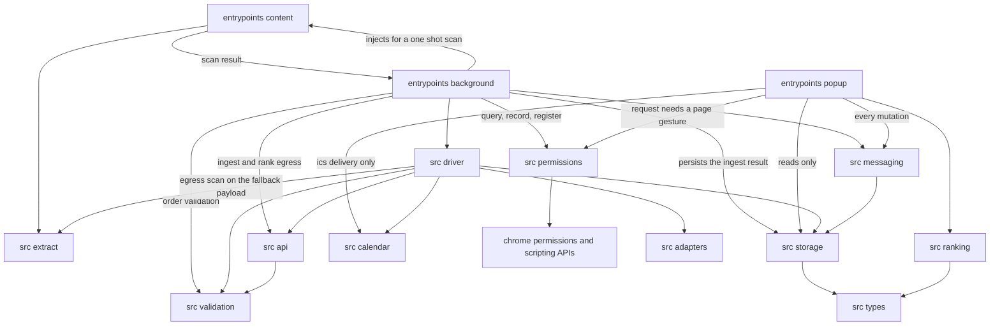

**This graph is complete for the extension: an edge that is not drawn is not permitted, and an edge
carrying a qualifier is permitted only for what the qualifier says.** The popup reaches the store
directly for reads and never for writes — see the single-writer rule below — and nothing outside
`src/storage/` reaches `chrome.storage` at all.

**Two modules are exempt from the completeness rule, and they are exempt by a property rather than
by fiat: `src/types/` and `src/config.ts` are leaves.** Neither imports anything — `src/types/` is
declarations and `src/config.ts` is build-substituted literals — so neither can participate in a
cycle, and an edge into a leaf constrains nothing. **Every module may import them.** The alternative
is fifteen arrows into each, which would obscure the edges that carry a real rule. The exemption is
stated because the rule above is only worth having if it has no silent exceptions: §7.2 has
`src/api/` reading `API_BASE_URL`, §5.2 has `src/storage/` reading `MAX_STORED_ORDERS`, and §3.5
assigns entity types to four consumers, and every one of those would otherwise be a violation of a
graph that declares itself exhaustive.

**`src/extract/` is the one module that runs in two execution contexts, and the split is along the
line between reading a page and inspecting a payload.** Extraction has to run where the DOM is, so
it is injected with the content script. The FR-3.1.3 egress scan has to run where the payload is at
the moment it would leave, and on the fallback path (§4.2) that is the worker — the driver holds the
captured DOM and is about to hand it to `src/api/`. So the graph carries `DRIVER --> EXTRACT`,
qualified for the scan and for nothing else: the driver may ask "is this payload safe to send?" and
may not ask `src/extract/` to touch a page.

This is not a compromise the split was designed around; it is why the scan is a **pure function of a
payload** (§8.2) rather than a DOM operation. A pure function has no context of its own and runs
wherever it is called, which is what lets one module serve a content script and a worker without
either half depending on the other's globals. The alternative — scanning inside the content script
at capture time — would put the check at the wrong moment: the payload that gets sent is the one the
driver holds after capping and after any later mutation, and a scan run earlier would be attesting
to a value that is no longer the one leaving.

**`src/permissions/` has two inbound edges because FR-3.7.2's second tier needs both.** The popup
owns the one call that spends a user gesture; the worker owns everything gesture-free — the
`permissions.contains` query, the decision that a standing grant is worth offering, recording the
outcome of the offer, and `chrome.scripting.registerContentScripts` once a grant lands. A graph
drawing only the popup's edge would make the tier unimplementable as written, since none of those
four can be reached from a document that is closed most of the time.

**The worker has four edges the driver also has, and that is deliberate.** Ingestion (§4.1) is not
a return: no `DriverSession` exists, no state machine is running, and routing a page scan through
`src/driver/` would put the driver on the critical path of the one flow that must work before any
return is possible. So `entrypoints/background.ts` reaches `src/api/`, `src/validation/` and
`src/storage/` itself for ingestion, and reaches the content script through
`chrome.scripting.executeScript` for the FR-3.1.1 first-run "Scan this page". The worker is thin in
both flows — it routes, it does not decide — but ingestion is short enough that the routing is the
whole of it.

| Module | Purpose | Execution context |
|---|---|---|
| `entrypoints/content.ts` | Recognise, wait for render, extract, strip, cap. Nothing else | Isolated world, retailer tab |
| `entrypoints/background.ts` | Service worker: message router, driver host, egress | Background |
| `entrypoints/popup/` | The primary surface; ranks at render time | Extension page |
| `src/extract/` | Subtree selection, script stripping, size capping, **and the FR-3.1.3 fail-closed egress scan** — FR-3.1.2, FR-3.1.3 | **Both.** Extraction runs injected with the content script, where the DOM is; the scan runs in the **worker**, where the payload is when it is about to be sent |
| `src/adapters/` | The bundled adapter registry and its types | Data, read in the worker |
| `src/driver/` | The FR-3.3.9 state machine, session persistence, step execution, **and the decision to abort a flagged fallback transmission as `report_stuck`** | Worker |
| `src/validation/` | Action validator and order validator — the two hostile-input boundaries | Worker |
| `src/storage/` | The only module that touches `chrome.storage.local` | Worker and popup |
| `src/api/` | Typed client for the seven endpoints; maps `reason` codes to typed errors | Worker |
| `src/ranking/` | Urgency ordering, computed at render — FR-3.2.2. **Pure:** takes the orders and the current instant as arguments, reads no clock of its own | Popup |
| `src/calendar/` | **Pure.** Builds the template URL and the `.ics` text. Delivers neither | Context-free |
| `src/permissions/` | Query, decide whether to offer, record the outcome — FR-3.7.2 | Popup for the request, worker for the rest |
| `src/messaging/` | Internal and external message routing, with origin checks | Worker |
| `src/types/` | The entity types and the driver session shape. No behaviour, no imports | All |
| `src/config.ts` | Build-time constants. **Reads no network** — high-level design §8.4 | All |

**`src/storage/` is the only module permitted to import `chrome.storage`.** Everything else asks
it. This is what makes the eviction rule, the deletion carve-out and the state-machine persistence
testable in one place instead of scattered across the driver.

**`src/extract/` is separate from `entrypoints/content.ts`** because the extraction and capping
logic is where FR-3.1.3 is enforced, and it needs to be unit-testable against a DOM fixture without
loading an extension.

**FR-3.1.3 is two obligations of different strengths, and each one is assigned here rather than
left to be inferred.** The requirement binds every path that sends DOM, and until this revision only
its byte ceiling had an owner.

- **The absolute prohibition — never transmit the label page or any page reached after label
  generation — binds both egress paths, and is structural on only one of them.** Ingestion sends
  the order-list subtree by construction (§4.1), so on that path there is nothing to enforce. On the
  driver's fallback path it is *not* structural: the fallback fires precisely when the adapter did
  not recognise the page, so the adapter cannot be asked whether the page in front of it is the
  label page. That is why the requirement pairs the prohibition with a scan rather than resting on
  it, and why the scan below is the mechanism by which the prohibition is honoured on the path where
  it is not free.
- **The fail-closed scan is owned by `src/extract/`, and the decision it forces is owned by
  `src/driver/`.** Before any `POST /returns/next-step` payload is returned for transmission, the
  extractor scans the candidate DOM for tracking-number and postal-address patterns and reports a
  match. `src/extract/` is the right home: it already holds the capping that runs on the same path,
  it already runs in the tab where the DOM is, and it is already fixture-testable without a browser
  — the three properties the scan needs. What it does **not** own is the consequence. A scan result
  is a fact; turning a fact into an abandoned step and a handed-back flow is a state-machine
  decision, and `src/driver/` is the module that owns FR-3.3.9's edges. So the extractor never
  transmits and never suppresses: it returns the match, the driver aborts the call it was about to
  make, and the step surfaces as `report_stuck` for the user to finish manually.

**Fail closed means the scan's own failure aborts too.** An extractor that throws while scanning has
not established that the payload is clean, and a payload not established as clean is not sent. The
requirement states its own residual — a pattern scan is a heuristic and will miss some layouts — so
what this design asserts is that the scan runs on every fallback egress and that a match stops the
transmission, not that the scan is complete. See §6.2, which carries the row, and §8.2, which
carries the assertions.

**`chrome.permissions.request` is issued by the popup, and only by the popup.** A service worker
has no user gesture to spend, and a gesture does not survive being forwarded to it in a message —
the call simply rejects. So `src/permissions/` is split by what needs a gesture: the request itself
is made from the popup, and everything gesture-free — `permissions.contains`, deciding whether the
standing grant is worth offering yet, recording the outcome, and calling
`chrome.scripting.registerContentScripts` after a grant — stays in the worker. FR-3.7.2's second
tier is unobtainable from anywhere else, which makes this a placement constraint rather than a
preference. High-level design §5.1's first-run sequence was corrected to match.

**`src/ranking/` takes the current instant as an argument and has no class diagram.** It is one
pure function — orders in, ordered orders out — so there is no collaborator graph to draw and
nothing to inject beyond the instant itself. That instant comes from the popup's render, which is
also what makes FR-3.2.2's "derived at render" literally true: two renders a second apart are two
different arguments, not two reads of a hidden clock. The §8.2 stability assertion depends on this
— a ranking function that read `Date.now()` internally could not be asked twice with the same
input.

**`src/calendar/` builds bytes and hands them to someone else.** FR-3.5.3 requires the `.ics`
fallback to be generated locally, and `URL.createObjectURL` is not exposed in the MV3 worker's
global scope, so the usual blob-download path is unavailable from the context the module would
otherwise live in. Rather than take a `downloads` permission that FR-3.7.1's minimal manifest does
not list, the module stays pure — it returns a template URL string or `.ics` text and delivers
neither. Opening the template URL is `chrome.tabs.create` from the worker, which is fine; delivering
the `.ics` is a blob and an anchor in the popup, which is a page and has both. The permission we do
not request is worth more than the convenience of downloading from the worker.

**`SessionStore` lives in `src/storage/`, not in `src/driver/`.** It is diagrammed in §3.3 as a
driver collaborator because that is who uses it, but `DRIVER_SESSION` is persisted state and is
governed by the same atomicity, quota and rebuild rules as everything else the store holds. A
session store that reached `chrome.storage` directly would break the invariant stated two paragraphs
above on the very entity whose durability the design depends on most.

**The worker is the only writer.** This resolves what the first draft left open: the popup and the
worker can both run, `chrome.storage.local` guarantees atomicity per `set` and nothing across a
read-then-write pair, and two writers would lose orders in a way that surfaces as "the extension
forgot my J.Crew order" — unattributable and unreproducible. Every popup mutation goes through
`src/messaging/` to the worker. The popup still *reads* directly, because a stale read costs a
re-render and a lost write costs an order.

---

## 3. Class Design

### 3.1 Server — carriers and services

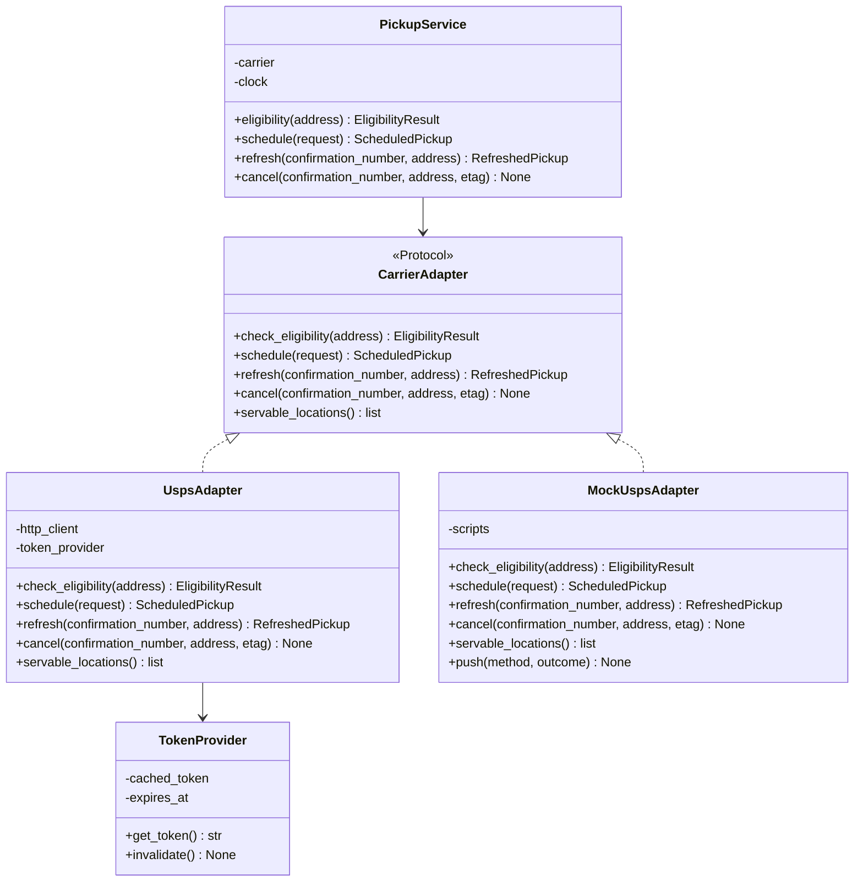

**`CarrierAdapter` is a `typing.Protocol`, not an ABC.** Nothing needs to subclass it, the mock is a
separate implementation rather than a partial override, and a structural type keeps the test double
from inheriting behaviour it should not have.

**`refresh` and `cancel` both take an address.** This is not redundancy — USPS requires the address
the pickup was booked against, which is why `BOOKED_ADDRESS` exists as an immutable snapshot
separate from the editable `ADDRESS`. An adapter signature that omitted it would make the high-level design §4.2 rule
unenforceable at the type level, which is the only place it can be enforced on a stateless server.

**`PickupService.cancel` takes the ETag and passes it straight through.** The token is the
client's: requirements §4.1 defines `DELETE /pickups/{confirmation_number}` as a cancel using a
freshly obtained ETag, and §4.5 has the worker refreshing to get one and then sending it. A
stateless server has nowhere to have kept it. So the route reads it from the request, the service
takes it as a parameter, and the adapter receives it unmodified — the service performs no refresh of
its own and holds no ETag between calls. The signature matters more than it looks: a
`cancel(confirmation_number, address)` cannot call a
`CarrierAdapter.cancel(confirmation_number, address, etag)` at all, and the only way to make it
compile is to have the service refresh internally, which would put a second, invisible refresh on a
path whose whole correctness argument is that exactly one refresh precedes each cancel. The
ordering guarantee of FR-3.4.6 lives in the worker (§4.5); what the server guarantees is
pass-through and a typed `EtagExpired` when the carrier refuses. See §8.2.

**`servable_locations()` exists on the adapter** because FR-3.4.8 forbids substituting a package
location the carrier cannot honour, and which locations are servable is carrier knowledge. Returning
the reduced set is what lets the extension re-ask rather than guess.

**`TokenProvider` caches for the warm container lifetime only**, and `invalidate()` exists so a 401
can force one retry with a fresh token rather than failing the user's schedule call. That single
retry is the *only* retry on a write path in the system. It is constructed **once per container**
from the credential the lifespan already fetched, and `invalidate()` clears **the token and never the
credential** — a 401 must not turn into a Parameter Store round trip on a path a user is waiting on.
Its lifetime is therefore the container's, not the request's: two concurrent requests in the same
warm container share one token, and the second one to see a 401 finds a token another already
refreshed.

**`MockUspsAdapter` implements all five Protocol methods**, because §7.1 makes it the default until
USPS access is granted. A mock covering two of five would leave refresh, cancel and
`servable_locations` with no working implementation on the only path that currently runs, and four
of the §8.3 integration tests unwritable.

**A script is a per-method queue of outcomes, consumed in order.** `push(method, outcome)` appends
one; each call to that method takes the next, and falls back to a default success when the queue is
empty. Queue-per-method rather than argument matching, because what the tests need to express is
*sequence* — eligible and then refused at schedule, a schedule whose response is lost, a cancel that
first sees a stale ETag — and an argument matcher makes an ordering test read as though order did
not matter. An outcome is a value to return, an exception to raise, or the sentinel that produces
the transport failure of a dropped response rather than returning anything. A test that leaves
outcomes unconsumed fails at teardown: a script nobody drained is usually a flow that never ran.

### 3.2 Server — ingestion and the model boundary

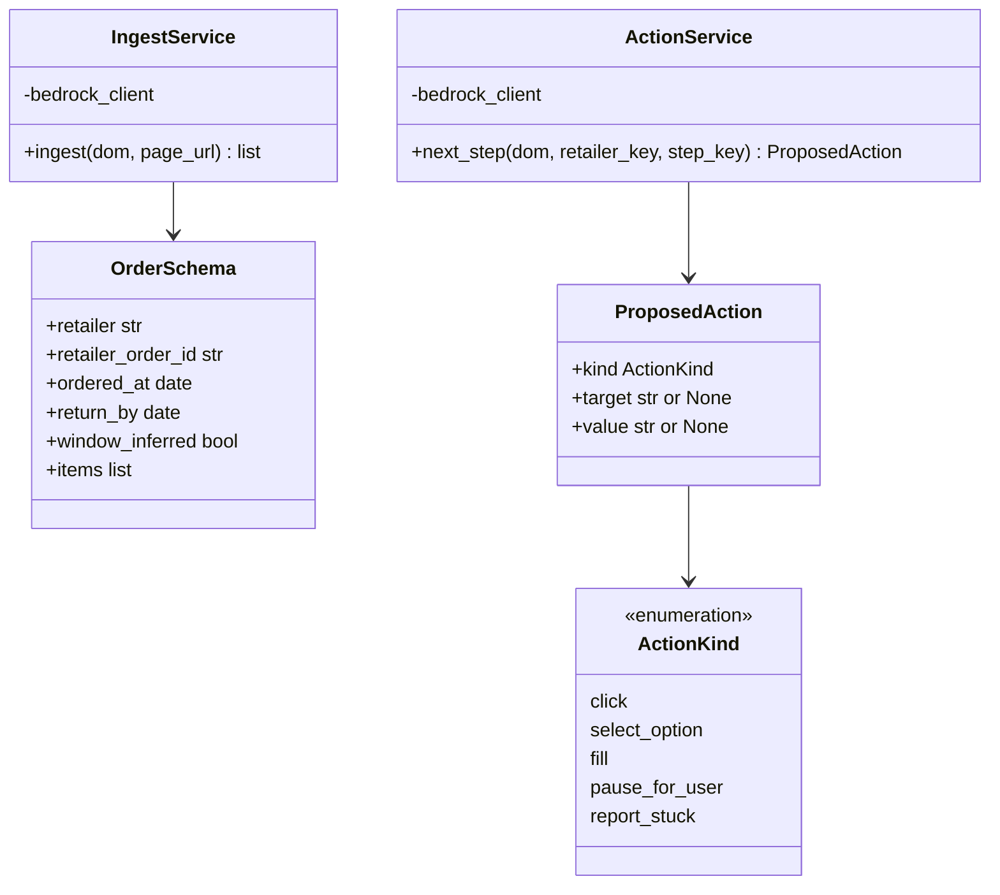

Both services call Bedrock with **tool calling and a forced tool choice** (high-level design §6.8). Neither parses
prose; there is no free-text path to write a parser for, which is the point of the decision.

**`ActionKind` is a closed enumeration of exactly five members, and it is the single source the
tool schema is generated from.** A hand-written JSON schema next to a hand-written Python type is
two lists that drift; the model would then be offered a sixth verb nothing downstream can execute,
or the type would admit a verb the schema never offers. Generating the schema's `enum` from the
enumeration makes the drift unrepresentable. `kind` is not a `str`.

**`target` and `value` are optional, and which of them is required depends on `kind`:**

| `kind` | `target` | `value` | Meaning |
|---|---|---|---|
| `click` | required — a selector | must be absent | Press one control |
| `select_option` | required — a selector | required — the option to choose | Choose from a closed set the page offers |
| `fill` | required — a selector | required — the text to type | The only action carrying an attacker-chosen payload |
| `pause_for_user` | must be absent | must be absent | Hand control back; the reason is the step, not a field |
| `report_stuck` | must be absent | must be absent | Give up on this step and say so |

"Must be absent" is enforced, not merely documented: a `pause_for_user` arriving with a `target`
is rejected as malformed rather than accepted-and-ignored, because a model that filled in a field
the verb has no use for is a model whose output should not be trusted for the field the verb *does*
use. Three flat strings would have made every illegal shape representable and pushed the check into
the reader of each field.

**The kind is constrained by the tool schema, and validated again in the extension.** The server
checking it is convenience; the extension checking it is the security boundary, because the server
is the thing whose compromise the extension is defending against. The extension's copy of this
table is `src/validation/`, and it is deliberately a second implementation rather than a shared
one — a shared constant compromised on the server is compromised on both sides at once.

### 3.3 Extension — the driver

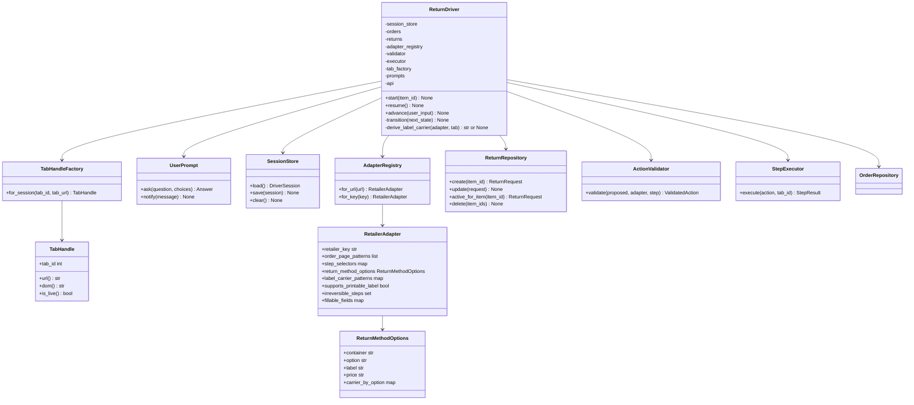

**`ReturnDriver.transition()` is private and is the only writer of state.** Every public method
routes through it, and it persists *before* acting — FR-3.3.9. An implementation that acts first and
saves after is the specific bug this structure exists to prevent, because the worker can die between
the two.

**`RetailerAdapter.irreversible_steps` and `fillable_fields` are adapter data, not driver logic.**
Irreversibility is per-retailer knowledge (high-level design §5.2), and `fillable_fields` is what lets the validator
bound a `fill` by declared field rather than by arbitrary selector (SEC-2 in high-level design §6.8).

**`ActionValidator` takes the adapter and the step, not just the action.** A validator that saw only
the action could check the vocabulary but not whether the target is a field this retailer declared
fillable — which is the stronger half of the bound.

**`StepExecutor` is the only module that executes a model-proposed action against a retailer page.**
That, and not "the only caller of `chrome.scripting.executeScript`", is the monopoly this design
holds — stated as the narrower rule it would otherwise keep acquiring exceptions to. The worker
makes other `chrome.scripting` calls that are not step execution and are not routed through the
executor: `registerContentScripts` after a permission grant (§2.2), a one-shot `executeScript` to
run the extractor on the active tab for a first-run scan (§4.1), and `TabHandle`'s reads (§3.3) —
`dom()`, `url()` and the option and price reads of §4.6. None of them carries an action the model
proposed, which is what the monopoly exists to guard: reading a page cannot navigate, submit, or
spend, and it is the acting that needs a single audited door. Within a return, the executor receives
a `ValidatedAction`
— a type the validator alone can construct. An unvalidated action is therefore not merely
discouraged but unrepresentable at the call site.

**`TabHandle` and `UserPrompt` are collaborators, not ambient calls.** The driver has to read the
page and it has to stop and ask the user — FR-3.3.7's `pause_for_user` and FR-3.4.8's re-ask are
both *the driver deciding to hand control back*. If those reach `chrome.tabs` and the popup directly
from inside the driver, then the driver cannot be exercised without a browser, and the §8.2 unit
rows for it are unwritable. Injected, a test drives the whole state machine against a scripted tab
and a scripted user, and the browser only appears in the §8.3 integration rows.

**The driver holds a `TabHandleFactory`, not a `TabHandle`.** §7.2 wires the worker's graph once,
at startup, and a handle cannot be built then: it is per-tab and per-return, it holds a `tab_id`
that does not exist yet, and it corroborates a `tab_url` that has not been visited. So the injected
collaborator is the factory, and the driver calls `for_session(tab_id, tab_url)` once per `start`
and once per `resume`, from the values the session carries. Building it from *stored* values is also
what makes §4.4's rehydration check expressible at all — `is_live()` has to be answerable against a
handle constructed from what the record claims, before the driver is willing to act on that claim.
A handle injected at wiring time would have had to be trusted rather than checked.

**`TabHandle.is_live()` is a distinct question from having a `tab_id`.** Tab IDs are reused, so a
rehydrated session's stored ID may now address a different page entirely; the handle answers by
corroborating the stored `tab_url` against the live one, and the driver treats a dead handle as a
resume failure rather than acting on the wrong tab. This is the type-level form of the §4.4 rule.

**`start(item_id)` resolves the item through `OrderRepository`.** An item ID by itself is not
addressable — the store is keyed by order — so `Order` carries its `items` and the repository
exposes a `find_item(item_id)` returning the item together with the order it belongs to. The driver
needs both: the item names what is being returned, the order names the retailer whose adapter and
host permission apply. `ReturnRepository.active_for_item(item_id)` uses the same lookup, which is
what keeps FR-3.3.10's one-active-return rule checkable before a second flow starts.

**`ReturnRepository` is a driver collaborator, because the driver owns the machine and the machine
lives on the `RETURN_REQUEST`.** FR-3.3.9's states are states *of a return request* — FR-3.3.10
says so directly when it calls `LabelPrinted`, `DroppedOff`, `HandedOff` and `Aborted` terminal for
one. A driver that held only `SessionStore` could run the machine and never record it. Two
consequences follow and both are binding:

- **`start(item_id)` calls `active_for_item` before anything else**, and refuses with the existing
  request named by its state when one comes back. Checking after a session exists would have already
  created the second driver FR-3.3.10 exists to prevent.
- **`transition(next_state)` writes the return request and the session in the same `transact`.**
  The persist-before-act guarantee is worth nothing if it covers one of the two records carrying the
  machine: a worker dying between two separate writes leaves a session at one state and a request at
  another, and no rule says which to believe on the way back up.

**`ReturnRequest.state` is authoritative and `DriverSession.state` is a mirror.** Both records carry
a `state` field and the split has to be stated or it becomes the bug above. The rule:

| Record | Lifetime | What its `state` means |
|---|---|---|
| `ReturnRequest` | The whole life of the return, including long after any driver has stopped | **The FR-3.3.9 state.** This is what FR-3.3.10 reads, what the popup renders, and what eviction's non-terminal carve-out tests |
| `DriverSession` | Only while a driver is attached; `SessionStore.clear()` on reaching a terminal | The *driving* position — the tab, the step, and a copy of the state written in the same `transact` so a rehydrating worker can check the two agree before trusting either |

A terminal state clears the session and leaves the request. This is why `SessionStore.clear()`
exists, why §4.4 can conclude that a session with no matching tab is `Stalled` without consulting
anything else, and why a return request in a terminal state has no session at all — which is the
correct answer to "what is driving this?" once nothing is.

**`RetailerAdapter.return_method_options` is a structure, not a selector, because FR-3.3.4 needs
pairs.** The requirement is to stop and present *every* option the driver can see, each with its
cost stated, to mark an unreadable price **unknown** rather than omit the option, and never to
select while any price in the set is unknown. The single `return_method_selector` that requirements
§5.3 carried until this revision cannot express that:
it can find a control, but not the label and the price that belong to it, so the pairing would have
to be re-derived inside the driver once per retailer — which is exactly where FR-3.3.4's SHALL NOT
would then have to be re-derived too. So the adapter declares the container, the repeated option
within it, and the label and price within *that*, in the same way `step_selectors` declares steps.
A price selector that matches nothing is a readable option with an unknown price, which is the case
FR-3.3.4 names — and, per the same requirement, an FR-3.7.3 adapter-health signal, because a
retailer whose prices stopped being readable has changed its flow.

**`carrier_by_option` and `label_carrier_patterns` are the first two of FR-3.3.5's three sources,
and `ReturnDriver.derive_label_carrier` is what walks them in order.** `label_carrier` gates the
entire pickup path and had no owner in this document before this revision. It has one now, and the
order of preference is the requirement's, not a convenience:

1. **The option the user chose.** `ReturnMethodOptions.carrier_by_option` maps a presented option to
   the carrier whose postage it yields. This is the primary source and it consults no page: the user
   already told us, under FR-3.3.4, and the adapter already knew what each option meant.
2. **Recognition on the label page, in the browser.** `label_carrier_patterns` is a per-carrier map
   of selectors and patterns — branding, and the tracking-number format — matched against the label
   page locally. FR-3.1.3 forbids *transmitting* that page, not reading it, which is the distinction
   that makes this source available at all.
3. **Asking.** `UserPrompt.ask` — "whose label is this?" — is a question a person holding a printed
   label answers in one glance.

**A miss at source three is not a value.** `derive_label_carrier` returns nothing determinable, the
driver does not schedule, and the flow completes as a drop-off. It **never falls back to USPS**:
that is FR-3.3.5's explicit SHALL NOT, and the reason is the failure it produces — a pickup that
books, a box left out, and nobody coming, discovered after the window closes. The rule is stated
here, where the derivation lives, rather than only at the server's `WrongCarrierLabel` backstop,
because a client-supplied field checked server-side is a second line and the requirements say so.
The flow this method sits in is §4.6.

### 3.4 Extension — storage

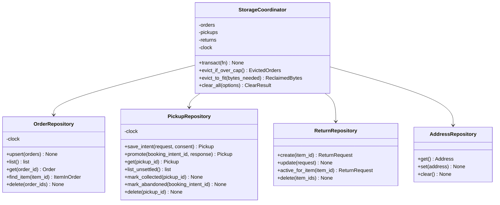

**`upsert` merges by `(retailer, retailer_order_id)` and must never touch `first_seen_at`.** FR-3.1.5
orders eviction on it, so a revisit that refreshed it would silently reset an order's age and make
the retention ceiling unenforceable. This is the single most likely accidental regression in the
storage layer and belongs in a test, not a comment.

**`save_intent` and `promote` are two calls because the schedule response is what carries the
address to snapshot.** §5.2: the provisional record is written before the call so a lost response
leaves evidence, and promotion writes `BOOKED_ADDRESS` from the *response*, never from the client's
own address.

**`save_intent` takes the consent stamp as a second argument, because NFR-6.2's record has to be
written by the same call that creates the thing it consents to.** NFR-6.2 requires `consented_at`
and `consent_extension_version` on the `PICKUP` record, captured at the confirmation screen that
precedes `POST /pickups`, and **never recorded server-side** — the server is stateless and this is
the one place a consent record could otherwise have gone missing. Passing it in makes three things
structural rather than remembered:

- **There is no `Pickup` without a consent stamp.** The provisional record and its consent are one
  `set`, inside the same `transact`, so no crash can leave a booked pickup whose consent is unproven.
- **The stamp comes from the confirmation screen, not from the repository.** `consented_at` is when
  the user pressed the button, not when storage got round to writing; a `clock` call inside
  `save_intent` would record the wrong instant and would still record one if the screen was never
  shown.
- **`consent_extension_version` is the version of the disclosure the user actually saw**, which is
  the extension version at the moment of the gesture. It is read from the manifest at the screen and
  carried, for the same reason.

`promote` does not take it and does not rewrite it. Consent is given once, before the network call;
the carrier's answer cannot retroactively change what the user agreed to. §4.3 draws the path and
the §8.3 row "Schedule writes the consent record" asserts both fields land with the provisional
write rather than the promotion.

**`clear_all` returns a result rather than `void`** because §4.3's deletion carve-out requires
enumerating uncancelled pickups and offering to cancel them first. A repository method that just
deleted would make the carve-out impossible to honour from the call site.

**The two operations that span entities belong to `StorageCoordinator`, not to `OrderRepository`.**
Eviction deletes orders and must not orphan a pickup that is still unsettled; `clear_all` reads
pickups to build its result and then deletes across all three. Hanging those off the order
repository made it depend on the other two, which is a repository knowing about entities that are
not its own. The coordinator is the only object that knows more than one, and each repository is
left owning exactly one key.

**`transact(fn)` is the composed-write mechanism, and it is not a transaction.** `chrome.storage`
offers atomicity per `set` call and nothing across a read-then-write pair, so the honest primitive is
a serialising queue: `transact` runs `fn` with exclusive access to the store, reads what it needs,
and commits **every touched key in a single `set`**. That gives two guarantees and withholds a third
— no two composed writes interleave, and a composed write lands whole or not at all; but a write
that has landed **cannot be rolled back** by a later failure in the same worker. Anything needing to
survive a rollback must therefore be ordered last. Since §2.2 makes the worker the only writer, one
queue in one worker covers every writer there is. This is what `save_intent` and `promote` run
inside, and what makes the read-modify-write in `upsert` safe against a second scan arriving mid
flight.

**Both repositories that reason about time take a `clock`.** `upsert` stamps `first_seen_at`,
eviction compares against it, and `mark_abandoned` fires on an elapsed interval — all three are
otherwise `Date.now()` calls buried in a method, which makes retention and abandonment testable only
by waiting. With an injected clock the §8.2 rows for FR-3.1.5 and the `Booking → Abandoned`
transition run instantly and deterministically. `ReturnRepository` takes none, because it stamps
nothing.

**It is one clock instance injected twice, not two clocks.** `StorageCoordinator` receives it and
hands the same object to each repository that needs one. Two clocks free to disagree would let a
pickup be stamped after the order that must outlive it, and the resulting eviction bug would appear
only under a test that advanced one and not the other — which is to say, never in CI and once in
production.

**The cancellation flow needs four `PickupRepository` operations, so they are declared.** §4.5
loads a pickup by id to recover its confirmation number and booked address, writes `Collected` when
the refresh reveals the carrier already came, and deletes the record once a cancel succeeds. Those
are `get`, `mark_collected` and `delete`. `mark_collected` is separate from a general `update`
because `Confirmed → Collected` is the one transition in the pickup lifecycle that is *observed*
rather than commanded — §5.2 — and a repository method named for it is what keeps that observation
from being written as an arbitrary state assignment somewhere in the worker.

**`ReturnRepository.delete(item_ids)` exists because `ClearResult.returns_deleted` is a count of
something, and eviction has to take return requests with the orders they belong to.** Both callers
are the coordinator's cross-entity operations. `clear_all` deletes every return and reports the
number; eviction deletes an order's returns as it deletes the order, because a `RETURN_REQUEST`
keyed to an item whose order is gone is unreachable — `find_item` is the only way in, per the last
paragraph of this section — and would sit in the quota forever. It takes item IDs rather than order
IDs so that the coordinator, which is the object that knows an order's items, does the joining; the
return repository continues to know only its own key. The **non-terminal carve-out is the
coordinator's**, not this method's: §5.2 forbids evicting an order whose return is still running, so
by the time `delete` is called that question has already been answered and the method's job is to
delete what it is told.

**`AddressRepository` is owned by `StorageCoordinator` like the other three, and `clear_all` deletes
the address with everything else — through `clear()`.** The address is user data under the same
Limited Use disclosure as the orders; a "delete everything" that quietly kept the user's home
address would be the single worst thing this design could leave behind. So the repository declares
the operation rather than leaving the coordinator to remove a key it does not own: `clear()` is the
one call, and `clear_all` makes it inside the same `transact` as the other three deletions, so a
partial clear is not a reachable state. It is not counted in `ClearResult` — there is at most one
and the caller does not need a number — but it is gone, and the §8.2 row for `clear()` asserts a
subsequent `get()` returns nothing. Eviction never calls it: FR-3.1.5's ceiling is about order age,
and an address has no age the product reasons about, which is also why `AddressRepository` takes no
clock.

**`Order` carries its `items`, and `find_item` is the only way in.** The store has one key per
order; an item has no key of its own. `find_item` returns the item *and* its order together, because
every caller needs the retailer as well as the item — see §3.3.

### 3.5 The types the diagrams name

Most type names above are the high-level design's entities under their implementation names, and
this document deliberately does not restate them: `Order`, `OrderItem`, `ReturnRequest`, `Pickup`,
`Address` and `BookedAddress` are defined by **high-level design §4.2**, and its ERD is the
authority on their fields and cardinalities. Restating them here would create a second definition to
keep in sync, and the first thing to drift would be the field that matters.

Eleven types are *not* upstream entities — they exist only because of a decision in this document,
so they are defined here and nowhere else.

| Type | Fields | Why it exists |
|---|---|---|
| `ValidatedAction` | `kind`, `target`, `value`, `adapter_key`, `step_key` | Constructible only by `ActionValidator`. Carries the adapter and step it was checked against, so `StepExecutor` cannot be handed an action validated for a different page |
| `DriverSession` | `state`, `item_id`, `order_id`, `retailer_key`, `tab_id`, `tab_url`, `step_key`, `attempt_count`, `started_at`, `last_written_at`, `schema_version` | The concrete form of high-level design §4.2's `DriverSession` — `adapter_step_key` is `step_key` here and `last_progress_at` is `last_written_at`, the same fields under shorter names. The *driving* position; its `state` is a mirror of the authoritative `ReturnRequest.state`, written in the same `transact` — §3.3. `tab_url` corroborates `tab_id`; `attempt_count` bounds retries; `schema_version` is what makes the §5.2 defensive read possible |
| `ReturnMethodOptions` | `container`, `option`, `label`, `price`, `carrier_by_option` | Adapter data describing where FR-3.3.4's options live and what each one means. Four selectors and a map, because the requirement needs option/label/price as a *pair set*, not a single control — §3.3. `carrier_by_option` is FR-3.3.5's first source |
| `ConsentStamp` | `consented_at`, `consent_extension_version` | NFR-6.2's record, captured at the confirmation screen and passed into `save_intent`. A type rather than two loose arguments so that the pair cannot be split, half-supplied, or reordered at the one call site that writes it |
| `EvictedOrders` | `count` | The return of `evict_if_over_cap()`. A count of **orders** |
| `ReclaimedBytes` | `count` | The return of `evict_to_fit(bytes_needed)`. A count of **bytes** |
| `ClearResult` | `orders_deleted`, `returns_deleted`, `pickups_deleted`, `uncancelled_pickups` | `uncancelled_pickups` is the carve-out: the caller must offer to cancel them before the deletion is presented as complete |
| `EligibilityResult` | `eligible`, `next_pickup_date`, `reason` | The hard gate of FR-3.4.3. `next_pickup_date` is the carrier's own date, never computed locally, and is present only when `eligible`. `reason` is present only when **not** `eligible`, and the only legal value is `address-not-serviceable` — an eligibility check answers one question and has exactly one way to say no |
| `ItemInOrder` | `item`, `order` | The result of `find_item`. A pair rather than a bare item, because no caller has ever wanted one without the other |
| `ScheduledPickup` | `confirmation_number`, `scheduled_date`, `etag` | What `CarrierAdapter.schedule` returns. It is **not** the `Pickup` entity: it is the carrier's answer, before the client has decided to keep it. `etag` has no home in the ERD because the client stores the pickup and this token belongs to the booking that produced it |
| `RefreshedPickup` | `state`, `scheduled_date`, `etag` | What `CarrierAdapter.refresh` returns. `state` is the carrier's own view — the value §4.5 branches on to decide whether a cancel is still possible — and `etag` is the fresh token the cancel must carry. Distinct from `ScheduledPickup` because a refresh has no confirmation number to return: the caller supplied it |

**`EvictedOrders` and `ReclaimedBytes` are two types for two numbers that must never be confused.**
Both evictors return an integer and the integers mean different things: `evict_if_over_cap()` counts
orders removed to get back under FR-3.1.5's ceiling, `evict_to_fit(bytes_needed)` counts bytes freed
to satisfy a quota rejection. Bare `int` returns made `if (freed < bytes_needed)` and
`if (freed < orders_needed)` the same expression, and the caller that got it wrong would loop
forever or give up early with no type error to catch it. They are one-field wrappers on purpose —
the field carries no information the name does not, and the name is the entire point. This is also
what makes the §5.2 rule legible at the call site: `evict_to_fit` is the only one that runs
**outside** `transact`, called from the quota-rejection path, and it is now the only one whose
return type says so.

**Each of these types has exactly one owning module, and the three wire types have two.**
`ValidatedAction` is owned by `src/validation/` — it is the only module that may construct one.
`DriverSession` is owned by `src/driver/` and persisted through `src/storage/`. `ClearResult`,
`ItemInOrder`, `EvictedOrders` and `ReclaimedBytes` are owned by `src/storage/`. `ReturnMethodOptions`
is owned by `src/adapters/`, which is where the selectors it holds are authored. `ConsentStamp` is
owned by `src/storage/` and constructed by the popup's confirmation screen — the one place a consent
gesture exists. `EligibilityResult`, `ScheduledPickup` and
`RefreshedPickup` are **response shapes of the pickup endpoints**, so they exist twice by design:
`app/models/` defines the server's authoritative version and `src/api/` declares the extension's
view of the same wire shape. No other extension module declares them — `src/driver/` and
`src/storage/` receive them from `src/api/` — and the §2.2 rule that `src/api/` is the only egress
module is what keeps the second copy from spreading. The pair is a deliberate duplication across a
network boundary rather than a duplication inside one codebase, and the "Refresh a scheduled
pickup" and "Eligibility, not serviceable" integration rows in §8.3 are what keep the two halves
honest: they assert against the field names this section lists, so a rename on either side fails a
test rather than a user's cancel.

**`ScheduledPickup` and `RefreshedPickup` are adapter return types, not stored entities.** The
`Pickup` the extension persists is assembled from a `ScheduledPickup` plus the `BookedAddress` the
request carried; the server, being stateless, keeps neither. Their `etag` is the clearest reason
they cannot be the ERD entity: it is a carrier concurrency token with a lifetime of one call pair,
and putting it in the persisted model would invite exactly the caching FR-3.4.6 forbids.

`StepResult` and `Answer` are the return types of `StepExecutor.execute` and `UserPrompt.ask`; each
is a small record whose shape follows from the one call site that produces it and the one that
consumes it, and pinning their fields here would be documenting an implementation detail as a
contract.

---

## 4. Class Interactions

### 4.1 Ingestion, first run

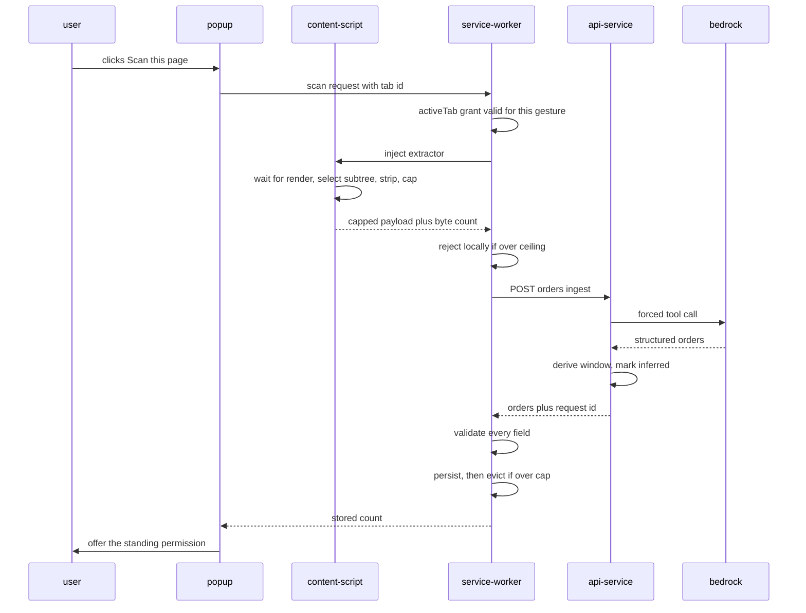

**The client-side ceiling check happens before the call, not after.** FR-3.1.3 binds the extension,
and the server's identical ceiling is a backstop against a caller that is not our extension.

**Validation happens after the response and before storage**, never in the other order. An order
that fails is surfaced as unparsed and is not stored — high-level design §7.4.

### 4.2 The adapter miss, which is the interesting path

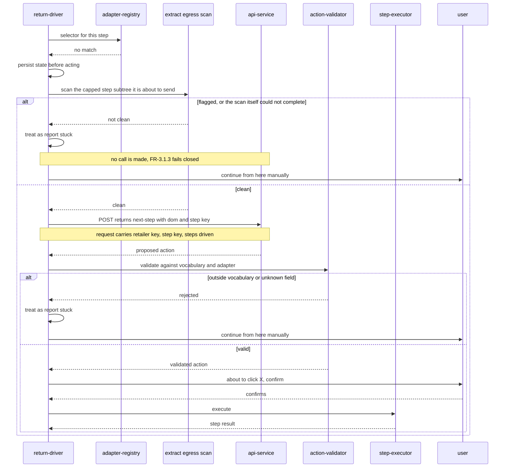

**The scan is the first thing on this path and the call is the second.** FR-3.1.3's obligation is
about egress, not about capture, so the check belongs at the last moment before the payload leaves
the extension — after capping, after any late mutation, in the worker that holds the bytes. Drawing
it anywhere earlier would attest to a payload that is not the one sent.

**The flagged branch never reaches `api-service`, and neither does a scan that fails.** Fail closed
means the absence of a clean result is a stop, not a pass: a scanner that throws, times out, or
returns nothing is treated exactly like a scanner that found a tracking number. Both land on
`report_stuck`, which is a defined outcome the user can act on (`Driving --> Stalled`, requirements
FR-3.3.9) rather than an error the user has to interpret. This is the only interaction in §4 that
sends a page payload off the device, so it is the only one that draws the scan.

**Every model-proposed action is confirmed, without exception** (high-level design §5.2). On a miss the driver has no
configured knowledge of the step, which is exactly when the model has the most influence — so the
"pause at irreversible steps" rule would be weakest precisely where it matters most. The rule is
therefore "pause at irreversible steps *and* at every model-proposed action".

**A timeout on the fallback call is `report_stuck`, not a wait.** NFR-6.4 budgets it at
`MODEL_FALLBACK_TIMEOUT_MS`; a driver that hangs is worse than one that hands the step back, because
the user cannot distinguish thinking from broken.

### 4.3 Scheduling, with the provisional record

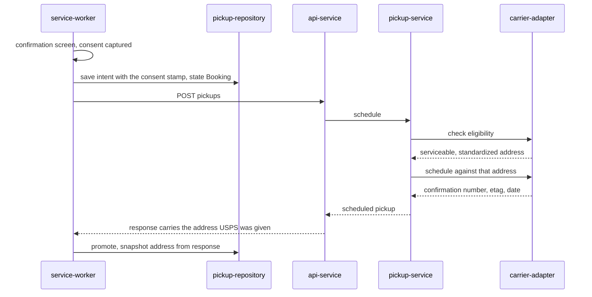

**Eligibility is called inside `schedule`, every time** — FR-3.4.1 makes it a hard gate with no
cache, and putting it in the service rather than the route is what makes "without exception"
structurally true rather than a rule routes must remember.

**The extension also calls `POST /pickups/eligibility` on its own, once, before it offers the
pickup at all.** The call site is the popup, immediately after a label is printed and before the
"schedule a free pickup?" choice is rendered. This is FR-3.4.2's ordering: a user is never offered
a pickup that cannot be booked, and an unserviceable address becomes a sentence on the confirmation
screen rather than a failure after they said yes. The two calls are not redundant — the client one
decides what to *show*, the server one decides what to *allow*, and only the second is a gate. If
the two disagree because time passed between them, the schedule loses and raises; §6.1 explains why
that is a 409 while the popup's own call is a 200.

**The consent the confirmation screen captures is written by the very next call, and never sent.**
NFR-6.2 requires `consented_at` and `consent_extension_version` on the `PICKUP` record; the diagram
shows the only place either value exists — the gesture — flowing straight into `save_intent`
(§3.4), inside the same `transact` that creates the provisional record. Three properties of this
path are load-bearing:

- **It lands before `POST /pickups`.** A pickup can exist without a carrier confirmation; it can
  never exist without its consent, because the write that creates it is the write that records it.
- **It is not in the request body.** The server neither receives, stores, nor forwards it. NFR-6.2
  says the record is client-side, and the server being stateless means there is no second copy to
  reconcile or to have to delete later.
- **`promote` does not touch it.** The carrier's answer arrives afterwards and cannot change what
  the user agreed to; a promotion that rewrote `consented_at` would be recording the wrong moment
  and would erase the evidence for the branch where no response ever comes.

**If the response is lost, the record stays in `Booking`** and no automatic retry fires. There is no
server-side idempotency key — the server is stateless, so deduplication has nowhere to remember
keys, and that decline is recorded and accepted in §5.2. `BOOKING_ABANDONED_AFTER_HOURS` is what
stops the record pinning its order against eviction forever.

### 4.4 Rehydration after worker termination

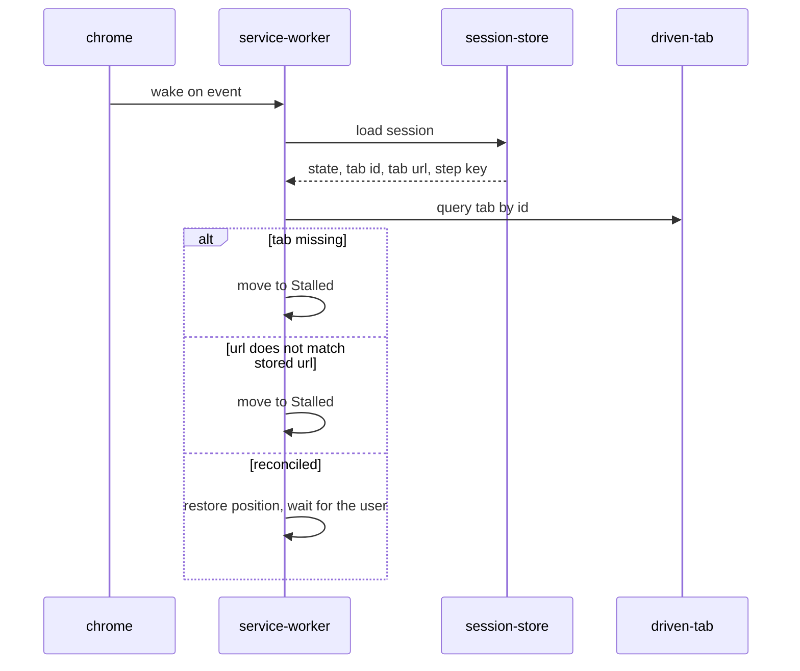

**A matching tab ID is not sufficient.** IDs are reused after a tab closes, so the stored URL is
what turns "a tab with this ID exists" into "this is still the tab we were driving".

**Nothing resumes by itself.** A rehydrated session waits for a person — FR-3.3.9.

### 4.5 Cancellation

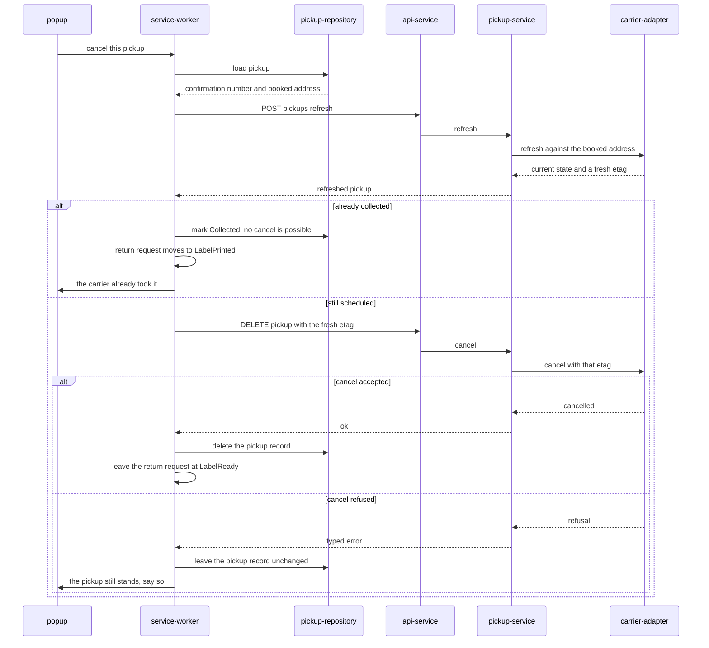

**The refresh is mandatory and its result is not cached** — FR-3.4.6. USPS rejects a cancel carrying
a stale ETag, and the only way to hold a fresh one is to have just asked. Two calls where one looks
sufficient is the carrier's requirement, not an artefact of this design.

**Both calls carry the booked address, not the current one.** `BOOKED_ADDRESS` exists precisely for
this pair: a user who edited their address between scheduling and cancelling would otherwise send
USPS an address that matches no booking, and the cancel would fail in a way that reads like a bug.

**A pickup already collected is not an error, and the return request finishes with it — at
`LabelPrinted`.** The refresh is also how the product learns that a carrier came, so the
`Confirmed → Collected` transition is *observed here* rather than assumed elsewhere — see §5.2. This
branch is the only place in the design where anything observes a return actually completing: the box
is gone, the label went with it, and there is no further step the user can take. So the request
moves to a terminal state, eviction stops protecting the order, and FR-3.3.10 permits a genuinely
new return on the same item.

**The terminal is `LabelPrinted`, and it is FR-3.3.9's, not a new one.** Reaching it here rests on
an upstream amendment this revision made and cites rather than invents. FR-3.3.9 previously drew
`LabelReady --> LabelPrinted` as *"user affirms printed"*, which conflated a field write with a
terminal transition and left FR-3.4.5a and FR-3.4.6 — both of which require the return to sit at
`LabelReady` while a pickup is outstanding — literally contradicting it. The requirement now reads
**"the printed label leaves"**, and FR-3.3.6's affirmation writes the `label_printed` field without
moving the request. Under that reading every clause agrees: a scheduled pickup holds the return at
`LabelReady`, a cancel returns it to nothing it had left, and collection — the label physically
leaving — is the transition. High-level design §5.2 and §5.4 carry the same wording.

**No fifth terminal is introduced.** An earlier draft of this section wrote `Done` here. That was a
state FR-3.3.9 does not define and high-level design §4.2 does not carry, so it was a low-level
document legislating a machine it does not own — and it was unnecessary, because the amendment above
makes an existing terminal exactly right. The four terminals remain `LabelPrinted`, `DroppedOff`,
`HandedOff` and `Aborted`, and nothing in this document may add to them.

**A cancel that fails after a successful refresh leaves the pickup standing, and the user is told
that.** The refresh and the cancel are two calls and the second can fail on its own — a race with
the carrier collecting between them, an ETag USPS considers stale despite having just issued it, a
transport failure. Nothing is rolled back, because there is nothing to roll back: the refresh only
read. The pickup record is left exactly as the refresh found it, the return request stays where it
was, and the popup says the pickup still stands rather than reporting a cancellation that did not
happen. The user's retry is another cancel from the top, refresh included — never a bare `DELETE`
with the ETag from the failed attempt, which is precisely the stale value USPS will refuse. An
`EtagExpired` on this path is the one case worth a distinct sentence, because it means the booking
moved underneath us and the honest next step is a fresh refresh rather than a retry of the same
call.

**Deleting the pickup record is the right outcome, and the consequences are stated rather than
left to be discovered.** A cancelled pickup and a pickup that was never booked are, after the
cancel succeeds, the same fact: no carrier is coming. Keeping a `Cancelled` row would put a
terminal record in front of `list_unsettled` on every read, pin its order against eviction (§5.2
skips orders with an unsettled pickup — and a terminal one is not unsettled, so the skip would have
to learn a new exception), and add a row to `ClearResult` that counts something the user already
removed. So: the record is deleted, `list_unsettled` never sees it, eviction stops protecting its
order from the next ingest onward, and `ClearResult.pickups_deleted` does not count it because
there is nothing left to delete. What is *not* thrown away is the return request, which keeps the
printed label — see below. The one thing lost is the history that a cancel happened, and at PoC
nothing reads that history.

**The return request stays at `LabelReady` — it never left.** Under the amended FR-3.3.9 a
scheduled pickup does not move the request anywhere, so a cancelled pickup has nothing to move it
back from; the popup simply stops offering a collection. The label is still valid and still printed,
what the user cancelled was the pickup, and a drop-off remains available to them. Deleting the
return alongside the pickup would throw away a working label.

### 4.6 The label choice, and how the carrier gets decided

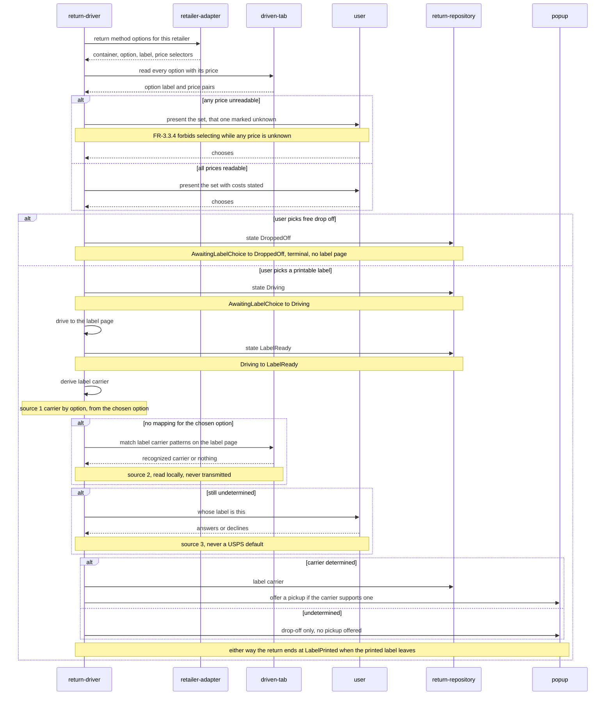

**The driver reads options and prices; the adapter only says where they are.** `ReturnMethodOptions`
(§3.5) is four selectors and a map. Walking the container, pairing each option with its label and
price, and marking an unreadable price **unknown** rather than dropping the option is the driver's
work, because FR-3.3.4's SHALL NOT — never select while any price in the set is unknown — has to be
enforced once, in one place, rather than once per adapter author.

**An unreadable price is a presented option and an adapter-health signal.** The option still appears,
its cost reads *unknown*, and the driver will not auto-select anything in that set. Separately it is
an FR-3.7.3 health event: a retailer whose prices stopped parsing has changed its flow, and that is
worth knowing before the selectors fail outright.

**`derive_label_carrier` is called at the label page, not at the choice**, and it walks FR-3.3.5's
three sources in the requirement's order — the chosen option's mapping, then client-side recognition
on the label page, then asking. The ordering is forced by source two: `label_carrier_patterns` match
against *the label page*, and that page does not exist until `Driving --> LabelReady: label page
reached` (requirements FR-3.3.9). Deriving at the moment of choice would make source two
unreachable and push every unmapped option straight to a question the page was about to answer. So
the driver carries the chosen option forward, reaches `LabelReady`, and derives there, with all
three sources available in order. §3.3 states the rule the diagram draws: **a miss is not a value,
and never USPS.**

**The three branches out of the choice are the three edges FR-3.3.9 draws, and no others.** A free
drop-off is `AwaitingLabelChoice --> DroppedOff` **directly**: there is no label to print, no label
page to reach, and the return never passes through `LabelReady` or holds a carrier. A printable
label is `AwaitingLabelChoice --> Driving`, and only the drive that follows reaches
`Driving --> LabelReady`. A cancel is `AwaitingLabelChoice --> Aborted`, which this diagram does not
draw because nothing after it is interesting. The distinction that matters downstream: **printable
and non-printable are different edges, not one edge with a flag** — the earlier draft of this
section merged them and wrote `LabelReady` on both, which is a transition the state machine does not
define.

**Source two reads the label page and does not transmit it.** FR-3.1.3's absolute prohibition is on
sending that page anywhere; matching `label_carrier_patterns` against it happens in the tab, in the
browser, and nothing leaves. This is the distinction §2.2 assigns and it is what makes the middle
source available at all — without it, a user who chose an option the adapter has no mapping for
would be asked a question the page already answers.

**Undetermined is a complete, successful outcome, and it still ends at `LabelPrinted`.** The return
reaches `LabelReady` with no `label_carrier` and the popup offers drop-off only — but the user is
holding a printed label, so the terminal is the one `LabelReady` has: `LabelReady --> LabelPrinted:
the printed label leaves`. "Drop-off only" here names what is *offered* (no pickup), not the
`DroppedOff` state, which is reachable only from `AwaitingLabelChoice` and only when there was never
a label to print. FR-3.4.2 is satisfied by *not* offering a pickup that could not be booked; the
failure this avoids is a pickup that books, a box left out, and nobody coming.

**A `DroppedOff` terminal writes the return request and nothing else.** It is entered straight from
`AwaitingLabelChoice` when the user picks a free drop-off option, so no label page was reached, no
carrier was derived, and no pickup record exists — there is nothing to cancel, nothing to refresh,
and no consent to record, and the confirmation screen of §4.3 is never reached. The session is
cleared, per §3.3, because a terminal state has nothing driving it.

---

## 5. Data Access

### 5.1 The server has none

Stated as a section because its absence is a design decision that reviewers will otherwise try to
fill. No ORM, no migrations, no connection pool, no transaction boundaries. The only thing resembling
a cache is `TokenProvider` and the SSM credential fetch, both scoped to the warm container lifetime
and both populated in the FastAPI lifespan startup that Mangum runs on cold start.

### 5.2 The extension's store

`chrome.storage.local` is a key-value store with no queries, no indexes and no transactions. The
repository layer exists to stop that shape leaking into the driver.

| Concern | Approach |
|---|---|
| Layout | One key per entity collection, plus a singleton key for the address and one for the driver session |
| Atomicity | `chrome.storage.local.set` is atomic per call. **Any multi-entity update is one `set` of one composed object**, never a sequence of writes |
| Read-modify-write | Serialised by `StorageCoordinator.transact` (§3.4). There is exactly one writer — the worker (§2.2) — so one queue in one process covers every writer that exists |
| Eviction, by count | `evict_if_over_cap` runs after every ingest, ordered by `first_seen_at`, skipping orders with a non-terminal return or an unsettled pickup |
| Eviction, by bytes | `evict_to_fit` runs only on a quota rejection, same order and same skip rule, until the store has freed what the write needs |
| Quota | A write that exceeds the quota **fails the operation that attempted it**. It is never swallowed — see below |
| Derived state | `Booking → Abandoned` and `Confirmed → Collected` are **evaluated on read**, not written by a timer — see below |
| Migration | A stored schema version key. On mismatch the store is **rebuilt, not migrated**, at PoC — with the pickup carve-out below |

**The carve-out joins on `item_id`, in two hops, and the coordinator is what walks them.** Both
evictors skip an order that has a non-terminal return or an unsettled pickup, and neither of those
records mentions an order. High-level design §4.2's ERD is the chain:
`ORDER → ORDER_ITEM → RETURN_REQUEST → PICKUP`, so the joins are

| From | Via | To |
|---|---|---|
| `RETURN_REQUEST` | its `item_id` | the order, through `OrderRepository.find_item(item_id).order` |
| `PICKUP` | its `return_request_id`, then that request's `item_id` | the same way |

`PICKUP` carries no order reference and is not given one. Denormalising an `order_id` onto it would
create a second path to the same answer that could disagree with the first, and the record it would
disagree about is the one holding a booked carrier visit. So before evicting, the coordinator builds
the protected set once — every `item_id` with a non-terminal return, plus every `item_id` reached
from `list_unsettled()` — resolves each to its order, and skips those orders. That is also why this
is the **coordinator's** rule and not `ReturnRepository.delete`'s (§3.4): the coordinator is the only
object that can see all three keys, and the join is the whole reason cross-entity operations live
there.

**A quota-exceeded write is a failure the user is told about.** `chrome.storage.local` is bounded at
roughly 10 MB without `unlimitedStorage`, which FR-3.7.1's minimal manifest does not request and
this design does not add — an extension asking for unlimited storage invites exactly the review
question the small manifest exists to avoid. So the ceiling is real and can be reached by a user
with many large orders.

**The remedy for a byte-quota rejection has to be byte-driven, which is why there are two
evictors.** `evict_if_over_cap` counts orders against `MAX_STORED_ORDERS`; a store holding thirty
unusually large orders under a cap of fifty is *not* over that cap, so calling it on a quota
rejection would delete nothing and the retry would fail identically — a retry loop that cannot
converge. `evict_to_fit` instead takes the size of the write that was refused and evicts oldest-first
until at least that much has been freed, using the same `first_seen_at` order and the same carve-out
for orders with a non-terminal return or an unsettled pickup. On rejection the coordinator calls
`evict_to_fit` once and retries the write a single time; if it fails again — which happens when
every remaining order is protected by the carve-out, or when the single write is simply larger than
the quota — the operation raises, the caller surfaces it, and **nothing is silently dropped**. A dropped ingest costs a re-scan and is merely annoying; a dropped
`save_intent` or `promote` costs a booked carrier visit the product can no longer see, which is the
failure this whole layer is built to prevent. The one thing forbidden is catching the rejection and
carrying on as though the write had landed.

**`evict_to_fit` measures a candidate by serialising it, because the platform will not measure it
for us.** `chrome.storage.local.getBytesInUse` answers for *keys*, and the layout row above stores each
collection under a single key — so the only byte figure the API will produce is the size of the whole orders
collection, which is useless for choosing which order to drop. The eviction candidate's cost is
therefore computed the same way the store computes what it writes: the order and the records that
travel with it are serialised to the JSON the coordinator would have written, and the length of that
string is the estimate. It is an estimate and this document says so — Chrome's accounting includes
the key and its own per-entry overhead — so `evict_to_fit` deliberately evicts until the freed
estimate reaches the requested bytes **plus a margin**, rather than stopping at the first candidate
whose arithmetic just barely covers the write. The truth is checked once, not per candidate: a
single `getBytesInUse` on the orders key before and after the batch tells the coordinator what was
actually reclaimed, and it is that figure — not the sum of the estimates — that the method returns
and that the retry decision uses.

**The two evictors return different units, and the names are what disambiguate them.**
`evict_if_over_cap` returns the **number of orders** it removed, because a count is what a cap is
expressed in and zero means the store was already under it. `evict_to_fit` returns the **number of
bytes** actually reclaimed as measured above, because a count of orders tells its one caller
nothing about whether the retry can succeed. The §3.4 and §3.5 diagrams carry that distinction in
the types themselves — `EvictedOrders` and `ReclaimedBytes` — so the signatures are the record and
this paragraph is the reason. Two `int`s would have made a caller that swapped them type-correct and
wrong.

**`evict_to_fit` runs inside the failing `transact` and must not re-enter it.** The coordinator
serialises composed writes through a queue, and `evict_to_fit` is called from within a transaction
that has already been admitted — so a call that went back through `transact` would wait on a queue
that cannot drain until the caller it is blocking returns. It therefore performs its reads and its
single eviction `set` **directly**, not through `transact`, and the queue's guarantee is preserved
by the fact that nothing else can be running: the transaction that triggered the quota rejection
still holds the slot. This is the one place in the design where a write bypasses the coordinator's
own front door, and it is safe only because of that ordering. The rule that follows is narrow and
absolute: `evict_to_fit` is callable **only** from the coordinator's quota-rejection path, never
from a repository, never from the worker, and never from a second transaction.

**Two state transitions have no event to fire on, so they are derived at read time.** Nothing wakes
the worker when a booking has been outstanding for `BOOKING_ABANDONED_AFTER_HOURS`, and nothing
tells us a carrier collected a box. Both are computed by the repository as it reads: a `Booking`
older than `BOOKING_ABANDONED_AFTER_HOURS` is *reported as* `Abandoned`, and a `Confirmed` pickup
more than `PICKUP_SETTLED_AFTER_DAYS` past its `scheduled_date` is *reported as* `Collected` — as is
one a refresh has explicitly said was collected. This follows the precedent FR-3.2.2 already sets for urgency, which is derived from
`return_by` at render rather than stored and refreshed. The consequence is worth stating plainly:
**they are not stored transitions**, no alarm is registered for either, and the only writes are the
ones that follow a real observation — `mark_abandoned` when the user is shown the abandoned record
and confirms it, and the `Collected` write in §4.5 when a refresh reports it. Anything that reads
the store must go through the repository, because a raw read of the key returns the un-derived
state.

**The rebuild is triggered by a version mismatch, so the read that detects it must not assume a
version.** A defensive read means: treat the stored blob as unknown-shaped, tolerate a missing or
unparseable `schema_version`, and never let a field access on unexpected data throw before the
rebuild decision is made. Concretely, an unreadable store rebuilds; a store whose version is newer
than the running code's *also* rebuilds rather than attempting to interpret it — a downgraded
extension reading a forward version is the one case where the code cannot know what it is looking
at. The `PICKUP` carve-out below survives both, and it is read field-by-field with each field
defaulted, because the whole point of preserving it is that it may be the only record of a real
booking.

**The rebuild-on-mismatch rule has one exception, and it is not optional.** Confirmation numbers
cannot be re-derived — the server holds nothing, and there is no `GET /orders`. Discarding a
`PICKUP` record leaves a real carrier visit booked that the user can no longer cancel through the
product. So a rebuild preserves unsettled pickups and their booked addresses even when it discards
everything else, and the same carve-out governs the user-initiated clear of §4.3.

---

## 6. Error Handling

### 6.1 Server

A single hierarchy, converted once at the boundary:

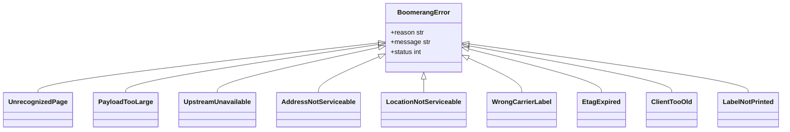

Each subclass is the sole owner of one reason code, and the mapping is fixed rather than chosen per
raise site:

| Class | `reason` | Status | Raised when |
|---|---|---|---|
| `UnrecognizedPage` | `unrecognized-page` | 422 | The model could not extract an order from the submitted DOM |
| `PayloadTooLarge` | `payload-too-large` | 413 | The DOM exceeds the ingest bound before it reaches the model |
| `UpstreamUnavailable` | `upstream-unavailable` | 502 | Bedrock or USPS failed, timed out, or raised anything unhandled |
| `AddressNotServiceable` | `address-not-serviceable` | 409 | A **schedule** was attempted against an address eligibility refuses. Never raised by the eligibility endpoint — see below |
| `LocationNotServiceable` | `location-not-serviceable` | 409 | The requested package location is not one the carrier will honour |
| `WrongCarrierLabel` | `wrong-carrier-label` | 409 | The label's carrier is not USPS, so no USPS pickup applies |
| `EtagExpired` | `etag-expired` | 409 | The carrier rejected the ETag on a cancel |
| `LabelNotPrinted` | `label-not-printed` | 409 | Raised by `PickupService.schedule`, before eligibility, when the request does not assert a printed label. The server is stateless and cannot observe FR-3.3.6's affirmation itself, so it checks the claim the request carries |
| `ClientTooOld` | `client-too-old` | 426 | The client version is below the minimum the server will serve |

**A negative eligibility answer is not an error, and the eligibility endpoint never raises one.**
`POST /pickups/eligibility` returns 200 with an `EligibilityResult` carrying `eligible: false`,
`reason: address-not-serviceable`, and no `next_pickup_date`. FR-3.4.2 requires the extension to
present that as "no free pickup here, the return is still valid" — a sentence the extension can only
write if it received a result to read it out of. Modelling it as a raised error instead would give
one route two possible body shapes under the same status code, and would leave
`EligibilityResult.eligible` with no reachable `false` case at all: the field would exist and never
be populated.

**`AddressNotServiceable` is therefore reserved for the schedule path**, where the same fact *is* a
failure: the caller asked for a booking that cannot be made. `PickupService.schedule` calls
eligibility itself (FR-3.4.3 forbids skipping it, and forbids reusing a prior result), and raises
this when the answer comes back negative. A well-behaved client never sees it — it checked first —
but the gate is server-side and does not depend on the client having been well-behaved.

**The status code is not the branch key.** Five distinct reasons now share 409, so a client
branching on status cannot tell a wrong carrier from a stale ETag from an unserviceable address
from a label that was never printed.
**The `reason` is the contract; the status is transport.**

Each subclass fixes its own `reason` and status. One FastAPI exception handler renders the requirements §4.2
shape and attaches the `request_id`; **no route builds an error response itself**, which is what
keeps the shape from drifting across seven endpoints.

**An unhandled exception becomes `upstream-unavailable` with a generic message, and the detail goes
to the log under the same `request_id`.** The rule that makes this safe is NFR-6.1: exception text
can contain field values, so exception detail never reaches the response body and never reaches the
log unredacted. The `request_id` is what reconnects the user's report to the log line — and, with
order contents, titles, addresses and confirmation numbers all unloggable, it is the *only* thing
that can.

**`LocationNotServiceable` is raised by `PickupService.schedule`, not by a route**, at the point the
adapter reports the requested package location is not among those the carrier will honour, and its
response body carries the **reduced servable-location list** in requirements §4.2's optional
`details` object, as `details.servable_locations`. Without that list the extension can only re-ask
blindly, and FR-3.4.8 forbids substituting a location on the user's behalf — so the list is the
whole point of the error and not a decoration on it. It is the only reason code that populates
`details`; every other one omits the key entirely, which is what the requirements §4.2 rule says and
what the handler enforces.

**Every upstream call carries a deadline, and exceeding it raises `UpstreamUnavailable`.**
`BEDROCK_TIMEOUT_PARSE_MS`, `BEDROCK_TIMEOUT_ACTION_MS` and `USPS_TIMEOUT_MS` (§7.1) bound a single
invoke and a single carrier call; all three are well below the function's 60-second timeout.
**The Bedrock deadline is two fields, not one**, because NFR-6.4 states the two call sites have
different budgets and SHALL be configurable independently: `bedrock_timeout_parse_ms` serves the
10-second parse budget, `bedrock_timeout_action_ms` the 5-second action budget. `ActionService`
reads the second and `IngestService` the first; neither reads a shared value, and there is no
general "Bedrock timeout" for a call site to fall back to. The action default sits below the
client's own `MODEL_FALLBACK_TIMEOUT_MS` (§7.2) so the server abandons the call first — a server
still working after the client has given up and reported `report_stuck` holds a concurrency slot
for an answer nobody will read. Without these, a hung
upstream holds one of only five reserved concurrency slots for a full minute while the client that
asked has already given up, which converts one slow dependency into an availability problem for
every other user. A timeout is indistinguishable from a failure to the caller and maps to the same
reason code deliberately: there is nothing the extension would do differently.

**Redaction is an allowlist, not a denylist.** A formatter that strips known-sensitive keys fails
the first time a new field is added upstream and nobody remembers to add it to the list — and the
failure is silent, permanent, and discovered in a log that already contains the address. So the
formatter emits **only fields it recognises as safe** — `request_id`, `reason`, timings, status,
route, retailer key, counts — and anything unrecognised is replaced by its type and length rather
than its value. The consequence is accepted deliberately: a new safe field logs as a placeholder
until someone adds it, which is a debugging inconvenience. A new unsafe field logging in full is a
breach of NFR-6.1, and one of those two failure modes is recoverable.

### 6.2 Extension

| Failure class | Handling |
|---|---|
| Typed API error carrying a `reason` | Mapped to a typed error and branched on. **Never branched on status code** |
| Network failure, read-only call | **At most two retries** — three attempts total — with exponential backoff from roughly 500 ms and full jitter. Each attempt is bounded by `API_REQUEST_TIMEOUT_MS` and the whole sequence by `API_RETRY_BUDGET_MS`, both in §7.2; the sequence stops at whichever arrives first |
| Network failure, `POST /pickups` | **No retry.** The intent record stays in `Booking`; the user is told it could not be confirmed and how to check with USPS |
| Network failure, `DELETE /pickups/{confirmation_number}` | **No retry**, and not for the reason `POST /pickups` is not retried. The cancel carries an ETag issued by the refresh that preceded it, and USPS treats a token it has already seen as stale — so a bare retry is a call that is *guaranteed* to be refused. The recovery is the whole §4.5 pair again, refresh included; the pickup record is left standing meanwhile |
| Validation failure on model output | Surfaced as *this page could not be read*, naming the page. Never a silent discard — that is indistinguishable from a broken extension |
| Action outside the vocabulary | Treated as `report_stuck`; the flow hands back to the user |
| Unknown `reason` from a newer server | Treated as an unrecoverable step, handed back. Forward compatibility runs in both directions |
| **FR-3.1.3 egress scan flags a fallback payload** | **Nothing is transmitted.** The step aborts as `report_stuck` and the user continues manually. The scan failing to complete aborts the same way — *fail closed* means the scan's own error is a positive result, not a skip |
| **Stored data unreadable, or its `schema_version` unrecognised** | The store is **rebuilt, not migrated** (§5.2), preserving unsettled pickups and their booked addresses. The user is told the local history was reset and can re-scan; nothing is retried against it first |

**The retry asymmetry is the point.** Read-only calls are safe to repeat; a schedule call is not,
and there is no idempotency key to make it so. The bound is small on purpose: these calls happen
with a user watching, so a retry budget that outlasts their patience has spent it on the wrong
thing. When the attempts are exhausted the failure is surfaced, never converted into a longer wait.

**Every failure path the high-level design enumerates lands in one of the nine rows above.** The
mapping is deliberately total, so a new failure never arrives without a defined handling:

| Where the failure comes from | Row it lands in |
|---|---|
| Any server response carrying a known `reason` — every row of the §6.1 table | Typed API error |
| Bedrock unavailable, slow, or returning an unusable parse, seen through the server | Typed API error, as `upstream-unavailable` |
| USPS unavailable or refusing, seen through the server | Typed API error, by its specific reason |
| Transport failure on ingest, eligibility, refresh, or any read | Network failure, read-only |
| Transport failure on `POST /pickups` | Network failure, no retry |
| Transport failure on `DELETE /pickups/{confirmation_number}` | Network failure on cancel, no retry — re-run refresh-then-cancel |
| A model action failing the vocabulary or the fillable-field bound | Action outside the vocabulary |
| A model parse failing schema validation in the extension | Validation failure on model output |
| A retailer page changed under the adapter, so the selector matches nothing | Action outside the vocabulary — the step reports stuck |
| A `reason` the running client does not recognise | Unknown reason from a newer server |
| Chrome itself refusing — permission revoked, tab gone | Handed back to the user, never retried silently |
| `chrome.storage.local` refusing on quota | Handled once by the coordinator — see §5.2 — and handed back if it fails again |
| `chrome.storage.local` returning a blob that will not parse, or a `schema_version` the running code does not know | Store rebuild — the row above, with the `PICKUP` carve-out |
| A fallback payload carrying a tracking number or a postal address, or an egress scan that throws | FR-3.1.3 egress scan flags — nothing is sent, the step is `report_stuck` |

**`WrongCarrierLabel` is a backstop, and this revision made it one.** The server's 409 fires when a
client sends a `label_carrier` the carrier adapter will not accept, and before §3.3 gave
`derive_label_carrier` an owner it was the *only* place in the design where a wrong carrier could be
caught at all — which made a server error the primary control for a client-side rule. It is not one
now: FR-3.3.5's three sources are walked in the extension, a miss is not a value, and nothing is
sent that was not either chosen, recognised, or answered for. The 409 stays exactly where it was and
keeps its row, because the server's gates do not depend on the client having behaved. The dependency
is recorded so that the reverse is not read into it: if `derive_label_carrier` were ever removed,
this error would silently become the primary control again, and the failure it would then be
catching — a pickup booked against the wrong carrier — is one nobody discovers until the window
closes.

**The two Chrome rows are worth naming explicitly** — the one for a revoked permission or a
vanished tab, and the one for a quota refusal. Chrome failures are not server failures and have no
`reason` code, but permission and tab failures end the same way: the user is told, and nothing
retries behind their back.

**Quota is the single exception, and the exception is bounded rather than silent.** §5.2's
coordinator answers a quota rejection with one `evict_to_fit` and exactly one retry, which is a
*repair* — the store is smaller on the second attempt than it was on the first, so the retry is
attempting something different rather than hoping for a different answer to the same question. It
is also invisible to no one: eviction removes the user's own stored orders, and the popup surfaces
that a scan displaced older orders rather than letting the list quietly shorten. If the second
attempt fails the operation raises and reaches the user like every other row here. So "never
retried silently" holds as written for permission and tab failures, and holds in substance for
quota: one bounded, state-changing, user-visible retry, and then the truth.

---

## 7. Configuration and Wiring

### 7.1 Server startup order

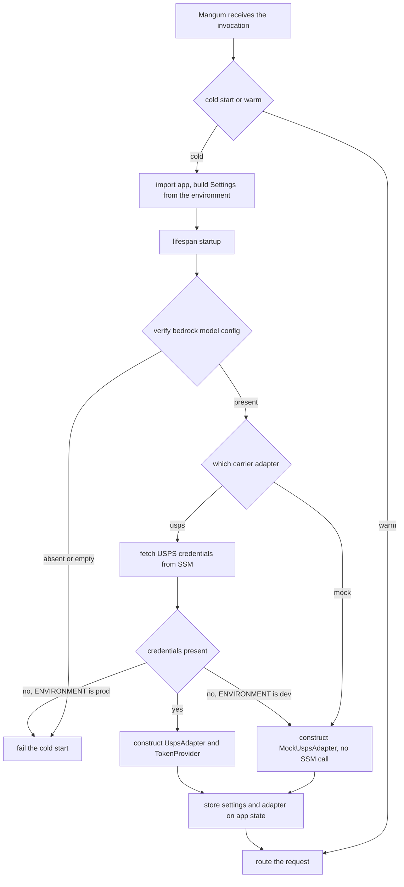

**Everything cached for the container lifetime is populated in the lifespan startup, and Mangum's
lifespan handling must stay on.** With it off, startup never runs: no error, just a Parameter Store
round trip on every request and a validation that never fires. This is written down because the
failure is silent.

**`BEDROCK_MODEL` has no default, and absence fails the cold start while a suspicious value only
warns.** The two are different checks and the table's "warns" and this paragraph's "fails" are not
in conflict once they are separated: an **unset or empty** model is a configuration error the
process cannot recover from, so it raises and the cold start fails with a message naming
`ListInferenceProfiles`. A model that is set but **lacks a regional-profile prefix** logs a warning
and starts anyway, because the prefix requirement is model- and region-specific and this document
will not encode a rule that turns a working deployment into a failed one the day Bedrock relaxes it.
The failure being guarded is real either way: a bare model ID raises a validation error at *invoke*
time — on a user's first parse, inside a Lambda — and the startup check is what moves that to a
place someone is looking.

**The SSM fetch happens on the USPS path only.** The mock adapter is the default until USPS access
is granted, and a startup that fetched credentials unconditionally would fail — or hang against a
VPC-less timeout — on the only path that currently runs. The branch is on the selected adapter, and
`ENVIRONMENT` separately scopes the SSM path and the USPS base URL.

**A missing credential under `ENVIRONMENT=prod` fails the cold start**, on exactly the reasoning
that governs `BEDROCK_MODEL`: a production deployment that silently degrades to a mock carrier
returns fabricated confirmation numbers to real users, and the failure surfaces as a person waiting
by their door for a carrier nobody asked for. Under `dev` the same absence falls back to the mock
and logs that it did, because the whole point of the mock is to work before the credential exists.

**Settings and the adapter are constructed once, in the lifespan, and held on application state.**
Routes read them from the request's application state and pass them into the service they call;
nothing reads `os.environ` below the settings object, and no route constructs an adapter. Two
reasons, and the second is the load-bearing one: a per-request construction re-reads SSM on a path a
user is waiting on, and a module-level singleton makes the object un-substitutable — the §8.3
integration tests build the ASGI app with a scripted adapter on state, which is only possible if
state is where the adapter lives. FastAPI's dependency system is used for *reading* that state, not
for building it; construction stays in the lifespan where its ordering is explicit.

**Configuration is one typed `Settings` object, validated at construction.**

| Field | Source | Default | Validation |
|---|---|---|---|
| `environment` | `ENVIRONMENT` | none, required | One of `dev`, `prod` |
| `bedrock_model` | `BEDROCK_MODEL` | none, required | Non-empty; startup warns when it lacks a regional profile prefix |
| `bedrock_model_parse` | `BEDROCK_MODEL_PARSE` | falls back to `bedrock_model` | Non-empty when set |
| `bedrock_model_action` | `BEDROCK_MODEL_ACTION` | falls back to `bedrock_model` | Non-empty when set |
| `bedrock_max_tokens` | `BEDROCK_MAX_TOKENS` | `4096` | Positive integer |
| `aws_region` | `AWS_REGION` | `us-east-1` | Non-empty |
| `carrier_adapter` | `CARRIER_ADAPTER` | `mock` | One of `mock`, `usps`. **The value §7.1's flowchart branches on** |
| `usps_client_id` | SSM, not the environment | none | Required when the adapter is `usps` |
| `usps_client_secret` | SSM, not the environment | none | Required when the adapter is `usps` |
| `usps_base_url` | `USPS_BASE_URL` | `https://apis.usps.com` | Absolute URL, `https` scheme |
| `max_ingest_bytes` | `MAX_INGEST_BYTES` | `262144` | Positive integer |
| `bedrock_timeout_parse_ms` | `BEDROCK_TIMEOUT_PARSE_MS` | `9000` | Positive integer, below the function timeout |
| `bedrock_timeout_action_ms` | `BEDROCK_TIMEOUT_ACTION_MS` | `4500` | Positive integer, below the function timeout |
| `usps_timeout_ms` | `USPS_TIMEOUT_MS` | `8000` | Positive integer, below the function timeout |
| `min_client_version` | `MIN_CLIENT_VERSION` | `0.1.0` | Three dot-separated non-negative integers |
| `function_timeout_ms` | `FUNCTION_TIMEOUT_MS`, set by Terraform from the same value it gives the function | `60000` | Positive integer |
| `log_level` | `LOG_LEVEL` | `INFO` | A known level name |

**`ClientTooOld` needs a threshold to compare against, and `min_client_version` is it.** The
extension sends its version on every request (§4.1); the server parses both sides into integer
triples and compares them **component-wise, not as strings** — `0.10.0` is above `0.9.0` and a
lexicographic comparison gets that backwards, which would lock out every client the moment a minor
version reached double digits. A client at or above the threshold is served; below it, 426. The
default is deliberately the lowest version that has ever shipped, so the gate is inert until someone
raises it on purpose: a version gate that rejects by default fails closed against every existing
install on its first deploy. A request with an unparseable or absent version is treated as **below**
the threshold, because the only client that omits it is one older than the field.

**`carrier_adapter` is the selector, and it is a field rather than an inference.** §7.1's flowchart
branches on which adapter to construct, and until this revision nothing in `Settings` answered that
question — leaving the branch to be read as *"whether the USPS credentials happen to be present"*.
That inference is wrong in both directions and the failure modes are not symmetric: an SSM parameter
that exists early — seeded during setup, left from a previous deployment — silently promotes a dev
environment onto the live USPS API, and a credential that fails to fetch silently demotes a
production deployment to a mock carrier handing fabricated confirmation numbers to real users. So
the adapter is chosen by an explicit, defaulted, validated field, the credentials are *conditionally
required by it*, and the two guards already in §7.1 hang off that field: `usps` with no credentials
under `ENVIRONMENT=prod` fails the cold start; the same under `dev` falls back to the mock and says
so. The field is now in requirements §5.1 as `CARRIER_ADAPTER`, which is where a deployment
parameter belongs; this table restates its type and default, not its authority.

**The function timeout is read from configuration, not hardcoded, because the application cannot
see its own Lambda configuration.** The three upstream deadlines are validated as being below it,
and a literal `60000` in `Settings` would be a copy of a Terraform value that nothing keeps in
sync — someone raising the function timeout to 120 s would leave a validation rule silently
enforcing the old ceiling, and someone *lowering* it to 30 s would leave deadlines that can never
fire. Terraform sets `FUNCTION_TIMEOUT_MS` from the same expression it passes to the function's own
`timeout`, so the two cannot drift. This is a plain operational number, not a secret, so the
environment is the right place for it — the §7.1 rule that keeps credentials out of the environment
is about what a `GetFunctionConfiguration` caller can read, and a timeout is something they can
already read.

**All three upstream deadlines are configuration rather than constants** so a deploy can tighten them
without a code change when NFR-6.4's budgets are measured against real latencies rather than
estimated. Validation refuses a value at or above the function's own 60-second timeout: a deadline
longer than the invocation it lives inside cannot fire, and a field that silently never fires is
worse than no field at all.

**The two USPS credentials are the only values that come from Parameter Store rather than the
environment, and that asymmetry is deliberate** — a Lambda environment variable is readable by
anyone with `GetFunctionConfiguration`, so a secret placed there is a secret published to a wider
audience than the code. They are also the only fields whose requirement is conditional, which is why
validation runs after adapter selection rather than at `Settings` construction.

**`request_id` is request-scoped state, and the middleware that sets it must clear it.** NFR-6.1
makes it the only correlator that survives redaction, so a value that leaks between invocations
attributes one user's log lines to another user's report — the exact failure the field exists to
prevent, and undetectable from the logs themselves. The outermost middleware generates or accepts
the id, binds it into a context variable, and clears that variable in a `finally` so an exception
path cannot skip the reset. The logging filter reads it from there and attaches it to every record;
nothing passes it down as an argument, because a correlator threaded through signatures is one
forgotten parameter away from a log line with no id on it. Lambda reuses a warm container across
invocations, so "the next request overwrites it anyway" is not a guarantee — an invocation that
raises before the middleware binds would otherwise log under its predecessor's id. §8.3 asserts
this directly: two sequential requests against one app instance must not share an id, and a request
that raises must not leave one behind.

### 7.2 Extension wiring

Constructor injection, wired once in `entrypoints/background.ts`. No DI framework — the graph is a
dozen objects and a container would obscure it.

**Every configuration value is a build-time constant** (high-level design §8.4). The extension performs no
configuration fetch, at startup or ever: a runtime fetch would reintroduce exactly the
server-steered behaviour that bundling the adapters removed.

The mechanism is WXT's define-style build-time substitution: `src/config.ts` reads from values
injected at bundle time, so each constant is replaced by a literal in the emitted bundle and no
lookup survives into the running extension. Every value below is fixed at build:

**This table restates requirements §5.2; it does not extend it.** A low-level document that invents
configuration is a document that has taken a product decision, and four of the rows below —
`API_REQUEST_TIMEOUT_MS`, `API_RETRY_BUDGET_MS`, `DASHBOARD_ORIGIN` and `EXTENSION_KEY` — did
exactly that before this revision: they were introduced here, with defaults, and appeared in no
upstream table. Each is now in requirements §5.2, with the same names and the same defaults, and the
reasoning for the pair of deadlines is recorded there for the same reason `MAX_INGEST_BYTES` is.
The rule going forward: **a value that a deployment can change belongs upstream first.** If a later
revision of this document needs a new one, the requirement is amended and cited, not shadowed —
which is also how `CARRIER_ADAPTER` and `FUNCTION_TIMEOUT_MS` reached requirements §5.1.

| Constant | `dev` | `prod` |
|---|---|---|
| `API_BASE_URL` | `http://localhost:8000` | The deployed Function URL origin |
| `DASHBOARD_ORIGIN` | Local origin | The one shipped hostname — high-level design §11 question 1 |
| `EXTENSION_KEY` | The dev keypair's public key | The published keypair's public key |
| `MAX_INGEST_BYTES` | `262144` | `262144` |
| `INGEST_DEBOUNCE_MS` | `800` | `800` |
| `URGENCY_CRITICAL_DAYS` | `3` | `3` |
| `URGENCY_WARN_DAYS` | `7` | `7` |
| `MAX_STORED_ORDERS` | `200` | `200` |
| `PICKUP_SETTLED_AFTER_DAYS` | `3` | `3` |
| `BOOKING_ABANDONED_AFTER_HOURS` | `24` | `24` |
| `MODEL_FALLBACK_TIMEOUT_MS` | `5000` | `5000` |
| `API_REQUEST_TIMEOUT_MS` | `12000` | `12000` |
| `API_RETRY_BUDGET_MS` | `20000` | `20000` |

**The two API deadlines are what §6.2's retry row is bounded by, and they are separate numbers on
purpose.** `API_REQUEST_TIMEOUT_MS` aborts a single attempt; `API_RETRY_BUDGET_MS` caps the whole
retry sequence including its backoff, so a call cannot spend three full attempts plus jitter with a
user watching. It sits below three times the per-attempt timeout deliberately: the budget, not the
attempt count, is usually what ends the sequence, and a third attempt is only started if there is
real time left for it. `API_REQUEST_TIMEOUT_MS` is set above the server's own longest upstream
deadline — the parse budget of `BEDROCK_TIMEOUT_PARSE_MS` plus request overhead — so that the
server gets to answer with a typed `upstream-unavailable` instead of the client giving up first
and reporting a transport failure for something the server diagnosed precisely. `MODEL_FALLBACK_TIMEOUT_MS`
is the exception that proves the rule: the action call site is the one place the client deliberately
gives up *before* the server would, because a stalled step with a half-driven return is worth
handing back sooner than an accurate error is worth waiting for.

**`TabHandleFactory` is what gets wired; `TabHandle` cannot be.** The worker's graph is built once
at startup and every other collaborator survives for the worker's life, but a handle is per-tab and
per-return — it holds a `tab_id` that does not exist at wiring time and a `tab_url` nothing has
visited. So `background.ts` constructs the factory, which closes over the `chrome.tabs` and
`chrome.scripting` wrappers, and hands it to `ReturnDriver`; the driver calls `for_session` once per
`start` and once per `resume` (§3.3). This is the one place the "wired once" rule needed an
explicit escape hatch, and naming the escape hatch is what keeps it from becoming an ambient
`chrome.tabs` call inside the driver — which would have taken the tab lookup out of the graph
entirely and made §8's driver tests need a live browser.

**The popup's graph is smaller than the worker's and is wired separately, in
`entrypoints/popup/`.** A popup is a fresh document on every open, so nothing survives between
openings and there is no shared instance to hand it: it constructs what it needs at mount and
discards it at close. What it constructs is `src/ranking/`, which is pure and needs nothing;
`src/permissions/`, which wraps the `chrome.permissions` API and must be called from the popup
because that is where the user gesture lives; `src/calendar/`, for the `.ics` path only, because
`URL.createObjectURL` is not in the worker global; and a **read-only** `StorageCoordinator` over
the same repositories. That last one is the piece worth stating: the popup does construct a
coordinator, because reads must go through the repositories to see §5.2's derived states, but it
**never calls `transact`, `evict_to_fit`, `evict_if_over_cap` or `clear_all`** — every mutation
goes to the worker through `src/messaging/`, which is what keeps the serialising queue meaningful.
Two documents writing the same key through two coordinators would defeat it entirely, since
`chrome.storage.local` serialises individual `set` calls and nothing else. The popup constructs no
`src/api/`, no `src/driver/` and no `src/adapters/` — it has no egress and drives no page.

**The client version travels in a header on every request**, not only on the endpoints that can
break. It costs a few bytes, it is what the `client-too-old` gate reads, and it is the field you
wish you had logged when a bug turns out to affect one released version. The version itself is the
manifest's, injected as a build-time constant like everything else above, so there is no second
place for it to disagree with what the store shows.

**A production bundle is asserted, not trusted.** The build fails if the emitted `prod` bundle
contains `localhost`, the dev extension key, or any `http:` origin — a three-line check over the
output, run in CI. The failure it prevents is a released extension pointing at a developer's machine,
which is undetectable by reading the source, because the source is identical in both builds and only
the substituted literals differ. `dev` and `prod` builds differ only in
those constants — including the pinned key, which is **one per environment**, so a developer's
unpacked build is not the published extension's ID and does not sit inside the production CORS
allowlist.

---

## 8. Testing Strategy

Fakes over the network; no containers in the test loop. `pytest` with `httpx` transport mocking on
the server, `vitest` with a fake browser API on the extension.

### 8.1 What gets a test double, and what does not

| Dependency | Double | Rationale |
|---|---|---|
| USPS | `MockUspsAdapter` behind `CarrierAdapter` | Already required by §8.2 for development; the tests get it free |
| Bedrock | Recorded tool-call responses at the client boundary | Deterministic, and asserts the tool schema is honoured |
| `chrome.*` | In-memory fake `storage`, `tabs`, `scripting`, `permissions` | The storage fake must reproduce **atomic per-`set` semantics**, or it will hide the race the repository exists to prevent — plus the two behaviours below, or it will hide the whole quota path |
| Worker lifecycle | `WorkerLifecycle` double, with `terminate()` | Chrome kills a service worker after ~30 s idle and nothing in the fake browser does. Rehydration is only testable if a test can *cause* the death |
| Retailer DOM | Static HTML fixtures, one per adapter step | The only honest way to test selectors |
| The clock | Injected | Every eviction, abandonment and urgency rule is time-dependent |

**The storage fake must be able to say no.** Two of its behaviours are load-bearing and neither
comes free with an in-memory `Map`:

- **A quota rejection on demand.** §5.2's most consequential path — `evict_to_fit`, one retry, then
  raise — is unreachable unless a test can arm the fake to refuse the next `set` with the quota
  error Chrome actually throws. Without it the coordinator rows in §8.2 assert a branch that never
  runs, which is worse than no coverage because the table claims otherwise.
- **`getBytesInUse` over the same data it is holding.** `evict_to_fit` measures candidates by
  serialising them and then checks the truth with a single `getBytesInUse` on the orders key before
  and after the batch (§5.2). A fake that returns a constant, or throws, turns "freed at least the
  requested bytes" into an assertion about the fake. It does not have to match Chrome's real
  per-entry overhead — it has to be *consistent*, so that the before/after difference means what the
  coordinator thinks it means.

**Worker termination is an injected capability, not an ambient one.** `WorkerLifecycle.terminate()`
drops the in-memory graph and leaves only what reached `chrome.storage`, which is exactly the event
§4.4 exists to survive: the "Worker terminated mid-flow" row in §8.3 and every persist-before-act
assertion in §8.2 depend on being able to fire it at a chosen moment. Simulating it by constructing
a second graph over the same fake store would test something weaker — a fresh reader, not a lost
writer — and would silently pass for a design that kept state only in memory.

**The DOM fixtures double as adapter regression tests.** When a retailer changes its flow the
fixtures go stale, and a failing fixture is a cheaper discovery channel than a user complaint —
which matters because high-level design §8.4 puts adapter repairs on a store-review cycle of days.

### 8.2 Unit tests by module

| Module | Contract tests |
|---|---|
| `src/extract/` | Subtree selected from fixture; scripts stripped; payload capped **before** return; cap enforced on the fallback path too |
| `src/extract/` egress scan — **FR-3.1.3** | The fail-closed scan is asserted as its own contract, positively and negatively: a payload containing a **tracking number** in each carrier format the scan claims to recognise is flagged; a payload containing a **postal address** is flagged; a payload containing neither is passed; a near-miss that is neither (an order number of similar shape, a bare postcode with no street) is passed, so the scan is not vacuously flagging everything. **A scan that throws reports flagged** — the fail-closed property, asserted by arming the matcher to raise. The scan is a pure function of a payload, so every one of these is a table-driven case with no browser in it |
| `src/validation/` action | Each vocabulary member accepted; unknown kind rejected; `fill` over length rejected; `fill` with disallowed characters rejected; `fill` at an undeclared field rejected; rejection yields `report_stuck` |
| `src/validation/` order | Type, length, range per field; far-future `return_by` rejected; markup in `title` never stored; a rejection surfaces, never silently discards |
| `src/driver/` | Persist-before-act on every transition; each edge of the FR-3.3.9 machine; rehydration with a matching tab, a missing tab, a reused ID with a different URL; no unattended resume; **after a `UserPrompt` affirming the label was printed, the stored `ReturnRequest` has `label_printed` true and its `state` is still `LabelReady`** — FR-3.3.6, and after any other answer, or none, the field stays false and nothing infers it; `pause_for_user` and the FR-3.4.8 re-ask both reach `UserPrompt` and never `chrome.tabs` directly; `start(item_id)` calls `active_for_item` before creating anything; `transition` writes the session and the request in **one** `set` |
| `src/driver/` egress abort — **FR-3.1.3** | A fallback payload the scan flags is **never handed to `src/api/`** — asserted against the api double's call log, which must be empty, not merely against the return value; the step becomes `report_stuck` and the session reaches `Stalled`; a scan that throws produces the same three outcomes. The pair with the `src/extract/` row above is the point: one module decides, the other refuses to send |
| `src/driver/` carrier derivation — **FR-3.3.5** | `derive_label_carrier` returns the option's carrier when `carrier_by_option` has the chosen option, **without reading the page**; falls to `label_carrier_patterns` only on a miss and returns what it recognises; asks the user only when both miss; returns **nothing determinable** when the user declines or the answer is unusable. **No input produces USPS unless a source said USPS** — asserted by running every miss path against an adapter whose patterns and mapping contain USPS and confirming the undetermined result, which is the FR-3.3.5 SHALL NOT; an undetermined result offers drop-off and issues no eligibility or schedule call |
| `src/storage/` | Upsert merge preserves `first_seen_at`; eviction order; eviction skips non-terminal returns and unsettled pickups; `Booking` past `BOOKING_ABANDONED_AFTER_HOURS` **reads as** `Abandoned`; `Confirmed` past `PICKUP_SETTLED_AFTER_DAYS` **reads as** `Collected`; clear enumerates uncancelled pickups; rebuild preserves them; rebuild on an unreadable store and on a forward `schema_version`; `find_item` returns the item with its order and misses cleanly; `active_for_item` returns the one non-terminal request for an item, returns nothing once every request on it is terminal, and **never returns two** — FR-3.3.10; `ReturnRepository.delete` removes exactly the named items' requests and leaves every other item's alone; `AddressRepository.clear` leaves a subsequent `get` returning nothing, and `clear_all` clears the address in the same `set` as the three collections |
| `src/storage/` coordinator | `transact` commits every touched key in one `set`; two composed writes never interleave; a quota rejection calls `evict_to_fit` once, retries once, then **raises**; `evict_to_fit` frees at least the requested bytes and still honours the carve-out; a rejection with every order protected raises without an eviction loop — asserted specifically for `save_intent` and `promote`, which must never fail silently |
| `src/adapters/` | Every bundled adapter declares each key its step map names; `for_url` matches its own order pages and no other host; `for_url` misses return an absent adapter rather than a default; `fillable_fields` and `irreversible_steps` are non-empty for any adapter claiming a fill or an irreversible step |
| `src/permissions/` | Query reports a granted host as granted; the offer is made only after a successful scan — FR-3.7.2; a decline is recorded and not re-offered on the next scan; a revoked host reverts to the click path without error |
| `src/ranking/` | Ordering by days remaining; inferred windows ranked but presented as estimates; unknown window listed, never omitted; **ordering is stable across repeated renders of unchanged data** — urgency is derived at render per FR-3.2.2, so two renders a second apart must not reorder equal-urgency orders |
| `src/api/` | `reason` mapped to typed errors; unknown `reason` handled; no retry on the schedule call; bounded retry on read-only calls |
| `src/messaging/` | `sender.origin` mismatch refused; only enumerated messages served; no general-purpose storage read exists |
| `src/calendar/` | Template URL carries only permitted fields; no order ID, price or tracking number; `.ics` generated locally; `reminder_offered_at` set on offer, never on save |
| `app/config.py` | Each validated field rejects its bad values and accepts its good ones: an absent `BEDROCK_MODEL` fails startup while a prefix-less one warns and starts; a `min_client_version` that is not three dot-separated non-negative integers fails; a non-positive or non-integer timeout fails; **each of the three upstream deadlines fails when it is not below `function_timeout_ms`**, and the message names which one and both numbers. A `Settings` built from a fully populated environment matches the §7.1 table field for field — the test that catches a row added to the table and never to the class |
| `app/models/` | **The strictness tests that justify having deleted `app/validation/`.** Unknown fields are rejected rather than ignored, on every request schema, because tolerating them would let an ingest body carry whatever the caller likes past the boundary; every string field has a declared maximum and a value one byte over it is rejected; every bounded numeric field rejects out-of-range values; a rejection produces the requirements §4.2 shape via the `RequestValidationError` handler rather than FastAPI's default body. Response schemas are asserted to serialise exactly the fields §3.5 names and no others — the check that a model gaining a field does not silently widen an API |
| `app/services/window.py` | Stated window read; absent policy derives from `default_return_days` and marks inferred |
| `app/services/pickup.py` | Eligibility called before **every** schedule; no cache across addresses; ineligible raises `AddressNotServiceable`; **`cancel` passes the ETag it was given straight to the adapter, unmodified, and performs no refresh of its own** — asserted against the adapter's call log, which must contain exactly one call; an adapter rejecting the token raises `EtagExpired` rather than retrying; booked address used for refresh and cancel |
| `app/carriers/usps/` | Token cached and reused; 401 invalidates and retries **once**; ETag expiry raises `EtagExpired`; `packageType RETURNS` and `nextAvailablePickup` set |
| `app/bedrock.py` | `model` returns the per-call-site override when set and falls back to `BEDROCK_MODEL` when unset, for each call site independently; an unknown call site raises rather than silently using the shared model; `verify_config` raises when the model is absent and returns cleanly when only the regional prefix is missing; the client is constructed once and reused across calls — the cache is what keeps a warm invocation from paying for a new one |
| `app/errors.py` | Every subclass renders the requirements §4.2 shape with `request_id`; unhandled exception becomes `upstream-unavailable` and leaks no detail |
| `app/logging.py` | **Order contents, titles, addresses and confirmation numbers absent at `DEBUG`**; `request_id` present on every line |

### 8.3 Integration tests

Extension-side, driving the fake browser end to end; server-side, driving the real ASGI app in
process with fakes at the network edge.

| Test | Sets up | Asserts |
|---|---|---|
| First-run scan | No host permission, an order-page fixture | Popup offers "Scan this page"; the scan works on the gesture; the standing grant is offered only afterwards |
| Permission declined | User refuses the standing grant | Every scan stays a click; no nagging; no degraded messaging |
| Ingest to ranked list | Two fixtures with different windows | Orders stored, ranked at render, inferred window presented as an estimate |
| Eviction under cap | `MAX_STORED_ORDERS + 1` orders, one with a live pickup | Oldest by `first_seen_at` evicted; the pickup-bearing order survives |
| Full return, selectors only | Adapter matching every step | No fallback call made; label choice presented with prices; confirmation at the irreversible step |
| Return with one miss | Adapter missing a middle step | Exactly one fallback call; action confirmed before execution; telemetry carries retailer, step, steps driven |
| Prices unreadable | Fixture with prices absent | Options shown with price unknown; nothing auto-selected |
| Free drop-off reaches `DroppedOff` | Options including a free drop-off method, the user picks it | The return goes **`AwaitingLabelChoice` → `DroppedOff` directly**: it never reads `LabelReady`, no label page is visited, `derive_label_carrier` is never called, **no pickup record exists**, and no eligibility or schedule call is made; the session is cleared; a second return on the same item is then permitted, the terminal request kept — FR-3.3.9, FR-3.3.10 |
| Undetermined carrier still ends at `LabelPrinted` | Printable label, an adapter with no mapping and no matching pattern, the user declines the question | `label_carrier` is unset and no pickup is offered, but the terminal reached when the printed label leaves is **`LabelPrinted`, not `DroppedOff`** — the drop-off is what was offered, not the state — FR-3.3.5, FR-3.3.9 |
| Worker terminated mid-flow | Kill the worker at `AwaitingConfirm` | Session rehydrates; waits for the user; no unattended step |
| Tab closed mid-flow, then handed off | Close the driven tab, then the user says they will finish it themselves | First `Stalled`, with the stopping point named; on the user's answer **`Stalled` → `HandedOff`**, a terminal — the driver stops, the session is cleared, nothing is retried and no tab is reopened; the return request is not deleted and the item stays in the ranked list — FR-3.3.9 |
| Non-USPS label | Fixture yielding a UPS label | No schedule call attempted; drop-off copy |
| Ineligible address | Mock returns not serviceable | Presented as a normal second answer; return still valid; pointed at the retailer's page |
| Eligible then refused | Mock: eligible, then refuses at schedule | Return stays `LabelReady`; **no pickup record retained**; label still valid for drop-off |
| Schedule response lost | Mock drops the response | Record stays `Booking`; no retry; user told it is unconfirmed; `Abandoned` after the threshold |
| Cancel a day later | Stored pickup, stale ETag | Refresh precedes cancel; **booked** address used, not the edited current one |
| Pickup cancelled | Confirmed pickup, then cancel | The pickup record is deleted and the return request is **still at `LabelReady`** — it never left, so nothing moves it back; the label stays valid for drop-off and the item stays in the ranked list — FR-3.4.6 |
| Cancel finds it collected | Stored confirmed pickup; the refresh reports `collected` | **No `DELETE` is issued**; the pickup reads `Collected` and the return request moves to **`LabelPrinted`**, its FR-3.3.9 terminal for the printed label having left; the popup says the carrier already took it and offers no drop-off; a second return on the same item is now permitted — FR-3.3.10 |
| Cancel refused after a good refresh | Refresh succeeds, the `DELETE` is refused | The pickup record is unchanged and the return request has not moved; the popup says the pickup still stands; the retry path re-runs the refresh rather than reusing the fresh ETag |
| Fallback timeout becomes report stuck | Fallback call scripted to hang past `MODEL_FALLBACK_TIMEOUT_MS` | The wait ends at the client budget, not at the server's; the step becomes `report_stuck` and the session reaches `Stalled` with the stopping point named; **no action is executed** — NFR-6.4 |
| Consent recorded at the confirmation screen | A schedule accepted from the confirmation screen | `consented_at` and `consent_extension_version` are present on the `PICKUP` record **after `save_intent` and before `POST /pickups` is issued** — asserted by inspecting the store between the two; `consented_at` is the screen's instant, not storage's; the version is the running manifest's; `promote` leaves both untouched; **neither field appears in any request body** the api double received — NFR-6.2 |
| Consent survives a lost response | Confirmation screen accepted, then the schedule response dropped | The record sits in `Booking` and still carries both consent fields — the write that created the pickup is the write that recorded consent |
| No return begins without a naming gesture — **FR-3.3.1** | A full ingest of returnable orders, the ranking rendered, the urgency clock advanced past every threshold, and an alarm fired | **No `DriverSession` and no `ReturnRequest` exists** — the negative assertion, made against the store rather than against a spy, because a return started by ingestion, ranking or a timer is precisely the SHALL NOT. The same fixture then receives one explicit item gesture and exactly one return begins, naming that item |
| Collection copy names a day, never a window — **FR-3.4.7** | A schedule response carrying a `scheduled_date`, rendered through the confirmation and detail views | The rendered string contains the returned date and **none of** a clock time, a time range, or a guarantee word (`guaranteed`, `by`, `between`, `window`, `AM`, `PM`) — asserted against the rendered text, so the constraint holds however the copy is later reworded; a response whose date rolled to a later day renders the rolled date, never a locally computed "tomorrow" |
| Second return while one is live | Item with a `LabelReady` request, a second return started on the same item | The new return is refused; the user is offered the existing one, named by its state; no second driver session and no second label — FR-3.3.10 |
| Second return after abort | Item with an `Aborted` request | A new request is created; the terminal one is kept |
| Clear all data with a live pickup | One uncancelled pickup | Enumerated and offered for cancellation before deletion |
| Calendar tab fails | `tabs.create` rejects | `.ics` offered; `reminder_offered_at` unset until an offer succeeds |
| Dashboard messaging | Message from the dashboard origin, then a foreign origin | Enumerated data served to the first; the second refused on `sender.origin` |
| Payload over ceiling | Oversized fixture | Rejected client-side before transmission; server rejects independently |
| Location refused, then re-asked | Mock refuses the requested package location and returns a reduced list | The user is re-asked from **that list only**; nothing is substituted on their behalf — FR-3.4.8 |
| Server rejects the client version | Server returns `client-too-old` | Update prompt shown; the flow stops rather than degrading; no partial return is left mid-flight |
| CORS response headers configured | Request from a foreign origin | The response carries no permissive `Access-Control-Allow-Origin`; only the pinned extension origin is echoed |

**The CORS row asserts configuration, not protection**, and its name says so. CORS is enforced by
browsers and ignored by everything else, so a passing test here means the header is set correctly —
not that a non-browser client cannot reach the endpoint. The requirements and the high-level design
both disclaim CORS as a security control, and a test named "foreign origin rejected" would have
quietly asserted the guarantee they disclaim. The actual control on an unauthenticated Function URL
is the bounded payload, the reserved concurrency and the token ceiling.

**Server-side, driving the real ASGI app in process** with `httpx` transport mocking at the Bedrock
edge and a scripted `CarrierAdapter` on application state. The table above is almost entirely
extension-side; these rows are what give the seven endpoints their own coverage.

| Test | Sets up | Asserts |
|---|---|---|
| Ingest, happy path | A recorded tool-call response for an order-page DOM | 200 with the parsed order; `window_inferred` set from the retailer policy when no window was stated |
| Ingest, unusable parse | A tool call the schema rejects | `unrecognized-page` with the requirements §4.2 shape; nothing partial returned |
| Ingest over the ceiling | A DOM above `MAX_INGEST_BYTES` | `payload-too-large`, **rejected before any Bedrock call is made** |
| Next step, selector fallback | A DOM and a step key | Exactly one Bedrock call; the response is a member of the closed action vocabulary; illegal field combinations rejected |
| Next step, model unavailable | Bedrock transport failure | `upstream-unavailable`; no exception detail in the body |
| Eligibility, serviceable | Adapter scripted eligible | 200 carrying the carrier's own `next_pickup_date`; no locally computed date |
| Eligibility, not serviceable | Adapter scripted not serviceable | **200 with an `EligibilityResult`**, `eligible` false, `reason` `address-not-serviceable`, no `next_pickup_date`; **no error shape on this route under any input** |
| Schedule | Adapter scripted eligible then success | Eligibility is called before the schedule on **every** request, with no cache across calls; response carries the address USPS was given |
| Schedule against an ineligible address | Adapter scripted not serviceable, schedule requested anyway | `address-not-serviceable` at **409**; the adapter's schedule is never reached |
| Schedule, location refused | Adapter refuses the package location | `location-not-serviceable`, and the body carries `details.servable_locations` |
| Upstream deadline exceeded | Bedrock and the carrier each scripted to hang past their configured deadline | `upstream-unavailable` in both cases, raised at the deadline rather than at the function timeout |
| Request id isolation | Two sequential requests against one app instance, the second raising | The ids differ; the raising request's id does not survive into a third request's logs |
| Refresh a scheduled pickup | Adapter reports the booking still scheduled | 200 with a `RefreshedPickup`: `state` scheduled, the carrier's own `scheduled_date`, a fresh `etag`; nothing about the date is computed locally |
| Refresh a collected pickup | Adapter reports the booking already collected | 200, `state` collected, **no `etag`** — there is nothing left to cancel, and returning one would invite a `DELETE` that must fail |
| Refresh uses the booked address | Stored booking whose address differs from the request's current one | The adapter is called with the **booked** address; the endpoint reads the address from the request body and never from a cache |
| Cancel with a stale ETag | Adapter rejects the ETag | `etag-expired` at 409; the adapter's call log contains **exactly one call**, the cancel, carrying the ETag the request supplied **byte for byte** — the server refreshes nothing on this route and orders nothing. The refresh-then-cancel ordering is the client's and is asserted in the extension-side "Cancel a day later" row above |
| Error shape, every reason | Each `BoomerangError` subclass raised from a route | Body is exactly `reason`, `message`, `request_id` — plus `details` for `location-not-serviceable` alone, absent on every other; status matches the §6.1 table |
| Version gate | Client versions either side of `min_client_version`, including `0.10.0` against `0.9.0` | `client-too-old` at 426 below the threshold, before any model or carrier call; **component-wise comparison**, so the double-digit minor is served |
| Version gate, no version | A request omitting the client version | Treated as below the threshold, not as unrestricted |
| Schedule with no printed label | A schedule request that does not assert a printed label | `label-not-printed` at 409, **before eligibility and before any carrier call** — the server-side half of FR-3.3.6 |
| Health | No dependencies stubbed | 200 without calling Bedrock or the carrier — a health check that depends on upstreams reports their outage as its own |

### 8.4 Requirement traceability

Every functional requirement maps to at least one test above. Requirements whose enforcement is a
*structural* property rather than a runtime behaviour are marked, because they are verified by
review and by types rather than by assertion — and pretending otherwise would be the kind of
false coverage claim this table exists to prevent.

`NFR-6.x` below is the requirements' own identifier: its section 6 headings read
`### NFR-6.1 Privacy and data handling` and so on, amended for that purpose (§10). They previously
read `### 6.1`, which made every `NFR-` citation in this document look fabricated to a mechanical
sweep of defined identifiers — a false positive a reviewer hit and had to reason past. The prefix
now sits where the sweep looks. The sections remain prose rather than individually numbered
statements; `NFR-6.x` names the section, and the obligation each row asserts is stated in the row.

| Requirement | Verified by |
|---|---|
| FR-3.1.1 page recognition | Ingest to ranked list; adapter registry unit tests |
| FR-3.1.2 render-stable extraction | `src/extract/` unit tests against fixtures |
| FR-3.1.3 payload minimisation | Two obligations, traced separately because they are of different strengths. **The byte ceiling:** payload over ceiling; extract unit tests, both paths. **The fail-closed scan:** `src/extract/` egress-scan unit rows (tracking number, postal address, negative cases, and a throwing matcher reporting flagged) plus the `src/driver/` egress-abort rows (nothing reaches `src/api/`, the step becomes `report_stuck`). **The absolute prohibition on transmitting the label page** is **structural** — no module has a path that sends it, `src/api/` is the only egress module (§2.2), and the label page is read only in the tab (§4.6) |
| FR-3.1.4 structured extraction | Ingest to ranked list; order validator |
| FR-3.1.5 local accumulation | Eviction under cap; storage unit tests |
| FR-3.2.1 window derivation | `window.py` unit tests |
| FR-3.2.2 ranking derived at render | `src/ranking/` unit tests; **structural** — no ranking field is stored |
| FR-3.2.3 honest presentation | Ranking unit tests; ingest to ranked list |
| FR-3.3.1 explicit intent | Full return, selectors only — the positive; **"no return begins without a naming gesture"** — the negative that the SHALL NOT actually asks for, asserting no session and no request exists after ingestion, ranking and a fired alarm |
| FR-3.3.2 in-context permission | First-run scan; permission declined |
| FR-3.3.3 visible tab, supervised | Return with one miss; worker terminated mid-flow |
| FR-3.3.4 present the label choice | Full return; prices unreadable |
| FR-3.3.5 record the label carrier | `src/driver/` carrier-derivation unit rows — the three sources in order, a miss at each, and **no path yielding USPS unless a source said USPS**; non-USPS label, end to end; "undetermined carrier still ends at `LabelPrinted`", which asserts the miss is a complete outcome and not a different terminal. The derivation is invoked **at the label page** (§4.6), which is what makes source two reachable at all |
| FR-3.3.6 print confirmation | `src/driver/` unit tests: `label_printed` is set **only** on the user's affirmation, and never inferred from reaching the label page or from a completed download. The server's `label-not-printed` rejection is a second line, not the primary check — the requirement is about what the extension refuses to conclude |
| FR-3.3.7 selector-first driving | Full return (no fallback); return with one miss (exactly one) |
| FR-3.3.8 closed vocabulary | Action validator unit tests |
| FR-3.3.9 state machine | Driver unit tests per edge; worker terminated. The `LabelReady → LabelPrinted` edge is tested as **"the printed label leaves"** — the collection branch of "cancel finds it collected" — following the upstream amendment this revision cites in §4.5; the affirmation of FR-3.3.6 is tested as a field write that does **not** transition. **All four terminals are reached by an integration row**, not by unit tests alone: `LabelPrinted` by "cancel finds it collected", `DroppedOff` by "free drop-off reaches `DroppedOff`", `HandedOff` by "tab closed mid-flow, then handed off", `Aborted` by "second return after abort" |
| FR-3.3.10 one active return per item | Second return while one is live; second return after abort; `src/storage/` unit tests on `active_for_item` |
| FR-3.4.1 eligibility hard gate | `pickup.py` unit tests; ineligible address |
| FR-3.4.2 graceful second answer | Ineligible address |
| FR-3.4.3 standardized address | Full return; schedule snapshots from the response |
| FR-3.4.4 label precondition | Non-USPS label; `pickup.py` unit tests |
| FR-3.4.5 schedule parameters | `usps/` unit tests |
| FR-3.4.5a eligibility is not a reservation | Eligible then refused |
| FR-3.4.6 cancellation path | Cancel a day later; pickup cancelled; cancel finds it collected; cancel refused after a good refresh; `app/services/pickup.py` ETag pass-through |
| FR-3.4.7 copy constraint | The "collection copy names a day, never a window" integration row — asserted against **rendered text**, for the returned `scheduled_date` and against clock times, ranges and guarantee words. **Also a review rule**, because no test catches a bad sentence in copy nobody wired into the test |
| FR-3.4.8 package location | `servable_locations` unit tests; re-ask, never substitute |
| FR-3.5.1 template URL | `src/calendar/` unit tests |
| FR-3.5.2 no Google credentials | **Structural** — no OAuth dependency exists; enforced by a manifest assertion test |
| FR-3.5.3 `.ics` fallback | Calendar tab fails |
| FR-3.5.4 no availability reading | **Structural** — asserted by the `src/calendar/` unit row that the module has no read path and no network call, and by the §2.2 rule that only `src/calendar/` may touch calendar concerns |
| FR-3.5.5 record the offer | Calendar unit tests; calendar tab fails |
| FR-3.6.1 popup | First-run scan; ingest to ranked list |
| FR-3.6.2 landing page | **Not verified by this document.** It is a `client/` surface with its own tests; this document covers the extension and the server only, per §1. Recorded here so the gap is deliberate rather than missed |
| FR-3.6.3 dashboard | Dashboard messaging, extension side only |
| FR-3.7.1 minimal manifest | Manifest assertion test: no `<all_urls>`, one `externally_connectable` host, CSP declared |
| FR-3.7.2 two-tier permissions | First-run scan; permission declined |
| FR-3.7.3 disclosure | Fallback telemetry fields asserted; **listing copy is a review gate** |
| NFR-6.1 privacy | **The obligation:** order contents, titles, addresses and confirmation numbers never reach a log, at any level, and exception detail never reaches a response body. `app/logging.py` unit tests at `DEBUG`; `app/errors.py`'s unhandled-exception row asserting no leaked detail; the allowlist formatter's unrecognised-field placeholder (§6.1) |
| NFR-6.2 compliance | **The obligation:** `consented_at` and `consent_extension_version` on the `PICKUP` record, captured at the confirmation screen preceding `POST /pickups`, and **never recorded server-side**. "Consent recorded at the confirmation screen" and "consent survives a lost response" assert all three — presence before the call, the screen's own instant, and absence from every request body. The **wording** of the disclosure remains a review gate |
| NFR-6.3 resilience | **The obligation:** no failure leaves a return in an unrecoverable or invisible state. Return with one miss; tab closed; worker terminated mid-flow; schedule response lost; cancel refused after a good refresh; the store-rebuild row of §6.2 |
| NFR-6.4 performance and presentation | **The obligations:** each upstream call is separately bounded and the client gives up on the action call before the server does; an inferred window is never presented as stated. Fallback timeout becomes `report_stuck`; upstream deadline exceeded, both upstreams; `app/config.py` rejecting a deadline not below `function_timeout_ms`; inferred window presentation |
| NFR-6.5 security | **The obligations:** every field crossing the boundary is validated, no origin but the pinned ones is served, and CORS is configuration rather than a control. Order validator; `app/models/` strictness rows; `sender.origin` refusal; the CORS configuration row, which asserts headers only and says so |
| NFR-6.6 infrastructure | **Not tested here** — see §8.5 |
| NFR-6.7 abuse and spend | **Not tested here** — see §8.5 |

### 8.5 What is deliberately not tested

- **Live USPS and live Bedrock.** No CI credentials, and USPS access is not yet granted. A manual
  smoke suite is worth adding once it is — recorded as an open question rather than assumed.
- **Chrome's own permission UI.** Not automatable; the fake asserts our side of the contract.
- **Whether the user saved the calendar event.** Unknowable by design — there is no callback, which
  is exactly why FR-3.5.5 records the offer instead.
- **NFR-6.6 infrastructure and NFR-6.7 abuse and spend.** Both are Terraform properties — reserved
  concurrency, the token ceiling, the function timeout, the CloudWatch alarms — and this document
  defines no infrastructure test tier. The first draft pointed them at "Terraform plan assertions",
  which is pointing at nothing: no such assertions exist, and naming a suite that has not been
  written is worse than an admitted gap, because it reads as coverage in the traceability table.
  They are real requirements and they need a real check; that check belongs to `infra/` and is not
  in this document's scope.

**Two of the entries above are structural, and structural means someone reads it.** The gate is code
review of any change touching `src/calendar/`, `src/messaging/` or `app/errors.py`, and the trigger
is mechanical: those paths carry a review requirement, so the check fires on the diff rather than on
someone's memory. A structural guarantee with no named trigger decays into a comment.

---

## 9. Open Questions

1. **Where does adapter fixture capture come from?** Fixtures must be captured from real retailer
   pages, which means someone's real order. Synthetic fixtures drift from reality; real ones carry
   personal data into the repository. **Recommendation:** capture real, then scrub to synthetic
   values before committing, and treat the scrubbing as part of the fixture's definition.

2. **Is a manual live-credential smoke tier in scope for the PoC?** Deferred until USPS access is
   granted; it cannot be written before then.

3. **The production dashboard hostname** remains open (§11 question 1 of the high-level design) and
   blocks the manifest, hence the `externally_connectable` assertion test. It is a naming decision,
   not a technical one.

4. **What keeps a citation in this document from naming a requirement that does not exist?** Two
   review rounds each caught one — an entity attributed to a high-level design section that does not
   define it, and a rule attributed to an `FR-3.3.10` that had not been written. Both were the same
   failure: a document confidently citing an authority it never checked. A mechanical sweep of every
   `FR-` and `NFR-` reference in this document and the high-level design against the requirements'
   defined identifiers takes seconds and would have caught both at the moment they were written.
   **Recommendation:** run it as a repository check rather than as a review round — a reviewer
   finding a fabricated citation is a reviewer spending attention on something `grep` does better.
   It is listed here rather than in §8 because it validates the documents, not the software.

   A later round supplied the other half of the case: the sweep also has to be able to *find* what
   it is checking against. Requirements section 6 was headed `### 6.1` … `### 6.7`, so every `NFR-`
   citation in this document resolved to nothing and a reviewer reported all seven as fabricated —
   a false positive that costs exactly the attention the check exists to save. The headings now
   carry the `NFR-` prefix (§10), which makes the identifier the sweep matches the identifier the
   document declares. **The check and the naming convention are one control, not two**: a sweep is
   only as good as the definitions it can see, so any future identifier scheme has to be greppable
   from the heading that defines it.

---

## 10. What Review Raised and This Document Declines

Four rounds of review have run against this document — sixty-four findings against the first draft,
thirty against the first revision, twenty-nine against the second, thirty-four against the third.
Most are addressed above. These are the ones deliberately not taken, recorded here so the next
reader does not spend the effort again.

The count barely moved between rounds two and three, and that is worth reading correctly rather
than as a plateau: the second revision's findings are mostly *coverage* findings — a module with no
test row, an endpoint with no integration row — where the first round's were design defects. Two of
round three's four blockers were of that kind, and two were regressions introduced by round two's
own fixes. The lesson taken from that is recorded in §9 rather than here.

**From the first round:**

- **More sequence diagrams** — for ingestion failure, for permission grant, for eviction, for the
  calendar offer, and for several others. Each was already fully specified in prose plus a §8.3 row,
  and a diagram of a three-step flow is decoration that then has to be kept in sync. The one
  sequence added, §4.5 cancellation, was added because refresh-before-cancel is an *ordering*
  constraint, and ordering is the one thing prose states worse than a diagram does.
- **Defining all eleven undeclared types.** Eleven are now defined in §3.5 — the seven this round
  named plus the four later revisions added — because this document invents them. The rest are the
  high-level design's entities and are defined there; restating them would create a second
  definition, and the first field to drift would be the one that matters.
- **Fixture capture logistics and CI cadence** — how often adapter fixtures are refreshed, who
  captures them, whether a nightly job re-runs them against live retailer pages. That is a process
  decision for a team that does not exist yet, and writing it down now would be inventing a
  commitment rather than recording one. The scrubbing rule is in §9 because it has a privacy
  consequence; the cadence does not.
- **An import-linter to enforce the §2.2 dependency graph.** The graph is complete and the rule is
  stated; the tool is a build-configuration choice, not a design one. It is worth adding, and it
  will not change a single line of this document when it is.
- **Boundary cases for urgency thresholds** — what happens at exactly three days, exactly seven,
  and at a `return_by` in the past. These are unit assertions, and the `src/ranking/` row already
  requires ordering by days remaining; enumerating each comparison here would put test data in a
  design document.
- **Restructuring §8.4 to separate structural verification from tested verification.** The table
  already marks structural rows in bold and §8.5 now names the review gate that fires on them.
  Splitting the table would make the coverage question ("is every requirement accounted for?")
  require reading two places instead of one.

**From the second round:**

- **Moving the ingestion debounce out of `entrypoints/content.ts` into a testable module**, and the
  render-wait assertion that would then become possible. Both are real, and both are about the same
  thing: FR-3.1.2's "wait for the page to settle" is a timing behaviour that a static DOM fixture
  cannot exercise, so the test would need a fake timer and a mutating fixture. That is worth
  building; it is not worth restructuring the entrypoint boundary for before anyone has written the
  extractor. Recorded as a known coverage hole rather than papered over with a test that asserts
  the debounce exists without exercising it.
- **Naming the `chrome.storage.local` keys.** Six string constants in one module, and any name this
  document invented would be re-invented on contact with the code. The layout rule in §5.2 — one
  key per collection, singletons for the address and the session — is the part that constrains the
  implementation; the spellings are not.
- **Scoping and enforcing "anything needing to survive a rollback must be ordered last."** The
  review is right that the rule has no enforcer. It applies to one call pair, `save_intent` and
  `promote`, and both are named in §5.2 and asserted in §8.2. A general mechanism for a rule with
  one instance is machinery, and it would be the machinery that drifts.
- **An adversarial-DOM fixture** — a retailer page carrying prompt-injection text aimed at the
  parse. Worth building, and it belongs to the security-test pass rather than to the design: §3.2's
  closed action vocabulary and the `ValidatedAction` construction rule are what make the attack
  bounded, and those are the things a fixture would confirm. Naming the fixture here would not add
  a constraint the design does not already carry.
- **A mechanical assertion that the two `MAX_INGEST_BYTES` values agree.** Requirements §5.1 and
  §5.2 both state the number and the requirements already say they SHALL agree. The check belongs
  in whatever validates the extension build against the deployed server, which does not exist yet.
- **A mechanical trigger for FR-3.7.3's manifest review gate.** It is a human gate on a human
  decision — someone adding a permission. A CI check that diffs the manifest is a good idea and is
  a repository-configuration choice, not a design one.
- **Pinning `Answer`'s shape.** FR-3.3.6's print affirmation does turn on it, but it has one
  producer and one consumer, and the field names are an implementation detail that this document
  would only be guessing at. §3.5 says this explicitly rather than inventing a record.
- **Naming which module owns order validation.** §2.2 already puts both hostile-input boundaries in
  `src/validation/` and §4.1 now draws the worker's edge to it. The review wanted a class in a
  §3.x diagram; the module assignment is the load-bearing part and the diagram would add a box.
- **Popup-closes-mid-flow handling at the two popup-initiated call sites.** The worker owns every
  flow that outlives a click — §4.4 is the whole answer to "the context went away" — and the popup
  holds no state a close could lose. A second treatment specific to the popup would restate §4.4.

**From the third round:**

- **A mechanical trigger for FR-3.4.7's copy gate** — a check that fires when pickup-facing copy
  changes. This is the same class as round two's manifest-review trigger and is declined for the
  same reason: it is a human gate on a human judgement ("does this sentence promise a window?"),
  and the CI check that diffs the copy strings is a repository-configuration choice. The gate is
  named in §8.4 and §8.5 so nobody mistakes it for a test.
- **A class diagram for the popup's own components.** §7.2 now names every object the popup
  constructs and the rule that it never mutates through them, which is the constraint. The
  components themselves are a UI decomposition that this document would be inventing ahead of
  anyone building it.
- **Interfaces for the two repositories the coordinator holds, so a fake can be substituted.** The
  extension tests run against `chrome.storage.local` itself under a fake storage area, not against
  substituted repositories — that is what makes the §8.2 coordinator assertions about `set` batching
  and interleaving meaningful. Interfaces would let a test bypass the exact layer the tests exist
  to exercise.
- **Unit rows for `IngestService`, `ActionService` and `AddressRepository`.** All three are
  orchestration: they call a validator, an adapter and a pure function in order, and every branch
  they own is asserted by a §8.3 integration row against a scripted adapter. A unit test of an
  orchestrator with all three collaborators faked asserts the ordering of calls the test itself
  wrote down.
- **A load or concurrency test against `reserved_concurrent_executions`.** The number is a spend
  control, not a capacity target, and a test that confirms Lambda throttles at five confirms AWS
  works. NFR-6.7's real question — whether five is the right number — is answered by watching a
  deployment, not by a test.
- **Reconciling the high-level design's UPS build-time flag with the requirements' USPS-only
  scope.** The flag is described in both places as *off* and as a build-time constant with no UPS
  adapter behind it; it documents where a second carrier would attach. Deleting it would remove the
  only record of that seam, and the requirements' "USPS only for v1" is not contradicted by an
  unimplemented switch that is off.
- **The remainder of the third round's Consider tier** — further diagram splits, additional
  cross-references between §5 and §6, and naming conventions for test fixtures. Each would make the
  document longer without changing what an implementer would build.

**From the fourth round: nothing.** All thirty-four findings are taken — eleven Must, thirteen
Should, ten Consider — and this is the first round with no declines. That is not a compliment to the
document. Three of the four rounds' Must findings have been *absences* rather than errors, and this
round's were the starkest yet: FR-3.1.3's fail-closed egress scan and FR-3.3.5's `label_carrier`
had no owning module, no collaborator and no test row at all, in a document whose §2.2 declares its
own dependency graph complete. A requirement that is never mentioned cannot be contradicted, so it
survives every consistency check a reviewer runs and every one this document runs on itself. The
structural answer is §9's fourth question generalised: the sweep it proposes should assert not only
that every `FR-` cited here exists upstream, but that every `FR-` upstream is cited *somewhere*
here or explicitly excused. That check would have found both, in seconds, before a reviewer did.

**This revision amended upstream documents rather than working around them, in five places.** The
header rule is that upstream wins; it is not that upstream is never wrong. Where a defect was
genuinely upstream, the requirement or the high-level design was changed and this document cites the
change rather than quietly diverging from it:

| Amendment | Why it was upstream, not here |
|---|---|
| Requirements FR-3.3.9: the `LabelReady → LabelPrinted` edge now reads **"the printed label leaves"** rather than "user affirms printed", with a note fixing the four terminals | The old edge conflated FR-3.3.6's *field* write with a *state* transition, which made FR-3.4.5a and FR-3.4.6 — both of which hold the return at `LabelReady` around a pickup — literally contradict it. No low-level choice could satisfy both readings |
| Requirements FR-3.3.6: the affirmation SHALL write the field and SHALL NOT move the request | The other half of the same defect, stated where the affirmation is defined |
| Requirements §5.1: `CARRIER_ADAPTER` and `FUNCTION_TIMEOUT_MS` added | Deployment parameters. §7.1 branches on the first and validates against the second; both were invented here, which is a low-level document taking a deployment decision |
| Requirements §5.2: `API_REQUEST_TIMEOUT_MS`, `API_RETRY_BUDGET_MS`, `DASHBOARD_ORIGIN`, `EXTENSION_KEY` added | The same, on the extension side — four constants §7.2 shipped with defaults that no upstream table carried |
| High-level design §5.2 and §5.4: the cancellation narrative and its failure-path rows now say the return stays at `LabelReady`, with a new row for a cancel that finds the box collected | §5.2's prose asserted the old FR-3.3.9 reading; leaving it would have made the amendment true in one document and false in another |
| Requirements section 6: the seven headings now read `### NFR-6.1` … `### NFR-6.7` rather than bare `### 6.1` … `### 6.7`. Text unchanged | An identifier every downstream document cites has to be declared where it is defined. Bare headings meant a mechanical sweep of `NFR-` citations — the check §9 question 4 recommends — resolved none of them, and a reviewer duly reported all seven as fabricated. Defining the prefix downstream would have been this document inventing an upstream document's naming |

**One upstream field finally has an owner: `label_carrier`.** High-level design §4.2's ERD has
carried it on `RETURN_REQUEST` since the first draft and this document mentioned it nowhere — an
alignment gap no diff would show, because an absent field disagrees with nothing. §3.3's
`derive_label_carrier`, §3.5's `ReturnMethodOptions` and §4.6's flow are what close it, and the
FR-3.3.5 row of §8.4 is what keeps it closed.

One finding is *accepted and left open* rather than fixed: the review is right that a stateless
server cannot deduplicate a schedule call, and that the client-side booking intent record mitigates
the consequence without removing the cause. Removing the cause means giving the server memory, which
is the decision high-level design §6.3 makes and this document is downstream of.
