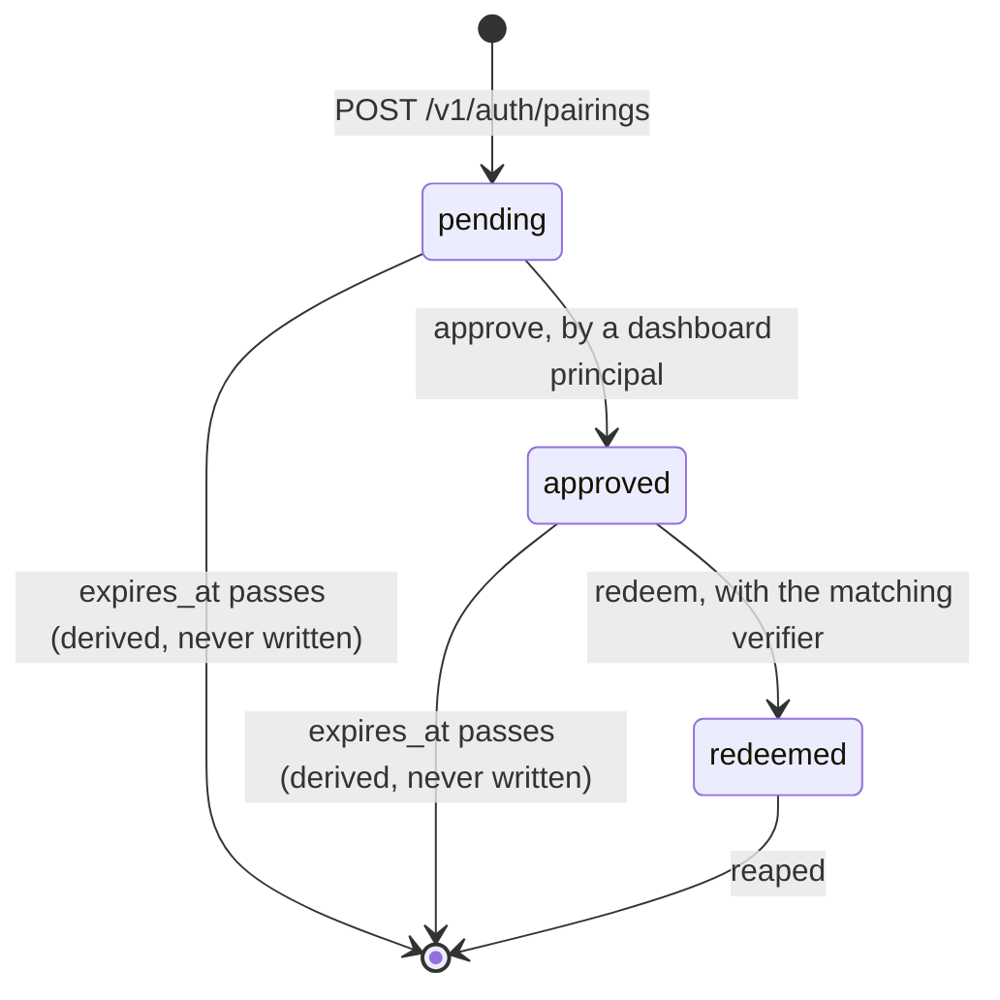

# Boomerang — Pairing and Grant Persistence

> **STATUS: SUPERSEDED IN PART — 2026-09-13. This was a proposal; it has since been ruled on, and it
> is no longer safe to read as current without the table below.**
>
> This document went to sign-off as a proposal and got an answer.
> [`boomerang-auth-open-decisions.md`](boomerang-auth-open-decisions.md) section 5 is the ruling
> against it and **governs wherever the two differ** — it says so itself, in as many words. The schema
> in `server/app/db/models.py` has already been built to that ruling. Several proposals below were
> **declined**, and because an implementer copies schema and diagrams out of a document like this one
> rather than reading it end to end, each declined part is stamped where it appears rather than only
> listed here.
>
> **What is superseded, and what governs instead:**
>
> | Superseded here | What it proposed | What governs now |
> |---|---|---|
> | §2 row 11, §8 in full, §12 row 13 | A same-browser correlator cookie, `approval_correlator_hash` on the pairing and `browser_correlator_hash` on the grant | **Declined outright.** No correlator ships, in any form. The ruling is section 2.4 of the open-decisions document; the product answer is that dashboard sign-out revokes every extension grant on the account |
> | §2 row 12, §9.1's `revoked_credentials` table, §9.3's "expired tombstones", §10's two tombstone rows, §12 row 9 | A credential tombstone surviving account deletion so that `account_deleted` could be returned | **Declined.** There is no tombstone and nothing survives account deletion. A later call answers `not_linked`; `account_deleted` is reserved and unreachable in v1 |
> | §3.1's `rejected` status and its check-constraint branch, §4's `rejected` edges, §11 gap 4 | A `rejected` pairing status awaiting a decline route | **Declined.** `pairing_requests.status` is `pending`, `approved`, `redeemed`, and there is no decline route |
> | §10, the resolution table | One resolution order including the tombstone rows | Replaced wholesale by the open-decisions document's section 5.3 |
> | §3.2's `revoked_reason` values | Six reasons including `account_deleted`, `idle_expired` and `absolute_expired` | Narrowed to `user_disconnected`, `dashboard_sign_out`, `refresh_reuse` — the only three a row can actually carry |
>
> **What still stands, and is load-bearing.** The three-table shape; `auth_grants` and
> `auth_credentials` under the composite account-scoping pattern; `uq_auth_grants_id` and its asserted
> test; the `NOT DEFERRABLE`, `MATCH FULL` composite foreign key; unsalted SHA-256 credential storage
> and the reasoning in section 6; the verifier never stored in any form; the grant having no `status`
> column; refresh rotation as generation rows and the grace-window treatment of the immediate
> predecessor; `pairing_requests` outside the account-scoped scheme under the pinned `UNSCOPED_ROWS`
> registry; the closed browser-label vocabulary; coarsened `last_used_at`; request-path pairing
> reaping; and the single indistinguishable failure on the pairing routes. Sections 6, 7 and the
> surviving parts of 5 were not disturbed by the ruling and can still be worked from directly.
>
> Nothing below has been deleted. Where a decision was reversed, what it used to say is kept beside
> the correction, because the reasoning is what makes the reversal reviewable — section 8 in
> particular is retained in full, since its fail-open analysis is the argument that produced the
> product decision to revoke account-wide.
>
> ---
>
> *The original proposal header follows, unchanged.*
>
> **STATUS: PROPOSAL — 2026-09-13. Needs sign-off.**
>
> Server-brokered browser linking was accepted on 2026-09-13 and specifies six authentication routes
> plus the Google credential exchange. Nothing specifies the tables those routes read and write. The
> accepted authentication design lists a grant record and a pairing record as *outstanding* data-model
> work; the accepted account-scoping design was written without knowledge of either table and its
> exhaustiveness check will fail the moment one of them is added. This document fills that gap. It is
> a proposal in full: every decision below is a call this document makes, not one it inherits.
>
> **What it is downstream of, and treats as normative:**
> [`boomerang-extension-auth-proposal.md`](boomerang-extension-auth-proposal.md) (ACCEPTED — the
> mechanism), [`boomerang-api-contract.md`](boomerang-api-contract.md) (the frozen wire surface and
> the caller-enforcement rules), and
> [`boomerang-account-scoping.md`](boomerang-account-scoping.md) (ACCEPTED — composite keys plus a
> scoped repository). Where those three are silent or disagree, this document says so in section 11
> rather than smoothing it over.
>
> **What it is not.** It is not an implementation. It does not edit `server/`, the wire contract, or
> either accepted design. It writes no numbers that belong to the open retention gate. Ten decisions
> it makes are not authorized by any accepted document; they are collected in section 12 and each is
> marked where it is made.

---

## 1. Scope

**In scope.** The durable server-side state behind `POST /v1/auth/pairings`,
`POST /v1/auth/pairings/{pairing_id}/approve`, `POST /v1/auth/pairings/{pairing_id}/redeem`,
`POST /v1/auth/refresh`, `GET /v1/auth/grants`, `POST /v1/auth/grants/revoke`, the dashboard session
established by `POST /v1/auth/google`, and the synchronous revocation `DELETE /v1/account` promises.

**Out of scope, deliberately.** Concrete lifetimes and rate-limit values (they are the open retention
gate, and this document is careful to specify *shape* without quietly setting a number). The Google
assertion verification obligations. The dashboard's rendering mode. The transport and at-rest
encryption posture and the secret store, none of which is decided — section 11 records where that
absence actually bites. Migration tooling, which does not exist in this repository at all.

**The one property everything here consumes.** The authentication boundary produces a server-side
account identifier that is never read from a request body, path segment or query parameter. That is
already frozen. This document specifies the records that boundary consults; it adds no way for a
caller to name an account.

---

## 2. The decisions, in one table

| # | Question | Decision |
|---|---|---|
| 1 | How many tables? | Three: `pairing_requests`, `auth_grants`, `auth_credentials` |
| 2 | Is a dashboard session a grant? | Yes. One grant model, two client kinds, one revocation path |
| 3 | Access and refresh credentials | Rows in one `auth_credentials` table discriminated by `kind`, never columns on the grant |
| 4 | Credential storage | SHA-256 digest of a 256-bit server-minted random value. Never plaintext, never a slow KDF, no salt. Reasons in section 6 |
| 5 | Verifier | Never stored in any form. Only the challenge, which is already a one-way function of it |
| 6 | Single-use redemption | A conditional `UPDATE ... WHERE status = 'approved'` whose affected-row count decides the winner. No read-then-write anywhere in the flow |
| 7 | Refresh rotation | Generation rows, not an overwritten column. A superseded credential stays attributable to its grant, which is what makes reuse detection possible at all |
| 8 | Superseded credential presented | Immediate predecessor inside a short grace window: treated as a lost-response retry, rotate again, no revocation. Anything older, or the predecessor after the grace: revoke the whole grant |
| 9 | Grant account scoping | Follows the composite pattern exactly — `(account_id, id)` primary key, composite child foreign key, `NOT DEFERRABLE`, `MATCH FULL` |
| 10 | Pairing account scoping | **Cannot.** It sits outside the scheme, under four named structural controls and a pinned unscoped-table registry (section 7) |
| 11 | The same-browser correlator | ~~Specifiable as a durable per-profile correlator cookie, and **not reliable**. It fails open in three ordinary cases. Section 8 states what that means for the product decision~~ **SUPERSEDED — declined outright.** No correlator ships, in any form, and neither record gains a correlator column. Section 8's fail-open analysis stands and is what produced the answer: sign-out revokes every extension grant on the account instead |
| 12 | Account deletion | Grants and credentials deleted in the deletion transaction — ~~a credential **tombstone** survives, because otherwise the contract's `account_deleted` discriminator cannot be returned at all (section 9)~~ **SUPERSEDED — no tombstone.** Nothing survives account deletion. Account-bound `pairing_requests` rows are deleted with them. A later call from a linked extension answers `not_linked`, and `account_deleted` is reserved and unreachable in v1 |
| 13 | Expiry | Never a stored status. Always evaluated at read time. Reaping is hygiene, never correctness |

---

## 3. The three tables

Types and idioms follow what `server/app/db/models.py` already does: `Text` identifiers,
`DateTime(timezone=True)` timestamps, native PostgreSQL enums built from the domain enum, explicitly
named composite constraints because the metadata naming convention only ever sees a constraint's
first column.

### 3.1 `pairing_requests`

```python
class PairingRequestRow(Base):
    """A browser-linking pairing, from creation to redemption.

    Deliberately NOT account-scoped. It exists before any account is bound to it, and the
    reasons that is safe are structural, not incidental - see the design document's section
    on the unscoped exception. It holds no account-derived data of any kind: the only
    account-linked value on the row is the account id itself.
    """

    __tablename__ = "pairing_requests"
    __table_args__ = (
        # A pairing that has never been approved has no account; one that has, always does.
        CheckConstraint(
            "(status = 'pending' AND account_id IS NULL AND approved_at IS NULL)"
            " OR (status IN ('approved', 'redeemed')"
            "     AND account_id IS NOT NULL AND approved_at IS NOT NULL)",
            name="pairing_requests_account_binding",
        ),
        CheckConstraint(
            "(status = 'redeemed') = (redeemed_at IS NOT NULL)",
            name="pairing_requests_redeemed_at",
        ),
        # The code is a comparison aid, not an input. Uniqueness matters only among codes
        # a user could be looking at simultaneously, which is why the index is partial.
        Index(
            "uq_pairing_requests_user_code_pending",
            "user_code",
            unique=True,
            postgresql_where=text("status = 'pending'"),
        ),
        Index("ix_pairing_requests_expires_at", "expires_at"),
    )

    id: Mapped[str] = mapped_column(Text, primary_key=True)
    status: Mapped[PairingStatus] = mapped_column(PAIRING_STATUS_ENUM)

    # base64url(SHA-256(verifier)). The verifier itself is never stored, never logged, and
    # never leaves the extension until redemption. S256 is the only accepted method; there
    # is no method column, because a "plain" method is a downgrade attack and adding a
    # second method should cost a schema change.
    code_challenge: Mapped[str] = mapped_column(Text)

    # Displayed by the popup and by the approval page for visual comparison. Never accepted
    # as an input on any route - there is no code-entry path and there never will be - so
    # this is not a credential and is stored as it is displayed.
    user_code: Mapped[str] = mapped_column(Text)

    # A closed vocabulary the server maps from what the extension declares, never free text
    # and never a raw user-agent string.
    browser_label: Mapped[BrowserLabel] = mapped_column(BROWSER_LABEL_ENUM)

    created_at: Mapped[datetime] = mapped_column(DateTime(timezone=True))
    expires_at: Mapped[datetime] = mapped_column(DateTime(timezone=True))
    approved_at: Mapped[datetime | None] = mapped_column(DateTime(timezone=True))
    redeemed_at: Mapped[datetime | None] = mapped_column(DateTime(timezone=True))

    # Bound at approval, from the dashboard's authenticated principal. Never from a request
    # body. Nullable for exactly as long as the pairing is unapproved.
    account_id: Mapped[str | None] = mapped_column(ForeignKey("accounts.id"))
```

**Two things this block used to contain and no longer does, because they were declined and the
shipped schema in `server/app/db/models.py` does not have them.** They are named here rather than
silently dropped, because this block is the one an implementer copies.

The first is a final `" OR (status = 'rejected')"` branch on the `pairing_requests_account_binding`
check constraint. With `rejected` gone from the status vocabulary the remaining two branches are
exhaustive, and the third branch would have been an unreachable escape hatch that also happened to
permit a row with no account binding at all.

The second is a trailing column:

```python
    # SHA-256 of the approving browser's correlator cookie. Copied onto the grant at
    # redemption. NULL means "this browser is not correlatable", and NULL never matches.
    approval_correlator_hash: Mapped[str | None] = mapped_column(Text)
```

**Do not add it.** The correlator is declined in every form (section 8's stamp, and the ruling in the
open-decisions document's section 2.4). Nothing reads this column, nothing writes it, and adding it
would mint and store a durable per-browser identifier that the privacy copy does not cover.

`id` is a single-column primary key, globally unique, server-minted from 128 bits of randomness or
more. It is an addressing value that appears in a URL; it is not a credential and confers nothing on
its own, because redemption requires the verifier.

`status` is `pending | approved | redeemed`. **`expired` is not a status.** A pairing is
expired when `expires_at <= now()`, evaluated in the predicate of every statement that touches it.
Nothing has to run for an expired pairing to stop working.

**This paragraph previously read `pending | approved | redeemed | rejected`, and added that
"`rejected` is reachable only if a decline route exists. One does not — see section 11, gap 4."** The
gap closed against the proposal rather than for it. There is no decline route and there will not be
one: the only actor who can approve a pairing is the signed-in user themselves, so a pairing nobody
acts on is approvable by nobody else and expires on its own within minutes, which makes an undeclined
pairing harmless rather than hanging. `rejected` is therefore not a member of the status vocabulary,
and the approval page's copy says to close the page rather than to decline.

### 3.2 `auth_grants`

```python
class AuthGrantRow(Base):
    """One account's authorization to one client instance: a linked browser's extension,
    or a dashboard session.
    """

    __tablename__ = "auth_grants"
    __table_args__ = (
        # The wire identifier names at most one grant, and - load-bearing for account
        # isolation - no second grant row can ever share this id under another account,
        # so a credential row can never be hopped onto a same-id parent in a different
        # account. This constraint is not merely a convenience for the revoke route.
        UniqueConstraint("id", name="uq_auth_grants_id"),
        CheckConstraint(
            "(revoked_at IS NULL) = (revoked_reason IS NULL)",
            name="auth_grants_revocation_pair",
        ),
        Index("ix_auth_grants_account_id_client_kind", "account_id", "client_kind"),
    )

    account_id: Mapped[str] = mapped_column(
        Text, ForeignKey("accounts.id"), primary_key=True
    )
    id: Mapped[str] = mapped_column(Text, primary_key=True)

    client_kind: Mapped[AuthClientKind] = mapped_column(AUTH_CLIENT_KIND_ENUM)
    browser_label: Mapped[BrowserLabel] = mapped_column(BROWSER_LABEL_ENUM)

    created_at: Mapped[datetime] = mapped_column(DateTime(timezone=True))
    last_used_at: Mapped[datetime] = mapped_column(DateTime(timezone=True))
    idle_expires_at: Mapped[datetime] = mapped_column(DateTime(timezone=True))
    absolute_expires_at: Mapped[datetime] = mapped_column(DateTime(timezone=True))

    revoked_at: Mapped[datetime | None] = mapped_column(DateTime(timezone=True))
    revoked_reason: Mapped[GrantRevocationReason | None] = mapped_column(
        GRANT_REVOCATION_REASON_ENUM
    )
```

**Two declined items used to be declared in that block**, and are named here for the same reason as
in section 3.1 — this is a block an implementer copies, and the shipped schema in
`server/app/db/models.py` has neither. The first was a trailing column,
`browser_correlator_hash: Mapped[str | None] = mapped_column(Text)`. The second was the index that
existed only to serve it:

```python
        # Sign-out revocation is always account-scoped: a shared machine may hold grants
        # for two accounts behind one correlator, and one account's sign-out must not
        # touch the other's.
        Index(
            "ix_auth_grants_account_id_correlator",
            "account_id",
            "browser_correlator_hash",
        ),
```

**Do not add either.** The account-scoping instinct behind that comment was right and survives the
decline — sign-out revocation is still always account-scoped — but it is scoped by `account_id` and
`client_kind`, which `ix_auth_grants_account_id_client_kind` above already serves, and not by a
correlator. Section 8 is why.

**There is no `status` column, and that is deliberate.** A grant is live when `revoked_at IS NULL`
and neither expiry has passed. A status column alongside `revoked_at` creates a class of
representable-but-impossible rows (`status='revoked'` with a null `revoked_at`, and the reverse) that
someone then has to write a reconciliation for. One nullable timestamp with a paired reason and a
check constraint has no such class. `pairing_requests` gets an explicit status enum instead because
it has a genuine multi-state machine, not a single terminal event. (That sentence said "four-state"
when `rejected` was still proposed; the machine has three states.)

**There is no `chain_id`.** The accepted design's data-model list asks for "a chain identifier and
generation counter". A chain is by definition the set of credentials descended from one grant, and a
chain never outlives its grant — re-linking mints a new grant. `grant_id` *is* the chain identifier;
a second column would be a copy of it that can drift. Recorded in section 12 as a simplification of
what was accepted.

`revoked_reason` is `user_disconnected | dashboard_sign_out | refresh_reuse`. **Narrowed from the
six values this section first proposed** — `idle_expired`, `absolute_expired` and `account_deleted`
are dropped, and each for a reason the proposal did not follow through on.

`account_deleted` is unwritable. Account deletion removes the grant row itself, inside the deletion
transaction and before the `204`, so there is no surviving row on which to record that the account
was deleted; the value could only ever be written to something that is about to cease to exist. The
credential tombstone this document proposed in section 9.1 to carry that fact past deletion is not
built — see [`boomerang-auth-open-decisions.md`](boomerang-auth-open-decisions.md), section 2.3 —
so nothing outlives the delete and nothing needs the value. A later call from a linked extension
resolves to nothing and answers `not_linked`.

The two expiry reasons are dropped because expiry is derived at read time and never awaited, exactly
as this section already says of `pairing_requests`. This document originally kept them for the
narrow case where a reaper materializes an expired grant as revoked before deleting it, but that
reaper does not exist in v1 and, if it is built later, a row it is about to delete does not need an
accurate reason first. Keeping a value only a hypothetical maintenance job could write is dead
schema the first migration has to carry. Both are additive to reinstate.

The remaining three are the reasons a live grant can actually be revoked into, and each is reachable
on the request path. Note that `dashboard_sign_out` is now written across **every** live extension
grant on the account, not one browser's: see section 5 of
[`boomerang-auth-open-decisions.md`](boomerang-auth-open-decisions.md), which supersedes this
proposal wherever the two disagree — including elsewhere in this table, where the
`browser_correlator_hash` column and the `ix_auth_grants_account_id_correlator` index declared above
are declined outright.

### 3.3 `auth_credentials`

```python
class AuthCredentialRow(Base):
    """Every bearer credential in the system: extension access credentials, extension
    refresh credentials, and dashboard session cookie values. One table, because
    "resolve this presented string to an account" must be one indexed lookup no matter
    which route received it, and because revoking a grant must be one statement.
    """

    __tablename__ = "auth_credentials"
    __table_args__ = (
        ForeignKeyConstraint(
            ["account_id", "grant_id"],
            ["auth_grants.account_id", "auth_grants.id"],
            name="fk_auth_credentials_account_id_auth_grants",
            deferrable=False,
            match="FULL",
        ),
        # The lookup index for an unauthenticated presentation. Global on purpose: this
        # is the one read that happens before an account is known, because it is the read
        # that produces the account.
        UniqueConstraint("credential_hash", name="uq_auth_credentials_credential_hash"),
        CheckConstraint(
            "(kind = 'refresh') = (generation IS NOT NULL)",
            name="auth_credentials_generation_for_refresh",
        ),
        CheckConstraint(
            "(rotated_at IS NULL) OR (kind = 'refresh')",
            name="auth_credentials_rotation_is_refresh_only",
        ),
        Index("ix_auth_credentials_account_id_grant_id", "account_id", "grant_id"),
        Index("ix_auth_credentials_expires_at", "expires_at"),
    )

    account_id: Mapped[str] = mapped_column(Text, primary_key=True)
    id: Mapped[str] = mapped_column(Text, primary_key=True)
    grant_id: Mapped[str] = mapped_column(Text)

    kind: Mapped[AuthCredentialKind] = mapped_column(AUTH_CREDENTIAL_KIND_ENUM)

    # SHA-256 of the raw credential bytes, hex-encoded. The credential itself exists in
    # plaintext exactly once, in the response body that delivers it.
    credential_hash: Mapped[str] = mapped_column(Text)

    # Refresh credentials only. Monotonic within a grant.
    generation: Mapped[int | None] = mapped_column(Integer)

    issued_at: Mapped[datetime] = mapped_column(DateTime(timezone=True))
    expires_at: Mapped[datetime] = mapped_column(DateTime(timezone=True))
    rotated_at: Mapped[datetime | None] = mapped_column(DateTime(timezone=True))
    revoked_at: Mapped[datetime | None] = mapped_column(DateTime(timezone=True))
```

The composite foreign key is `NOT DEFERRABLE` and `MATCH FULL`, matching what the account-scoping
design requires of every account-scoping composite key and for the same verified reasons: under
`DEFERRABLE INITIALLY DEFERRED` a bad insert succeeds at the statement and fails only at commit, and
under `MATCH SIMPLE` a row with one null key column skips the check entirely. Both key columns are
primary-key columns and therefore `NOT NULL` regardless; `MATCH FULL` makes that a property of the
constraint rather than of a reviewer's memory. No `ON UPDATE CASCADE`, ever — a grant does not change
accounts, and the cascade variant is the one that silently relabels a subtree.

**Why a table and not two columns on the grant.** An overwritten `refresh_credential_hash` column
cannot support reuse detection at all. Detection requires that a *rotated-away* credential still
resolve to its grant; if the only stored hash is the current one, a presented old credential hashes
to nothing, finds nothing, and is answered "not linked" — the exact signal the design calls
load-bearing is structurally unobservable. Generation rows keep every superseded credential
attributable for as long as it is retained, and they make the rotation race and the retry case the
same mechanism (section 5).

---

## 4. Pairing: the state machine and single-use



Three transitions, each a single conditional statement. No transition anywhere in this flow reads a
row and then writes it.

**This diagram used to carry a fourth state.** It had `pending --> rejected: decline (route does not
exist - see section 11)` and `rejected --> [*]: reaped`, drawn as though the missing decline route
were a gap waiting to be filled. It is not: the decline route is declined, `rejected` is not a status,
and both edges are removed rather than annotated, because an edge in a state diagram is the thing an
implementer builds a transition for. A pairing the user does not act on leaves this machine by the
`expires_at` edge that is already drawn, which is the only exit an unapproved pairing has ever
actually had.

### 4.1 Approval

```sql
UPDATE pairing_requests
   SET status = 'approved',
       account_id = :account_id,
       approved_at = :now
 WHERE id = :pairing_id
   AND status = 'pending'
   AND expires_at > :now
RETURNING id;
```

This statement previously carried a fourth assignment, `approval_correlator_hash = :correlator_hash`.
It is removed with the column (section 3.1); the predicate and the rest of the `SET` list are
unchanged, and nothing else about approval moves.

`account_id` comes from the dashboard's authenticated principal, never from the request. Zero rows
affected means the pairing was already approved, already redeemed, expired, or never
existed. The handler then re-reads once: if the row is `approved` and its `account_id` equals the
caller's, it answers success idempotently — two dashboard tabs, or a double-click, must not be an
error. In every other case it answers the single indistinguishable failure of the resolution order in
[`boomerang-auth-open-decisions.md`](boomerang-auth-open-decisions.md) section 5.3, which replaces
section 10 below. A pairing approved by one account can never be re-approved by another, because the
predicate requires `pending`.

### 4.2 Redemption, and the concurrent double-redeem

The verifier is checked **before** status is examined, on every poll including the pre-approval ones.
That ordering matters: it means the pending/approved distinction is disclosed only to the holder of
the verifier, so an attacker who has the pairing identifier from the URL bar cannot even use polling
as an approval oracle.

```sql
UPDATE pairing_requests
   SET status = 'redeemed',
       redeemed_at = :now
 WHERE id = :pairing_id
   AND status = 'approved'
   AND expires_at > :now
RETURNING account_id, browser_label;
```

The `RETURNING` list previously ended with `approval_correlator_hash`, which redemption copied onto
the new grant's `browser_correlator_hash`. Both columns are declined, so redemption returns the
account and the label and nothing else, and there is no copy step.

**Why this wins the race and a check-then-write does not.** Two concurrent redemptions of the same
pairing both reach the `UPDATE`. PostgreSQL takes a row lock; the second statement blocks. Under
`READ COMMITTED` — the default — the blocked statement then re-evaluates its `WHERE` clause against
the committed version of the row, finds `status = 'redeemed'`, and reports **zero rows affected**.
Exactly one transaction gets a row back. The affected-row count, not a prior `SELECT`, is the
decision. A check-then-write loses because both transactions observe `approved` in their own snapshot
and both proceed.

Under `REPEATABLE READ` or `SERIALIZABLE` the same statement raises a serialization failure
(`40001`) instead. That must be handled as **"lost the race" — the losing redemption returns the
standard failure — and must not be blindly retried**, because a blind retry of an
already-consumed pairing is exactly the double-issue this predicate exists to prevent. Whichever
isolation level the session factory ends up using, the handler needs both branches, because the level
is not yet decided anywhere.

The grant and its two credential rows are inserted **in the same transaction** as the consuming
`UPDATE`. One pairing therefore yields one grant, by construction rather than by ordering.

**Redemption is at-most-once, not exactly-once, and this is accepted.** If the transaction commits
and the response is lost in flight, the pairing is consumed and the extension never received its
credentials. It cannot redeem again — nothing in the design should let it — so it starts a new
pairing, and the orphaned grant sits in the linked-browsers list until its idle limit passes or the
user revokes it. The alternative, making redemption replayable, would require either storing the
plaintext credentials or weakening single-use; both are worse. The cost is a rare, visible, revocable
stray entry in a list the design already built for exactly this kind of discoverability.

### 4.3 The short code

It is displayed, never submitted. That single fact settles three questions at once: it needs no
lookup index, it is not a credential and so is stored as displayed, and its only security property is
that two pairings a user could be comparing at the same moment must not show the same code. Hence the
partial unique index over pending rows only, and a regenerate-on-conflict retry at creation. Proposed
shape: eight characters from a 32-symbol alphabet with the ambiguous glyphs removed, grouped
`XXXX-XXXX` — forty bits, so the conflict retry is a formality rather than a code path anyone will
see. The alphabet and grouping are display concerns; the persistence requirement is only that the
column stores exactly what is shown.

### 4.4 The browser label is attacker-controlled in the phishing case

The accepted design asks for "a human-readable browser label" on the grant for the linked-browsers
list, and does not say where it comes from. Only the extension knows what browser it is running in,
so it must supply it — which means in precisely the device-code-shaped phishing scenario the design
worries about, the attacker chooses the string that gets written into the victim's dashboard. Free
text there is a stored-injection surface on the dashboard and a channel for writing attacker-chosen
words onto a victim's account page.

**Decision: the label is a closed server-side vocabulary**, mapped from a small declared platform
token, bounded, never the raw user-agent string, never free text. Adding a value is a schema change.
This is a call this document makes; the accepted design is silent on it, and it touches the same
undecided product question as what the approval screen is allowed to display.

---

## 5. Grants, rotation, and the superseded credential

### 5.1 One grant model for both client kinds

A dashboard session is a grant with `client_kind = 'dashboard'`, and the session cookie's value is an
access credential row pointing at it. The alternative — a separate session store — would mean account
deletion has two things to revoke and two ways to get it wrong, and the contract's promise is "every
grant for the account, **in every client**, revoked synchronously". One model, one statement.

This has a consequence for `GET /v1/auth/grants`, which the contract describes as "one entry per live
grant on the account" while also calling it the linked-browsers list. Taken literally it would list
the user's own dashboard session as a linked browser. **Decision: the route returns extension-kind
grants only.** Recorded in section 11 as a contract wording that needs tightening.

It also resolves an oddity in caller enforcement: `POST /v1/auth/refresh` is restricted to an
extension principal, but it is authenticated by the refresh credential rather than the access
credential. Because `client_kind` lives on the grant and both credential kinds resolve to the grant,
the check works identically on both paths. The authentication dependency needs two modes — resolve
from `Authorization`, resolve from a presented refresh credential — producing the same principal.

### 5.2 Rotation

One statement claims the right to rotate:

```sql
UPDATE auth_credentials
   SET rotated_at = :now
 WHERE account_id = :account_id
   AND id = :credential_id
   AND kind = 'refresh'
   AND rotated_at IS NULL
   AND revoked_at IS NULL
   AND expires_at > :now
RETURNING generation;
```

One row affected: this caller rotates, inserting generation *n+1* and a fresh access credential in the
same transaction. Zero rows affected: this caller lost, and falls into section 5.3. The concurrency
control and the retry semantics are the same mechanism, which is the reason to prefer this shape over
a separate lock.

The grant's `idle_expires_at` is pushed forward in the same transaction. `absolute_expires_at` never
moves.

### 5.3 A superseded credential is presented

The canonical replay signal, and the one place where a wrong call is expensive in both directions.

| What was presented | Response |
|---|---|
| The current credential | Rotate normally |
| The immediate predecessor (`generation = current − 1`), within a short grace window after its `rotated_at` | **Rotate normally. No revocation.** This is overwhelmingly a lost response, not a thief |
| The immediate predecessor after the grace window | Reuse. Revoke the grant |
| Any older generation, at any time | Reuse. Revoke the grant |
| A credential already marked revoked | Reuse. The grant is already revoked; answer identically |
| A hash that matches no row | Not linked. There is nothing to revoke and nothing to attribute |

Revocation on reuse is one transaction: set `revoked_at` and `revoked_reason = 'refresh_reuse'` on the
grant, and `revoked_at` on every credential row of that grant, access and refresh alike. It stops at
the grant. Other grants on the account, including the dashboard session, are untouched — the chain is
the grant, and a thief of one browser's refresh credential has not demonstrated anything about
another browser.

**The grace window is a real trade, stated plainly.** Without it, a single lost refresh response —
a dropped connection, a service worker terminated mid-call — costs the user a full re-link, and the
design's own storage rules guarantee the extension will retry with the only credential it still has.
With it, an attacker who replays within seconds of a legitimate rotation gets a working credential
instead of tripping the alarm. What the window does **not** do is create two silent parallel chains:
the server tracks exactly one current generation, so the attacker and the victim are racing for the
same slot, and the loser's next refresh presents a superseded credential and revokes everything. The
window converts a certain re-link into a probabilistic one; it does not convert a detected compromise
into an undetected one. The window must be seconds, not minutes, and its value belongs to the open
retention gate.

**Reuse detection cannot tell the thief from the victim, and both are logged out.** That is the
accepted property of the mechanism, not a defect of this schema, and it is why the response is a
re-link rather than a lockout.

### 5.4 `last_used_at`

The linked-browsers list shows it and the idle limit depends on it, so something must maintain it —
and the naive reading is an `UPDATE` on a hot row on *every authenticated request*, which is row
contention plus write-ahead-log churn on what is otherwise a pure read path.

**Decision: coarsen it.** Update only when the stored value is older than a refresh threshold:

```sql
UPDATE auth_grants
   SET last_used_at = :now
 WHERE account_id = :account_id
   AND id = :grant_id
   AND last_used_at < :now - :coarsening_interval;
```

Two constraints on the threshold, both of which must hold and neither of which is a number this
document may set: it must be far smaller than the idle limit, or the idle limit is enforced against a
stale value and grants outlive it; and it is also the granularity at which the product records a
user's activity, so coarse is the privacy-preferable direction as well as the cheap one. Both numbers
belong to the retention gate and must be chosen together, not separately.

---

## 6. Credential storage

**Every bearer credential is stored as a SHA-256 digest of its raw bytes. No credential is ever
stored in plaintext. The digest is unsalted and unpeppered, and the hash is deliberately fast.**

Each claim, with its reason, because this is the section most likely to be second-guessed by someone
applying password advice to something that is not a password:

- **Hashed, not plaintext.** A database read — an injection flaw, a leaked backup, an over-broad
  analytics grant — must not yield a usable credential. This is the whole point, and it is what makes
  the unscoped pairing table tolerable in section 7 as well: nothing at rest can be replayed.
- **Fast, not a slow KDF.** Argon2, scrypt and bcrypt exist to make *guessing* expensive, which is
  only meaningful when the secret comes from a small space. These credentials are 32 bytes from a
  cryptographic random source, generated by the server, never chosen by a user. There is no
  dictionary to iterate. Meanwhile the access credential is resolved on *every authenticated
  request*: a deliberately slow function there costs tens of milliseconds on the critical path of
  every call and hands anyone with an unauthenticated-lookup path a free amplification. Using a slow
  KDF here would be a security decision that makes the system less secure.
- **Unsalted, deliberately.** The lookup is "resolve this presented string", which must be one
  indexed equality against `uq_auth_credentials_credential_hash`. A per-row salt would force a scan
  of every row. Salting exists to defeat precomputation across a small input space; against a
  256-bit space there is nothing to precompute. Unsalted is not a shortcut here, it is the correct
  choice for this input.
- **No pepper, and the reason is worth writing down** rather than leaving it to look like an
  oversight. A server-side pepper would protect against an attacker who reads the database but cannot
  read application secrets — but this system has not chosen a secret store at all (the accepted
  design lists it as unresolved), so a pepper today means a constant in a config file whose blast
  radius is identical to the database's. Revisit if and when a real secret store lands.
- **Compare with a constant-time comparison** after the indexed fetch. Not because the space is
  guessable — it is not — but because it costs nothing and removes the question.
- **The digest column is globally unique across accounts.** That is intentional and it is the one
  read in the system that legitimately has no account predicate, because it is the read that
  *produces* the account (section 7.4).

Two values are **not** hashed, and each has a reason:

- **The code challenge** is stored exactly as received. It is already `SHA-256(verifier)`; hashing a
  hash of a 256-bit random value adds nothing and would break verification. The **verifier is never
  stored in any form, at any point** — not at creation, not at redemption, not in a log. It is the
  one value whose absence from the database is what makes an approved pairing row useless to whoever
  reads it.
- **The short code** is stored as displayed, because the server has to render it to the approval page
  and it is accepted as input nowhere.

**Never logged, at any level.** The workspace's redaction rule is enforced by a formatter rather than
at call sites, and these field names — credential, refresh credential, digest, verifier, challenge,
short code, pairing identifier, grant identifier, correlator — belong in it. No custom `__repr__` on
any of these rows: SQLAlchemy's default does not print column values, and a hand-written one would.

**Unresolved dependency.** Transport encryption to the database and encryption at rest are undecided
for this system. Hashing means a stolen database yields no usable credential, which is the property
that matters most, but it is not a substitute for either and this document cannot close them.

---

## 7. Account scoping

### 7.1 Grants and credentials follow the composite pattern exactly

They always have an account, so there is no reason to make them the exception:

- `auth_grants` primary key `(account_id, id)`, `account_id` leading, plus `UNIQUE (id)`.
- `auth_credentials` primary key `(account_id, id)`, composite foreign key
  `(account_id, grant_id) → auth_grants (account_id, id)`, explicitly named,
  `NOT DEFERRABLE`, `MATCH FULL`, no `ON UPDATE CASCADE`.
- Both entered in the `ACCOUNT_COLUMN` registry, so the scoped repository's single-column-equality
  predicate covers them like every other table.

The parent side needs no extra unique constraint: `auth_grants`'s primary key *is* `(account_id, id)`,
which is what the child key references. This differs from `orders`, which needed
`uq_orders_account_id_id` added alongside a single-column primary key.

**The hop, and why it is not reachable here.** A composite foreign key guarantees a child agrees with
its parent; it does not by itself stop a child being moved onto a *different* parent that shares its
non-account key. That requires two parent rows with the same `id` under different accounts. For
`orders`, global uniqueness of `id` comes from its single-column primary key, and the accepted design
records that as a load-bearing invariant. For `auth_grants`, the primary key is composite, so **the
global uniqueness that closes the hop comes from `uq_auth_grants_id` and nowhere else**. That
constraint therefore is not merely a convenience for the revoke route, and it needs its own assertion
in the model tests next to the ones the accepted design already specifies — a test that fails the day
someone drops it as redundant.

### 7.2 Pairing requests cannot be account-scoped, and here is why that is a fact rather than a preference

The scheme requires `account_id` to be the leading, `NOT NULL` column of the primary key. A pairing
request exists before any account is bound to it: the extension creates it, and only later does a
signed-in dashboard tab approve it. Four independent walls, any one of which is sufficient:

1. **A primary-key column cannot be null.** There is nothing to put there at creation.
2. **Setting it later would be an update of a primary-key column** — the row's identity changing under
   it — which is the precise shape the account-scoping design forbids by construction everywhere else.
3. **A nullable `account_id` in a composite foreign key is the `MATCH SIMPLE` escape hatch**, verified
   in the accepted design: a row with one null key column skips the foreign-key check *entirely*,
   including the account column. The one table that would need a nullable account column is the one
   table where that exemption would apply.
4. **Deferring the row until approval does not help**, because the extension must be handed a pairing
   identifier and a code before any dashboard tab is involved. The alternative that genuinely avoids
   the table is in section 7.5, and it has a different cost.

**Decision: `pairing_requests` sits outside the account-scoped scheme.** It carries `account_id` as a
plain nullable foreign key to `accounts.id` — real referential integrity, no participation in any key.
It is not entered in `ACCOUNT_COLUMN`, and entering it would be type-correct and semantically wrong:
rows with a null account would silently never match, so the scoped repository would appear to work
and would return nothing.

### 7.3 What stops it becoming the leak channel

The question is fair and deserves structural answers, not assurances.

**It holds nothing account-derived.** The only account-linked value on the row is the account
identifier itself. There is no order, item, policy, preference or summary field, and there is no
foreign key *from* any account-scoped table *to* this one. Full read exposure of the table discloses
pairing identifiers, short codes, challenge digests, timestamps, a coarse browser label, and account
identifiers. There is no join from a pairing row to any user content, because no such path exists in
the schema.

**Nothing at rest in it can be presented as a credential.** The verifier is never stored; the
challenge is a one-way function of it. An attacker who reads an approved pairing row still cannot
redeem it. This is the same reasoning that makes a password digest table survivable, and it is the
single most important property of the exception: the unscoped table is not a credential store.

**There is no account-to-pairing addressing direction, at all.** No route lists pairings, no route
takes an account and returns pairings, and every statement against the table addresses exactly one row
by an unguessable server-minted identifier and proves possession of the verifier. There is nothing to
enumerate and nothing to filter incorrectly, because there is no filtered read.

**Its reachable life is minutes.** Expiry is evaluated at read time in every predicate, so an expired
pairing is inert whether or not anything has swept it.

**And the exception is pinned, not tolerated.** The accepted scoping design's exhaustiveness check —
every mapped row either declares an account column or is `AccountRow` — is what makes the registry
extend to code nobody has written yet. Adding this table breaks it, which is the mechanism doing
exactly its job. **Do not widen the subtraction inline.** Replace it with an explicit set:

```python
# Every row that is deliberately not account-scoped, and nothing else. A row added later
# lands in neither this set nor the account registry, and the assertion below fails.
UNSCOPED_ROWS: Final[frozenset[type[Base]]] = frozenset(
    {AccountRow, PairingRequestRow, RevokedCredentialRow}
)


def unscoped_rows(
    registry: Mapping[type[Base], InstrumentedAttribute[str]],
) -> frozenset[type[Base]]:
    """Return every stored row that declares no account column."""
    return frozenset(ORM_ROWS) - frozenset(registry)
```

with a test asserting exact equality against `UNSCOPED_ROWS` — not a subset, not a membership check.
Adding a third unscoped table then requires editing a named list and changing a failing test, in front
of a reviewer, which is the difference between an exception and a hole.

**Plus a boundary assertion.** The accepted design already specifies an AST walk asserting that no
module under the route or service layers imports a session or `select`. Extend the same walk to
assert that `PairingRequestRow` is imported by exactly one module — the authentication persistence
module — and by nothing else, ever. That is the machine-checked form of "this table is reachable only
from the four pairing routes".

### 7.4 The one legitimately unscoped read

Resolving a presented credential to an account happens *before* an account is known; it is the read
that produces the account. It cannot be scoped, by definition. The accepted design anticipated this
shape and prescribed the answer: not a nullable field on the scoped type, but **a separate,
differently-named unscoped repository with its own review and its own tests**. So:

- `AccountScope.account_id` stays a plain `str` and never becomes `str | None`.
- Credential resolution lives in its own module, under the `app/db/` lint exemption, exposing exactly
  one function: presented string in, resolved principal or a typed failure out. It returns a
  principal carrying the account **and** the client kind; the client kind is a separate axis and must
  not be folded into `AccountScope`.
- Everything downstream of it — including `GET /v1/auth/grants`, the revoke route, and account
  deletion — goes through the scoped repository like every other route. An extension principal
  presenting another account's grant identifier to the revoke route gets `404 not_found` from the
  scoping mechanism rather than from a hand-written ownership check, which is what the contract
  already requires.

### 7.5 The alternative that removes the unscoped table, considered and rejected

A stateless pairing: the server signs `{challenge, short code, browser label, expiry}` into the
pairing identifier and stores *nothing* until a dashboard tab approves. Approval inserts the row —
now with an account, fully composite-scoped — and a unique constraint on the pairing identifier makes
approval single-use. There is no unscoped table at all, and an unapproved pairing leaves no server
trace, which is genuinely better for privacy.

Rejected for v1 for one decisive reason and one supporting one. **Decisive: it requires a signing key,
and this system has not chosen a secret store.** Trading a scoped-table exception for a key-management
dependency that is explicitly open is a bad trade today. **Supporting:** it moves rate limiting for
pairing creation onto a path with no state to count, and pairing-creation rate limits are one of the
named phishing mitigations.

It is, however, the right fallback **if sign-off refuses the unscoped exception**, and it should be
reopened when a secret store is chosen. Recorded so the choice is visible rather than rediscovered.

---

## 8. The correlator

> **SUPERSEDED — 2026-09-13. The correlator is declined outright and ships in no form. Nothing in this
> section is to be built.**
>
> This section is retained in full, and deliberately, because its analysis is the argument that
> settled the question. It asked whether the same-browser revocation scope could be implemented
> reliably, answered *no* in section 8.2, and recommended in section 8.3 that the correlator be built
> anyway as a documented best effort because it was the only mechanism matching the decision on record.
> **That recommendation was not taken.** The finding underneath it was, and the decision on record
> changed instead: the scope question went to the user, who chose account-wide revocation precisely
> because every failure case tabulated in 8.2 is a silent fail-open, and a blunt mechanism that never
> lies about being signed out was preferred to a precise one that quietly does not run.
>
> What follows from that: `approval_correlator_hash`, `browser_correlator_hash`,
> `ix_auth_grants_account_id_correlator` and the correlator cookie are **not built**, now or later —
> declined, not deferred. No durable per-browser identifier is minted, stored or disclosed, and the
> privacy copy gains no new claim. Sign-out revocation is one account-scoped statement over every live
> extension-kind grant on the account, behind the single service-layer seam named in
> [`boomerang-auth-open-decisions.md`](boomerang-auth-open-decisions.md) section 5.4. The sign-out SQL
> in section 8.1 below is superseded by that statement: it is the same `UPDATE` **without** the
> `browser_correlator_hash` predicate on its last line.
>
> Two things in this section outlived the decline and are still live findings. Section 8.2's row on
> pasting the approval URL into a different browser is why the approval page's copy matters
> independently of any correlator. And the `SameSite=Lax` registrable-domain precondition at the end of
> section 8.3 is **not** a correlator concern — it is a deployment requirement for the dashboard
> session cookie itself, it remains unresolved, and it is recorded as such in section 11 item 16.

The recorded product decision is that dashboard sign-out revokes the extension's grant *in the same
browser*. The accepted design says, in as many words, that this requires a correlator on both records
and that its design is unspecified. Here is what can be built, and where it stops working.

### 8.1 What a correlator can be

**A durable per-profile correlator cookie, independent of the session.** The API sets it on first
contact from a browser: `Secure`, `HttpOnly`, `SameSite=Lax`, a long max-age, an opaque random value,
and — critically — a lifetime that is *not* tied to the session, because the whole point is to
correlate across sign-in and sign-out.

- At **approval**, the dashboard's request carries it. The server stores `SHA-256(value)` on the
  pairing row.
- At **redemption**, it is copied to the grant, so the extension's grant carries the digest of the
  cookie belonging to the browser that approved it.
- At **sign-out**, the request carries it again, and the revocation is:

```sql
UPDATE auth_grants
   SET revoked_at = :now, revoked_reason = 'dashboard_sign_out'
 WHERE account_id = :account_id
   AND client_kind = 'extension'
   AND revoked_at IS NULL
   AND browser_correlator_hash = :correlator_hash;
```

Always account-scoped, never a global correlator lookup. A shared machine may hold grants for two
accounts behind one cookie, and one account signing out must not touch the other's extension grant.
The digest is stored rather than the raw value so that a database read does not yield a cookie
someone can set.

The obvious cheaper idea — correlate the extension grant to the *dashboard session* that approved it
— does not work and should be named so nobody reinvents it. Sessions are far shorter than links, so
by the time a user signs out they are usually in a later session, the identifier does not match, and
nothing is revoked. It fails in the common case, not the edge case.

### 8.2 Where it fails, honestly

| Case | What happens | Direction of failure |
|---|---|---|
| Cookie absent — blocked, a fresh profile, a client that never got one | No match, nothing revoked. The extension stays linked after sign-out | **Fails open**, silently |
| Cookie cleared by the user | Clearing cookies also ends the session, so no explicit sign-out ever happens; the grant survives indefinitely | **Fails open**, silently |
| Sign-out from a different browser, or an incognito window | Different cookie jar, different correlator, no match. The grant in the original browser survives | **Fails open**, silently |
| Two Chrome profiles on one machine | Cookie jars and extension storage are both per-profile, so they align. Two profiles produce two correlators and two grants, and each signs out independently | **Works.** This case is better than it looks |
| A profile directory copied or restored from backup | Two browsers hold the same correlator; a sign-out in one revokes the grant in both | Fails closed — an extra re-link, low consequence |
| The user pastes the approval URL into a different browser | The correlator recorded is the *approving* browser's, which is not the extension's browser | Silently wrong in both directions |

The asymmetry is the finding. Every ordinary failure is a **silent fail-open**: the user signs out,
believes they are signed out, and the extension in that browser keeps working. The user's stated
mental model — "sign out means signed out" — is exactly what the mechanism cannot guarantee.

### 8.3 The verdict

**The product decision as worded can be implemented for the common case and cannot be implemented
reliably. It is a best effort with a silent failure mode in the direction the user cares about.**

This document will not dress that up. Specifically:

- Same-browser revocation **requires new state on both records** (`approval_correlator_hash` on the
  pairing, `browser_correlator_hash` on the grant), **a new durable client-side identifier**, and a
  sign-out route that does not exist in any document.
- The new client-side identifier is a durable, server-recorded, cross-session browser identifier that
  survives sign-out by construction. The accepted design treats even a coarse *browser label* as "a
  small new piece of data being stored about the user" and defers it to product judgment. A durable
  browser identifier is a larger one, it must appear in the privacy copy, and it should not be created
  as a side effect of an implementation ticket.
- **Account-wide revocation needs no correlator and fails safe.** "Sign out revokes every extension
  grant on this account" is one statement with no new state, no new cookie, no new client-side
  identifier, and no silent case. It is more aggressive than asked — signing out on a work laptop
  unlinks the home browser — and it is strictly closer to "signed out" than a mechanism that
  sometimes does nothing without telling anyone.
- There is also an unstated deployment precondition underneath all of this: `SameSite=Lax` does not
  send a cookie on a cross-site POST, so the dashboard origin and the API origin must share a
  registrable domain. That is assumed in the accepted design as a conditional ("if the dashboard and
  the API share a registrable domain") and is nowhere stated as a requirement. The production hostname
  is unchosen. If those origins end up cross-site, the correlator breaks — and so does the dashboard
  session cookie itself, which is a much larger problem than this section's.

**Recommendation, needing sign-off:** implement the correlator as specified, because it is the only
mechanism that matches the recorded decision; store the digest, never the raw value; and treat it as
best-effort in the code and in the copy. Then make the reliable path visible: the linked-browsers list
is the mechanism that actually guarantees revocation, and the sign-out screen should say so rather
than implying a guarantee the correlator cannot make. If sign-off wants a guarantee rather than a best
effort, the product decision must be re-taken as account-wide revocation; that is a product call and
this document does not make it.

**Outcome, 2026-09-13: sign-off took the last sentence and not the first.** The product call was
re-taken, by the user, as account-wide revocation. The recommendation above is therefore superseded in
its entirety — no correlator is implemented, as best-effort or otherwise — while the paragraph's final
clause is the part that governed: it was a product call, it was put to the user as one, and they made
it. The linked-browsers list remains the mechanism that guarantees revocation, which was right and is
unaffected. What account-wide revocation costs instead, and it is a real cost this section did not
have to weigh, is that a sign-out on any machine unlinks every linked browser and each one costs a
fresh approval — and that half-finished returns in all of them end rather than in one.

---

## 9. Retention, reaping, and deletion

### 9.1 Account deletion, and the contract promise that cannot be kept as written

> **SUPERSEDED IN PART — 2026-09-13. The problem this section identifies is real and its diagnosis was
> accepted. The fix it proposed was not: there is no credential tombstone, and `revoked_credentials`
> is not built.**
>
> The first paragraph below — delete the account's credentials, grants and account-bound pairings
> inside the deletion transaction, before the `204` — stands exactly as written and is now the ruling.
> Everything from "**Decision: a credential tombstone**" onward is declined, including the
> `RevokedCredentialRow` class, its `UNSCOPED_ROWS` membership and its lifetime under the retention
> gate. Do not build the table.
>
> The resolution went the other way: rather than keep a durable artifact alive so that the contract's
> `account_deleted` discriminator could be returned, the **contract** changed. A durable digest
> surviving a deletion the product calls a deletion was judged the wrong trade for one enum value.
> `account_deleted` is now reserved and unreachable in v1, a post-deletion call answers `not_linked`,
> and the extension's terminal cleanup — the thing the tombstone existed to trigger — is selected by
> the extension itself, on whether *it* presented a credential, which is a fact it holds locally and
> the server cannot recover. That is the option this section names below as "the alternative — accept
> `not_linked` and lose the cleanup", and the reason it is no longer a loss is that the branch moved
> to the client rather than being dropped. The editing obligation it correctly attached to that
> option was met: [`boomerang-api-contract.md`](boomerang-api-contract.md) sections 4.1, 12, 13 and 14
> were changed, so nothing is quietly under-delivered against a promise still in writing. The ruling
> is [`boomerang-auth-open-decisions.md`](boomerang-auth-open-decisions.md) sections 2.3 and 5.5.

`DELETE /v1/account` must revoke every grant in every client synchronously before returning `204`.
That part is straightforward: in the deletion transaction, delete the account's `auth_credentials`
rows, its `auth_grants` rows, and any `pairing_requests` rows bound to it — the last of these is not
optional, because an approved-but-unredeemed pairing holds a foreign key to the account and would
otherwise block the delete. Synchronous, in one transaction, before the `204`. If account deletion is
ever made asynchronous, this promise breaks and the contract has to change with it.

**But then the `account_deleted` discriminator has nothing to answer with.** The contract requires
that a later call from an extension return `401` with `details.auth_reason = account_deleted`, and
distinguishes its client behaviour from `not_linked`: `account_deleted` tells the extension to clear
its credential, its local workflow records **and its checkpoints**, because those are now references
to identifiers that no longer exist. Once the account and its grants are gone, the presented
credential resolves to nothing and the only honest answer is `not_linked` — under which the extension
does not clear anything and cheerfully offers to link into an account that no longer exists.

**Decision: a credential tombstone.** — **DECLINED. The class below is not built. Do not copy it into
`server/app/db/models.py`; there is no `revoked_credentials` table and the shipped schema has none.**

```python
# DECLINED - not built, and not to be built. Retained only as the record of the proposal.
class RevokedCredentialRow(Base):
    """Why a presented credential no longer resolves. Holds no account column, by design:
    it has to outlive the account it belonged to.
    """

    __tablename__ = "revoked_credentials"

    credential_hash: Mapped[str] = mapped_column(Text, primary_key=True)
    reason: Mapped[GrantRevocationReason] = mapped_column(GRANT_REVOCATION_REASON_ENUM)
    recorded_at: Mapped[datetime] = mapped_column(DateTime(timezone=True))
    expires_at: Mapped[datetime] = mapped_column(DateTime(timezone=True))
```

Account deletion writes one row per deleted credential hash with `reason = 'account_deleted'`. A
presented credential that resolves to nothing then falls through to this table, and the extension gets
the discriminator the contract promised and performs the cleanup the contract promised.

**Something therefore survives account deletion, and that has to be said out loud rather than
discovered.** What survives is: an unsalted digest of a credential, a reason, and two timestamps. No
account identifier, no Google subject, no email, no display name, no order data — the table has no
account column at all, which is also why it joins `UNSCOPED_ROWS`. It is bounded: the tombstone need
only outlive the longest credential that could still be presented, which is the grant's absolute
limit, after which any such credential is expired anyway and `not_linked` is the truthful answer. It
must appear in the privacy copy, and the retention gate has to set its lifetime alongside the credential
lifetimes it already owns.

The alternative — accept `not_linked` and lose the cleanup — is a real option and cheaper, and it is
the fallback if sign-off finds any post-deletion residue unacceptable. It costs the extension-side
cleanup that the contract currently promises in writing, so taking it means editing the contract, not
quietly under-delivering against it.

The residual the contract already names stands unchanged: the extension only learns of the deletion on
its next call, and if that browser is never opened again, it never learns.

### 9.2 Revoked grants are retained until their absolute expiry, then reaped

The discriminator forces this too, and pleasingly it falls out of the same principle. Keeping a
revoked grant row means a presented credential resolves to a revoked grant and the answer is
`grant_revoked` — accurate. Reaping it early means the answer becomes `not_linked` — inaccurate, and
the extension takes the wrong branch. So: **a revoked grant and its credential rows are retained until
the grant's absolute expiry, then deleted.** After that point the credential is expired regardless and
`not_linked` is truthful. This subsection stands unchanged and is the ruling. Its closing sentence
read "No tombstone is needed for this case, because the account still exists to hang the rows on; the
tombstone exists only for deletion, where it cannot." The first half is still exactly why this works;
the second half described a table that is not built (section 9.1), and there is now no case anywhere
in which a tombstone is consulted, because there is no tombstone.

### 9.3 Reaping, and the rule it collides with

What accumulates: expired and redeemed pairing rows, expired access credentials, rotated refresh
generations past the reuse-detection retention window, and revoked grants past their absolute expiry.
(This list ended "and expired tombstones" — there are none to expire; section 9.1.)

**None of it is a correctness mechanism.** Every predicate in this document evaluates expiry at read
time. Nothing becomes valid again because a reaper did not run. That is the property that makes the
next paragraph tolerable.

**The collision.** The accepted design says pairings are "swept" and lists "expiry sweeping" as
implementation cost. The workspace guidance says, in bold, that the server never initiates anything
and that reaching for a background job means having misread the architecture. Those two statements are
in direct conflict and nothing reconciles them. The spirit of the rule is that no scheduled job
reaches into *user data* using a credential nobody granted — and these tables hold no user content and
no retailer data — but the rule as written admits no exception, and this would be the first scheduled
server-side job in the system.

**Proposal, needing sign-off, in two parts:**

1. **Pairings are reaped on the request path, not by a scheduler.** `POST /v1/auth/pairings` deletes a
   bounded number of rows whose `expires_at` is comfortably past before it inserts. The table's
   working set is minutes wide, the delete is indexed and `LIMIT`-bounded, and the server still never
   initiates anything — a user's own request does the work.
2. **Credentials and grants need a real maintenance task** (this read "Credentials, grants and
   tombstones"; there are no tombstones), because their retention is
   measured against limits that may be long and there is no request path that correlates with them.
   Make it an explicit operator-runnable target that touches only the three authentication tables,
   holds no user content, and whose omission degrades storage and nothing else. It is the first job of
   its kind here and it needs the guardrail document amended rather than a quiet exception.

---

## 10. Resolving a presented credential

> **SUPERSEDED IN FULL — 2026-09-13. The normative resolution order is
> [`boomerang-auth-open-decisions.md`](boomerang-auth-open-decisions.md) section 5.3, which replaces
> this table. Implement from that one.**
>
> The table below is kept as the record of what was proposed, struck through where it differs. Two
> rows depended on the credential tombstone that is not built (section 9.1) and are gone; with them
> goes `account_deleted`, which is reserved and unreachable in v1. The surviving rows are unchanged in
> both content and order, so the difference between this proposal and the ruling is exactly the two
> struck rows. One thing the replacement adds that this table did not carry: `credential_expired` is
> **extension-only**, because no refresh path exists on the dashboard leg for a dashboard principal to
> act on it with — see [`boomerang-api-contract.md`](boomerang-api-contract.md) section 4.1.

One table, because the discriminator is a contract obligation and getting it wrong sends the extension
down the wrong branch. Evaluated in order; the first match wins.

| Condition | Status | `details.auth_reason` |
|---|---|---|
| Hash matches a live access credential, grant live | — | Authenticated |
| Hash matches an access credential past `expires_at`, grant still live | `401` | `credential_expired` (extension-only) |
| Hash matches a credential whose grant has `revoked_at` set | `401` | `grant_revoked` |
| Hash matches a credential whose grant is past its idle or absolute limit | `401` | `grant_revoked` |
| ~~Hash matches a tombstone with reason `account_deleted`~~ | — | **Removed — no tombstone exists** |
| ~~Hash matches a tombstone with any other reason~~ | — | **Removed — no tombstone exists** |
| No credential presented, or the hash matches nothing anywhere | `401` | `not_linked` |
| Authenticated, but the route is restricted to the other client kind | `401` | `wrong_client_kind` |

Two rules underneath it:

- **Grant status is checked on every request.** A live access credential on a revoked grant is
  refused. Credential expiry alone is never sufficient; that is the whole reason access credentials
  are opaque and database-resolved rather than self-contained.
- **The pairing routes collapse every failure into one answer.** Unknown pairing, expired pairing,
  already-redeemed pairing, and wrong verifier are **indistinguishable** — same
  status, same reason, same message, no timing-observable branch before the verifier comparison.
  Distinguishing them would turn the redeem route into an oracle for whether a pairing identifier
  exists and whether it has been approved. The contract does not specify these responses at all;
  section 11 records that as a gap and this as the proposed fill.

---

## 11. Where the accepted designs are silent, or disagree

Stated plainly, so they are surfaced rather than found during implementation.

1. **The data-model list is silently incomplete on access credentials.** It names "a hashed refresh
   credential" on the grant record and nothing else, while the lifetime section requires opaque access
   credentials "resolved against a server-side grant record". A credential that is opaque and
   server-resolved must be stored somewhere; the list does not say where. This document stores it, as
   a row.
2. **"Swept" versus "the server never initiates anything."** A direct conflict between the accepted
   authentication design and the workspace guardrails. Section 9.3.
3. **`GET /v1/auth/grants` is described two ways in one sentence** — "one entry per live grant on the
   account" and "the linked-browsers list". With dashboard sessions modelled as grants, those are
   different sets. Proposed resolution: extension-kind only, and the contract sentence gets tightened.
   **CLOSED 2026-09-13, as proposed.** The contract's section 5.1 now says extension-kind only and
   records why.
4. **~~There is no decline route.~~ CLOSED 2026-09-13 — and closed against this item's proposal, not
   for it.** The gap was real: the approval copy told the user to decline and the endpoint summary had
   no route to decline with. The ruling fixed the copy rather than adding the route. The approval page
   now says to *close the page* if the user did not just install the extension in this browser, and
   that the request expires on its own. The reasoning is that the observation this item treated as the
   problem — that a decline is only a client-side act, indistinguishable from abandonment — is not
   actually harmful here: the sole actor who can approve a pairing is the signed-in user themselves,
   so a pairing left `pending` is approvable by nobody else and expires within minutes. Leaving it is
   the same outcome as declining it, reached without a route, a status value or a contract change.
   `POST /v1/auth/pairings/{pairing_id}/reject` is **not** added, and `rejected` is **not** a status
   (section 3.1). This item's final sentence — do not add the status before the route — was right, and
   the route never came.
5. **The redemption route's failure responses are unspecified.** The contract specifies the pending
   result and the success result and says nothing about expired, consumed, unknown or
   wrong-verifier. Section 10 proposes one indistinguishable answer for all four.
6. **There is no sign-out route anywhere**, which the contract already records as open — but the
   persistence consequence is worth adding: `POST /v1/auth/grants/revoke` already accepts a dashboard
   principal revoking a grant on its own account, so **a dashboard revoking its own grant is a
   complete sign-out primitive** needing only a `Set-Cookie` clearing header on the response. That may
   mean the contract needs a sentence rather than a route. **Still open as a wire shape, but its
   behaviour is now decided and this observation is superseded in one respect:** sign-out revokes every
   live extension grant on the account, not only the caller's own grant, so revoking the dashboard's
   own grant is no longer the whole primitive. The scope lives behind a single service-layer seam, not
   at a call site.
7. **The chain identifier is redundant.** A chain never outlives its grant, so `grant_id` is the chain
   identifier. Section 3.2.
8. **Caller enforcement assumes an access-credential principal**, while the refresh route is
   authenticated by the refresh credential. Resolved here by putting `client_kind` on the grant rather
   than on the credential, so both resolution paths produce the same principal. Worth stating because
   an implementation that hangs client kind off the access credential will find the refresh route has
   no principal to check.
9. **Rate limits are a named phishing mitigation with no specified store.** Pairing-creation and
   redemption limits are load-bearing in the security argument. In a Lambda-style topology an
   in-process counter is close to useless — each cold instance starts at zero — and the deployment
   topology is undecided. Either the limiter needs a shared store (which is a new dependency) or the
   mitigation is weaker than the design claims. This document deliberately does **not** put rate-limit
   counters in these tables; a per-request write on an unauthenticated route is its own denial-of-
   service surface.
10. **The browser label's provenance is unspecified** and it is attacker-controlled in the exact
    scenario the design is defending against. Section 4.4.
11. **The linked-browsers cap is undecided** ("how many browsers may one account link at once?"), and
    it is a schema question: no uniqueness constraint can be written until it is answered. This
    document adds none. If a cap is chosen it belongs in the approval transaction as a counting
    predicate, and counting *live* grants means evaluating both expiries — so the cap and the expiry
    semantics have to be decided together.
12. **Migration tooling does not exist.** These three tables land in
    `Base.metadata` with no migration path, in the same window as the account-scoping change that
    already made this urgent. Not created by this document; made worse by it. (This read "these three
    tables plus the tombstone"; the tombstone is not built, so it is three and not four. Still open.)
13. **Native enums versus constrained text is an open low-level-design finding.** This document
    follows the existing convention — native PostgreSQL enums built from the domain enum — and adds
    four more of them. If that convention is reversed later, these convert with it.
14. **The isolation level is unspecified.** Section 4.2's single-use guarantee has a different failure
    mode under `READ COMMITTED` (zero rows affected) than under `REPEATABLE READ` (a serialization
    error), and both must be handled because nothing says which one the session factory will use.
15. **The transaction boundary and session lifecycle are open**, and this design assumes a strictly
    per-request session — the same assumption the account-scoping design makes, and for the same
    reason: a session shared across principals defeats every query-level mechanism through the
    identity map.
16. **The `SameSite=Lax` registrable-domain assumption is stated conditionally and relied on
    absolutely.** Section 8.3.

---

## 12. Decisions this document makes that no accepted design authorizes

Every one of these needs sign-off. They are collected here so a reviewer can accept or reject them
individually rather than reading the whole document for them.

| # | Decision | Where |
|---|---|---|
| 1 | Dashboard sessions are grants, and `GET /v1/auth/grants` returns extension-kind grants only | 5.1 |
| 2 | Access credentials are rows in a shared `auth_credentials` table, not columns on the grant | 3.3 |
| 3 | Refresh rotation keeps generation rows so a superseded credential stays attributable — without this, reuse detection is structurally unobservable | 3.3, 5.3 |
| 4 | A short grace window in which the immediate predecessor is treated as a lost-response retry rather than a replay | 5.3 |
| 5 | SHA-256, unsalted, no KDF, no pepper, with the reasoning | 6 |
| 6 | `pairing_requests` is outside the account-scoped scheme, under a pinned `UNSCOPED_ROWS` set and a single-importer boundary assertion | 7.2, 7.3 |
| 7 | `uq_auth_grants_id` is load-bearing for account isolation and gets its own asserted test | 7.1 |
| 8 | The browser label is a closed server-side vocabulary, never free text from the extension | 4.4 |
| 9 | ~~A credential tombstone survives account deletion, so `account_deleted` can be returned at all~~ **REJECTED at sign-off.** Nothing survives account deletion; `account_deleted` is reserved and unreachable, and the contract was amended instead | 9.1 |
| 10 | `last_used_at` is coarsened rather than written on every request | 5.4 |
| 11 | Pairings are reaped on the request path; everything else needs a maintenance task and a guardrail amendment | 9.3 |
| 12 | The pairing routes collapse every failure into one indistinguishable answer | 10 |
| 13 | ~~The correlator is implemented as specified **and described as best-effort**, with the fail-open cases documented rather than hidden~~ **REJECTED at sign-off.** No correlator is implemented, in any form. The fail-open cases it documented are why: the product decision was re-taken as account-wide revocation | 8.3 |
| 14 | No `chain_id`; the grant is the chain | 3.2 |

---

## 13. What this document does not decide

- Every number: access, refresh and pairing lifetimes, the rotation grace window, the
  `last_used_at` coarsening interval, idle and absolute limits, and every rate-limit ceiling. They
  belong to the open retention gate and this document is careful to specify shapes that hold whatever
  the numbers turn out to be. (This list included a tombstone lifetime; there is no tombstone, so
  there is no lifetime to set. Two constraints on these numbers have since been made explicit and are
  not free choices: the coarsening interval must be far smaller than the idle limit, and a dashboard
  access credential's lifetime is its grant's lifetime, because the dashboard leg has no refresh.)
- The account-deletion cascade — order of operations, database versus application cascade, and
  completeness verification — which is an open low-level-design finding. This document requires only
  that grants, credentials and account-bound pairings be *inside* whatever transaction that finding
  settles on, because the synchronous-revocation promise depends on it.
- Identifier minting, which is a separate open finding. These records only require that pairing,
  grant and credential identifiers be server-minted, random, and non-sequential.
- The Google assertion verification obligations, the secret store, transport and at-rest encryption,
  and the deployment topology.
- The dashboard sign-out route's wire shape and the linked-browsers
  view's response fields. This document specifies what those routes would read and write; it does not
  write contract. (This also listed "the decline route's wire shape". There is no decline route and
  there will not be one, so it is not an undecided shape — section 11 item 4.)
- ~~Whether the correlator's fail-open behaviour is acceptable to the product. That is the section 8
  question, and it is the one thing here that cannot be answered by engineering.~~ **Answered
  2026-09-13.** It was indeed the one thing here that engineering could not settle, it was put to the
  user as a product question, and the answer was that the fail-open behaviour is not acceptable:
  revocation is account-wide and no correlator ships. Section 8 carries the stamp.
