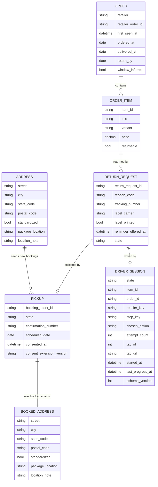
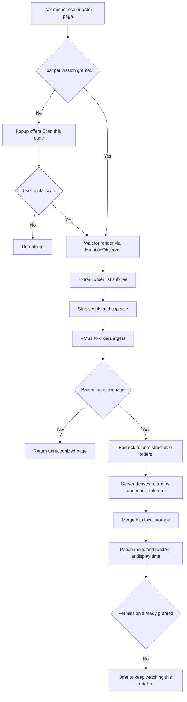
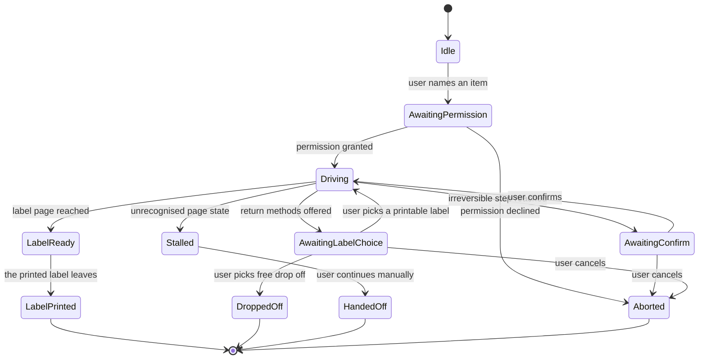
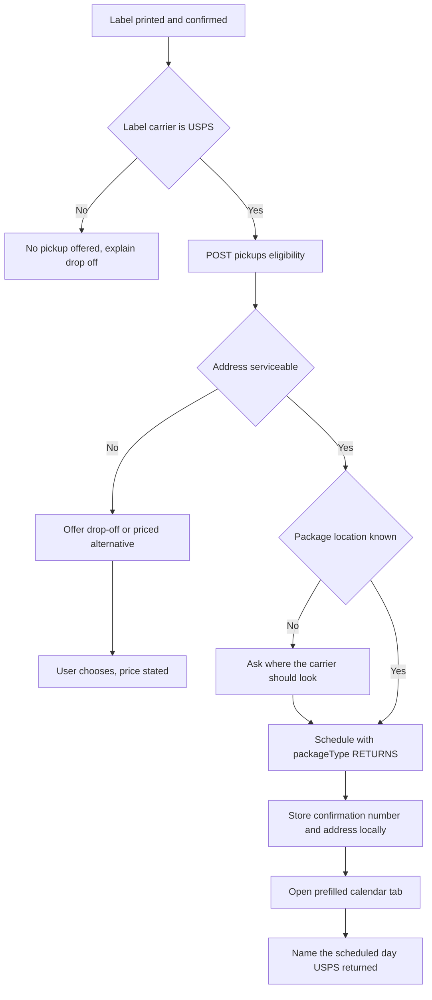
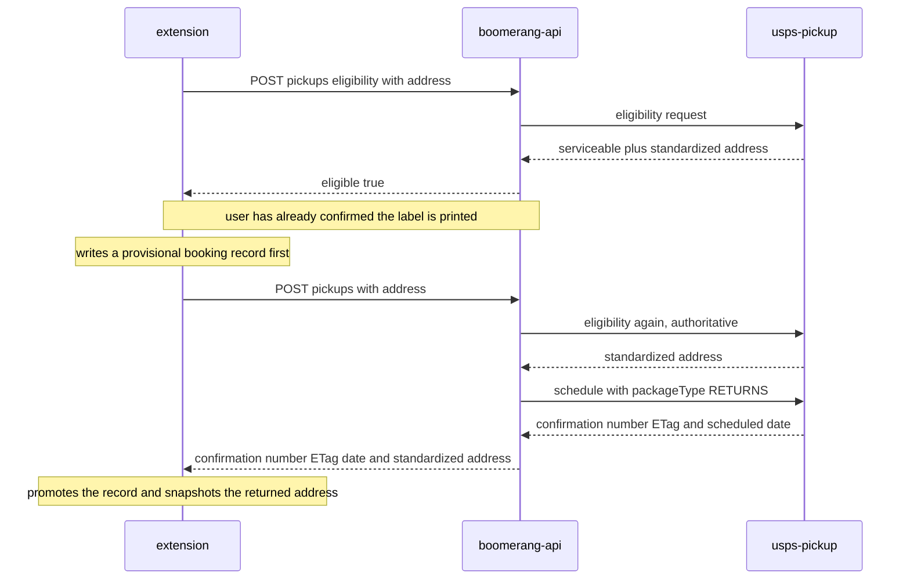
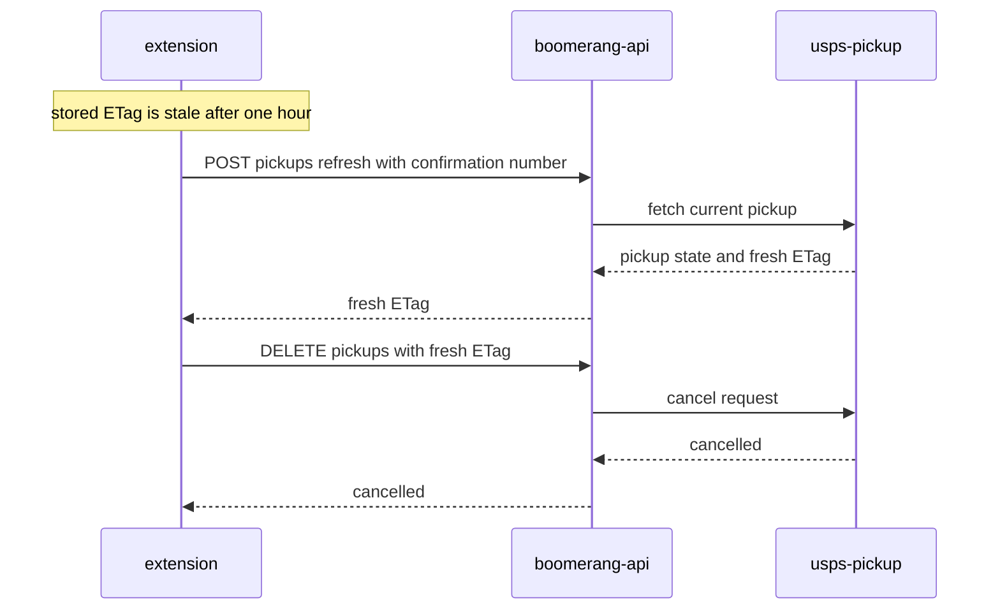
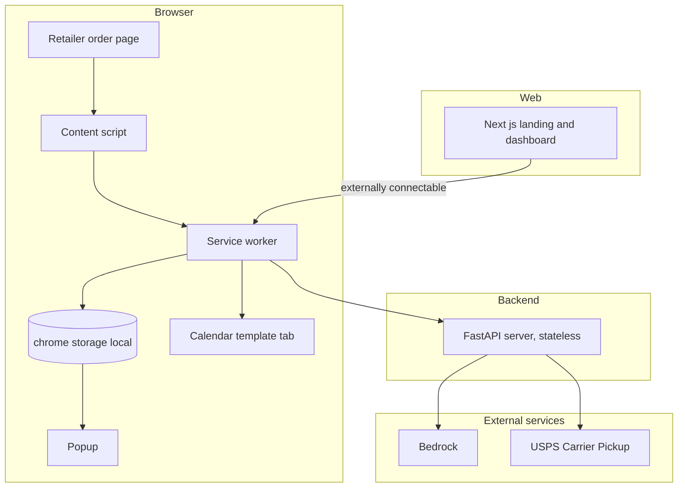

# Boomerang - Requirements

## 1. Overview

Boomerang is a reverse-logistics concierge: a browser extension and a supporting service that
notice what a user bought, track the return window, and on request drive an e-commerce return to
a printed label, book a free USPS Carrier Pickup, and write a calendar reminder.

The system holds **no OAuth grant for any user**. Order data is read from retailer pages the user
is already viewing in their own session. The backend is a stateless broker: it parses, ranks, and
brokers carrier calls, but stores nothing between requests and can never act while the user is
away.

Source material: [`../docs/SKETCH.md`](../docs/SKETCH.md) for the product,
[`../docs/ARCHITECTURE.md`](../docs/ARCHITECTURE.md) for decisions D1 through D7, and
[`../.claude/artifacts/`](../.claude/artifacts/) for the underlying research.

> **Revised 2026-08-27.** Four changes came out of the plan review recorded in
> [`../plan/boomerang-decisions.md`](../plan/boomerang-decisions.md): the client-version header is
> now named normatively in §4.1 (plan decision D16); FR-3.6.3 is out of PoC scope (plan decision D6); `DASHBOARD_ORIGIN` is
> withdrawn from §5.2 as a consequence; and FR-3.4.5b requires a simulated booking to say so (plan decision D22).
> Each amendment is marked where it lands. **`Dn` in these notes means a *plan* decision** — the
> `D1`–`D7` cited above from [`../docs/ARCHITECTURE.md`](../docs/ARCHITECTURE.md) are a separate,
> older series and are never renumbered here.

---

## 2. Core Concepts

### 2.1 Terminology

| Term | Definition |
|------|------------|
| **Reverse logistics** | Everything that happens to a product after the customer decides to send it back, as opposed to the delivery journey |
| **Return window** | The period, typically 30 days from delivery, during which a retailer will accept a return |
| **Urgency** | A derived ranking over orders, computed from days remaining in the return window |
| **Prepaid return label** | A shipping label issued by the retailer with postage already paid |
| **Carrier Pickup** | The free USPS service in which the letter carrier collects a prepaid package during the normal delivery round |
| **Return driver** | The extension component that walks a retailer's return flow in a visible tab, pausing for user confirmation at irreversible steps |
| **Retailer adapter** | The per-retailer knowledge needed to recognise an order page and drive its return flow |
| **Carrier adapter** | The per-carrier implementation of eligibility, schedule, refresh and cancel, which also declares which package locations that carrier can serve |
| **Package location** | Where on the property the carrier should look for the box, expressed in Boomerang's own vocabulary rather than any carrier's field values |
| **Action vocabulary** | The closed set of page actions the return driver is permitted to execute; anything outside it is rejected before it reaches the page |
| **Install** | One installation of the extension in one browser profile, the unit that owns locally stored state |
| **Content script** | JavaScript the extension injects into a page, sharing full access to that page's rendered DOM |
| **Host permission** | An extension's declared right to inject, fetch, or read sensitive tab properties on a given origin |
| **Restricted scope** | Google's highest-sensitivity OAuth classification, triggering verification and an annual third-party security assessment |
| **Limited Use** | The Chrome Web Store policy governing all user data an extension handles, tightened 1 August 2026 |

### 2.2 Entity Relationships

All entities below live in `chrome.storage.local` on the install. The server persists none of them.

There is no `INSTALL` entity. `chrome.storage.local` is already scoped to one extension in one
browser profile, so an install identifier would be a key that nothing reads and no surface can
correlate. `ORDER` is the root of the object graph and `ADDRESS` is a singleton within the store.



Five attributes deserve a note, because each was added to close a specific gap:

- **`window_inferred`** governs presentation as well as provenance: an inferred window SHALL be
  rendered as an approximation with its basis named, never as a bare `return_by` date, in every
  surface — popup, dashboard and calendar reminder alike. See NFR-6.4.
- **`window_inferred`** marks a return window the server derived rather than read from the page, so
  no surface can present a guess as authoritative.
- **`label_carrier`** records which carrier's postage is on the box. Without it a printed UPS label
  is indistinguishable from a printed USPS one, and a USPS carrier will not collect the former.
- **`package_location`** and **`location_note`** hold the user's answer about where the carrier
  should look, in Boomerang's own vocabulary. See FR-3.4.8.
- **`item_id` and `return_request_id` are the two entity keys the store addresses records by**
  (added 2026-08-28, from the sixth low-level design review). Both are **opaque strings generated
  locally by the extension** — there is no server-side identifier to adopt, because the server is
  stateless — and both are **unique within one browser profile's store**, not merely within their
  parent. `item_id` is assigned when an order is first ingested and SHALL be stable across a later
  re-scan of the same order, since `ORDER_ITEM` has no natural key and re-deriving one from a title
  would change identity whenever a retailer reworded a product name. `return_request_id` is assigned
  when a return request is created. **Neither is ever transmitted**: they are store keys, not wire
  fields, which is what keeps them free of any correlation value. They are declared here because
  they are looked up by directly — an item is addressed by `item_id` alone, without its order — and
  a key an implementation is addressed by is part of the entity, not an implementation detail.
  `PICKUP` needs no third key of its own: `booking_intent_id` already exists, is already generated
  locally, and is already written before the schedule call, so it is the pickup's identity from the
  moment the record exists.
- **`PICKUP.state`** and **`PICKUP.booking_intent_id`** carry the booking lifecycle — `Booking`,
  `Confirmed`, `Collected`, `Abandoned` — written before the schedule call rather than after it.
  `confirmation_number` is nullable: a pickup in `Booking` does not have one. FR-3.1.5's eviction
  carve-out and FR-3.4.5's lost-response recovery both need this state to be expressible.
  - **Amended 2026-08-28 (seventh low-level-design review, CONSIST-1 and CONSIST-2).** This note
    previously read `Booking`, `Confirmed`, `Cancelled`, `Collected` — it named a state nothing ever
    writes and omitted one the requirements themselves use. **`Cancelled` is struck**: a successful
    cancel *deletes* the record, because a cancelled pickup and a pickup that was never booked are
    the same fact — no carrier is coming — and a `Cancelled` row would sit in front of every
    unsettled-pickup read, keep pinning its order against eviction, and count in a clear action that
    removes something the user already removed. **`Abandoned` is added**: FR-3.1.5 already requires a
    `Booking` record to move to it after `BOOKING_ABANDONED_AFTER_HOURS`, and FR-3.3.9's own aside
    already enumerates the lifecycle as `Booking`, `Confirmed`, `Collected`, `Abandoned`. The four
    states above are now what every document says, and they are the enumeration that was already
    internally consistent with the rest of this one.
  - **Cancellation is an event, not a state.** What survives a cancel is the `RETURN_REQUEST`, which
    stays at `LabelReady` with its printed label; what disappears is the pickup. The consequence is
    stated rather than left to be found: **nothing reads a history of cancellations**, and at this
    scope nothing needs to.
- **`BOOKED_ADDRESS`** is an immutable snapshot of the address a pickup was booked against, owned by
  the pickup rather than referenced from `ADDRESS`. `ADDRESS` is the editable singleton that seeds
  the *next* booking; it is not the address any existing booking is registered under. See FR-3.4.6.
- **`DRIVER_SESSION`** is the durable record that lets a return survive service worker termination —
  the state, the item and order being returned, the retailer, the step within its adapter, the option
  the user chose, the attempt count, the driven tab ID and URL, and the start and last-progress
  times. See FR-3.3.9. It is separate from `RETURN_REQUEST.state`, which names the state without
  locating the driver within it: the session's own `state` is a mirror written in the same storage
  operation, so a rehydrating driver can check the two agree before trusting either.
  - **Amended 2026-08-28 (seventh low-level-design review, CLASS-2).** This entity previously
    declared five fields — `retailer_key`, `adapter_step_key`, `tab_id`, `tab_url`,
    `last_progress_at` — while FR-3.3.9's own bullet already required "current state" as well, and
    the low-level design persists twelve. Seven were declared in no document: `state`, `item_id`,
    `order_id`, `chosen_option`, `attempt_count`, `started_at` and `schema_version`. They are
    declared here now, because a persisted field whose definition lives only downstream is a field
    two implementations can disagree about with nothing red anywhere.
  - **`adapter_step_key` is renamed `step_key` in the same amendment.** §4.1's `/returns/next-step`
    row already spells the same concept `step_key`, and so does every downstream document; one
    concept carrying two names across a single requirements document is the drift this ERD exists to
    prevent.
  - **`chosen_option` is null on the free-drop-off branch** — a return that never presents a paid
    option never makes a choice. `attempt_count` is bounded by §5.2's `RETURN_ATTEMPT_LIMIT`.
    `schema_version` is what lets a running extension recognise a record written by a version it does
    not understand and rebuild rather than misread it.
  - **`order_id` is the `ORDER` natural key `(retailer, retailer_order_id)` rendered as one
    addressable string, not a second identity.** `ORDER` has no synthetic key and gains none here.
- **`ORDER.first_seen_at`** is set on first insert and **never updated by a revisit merge**. FR-3.1.5
  orders eviction on it, so letting a revisit refresh it would silently reset an order's age and
  make the retention ceiling unenforceable.

`ORDER_ITEM` to `RETURN_REQUEST` is one-to-many, not one-to-one: `Aborted` and `HandedOff` are
terminal, and an item whose first return attempt stopped must still be returnable. At most one
request per item may be non-terminal at a time, and that is the current one.

There is deliberately no stored urgency value; see FR-3.2.2. There is no package count either —
the PoC books one box per pickup, and multi-package pickups are out of scope for v1.

---

## 3. Functional Requirements

### 3.1 Order Ingestion

#### FR-3.1.1 Page recognition

- The extension SHALL recognise a retailer order page by URL pattern and DOM signature before
  attempting extraction.
- The extension SHALL NOT inject on any origin for which it does not hold either a granted host
  permission or an `activeTab` grant arising from a user gesture in the current tab. See FR-3.7.2.
- The extension SHOULD recognise the page without a network round trip, so that an unrecognised
  page costs nothing.

#### FR-3.1.2 Render-stable extraction

- The content script SHALL wait for the order list to finish rendering before extracting, using a
  `MutationObserver` rather than a single read at `document_idle`.
- Retailer order pages are single-page applications; a single timed read WILL flake.
- The content script SHALL extract only the order-list subtree, never the whole document.

#### FR-3.1.3 Payload minimisation — binds every path that sends DOM

This requirement is stated under ingestion because that is where it was first needed, but it
governs **every** transmission of page content off the client, including the return driver's
fallback in FR-3.3.7. Ingestion is not the only egress path, and a minimisation rule that covered
only ingestion would be false advertising in the store listing.

- The extension SHALL cap any transmitted DOM payload at `MAX_INGEST_BYTES` before transmission,
  and SHALL NOT rely on the server to reject an oversized one.
- The extension SHALL strip script tags, style tags, inline event handlers, and data URIs from the
  subtree before sending.
- The extension SHALL NOT transmit cookies, authorization headers, or any credential belonging to
  the retailer session.
- **Ingestion path, absolute.** The extension SHALL NOT transmit the label page or any page reached
  after label generation. Ingestion sends the order-list subtree by construction, so this is
  structural and admits no exception.
- **Fallback path, fail closed.** Before any `POST /returns/next-step` request leaves the client,
  the extension SHALL scan the candidate DOM for tracking-number and postal-address patterns and
  SHALL abort the transmission on a match, surfacing the step as `report_stuck` for the user to
  complete manually.
- The extension SHALL NOT rely on adapter recognition to make this determination. The fallback
  fires precisely when the adapter does not recognise the page, so a check that asks the adapter
  "is this the label page" is unavailable at the moment it is needed.

The two bullets above are deliberately of different strengths, and an earlier version of this
requirement stated only the absolute form. That version could not be met: recognising a label page
is adapter knowledge, and the fallback path is defined by the adapter having failed. A pattern scan
is a heuristic and will miss some layouts. The residual is stated rather than assumed away — a label
page carries the tracking number, the return address, and in some retailer flows the last digits of
a payment instrument, none of which any server-side component needs. Failing closed is the correct
direction: a false positive costs the user one manual step, a false negative costs them that data.

#### FR-3.1.4 Structured extraction

- The server SHALL send the received subtree to Bedrock with a retailer-specific extraction prompt
  and return structured orders.
- The server SHALL NOT persist the raw DOM, the structured result, or any address.
- The server SHALL return `unrecognized-page` when the subtree does not parse as an order page.

#### FR-3.1.5 Local accumulation

- The extension SHALL merge returned orders into `chrome.storage.local`, keyed on retailer plus
  retailer order ID, so that revisiting a page updates rather than duplicates.
- The extension SHALL evict the oldest orders once the configured maximum is exceeded, ordered by
  `first_seen_at`, which SHALL be set on first insert and SHALL NOT be updated by a revisit merge.
- The extension SHALL NOT evict an order carrying a return in a non-terminal state, or a pickup that
  has not been collected or abandoned, regardless of its age (amended 2026-08-28, seventh
  low-level-design review, CONSIST-1: the carve-out previously read "not been cancelled, collected or
  abandoned", and `Cancelled` is not a state a pickup can be in — a cancelled pickup has no record
  at all, so the clause it was in could never be evaluated).
- The extension SHALL move a pickup left in `Booking` to `Abandoned` after
  `BOOKING_ABANDONED_AFTER_HOURS`, and SHALL treat a `Confirmed` pickup as `Collected` once its
  scheduled date is more than `PICKUP_SETTLED_AFTER_DAYS` past. Without both, a pickup that never
  received a confirmation number pins its order against eviction permanently.
- The extension SHALL provide a user-initiated action that clears all locally stored orders.
- The clear action SHALL, when uncancelled pickups exist, enumerate them and offer to cancel them
  before clearing; if the user proceeds regardless, it SHALL display the confirmation numbers and
  scheduled dates first.

The extension holds the only record of a booked pickup — there is no server-side copy and no
`GET /pickups` — so an eviction or a bulk clear that removes the last `confirmationNumber` leaves a
real carrier visit scheduled that the user can no longer cancel through the product. Their remaining
option is USPS by telephone. A retention policy that can do that silently is a defect, not a
housekeeping rule.



### 3.2 Urgency Ranking

#### FR-3.2.1 Window derivation

- The server SHALL derive `return_by` from the delivery date and the retailer's stated policy
  where the page exposes one, and from a configured per-retailer default where it does not.
- The server SHALL mark any derived window as inferred rather than authoritative.

#### FR-3.2.2 Ranking is derived at render, never stored

- The extension SHALL compute days remaining from the stored `return_by` and the current date **at
  the moment of rendering**, and SHALL rank by that value ascending with expired orders last.
- No component SHALL persist a days-remaining value, a countdown, or any other urgency figure.
- The extension SHALL render orders inside the configured critical threshold with distinct visual
  treatment.

A stored countdown is wrong the moment the clock passes midnight, and the popup renders from local
storage without a network call (FR-3.6.1), so nothing would correct it. A user who ingests an order
and opens the popup a week later would be shown the urgency of a week ago — which defeats the one
thing the product exists to do. `return_by` is a fact and does not decay; days remaining is a view
over it.

#### FR-3.2.3 Honest presentation

- All surfaces SHALL present a return window as a prompt to act, never as a guarantee.
- Retailers vary return policy by category, sale status, and membership tier; a derived window is
  frequently wrong at the edges.

### 3.3 Return Driver

The return driver is the highest-risk component in the system. It has no published precedent, no
API, and no fallback other than handing control back to the user.

#### FR-3.3.1 Explicit intent

- The extension SHALL begin a return only on explicit user action naming a specific order item.
- The extension SHALL NOT begin a return as a consequence of ingestion, ranking, or any timer.

#### FR-3.3.2 In-context permission

- The extension SHALL request the host permission for the target retailer at the moment the user
  names it, via `chrome.permissions.request`, and SHALL abort cleanly if declined.
- Retailer origins SHALL be declared in `optional_host_permissions`, never in `host_permissions`.

#### FR-3.3.3 Visible tab, supervised

- The return driver SHALL operate in a foreground tab the user can watch.
- The return driver SHALL pause and require explicit user confirmation before every irreversible
  step, at minimum the reason-code selection and the final submission.
- The return driver SHALL pause and require explicit user confirmation before executing **any**
  model-proposed action, whether or not the step is known to be irreversible.
- The return driver SHALL NOT complete a return without at least one user confirmation.
- On any unrecognised state, the driver SHALL stop, leave the tab open at the current step, and
  tell the user to continue manually.

Irreversibility is adapter-configured knowledge, held per retailer alongside the selectors. On an
adapter miss the driver by definition has no configured knowledge of the step in front of it — which
is precisely when the model is proposing the action. Confirming only at *known* irreversible steps
would therefore leave the guarantee weakest exactly where the model has the most control. A miss
means the driver does not know where it is, and the correct response to not knowing where you are
is to ask.

#### FR-3.3.4 Present the label choice with its price; do not choose

- Where the retailer offers a choice of return methods, the return driver SHALL **stop and present
  every option it can see, each with its cost stated**, and SHALL NOT select one on the user's
  behalf.
- The driver SHALL state plainly which options are compatible with a home pickup and which are not.
- Where a price cannot be read, the driver SHALL present that option with its price marked
  **unknown** rather than omitting the option or presenting it as free, and SHALL NOT select any
  option on the user's behalf while any price in the set is unknown.
- The extension SHALL treat an unreadable price as an adapter-health signal in the sense of
  FR-3.7.3, since a retailer whose prices stop being readable has changed its flow.
- Choosing a free QR-code drop-off SHALL be treated as a **successful return**, not a failure. It
  terminates the flow at `DroppedOff` without a pickup.
- `qr-only` is therefore not an error condition. It is removed from the error vocabulary in §4.2.

The reason this is not an automatic selection: on Amazon the printable label is frequently the
*paid* option, deducted from the refund, while the QR-code drop-off is free. A driver that silently
selects "printable" to satisfy a pickup precondition would be spending the user's money to reach a
convenience the user never asked for — a direct violation of §6.2's rule against silent escalation,
and worse than the paid-shipping case because the user never sees a price at all.

#### FR-3.3.5 Record which carrier's postage is on the box

- The extension SHALL record `label_carrier` on the `RETURN_REQUEST` when a label is generated.
- The system SHALL NOT offer or schedule a USPS Carrier Pickup for a label whose `label_carrier` is
  not USPS.

- The extension SHALL derive `label_carrier`, in order of preference, from: the return method the
  user selected under FR-3.3.4; adapter-configured recognition performed on the label page **in the
  browser**; or an explicit question to the user.
- The extension SHALL NOT default `label_carrier` to USPS when it cannot be determined, and SHALL
  NOT schedule a pickup in that case.

FR-3.1.3 forbids *transmitting* the label page, not reading it locally, which is what makes
client-side recognition available as a source. Defaulting to USPS on an undetermined carrier would
manufacture the exact silent failure this field exists to prevent.

A printed label is not sufficient for a USPS pickup — the postage must be **USPS** postage. The
letter carrier collecting the box is collecting mail; a prepaid UPS label is not mail and will not
be picked up. Without this field the system cannot tell the two apart, and the failure is silent:
the pickup books successfully, the user leaves the box out, and nobody comes. That is the worst
available failure mode, because the user only discovers it after the return window closes.

#### FR-3.3.6 Print confirmation

- The extension SHALL record `label_printed` only after the user affirms the label was printed.
- The system SHALL NOT infer printing from the label page being reached, a download completing, or
  a print dialog opening.
- The affirmation SHALL write the field and SHALL NOT move the request out of `LabelReady`. Reaching
  `LabelPrinted` is FR-3.3.9's separate question of whether the box has gone; a user who prints a
  label and then does nothing with it has a return that is ready, not one that is finished.

#### FR-3.3.7 Selector-first driving, model only on a miss

- The return driver SHALL attempt each step from the retailer adapter's configured selectors first.
- The driver SHALL call `POST /returns/next-step` **only** when the adapter has no selector for the
  current state, or its selector does not match. It is a fallback, not a per-step call.
- Every such call SHALL obey FR-3.1.3, including the prohibition on transmitting the label page.
- The rate at which the adapter misses SHALL be recorded as an operational metric. A rising miss
  rate is the early signal that a retailer changed its flow, and it is the only such signal the
  system has.

Calling a model at every step would send the entire return flow — including pages carrying the
tracking number and return address — to a server whose stated contract is that it receives only an
order-list subtree. Selector-first keeps the common path entirely on the client and makes model
egress the exception rather than the norm.

#### FR-3.3.8 Closed action vocabulary, structurally enforced

- Every Bedrock call SHALL use tool calling with a forced tool choice. No component SHALL parse
  free-form model text into an action, anywhere in the system.
- The model SHALL be able to express only these actions: `click`, `select_option`, `fill`,
  `pause_for_user`, `report_stuck`.
- The extension SHALL validate every returned action against that vocabulary **before** executing
  it, and SHALL treat a malformed or out-of-vocabulary action as equivalent to `report_stuck`.
- `fill` SHALL NOT be permitted to target a password, payment, or file-upload input.

This is a security control, not an ergonomic one. The model is reasoning over DOM fetched from a
third-party page, which is attacker-influenced input; a page can contain text engineered to steer
it. A closed vocabulary validated client-side means the worst a successful injection achieves is a
wrong click on a page the user is already watching — it cannot invent a navigation, an exfiltration,
or a form submission that the vocabulary has no way to express.

Two honest limits: this constrains the *form* of an action, not its correctness, so the human
confirmation in FR-3.3.3 remains load-bearing; and it does nothing to reduce what is *sent* to the
model, which is FR-3.1.3's job.

#### FR-3.3.9 Return state machine



`DroppedOff` is a success terminal. `AwaitingLabelChoice` is where the user's money is at stake and
is the one state the driver may never pass through unattended.

**This machine has exactly the four terminals named above, and nothing downstream may add a
fifth.** A `PICKUP` is a separate entity with a lifecycle of its own — `Booking`, `Confirmed`,
`Collected`, `Abandoned` — and it runs *alongside* this machine rather than inside it. Scheduling a
pickup is not a transition; cancelling one is not a transition. The two records meet at exactly one
point, `LabelReady --> LabelPrinted`, and a design that invents a `Done`, a `Cancelled` or a
`Collected` on this machine has put two lifecycles into one field.

**`LabelPrinted` is reached when the printed label leaves, not when it is printed, and this is an
amendment to an earlier version of this requirement.** That version transitioned on the FR-3.3.6
affirmation, which made the request terminal the moment the user said they had printed — before any
pickup could be scheduled against it. That could not be reconciled with FR-3.4.5a and FR-3.4.6,
which both place the request at `LabelReady` while a pickup exists and require it to be
**non-terminal** there, for a reason those requirements state: a terminal request stops protecting
its order from eviction while the return window is still running. The two are separated as follows,
and the separation is the whole of the fix:

- **`label_printed` is a field, and the FR-3.3.6 affirmation writes it.** The request stays at
  `LabelReady`. This is what FR-3.4.4's schedule precondition reads.
- **`LabelPrinted` is a state, and the box leaving is what reaches it** — a scheduled pickup
  observed collected, or the user reporting they dropped the box off or handed it over. At that
  point the return has completed by the route its printed label was for, and being terminal is
  correct: there is nothing left to drop off and no window left to protect.

An affirmed print is therefore a return that is *ready* to complete, not one that has.

- The extension SHALL persist a `DRIVER_SESSION` — **every field §2.2's ERD declares for it** —
  into `chrome.storage.local` on **every** transition, before acting on that transition. The ERD is
  the list; this sentence is not a subset of it (amended 2026-08-28, seventh low-level-design
  review, CLASS-2: the prose previously enumerated six of the entity's fields, which read as the
  whole record and was the reason seven more went undeclared).
- The extension SHALL validate a rehydrated `tab_id` against the stored `tab_url` before resuming.
  A tab ID alone is not sufficient: IDs are reused after a tab closes.
- The extension SHALL reconstruct the session from that record and the driven tab's current URL when
  the service worker restarts, and SHALL NOT hold session state only in service worker memory.
- The extension SHALL move a session to `Stalled` when the persisted record cannot be reconciled with
  the tab — the tab is gone, or has navigated somewhere the adapter does not recognise.
- The extension SHALL NOT resume a session unattended after a restart. `AwaitingConfirm`,
  `AwaitingPermission` and `AwaitingLabelChoice` are human-blocking states, and the states most
  likely to be occupied when the worker is terminated.

`AwaitingConfirm`, `AwaitingPermission` and `AwaitingLabelChoice` all wait on a person. MV3
terminates an idle service worker after roughly thirty seconds, which is far less time than a user
takes to read a confirmation prompt — so termination mid-return is the normal case, not the edge
case. A `runtime.connect` port between the popup and the worker extends the worker's life while the
popup is open and is worth having, but it is an optimisation: the persisted record is what makes
the flow correct.

#### FR-3.3.10 One active return per item

- The extension SHALL NOT start a return for an item that already has a return request in a
  non-terminal state. `LabelPrinted`, `DroppedOff`, `HandedOff` and `Aborted` are terminal; every
  other state of FR-3.3.9 is not.
- The extension SHALL offer to resume the existing return instead, naming the state it is in.
- The extension SHALL permit a new return for an item whose previous request reached a terminal
  state, and SHALL retain the terminal request rather than overwriting it.

Two drivers on one item is the failure this prevents, and it is not hypothetical: a user who starts
a return, gets interrupted at `AwaitingConfirm`, and comes back through the popup an hour later has
no way to tell that the first flow is still live. Both would drive the retailer's flow, and the
retailer would issue two labels for one item — one of which is wasted, and neither of which the
user can tell apart. The rule is checked against the item, not the tab, because the first flow may
have no tab left; FR-3.3.9's persisted session is what makes a non-terminal request observable
after the worker that created it is gone.

### 3.4 Carrier Pickup

#### FR-3.4.1 Eligibility is a hard gate

- The server SHALL call USPS eligibility before every schedule call, without exception.
- The server SHALL NOT cache an eligibility result across addresses or reuse a prior result.
- The server SHALL return `address-not-serviceable` when eligibility fails.
- **A negative eligibility answer is a successful response, not an error.** The eligibility endpoint
  SHALL return its normal result body carrying an explicit negative and the `address-not-serviceable`
  reason. The error shape of §4.2 SHALL be used only where a caller asked for something that could
  not be done — a schedule attempted against an address eligibility has refused. One endpoint SHALL
  NOT return two different body shapes under the same status code.

#### FR-3.4.2 Graceful second answer

- On ineligibility the extension SHALL state plainly that free carrier pickup is unavailable at
  this address, SHALL confirm the return itself remains valid, and SHALL direct the user to the
  retailer's own drop-off information on the page they are already viewing.
- The system SHALL NOT silently escalate to any paid option.
- The system SHALL NOT claim to source drop-off locations. No component produces them: there is no
  locations API in the carrier broker and no endpoint for one.

*Narrowed.* This requirement previously called for "the nearest drop-off location, or a priced
alternative with the price stated." Neither was deliverable. Locations have no source anywhere in
the design, and paid pickup products are out of scope in §7 of this document — so the requirement
contradicted the scope boundary drawn a few pages later, and the high-level design inherited the
contradiction into its failure table. Sourcing locations is recorded as deferred rather than
silently dropped.

#### FR-3.4.3 Standardized address

- The server SHALL use the standardized address returned by the eligibility call for the schedule
  call, not the string the user typed.

#### FR-3.4.4 Label precondition

- The server SHALL reject a schedule request carrying `label_printed` false, with a `reason` the
  extension can act on.
- The server SHALL reject a schedule request whose `label_carrier` is not USPS, with
  `wrong-carrier-label`.
- Both are **client-integrity checks**, not enforcement against a hostile caller. They catch our own
  client's bugs, a stale build, and malformed requests. They SHALL NOT be described as guarantees.

`label_printed` and `label_carrier` arrive in the request body from the same caller whose honesty
they are meant to check, and the server holds no state that could corroborate either. NFR-6.5's CORS
allowlist is already conceded to be forgeable by any non-browser caller, so the two claims cannot
both stand. The residual is worth stating plainly: a forged request can book a real USPS carrier
visit to a real address for a box that has no postage on it. Nothing in this design detects that,
and the reserved concurrency limit of NFR-6.7 is the only bound on how often it can happen.

#### FR-3.4.5 Schedule parameters

- The server SHALL set `packageType` to `RETURNS` and `nextAvailablePickup` to true, so an
  unserviceable day rolls forward rather than failing.
- The server SHALL send a package location, mapped by the carrier adapter from the neutral value
  stored on `ADDRESS`. See FR-3.4.8.
- The server SHALL return the `confirmationNumber`, the `ETag`, **the scheduled date USPS
  assigned**, and **the standardized address it submitted** to the extension in the schedule
  response. The date is required by FR-3.4.7 and cannot be predicted client-side; the address is
  required by FR-3.4.6 and is produced server-side, so the client has no other source for it.

#### FR-3.4.5a Eligibility is not a reservation

- The extension SHALL treat a positive eligibility result as advisory and the schedule call as the
  only authority. An offer that was eligible when presented MAY be refused at schedule time.
- On such a refusal the extension SHALL leave the return at `LabelReady`, SHALL NOT create or retain
  a `PICKUP` record, and SHALL tell the user the label remains valid for drop-off.

#### FR-3.4.5b Simulated bookings SHALL disclose themselves

*Added 2026-08-27 (plan decision D22).*

- When the server is configured with a carrier adapter that does not contact a carrier, the
  confirmation numbers it returns SHALL carry a fixed, recognisable prefix, published alongside the
  wire contracts so both sides agree on it.
- The extension SHALL detect that prefix and SHALL render, next to every affected confirmation
  number, a marker stating that the booking is simulated and no carrier was contacted.
- The extension SHALL make that determination **from the confirmation number**, not from its build
  environment or its server URL. A production bundle pointed at a mock-configured server is exactly
  the case the marker exists for, and an environment check is blind to it.

A fabricated confirmation number that looks real is the one failure in this system a user cannot
detect and cannot recover from: they stop tracking the parcel, no carrier arrives, and the return
window closes. The prefix costs nothing and makes the failure self-evident.

#### FR-3.4.6 Cancellation path

- The extension SHALL store the `confirmationNumber` and an **immutable snapshot** of the
  standardized address it was booked against, held on the `PICKUP` rather than as a reference to the
  editable `ADDRESS` singleton.
- The extension SHALL write that snapshot from the standardized address returned by the schedule
  response, and SHALL NOT write it from its own copy of the address. The address USPS is given is
  produced by the schedule-time eligibility call and is never seen by the client until the response
  carries it back.
- The extension SHALL write a provisional record before the schedule call — state `Booking`, a local
  `booking_intent_id`, its own best-known address, `standardized` false — and SHALL promote it on
  response. **This identifier is not the `request_id` of §4.2.** That one is the server's opaque
  per-request correlator, which by its own rule correlates nothing across requests; this one is a
  client-generated key that has to survive at least the schedule call and its response, and reusing
  the name for both would make the §4.2 rule read as though it had been broken.
  A record left with `standardized` false SHALL require user confirmation before a refresh or a
  cancel is attempted against it.
- The extension SHALL NOT overwrite that snapshot when the user later edits their address. Editing
  the address changes where the next pickup is booked; it SHALL NOT change what an existing booking
  is registered under.
- The extension SHALL NOT rely on a stored `ETag` for later cancellation. The ETag is valid for
  one hour or one use; a cancellation a day later SHALL refresh the pickup to obtain a current
  ETag, then cancel.
- Cancelling a pickup SHALL leave its `RETURN_REQUEST` at `LabelReady` and SHALL NOT move it to a
  terminal state. The label is printed and the box is real; the return can still complete by
  drop-off or by a second pickup. Terminating it would drop the item out of the ranked list while
  its return window is still running.
- Where a refresh instead reveals that the carrier has already collected the box, the extension
  SHALL move the `RETURN_REQUEST` to `LabelPrinted` and SHALL NOT attempt a cancel. This is the one
  transition a pickup causes on the return machine, and it is the FR-3.3.9 edge for the box having
  left: the label was printed, it went with the parcel, and there is no further step the user can
  take. Leaving the request at `LabelReady` would keep offering a drop-off for something already in
  the mail stream.
- The server SHALL expose refresh and cancel operations that accept the confirmation number and
  address supplied by the caller.

#### FR-3.4.7 Copy constraint

- All user-facing copy SHALL describe collection as **a day, never a time window**, and SHALL NOT
  present it as a guarantee. This is the invariant; it is not negotiable.
- Copy SHALL name the day by rendering the `scheduled_date` USPS returned, not by assuming it.
- Free Carrier Pickup happens on the normal delivery round, Monday through Saturday. The guaranteed
  two-hour window is a separate paid product and is out of scope.

The previously mandated literal phrasing "with tomorrow's mail delivery" was wrong at three edges
and is withdrawn. Same-day requests submitted before 2:00 AM Central are collected **today**;
Sundays and holidays roll the date forward, so a Saturday evening booking is Monday; and
`nextAvailablePickup` may itself roll past an unserviceable day. USPS tells us the answer in the
schedule response — the requirement is to render what it said, not to guess.

#### FR-3.4.8 Package location

- The system SHALL collect a package location from the user before the first pickup and store it on
  `ADDRESS`, reusing it silently thereafter with an edit control available.
- The stored value SHALL use Boomerang's own neutral vocabulary: `front_door`, `back_door`,
  `side_door`, `knock_or_ring`, `mailbox`, `reception`, or `other`. `other` SHALL require a
  `location_note`.
- Each carrier adapter SHALL map the neutral value to its own wire format and SHALL declare which
  neutral values it cannot serve.
- Where the active carrier cannot serve the stored value, the system SHALL re-ask with the reduced
  set and SHALL NOT substitute a different location.

Storing the carrier's own field value here would be a mistake with a delivery date. USPS accepts
roughly nine values; FedEx's equivalent field is a four-value enum; UPS takes free text alongside
floor and room. The same user answer has three wire representations, and **`mailbox` is not
portable at all** — under 18 U.S.C. § 1725 only the Postal Service may place items in a mailbox, so
a UPS or FedEx driver cannot honour it whatever the API accepts. Since UPS is already a planned
fast-follow (§7), a USPS-shaped value in storage is a migration waiting to happen.

Substituting silently is the same failure as a silent price escalation: the user answers a question
about their own property, and the system quietly does something else with a real package.



### 3.5 Calendar Reminder

#### FR-3.5.1 Prefilled template URL

- The extension SHALL open a prefilled Google Calendar template URL at
  `calendar.google.com/calendar/render` with `action=TEMPLATE`, populating `text`, `dates`, `ctz`,
  `details`, and `location`.
- The extension SHALL open it with `chrome.tabs.create`, which requires no host permission,
  because host permissions gate injection and fetch rather than navigation.
- The `details` and `location` parameters SHALL carry only what the reminder needs — the retailer
  name, the item, and the collection address — and SHALL NOT carry order identifiers, prices, or
  the tracking number.

**What this sends to Google, stated plainly.** Boomerang requests no Google scope and receives no
Google data, but opening this URL transmits its query string to Google, including the item
description and the user's home address. That is inherent to a prefilled template and is the
mechanism the user is consenting to when they click Save. It is nonetheless an egress of user data
to a third party and is recorded as one in the high-level design's data-protection table, rather
than being obscured by the true-but-incomplete claim that no Google data is held.

#### FR-3.5.2 No Google credentials

- The system SHALL NOT request any Google OAuth scope, including Calendar scopes.
- The user's review-and-save click is both the write mechanism and the consent moment.

#### FR-3.5.3 Fallback

- The extension SHALL offer a downloadable `.ics` file for users not on Google Calendar, generated
  locally from the same fields as the template URL. It SHALL require no network call, no scope and
  no third party.
- The extension SHALL offer the `.ics` download in place of the template URL when
  `chrome.tabs.create` fails.

#### FR-3.5.5 Record the offer, never the reminder

- The extension SHALL record `reminder_offered_at` on the `RETURN_REQUEST` when it opens the
  template URL or produces the `.ics` file, and SHALL NOT record, display or reason about a
  reminder *existing*.
- No surface SHALL state that the user will be reminded. Copy SHALL describe what was offered.
- The extension SHALL re-offer the reminder whenever the user reopens a pickup that has one offered
  but no evidence of a return visit, because offering twice is cheap and a reminder wrongly assumed
  to exist surfaces as a box left indoors on collection day.

There is no callback, no scope and no read path, so whether the user pressed Save is unknowable to
the system by design. The record therefore states the only thing that is true.

#### FR-3.5.4 No availability reading

- The system SHALL propose a pickup day derived from carrier availability and SHALL NOT attempt to
  determine when the user is free.
- Reading Calendar has no scope-free mechanism, and its DOM would be the most fragile surface in
  the product. The user sees the proposed block rendered in their own calendar and spots conflicts
  faster than any parser could.

### 3.6 User Surfaces

#### FR-3.6.1 Extension popup

- The popup SHALL be the primary surface, rendering the urgency-ranked order list and the action
  that starts a return.
- The popup SHALL render from local storage and SHALL NOT require a network call to display.

#### FR-3.6.2 Landing page and install funnel

- The client SHALL provide a landing page explaining the product and routing to the Chrome Web
  Store listing, with an optional email subscribe.
- The funnel SHALL be `landing` then `subscribe` then `install`. There SHALL be no signup, no
  OAuth, and no account creation, because there is no grant to obtain.
- Landing page claims about what leaves the browser SHALL match the Chrome Web Store disclosure
  exactly.

#### FR-3.6.3 Dashboard

> **Out of PoC scope as of 2026-08-27 (plan decision D6).** This requirement is neither withdrawn nor
> planned. It is the only requirement that forces `externally_connectable` into the manifest, and
> that key widens the extension's attack surface and its Web Store permission disclosure for a
> surface the PoC demo never opens — the popup already renders the ranked list FR-3.6.1 requires.
> The production dashboard origin it depends on also does not exist yet, and
> `externally_connectable.matches` rejects a bare wildcard, so the key could not be filled in
> honestly even if it were declared. The implementation plan carries FR-3.6.3 as one of its two
> declared traceability gaps, and the manifest test in the plan's Task 1.2 asserts
> `externally_connectable` is **absent** so the cut cannot decay into an oversight. Reinstating it
> requires the manifest key, an `on_external` handler, the enumerated read-only message subset
> below, `DASHBOARD_ORIGIN` restored to §5.2, and the origin decided — recorded in the plan at Task
> 5.6. Everything below stands unchanged for whoever does that.

- The dashboard SHALL render the same ranked order list on a larger canvas.
- Because the server is stateless, the dashboard SHALL obtain orders from the extension via
  `externally_connectable` messaging from the page to the extension, not from a server endpoint.
- The dashboard SHALL degrade to an install prompt when the extension is absent.
- The client SHALL NOT cache order contents in its own storage.
- The dashboard SHALL be served from a fixed production origin, listed with the local development
  origin in the extension's `externally_connectable.matches`.
- The dashboard origin SHALL NOT host third-party scripts, including the email capture form of
  FR-3.6.2, which SHALL be served from a separate marketing origin that is **not** listed in
  `externally_connectable.matches`.
- The extension SHALL expose an enumerated set of messages to the dashboard origin, limited to the
  ranked order list the dashboard renders. It SHALL NOT expose a general-purpose read of local
  storage.

`externally_connectable` is granted to an origin, not to a page: every script that origin loads can
message the extension. A third-party embed on the dashboard origin would therefore give that vendor
— or anyone who compromises their CDN — read access to the user's entire order history.

`externally_connectable.matches` accepts only concrete host patterns — a bare wildcard is rejected
at load — so the production hostname is a decision that must be made before the extension can be
packaged, not after. It is recorded as an open question.

### 3.7 Extension Permissions

#### FR-3.7.1 Minimal manifest

- The manifest SHALL declare `activeTab`, `scripting`, and `storage`.
- The manifest SHALL NOT declare `<all_urls>` or any broad host pattern. Broad host permissions
  trigger in-depth Chrome Web Store review and frequently a return for revision.
- The manifest SHALL pin a generated public `key`, so the extension ID is identical when loaded
  unpacked, built in CI, and published. The corresponding private key is a secret and SHALL NOT
  enter the repository.

`storage` is not optional: every entity in §2.2 lives in `chrome.storage.local`. An earlier version
of this requirement said "`activeTab` and `scripting` only", which forbade the permission the entire
data model depends on.

The pinned `key` exists because the Function URL's CORS policy allowlists exactly one
`chrome-extension://` origin (§6.5). Without a pinned key that origin differs between every
developer's unpacked load and the published build, so the allowlist could not be written at all.

#### FR-3.7.2 Two-tier permission acquisition

- Retailer origins SHALL live in `optional_host_permissions`, never in `host_permissions`.
- On first use the extension SHALL offer an explicit **"Scan this page"** action in the popup. The
  user's click activates `activeTab` for that tab, which is sufficient for a one-off extraction.
- After a successful scan the extension SHALL offer to keep watching that retailer, and only then
  call `chrome.permissions.request`. On grant it SHALL call
  `chrome.scripting.registerContentScripts` to enable automatic ingestion thereafter.
- The extension SHALL remain fully functional in scan-on-click mode if the user declines.

Without this, the product cannot start. `activeTab` grants access only in response to a user
gesture in the current tab — it does not permit injection on page load — so an extension holding
`activeTab` alone can never ingest automatically, and one holding no host permission has nothing to
escalate *from*. The first scan has to be user-initiated, and the grant has to be offered after the
user has seen the extension do something useful rather than before.

#### FR-3.7.3 Disclosure

- The listing SHALL prominently disclose that page content is transmitted to a backend for model
  parsing. Comparable order-reading extensions advertise local-only operation; Boomerang differs
  and SHALL say so rather than let a reviewer discover it.
- The listing SHALL disclose that a fallback request additionally carries the retailer key, the
  adapter step key, and a per-session count of steps driven, so that adapter breakage is detectable.
- The system SHALL NOT attach an install identifier, a session identifier, or any other correlator
  to that data. It SHALL be aggregated in the clear and SHALL NOT be reusable to link two requests
  to one user, per NFR-6.2.

---

## 4. API Requirements

### 4.1 Endpoints

The server is stateless. Every request carries what it needs; no endpoint reads prior state.

| Method | Endpoint | Description |
|--------|----------|-------------|
| GET | `/health` | Liveness probe |
| POST | `/orders/ingest` | Order-list subtree in, ranked structured orders out. Nothing stored |
| POST | `/returns/next-step` | **Fallback only.** Called when the retailer adapter has no matching selector. Current step's DOM plus `retailer_key`, `step_key` and `steps_driven` in; one validated action out |
| POST | `/pickups/eligibility` | Address in, serviceability and standardized address out |
| POST | `/pickups` | Schedule a pickup. Returns confirmation number, ETag, the scheduled date USPS assigned, and the standardized address USPS was given |
| POST | `/pickups/{confirmation_number}/refresh` | Current pickup state and a fresh ETag |
| DELETE | `/pickups/{confirmation_number}` | Cancel, using a freshly obtained ETag |

No `GET /orders` exists. The order working set lives on the install.

**Every request SHALL carry the header `X-Boomerang-Client-Version`**, spelled exactly that way, on
every endpoint including `/health`. Its value is the extension's manifest version. It is the field
`MIN_CLIENT_VERSION` (§5.1) compares against to raise `client-too-old`, and the field a released
version's bug is traced by. A request whose version header is absent, empty, or spelled any other
way SHALL be treated as absent and rejected by the same gate — HTTP header names are
case-insensitive, but a differently *worded* header is a different header, and a server that
tolerated `X-Client-Version` as a synonym would silently serve an ungated client.

*Amended 2026-08-27 (plan decision D16).* The header was described in the low-level design and used by
three tasks in the implementation plan, but no document ever spelled it, so each side was free to
invent a name and the version gate would have failed open in exactly the case it exists for. Naming
it here makes it citable, and Task 10.2's sweep can then check that the two workspaces spell it the
same way.

### 4.2 Error shape

Every non-success response SHALL use one shape, because the agent has to say something useful to
a person:

```jsonc
{
  "reason": "kebab-case-code",
  "message": "One sentence a human can act on.",
  "request_id": "opaque identifier for this request",
  "details": {}
}
```

`details` is **optional and defaults to absent**. It exists for the one case where telling the user
what went wrong is not enough to let them act: `location-not-serviceable` carries the reduced set of
package locations the carrier will honour, because FR-3.4.8 forbids substituting one on the user's
behalf and a re-ask needs the list. A reason code that adds a `details` payload SHALL say so in the
table below; every other reason SHALL omit the key entirely rather than send it empty. Clients SHALL
tolerate an unrecognised `details` shape the same way they tolerate an unrecognised `reason` — the
three required fields are the contract, and `details` is an extension point with one occupant.

| `reason` | Meaning |
|---|---|
| `unrecognized-page` | DOM did not parse as an order page |
| `wrong-carrier-label` | The printed label is not USPS postage, so no USPS pickup is possible |
| `address-not-serviceable` | USPS pickup unavailable at this address. On the eligibility endpoint this is **a successful negative answer**, not an error — see FR-3.4.1; as an error shape it appears only when a schedule was attempted anyway |
| `location-not-serviceable` | The stored package location cannot be honoured by this carrier. **Carries `details.servable_locations`** — the reduced set to re-ask from |
| `etag-expired` | Refresh the pickup before amending or cancelling |
| `upstream-unavailable` | USPS or Bedrock failed; safe to retry |
| `payload-too-large` | DOM payload exceeded the configured ceiling |
| `label-not-printed` | The box has no printed label yet, so a pickup cannot be scheduled |
| `client-too-old` | The installed extension predates a required API change; updating fixes it |

A bare status code is insufficient; user interface branches on `reason`.

**Every response SHALL carry a `request_id`, and it SHALL appear in three places.** The server
generates it (or adopts the Lambda request ID), returns it on success and failure alike, writes it
on every log line for that request, and the extension shows it in failure copy as a short reference
line — *"reference: <id>"* — rather than burying it in a console.

This is necessary rather than tidy. NFR-6.1 forbids logging order contents, item titles, addresses
and confirmation numbers at any level, which is correct and which removes every informal way a log
line was going to be tied back to a user's report. Without an explicit identifier, a user saying
"it failed on my J.Crew order this morning" is unmatchable against a log that, by design, contains
no retailer, no item and no address. The `request_id` is the one correlator that carries no user
data, which is exactly why it is the one that survives the logging ban.

The identifier SHALL be opaque and SHALL NOT encode anything about the request. It is not a session
identifier: nothing correlates two requests from the same install, and nothing should.

`qr-only` was removed. Under FR-3.3.4 a QR-code drop-off is a successful return, not a failure, so
representing it as an error was wrong.

### 4.3 Pickup scheduling sequence



### 4.4 Cancellation sequence



---

## 5. Configuration Parameters

### 5.1 Server configuration

| Parameter | Description | Default |
|-----------|-------------|---------|
| `ENVIRONMENT` | `dev` or `prod`; scopes SSM paths and selects the USPS base URL | none, required |
| `CARRIER_ADAPTER` | Which carrier adapter the server constructs at startup: `mock` or `usps`. This is the parameter the two USPS credentials are conditionally required *by* | `mock` |
| `BEDROCK_MODEL` | **Regional inference profile** identifier, not a bare model ID; a bare ID fails at invoke | **none, required** |
| `BEDROCK_MODEL_PARSE` | Optional per-call-site override for the ingest parse | falls back to `BEDROCK_MODEL` |
| `BEDROCK_MODEL_ACTION` | Optional per-call-site override for the driver fallback, which has the tighter budget of NFR-6.4 | falls back to `BEDROCK_MODEL` |
| `AWS_REGION` | Region hosting the configured inference profile | `us-east-1` |
| `USPS_CLIENT_ID` | Application client ID for USPS OAuth. **Read from Parameter Store, not the environment** | none; required when the USPS adapter is selected |
| `USPS_CLIENT_SECRET` | Application client secret. **Read from Parameter Store, not the environment** | none; required when the USPS adapter is selected |
| `USPS_BASE_URL` | Swap for sandbox; sandbox takes the same credentials | `https://apis.usps.com` |
| `MAX_INGEST_BYTES` | Ceiling on an accepted DOM payload | `262144` |
| `BEDROCK_MAX_TOKENS` | Output ceiling per model call | `4096` |
| `LOG_LEVEL` | Structured log level | `INFO` |
| `BEDROCK_TIMEOUT_PARSE_MS` | Deadline on a single Bedrock invoke at the **order-parse** call site; exceeding it raises `upstream-unavailable` | `9000` |
| `BEDROCK_TIMEOUT_ACTION_MS` | Deadline on a single Bedrock invoke at the **action-fallback** call site; exceeding it raises `upstream-unavailable` | `4500` |
| `USPS_TIMEOUT_MS` | Deadline on a single USPS call; exceeding it raises `upstream-unavailable` | `8000` |
| `MIN_CLIENT_VERSION` | Lowest extension version the server will serve; below it, `client-too-old` | `0.1.0` |
| `MOCK_CONFIRMATION_PREFIX` | Fixed prefix on every confirmation number the mock carrier adapter returns, so a simulated booking is recognisable from the number alone, per FR-3.4.5b. Not configurable per deployment — it is a constant published with the wire contracts, listed here because it is a named value both workspaces read | `SIM-` |
| `FUNCTION_TIMEOUT_MS` | The function's own timeout, supplied by the infrastructure from the same value it gives the function. Every upstream deadline above SHALL validate as below it | `60000` |

### 5.2 Extension configuration

| Parameter | Description | Default |
|-----------|-------------|---------|
| `API_BASE_URL` | Server origin | `http://localhost:8000` |
| `MAX_INGEST_BYTES` | Client-side ceiling on any transmitted DOM payload | `262144` |
| `INGEST_DEBOUNCE_MS` | Quiet period after the last mutation before extracting | `800` |
| `URGENCY_CRITICAL_DAYS` | Days remaining at which an order is styled critical | `3` |
| `URGENCY_WARN_DAYS` | Days remaining at which an order is styled warning | `7` |
| `MAX_STORED_ORDERS` | Local retention ceiling before oldest-first eviction, ordered by `first_seen_at` | `200` |
| `PICKUP_SETTLED_AFTER_DAYS` | Days past `scheduled_date` after which a `Confirmed` pickup is inferred `Collected` | `3` |
| `BOOKING_ABANDONED_AFTER_HOURS` | Hours in `Booking` after which a pickup that never confirmed becomes `Abandoned` | `24` |
| `MODEL_FALLBACK_TIMEOUT_MS` | Budget for the action-fallback call; exceeding it is treated as `report_stuck`, per NFR-6.4 | `5000` |
| `API_REQUEST_TIMEOUT_MS` | Deadline on a single request to the server, per attempt. SHALL sit **above** the server's longest upstream deadline so the server answers with a typed `reason` rather than the client giving up first | `12000` |
| `API_RETRY_BUDGET_MS` | Ceiling on a whole bounded-retry sequence including its backoff. SHALL sit **below** three times `API_REQUEST_TIMEOUT_MS`, so the budget rather than the attempt count ends the sequence | `20000` |
| ~~`DASHBOARD_ORIGIN`~~ | **Withdrawn 2026-08-27 (plan decision D6).** It existed only to fill `externally_connectable.matches` for FR-3.6.3, which is out of PoC scope; the extension exports no such constant. Restore this row if FR-3.6.3 is reinstated | — |
| `EXTENSION_KEY` | The pinned public key that fixes the extension ID, one per environment | The environment's published keypair |
| `CLIENT_VERSION` | The extension's own version, build-substituted from the manifest. It is the value of the `X-Boomerang-Client-Version` header on every request (§4.1) and the value recorded as `consent_extension_version` on a `PICKUP` (NFR-6.2). Added 2026-08-28: two obligations already depended on it and no table declared it | The manifest version |
| `STORAGE_EVICTION_MARGIN_BYTES` | Extra bytes byte-driven eviction frees beyond the size of the write that was refused. Candidate sizes are estimated by serialisation and Chrome's accounting includes per-key overhead, so evicting to the exact figure leaves the retry able to fail again. Added 2026-08-28: the margin was specified in the low-level design and never named or given a value | `65536` |
| `RETURN_ATTEMPT_LIMIT` | Ceiling on `DRIVER_SESSION.attempt_count` — the number of step attempts one return may make before it is reported stuck rather than driven further. Added 2026-08-28: the counter was on the entity and the bound that gives it meaning was declared nowhere | `12` |

**Every upstream call SHALL have a deadline shorter than the function's own timeout.** The Lambda
runs to 60 s and holds one of five reserved concurrency slots while it does. A client that has
already given up — the extension abandons the action fallback at `MODEL_FALLBACK_TIMEOUT_MS` — does
not release that slot, so an upstream with no deadline converts one slow dependency into an
availability problem for every other user.

**The Bedrock deadline is per call site, because NFR-6.4 requires the two budgets to be
configurable independently.** Each SHALL be at or below the NFR-6.4 budget for the call site it
serves: the parse deadline under 10 s, the action deadline under 5 s. The action default is set
below the client's own `MODEL_FALLBACK_TIMEOUT_MS` so the server gives up first — a server still
working on a request the client has already abandoned as `report_stuck` is holding a concurrency
slot for an answer nobody will read.

**The two USPS credentials are conditionally required, and they are the only two values not read
from the environment.** `CARRIER_ADAPTER` is what selects between them: the mock carrier adapter is
the default until USPS API access is granted, so a deployment running against the mock SHALL start
without them. The selector SHALL be a configuration parameter rather than an inference from whether
the credentials happen to be present — a deployment that chose its carrier by looking at its secrets
would silently become a mock deployment the moment a credential fetch failed, which is the failure
this parameter exists to make impossible. Under `ENVIRONMENT=prod` with `CARRIER_ADAPTER=usps` their
absence SHALL fail startup rather than fall back — a production
deployment that silently degrades to a mock returns fabricated confirmation numbers to real users.
They are read from Parameter Store because a Lambda environment variable is readable by anyone
holding `GetFunctionConfiguration`, which is a wider audience than the code.

`BEDROCK_MODEL` has no default. Recent Anthropic models on Bedrock are invocable only through a
regional inference profile, so a bare model ID raises a validation error at invoke time — on a
user's first parse, inside a Lambda — rather than at deploy. A default here would be a default that
fails late. It is validated at startup instead; see §8.1 of the high-level design.

**The two API deadlines are a coupled pair and are stated here rather than only in the low-level
design**, for the reason `MAX_INGEST_BYTES` is: each is defined by its relationship to a value in
§5.1, and a client-side rule that referenced only a server-side parameter is not implementable.
`API_REQUEST_TIMEOUT_MS` above `BEDROCK_TIMEOUT_PARSE_MS` is what lets a slow parse come back as
`upstream-unavailable` instead of as a transport failure the client diagnosed for itself.

`MOCK_CONFIRMATION_PREFIX` is listed in §5.1 rather than here even though the extension reads it,
because it is not extension configuration: it is a constant the server owns and publishes with the
wire contracts, and the extension imports it rather than declaring its own copy. Two independently
declared prefixes that drifted apart would silently disable the FR-3.4.5b marker, which is the one
failure mode the marker exists to prevent.

`MAX_INGEST_BYTES` appears in both tables deliberately and the two values SHALL agree. FR-3.1.3
requires the *extension* to enforce the ceiling before transmission; the server enforces the same
number as a backstop against a caller that is not our extension. A client-side rule that referenced
only a server-side parameter — as an earlier version of this document did — is not implementable.

### 5.3 Per-retailer configuration

| Parameter | Description | Overrides |
|-----------|-------------|-----------|
| `order_page_patterns` | URL patterns identifying an order page | none |
| `default_return_days` | Assumed window when the page states no policy | system default of 30 |
| `step_selectors` | Selector map from return-flow step to the element that advances it | none |
| `return_method_options` | Where the choice of return methods is rendered, and what each option means: the container, the repeated option within it, and the label and price within *that*, plus a map from option to the carrier whose postage it yields | none |
| `label_carrier_patterns` | Per-carrier selectors and patterns — branding, and the tracking-number format — matched against a printed label page **in the browser** to recognise its carrier | none |
| `supports_printable_label` | Whether a printable label is obtainable at all | none |

`step_selectors` replaces the single `label_path_selector`. Under FR-3.3.7 the adapter drives the
common path and the model is the exception, which requires selectors for each step rather than one
selector for the label.

`return_method_options` likewise replaces the single `return_method_selector`. FR-3.3.4 requires
every option to be presented **with its cost stated**, an unreadable price to be marked *unknown*
rather than omitted, and nothing to be selected while any price in the set is unknown. That is a
rule about option/label/price *triples*, and one selector naming a region cannot express a triple —
so each adapter would have had to re-derive the pairing, and with it the SHALL NOT. The map from
option to carrier is the first of FR-3.3.5's three sources: the user's own choice, which is why it
outranks reading the page.

`label_carrier_patterns` is the second of those sources, and it is deliberately scoped to
client-side matching. FR-3.1.3 prohibits *transmitting* the label page; reading it in the tab is
not transmission, and this parameter is what lets the extension recognise a carrier without
asking — and without ever defaulting to one.

---

## 6. Non-Functional Requirements

### NFR-6.1 Privacy and data handling

- The server SHALL NOT persist raw DOM, structured orders, or addresses.
- The server SHALL NOT log order contents, item titles, addresses, or pickup confirmation numbers
  at **any** log level, including `DEBUG`.
- The prohibition SHALL be enforced at the logging boundary — a field allowlist or a redacting
  formatter — and SHALL NOT depend on developer discipline at each call site.
- A debugging need SHALL be served by logging field presence, field lengths, and validation
  outcomes, which answer "did parsing work" without reproducing the data.
- Every log line SHALL carry the `request_id` of §4.2, which is the only correlator left once the
  above prohibitions are enforced, and which carries no user data.

Level-scoping this rule made it defeasible by configuration: `LOG_LEVEL` is a runtime parameter, and
lowering it during an incident — exactly when someone would — would write home addresses into
CloudWatch with no code change and no review. CloudWatch is storage, so that also contradicts the
architectural claim that the server holds no user data at rest.
- The extension SHALL NOT hold any carrier or retailer credential. All credentials live
  server-side.
- The system SHALL request no Google OAuth scope of any kind.
- The extension SHALL never transmit the retailer session cookie or authorization header.

### NFR-6.2 Compliance

- Data collection SHALL be strictly necessary to the single disclosed purpose of handling returns.
- The adapter-health fields of FR-3.7.3 SHALL be treated as within that purpose: they name
  Boomerang's own adapters, not the user, and they detect the breakage that stops returns from
  completing. They SHALL NOT be extended into anything that identifies an install.
- The system SHALL NOT reuse collected data for any secondary purpose.
- Chrome Web Store review is the only distribution gate; there SHALL be no second channel.
- Per-pickup user consent SHALL be captured explicitly, given that scheduling on a user's behalf
  is unobjected-to rather than formally blessed by USPS. The consent moment is the confirmation
  screen that precedes `POST /pickups`, which names the address, the package location and the day
  being requested.
- That consent SHALL be recorded on the `PICKUP` record — a `consented_at` timestamp and the
  extension version that displayed the confirmation — and SHALL NOT be recorded server-side, which
  holds no state. A consent that exists only as a click nobody wrote down cannot be produced later,
  which is the only circumstance in which anyone would ask for it.

### NFR-6.3 Resilience

- The extension SHALL degrade to a manual handoff on any unrecognised page state rather than
  guessing.
- A DOM change at a retailer SHALL degrade ingestion for that retailer only, never break the
  extension globally.
- Carrier integration SHALL sit behind an adapter interface so that a mock implementation and the
  live implementation differ only by base URL and credential.
- Server restarts SHALL cause no user-visible data loss, since no user state lives there.

### NFR-6.4 Performance and presentation

- Popup render SHALL NOT block on any network call.
- The model is called at two call sites with different budgets, and they SHALL be configurable
  independently:

  | Call site | When it runs | Budget |
  |---|---|---|
  | Order parse | On ingest, user watching a spinner, nothing half-done | Under 10 s including cold start; a slow parse costs patience |
  | Action fallback | Mid-flow, a return half-driven, a confirmation prompt pending | **Under 5 s**; a slow fallback strands the user inside the retailer's flow |

- The action-fallback budget SHALL take precedence over parse quality when the two conflict: a
  faster or smaller model MAY be configured for the fallback call site alone.
- Exceeding the fallback budget SHALL be treated as `report_stuck` rather than waited out. A driver
  that hangs on a model call is worse than one that hands the step back, because the user cannot
  tell the difference between thinking and broken.
- Ingestion SHALL be debounced so that a single page visit produces at most one ingest call.
- An order whose `window_inferred` is true SHALL be presented as an estimate — an approximate number
  of days remaining, with the basis of the estimate named — and SHALL NOT be presented as a stated
  return-by date in any surface. It SHALL still be ranked.
- An order with no window at all, inferred or read, SHALL be listed as *window unknown* rather than
  omitted. Omission is indistinguishable from the order never having been seen.

### NFR-6.5 Security

- Secrets SHALL be supplied by environment locally; `.env` is gitignored and `.env.example` is not.
- Production Bedrock credentials SHALL resolve from the **Lambda execution role**, never from an
  access key placed in a function environment variable, an image, or a `tfvars` file.
- USPS credentials SHALL be `SecureString` parameters in SSM, written out-of-band. Terraform SHALL
  grant read access and SHALL NOT hold the value — state is a plaintext file retained across every
  historical version.
- The Function URL SHALL restrict CORS to the single pinned `chrome-extension://` origin from
  FR-3.7.1, and SHALL NOT allowlist the dashboard origin. The dashboard reads orders from the
  extension over `externally_connectable` messaging, not from the API; it has no call to make. An
  allowlist of two origins is also weaker than an allowlist of one, and it would undercut FR-3.7.1's
  reason for pinning the extension ID at all.
- The extension SHALL hold no carrier or retailer credential of any kind.
- The extension SHALL validate every field of a parsed order against its expected type, length and
  format on receipt, and SHALL NOT store an order that fails validation.
- The extension SHALL surface a failed validation to the user as *this page could not be read*,
  naming the page, rather than discarding it silently. A silent discard is indistinguishable from
  the extension being broken: the user is looking at an order page and getting nothing, with no way
  to tell whether the page is unsupported, the parse failed, or the extension is dead. The message
  SHALL NOT include the rejected values — the point of rejecting them is not to handle them.
- The extension SHALL render parsed order fields as **text, never as markup**, in the popup and in
  anything the dashboard is handed.
- The extension SHALL range-check `return_by` and `ordered_at` against plausible bounds and SHALL
  surface an out-of-range date to the user rather than silently accepting it.

Model output is derived from an attacker-controllable retailer page, so it is untrusted input in
exactly the way the page was. Two distinct failures follow: an item name carrying markup becomes
stored XSS in a privileged extension surface, and an injected far-future `return_by` drops the order
out of the urgency ranking — which is the product's *only* warning that a window is closing. The
model is a parser operating on hostile input, not a trusted source.

### NFR-6.6 Infrastructure

- The chosen region SHALL host the configured Bedrock model.
- Resource tagging SHALL use provider-level `default_tags` rather than per-resource tag blocks.
- The function SHALL carry a reserved concurrency limit, which is the platform-level ceiling on
  what an unauthenticated endpoint can spend. See §6.7.

The two-availability-zone floor and the security-group CIDR restriction stated in earlier versions
of this document are withdrawn. Both described an EC2 deployment inside a VPC; the high-level design
places the service on Lambda with no VPC, so there is no security group to restrict and no
availability zone to span. The `allowed_cidr` validation survives only in the legacy Terraform
scaffold and is deleted with it.

### NFR-6.7 Abuse and spend containment

- The function SHALL set `reserved_concurrent_executions` to a value that makes the maximum hourly
  spend computable and bounded. The PoC value is `5`.
- The function timeout SHALL be 60 seconds and `BEDROCK_MAX_TOKENS` SHALL be 4096, so the cost of a
  single invocation is bounded from both ends.
- An alarm SHALL fire on Bedrock `InputTokenCount`, and an AWS Budget SHALL alert on daily spend.
- The system SHALL NOT rely on per-source rate limiting.

Per-source rate limiting was listed as a control in an earlier version and cannot be built as
specified: it requires shared state across invocations, and §7 excludes a datastore of any kind.
Lambda Function URLs also have no built-in throttling, and AWS WAF does not attach to them — it
supports CloudFront, ALB, API Gateway, AppSync and Cognito only, so adding WAF means adding
CloudFront in front, which is a larger change than the PoC warrants.

Reserved concurrency is the honest substitute. It bounds spend at the platform level with a number
that can be multiplied out in advance, and it needs no state. What it explicitly does **not** buy is
availability under attack: a caller who saturates the reserved concurrency denies service to real
users. That trade is accepted for a PoC and is named as an open question before public launch.

---

## 7. Out of Scope for v1

- **Gmail in any form**, API or scraping. See D1.
- **Any Google OAuth scope**, including Calendar. The prefilled URL replaces it. See D2.
- **Reading calendar availability.** The agent proposes; the user checks. See D3.
- **UPS and FedEx pickup.** UPS is a fast-follow behind a flag; FedEx is not integrated. See D4.
- **Paid pickup products**, including the guaranteed two-hour window.
- **Multi-package pickups.** One box per pickup; `PICKUP` carries no package count.
- **Per-carrier package location overrides.** One neutral value per address, re-asked when the
  active carrier cannot serve it. Revisit alongside UPS.
- **Availability under attack.** Reserved concurrency bounds spend, not denial of service.
- **A second retailer.** The PoC target is Amazon end to end, not two retailers halfway.
- **Unattended background monitoring.** No grant exists that would permit it.
- **Server-side persistence and any database.** State lives on the install.
- **User accounts, login, and sessions.** The email subscribe is a mailing list, not an identity.
- **Cross-device sync.** Local storage is per browser profile by definition.
- **Using collected data for model training.** Chrome Web Store Limited Use has no equivalent of
  the Workspace training prohibition, so this is a disclosure question rather than a prohibition,
  but it stays out of the PoC regardless.
- **Browsers other than Chrome.**

---

## 8. System Architecture Overview



The only data path off the client is HTTPS from the service worker to the server. The extension is
the sole component with access to user data; the server is the sole holder of credentials. Neither
can be compromised into the other's capabilities.

---

## 9. Glossary of External Identifiers

| Term | Definition |
|------|------------|
| `confirmationNumber` | The USPS identifier for a booked pickup, required for refresh and cancel |
| `ETag` | USPS concurrency token, valid one hour or one use, required on modifying calls |
| `packageType` | USPS field; set to `RETURNS` for this product |
| `nextAvailablePickup` | USPS field; when true, an unserviceable day rolls forward |
| `packageLocation` | The USPS wire field a carrier adapter maps Boomerang's neutral package location onto. FedEx names its own field the same and gives it four values; UPS uses free text. Not a Boomerang concept — see FR-3.4.8 |
| `optional_host_permissions` | Manifest V3 key listing origins requestable at runtime |
| `externally_connectable` | Manifest V3 key listing web origins permitted to message the extension; accepts concrete host patterns only |
| `activeTab` | Permission granting temporary access to the active tab **in response to a user gesture**; it does not permit injection on page load |
| `key` | Manifest V3 field pinning the public key, making the extension ID identical across unpacked, CI and store builds |
| `reserved_concurrent_executions` | Lambda setting capping simultaneous invocations; the spend ceiling for an unauthenticated endpoint |
| CASA | Cloud Application Security Assessment, the annual review required for restricted scopes |
| 18 U.S.C. § 1725 | The statute reserving mailboxes to the Postal Service, which makes `mailbox` an unportable package location |

---

## Assumptions Made

- **Amazon offers a reachable print-at-home label path** for the return categories in the PoC
  demo, and **the extension can read its price** where one applies. Amazon defaults to
  QR-at-partner and frequently prices the printable label as a refund deduction. FR-3.3.4 requires
  presenting both options with their costs, which means the driver must be able to *see* the cost —
  a harder extraction than reaching the label. If the printable path is unreachable, or its price
  is not rendered anywhere the adapter can read, the retailer choice must be revisited. This
  remains the single largest feasibility risk in the document.
- **A user who chooses free drop-off is still a satisfied user.** The pickup is the product's most
  distinctive step, but FR-3.3.4 means a meaningful share of returns will end at `DroppedOff`
  without one. If the demo narrative requires a pickup every time, the requirement and the
  narrative are in conflict and the narrative should change.
- **Driving Amazon's return flow is compatible with the intended use of the site.** Automating a
  logged-in session on a user's behalf carries terms-of-service risk that has not been assessed
  and is not settled by the scraping precedent cited for ingestion.
- **USPS API access will be granted.** Carrier Pickup is not in the default API access package and
  USPS warns of extended wait times. Development proceeds behind a mock adapter until it lands.
- **Scheduling a pickup on a user's behalf remains permitted.** Nothing in the USPS API terms
  prohibits it and USPS material frames the APIs as serving "you and your customers", but written
  confirmation should be obtained before scaling.
- **The configured region hosts the Bedrock model.** Not all regions carry all models.
- **`externally_connectable` messaging is acceptable to Chrome Web Store review** as the dashboard
  data path. It is a standard mechanism, but it does widen the extension's declared surface.
- **The extension is the only component that needs the order working set.** If a future feature
  requires the server to know something the extension never sent, that feature needs a different
  design, not a background worker.
