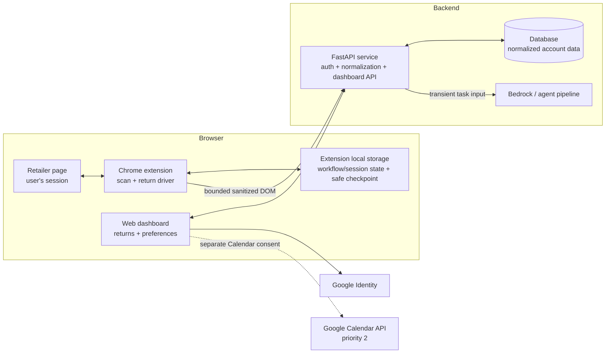

# Architecture and decisions

> **Status:** Updated for the product decisions made on 2026-09-05. The requirements, detailed
> design, milestone plan, and migration section of the planning decision record have been
> reconciled with these decisions; the files under `plan/tasks/`, implementation, and workspace
> guidance still describe the previous local-only, USPS-oriented PoC in places. The decisions marked
> **Current** here govern the changed areas listed in
> [`README.md`](README.md#direction-migration).

This document records why the system has its current shape. [`SKETCH.md`](SKETCH.md) owns the
product story and scope; [`RETURN_WORKFLOW.md`](RETURN_WORKFLOW.md) owns the current normal return
flow and preserves interruption/resumption only as a deferred proposal.

## The central boundary

Boomerang may persist normalized account data, but it still has no independent access to a
retailer's authenticated pages. The extension reads those pages in the user's existing browser
session and sends only a bounded, sanitized representation for order normalization or current-step
return planning. The backend cannot poll a retailer, reopen a return flow, or learn about an order
the extension did not send.

For terminal return pages, the representation may include only the non-sensitive structure needed
to report an outcome. Raw label artifacts, QR contents, addresses, barcodes, and protected URLs do
not leave the browser.

The web dashboard and extension have different responsibilities:

- The **dashboard** is the account-level view of returnable orders, deadlines, preferences, and
  current return summaries.
- The **extension** is the browser-execution surface. It reads live retailer pages, performs
  reversible form actions, and owns detailed workflow/session state and the latest safe checkpoint.
- The **API** normalizes browser-supplied data, serves the dashboard, and stores normalized account
  records. It never receives retailer credentials.

## Components

The exact client/server custody of a Calendar access or refresh token is still open. The diagram
shows the product relationship, not a settled token-storage choice.

## Data and authority

The database and extension are both sources of truth, but never for the same detailed state.

| Domain | Authoritative store | Notes |
|---|---|---|
| User identity | Database | Keyed by Google's stable OpenID Connect `sub` claim, not email |
| Orders and items | Database | Normalized records supplied through the extension |
| Prices and dates | Database | Includes delivered date and parsed return deadline when available |
| Policy facts | Database | Rules, fees, deadlines, and provenance/confidence where the parser provides them |
| User preferences | Database | Used to rank and explain choices, never to authorize one |
| Current return summary | Database | Minimal dashboard projection; for QR outcomes, v1 stores only `qr_ready` |
| Detailed workflow/session state | `chrome.storage.local` | Latest safe checkpoint, current-run step, tab context, fields filled, attempts, and timestamps |
| Retailer session | Browser only | Cookies, authorization headers, and credentials never leave the browser |
| Raw or transmitted DOM representation | Nowhere durable | Processed transiently and discarded after success or failure |

The dashboard may display the database summary while the extension retains richer local progress.
When they reconnect, the extension may publish a new summary only after validating the live page or
an explicit user action. The database must not reconstruct or command a retailer workflow from an
old summary alone.

## Primary data flows

### Sign-in and extension connection

1. The user authenticates to the web app with Sign in with Google.
2. Boomerang validates the identity response and keys the account by `sub`.
3. The dashboard and extension establish an application authenticated connection using a mechanism
   still to be specified in the detailed design.
4. Signing in does not by itself grant Calendar access or retailer access.

### Order ingestion

1. The user opens a retailer order-status page in their existing signed-in session.
2. A user gesture grants the extension temporary page access on first use. A standing retailer host
   permission may be requested later, in context.
3. The extension extracts a bounded, sanitized order subtree and sends it to the API.
4. The API synchronously invokes the parsing pipeline for now, validates the normalized result, and
   persists items, prices, delivery dates, and available policy facts.
5. The dashboard reads those database records and computes or renders urgency from the latest known
   return deadline.

Synchronous parsing is a planning assumption, not a closed decision. The AI-pipeline owner still
needs to establish payload limits, latency, timeout behavior, retries, and whether the API can meet
its hosting runtime limit. See [D13](#d13--synchronous-parsing-is-provisional--current).

### Return execution

1. The user explicitly starts a return from the dashboard or extension.
2. The extension opens or focuses the retailer flow and reads the current live DOM.
3. For every return-flow step, the extension extracts a bounded, sanitized representation of that
   current DOM and sends it to the agent through the API.
4. The agent proposes exactly one tool call from the closed vocabulary: `click`, `select_option`,
   `fill`, `pause_for_user`, `report_stuck`, or `report_outcome`.
5. Trusted extension code validates the proposal against the current live DOM, target restrictions,
   and user-confirmation rules. Bundled selectors may help resolve or validate a target, but they
   never construct or execute an action without an agent proposal.
6. The extension executes one validated, authorized browser action, hands control back for
   `pause_for_user` or `report_stuck`, or records one validated terminal outcome. After an action
   settles, it starts the next step from a new bounded, sanitized representation. A stale or invalid
   proposal executes nothing and publishes nothing.
7. Autofill is limited to reversible, allowed fields. Password, payment, file-upload, and other
   sensitive inputs are never fill targets. In v1, `pause_for_user` hands control to the user; it
   does not enter a resumable workflow state.
8. V1 assumes the automated run proceeds without a supported interruption. If the page diverges or
   the user takes over, Boomerang hands control back and does not promise to resume that run.
9. Preferences rank visible return methods and explain tradeoffs. Every method and known price
   remains visible; the user chooses and confirms final submission.
10. The retailer's QR-code, printable-label, or manual outcome updates the database summary. For a
    QR outcome, only `qr_ready` is persisted; whether to store a QR representation is deferred.
    Detailed workflow/session state and the latest safe checkpoint remain local.

`report_outcome` accepts only `qr_ready` or `label_ready` in v1 and carries no QR, label, address,
barcode, or protected URL. `handed_to_carrier` and `complete` remain outside that tool until their
independent evidence and transition decisions are resolved.

The proposed interruption state machine is preserved as explicitly deferred material in
[`RETURN_WORKFLOW.md`](RETURN_WORKFLOW.md#appendix-deferred-interruption-and-resumption-proposal). It
is not a v1 architecture requirement or a main-plan deliverable.

### Calendar reminder, priority 2

Google authentication and Google Calendar authorization are separate grants. Sign-in commonly uses
the identity scopes `openid`, `email`, and `profile`; creating a Calendar event requires an
additional Calendar scope. Google documents these as separate authentication and authorization
flows in [Google Identity Services](https://developers.google.com/identity/oauth2/web/guides/overview)
and lists the available scopes in the
[Calendar authorization guide](https://developers.google.com/workspace/calendar/api/auth).

Boomerang therefore asks for the narrow event-writing permission when the user chooses **Add to
calendar**, not simply because the user signed in. It does not read availability. Token custody,
refresh behavior, revocation, and the final scope are open design choices.

Calendar remains priority 2. No current low-level implementation design should assign it to the
client or server or define wire contracts until that priority and blocker 5 are taken up.

## Decisions

### D1 — Read retailer pages; defer Gmail — Current

Order ingestion comes from retailer order-status pages, not Gmail. The order page contains the
current eligibility, deadline, and return entry point that the product acts on. Gmail API access
and Gmail DOM scraping are both deferred from v1.

Using Google as the Boomerang account provider does not change this decision. Identity permission
does not authorize inbox access, and no Gmail scope belongs in the v1 consent request.

### D2 — Use the Calendar API after separate consent — Current; replaces the template-URL decision

The earlier architecture avoided OAuth by opening a prefilled Calendar URL. The current product
decision intentionally adopts the Google Calendar API as priority 2.

Authentication establishes who the user is; Calendar authorization grants a distinct capability.
Request it incrementally when the user invokes **Add to calendar**. Choose the least-privileged
scope that supports the final event ownership and update behavior. Whether to store a refresh token
is not yet decided and belongs with the retention policy and threat model.

### D3 — Do not read calendar availability — Current

Calendar integration creates a deadline or follow-up reminder. It does not inspect free/busy data,
select a time based on the user's schedule, or require background Calendar reads. If future product
requirements add those behaviors, they require a separate privacy and scope decision.

### D4 — USPS pickup in v1 — Deferred; no longer current

USPS pickup scheduling, eligibility, cancellation, confirmation handling, and all related dashboard
controls are excluded from the first version. The old USPS-first decision remains identifiable as
D4 so older design and review references can be migrated deliberately.

### D5 — USPS eligibility and ETag handling — Deferred with D4

The previous eligibility gate and refresh-before-cancel rules matter only if carrier pickup returns
to scope. They must not drive v1 data models, screens, or acceptance criteria.

### D6 — USPS postage and pickup-day copy — Deferred with D4

The previous printed-USPS-postage prerequisite and pickup-day language are not v1 behavior. QR codes
and retailer labels remain valid retailer outcomes without implying that Boomerang scheduled a
pickup.

A dashboard state such as `handed_to_carrier` or “picked up” must identify its evidence as
user-confirmed or retailer-observed. Live carrier tracking is not implied.

### D7 — Minimal Manifest V3 permissions, requested in context — Current

The extension starts with `activeTab`, `scripting`, and `storage`. Retailer domains are optional host
permissions requested only after a user gesture and in context. The first run offers **Scan this
page** because `activeTab` cannot inject automatically on page load.

Do not add `<all_urls>` to simplify acquisition. It broadens access and undermines the extension's
review and privacy posture.

### D8 — Make the database-backed web dashboard the product home — Current

The dashboard is no longer a deferred install funnel. It stores and presents normalized orders,
return deadlines and values, preferences, current states, and extension connectivity. The extension
remains necessary because the web service cannot access the retailer session.

The screenshot supplied on 2026-09-05 is a layout reference, not a data contract. Its returns list,
urgency legend, sorting, summary metrics, Pickups/handoffs view, privacy navigation, and connection
state carry forward. USPS scheduling, confirmation, address, postage, and cancellation controls do
not; the Pickups view is a carrier-neutral status view in v1.

### D9 — Split durable account state from local execution state — Current

Database state supports the cross-session dashboard. Extension-local state supports safe browser
automation and recovery. Keeping both is intentional, but a field must have one authoritative home.
The database stores only the current return summary; `chrome.storage.local` stores the detailed
workflow/session state and latest safe checkpoint. Keeping that checkpoint does not make
user-controlled pause/resume or interrupted-flow recovery part of the current contract.

Raw DOM and bounded, sanitized DOM representations are transient inputs, not database models.

### D10 — Use Google identity, keyed by `sub` — Current

Google is the v1 account provider. The backend verifies the identity assertion and keys the user by
the stable OpenID Connect `sub` value. Google explicitly warns that email can change and recommends
`sub` as the unique identifier in its
[OpenID Connect documentation](https://developers.google.com/identity/openid-connect/openid-connect).

Retailer accounts are not linked to Boomerang through Google, and Google sign-in does not allow the
server to access retailer pages.

### D11 — Interruptible and resumable autofill — Deferred proposal; not current

The Stop/Continue control and the `Stopping`, `Paused`, `Resuming`, and `NeedsReview` states are an
exploratory design for a later phase. They are not v1 requirements and must not be added to the main
implementation plan yet.

The current flow assumes one uninterrupted automated run. If the user takes over or the flow loses
its known state, the run ends or hands off for manual completion; v1 does not reconcile the edited
page and continue from a stored checkpoint.

### D12 — Preferences rank; users decide — Current

The initial preferences are lowest cost, fastest refund or replacement, no printer, and greater
sustainability. They affect ranking and explanation only. Boomerang never hides a method, invents a
price, chooses a paid option, or submits a form based solely on a stored preference.

### D13 — Synchronous parsing is provisional — Current

The initial API contract assumes one synchronous request from extension input to validated,
persisted normalized output. This keeps the first workflow simple, but it is blocked on the AI
pipeline being refined by another owner.

Before the contract is settled, measure realistic minimized-DOM payloads, model latency, retries,
and the effective gateway/hosting timeout. If the result cannot reliably fit, the architecture must
adopt an asynchronous job model rather than disguising a timeout as a parsing error.

The per-step return agent also needs a measured request/response, timeout, and retry contract. That
runtime work does not change the agent-first authority model: a timeout or transport failure hands
control to the user and never authorizes a deterministic selector-only action.

### D14 — Plan every return-flow step with the agent — Current

The return driver is agent-first. On every step, the extension sends a bounded, sanitized
representation of the current live DOM and receives exactly one proposed tool call from the closed
vocabulary. Trusted extension code retains authority: it resolves and validates browser actions
against the live page and user-confirmation rules immediately before execution, and validates a
reported outcome before publishing it.

The closed vocabulary adds `report_outcome(outcome_kind)` for terminal-page classification. Its v1
values are `qr_ready` and `label_ready`, and its request and response contain no raw label artifact,
QR contents, address, barcode, or protected URL. The terminal-page sanitizer exposes only the
bounded structural and non-sensitive facts required to classify the outcome.

Bundled retailer selectors are hints for target resolution, page recognition, and validation. They
may improve reliability, but they do not form a deterministic first path and cannot advance the
flow without an agent proposal. This keeps planning adaptive without allowing retailer-controlled
content or model output to bypass the extension's safety boundary.

This authority model is settled. Open blocker 2 covers the concrete per-step request, latency,
timeout, and retry contract; open blocker 7 covers retailer-specific selector hints and acceptance
fixtures. Neither blocker permits a selector-only execution path.

## Retention and deletion baseline

Retention answers **how long stored data remains**. Deletion rules answer **what event removes it,
from which stores, and whether removal is immediate or recoverable**. They are different from the
database schema: deciding to store an order does not decide whether it remains for 30 days, one
year, or until account deletion.

The agreed baseline is:

- raw DOM and bounded, sanitized DOM representations have zero durable retention;
- account deletion removes the user's normalized orders, items, policies, preferences, and return
  summaries from the database;
- clearing extension data removes local workflow/session state and its latest safe checkpoint but
  does not silently delete the web account's database records;
- disconnecting Calendar revokes access and removes any stored Calendar credential, if the final
  design stores one.

Still to decide:

- how long completed, expired, and abandoned orders remain;
- whether users can delete a single order and what related records cascade;
- when completed local workflow/session state and its latest safe checkpoint are cleared;
- whether account deletion has a recovery period and how backups expire;
- whether Calendar uses a refresh token and, if so, its revocation and deletion lifecycle.

The product Privacy surface and implementation requirements must state the final answers before a
public launch.

## Open blockers

1. **Interruption policy:** v1 currently assumes an uninterrupted run and D11 is only a deferred
   proposal. Before the interruption workstream and its acceptance criteria are treated as settled,
   decide what Boomerang supports when a user interrupts: manual handoff with no recovery, stop-only
   behavior, or full checkpointed resumption. Then either keep D11 deferred with explicit acceptance
   criteria for the fallback or promote a chosen design into scope.
2. **AI runtime and contracts:** normalization is synchronous for planning, while both normalization
   and per-step agent requests still need measured payload, latency, timeout, retry, and hosting
   contracts.
3. **Dashboard status evidence:** decide whether carrier handoff is user-confirmed,
   retailer-observed, or both, and record the source.
4. **Retention details:** choose completed-order, expired-order, local workflow/session state,
   checkpoint, token, and backup lifetimes.
5. **Calendar design:** when priority 2 is taken up, choose component ownership, wire contracts, the
   narrow scope, access/refresh-token custody, revocation path, and whether event updates are
   supported.
6. **Dashboard-to-extension bridge:** authenticate and address the correct browser workflow without
   exposing a general-purpose command channel.
7. **Retailer target:** confirm the first retailer before detailed selectors and acceptance tests are
   treated as current.
8. **Complete-state semantics:** define what `complete` means, which user-confirmed or
   retailer-observed evidence can establish it, and which state transitions may lead to it. This is
   independent of carrier-handoff evidence in blocker 3.
