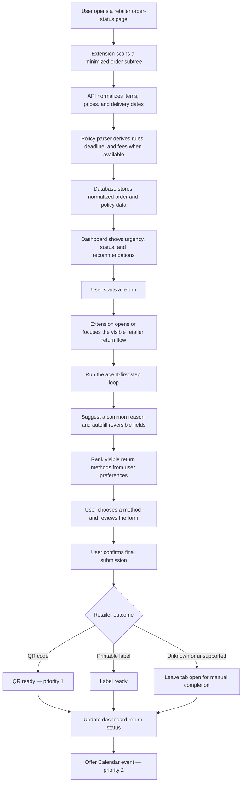
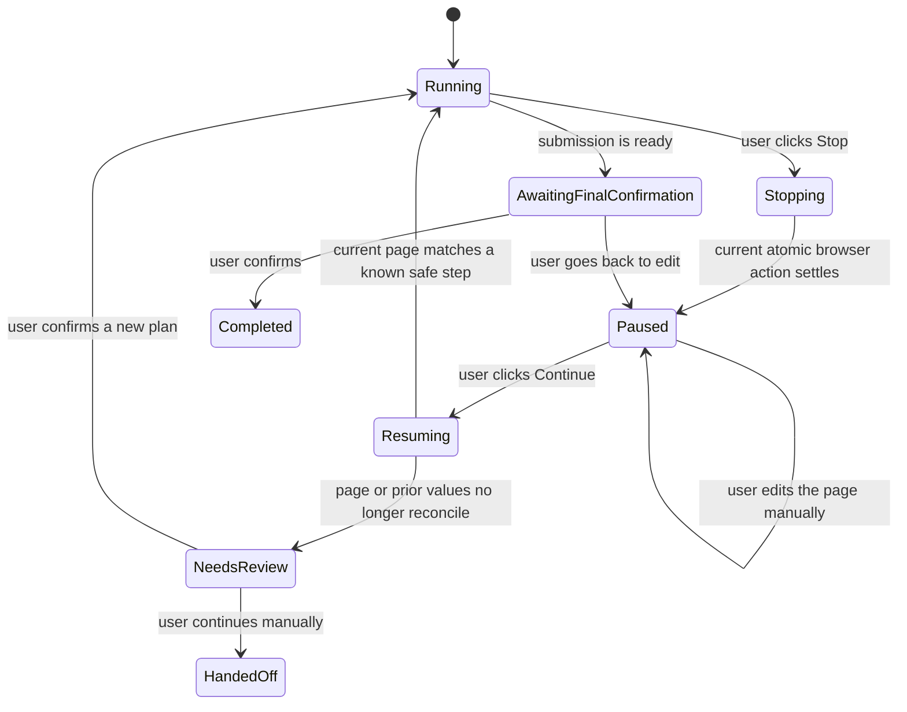

# Return workflow

> **Status:** Product workflow updated on 2026-09-05. The normal flow and state-ownership sections
> describe the current direction. Interruption and resumption are preserved only as a deferred
> proposal and are not part of v1 or the main implementation plan.

## Goals

The workflow should complete as much reversible form work as it safely can while the user watches
the retailer tab. The current plan assumes that an automated run proceeds from start to finish
without a supported stop-and-resume cycle.

The workflow must not confuse convenience with authority:

- A suggested reason is a default for review, not permission to submit it.
- User preferences may rank return methods, but every visible method and price remains available.
- Boomerang does not silently choose a paid method.
- Final submission and any other irreversible action require user confirmation.
- Every return-flow step starts from a bounded, sanitized representation of the current live DOM
  sent to the agent.
- The agent proposes exactly one tool call from the approved closed vocabulary. Trusted extension
  code validates browser actions against the current live DOM and user-confirmation rules before
  execution, and validates a reported terminal outcome before publishing it.
- Bundled selectors may assist target resolution and validation, but cannot bypass the agent.

## Normal flow

Within the agent-first step loop, the extension:

1. reads the current live DOM after the previous action settles;
2. extracts and locally checks a bounded, sanitized representation of the relevant current state;
3. sends that representation and bounded workflow context to the agent;
4. receives exactly one `click`, `select_option`, `fill`, `pause_for_user`, `report_stuck`, or
   `report_outcome` proposal;
5. validates the proposal in trusted extension code against the current live DOM, allowed target
   types, and user-confirmation rules;
6. executes one validated and authorized browser action, hands control back for `pause_for_user` or
   `report_stuck`, publishes one validated terminal outcome, or does nothing if validation fails;
   and
7. repeats from a fresh DOM representation for the next step.

Bundled selectors can help the validator resolve the agent's target or confirm page identity. A
selector match is never an independent action plan and never skips the agent request. This
authority split is recorded in [architecture decision D14](ARCHITECTURE.md#d14--plan-every-return-flow-step-with-the-agent--current).

`report_outcome` is the explicit terminal tool. Its v1 outcome value is `qr_ready` or `label_ready`;
it carries no artifact. The extension may send a bounded, sanitized terminal-page representation
so the agent can propose that tool, but the egress guard removes raw labels, QR contents, addresses,
barcodes, and protected URLs before the request. Trusted extension code validates the reported
outcome against the current page before updating the durable summary. `handed_to_carrier` and
`complete` are not agent-reportable outcomes until their separate blockers are resolved.

The QR code or printable label is produced by the retailer. For a QR outcome, Boomerang persists
only the `qr_ready` status in v1; whether to store a QR representation is deferred. It does not
manufacture carrier credentials or postage.

USPS pickup scheduling is not part of v1. A dashboard status such as `picked_up` or
`handed_to_carrier` therefore records a user-confirmed or retailer-observed fact; it must not imply
that Boomerang booked or observed a USPS collection.

## State ownership

The database and extension are both sources of truth, but for different data. A field has one
authoritative home; the two stores do not maintain competing copies of detailed workflow/session
state or the latest safe checkpoint.

### Database

The server stores the account-level data required by the dashboard:

- Google account subject identifier and basic profile fields needed for the account
- orders and items
- item prices
- ordered and delivered dates
- parsed policy rules, deadlines, and fees
- user preferences
- current return summary for each item, including whether action is needed, a return is in
  progress, the `qr_ready` status, a label is ready, or the user has confirmed carrier handoff

The current return summary is not the detailed workflow/session state or latest safe checkpoint. It
is the minimum projection the dashboard needs to show which orders need attention and which have
progressed. For QR outcomes, it stores only `qr_ready`, not a QR representation.

### Extension local storage

`chrome.storage.local` stores browser-execution state:

- workflow/session identifier and the database order/item identifiers it belongs to
- current workflow state and retailer step
- tab ID and last validated URL
- latest safe checkpoint
- fields Boomerang filled so far
- the suggested and user-confirmed reason
- the selected return method
- attempt count and timestamps

This detailed workflow/session state and latest safe checkpoint remain local rather than putting
retailer form contents in the account database. Keeping the checkpoint does not promise
user-controlled pause/resume or recovery after an interruption or browser-worker restart; those
capabilities belong to the deferred proposal below.

### Never persisted

- raw page DOM
- bounded, sanitized DOM representations sent for normalization or return-step planning
- retailer cookies, authorization headers, passwords, payment fields, or file inputs
- a raw label or QR artifact

QR representation storage is undecided; v1 persists only the `qr_ready` status.

The API and agent may process a bounded, sanitized representation in memory. It is discarded after
the normalization or tool-proposal request succeeds or fails. Only validated normalized account
data and the minimal return summary cross into durable database storage.

## Preference behavior

The first preference vocabulary is:

- `lowest_cost`
- `fastest_refund_or_replacement`
- `no_printer`
- `more_sustainable`

Preferences affect ordering and explanations. They do not hide methods, turn an unreadable price
into zero, select a reason, submit a form, or authorize spending. If a preference cannot be applied
from facts visible on the retailer page, the dashboard says that rather than inventing a ranking.

## Calendar, priority 2

The Calendar feature uses the Google Calendar API, but Calendar authorization is separate from
Sign in with Google. The user is asked for the narrow event-writing permission when they choose
**Add to calendar**, not merely because they signed in.

The event describes the return deadline or user-selected follow-up. It does not read calendar
availability, and the v1 workflow does not require background Calendar access.

Calendar is priority 2. Its component ownership, OAuth flow, token custody, and wire contracts remain
outside the current low-level implementation design until that priority is taken up.

## Unresolved dependencies

1. The interruption policy is a planning blocker even though the state-machine proposal is deferred.
   Before the interruption workstream and its acceptance criteria are finalized, choose whether an
   interrupted v1 run ends in manual handoff, supports stop-only behavior, or includes resumable
   checkpoints. Until then, the current workflow assumes no interruption and does not promise
   recovery.
2. Normalization remains synchronous for this workflow, provisionally. The latency, payload, retry,
   and timeout questions for normalization and per-step agent requests are recorded in
   [architecture decision D13](ARCHITECTURE.md#d13--synchronous-parsing-is-provisional--current).
3. The dashboard should show carrier handoff, but its evidence source is not settled. Until it is,
   the workflow records a user-confirmed or retailer-observed fact and names that source.
4. Retention and deletion are data-policy decisions, not workflow steps. Their one canonical baseline
   is in [`ARCHITECTURE.md`](ARCHITECTURE.md#retention-and-deletion-baseline).
5. The evidence and legal transition into the durable `complete` state are unresolved independently
   of carrier-handoff evidence and are tracked as architecture blocker 8.

## Appendix: deferred interruption and resumption proposal

> **Not current scope:** Do not implement these states, a Stop/Continue control, checkpoint recovery,
> or resume reconciliation as part of v1 or the main plan. The model below is retained only so the
> team can revisit the idea in a later phase.

One possible later design would make the Stop control visible while Boomerang can manipulate the
page and use the following state model:

In that proposal, stopping would mean:

1. No new DOM action starts after the stop request is observed.
2. The current atomic action is allowed to settle; Boomerang does not leave a half-written field.
3. The extension records a safe local checkpoint and releases control of the page.
4. The user may edit any value or select a different return method manually.

Continuing would mean:

1. Re-read the live page; never continue against a stored DOM snapshot.
2. Verify the tab, URL, retailer, visible step, and relevant field values.
3. Reconcile manual changes with the local workflow record.
4. Continue only from a recognised safe state. Otherwise explain what changed and hand control to
   the user instead of guessing.
