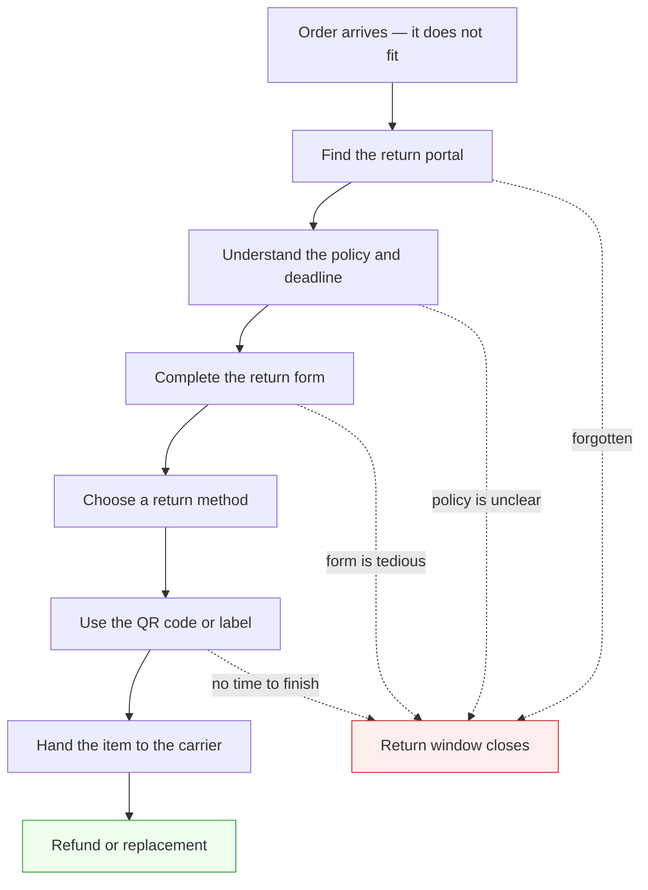

# Boomerang — The Reverse-Logistics Concierge

*A web-first returns workspace with a browser extension that can carry out the tedious parts.*

> **Status:** Product direction updated 2026-09-05. This document owns the product story and v1
> scope. [`RETURN_WORKFLOW.md`](RETURN_WORKFLOW.md) owns the normal behavior and records interruption
> and resumption only as a deferred proposal.
> [`ARCHITECTURE.md`](ARCHITECTURE.md) owns the current technical decisions. The design documents,
> milestone plan, and migration section of the planning decision record have been reconciled with
> this direction; the older task material in [`../plan/tasks/`](../plan/tasks/) has not. See
> [`README.md`](README.md) for the migration notice.

## The problem

Buying online is one click. Returning something is a sequence of small, deferrable chores with a
deadline. Each handoff is another chance for a valid return to be forgotten until its window closes.

The dashed edges are the product: Boomerang keeps the return visible and helps the user cross each
point where it would otherwise stall.

## The product

Boomerang has two cooperating surfaces:

- **The web dashboard is the home.** A user signs in with Google and sees orders that still need
  action, their return deadlines and value, the current return state, and recommendations based on
  their preferences.
- **The Chrome extension is the hands.** It reads the retailer page in the user's existing session,
  asks the agent to plan each return-flow step, validates and executes proposed browser actions or
  records a validated terminal outcome, and records what it filled locally.

The intended interaction is:

1. The user signs in to Boomerang with Google and connects the extension.
2. On a retailer order-status page, the extension sends a minimized order subtree for synchronous
   normalization.
3. The service extracts items, prices, delivered dates, and available policy facts such as rules,
   deadlines, and fees. The normalized result is saved to the user's account and appears on the
   dashboard.
4. The dashboard orders return candidates by urgency and shows preferences such as lowest cost,
   fastest refund or replacement, no printer, and sustainability.
5. When the user starts a return, the extension drives the visible retailer flow. For every step it
   sends a bounded, sanitized representation of the current DOM to the agent and receives exactly
   one closed-tool proposal. Trusted extension code validates and executes browser actions or
   records a validated `report_outcome` result. Bundled selectors may assist resolution and
   validation but never bypass the agent. The user reviews the form and confirms submission.
6. Every visible return method and price remains available. Preferences rank and explain the
   options; they do not choose one or silently authorize a fee.
7. The current version assumes the automated return runs from start to finish. Supported
   interruption, editing, and resumption are deferred; if the user takes over, Boomerang does not
   promise to resume that run.
8. The retailer may produce a QR code or printable label. A sanitized terminal-page representation
   may reach the agent so it can propose `report_outcome`, but raw labels, QR contents, addresses,
   barcodes, and protected URLs stay out of the request. For QR outcomes, v1 stores only the
   `qr_ready` status; whether to store a QR representation is deferred. A Google Calendar reminder
   is priority 2.

The full behavior is in [`RETURN_WORKFLOW.md`](RETURN_WORKFLOW.md).

## Dashboard direction

The supplied dashboard concept establishes the v1 information hierarchy:

- Returns, Pickups/handoffs, and Privacy navigation
- a visible extension-connected state
- summary metrics such as returns closing soon, remaining returnable value, and returns in progress
- sorting by closing soonest
- order rows with item, retailer, delivered date, price, days remaining, and current return status
- an explanation of urgency thresholds
- a detail card for the selected return or next action

Keep the screenshot's Pickups area as a filtered view of returns that reached carrier handoff. Do
not carry forward USPS booking semantics: replace **Pickups booked** with a carrier-neutral handoff
count, replace the USPS next-pickup card with the selected return or next action, and remove
confirmation-number, scheduling, and **Cancel pickup** controls. The underlying return states are
`not_started`, `in_progress`, `qr_ready`, `label_ready`, `handed_to_carrier`, and `complete`.

Because there is no carrier integration in v1, a “picked up” or `handed_to_carrier` status must name
its source. It may be user-confirmed or read from a retailer page; it must not imply that Boomerang
scheduled or observed a USPS pickup.

The meaning, evidence, and legal transitions for `complete` remain a separate open architecture
decision. They are not part of the carrier-handoff evidence decision.

The old sentence “Nothing here is stored on our servers” must also be removed from the dashboard.
Normalized orders, policy data, preferences, and current return summaries are now account data in
the database. The Privacy surface must explain that plainly.

## State ownership

The database and extension are both sources of truth for different domains:

| Source of truth | Owns |
|---|---|
| Database | Google-linked user record, normalized orders and items, prices, delivered dates, parsed policy rules/deadlines/fees, user preferences, and the current return summary shown on the dashboard |
| Extension local storage | Detailed workflow/session state and the latest safe checkpoint, including the retailer step, browser tab context, and what Boomerang filled so far |

Raw DOM and bounded, sanitized DOM representations are never database models. They are processed
transiently and discarded after each normalization or return-step request. Retailer cookies and
credentials never leave the browser.

## Priorities and scope

### Core v1

- Sign in with Google
- web dashboard backed by a database
- extension connection status
- retailer order-page scanning with Manifest V3 APIs
- item, price, delivery-date, policy, deadline, and fee normalization
- preference-based recommendations
- visible, agent-guided return autofill that assumes an uninterrupted run
- user review and confirmation before submission

### Priority 1

- record the `qr_ready` status for a QR-code outcome produced by the retailer

### Priority 2

- create a reminder with the Google Calendar API after separate Calendar authorization

### Deferred

- Gmail API access or Gmail scraping
- USPS pickup scheduling and cancellation
- UPS, FedEx, paid pickup products, and carrier tracking
- unattended access to retailer accounts
- user-controlled Stop/Continue, pause/resume checkpoints, and interrupted-flow recovery
- asynchronous parsing, unless the AI pipeline proves a synchronous request cannot meet the
  required runtime

The v1 retailer set and exact dashboard-status source still need to be confirmed. The earlier Amazon
assumption is not silently carried forward by this product-direction change.

## Google identity and Calendar

Google is the account provider. Authentication uses Sign in with Google and the OIDC identity
scopes needed to establish the user account. The Google account's stable `sub` claim—not the email
address—is the database identity key.

Calendar access is related but not automatic. Creating an event requires a separate Calendar OAuth
scope and consent flow. Boomerang asks for that permission when the user chooses **Add to calendar**,
not during sign-in merely because the user has a Google account. V1 does not read availability.
Calendar component ownership and wire contracts are deferred until priority 2 is taken up.

## Privacy baseline

- Persist normalized order and policy records, preferences, and current return summaries in the
  account database.
- Keep detailed workflow/session state and the latest safe checkpoint in `chrome.storage.local`.
- Do not persist raw DOM or bounded, sanitized DOM representations.
- Allow a bounded, sanitized terminal-page representation to reach the agent, but remove raw label
  artifacts, QR contents, addresses, barcodes, and protected URLs before transmission.
- Do not transmit retailer cookies, authorization headers, passwords, payment fields, or file
  inputs.
- Do not claim that v1 can resume an interrupted run; the Stop/Continue proposal is deferred.
- Explain database storage, Google identity, model processing, and Calendar authorization on the
  Privacy page and in the extension disclosure.

Retention and deletion are not yet fully specified. The agreed baseline, the meaning of those
terms, and the remaining choices are recorded once in
[`ARCHITECTURE.md`](ARCHITECTURE.md#retention-and-deletion-baseline).

The current engineering and policy blockers—including the provisional AI runtime contracts—are kept
in [`ARCHITECTURE.md`](ARCHITECTURE.md#open-blockers) rather than repeated in this product summary.

## Current implementation status

Implementation status changes too often to maintain safely in a product narrative. The repository
map in [`../AGENTS.md`](../AGENTS.md) records what exists today. The current design and milestone
plan describe the approved target; the files under `plan/tasks/`, current implementation, and
workspace guidance still require reconciliation where they describe the previous local-only,
USPS-oriented PoC.
