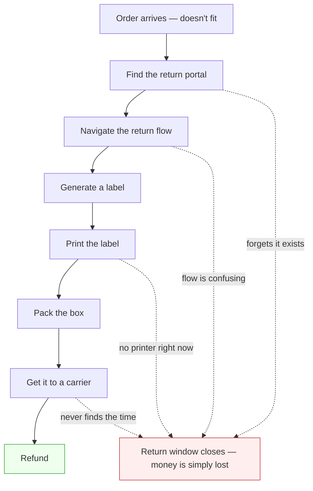
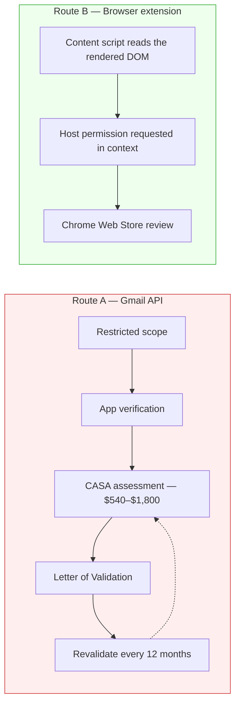

# Boomerang — an agent that closes the loop on e-commerce returns

## Background

### The money people lose by not returning things

Buying online is one click. Un-buying is a chore with at least six steps, a deadline, and a
printer in the middle of it. The sweater doesn't fit, and between that moment and the refund sit:
finding the retailer's return portal, navigating its flow, picking a reason code, generating a
label, printing it, packing the box, and physically getting it to a carrier — all before a return
window closes that nobody is tracking.

Most of those steps are individually trivial. The failure is that they're serial, they're
deferrable, and each one is a place to stop.

The dashed edges are the product. Nothing here is hard; it is only *unattended*. A $50 sweater
becomes a $0 sweater because a 30-day timer ran out while the box sat by the door.

### What Boomerang is meant to do

Boomerang is a **reverse-logistics concierge**: an everyday agent that notices what you bought,
tracks the return window, and — when you say the word — drives the return to completion without
you touching the retailer's website.

The intended interaction is a single sentence:

> "Return the blue sweater from the J.Crew order."

and a single confirmation back:

> "I set up the J.Crew return. Your carrier will collect it with Wednesday's mail — leave the box
> out with the printed label on it before your usual delivery time."

The day in that sentence is whatever USPS returned, never an assumption. Free Carrier Pickup is a
day, not a window, and "tomorrow" is itself a guess — the 2 AM Central cutoff, Sundays and holidays
all move it.

Everything between those two messages — the portal, the reason code, the label, the carrier
booking, the reminder — is the agent's job.

### What exists today

The repository is scaffolding. Nothing in it does returns work yet.

| Component | State |
|---|---|
| `client/` | Next.js 16 app. `app/page.tsx` is the untouched framework starter. shadcn-ui, Base UI, Tailwind 4, husky/lint-staged configured. |
| `server/` | FastAPI service. One route: `GET /health`. `app/bedrock.py` holds a cached Bedrock client helper. `app/{api,routes,models}/` exist and are empty. |
| `infra/` | Terraform — VPC across two AZs, EC2, IAM. Never applied. State is local; `allowed_cidr` deliberately refuses `0.0.0.0/0`. |
| `extension/` | **Does not exist.** |

That last row matters more than it looks. The original design assumed a server-side agent
watching a user's inbox. The research described below moved the load-bearing component into the
browser — so the one part of the system that does the actual work is also the one part that has
not been started.

### The constraint that shapes everything

An agent that handles returns must first know what you bought. There are only two ways to learn
that, and they are not comparable in cost.

**Route A — read the user's email through the Gmail API.** Every Gmail scope that reads message
content *or metadata* is a **restricted scope**. That classification triggers a two-gate process:
app verification first, then a **CASA** security assessment performed by a Google-approved lab,
producing a **Letter of Validation** that expires in twelve months. Realistic cost is $540–$1,800
a year in perpetuity, with six to twelve weeks before the first outside user can connect.

The trigger clause is worth quoting, because it is broader than teams expect: an app that
"accesses or **has the capability to access** Google user data from or through a server" must
undergo the annual assessment. A backend that forwards message content to a model for parsing is
inside that clause. "We don't store anything" does not help.

**Route B — read the pages the user already has open.** A browser extension's **content script**
reads the **rendered DOM** of any site it holds a **host permission** for. No OAuth scope is
involved, so none of the above applies — no consent screen, no verification, no CASA, no annual
fee, no 100-user cap.

Two research briefs settled this in favour of Route B, and found a second result that was not
expected: **Gmail is the wrong page to read even if it were free.** Retailer "Your Orders" pages
carry authoritative order status, return eligibility, and the actual entry point into the return
flow — none of which a receipt email contains. There is shipped Chrome Web Store precedent for
reading them.

### The other constraint: somebody has to collect the box

Removing the drop-off trip means booking a carrier pickup on behalf of a consumer who holds a
**prepaid return label** the retailer issued. That consumer has no carrier account, no shipper
number, and no login — and asking them for one kills the product.

Reading the carriers' own API specifications produced an unusually clean answer. USPS **Carrier
Pickup** is the only one of the three whose pickup request carries no account identifier at all:
no shipper number, no CRID, no payment token. The pickup binds to the consumer's address and
their own contact details; the only thing authenticated is the calling application. It is also
free. UPS requires holding an account merely to obtain credentials, and FedEx requires an account
number that is then invoiced for every pickup.

### The gap this document addresses

The research answered *whether* each piece is possible. What it did not produce is a single
coherent account of the system those answers imply — one that a reader can evaluate, disagree
with, and build from.

Three specific things are unresolved:

1. **The architecture inverted and the consequences weren't traced.** With no OAuth grant, the
   backend has no independent path to user data. It cannot poll, cannot run a nightly job, cannot
   check anything while the user is away. "Passive monitoring" — the phrase the original sketch
   used — is not available. What replaces it has not been described.
2. **The promise made to the user was wrong in a specific way.** The original sketch promised a
   pickup "tomorrow between 9 AM and 12 PM." Free carrier pickup happens on the normal delivery
   round: a day, not a window. Every user-facing string inherits this correction.
3. **The riskiest component has never been prototyped.** Driving an arbitrary retailer's return
   flow to a printed label is the part of the product with no published precedent, no API, and no
   fallback. It sits on the longest path and nobody has tried it.

## Terminology

| Term | Definition |
|------|------------|
| **Reverse logistics** | Everything that happens to a product after the customer decides to send it back — the return journey as opposed to the delivery journey. |
| **Return window** | The period, typically 30 days from delivery, during which a retailer will accept a return. Varies by category, sale status, and membership tier. |
| **Prepaid return label** | A shipping label issued by the retailer with postage already paid, so the customer isn't out of pocket to send the item back. |
| **Carrier Pickup** | USPS's free service in which the letter carrier collects a prepaid package from the customer's address during their normal delivery round. |
| **Drop-off** | The manual alternative: the customer physically carries the package to a post office, carrier location, or partner store. |
| **Restricted scope** | Google's highest-sensitivity OAuth classification. Every Gmail scope that reads message content or metadata falls in it, triggering verification and an annual security assessment. |
| **App verification** | Google's review of an app requesting sensitive or restricted scopes — brand check, scope justification, demo video, policy review. |
| **CASA** | Cloud Application Security Assessment. The App Defense Alliance framework, built on OWASP ASVS, that Google requires annually for restricted-scope apps. Performed by an approved lab. |
| **Letter of Validation** | The artifact a CASA lab issues on passing. Valid twelve months; expiry can cost production access. |
| **Limited Use** | Google's policy restricting how user data may be used. The Chrome Web Store version governs *all* data an extension handles, not only data from Google APIs. |
| **Content script** | JavaScript an extension injects into a web page. Runs in an isolated JS context but shares full access to the page's DOM. |
| **Rendered DOM** | The page as it exists after the site's own JavaScript has run — what the user actually sees, rather than the initial HTML response. |
| **Host permission** | An extension's declared right to act on a given origin. Gates script injection, network requests, and reading sensitive tab properties — but not simple navigation. |
| **Manifest V3 (MV3)** | The current Chrome extension platform. Background logic runs as an ephemeral service worker rather than a persistent page. |
| **Single purpose** | Chrome Web Store requirement that an extension serve one narrow subject matter or browser function. |

## Goals

## Proposal

## Open Questions

## Appendices
