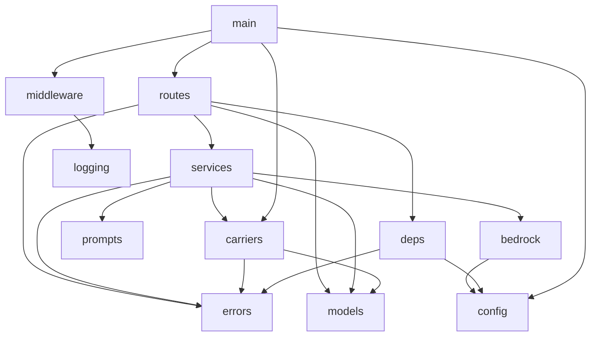
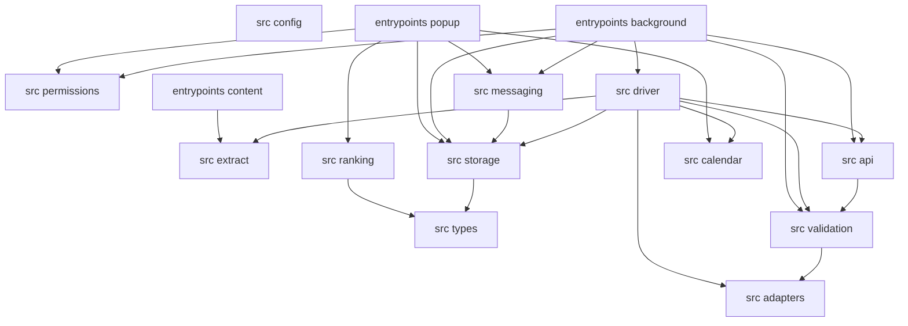

# Boomerang — Implementation Plan

This plan breaks [`design/boomerang-low-level-design.md`](../design/boomerang-low-level-design.md)
into implementable tasks organized by execution batch. Tasks within a batch can be worked on
according to their track assignments. All tasks in a batch must complete before committing and
moving to the next batch.

**Total Tasks:** 79
**Batches:** 10
**Critical Path Length:** 19 tasks
**Max Parallel Tracks:** 10 (in Batch 3)

---

## Reading this plan

**Two workspaces, almost entirely independent.** `server/` (FastAPI, Python 3.13, `uv`) and
`extension/` (WXT, MV3, TypeScript, `bun`) share no files, no build, and no test runner. They meet
only at the wire contract of the seven endpoints — which is a *duplicated* type by design
(low-level design §3.5), not a shared module. So the server track and the extension track are
**truly parallel from Batch 1 to Batch 7**, and that is where nearly all the parallelism in this
plan lives.

**`client/` is out of scope, deliberately.** Low-level design §1 excludes it: phase 1 is a landing
page with no logic and phase 2 renders a list it does not compute. FR-3.6.2 therefore has no task
here and is recorded as an explicit gap in the traceability table rather than silently missing.

**Unit tests live inside their implementation task; integration tests are their own tasks.** The
§8.2 table is a per-module contract, and `implement-task-code` writes tests first — so splitting a
module from its unit rows would produce a task that cannot be executed under TDD at all. §8.3 rows
are different: they exercise a wired graph across several modules, so they depend on those modules
and get their own tasks. Test *infrastructure* — the fake browser, the fixture harness, the ASGI
app factory — is always its own task, because several tasks depend on it.

**`extension/` does not exist yet.** Task 1.2 creates it, alongside its own `AGENTS.md` as the
repo-level [`AGENTS.md`](../AGENTS.md) map already anticipates.

---

## Package Dependency Graph

### Server — `server/app/`



Layering rule from §2.1: **routes never call `carriers` or `bedrock` directly, and services never
import `fastapi`.** `middleware` is around the app rather than above routes, which is why nothing
calls into it.

### Extension — `extension/src/`



`src/types/` and `src/config.ts` are leaves that every module may import — §2.2's exemption. The
graph is otherwise **complete and prohibitive**: an edge not drawn is not permitted.

---

## Batch Execution Overview

```
Batch 1: Workspace scaffolding
  Track A (serial): 1.1                              [server]
  Track B (serial): 1.2                              [extension]
  --- Tracks A, B: PARALLEL (different workspaces) ---
  >>> Commit checkpoint: both workspaces build and run a green empty suite

Batch 2: Foundations
  Track A (serial): 2.1                              [server errors]
  Track B (serial): 2.2                              [server config]
  Track C (serial): 2.3                              [server logging]
  Track D (serial): 2.4                              [extension types]
  Track E (serial): 2.5                              [extension config]
  Track F (serial): 2.6 -> 2.7                       [extension test fakes]
  Track G (serial): 2.8                              [extension fixtures]
  --- All tracks PARALLEL ---
  >>> Commit checkpoint: shared vocabulary and the fake browser exist

Batch 3: Schemas, protocols, leaf modules
  Track A (serial): 3.1 -> 3.2 -> 3.3 -> 3.4 -> 3.5  [server models and carrier protocol]
  Track B (serial): 3.6                              [server middleware]
  Track C (serial): 3.8                              [server deps]
  Track D (serial): 3.9 -> 3.10                      [extension extract]
  Track E (serial): 3.11                             [extension ranking]
  Track F (serial): 3.12                             [extension calendar]
  Track G (serial): 3.13 -> 3.14                     [extension adapters]
  Track H (serial): 3.17                             [extension permissions]
  Track I (deferred): 3.7                            [server window, after 3.2]
  Track J (deferred): 3.15 -> 3.16                   [extension validation, after 3.13]
  --- Tracks A, B, C PARALLEL with D..J ---
  --- 3.7 CONFLICT-free but sequenced after 3.2 ---
  >>> Commit checkpoint: every boundary type exists on both sides

Batch 4: Model boundary, carriers, storage, egress
  Track A (serial): 4.2 -> 4.1                       [server bedrock and prompts]
  Track B (serial): 4.3 -> 4.4 -> 4.5                [server carriers usps]
  Track C (serial): 4.6 -> 4.7 -> 4.8 -> 4.9 -> 4.10 -> 4.11 -> 4.12   [extension storage]
  Track D (serial): 4.13                             [extension api]
  --- Tracks A, B PARALLEL; C, D PARALLEL; server and extension PARALLEL ---
  >>> Commit checkpoint: all persistence and all upstream clients exist

Batch 5: Services and driver collaborators
  Track A (serial): 5.1                              [server ingest]
  Track B (serial): 5.2                              [server action]
  Track C (serial): 5.3                              [server pickup]
  Track D (serial): 5.4 -> 5.5                       [extension driver collaborators]
  Track E (serial): 5.6                              [extension messaging]
  --- All tracks PARALLEL ---
  >>> Commit checkpoint: business logic is complete and unit-tested on both sides

Batch 6: Routes and app; driver core
  Track A (serial): 6.1 -> 6.2 -> 6.3 -> 6.4 -> 6.5  [server routes and main]
  Track B (serial): 6.6 -> 6.7 -> 6.8                [extension driver]
  --- Tracks A, B PARALLEL ---
  >>> Commit checkpoint: the server serves all seven endpoints; the driver drives

Batch 7: Server integration tests; driver flows
  Track A (serial): 7.1                              [server integration harness]
  Track B (parallel after 7.1): 7.2, 7.3, 7.4, 7.5, 7.6
  Track C (serial): 7.7 -> 7.8 -> 7.9 -> 7.10        [extension driver flows]
  --- Tracks A/B PARALLEL with C ---
  >>> Commit checkpoint: the server is done and green; the return flow is complete

Batch 8: Entrypoints and wiring
  Track A (serial): 8.1 -> 8.2                       [extension worker and content]
  Track B (serial): 8.3 -> 8.4 -> 8.5                [extension popup]
  --- Tracks A, B CONFLICT-free but B depends on 8.2 for messaging ---
  >>> Commit checkpoint: the extension loads and runs end to end by hand

Batch 9: Extension integration tests
  Track A (serial): 9.1                              [harness]
  Track B (parallel after 9.1): 9.2, 9.3, 9.4, 9.5, 9.6, 9.7
  >>> Commit checkpoint: every FR has a passing assertion

Batch 10: Build gates and repository checks
  Track A: 10.1    Track B: 10.2    Track C: 10.3
  --- All PARALLEL ---
  >>> Commit checkpoint: CI enforces what review would otherwise have to
```

---

## Batch 1: Workspace Scaffolding

### Track A: Server test harness [server]

#### Task 1.1: Server test scaffolding and dev dependencies

**Prerequisites:** None
**Conflicts with:** None
**Parallel with:** Task 1.2 (Track B — different workspace)
**Package:** `server`

**Objective:** Give `server/` a test runner, a layout that matches the §8 split, and a green empty suite, so every later server task can be written test-first.

**Instructions:**
1. Add dev dependencies to `server/pyproject.toml` under `[dependency-groups] dev`: `pytest`,
   `pytest-asyncio`, `anyio`, `respx` (or plain `httpx.MockTransport` — §8.1 requires transport-level
   mocking, not client-object monkeypatching; pick one and use it everywhere).
2. Configure in `pyproject.toml`: `[tool.pytest.ini_options]` with `asyncio_mode = "auto"`,
   `testpaths = ["tests"]`, and strict markers.
3. Create `server/tests/__init__.py`, `server/tests/unit/__init__.py`,
   `server/tests/integration/__init__.py`.
4. Create `server/tests/conftest.py` with only an `anyio_backend` fixture pinned to `asyncio` for now.
   Later tasks add fixtures here — note in a `# dev-note:` that this file is a shared-conflict point.
5. Add one trivial test asserting the package imports, so the suite is non-empty.
6. Reference: Low-Level Design §8.1 (test approach), §8.5 (what is not tested).

**Verification:**
- `cd server && uv sync && uv run pytest` — passes, collects at least one test.
- `cd server && uv run python -c "import app.main"` — still imports.

**Requirements covered:** —

---

### Track B: Extension workspace [extension]

#### Task 1.2: WXT project scaffold and MV3 manifest

**Prerequisites:** None
**Conflicts with:** None
**Parallel with:** Task 1.1 (Track A — different workspace)
**Package:** `extension`

**Objective:** Create the `extension/` workspace with WXT, TypeScript, vitest and the MV3 manifest, and assert the manifest's permission posture in a test.

**Instructions:**
1. Create `extension/` with `package.json` (bun, matching the repo's toolchain), `tsconfig.json`
   (strict), `wxt.config.ts`, and `vitest.config.ts`.
2. In `wxt.config.ts`, declare the manifest:
   - `permissions: ["activeTab", "scripting", "storage"]` — **nothing else at install**.
   - `optional_host_permissions` for the retailer origins (requested later, in context).
   - `externally_connectable.matches` limited to the dashboard origin (FR-3.6.3).
   - An explicit extension CSP with no remote script.
   - No `unlimitedStorage`.
3. Add `extension/AGENTS.md` following the pattern of `server/AGENTS.md`: local scope, phase, and the
   subset of the repo rules that bite hardest here — rules 8 and 9 from the repo
   [`AGENTS.md`](../AGENTS.md), and "the extension must never hold a carrier or retailer credential."
4. Add `extension/tests/manifest.test.ts` asserting, against the built manifest object:
   - the permission array is exactly the three above;
   - no `<all_urls>` appears anywhere in the manifest;
   - `externally_connectable` names the dashboard origin and no wildcard.
5. Create empty `extension/src/` and `extension/entrypoints/` directories with a `.gitkeep`.
6. Reference: Low-Level Design §7.2 (manifest), §8.2 (manifest assertions); requirements FR-3.7.1,
   FR-3.6.3, NFR-6.5; repo `AGENTS.md` rule 8.

**Verification:**
- `cd extension && bun install && bun run build` — WXT produces `.output/chrome-mv3/`.
- `cd extension && bun run test` — the manifest test passes.

**Requirements covered:** FR-3.7.1, FR-3.6.3, NFR-6.5

---

### Batch 1 Commit Checkpoint

After all tracks complete:
- [ ] Server installs and tests run: `cd server && uv run pytest`
- [ ] Extension builds: `cd extension && bun run build`
- [ ] Extension tests run: `cd extension && bun run test`
- [ ] Both workspaces have a place to put test-first code, and the manifest posture is now guarded
      by an assertion rather than by memory.

---

## Batch 2: Foundations

### Track A: Server error taxonomy [server]

#### Task 2.1: `app/errors.py` — the exception hierarchy

**Prerequisites:** Task 1.1
**Conflicts with:** None
**Parallel with:** Tasks 2.2, 2.3, 2.4–2.8
**Package:** `server/app`

**Objective:** Define the one exception base every service raises, with each subclass carrying its
`reason` string and HTTP status as class attributes, so the wire contract of §4.2 cannot drift.

**Instructions:**
1. Create `server/app/errors.py` with `BoomerangError(Exception)` carrying class-level `reason: str`
   and `status: int`, plus an optional `detail` for the log (never the response body).
2. Subclass one per reason in the **closed** table of requirements §4.2 — and only those:
   `unrecognized-page`, `wrong-carrier-label`, `address-not-serviceable`, `location-not-serviceable`,
   `etag-expired`, `upstream-unavailable`, `payload-too-large`, `label-not-printed`, `client-too-old`.
   The list is closed: a failure that fits none of these is one of these, not a tenth reason.
3. Each class carries `reason`, `status`, and a `message` — one sentence a human can act on — plus an
   optional `details` mapping that is **absent** by default. `location-not-serviceable` is its one
   occupant, carrying `details.servable_locations`: the reduced set FR-3.4.8 requires the user be
   re-asked from, because substituting a location on their behalf is forbidden.
4. `address-not-serviceable` is an error **only** on the schedule path. FR-3.4.1 makes a negative
   eligibility answer a *successful* response carrying that same reason in the normal result body, so
   the eligibility route must never raise this class — one endpoint, one body shape. `# dev-note:`
   this on the class itself; it is the single most inviting mistake in the file.
5. The reason string, status and message live on the class and nowhere else. A `# dev-note:` should
   say why: the response body is generated from the class, so adding a reason means adding a class.
6. Unit tests (`tests/unit/test_errors.py`): every subclass has a non-empty distinct `reason`; every
   `reason` matches `^[a-z]+(-[a-z]+)*$` (kebab-case, per §4.2); `details` is absent unless the class
   documents it; the set of reasons matches the documented table exactly (assert against a literal
   list in the test, so both an undocumented addition and a quiet removal fail).
7. Reference: Low-Level Design §6.1, §6.2; requirements §4.2, FR-3.4.1, FR-3.4.8.

**Verification:**
- `cd server && uv run pytest tests/unit/test_errors.py`

**Requirements covered:** §4.2, FR-3.4.1, FR-3.4.8, NFR-6.3

---

### Track B: Server configuration [server]

#### Task 2.2: `app/config.py` — `Settings` and fail-fast validation

**Prerequisites:** Task 1.1
**Conflicts with:** None
**Parallel with:** Tasks 2.1, 2.3, 2.4–2.8
**Package:** `server/app`

**Objective:** Load every environment variable from requirements §5.1/§5.2 into one validated
`Settings` object that refuses to construct when a required value is missing or malformed.

**Instructions:**
1. Create `server/app/config.py` with a pydantic-settings `Settings` model covering the full §5.1
   table: Bedrock model ids per call site, region, max tokens, USPS credentials and base URL, the
   allowed CORS origins, the minimum supported client version, upstream timeouts and the request
   deadline, the payload ceiling, and the log level.
2. **No defaults for anything a wrong value would silently break** — follow the existing
   `app/bedrock.py` precedent, which deliberately gives `BEDROCK_MODEL` no default and names
   `ListInferenceProfiles` in the failure message. Timeouts and ceilings may have defaults; identity,
   endpoints and version floors may not.
3. Provide `get_settings()` with `lru_cache` — one instance per warm container (§5.1).
4. Validators: origins parse to a non-empty list of absolute origins; the minimum client version
   parses as a version; timeouts are positive; the payload ceiling is positive and below the
   Function URL body limit.
5. Unit tests: each required variable missing raises, and the message names the variable; a malformed
   origin list raises; `get_settings()` returns the same object twice.
6. Reference: Low-Level Design §7.1; requirements §5.1, §5.2.

**Verification:**
- `cd server && uv run pytest tests/unit/test_config.py`

**Requirements covered:** §5.1, NFR-6.5, NFR-6.6, NFR-6.7

---

### Track C: Server logging [server]

#### Task 2.3: `app/logging.py` — redacting formatter and request-id binding

**Prerequisites:** Task 1.1
**Conflicts with:** None
**Parallel with:** Tasks 2.1, 2.2, 2.4–2.8
**Package:** `server/app`

**Objective:** Make the logger structurally incapable of emitting page content or carrier
credentials, and give every log line the request id.

**Instructions:**
1. Create `server/app/logging.py` with a `request_id` `ContextVar` and `bind_request_id(value)`.
2. Implement a JSON formatter that emits **only an allowlist** of fields. §6.2 is explicit that this
   is an allowlist, not a denylist — a new field is invisible until it is added, which is the safe
   direction. Add a `# dev-note:` saying so.
3. Fields: timestamp, level, logger, message, `request_id`, and a bounded `extra` whose keys are
   themselves allowlisted (e.g. `reason`, `endpoint`, `status`, `duration_ms`, `retailer_key`).
4. Never log: extracted DOM, order contents, addresses, tracking numbers, USPS credentials, Bedrock
   prompt or completion bodies.
5. Unit tests: a record carrying a payload field emits without it; a record with an allowlisted extra
   emits with it; the request id appears when bound and is absent (not `null`-crashing) when not;
   two concurrent tasks binding different ids do not see each other's (this is the contextvar
   isolation §8.3 later exercises end to end).
6. Reference: Low-Level Design §6.2; requirements NFR-6.3.

**Verification:**
- `cd server && uv run pytest tests/unit/test_logging.py`

**Requirements covered:** §4.2, NFR-6.1

---

### Track D: Extension shared vocabulary [extension]

#### Task 2.4: `src/types/` — entities, session, and the state enums

**Prerequisites:** Task 1.2
**Conflicts with:** None
**Parallel with:** Tasks 2.1–2.3, 2.5–2.8
**Package:** `extension/src/types`

**Objective:** Define every persisted entity and cross-module type in one leaf module that everything
may import and that imports nothing.

**Instructions:**
1. Create `extension/src/types/` with the entity types from §3.5: `Order`, `OrderItem`,
   `ReturnRequest`, `Pickup`, `Address`, `BookedAddress`, `DriverSession`, `RankedItem`,
   `ProposedAction`, `ValidatedAction` (constructor-private — see Task 3.15), `ReturnMethodOption`.
2. `DriverSession` carries exactly: `state`, `item_id`, `order_id`, `retailer_key`, `tab_id`,
   `tab_url`, `step_key`, `chosen_option`, `attempt_count`, `started_at`, `last_written_at`,
   `schema_version`. `chosen_option` is nullable — the free-drop-off branch never makes a choice.
   Carry §3.5's rationale into a `// dev-note:`: it exists because the worker dies between the choice
   and the label page, and a value held only in memory across two transitions is sometimes not there.
3. Define the FR-3.3.9 return state union: `AwaitingLabelChoice`, `Driving`, `LabelReady`,
   `AwaitingConfirm`, `Stalled`, and the four terminals `LabelPrinted`, `DroppedOff`, `HandedOff`,
   `Aborted`. Define the pickup state union including the read-time-derived `Abandoned` and
   `Collected`.
4. Define `ActionKind` as a closed union of exactly `click`, `select_option`, `fill`,
   `pause_for_user`, `report_stuck` — the extension's mirror of the server's enum.
5. Every persisted type carries `schema_version`.
6. Unit tests: type-level tests are cheap here — add a `expectTypeOf`/`assertType` suite pinning
   `ActionKind` to five members and the terminal set to four, so widening either fails the build.
7. Reference: Low-Level Design §3.5; requirements FR-3.3.9, FR-3.3.5.

**Verification:**
- `cd extension && bun run test tests/types` and `bunx tsc --noEmit`

**Requirements covered:** FR-3.3.5, FR-3.3.8, FR-3.3.9

---

### Track E: Extension build-time config [extension]

#### Task 2.5: `src/config.ts` — build-time constants

**Prerequisites:** Task 1.2
**Conflicts with:** None
**Parallel with:** Tasks 2.1–2.4, 2.6–2.8
**Package:** `extension/src`

**Objective:** Put every value that differs between dev and prod behind WXT's define substitution, so
a dev value in a prod bundle is a build-time fact rather than a runtime surprise.

**Instructions:**
1. Create `extension/src/config.ts` exporting the constants from §7.2: `API_BASE_URL`,
   `CLIENT_VERSION`, `DASHBOARD_ORIGIN`, `MODEL_FALLBACK_TIMEOUT_MS`, `PAYLOAD_CEILING_BYTES`,
   `STORAGE_CAP_BYTES`, `STORAGE_EVICTION_MARGIN_BYTES`, `API_TIMEOUT_MS`, `RETURN_ATTEMPT_LIMIT`.
2. Wire the environment-varying ones through WXT `define` in `wxt.config.ts` so they are substituted
   at build time, not read at runtime.
3. Unit tests: each constant is defined and of the right type; the numeric ones are positive; the
   eviction margin is smaller than the cap.
4. Reference: Low-Level Design §7.2.

**Verification:**
- `cd extension && bun run test tests/config.test.ts`

**Requirements covered:** §5.1, NFR-6.4

---

### Track F: Extension fake browser [extension]

#### Task 2.6: Fake `chrome.storage.local`

**Prerequisites:** Task 1.2
**Conflicts with:** Task 2.7 (both add to `extension/tests/fakes/chrome.ts`)
**Parallel with:** Tasks 2.1–2.5, 2.8
**Package:** `extension/tests/fakes`

**Objective:** Build a storage double that reproduces the three properties §8.1 says the real API has
and that the design depends on — per-`set` atomicity, a hard quota, and a `getBytesInUse` consistent
with what was written.

**Instructions:**
1. Create `extension/tests/fakes/chrome-storage.ts` implementing `get`, `set`, `remove`, `clear`,
   `getBytesInUse` over an in-memory map.
2. **Atomicity:** a single `set` with several keys either applies wholly or not at all. Interleaving
   two `set` calls must be observable in tests, because §4.3's whole reason for existing is that
   `chrome.storage.local` gives no multi-key transaction.
3. **Quota:** expose `armQuotaRejection()` so a test can make the next `set` fail the way the real
   API does, and make `getBytesInUse` reflect the *pre-failure* state afterwards.
4. `getBytesInUse` must be computed from the serialized values, not stubbed — the eviction logic in
   Task 4.12 measures with it and would pass against a lying double.
5. Unit tests for the fake itself: a rejected `set` leaves no partial write; `getBytesInUse` grows
   and shrinks with writes and removes.
6. Reference: Low-Level Design §8.1, §4.3, §5.2.

**Verification:**
- `cd extension && bun run test tests/fakes/chrome-storage.test.ts`

**Requirements covered:** —

---

#### Task 2.7: Fake `tabs`, `scripting`, `permissions`, worker lifecycle, and clock

**Prerequisites:** Task 2.6
**Conflicts with:** Task 2.6 (both add to `extension/tests/fakes/chrome.ts`)
**Parallel with:** Tasks 2.1–2.5, 2.8
**Package:** `extension/tests/fakes`

**Objective:** Complete the fake browser with the surfaces the driver and permission flow touch, plus
the two doubles that make the design's hardest tests possible: worker termination and a controllable
clock.

**Instructions:**
1. `extension/tests/fakes/chrome-tabs.ts` — `create`, `update`, `get`, `remove`, `onRemoved`, with a
   settable current URL and a way to close a tab so `TabHandle.is_live` goes false.
2. `extension/tests/fakes/chrome-scripting.ts` — `executeScript` returning a DOM string a test
   supplies per tab and step.
3. `extension/tests/fakes/chrome-permissions.ts` — `contains`, `request` (grant or deny per test),
   `remove`, and a gesture flag so a `request` outside a gesture can be made to fail the way the real
   API does.
4. `extension/tests/fakes/worker-lifecycle.ts` — a `WorkerLifecycle` double with `terminate()` that
   discards **all** in-memory state and forces the next call to go through rehydration. This is the
   double that makes §8.3's two worker-death rows meaningful; if it does not actually drop memory,
   both rows pass vacuously.
5. `extension/tests/fakes/clock.ts` — an injectable clock, since §8.5 rules out sleeping in tests and
   §3.5's `first_seen_at` / window derivation are time-dependent.
6. Assemble `extension/tests/fakes/chrome.ts` composing all of the above into one `globalThis.chrome`
   installer with a `reset()`.
7. Unit tests for the fakes: terminate loses memory but not storage; a permission request outside a
   gesture rejects; a closed tab reports not live.
8. Reference: Low-Level Design §8.1, §4.4, §3.4.

**Verification:**
- `cd extension && bun run test tests/fakes`

**Requirements covered:** —

---

### Track G: Extension DOM fixtures [extension]

#### Task 2.8: Retailer DOM fixture harness

**Prerequisites:** Task 1.2
**Conflicts with:** None
**Parallel with:** Tasks 2.1–2.7
**Package:** `extension/tests/fixtures`

**Objective:** Establish where captured retailer pages live, how they are scrubbed, and how a test
loads one — the convention §9 Q1 leaves open and every adapter test depends on.

**Instructions:**
1. Create `extension/tests/fixtures/retailers/{retailer_key}/{step_key}.html` as the layout, with one
   placeholder retailer and the steps the PoC flow walks.
2. Write `extension/tests/fixtures/load.ts` exposing `load_fixture(retailer_key, step_key)` returning
   a parsed DOM.
3. Write `extension/tests/fixtures/README.md` fixing the **scrubbing convention**, which is the part
   that matters: real names, addresses, order numbers, tracking numbers, emails and any auth token
   are replaced with stable synthetic values before a capture is committed. State that a fixture is
   committed only after scrubbing, and that scrubbing is manual and reviewed — this closes §9 Q1 with
   a written answer rather than an implicit one.
4. Add a fixture lint test: no committed fixture matches the tracking-number or postal-address
   patterns from Task 3.10 except in the synthetic forms the README declares. This makes the
   convention enforced rather than aspirational.
5. Reference: Low-Level Design §8.1, §9 Q1.

**Verification:**
- `cd extension && bun run test tests/fixtures`

**Requirements covered:** NFR-6.1, NFR-6.3

---

### Batch 2 Commit Checkpoint

After all tracks complete:
- [ ] Server tests pass: `cd server && uv run pytest`
- [ ] Extension type-checks and tests pass: `cd extension && bunx tsc --noEmit && bun run test`
- [ ] The server has its error taxonomy, validated settings, and a redacting logger.
- [ ] The extension has its shared type vocabulary, its build-time constants, a fake browser that can
      kill a worker and reject a quota, and a fixture convention with a lint behind it.

---

## Batch 3: Schemas, Protocols, Leaf Modules

### Track A: Server request and response models [server]

#### Task 3.1: `app/models/common.py` — strict base model and the error body

**Prerequisites:** Task 2.1
**Conflicts with:** Tasks 3.2, 3.3, 3.4 (all re-export through `app/models/__init__.py`)
**Parallel with:** Tasks 3.6, 3.8, 3.9–3.17
**Package:** `server/app/models`

**Objective:** Establish the strictness every wire model inherits, so an unexpected field is a 422
rather than a silently ignored one.

**Instructions:**
1. Create `server/app/models/common.py` with a `StrictModel` base: `model_config` sets
   `extra="forbid"`, `str_strip_whitespace=True`, and `frozen=True` where the model is a value.
2. Define bounded string types (max lengths) used across the payloads — the ceiling is enforced at
   the boundary, not by trusting the client.
3. Define `ErrorBody` with exactly the §4.2 shape and nothing more:
   ```python
   reason: str        # kebab-case code from the closed table
   message: str       # one sentence a human can act on
   request_id: str    # the opaque per-request correlator, not a session id
   details: dict | None = None   # omitted from the JSON when absent
   ```
   plus `from_error(err: BoomerangError, request_id: str) -> ErrorBody`. Serialisation must **omit**
   `details` rather than emit `null` — the documented default is absent.
4. Unit tests: an extra field raises; an over-long string raises; `from_error` produces the documented
   shape for a sample of subclasses; a class with no `details` serialises to exactly three keys; the
   `location-not-serviceable` class serialises `details.servable_locations`.
5. Reference: Low-Level Design §3.1, §6.2; requirements §4.2.

**Verification:**
- `cd server && uv run pytest tests/unit/models/test_common.py`

**Requirements covered:** §4.2, NFR-6.1

---

#### Task 3.2: `app/models/orders.py` — ingestion payloads

**Prerequisites:** Task 3.1
**Conflicts with:** Tasks 3.1, 3.3, 3.4 (`app/models/__init__.py`)
**Parallel with:** Tasks 3.6, 3.8, 3.9–3.17
**Package:** `server/app/models`

**Objective:** Model the extraction payload the extension sends and the parsed orders the server
returns.

**Instructions:**
1. Create `server/app/models/orders.py`: `IngestRequest` (retailer key, page URL, extracted content,
   captured-at instant), `OrderItemSchema`, `OrderSchema`, `IngestResponse`.
2. Enforce the payload ceiling on the extracted content field — the request is rejected with
   `payload-too-large` before any model call. The ceiling comes from `Settings`, so accept it as a
   validation context rather than hardcoding.
3. `OrderSchema` carries the fields FR-3.2.1 needs for window derivation: order date,
   delivery date if known, item identity, and the retailer's stated return policy window if present.
4. Unit tests: a payload one byte over the ceiling raises; a well-formed payload round-trips; a
   missing required order field raises.
5. Reference: Low-Level Design §3.1, §4.1; requirements FR-3.1.4, FR-3.2.1, §4.1.

**Verification:**
- `cd server && uv run pytest tests/unit/models/test_orders.py`

**Requirements covered:** FR-3.1.3, FR-3.1.4, FR-3.2.1

---

#### Task 3.3: `app/models/returns.py` — `ActionKind` and `ProposedAction`

**Prerequisites:** Task 3.1
**Conflicts with:** Tasks 3.1, 3.2, 3.4 (`app/models/__init__.py`)
**Parallel with:** Tasks 3.6, 3.8, 3.9–3.17
**Package:** `server/app/models`

**Objective:** Define the closed action vocabulary as one enum, and the proposed-action model whose
per-kind field rules make a malformed action unconstructable.

**Instructions:**
1. Create `server/app/models/returns.py` with `ActionKind` as a `StrEnum` of exactly five members:
   `click`, `select_option`, `fill`, `pause_for_user`, `report_stuck`.
2. Add a `# dev-note:` recording that **this enum is the single source the tool schema's `enum` is
   generated from** (Task 4.1) — the two must never be written out twice, because a divergence is
   exactly the hole repo rule 9 exists to close.
3. `ProposedAction` with per-kind validation: `click` requires a selector and nothing else;
   `select_option` requires selector plus option; `fill` requires selector plus value; `pause_for_user`
   requires a reason string and no selector; `report_stuck` requires a reason and no selector.
   Cross-field validation rejects any other combination.
4. `NextStepRequest` (retailer key, step key, page content, prior action outcome, fillable field
   descriptors) and `NextStepResponse` (the `ProposedAction`).
5. Unit tests: `len(ActionKind) == 5` asserted literally; a `fill` without a value raises; a `click`
   with a value raises; an action kind outside the enum raises.
6. Reference: Low-Level Design §3.1, §4.2; requirements FR-3.3.8; repo `AGENTS.md` rule 9.

**Verification:**
- `cd server && uv run pytest tests/unit/models/test_returns.py`

**Requirements covered:** FR-3.3.8

---

#### Task 3.4: `app/models/pickups.py` — address, eligibility, schedule, refresh, cancel

**Prerequisites:** Task 3.1
**Conflicts with:** Tasks 3.1, 3.2, 3.3 (`app/models/__init__.py`)
**Parallel with:** Tasks 3.6, 3.8, 3.9–3.17
**Package:** `server/app/models`

**Objective:** Model the four pickup endpoints, including the one field the architecture forbids
storing and the one it requires.

**Instructions:**
1. Create `server/app/models/pickups.py`: `Address`, `EligibilityRequest`, `EligibilityResult`
   (serviceable flag plus the carrier's own reason), `ScheduleRequest`, `ScheduledPickup`
   (`confirmation_number`, the address it was booked against, the **day** USPS named),
   `RefreshedPickup`, `CancelRequest`.
2. **`ScheduledPickup` has no `ETag` field, and must not gain one.** Add a `# dev-note:` citing repo
   `AGENTS.md` rule 3: the ETag is good for one hour or one use, so cancellation refreshes to obtain
   a current one rather than replaying a stored one. The absence of the field is the enforcement.
3. **No time-window field either** — a day, never a window (rule 5). Name the field for a day and
   type it as a date, so a window cannot be smuggled into it.
4. `ScheduleRequest` requires the carrier whose postage is on the box (rule 4) — scheduling is gated
   on that, not on "a label exists."
5. Unit tests: `ScheduledPickup` rejects an `etag` field (it is `extra="forbid"`, so this is a real
   assertion); the day field rejects a datetime range; a `ScheduleRequest` without the postage
   carrier raises.
6. Reference: Low-Level Design §3.1, §4.3; requirements FR-3.4.1–FR-3.4.8, §4.1; repo `AGENTS.md`
   rules 3, 4, 5.

**Verification:**
- `cd server && uv run pytest tests/unit/models/test_pickups.py`

**Requirements covered:** FR-3.4.3, FR-3.4.5, FR-3.4.5a, FR-3.4.8

---

#### Task 3.5: `app/carriers/base.py` — the `CarrierAdapter` protocol

**Prerequisites:** Task 3.4
**Conflicts with:** None
**Parallel with:** Tasks 3.6, 3.8, 3.9–3.17
**Package:** `server/app/carriers`

**Objective:** Define the carrier seam as a `Protocol` so the service layer depends on a shape, and
the mock in Task 4.5 is a peer of the real adapter rather than a patch over it.

**Instructions:**
1. Create `server/app/carriers/__init__.py` and `server/app/carriers/base.py`.
2. Define `CarrierAdapter` as a `typing.Protocol` with the four operations — check eligibility,
   schedule, refresh, cancel — plus servable-locations lookup, all `async`, all typed against the
   Task 3.4 models.
3. Every method's contract note says which `BoomerangError` subclass it may raise; the protocol is
   where that is written down, because two implementations must agree on it.
4. Unit tests: a deliberately incomplete stub fails a `runtime_checkable` structural check, pinning
   the method set.
5. Reference: Low-Level Design §3.2, §2.1.

**Verification:**
- `cd server && uv run pytest tests/unit/carriers/test_base.py`

**Requirements covered:** FR-3.4.1, FR-3.4.8, NFR-6.3

---

### Track B: Server middleware [server]

#### Task 3.6: `app/middleware.py` — request id

**Prerequisites:** Task 2.3
**Conflicts with:** None
**Parallel with:** Tasks 3.1–3.5, 3.8–3.17
**Package:** `server/app`

**Objective:** Generate or accept a request id per request, bind it for the duration, and return it on
the response.

**Instructions:**
1. Create `server/app/middleware.py` with an ASGI middleware that reads an inbound request-id header
   if present and well-formed, otherwise generates one; binds it via `bind_request_id`; sets it on the
   response header; and resets the contextvar on the way out.
2. Resetting matters on Lambda: the container is reused, so a leaked contextvar would attach the
   previous invocation's id to the next one.
3. Unit tests: an inbound id is echoed; an absent id yields a generated one; a malformed inbound id is
   replaced rather than trusted; the contextvar is clear after the response.
4. Reference: Low-Level Design §6.2, §7.1.

**Verification:**
- `cd server && uv run pytest tests/unit/test_middleware.py`

**Requirements covered:** §4.2, NFR-6.1

---

### Track C: Server dependencies and version gate [server]

#### Task 3.8: `app/deps.py` — app-state accessors and the client version gate

**Prerequisites:** Task 2.1, Task 2.2
**Conflicts with:** None
**Parallel with:** Tasks 3.1–3.6, 3.9–3.17
**Package:** `server/app`

**Objective:** Provide the FastAPI dependencies routes use to reach settings and the carrier adapter,
and the version gate that rejects an unsupported client **before** any model or carrier call.

**Instructions:**
1. Create `server/app/deps.py` with `get_settings_dep` and `get_carrier_adapter` reading from
   `request.app.state` — the objects are constructed once in `main.py` (Task 6.5), not per request.
2. Implement `require_supported_client` as a dependency: parse the client-version header, compare to
   `Settings.min_client_version`, raise `UnsupportedClientVersion` if below or absent.
3. **The gate runs before the handler body.** §8.3 asserts on two endpoints that no upstream call
   happens on rejection, so it must be a dependency, not a first line inside each handler.
4. Unit tests: a version below the floor raises; an absent header raises; a version at the floor
   passes; a malformed version raises rather than being treated as new.
5. Reference: Low-Level Design §3.3, §7.1; requirements §4.2 (`client-too-old`), §5.1.

**Verification:**
- `cd server && uv run pytest tests/unit/test_deps.py`

**Requirements covered:** §4.2 (`client-too-old`), §5.1

---

### Track I: Server window derivation [server]

#### Task 3.7: `app/services/window.py` — return-window derivation and urgency

**Prerequisites:** Task 3.2
**Conflicts with:** None
**Parallel with:** Tasks 3.6, 3.8, 3.9–3.17
**Package:** `server/app/services`

**Objective:** Derive each item's return deadline from the order and policy facts, as a pure function
of its inputs and an injected instant.

**Instructions:**
1. Create `server/app/services/__init__.py` and `server/app/services/window.py` with
   `derive_window(order, item, now)` returning the deadline and the basis it was derived from.
2. Handle the precedence FR-3.2.1 sets out: an explicit retailer-stated deadline wins; then a
   policy window measured from the delivery date; then from the order date; and when none of them is
   available, return an **undetermined** result rather than guessing a default window.
3. `now` is a parameter. No `datetime.now()` inside — §8.5 rules out sleeping and §8.2 tests this
   across boundary dates.
4. Unit tests: each precedence branch; the undetermined branch; day-boundary behaviour; an item whose
   deadline has already passed.
5. Reference: Low-Level Design §3.3, §4.1; requirements FR-3.2.1, FR-3.2.2.

**Verification:**
- `cd server && uv run pytest tests/unit/services/test_window.py`

**Requirements covered:** FR-3.2.1, FR-3.2.2

---

### Track D: Extension extraction and egress scan [extension]

#### Task 3.9: `src/extract/` — subtree selection and sanitisation

**Prerequisites:** Task 2.4, Task 2.5, Task 2.8
**Conflicts with:** Task 3.10 (both export from `src/extract/index.ts`)
**Parallel with:** Tasks 3.1–3.8, 3.11–3.17
**Package:** `extension/src/extract`

**Objective:** Turn a live order page into the bounded, script-free text the server is allowed to see.

**Instructions:**
1. Create `extension/src/extract/extract.ts` with `extract(document, adapter)`:
   - select the subtree the adapter names, not the whole document;
   - strip `<script>`, `<style>`, inline event handlers, and `data:` URIs;
   - normalise whitespace;
   - truncate at `PAYLOAD_CEILING_BYTES` measured in **bytes, not characters**.
2. Truncation must be deterministic and must not split a multi-byte character.
3. Unit tests, using Task 2.8 fixtures: a page with inline handlers loses them; a page over the
   ceiling comes back exactly at or under it; the same page extracts identically twice; a page whose
   subtree is missing yields an explicit empty result rather than falling back to `document.body`.
4. Reference: Low-Level Design §3.4, §4.1; requirements FR-3.1.2, FR-3.1.4, NFR-6.3.

**Verification:**
- `cd extension && bun run test tests/extract/extract.test.ts`

**Requirements covered:** FR-3.1.2, FR-3.1.4

---

#### Task 3.10: `src/extract/` — the fail-closed egress scan

**Prerequisites:** Task 3.9
**Conflicts with:** Task 3.9 (`src/extract/index.ts`)
**Parallel with:** Tasks 3.1–3.8, 3.11–3.17
**Package:** `extension/src/extract`

**Objective:** Provide the pure predicate that decides whether a fallback payload contains a tracking
number or a postal address — the check, and only the check.

**Instructions:**
1. Create `extension/src/extract/egress-scan.ts` exporting `scan_for_pii(text): ScanResult`.
2. Patterns: carrier tracking-number formats (USPS, UPS, FedEx) and US postal-address shapes.
3. **This module decides nothing about what to do with a hit.** §3.4 splits ownership deliberately:
   `src/extract/` owns the scan, `src/driver/` owns the consequence. Add a `// dev-note:` saying so,
   because the natural instinct is to abort right here and that would put policy in a matcher.
4. Fail closed: wrap the whole scan so that **a throw counts as flagged**. A scanner that crashes on
   an odd input must not read as "clean".
5. Unit tests, table-driven: one row per pattern with a positive and a near-miss negative; an input
   that makes the matcher throw returns flagged; an empty string is clean.
6. Reference: Low-Level Design §3.4, §4.2; requirements FR-3.1.3, NFR-6.3.

**Verification:**
- `cd extension && bun run test tests/extract/egress-scan.test.ts`

**Requirements covered:** FR-3.1.3, NFR-6.1

---

### Track E: Extension ranking [extension]

#### Task 3.11: `src/ranking/` — urgency ordering

**Prerequisites:** Task 2.4
**Conflicts with:** None
**Parallel with:** Tasks 3.1–3.10, 3.12–3.17
**Package:** `extension/src/ranking`

**Objective:** Order items by return-window urgency, as a pure function of the items and an injected
instant.

**Instructions:**
1. Create `extension/src/ranking/rank.ts` with `rank(items, now): RankedItem[]`.
2. Soonest deadline first; items whose window is undetermined sort after dated ones rather than being
   dropped; expired items are labelled expired and sorted last.
3. **Stable ordering** — two items with the same deadline keep their input order. §8.2 tests this
   explicitly because the popup re-renders and a jittering list reads as a bug.
4. `now` is a parameter, no clock reads inside.
5. Unit tests: ordering across mixed deadlines; ties preserve input order; undetermined placement;
   expired placement; an empty list.
6. Reference: Low-Level Design §3.4; requirements FR-3.2.3.

**Verification:**
- `cd extension && bun run test tests/ranking`

**Requirements covered:** FR-3.2.2, FR-3.2.3

---

### Track F: Extension calendar [extension]

#### Task 3.12: `src/calendar/` — template URL and `.ics`

**Prerequisites:** Task 2.4, Task 2.5
**Conflicts with:** None
**Parallel with:** Tasks 3.1–3.11, 3.13–3.17
**Package:** `extension/src/calendar`

**Objective:** Produce a calendar reminder as a pre-filled template URL and as a downloadable `.ics`,
with **no OAuth scope of any kind**.

**Instructions:**
1. Create `extension/src/calendar/template-url.ts` building the Google Calendar template URL with
   correctly encoded title, details and date.
2. Create `extension/src/calendar/ics.ts` generating a valid single-`VEVENT` `.ics` with CRLF line
   endings, proper escaping of commas and semicolons in text fields, and line folding at 75 octets.
3. Add a `// dev-note:` on both: this exists because of repo `AGENTS.md` rules 1 and 2 — the template
   URL and the `.ics` are the *reason* the product holds no Google scope, and a task that seems to
   need one has misread the design.
4. Both are pure functions; neither performs navigation or a download — the popup does that.
5. Unit tests: URL encoding of a title containing `&` and spaces; `.ics` escaping of a comma in the
   summary; folding of a long description; the generated `.ics` parses; the date is rendered in the
   expected form.
6. Reference: Low-Level Design §3.4; requirements FR-3.5.1; repo `AGENTS.md` rules 1, 2.

**Verification:**
- `cd extension && bun run test tests/calendar`

**Requirements covered:** FR-3.5.1, FR-3.5.2, FR-3.5.3, FR-3.5.4

---

### Track G: Extension retailer adapters [extension]

#### Task 3.13: `src/adapters/` — adapter type and registry

**Prerequisites:** Task 2.4
**Conflicts with:** Task 3.14 (both export from `src/adapters/index.ts`)
**Parallel with:** Tasks 3.1–3.12, 3.15–3.17
**Package:** `extension/src/adapters`

**Objective:** Define what a retailer adapter is and how one is found, before any concrete adapter
exists.

**Instructions:**
1. Create `extension/src/adapters/types.ts` with the `RetailerAdapter` shape from §3.4:
   `retailer_key`, URL matchers for order pages and return pages, the extraction subtree selector,
   per-step selector maps, `fillable_fields` (the allowlist `fill` is bounded by),
   `carrier_by_option`, `label_carrier_patterns`, and the return-method-option reader.
2. Create `extension/src/adapters/registry.ts` with `for_url(url)` and `for_key(key)`.
3. `for_url` returns `null` on no match — it never guesses a nearest adapter.
4. Unit tests: a registered URL resolves; an unregistered one returns null; `for_key` on an unknown
   key returns null; two adapters cannot register the same key.
5. Reference: Low-Level Design §3.4, §2.2; requirements FR-3.1.1.

**Verification:**
- `cd extension && bun run test tests/adapters/registry.test.ts`

**Requirements covered:** FR-3.1.1

---

#### Task 3.14: The PoC retailer adapter

**Prerequisites:** Task 3.13, Task 2.8
**Conflicts with:** Task 3.13 (`src/adapters/index.ts`)
**Parallel with:** Tasks 3.1–3.12, 3.15–3.17
**Package:** `extension/src/adapters`

**Objective:** Implement one retailer end to end — the PoC scope is one retailer complete, not two
halfway.

**Instructions:**
1. Create `extension/src/adapters/{retailer_key}/index.ts` implementing `RetailerAdapter` against the
   fixtures from Task 2.8.
2. Populate `carrier_by_option` — the mapping from each offered return method to the carrier whose
   postage that method puts on the box. This is **source one** of FR-3.3.5's derivation.
3. Populate `label_carrier_patterns` — patterns matched **locally, on the label page, and never
   transmitted**. Add a `// dev-note:` recording the never-transmitted part.
4. Populate `fillable_fields` with the allowlist of inputs `fill` may target. No password, payment or
   file-upload input may appear in it (repo rule 9); add an assertion in the test rather than only a
   comment.
5. Unit tests, per fixture: each step's selectors resolve against its fixture; the return-method
   option reader returns every option with its price; an option whose price is unreadable comes back
   marked unreadable rather than as zero or free.
6. Reference: Low-Level Design §3.4, §4.6; requirements FR-3.3.1, FR-3.3.4, FR-3.3.5.

**Verification:**
- `cd extension && bun run test tests/adapters`

**Requirements covered:** FR-3.1.1, FR-3.3.4, FR-3.3.5, FR-3.3.7

---

### Track J: Extension validation [extension]

#### Task 3.15: `src/validation/` — the action validator

**Prerequisites:** Task 2.4, Task 3.13
**Conflicts with:** Task 3.16 (both export from `src/validation/index.ts`)
**Parallel with:** Tasks 3.1–3.12, 3.17
**Package:** `extension/src/validation`

**Objective:** Make `ValidatedAction` a type that can only come into existence through this module, so
"was this checked?" is answered by the type rather than by discipline.

**Instructions:**
1. Create `extension/src/validation/action.ts` with `validate_action(proposed, adapter):
   ValidatedAction | ValidationRejection`.
2. `ValidatedAction` carries a private brand — no other module can construct one. Add a
   `// dev-note:` explaining that this is the whole point: `StepExecutor` accepts only
   `ValidatedAction`, so an unvalidated action is a compile error rather than a runtime check
   somebody forgot.
3. Checks: the kind is one of the five; per-kind field rules match Task 3.3's server-side rules; for
   `fill`, the target selector must appear in the adapter's `fillable_fields` — an unknown target is
   rejected, not attempted.
4. Rejections carry a reason the driver can log and act on; the validator never throws for a
   malformed action.
5. Unit tests: each of the five kinds validates in its correct shape; a `fill` at a target outside
   `fillable_fields` rejects; a `fill` at a password-typed field in the fixture rejects; a sixth
   invented kind rejects; a `click` carrying a value rejects; `ValidatedAction` cannot be constructed
   outside the module (a type-level test).
6. Reference: Low-Level Design §3.4, §4.2; requirements FR-3.3.8; repo `AGENTS.md` rule 9.

**Verification:**
- `cd extension && bun run test tests/validation/action.test.ts`

**Requirements covered:** FR-3.3.8

---

#### Task 3.16: `src/validation/` — the order response validator

**Prerequisites:** Task 2.4
**Conflicts with:** Task 3.15 (`src/validation/index.ts`)
**Parallel with:** Tasks 3.1–3.12, 3.17
**Package:** `extension/src/validation`

**Objective:** Validate server responses at the boundary, so a malformed or hostile response never
reaches storage as an entity.

**Instructions:**
1. Create `extension/src/validation/order.ts` validating the ingest response into `Order` /
   `OrderItem`, and the pickup responses into `Pickup` / `BookedAddress`.
2. Unknown fields are dropped, not stored; missing required fields reject the whole response rather
   than producing a half entity.
3. Unit tests: a well-formed response validates; an extra field is dropped; a missing required field
   rejects; a wrong-typed date rejects; a response containing an `etag` field is dropped without it
   ever entering an entity (rule 3, enforced at the boundary too).
4. Reference: Low-Level Design §3.4, §5.1; requirements NFR-6.3, NFR-6.5.

**Verification:**
- `cd extension && bun run test tests/validation/order.test.ts`

**Requirements covered:** NFR-6.3, NFR-6.5

---

### Track H: Extension permissions [extension]

#### Task 3.17: `src/permissions/` — two-tier permission state

**Prerequisites:** Task 2.4, Task 2.7
**Conflicts with:** None
**Parallel with:** Tasks 3.1–3.16
**Package:** `extension/src/permissions`

**Objective:** Model the two-tier posture — `activeTab` plus a gesture first, a standing host
permission offered afterwards — as queryable state, with the request confined to the popup.

**Instructions:**
1. Create `extension/src/permissions/permissions.ts` with `has_standing(origin)`,
   `request_standing(origin)`, `revoke_standing(origin)`, and `register_listeners()` for
   `onAdded`/`onRemoved`.
2. `request_standing` must be callable **only from the popup**. Add a guard that throws if invoked
   from the worker, plus a `// dev-note:` recording why: `chrome.permissions.request` requires a user
   gesture and the service worker has none, so a worker-side call fails at runtime — the guard turns
   that into an immediate, legible failure.
3. `has_standing` never requests. Query and request are separate calls so no code path can acquire a
   permission as a side effect of asking about one.
4. Unit tests against the Task 2.7 fake: query returns false before and true after a grant; a denied
   request leaves the state false and does not throw; a request from a non-popup context throws; a
   revocation is observed by the listener.
5. Reference: Low-Level Design §3.4, §7.2; requirements FR-3.7.2, FR-3.7.3; repo `AGENTS.md` rule 8.

**Verification:**
- `cd extension && bun run test tests/permissions`

**Requirements covered:** FR-3.3.2, FR-3.7.2, FR-3.7.3

---

### Batch 3 Commit Checkpoint

After all tracks complete:
- [ ] Server tests pass: `cd server && uv run pytest`
- [ ] Extension type-checks and tests pass: `cd extension && bunx tsc --noEmit && bun run test`
- [ ] Every wire type exists on both sides of the boundary, and every leaf module the driver and the
      popup will consume is implemented and unit-tested.
- [ ] `ValidatedAction` is unconstructable outside the validator, and the egress scan fails closed.

---

## Batch 4: Model Boundary, Carriers, Storage, Egress

### Track A: Server model boundary [server]

#### Task 4.2: `app/bedrock.py` — settings-driven client and per-call-site models

**Prerequisites:** Task 2.2
**Conflicts with:** Task 4.1 (both are the model boundary; 4.1 imports from this module)
**Parallel with:** Tasks 4.3–4.5 (Track B), 4.6–4.13 (extension)
**Package:** `server/app`

**Objective:** Rework the existing `app/bedrock.py` scaffold to read from `Settings` rather than
`os.getenv`, keeping its two existing virtues — per-call-site model ids and a startup verification.

**Instructions:**
1. Modify `server/app/bedrock.py`. It already has `CALL_SITES = ("parse", "action")`,
   `_require_model`, `model`, `verify_config`, and an `lru_cache`'d `client()`. Keep that shape.
2. Replace direct `os.getenv` reads with `get_settings()`. Keep the property that a missing model id
   raises with a message naming `ListInferenceProfiles` — it is the actual next step for whoever hits
   it, and losing that costs a real debugging session.
3. Keep `client()` cached at module scope: on Lambda the warm container should reuse the client and
   its credential cache (§5.2).
4. Add `invoke_with_tool(call_site, system, messages, tool)` performing a **forced tool choice** call
   and returning the tool input, raising `ModelUnavailable` on transport failure and `ParseUnusable`
   when the model returns no tool use.
5. Unit tests with an `httpx.MockTransport`: a forced tool call returns the tool input; a transport
   error raises `ModelUnavailable`; a text-only completion raises `ParseUnusable`; `verify_config`
   raises when a call site's model id is unset; `client()` returns the same object twice.
6. Reference: Low-Level Design §3.3, §5.2, §7.1; requirements §5.1.

**Verification:**
- `cd server && uv run pytest tests/unit/test_bedrock.py`

**Requirements covered:** NFR-6.3, NFR-6.6

---

#### Task 4.1: `app/prompts/` — tool schemas generated from the enums

**Prerequisites:** Task 4.2, Task 3.2, Task 3.3
**Conflicts with:** Task 4.2
**Parallel with:** Tasks 4.3–4.5, 4.6–4.13
**Package:** `server/app/prompts`

**Objective:** Build the two tool schemas — order extraction and next action — deriving the action
schema's `enum` from `ActionKind` rather than restating it.

**Instructions:**
1. Create `server/app/prompts/__init__.py`, `server/app/prompts/parse.py`,
   `server/app/prompts/action.py`.
2. The action tool schema's `enum` is `[k.value for k in ActionKind]` — **generated, never typed
   out**. Add a `# dev-note:` recording that a hand-written duplicate is the one way repo rule 9's
   guarantee could quietly fail.
3. Per-kind property requirements in the schema mirror Task 3.3's `ProposedAction` validation.
4. The parse tool schema targets `OrderSchema`.
5. System prompts state the closed vocabulary and that the page content is untrusted data, never
   instruction.
6. Unit tests: the action schema's enum equals the five `ActionKind` values, asserted by comparing to
   the enum itself and separately to a literal list (so a change to either side is caught); the
   schema validates a sample of each valid action and rejects an invented kind; the parse schema
   accepts a well-formed order object.
7. Reference: Low-Level Design §3.3, §4.1, §4.2; requirements FR-3.3.8; repo `AGENTS.md` rule 9.

**Verification:**
- `cd server && uv run pytest tests/unit/prompts`

**Requirements covered:** FR-3.1.4, FR-3.3.8

---

### Track B: Server USPS carrier [server]

#### Task 4.3: `app/carriers/usps/token.py` — OAuth token provider

**Prerequisites:** Task 2.1, Task 2.2
**Conflicts with:** Tasks 4.4, 4.5 (`app/carriers/usps/__init__.py`)
**Parallel with:** Tasks 4.1–4.2, 4.6–4.13
**Package:** `server/app/carriers/usps`

**Objective:** Fetch, cache and refresh the USPS OAuth token in the warm container, with a safety
margin before expiry.

**Instructions:**
1. Create `server/app/carriers/usps/__init__.py` and `token.py` with a `TokenProvider` holding the
   current token and its expiry.
2. `get_token()` returns the cached token when it has more than a refresh margin of life left, and
   otherwise fetches a new one. Concurrent callers during a refresh must not each trigger a fetch —
   guard with an `asyncio.Lock`.
3. A token fetch failure raises `CarrierUnavailable`. The credentials come from `Settings` and are
   never logged (Task 2.3's allowlist already makes that structural, but do not pass them as an
   `extra` either).
4. Unit tests with `httpx.MockTransport`: a fresh token is fetched once and reused; a token inside the
   margin triggers a refresh; two concurrent `get_token()` calls produce one fetch; a 401 from the
   token endpoint raises `CarrierUnavailable`; the token never appears in a log record.
5. Reference: Low-Level Design §3.2, §5.2; requirements §5.2, NFR-6.3.

**Verification:**
- `cd server && uv run pytest tests/unit/carriers/test_token.py`

**Requirements covered:** NFR-6.5, NFR-6.6

---

#### Task 4.4: `app/carriers/usps/adapter.py` — `UspsAdapter`

**Prerequisites:** Task 4.3, Task 3.5, Task 3.4
**Conflicts with:** Tasks 4.3, 4.5 (`app/carriers/usps/__init__.py`)
**Parallel with:** Tasks 4.1–4.2, 4.6–4.13
**Package:** `server/app/carriers/usps`

**Objective:** Implement `CarrierAdapter` against the real USPS API — the four pickup operations plus
servable locations — translating carrier failures into the error taxonomy.

**Instructions:**
1. Create `server/app/carriers/usps/adapter.py` implementing all five protocol methods, each using
   `TokenProvider` and an `httpx.AsyncClient` with the timeout from `Settings`.
2. `check_eligibility` returns a serviceable/not-serviceable result **including USPS's own reason**;
   not-serviceable is a normal result, not an exception (a meaningful share of users get a no).
3. `schedule` returns the `confirmation_number`, the address booked against, and **the day USPS
   named in its own response** — not tomorrow, not a computed guess. A `# dev-note:` should cite rule
   5 and the 2 AM Central cutoff / Saturday-evening cases as the reason the day is read rather than
   derived.
4. `refresh` returns the current pickup **and its fresh ETag as a return value only** — never
   persisted, never in a response model (Task 3.4 has no field for it). `cancel` takes the ETag it
   was just handed by a refresh.
5. Error translation: HTTP 401 after a valid token → `CarrierUnavailable`; a location refusal →
   `LocationRefused`; an already-collected pickup → `AlreadyCollected`; a timeout →
   `UpstreamTimeout`; anything unrecognised → `CarrierUnavailable` with the detail logged, never the
   raw body returned.
6. Unit tests with `httpx.MockTransport`, one per branch above, plus: the day in the response is the
   day USPS returned even when it is not tomorrow; the ETag never appears in the returned model.
7. Reference: Low-Level Design §3.2, §4.3, §6.1; requirements FR-3.4.1–FR-3.4.7; repo `AGENTS.md`
   rules 3, 5.

**Verification:**
- `cd server && uv run pytest tests/unit/carriers/test_usps_adapter.py`

**Requirements covered:** FR-3.4.1, FR-3.4.3, FR-3.4.5, FR-3.4.6, FR-3.4.8

---

#### Task 4.5: `app/carriers/usps/mock.py` — `MockUspsAdapter`

**Prerequisites:** Task 3.5, Task 3.4
**Conflicts with:** Tasks 4.3, 4.4 (`app/carriers/usps/__init__.py`)
**Parallel with:** Tasks 4.1–4.2, 4.6–4.13
**Package:** `server/app/carriers/usps`

**Objective:** Provide the scriptable adapter every server integration test drives, as a peer
implementation of the protocol rather than a patch.

**Instructions:**
1. Create `server/app/carriers/usps/mock.py` with `MockUspsAdapter` implementing `CarrierAdapter`.
2. `push(method, outcome)` queues an outcome per method; each call pops the next queued outcome for
   that method. An outcome is either a value or an exception to raise.
3. Calling a method with an empty queue is an **error**, not a default — a test that did not say what
   should happen must fail rather than silently receive a happy path.
4. Provide `assert_drained()` for teardown: a queued outcome that no call consumed means the test did
   not exercise what it claimed to. §8.1 makes this a rule; wire it into a fixture in Task 7.1.
5. Record calls with arguments, so a test can assert **that eligibility was called before schedule**
   — the ordering repo rule 3 depends on.
6. Unit tests for the mock: an unqueued call raises; a queued exception is raised; `assert_drained`
   fails with a leftover; the call log preserves order.
7. Reference: Low-Level Design §8.1.

**Verification:**
- `cd server && uv run pytest tests/unit/carriers/test_mock_adapter.py`

**Requirements covered:** NFR-6.3

---

### Track C: Extension storage [extension]

#### Task 4.6: `src/storage/` — key layout, defensive read, and rebuild

**Prerequisites:** Task 2.4, Task 2.6
**Conflicts with:** Tasks 4.7–4.12 (all export from `src/storage/index.ts`)
**Parallel with:** Task 4.13, all server tasks
**Package:** `extension/src/storage`

**Objective:** Fix the key layout, make every read defensive, and implement the rebuild whose
**pickup carve-out** is the part that must not be got wrong.

**Instructions:**
1. Create `extension/src/storage/keys.ts` with the key scheme from §5.1 — one key per entity
   collection plus the singleton keys, all namespaced and versioned.
2. Create `extension/src/storage/read.ts` with `read_defensively(key, validate)`: a value that fails
   validation is treated as absent and the corruption is recorded; a read never throws into a caller.
3. Implement `rebuild()`: when the store's `schema_version` is behind, discard what cannot be
   migrated and rebuild — **except for pickups**. A booked pickup is a real-world commitment that
   exists at USPS whether or not this store remembers it, so `rebuild` preserves unsettled pickup
   records and their booked addresses. Add a `// dev-note:` with exactly that reasoning; a future
   reader simplifying `rebuild` to "clear everything" is the failure this note exists to stop.
4. Unit tests: a corrupt value reads as absent; a stale `schema_version` triggers rebuild; rebuild
   discards orders and returns but **keeps unsettled pickups and their booked addresses**; rebuild on
   a current version is a no-op.
5. Reference: Low-Level Design §5.1, §3.4; requirements FR-3.1.5, FR-3.4.5a, NFR-6.5.

**Verification:**
- `cd extension && bun run test tests/storage/rebuild.test.ts`

**Requirements covered:** FR-3.1.5, NFR-6.5

---

#### Task 4.7: `StorageCoordinator.transact` — the serialising queue

**Prerequisites:** Task 4.6
**Conflicts with:** Tasks 4.6, 4.8–4.12 (`src/storage/index.ts`)
**Parallel with:** Task 4.13, all server tasks
**Package:** `extension/src/storage`

**Objective:** Implement the single write path: a queue that serialises mutations and commits each one
as **one** `chrome.storage.local.set`.

**Instructions:**
1. Create `extension/src/storage/coordinator.ts` with `transact(fn)`: queue the mutation, run it
   against a read snapshot, and commit the whole result in a single composed `set`.
2. Add a prominent `// dev-note:` restating §4.3: **this is a serialising queue, not a transaction.**
   `chrome.storage.local` is atomic per `set` and offers nothing across sets, so the guarantee here is
   "one composed write, one atomicity boundary" — not rollback. Naming it a transaction in a future
   refactor would invite exactly the assumption it cannot honour.
3. A rejected `set` (quota) surfaces to the caller with the store unchanged; the queue continues.
4. `transact` must not be re-entrant — a mutation that calls `transact` deadlocks. Detect and throw
   with a clear message rather than hanging.
5. Unit tests against the Task 2.6 fake: two concurrent `transact` calls apply in order and produce
   one `set` each; a multi-key mutation commits as a single `set` (assert the call count); an armed
   quota rejection leaves the store byte-identical; a re-entrant call throws.
6. Reference: Low-Level Design §4.3, §5.1.

**Verification:**
- `cd extension && bun run test tests/storage/coordinator.test.ts`

**Requirements covered:** FR-3.1.5

---

#### Task 4.8: `OrderRepository`

**Prerequisites:** Task 4.7
**Conflicts with:** Tasks 4.6–4.7, 4.9–4.12 (`src/storage/index.ts`)
**Parallel with:** Task 4.13, all server tasks
**Package:** `extension/src/storage`

**Objective:** Persist orders and their items, stamping `first_seen_at` from an injected clock.

**Instructions:**
1. Create `extension/src/storage/orders.ts` with `upsert`, `list`, `get`, `find_item`, `delete` — all
   mutations through `transact`.
2. `upsert` preserves an existing `first_seen_at` and sets it from the clock only on first insert.
   Re-scanning a page must not reset it; the ranking and the "new since last visit" reading both
   depend on it.
3. Unit tests: insert then re-upsert preserves `first_seen_at`; `find_item` locates an item across
   orders; `delete` removes the order and its items; `list` on an empty store returns empty, not
   undefined.
4. Reference: Low-Level Design §3.4, §5.1; requirements FR-3.1.5.

**Verification:**
- `cd extension && bun run test tests/storage/orders.test.ts`

**Requirements covered:** FR-3.1.5

---

#### Task 4.9: `ReturnRepository`

**Prerequisites:** Task 4.7
**Conflicts with:** Tasks 4.6–4.8, 4.10–4.12 (`src/storage/index.ts`)
**Parallel with:** Task 4.13, all server tasks
**Package:** `extension/src/storage`

**Objective:** Persist return requests and answer the one question the driver asks before starting:
is there already a live return for this item?

**Instructions:**
1. Create `extension/src/storage/returns.ts` with `create`, `update`, `active_for_item(item_id)`,
   `get`, `delete`.
2. `active_for_item` returns a return **only** if its state is one of the non-terminal FR-3.3.9
   states. The four terminals — `LabelPrinted`, `DroppedOff`, `HandedOff`, `Aborted` — are not
   active. This is the guard that makes "second return while one is live" refuse and "second return
   after an abort" succeed, and getting the terminal set wrong breaks exactly one of the two.
3. Unit tests: a `Driving` return is active; each of the four terminals is not active; `update`
   through a terminal makes it inactive; two items do not see each other's returns.
4. Reference: Low-Level Design §3.4, §5.1; requirements FR-3.3.9, FR-3.3.10.

**Verification:**
- `cd extension && bun run test tests/storage/returns.test.ts`

**Requirements covered:** FR-3.3.9, FR-3.3.10

---

#### Task 4.10: `PickupRepository`

**Prerequisites:** Task 4.7
**Conflicts with:** Tasks 4.6–4.9, 4.11–4.12 (`src/storage/index.ts`)
**Parallel with:** Task 4.13, all server tasks
**Package:** `extension/src/storage`

**Objective:** Persist pickup intent and confirmation, deriving `Abandoned` and `Collected` at read
time rather than storing them.

**Instructions:**
1. Create `extension/src/storage/pickups.ts` with `save_intent`, `promote`, `get`,
   `list_unsettled`, `mark_collected`, `mark_abandoned`, `delete`.
2. **`save_intent` records the consent stamp and the address before the network call.** FR-3.4.5a
   requires the consent to survive a lost response, so it is written first; `promote` then attaches
   the `confirmation_number` and the day when the response arrives.
3. **No `etag` field, no setter for one** (rule 3). Add a `// dev-note:`.
4. `Abandoned` and `Collected` are **derived on read** from the stored day and settlement flags —
   §3.4 is explicit that they are not stored, so a store that sat idle past the pickup day reads
   correctly without a background job having written anything.
5. Unit tests: `save_intent` then a simulated lost response leaves a consented, unpromoted record;
   `promote` attaches the confirmation and day; a record whose day is in the past reads as
   `Abandoned` without any write; `mark_collected` settles it; `list_unsettled` excludes settled and
   abandoned records.
6. Reference: Low-Level Design §3.4, §5.1; requirements FR-3.4.3, FR-3.4.4, FR-3.4.5, FR-3.4.5a.

**Verification:**
- `cd extension && bun run test tests/storage/pickups.test.ts`

**Requirements covered:** FR-3.4.5, FR-3.4.5a, FR-3.4.6

---

#### Task 4.11: `AddressRepository` and `SessionStore`

**Prerequisites:** Task 4.7
**Conflicts with:** Tasks 4.6–4.10, 4.12 (`src/storage/index.ts`)
**Parallel with:** Task 4.13, all server tasks
**Package:** `extension/src/storage`

**Objective:** Two singleton-key stores: the user's pickup address, and the `DriverSession` the worker
rehydrates from.

**Instructions:**
1. Create `extension/src/storage/address.ts` with `get`, `set`, `clear` over one key.
2. Create `extension/src/storage/session.ts` with `get`, `set`, `clear` for `DriverSession`.
3. `SessionStore.get` returns the **full** session including `chosen_option` — §4.4's rehydration
   hands the driver back every field, and `chosen_option` in particular is read two transitions later
   by the carrier derivation.
4. Unit tests: address round-trips; a corrupt address reads as absent; the session round-trips with
   `chosen_option` set and with it null; `clear` on an absent session is a no-op.
5. Reference: Low-Level Design §3.5, §4.4, §5.1; requirements FR-3.3.5, FR-3.4.2.

**Verification:**
- `cd extension && bun run test tests/storage/session.test.ts tests/storage/address.test.ts`

**Requirements covered:** FR-3.3.5, FR-3.4.3, FR-3.4.8

---

#### Task 4.12: Coordinator cross-entity operations — eviction and clear-all

**Prerequisites:** Tasks 4.8, 4.9, 4.10, 4.11
**Conflicts with:** Tasks 4.6–4.11 (`src/storage/index.ts`)
**Parallel with:** Task 4.13, all server tasks
**Package:** `extension/src/storage`

**Objective:** Keep the store under the cap without evicting anything the user is relying on, and
implement the clear-all that must not orphan a real-world commitment.

**Instructions:**
1. Add to `coordinator.ts`: `evict_if_over_cap()` and `evict_to_fit(incoming_bytes)`.
2. Measure with `chrome.storage.local.getBytesInUse` **before and after**, and evict down to
   `STORAGE_CAP_BYTES - STORAGE_EVICTION_MARGIN_BYTES` rather than to the cap. There is no
   `unlimitedStorage`, so a store that sits exactly at the cap fails the next write.
3. Build the **protected set** as the union of: items with an active return, unsettled pickups and
   their booked addresses, and the user's address. Eviction chooses among the rest — oldest
   `first_seen_at` first.
4. Eviction runs **inside** the caller's `transact`, never by calling `transact` again — Task 4.7
   makes re-entry throw, and this is the call site most likely to attempt it. `// dev-note:` it.
5. `clear_all()` removes everything, but must first surface any unsettled pickup so the caller can
   warn the user that a booked USPS pickup will still happen (the popup does the warning in Task
   8.5).
6. Unit tests: eviction leaves the store under cap-minus-margin; an item with an active return is
   never evicted; an unsettled pickup and its booked address are never evicted; eviction is measured
   with `getBytesInUse` not estimated; eviction inside a `transact` does not deadlock; `clear_all`
   reports the unsettled pickups it is about to drop.
7. Reference: Low-Level Design §4.3, §5.2; requirements FR-3.1.5, NFR-6.1, NFR-6.5.

**Verification:**
- `cd extension && bun run test tests/storage`

**Requirements covered:** FR-3.1.5, NFR-6.1, NFR-6.5

---

### Track D: Extension server client [extension]

#### Task 4.13: `src/api/` — the typed server client

**Prerequisites:** Task 3.15, Task 3.16, Task 2.5
**Conflicts with:** None
**Parallel with:** Tasks 4.6–4.12, all server tasks
**Package:** `extension/src/api`

**Objective:** Wrap the seven endpoints with typed calls, a reason-to-error map, and a retry policy
that knows which requests are safe to repeat.

**Instructions:**
1. Create `extension/src/api/client.ts` with one method per endpoint from requirements §4.1.
2. Every request carries the client version header from `src/config.ts`; a 4xx with reason
   `client-too-old` (requirements §4.2, floor set by `MIN_CLIENT_VERSION` in §5.1) maps to a distinct
   typed error the popup renders as "update required", never as a generic failure.
3. Map each of the nine documented kebab-case `reason` codes to a typed error, and surface
   `message` and `request_id` — the popup's failure copy quotes the id as "reference: <id>" per §4.2.
   `details.servable_locations` on `location-not-serviceable` is the one payload a caller reads.
   An **unrecognised** reason maps to a generic
   upstream error rather than being dropped — the client must not assume it knows every reason the
   server can produce.
4. Retry policy: bounded retry with backoff for read-only calls; **no retry for `POST /pickups` or
   `DELETE /pickups/{id}`.** A retried schedule can double-book a real USPS pickup and a retried
   cancel can race a refresh. `// dev-note:` this — it is the kind of rule a later "just add retries
   everywhere" change would erase.
5. Responses go through Task 3.16's validators before returning.
6. Timeouts from `API_TIMEOUT_MS`; a timeout is a typed error, not a hang.
7. Unit tests with a fetch double: each endpoint issues the documented method and path; the version
   header is present on all seven; each documented reason maps to its error; an unknown reason maps
   to the generic one; a 503 on a GET retries within the bound; a 503 on `POST /pickups` does **not**
   retry; a timeout raises the timeout error; an invalid response body rejects.
8. Reference: Low-Level Design §3.4, §6.1; requirements §4.1, §4.2, §5.1, NFR-6.3.

**Verification:**
- `cd extension && bun run test tests/api`

**Requirements covered:** §4.1, §4.2, NFR-6.3

---

### Batch 4 Commit Checkpoint

After all tracks complete:
- [ ] Server tests pass: `cd server && uv run pytest`
- [ ] Extension tests pass: `cd extension && bunx tsc --noEmit && bun run test`
- [ ] The server can talk to Bedrock with forced tool choice and to USPS with a cached token, and has
      a scriptable carrier double for integration tests.
- [ ] The extension has its whole persistence layer, including eviction that protects live returns and
      unsettled pickups, and a server client that refuses to retry a booking.

---

## Batch 5: Services and Driver Collaborators

### Track A: Server ingest service [server]

#### Task 5.1: `app/services/ingest.py` — `IngestService`

**Prerequisites:** Task 4.1, Task 4.2, Task 3.2, Task 3.7, Task 2.1
**Conflicts with:** None
**Parallel with:** Tasks 5.2–5.6
**Package:** `server/app/services`

**Objective:** Turn an extracted page into parsed orders with derived return windows, or into a
typed failure.

**Instructions:**
1. Create `server/app/services/ingest.py` with `IngestService.ingest(request, now)`.
2. Call the model through `bedrock.invoke_with_tool("parse", ...)` with the Task 4.1 parse tool.
3. Run `derive_window` (Task 3.7) over each parsed item and attach the deadline and its basis.
4. A model result that yields no usable order raises `ParseUnusable` — the endpoint reports it rather
   than returning an empty list, because "we could not read this page" and "this page has no orders"
   are different answers to the user.
5. **No `fastapi` import.** §2.1 forbids it; the service raises, the route translates.
6. Unit tests with a mocked Bedrock transport: a good page yields orders with windows; an empty tool
   result raises `ParseUnusable`; a transport failure raises `ModelUnavailable`; the derived window
   matches Task 3.7 for a fixed `now`.
7. Reference: Low-Level Design §3.3, §4.1; requirements FR-3.2.1, FR-3.2.2, FR-3.1.4.

**Verification:**
- `cd server && uv run pytest tests/unit/services/test_ingest.py`

**Requirements covered:** FR-3.1.4, FR-3.2.1, NFR-6.4

---

### Track B: Server action service [server]

#### Task 5.2: `app/services/action.py` — `ActionService`

**Prerequisites:** Task 4.1, Task 4.2, Task 3.3, Task 2.1
**Conflicts with:** None
**Parallel with:** Tasks 5.1, 5.3–5.6
**Package:** `server/app/services`

**Objective:** Ask the model for the next action under forced tool choice and return it as a
validated `ProposedAction`.

**Instructions:**
1. Create `server/app/services/action.py` with `ActionService.next_step(request)`.
2. Force the action tool. The model has **no** free-text path — a completion without a tool use is
   `ParseUnusable`, not something to parse.
3. Validate the tool input into `ProposedAction` (Task 3.3) before returning. The server validates
   even though the extension validates again: two sides of a trust boundary each check, and the
   extension's check is the one that binds `fill` to the adapter's allowlist, which the server cannot
   know.
4. Pass the fillable-field descriptors through to the prompt so the model proposes targets that can
   be honoured, while remembering the extension enforces the bound.
5. Unit tests: a forced tool call returns a `ProposedAction`; a text-only completion raises
   `ParseUnusable`; a tool input with an invented kind raises validation; each of the five kinds
   round-trips; a transport failure raises `ModelUnavailable`.
6. Reference: Low-Level Design §3.3, §4.2; requirements FR-3.3.7, FR-3.3.8; repo `AGENTS.md` rule 9.

**Verification:**
- `cd server && uv run pytest tests/unit/services/test_action.py`

**Requirements covered:** FR-3.3.7, FR-3.3.8

---

### Track C: Server pickup service [server]

#### Task 5.3: `app/services/pickup.py` — `PickupService`

**Prerequisites:** Task 3.5, Task 3.4, Task 2.1
**Conflicts with:** None
**Parallel with:** Tasks 5.1, 5.2, 5.4–5.6
**Package:** `server/app/services`

**Objective:** Own the pickup rules that must hold regardless of which carrier adapter is behind
them — the eligibility gate, the postage gate, and refresh-then-cancel.

**Instructions:**
1. Create `server/app/services/pickup.py` with `check_eligibility`, `schedule`, `refresh`, `cancel`.
2. **`schedule` refuses unless an eligibility check for that address succeeded** (rule 3). The gate
   lives here, not in the route, so no future caller can bypass it. Raise `PickupIneligible`
   otherwise.
3. **`schedule` also refuses unless the postage carrier on the box is USPS** (rule 4). A printed UPS
   or FedEx label is a valid return and an invalid pickup; the refusal names that, so the caller can
   say why rather than reporting a generic failure.
4. `cancel` performs a **refresh first** to obtain a current ETag, then cancels with it. If the
   refresh reports the pickup already collected, cancel returns that outcome rather than attempting
   the cancel (rule 3).
5. The ETag never leaves this function — it is not returned, not logged, not persisted.
6. Unit tests against `MockUspsAdapter`: schedule without a prior eligibility check raises; schedule
   with a non-USPS postage carrier raises; schedule after a successful check succeeds and the mock's
   call log shows eligibility first; cancel calls refresh then cancel in that order; cancel on an
   already-collected pickup returns collected without calling cancel; a refresh failure surfaces as
   `CarrierUnavailable` and no cancel is attempted.
7. Reference: Low-Level Design §3.3, §4.3, §4.5; requirements FR-3.4.1–FR-3.4.8; repo `AGENTS.md`
   rules 3, 4.

**Verification:**
- `cd server && uv run pytest tests/unit/services/test_pickup.py`

**Requirements covered:** FR-3.4.1, FR-3.4.3, FR-3.4.4, FR-3.4.5, FR-3.4.6, FR-3.4.8

---

### Track D: Extension driver collaborators [extension]

#### Task 5.4: `TabHandle`, `TabHandleFactory`, and `UserPrompt`

**Prerequisites:** Task 2.4, Task 2.7
**Conflicts with:** Task 5.5 (both export from `src/driver/index.ts`)
**Parallel with:** Tasks 5.1–5.3, 5.6
**Package:** `extension/src/driver`

**Objective:** Give the driver a tab abstraction it can hold across a worker death, and a prompt
abstraction that turns a user question into a persisted pause rather than a blocking wait.

**Instructions:**
1. Create `extension/src/driver/tab.ts` with `TabHandle` exposing `url`, `dom()`, `is_live()`,
   `navigate()`, and `TabHandleFactory.from_session(session)` / `create(url)`.
2. `is_live()` asks `chrome.tabs.get` — the handle holds a tab **id**, not a tab object, because the
   worker that created it may be gone. A stale handle reports not live rather than throwing.
3. Create `extension/src/driver/prompt.ts` with `UserPrompt`: asking the user records the question in
   the session and **returns**; it does not await. The answer arrives later as a message (Task 5.6),
   possibly to a different worker instance.
4. `// dev-note:` on `UserPrompt`: an `await` here would be a promise the worker cannot keep — it dies
   after ~30s idle and the user takes longer than that.
5. Unit tests: a handle for a closed tab reports not live; `dom()` on a closed tab fails cleanly;
   asking a question persists it and returns immediately; a handle rebuilt from a session reaches the
   same tab.
6. Reference: Low-Level Design §3.4, §4.4; requirements FR-3.3.7, FR-3.3.8.

**Verification:**
- `cd extension && bun run test tests/driver/tab.test.ts tests/driver/prompt.test.ts`

**Requirements covered:** FR-3.3.3, FR-3.3.9

---

#### Task 5.5: `StepExecutor`

**Prerequisites:** Task 5.4, Task 3.15
**Conflicts with:** Task 5.4 (`src/driver/index.ts`)
**Parallel with:** Tasks 5.1–5.3, 5.6
**Package:** `extension/src/driver`

**Objective:** Execute a `ValidatedAction` against a tab — and accept nothing else.

**Instructions:**
1. Create `extension/src/driver/executor.ts` with `execute(action: ValidatedAction, tab: TabHandle)`.
2. The parameter type is `ValidatedAction`, never `ProposedAction`. Since only Task 3.15 can construct
   one, "did this action get validated?" is settled by the compiler.
3. Implement `click`, `select_option`, `fill` via `chrome.scripting`. `pause_for_user` and
   `report_stuck` are **not executed here** — they are outcomes the driver acts on. Return them as
   results rather than performing anything.
4. An execution whose selector no longer resolves returns a miss, not a throw — the driver decides
   whether that means fallback or failure.
5. Unit tests: each executable kind produces the expected scripting call; a `fill` writes the value; a
   vanished selector returns a miss; `pause_for_user` performs no scripting call; passing an
   unvalidated object is a type error (type-level test).
6. Reference: Low-Level Design §3.4, §4.2; requirements FR-3.3.3, FR-3.3.8.

**Verification:**
- `cd extension && bun run test tests/driver/executor.test.ts`

**Requirements covered:** FR-3.3.3, FR-3.3.8

---

### Track E: Extension messaging [extension]

#### Task 5.6: `src/messaging/` — internal and external message routing

**Prerequisites:** Task 4.12, Task 2.4
**Conflicts with:** None
**Parallel with:** Tasks 5.1–5.5
**Package:** `extension/src/messaging`

**Objective:** Define the enumerated message set and route it, with the dashboard's external origin
checked rather than trusted.

**Instructions:**
1. Create `extension/src/messaging/messages.ts` with a discriminated union covering every message the
   popup, content script and dashboard can send. An unknown type is rejected, not forwarded.
2. Create `extension/src/messaging/router.ts` with `on_internal` and `on_external` handlers.
3. `on_external` verifies `sender.origin` against `DASHBOARD_ORIGIN` **before** dispatch, and serves a
   strict subset of the message set — the dashboard reads, it does not drive returns. `// dev-note:`
   that `externally_connectable` is a filter, not an authorisation check.
4. Unit tests: a valid internal message dispatches; an unknown type is rejected; an external message
   from the dashboard origin dispatches; one from another origin is rejected without dispatch; an
   external message of a driving type is rejected even from the right origin.
5. Reference: Low-Level Design §3.4, §7.2; requirements FR-3.6.1, FR-3.6.3, NFR-6.5.

**Verification:**
- `cd extension && bun run test tests/messaging`

**Requirements covered:** FR-3.6.1, FR-3.6.3, NFR-6.5

---

### Batch 5 Commit Checkpoint

After all tracks complete:
- [ ] Server tests pass: `cd server && uv run pytest`
- [ ] Extension tests pass: `cd extension && bunx tsc --noEmit && bun run test`
- [ ] All server business logic exists and is unit-tested, including both gates on scheduling.
- [ ] The extension's driver collaborators exist and messaging checks the dashboard's origin.

---

## Batch 6: Routes and Application; Driver Core

### Track A: Server routes and application [server]

#### Task 6.1: `app/routes/health.py`

**Prerequisites:** Task 1.1
**Conflicts with:** Tasks 6.2–6.4 (`app/routes/__init__.py`)
**Parallel with:** Tasks 6.6–6.8 (extension)
**Package:** `server/app/routes`

**Objective:** Move the existing inline `/health` handler into the routes package unchanged in
behaviour.

**Instructions:**
1. Create `server/app/routes/__init__.py` and `server/app/routes/health.py` with an `APIRouter`
   exposing `GET /health` returning `{"status": "ok"}`.
2. `/health` performs **no** upstream call and requires **no** client version — a health check that
   depends on Bedrock or USPS reports their health, not ours, and a version-gated health check is
   unusable from a load balancer.
3. Unit test: the route returns 200 and the documented body.
4. Reference: Low-Level Design §3.3, §7.1.

**Verification:**
- `cd server && uv run pytest tests/unit/routes/test_health.py`

**Requirements covered:** NFR-6.3, NFR-6.7

---

#### Task 6.2: `app/routes/orders.py` — `POST /orders/ingest`

**Prerequisites:** Task 5.1, Task 3.8, Task 6.1
**Conflicts with:** Tasks 6.1, 6.3, 6.4 (`app/routes/__init__.py`)
**Parallel with:** Tasks 6.6–6.8
**Package:** `server/app/routes`

**Objective:** Expose ingestion, gated on client version, translating service errors to the documented
response shape.

**Instructions:**
1. Create `server/app/routes/orders.py` with `POST /orders/ingest`, depending on
   `require_supported_client` and on `IngestService`.
2. The route calls the service and nothing else — no Bedrock, no carrier (§2.1).
3. Errors propagate as `BoomerangError`; `main.py`'s handler renders them (Task 6.5). The route
   contains no `try`/`except` for reason mapping.
4. Unit tests with a stub service: a good request returns the documented body; a version below the
   floor returns the version reason **and the service is never called**; a payload over the ceiling
   returns `payload-too-large` from model validation.
5. Reference: Low-Level Design §3.3, §4.1; requirements §4.1, §5.1, FR-3.1.3, FR-3.1.4.

**Verification:**
- `cd server && uv run pytest tests/unit/routes/test_orders.py`

**Requirements covered:** §4.1, FR-3.1.3, FR-3.1.4, FR-3.2.1

---

#### Task 6.3: `app/routes/returns.py` — `POST /returns/next-step`

**Prerequisites:** Task 5.2, Task 3.8, Task 6.2
**Conflicts with:** Tasks 6.1, 6.2, 6.4 (`app/routes/__init__.py`)
**Parallel with:** Tasks 6.6–6.8
**Package:** `server/app/routes`

**Objective:** Expose the next-action endpoint, gated on client version.

**Instructions:**
1. Create `server/app/routes/returns.py` with `POST /returns/next-step` depending on
   `require_supported_client` and `ActionService`.
2. Unit tests with a stub service: a good request returns a `ProposedAction` body; `upstream-unavailable`
   renders with the documented reason and status; a version below the floor returns the version reason
   and the service is never called.
3. Reference: Low-Level Design §3.3, §4.2; requirements §4.1, §5.1, FR-3.3.8.

**Verification:**
- `cd server && uv run pytest tests/unit/routes/test_returns.py`

**Requirements covered:** §4.1, FR-3.3.8

---

#### Task 6.4: `app/routes/pickups.py` — the four pickup endpoints

**Prerequisites:** Task 5.3, Task 3.8, Task 6.3
**Conflicts with:** Tasks 6.1–6.3 (`app/routes/__init__.py`)
**Parallel with:** Tasks 6.6–6.8
**Package:** `server/app/routes`

**Objective:** Expose eligibility, schedule, refresh and cancel over `PickupService`.

**Instructions:**
1. Create `server/app/routes/pickups.py` with the four endpoints from requirements §4.1, each
   depending on `require_supported_client`, `PickupService`, and `get_carrier_adapter`.
2. A **not-serviceable** eligibility result is a normal 200 body carrying the carrier's reason, not an
   error status. An **ineligible schedule attempt** is the error. The distinction is the difference
   between "USPS says no here" and "you asked us to book without checking."
3. No route reads or writes an ETag; `cancel` simply calls the service.
4. Unit tests with a stub service: each endpoint's method and path match §4.1; not-serviceable returns
   200 with the reason; ineligible schedule returns the documented error; already-collected cancel
   returns the collected outcome.
5. Reference: Low-Level Design §3.3, §4.3, §4.5; requirements §4.1, FR-3.4.1–FR-3.4.7.

**Verification:**
- `cd server && uv run pytest tests/unit/routes/test_pickups.py`

**Requirements covered:** §4.1, FR-3.4.1, FR-3.4.6, FR-3.4.8

---

#### Task 6.5: `app/main.py` — lifespan, handlers, CORS, Mangum

**Prerequisites:** Tasks 6.1, 6.2, 6.3, 6.4, 3.6, 4.4, 4.5, 4.2, 2.2
**Conflicts with:** None
**Parallel with:** Tasks 6.6–6.8
**Package:** `server/app`

**Objective:** Wire the application in the order §7.1 specifies, and render every `BoomerangError`
into the one documented body shape.

**Instructions:**
1. Modify `server/app/main.py`, preserving the existing `lifespan` + `verify_config()` shape and
   extending it to the full §7.1 startup order: load and validate `Settings` → configure logging →
   verify Bedrock config → construct the carrier adapter → attach both to `app.state` → register
   middleware and routers.
2. **Fail fast:** any step raising aborts startup. A container that boots with a missing USPS
   credential and discovers it on the first user request has turned a deploy-time error into a
   user-facing one.
3. Register an exception handler for `BoomerangError` rendering `ErrorBody` with the class's status,
   and a `RequestValidationError` handler rendering the same shape (a 422 must not leak pydantic's
   internal structure to the extension, which maps on `reason`).
4. Configure CORS from `Settings.allowed_origins` — an explicit list, never `*`.
5. Register `RequestIdMiddleware`.
6. Export `handler = Mangum(app)` for Lambda.
7. The adapter on `app.state` is `UspsAdapter` in normal operation; integration tests substitute
   `MockUspsAdapter` at this seam (Task 7.1), which is why it is constructed here and injected rather
   than imported by services.
8. Unit tests: startup fails when a required setting is missing; a `BoomerangError` renders the
   documented body and status; a validation error renders the same shape; the CORS header reflects a
   configured origin and is absent for an unconfigured one; `/health` responds.
9. Reference: Low-Level Design §7.1, §6.1, §6.2; requirements NFR-6.4, NFR-6.6.

**Verification:**
- `cd server && uv run pytest tests/unit` and `cd server && uv run fastapi dev app/main.py` starts.

**Requirements covered:** §4.2, NFR-6.5, NFR-6.6, NFR-6.7

---

### Track B: Extension driver core [extension]

#### Task 6.6: `ReturnDriver` — construction, `transition`, and `start`

**Prerequisites:** Task 4.9, Task 4.11, Task 5.4, Task 5.5
**Conflicts with:** Tasks 6.7, 6.8 (all in `src/driver/driver.ts`)
**Parallel with:** Tasks 6.1–6.5 (server)
**Package:** `extension/src/driver`

**Objective:** Establish the driver's spine: the persist-before-act transition, and a `start` that
refuses to open a second live return for the same item.

**Instructions:**
1. Create `extension/src/driver/driver.ts` with `ReturnDriver`, taking its collaborators by
   constructor injection (repositories, `SessionStore`, API client, executor, tab factory, prompt,
   adapter registry, clock).
2. Implement `transition(next_state, patch)`: write the `DriverSession` **and** the `ReturnRequest`
   in **one** `transact`, then act. Never act then persist. `// dev-note:` §1.1 constraint 1: the
   worker dies mid-flow routinely, so the only state that exists is the state that was written.
3. Implement `start(item_id)`: check `ReturnRepository.active_for_item` first. A live return means
   refuse and surface the existing one; a terminal one means a new return may begin.
4. `attempt_count` increments on each step attempt and `RETURN_ATTEMPT_LIMIT` bounds it; exceeding it
   transitions to `Stalled`, not to a retry loop.
5. Unit tests: `transition` issues exactly one `set` for session plus return; a failure in the write
   leaves the prior state intact and does not act; `start` on an item with a `Driving` return refuses;
   `start` after an `Aborted` return succeeds; the attempt limit produces `Stalled`.
6. Reference: Low-Level Design §3.4, §4.3, §4.4; requirements FR-3.3.9, FR-3.3.10.

**Verification:**
- `cd extension && bun run test tests/driver/driver.test.ts`

**Requirements covered:** FR-3.3.1, FR-3.3.9, FR-3.3.10

---

#### Task 6.7: State machine edges and rehydration

**Prerequisites:** Task 6.6
**Conflicts with:** Tasks 6.6, 6.8 (`src/driver/driver.ts`)
**Parallel with:** Tasks 6.1–6.5
**Package:** `extension/src/driver`

**Objective:** Implement the FR-3.3.9 machine as a table of permitted edges, and the §4.4 rehydration
that lets a fresh worker resume from storage alone.

**Instructions:**
1. Add an explicit edge table: every permitted `(from, to)` pair. A transition not in the table throws
   rather than being taken — an illegal edge is a bug to surface, not a state to enter.
2. Implement `resume()`: read the session from `SessionStore`, rebuild the `TabHandle` from
   `tab_id`/`tab_url`, and continue from `state` and `step_key`. **Rehydration returns every field,
   `chosen_option` included** (§4.4) — it is read two transitions later by Task 7.8's derivation.
3. If the tab is no longer live, transition to `HandedOff` — the user's browser moved on and the
   flow cannot silently drive a tab that is gone.
4. If the session's state is terminal, `resume()` is a no-op.
5. Unit tests, with the Task 2.7 worker double: killing the worker at `Driving` and resuming lands on
   the same `step_key`; killing at `AwaitingConfirm` resumes awaiting; resuming with a closed tab
   yields `HandedOff`; resuming a terminal session does nothing; an illegal edge throws; **resume
   returns a session whose `chosen_option` is the value written before the death**.
6. Reference: Low-Level Design §3.5, §4.4; requirements FR-3.3.9, FR-3.3.5.

**Verification:**
- `cd extension && bun run test tests/driver/resume.test.ts`

**Requirements covered:** FR-3.3.5, FR-3.3.9, NFR-6.3

---

#### Task 6.8: Selector-first step loop and the model fallback

**Prerequisites:** Task 6.7, Task 3.10, Task 4.13, Task 5.5
**Conflicts with:** Tasks 6.6, 6.7 (`src/driver/driver.ts`)
**Parallel with:** Tasks 6.1–6.5
**Package:** `extension/src/driver`

**Objective:** Implement §4.2 — try the adapter's selectors first, ask the model only when they miss,
and refuse to send a payload the egress scan flagged.

**Instructions:**
1. Implement `step()`: resolve the adapter's selector for `step_key`; on a hit, build the action,
   validate it, execute it, and transition. The model is **not** consulted on the happy path.
2. On a selector miss, take the fallback: extract the step's DOM, run `scan_for_pii` (Task 3.10),
   and:
   - **flagged → do not send.** Transition to `Stalled` with a `report_stuck` outcome. The scan is
     fail-closed, so a scan that threw arrives here as flagged and takes the same branch. `// dev-note:`
     that this module owns the consequence and `src/extract/` owns only the check.
   - clean → call `POST /returns/next-step` under `MODEL_FALLBACK_TIMEOUT_MS`.
3. Validate the returned `ProposedAction` (Task 3.15). A rejection is **not** retried with the model —
   it transitions to `Stalled` via `report_stuck`. A model that proposed something outside the
   vocabulary does not get a second try at it.
4. `pause_for_user` transitions to `AwaitingConfirm` and asks through `UserPrompt`; `report_stuck`
   transitions to `Stalled`.
5. **Confirm before executing** any action the design marks as requiring confirmation, per FR-3.3.7 —
   the confirmation is a persisted transition, not an in-memory flag.
6. A fallback timeout transitions to `Stalled` rather than hanging.
7. Unit tests: a selector hit performs no API call; a miss with a clean payload calls the endpoint
   once; a miss with a flagged payload calls the endpoint **zero** times and lands `Stalled`; a
   scan that throws behaves identically to a flag; a validation rejection lands `Stalled` without a
   second model call; a timeout lands `Stalled`; `pause_for_user` lands `AwaitingConfirm`.
8. Reference: Low-Level Design §4.2, §6.1; requirements FR-3.1.3, FR-3.3.3, FR-3.3.7, FR-3.3.8.

**Verification:**
- `cd extension && bun run test tests/driver/step.test.ts`

**Requirements covered:** FR-3.1.3, FR-3.3.3, FR-3.3.7, FR-3.3.8, NFR-6.4

---

### Batch 6 Commit Checkpoint

After all tracks complete:
- [ ] Server tests pass and the app starts: `cd server && uv run pytest && uv run fastapi dev app/main.py`
- [ ] Extension tests pass: `cd extension && bunx tsc --noEmit && bun run test`
- [ ] All seven endpoints are served, version-gated, and render one error shape.
- [ ] The driver drives a return with selectors, falls back to the model only when it must, and
      survives a worker death by rehydrating from storage.

---

## Batch 7: Server Integration Tests; Driver Flows

### Track A: Server integration harness [server]

#### Task 7.1: Integration test harness

**Prerequisites:** Task 6.5, Task 4.5
**Conflicts with:** None
**Parallel with:** Tasks 7.7–7.10 (extension)
**Package:** `server/tests/integration`

**Objective:** Build the fixture that constructs the real ASGI app with a scripted carrier and a
mocked Bedrock transport, so every §8.3 server row exercises the wired graph rather than a stub.

**Instructions:**
1. Add to `server/tests/conftest.py`: an `app` fixture running the real lifespan against a test
   `Settings`, substituting `MockUspsAdapter` on `app.state`, and an `httpx.AsyncClient` bound to it
   with `ASGITransport`.
2. Add a Bedrock transport fixture supplying recorded tool-use responses per call site, so a test
   states what the model returned without ever reaching AWS.
3. Add an autouse teardown calling `MockUspsAdapter.assert_drained()` — a queued outcome no call
   consumed fails the test (§8.1).
4. Add a `caplog`-based helper asserting that no log record contains a given substring, for the
   redaction rows.
5. Verify the harness with one smoke test: `GET /health` through the real app returns 200.
6. Reference: Low-Level Design §8.1, §8.3.

**Verification:**
- `cd server && uv run pytest tests/integration/test_smoke.py`

**Requirements covered:** —

---

### Track B: Server integration rows [server]

#### Task 7.2: Ingestion integration rows

**Prerequisites:** Task 7.1
**Conflicts with:** None
**Parallel with:** Tasks 7.3–7.6, 7.7–7.10
**Package:** `server/tests/integration`

**Objective:** Cover the §8.3 ingestion rows end to end through the real app.

**Instructions:**
1. Create `server/tests/integration/test_ingest.py` with rows: a well-formed extraction returns
   parsed orders with derived windows; a page the model cannot read returns `unrecognized-page`; a
   payload over the ceiling returns `payload-too-large` **without any Bedrock call**; a Bedrock
   transport failure returns `upstream-unavailable`.
2. Assert on the response body's documented shape, not on an exception type.
3. Assert the extracted content never appears in any log record.
4. Reference: Low-Level Design §8.3; requirements FR-3.1.3, FR-3.1.4, FR-3.2.1, NFR-6.1.

**Verification:**
- `cd server && uv run pytest tests/integration/test_ingest.py`

**Requirements covered:** FR-3.1.3, FR-3.1.4, FR-3.2.1, NFR-6.1

---

#### Task 7.3: Next-step integration rows

**Prerequisites:** Task 7.1
**Conflicts with:** None
**Parallel with:** Tasks 7.2, 7.4–7.10
**Package:** `server/tests/integration`

**Objective:** Cover the §8.3 action rows, including the closed-vocabulary guarantee at the wire.

**Instructions:**
1. Create `server/tests/integration/test_next_step.py` with rows: a forced tool call returns each of
   the five action kinds in its valid shape; a text-only completion (the model answering without the
   forced tool) returns `upstream-unavailable` — the closed table of §4.2 has no separate code for a
   misbehaving model, and inventing one is exactly the drift the table exists to prevent; a transport
   failure returns `upstream-unavailable`; a tool input with an invented kind returns a validation
   error rather than being forwarded.
2. Assert the request the harness saw carried a `tool_choice` forcing the tool — the guarantee is in
   the request, so assert on the request, not only on the response.
3. Reference: Low-Level Design §8.3, §4.2; requirements FR-3.3.8; repo `AGENTS.md` rule 9.

**Verification:**
- `cd server && uv run pytest tests/integration/test_next_step.py`

**Requirements covered:** FR-3.3.8

---

#### Task 7.4: Eligibility and schedule integration rows

**Prerequisites:** Task 7.1
**Conflicts with:** None
**Parallel with:** Tasks 7.2, 7.3, 7.5–7.10
**Package:** `server/tests/integration`

**Objective:** Cover the §8.3 rows for the two gates that keep a booking honest.

**Instructions:**
1. Create `server/tests/integration/test_pickup_schedule.py` with rows: a serviceable address returns
   serviceable; a non-serviceable address returns **200 with the normal result body** carrying an
   explicit negative and `address-not-serviceable` — the §4.2 error shape is asserted *absent* here,
   because FR-3.4.1 makes a negative answer a successful response; scheduling after a successful check
   returns a confirmation and the day USPS named; **a schedule whose eligibility call refuses returns
   the §4.2 error body with `address-not-serviceable` and the mock records no schedule call**; a
   schedule carrying `label_printed` false returns `label-not-printed`; a schedule whose `label_carrier`
   is not USPS returns `wrong-carrier-label`; a package location the adapter cannot serve returns
   `location-not-serviceable` **with `details.servable_locations`** so the client can re-ask from the
   reduced set (FR-3.4.8) rather than substitute one.
2. Assert the day in the response is the day the mock returned, including a case where it is not
   tomorrow.
3. Assert no response body and no log record contains an ETag.
4. Reference: Low-Level Design §8.3, §4.3; requirements FR-3.4.1, FR-3.4.2, FR-3.4.5, FR-3.4.6; repo
   `AGENTS.md` rules 3, 4, 5.

**Verification:**
- `cd server && uv run pytest tests/integration/test_pickup_schedule.py`

**Requirements covered:** FR-3.4.1, FR-3.4.4, FR-3.4.5, FR-3.4.7, FR-3.4.8

---

#### Task 7.5: Refresh and cancel integration rows

**Prerequisites:** Task 7.1
**Conflicts with:** None
**Parallel with:** Tasks 7.2–7.4, 7.6–7.10
**Package:** `server/tests/integration`

**Objective:** Cover the §8.3 cancellation rows, including the refresh-then-cancel ordering.

**Instructions:**
1. Create `server/tests/integration/test_pickup_cancel.py` with rows: a cancel a day later refreshes
   then cancels, in that order per the mock's call log; a cancel whose refresh reveals the box has
   already been collected returns a **successful** body saying so **and issues no cancel call** — this
   is a result, not one of the §4.2 reasons; a cancel attempted against a stale ETag returns
   `etag-expired`, which is the endpoint's instruction to refresh again rather than a dead end; a
   refresh failure returns `upstream-unavailable` and issues no cancel; a refresh returning a fresh
   ETag is used for the cancel, and that ETag appears in no response body and no log record.
2. Reference: Low-Level Design §8.3, §4.5; requirements FR-3.4.6, FR-3.4.7; repo `AGENTS.md` rule 3.

**Verification:**
- `cd server && uv run pytest tests/integration/test_pickup_cancel.py`

**Requirements covered:** FR-3.4.6, FR-3.4.7

---

#### Task 7.6: Cross-cutting integration rows

**Prerequisites:** Task 7.1
**Conflicts with:** None
**Parallel with:** Tasks 7.2–7.5, 7.7–7.10
**Package:** `server/tests/integration`

**Objective:** Cover the §8.3 rows that belong to no single endpoint — the error shape, the version
gate, request-id isolation, deadlines, and CORS.

**Instructions:**
1. Create `server/tests/integration/test_cross_cutting.py` with rows:
   - every `reason` in the taxonomy renders in the one documented body shape, driven by a table over
     the error classes so a new class without a rendering fails here;
   - a below-floor client version is rejected on **two different endpoints**, and in both the mock
     records no carrier call and the Bedrock transport saw no request;
   - two concurrent requests carry distinct request ids and neither's id appears in the other's log
     records;
   - an upstream that exceeds the request deadline returns `upstream-unavailable` rather than hanging;
   - `GET /health` needs no version header and makes no upstream call;
   - a configured origin gets a CORS header and an unconfigured one does not.
2. Reference: Low-Level Design §8.3, §6.2, §7.1; requirements §4.2, §5.1, NFR-6.1, NFR-6.4, NFR-6.7.

**Verification:**
- `cd server && uv run pytest tests/integration`

**Requirements covered:** §4.2, §5.1, NFR-6.1, NFR-6.4, NFR-6.7

---

### Track C: Extension driver flows [extension]

#### Task 7.7: The return-method choice flow

**Prerequisites:** Task 6.8, Task 3.14
**Conflicts with:** Tasks 7.8–7.10 (`src/driver/driver.ts`)
**Parallel with:** Tasks 7.1–7.6 (server)
**Package:** `extension/src/driver`

**Objective:** Implement §4.6 — present every return method with its price, let the user choose, and
persist the choice in the same `transact` as the transition.

**Instructions:**
1. On reaching a return-method page, read every option and its price through the adapter and
   transition to `AwaitingLabelChoice`, persisting the options.
2. **Present all of them, with prices.** Never auto-select, never prefer the one that happens to
   produce a USPS label. `// dev-note:` repo rule 6: buying a paid label out of the user's refund to
   satisfy our own pickup precondition is the exact failure this rule exists to prevent.
3. An option whose price could not be read is presented as **unreadable**, not as free and not
   omitted.
4. On the user's choice, `AwaitingLabelChoice --> Driving` in **one** `transact` that also writes
   `session.chosen_option`. This is FR-3.3.5's source one, and §4.6 opens a window of two transitions
   before it is read.
5. The free drop-off branch (a QR code, no printable label) is a legitimate success: it transitions
   toward `DroppedOff` with `chosen_option` left null and skips the pickup step entirely (rule 4).
6. Unit tests: all options are presented with prices; an unreadable price is marked, not defaulted; a
   choice writes `chosen_option` and the state in one `set`; the free drop-off branch leaves
   `chosen_option` null; no code path selects an option without a user action.
7. Reference: Low-Level Design §4.6, §3.5; requirements FR-3.3.4, FR-3.3.5; repo `AGENTS.md` rules 4, 6.

**Verification:**
- `cd extension && bun run test tests/driver/choice.test.ts`

**Requirements covered:** FR-3.3.4, FR-3.3.5

---

#### Task 7.8: `derive_label_carrier` — three sources, in order

**Prerequisites:** Task 7.7
**Conflicts with:** Tasks 7.7, 7.9, 7.10 (`src/driver/driver.ts`)
**Parallel with:** Tasks 7.1–7.6
**Package:** `extension/src/driver`

**Objective:** Determine which carrier's postage is on the box, from three ordered sources, never
defaulting.

**Instructions:**
1. Implement `derive_label_carrier(session, adapter, label_dom)` trying, **in this order**:
   1. `adapter.carrier_by_option[session.chosen_option]` — the user's own choice, read back from the
      persisted session;
   2. `adapter.label_carrier_patterns` matched against the label page **locally**; the label DOM is
      never transmitted for this;
   3. asking the user.
2. **A miss is not a value.** There is no USPS default — a wrong answer here books a USPS pickup for a
   UPS box that no carrier will collect (rule 4). `// dev-note:` it.
3. If all three fail, the return proceeds to `LabelPrinted` with the carrier undetermined and **no
   pickup is offered**. An undetermined carrier is a successful return, just not a pickup.
4. Unit tests: source one resolves when `chosen_option` is present; source two resolves when
   `chosen_option` is null and the patterns match; source three is reached only when both miss;
   **when `chosen_option` is present, source two is never consulted** (assert the pattern matcher was
   not called — this is what makes the ordering observable); all three missing yields undetermined and
   offers no pickup; the label DOM never reaches the API client.
5. Reference: Low-Level Design §4.6, §3.5; requirements FR-3.3.5; repo `AGENTS.md` rule 4.

**Verification:**
- `cd extension && bun run test tests/driver/carrier.test.ts`

**Requirements covered:** FR-3.3.5

---

#### Task 7.9: Print affirmation, pickup offer, and consent

**Prerequisites:** Task 7.8, Task 4.10, Task 4.13
**Conflicts with:** Tasks 7.7, 7.8, 7.10 (`src/driver/driver.ts`)
**Parallel with:** Tasks 7.1–7.6
**Package:** `extension/src/driver`

**Objective:** Record that the user says the label is printed, gate the pickup offer on the derived
carrier, and persist consent before the booking call.

**Instructions:**
1. FR-3.3.6: the print affirmation is the **user's statement**, recorded as a field on the return —
   it is not a state transition. The extension cannot observe a printer; pretending otherwise would
   put a fact in the state machine that nothing can verify. `// dev-note:` this.
2. Offer a pickup **only** when the derived carrier is USPS **and** the label is affirmed printed.
   Undetermined carrier, non-USPS carrier, or unaffirmed label each mean no offer, with a reason the
   popup can show.
3. Before calling `POST /pickups`, call eligibility for the stored address (rule 3). Ineligible means
   offer drop-off or a priced alternative with its price — never a silent paid escalation (rule 6).
4. **`PickupRepository.save_intent` writes the consent stamp and the address before the network
   call** (FR-3.4.5a), then `promote` attaches the confirmation and day on response. A lost response
   therefore leaves a consented, unpromoted record rather than losing the consent.
5. FR-3.4.8: a refused location is re-asked — the user supplies a different location and the flow
   retries eligibility rather than abandoning the pickup.
6. Copy rule: name the **day** USPS returned, never a time window (rule 5). The driver passes the day
   through; the popup renders it.
7. Unit tests: affirmation writes a field and no transition; a non-USPS carrier offers no pickup; an
   undetermined carrier offers no pickup; eligibility precedes schedule in the API call log; a lost
   schedule response leaves consent recorded; a location refusal re-asks and re-checks; no code path
   schedules without a prior successful check.
8. Reference: Low-Level Design §4.3, §4.6; requirements FR-3.3.6, FR-3.4.1–FR-3.4.5a, FR-3.4.8.

**Verification:**
- `cd extension && bun run test tests/driver/pickup.test.ts`

**Requirements covered:** FR-3.3.6, FR-3.4.1, FR-3.4.2, FR-3.4.3, FR-3.4.4, FR-3.4.5, FR-3.4.5a, FR-3.4.7, FR-3.4.8, NFR-6.2

---

#### Task 7.10: Cancellation orchestration

**Prerequisites:** Task 7.9
**Conflicts with:** Tasks 7.7–7.9 (`src/driver/driver.ts`)
**Parallel with:** Tasks 7.1–7.6
**Package:** `extension/src/driver`

**Objective:** Implement §4.5 in the worker — cancel a booked pickup through the server, handling the
collected and refused outcomes as distinct results.

**Instructions:**
1. Implement `cancel_pickup(pickup_id)`: call `DELETE /pickups/{id}`; the server refreshes then
   cancels, so the extension holds no ETag and never sends one.
2. On success, settle the local record. On an **already-collected** result — the server's refresh
   found the box gone — **do not report a cancellation**: mark it collected, move the owning
   `RETURN_REQUEST` to `LabelPrinted` per FR-3.4.6, and tell the user it has already been picked up.
   On `upstream-unavailable`, leave the record unsettled so a retry is possible, and say the pickup
   may still happen. On `etag-expired`, the server refreshes and retries internally; the extension
   holds no ETag and has nothing to do with it.
3. The local record is updated **after** the server confirms, never optimistically. A pickup that
   exists at USPS and not in our store is the failure mode this ordering avoids.
4. Unit tests: a successful cancel settles the record and leaves the `RETURN_REQUEST` at `LabelReady`
   (FR-3.4.6 — cancelling a pickup is not a terminal state for the return); an already-collected result
   marks collected, reports collected rather than cancelled, and moves the request to `LabelPrinted`;
   a refusal leaves the record unsettled; the extension sends no ETag on any path; a cancel is not
   retried automatically.
5. Reference: Low-Level Design §4.5; requirements FR-3.4.6, FR-3.4.7; repo `AGENTS.md` rule 3.

**Verification:**
- `cd extension && bun run test tests/driver/cancel.test.ts`

**Requirements covered:** FR-3.4.6, FR-3.4.7

---

### Batch 7 Commit Checkpoint

After all tracks complete:
- [ ] Server unit and integration tests pass: `cd server && uv run pytest`
- [ ] Extension tests pass: `cd extension && bunx tsc --noEmit && bun run test`
- [ ] **The server is functionally complete** — every §8.3 server row is green.
- [ ] The extension's return flow is complete from scan to printed label to booked pickup to
      cancellation, all unit-tested against the fake browser.

---

## Batch 8: Entrypoints and Wiring

### Track A: Content script and service worker [extension]

#### Task 8.1: `entrypoints/content.ts`

**Prerequisites:** Task 3.9, Task 3.13, Task 5.6
**Conflicts with:** None
**Parallel with:** Task 8.3 (different files, but 8.3 needs 8.2's router)
**Package:** `extension/entrypoints`

**Objective:** Recognise an order page, wait for it to settle, extract, and hand the payload to the
worker — doing nothing on a page no adapter claims.

**Instructions:**
1. Create `extension/entrypoints/content.ts` registered for the optional host permissions only.
2. Resolve the adapter via `registry.for_url(location.href)`. **No adapter means do nothing** — no
   extraction, no message, no observer left running.
3. Wait for the page to settle before extracting: a `MutationObserver` with a debounce and a hard
   ceiling, since retailer order pages render asynchronously and extracting too early yields a
   skeleton.
4. Call `extract` (Task 3.9) and send the payload to the worker through `src/messaging/`.
5. The content script performs **no** network call. It has no server client; the worker owns egress.
6. Unit tests in a jsdom environment: an unclaimed URL produces no message and disconnects the
   observer; a claimed URL extracts once after settling, not once per mutation; the debounce ceiling
   fires even on a page that never settles.
7. Reference: Low-Level Design §4.1, §7.2; requirements FR-3.1.1, FR-3.1.2.

**Verification:**
- `cd extension && bun run test tests/entrypoints/content.test.ts`

**Requirements covered:** FR-3.1.1, FR-3.1.2, FR-3.1.3

---

#### Task 8.2: `entrypoints/background.ts` — the worker wiring graph

**Prerequisites:** Task 8.1, Task 7.10, Task 5.6, Task 4.12, Task 3.17
**Conflicts with:** None
**Parallel with:** Task 8.3 (which depends on this)
**Package:** `extension/entrypoints`

**Objective:** Construct the object graph §7.2 specifies at worker start, register the routers and
listeners, and implement the ingestion flow of §4.1.

**Instructions:**
1. Create `extension/entrypoints/background.ts`. On every worker start, construct in §7.2's order:
   storage coordinator → repositories → session store → API client → adapter registry → tab factory →
   executor → prompt → `ReturnDriver`.
2. **Construction is cheap and happens on every start.** The worker dies after ~30s idle, so this runs
   constantly; nothing in the graph may do I/O at construction time. `// dev-note:` it.
3. Register `on_internal` / `on_external` handlers from `src/messaging/`, `chrome.tabs.onRemoved` (so
   a closed tab reaches the driver), and the permission listeners from Task 3.17.
4. Implement §4.1 ingestion: receive the extracted payload → `POST /orders/ingest` → validate →
   `evict_to_fit` then `OrderRepository.upsert` inside one `transact` → notify the popup.
5. On worker start, call `ReturnDriver.resume()` — if a session was persisted, the new worker picks
   the flow back up.
6. **No `chrome.permissions.request` here** (Task 3.17's guard throws) — the worker has no gesture.
7. Unit tests: construction performs no storage or network call; an ingest message stores validated
   orders; an oversize ingest evicts before storing and stays under cap; worker start with a live
   session calls `resume`; worker start with no session does not; a closed tab reaches the driver.
8. Reference: Low-Level Design §7.2, §4.1, §4.4; requirements FR-3.1.4, FR-3.1.5, NFR-6.3.

**Verification:**
- `cd extension && bun run test tests/entrypoints/background.test.ts`

**Requirements covered:** FR-3.1.4, FR-3.1.5, NFR-6.3

---

### Track B: Popup surfaces [extension]

#### Task 8.3: Popup shell, ranked list, scan gesture, permission offer

**Prerequisites:** Task 8.2, Task 3.11, Task 3.17
**Conflicts with:** Tasks 8.4, 8.5 (same popup shell and route table)
**Parallel with:** —
**Package:** `extension/entrypoints/popup`

**Objective:** Build the popup's shell and its first screen — the ranked list, the "Scan this page"
gesture, and the standing-permission offer that comes **after** the user has seen it work.

**Instructions:**
1. Create `extension/entrypoints/popup/` with the shell and a small route table the next two tasks
   extend.
2. Render the ranked list from stored orders through `src/ranking/` (Task 3.11), with the deadline and
   the urgency ordering; items with an undetermined window are shown as undetermined, not as "no
   deadline".
3. **"Scan this page"** is the first-run path: `activeTab` grants access only on a gesture, so the
   button click is what makes injection legal. There is no injection on page load and no `<all_urls>`
   (rule 8).
4. After a successful scan, **then** offer the standing host permission for that retailer, in context.
   Call `permissions.request_standing` from here — the popup is the only place with a gesture.
5. A declined permission is a normal state: the list still works and the scan button remains the path.
   Never re-prompt automatically.
6. Unit tests: the list renders in ranked order; the scan button injects only on click; the permission
   offer appears only after a successful scan; a decline leaves the scan path working and does not
   re-prompt.
7. Reference: Low-Level Design §7.2; requirements FR-3.2.3, FR-3.7.2, FR-3.7.3; repo `AGENTS.md`
   rule 8.

**Verification:**
- `cd extension && bun run test tests/popup/list.test.ts`

**Requirements covered:** FR-3.2.2, FR-3.2.3, FR-3.6.1, FR-3.7.2, FR-3.7.3

---

#### Task 8.4: Popup return surfaces — choice, affirmation, stuck

**Prerequisites:** Task 8.3
**Conflicts with:** Tasks 8.3, 8.5 (popup shell and route table)
**Parallel with:** —
**Package:** `extension/entrypoints/popup`

**Objective:** Render the screens the return flow pauses on: the return-method choice, the print
affirmation, and the stalled/handed-off states.

**Instructions:**
1. **Return-method choice:** list every option with its price, with no option pre-selected and no
   visual default. An unreadable price shows as unreadable — never as free, never hidden (rule 6).
2. **Print affirmation:** an explicit "I printed it" the user asserts; the copy must not imply the
   extension checked (FR-3.3.6).
3. **Stalled:** explain what the flow could not do and hand control back, including the case where the
   egress scan blocked a fallback — the user is told the page could not be sent, not given a generic
   error.
4. **Handed off:** the tab is gone; say so and offer to start again.
5. Unit tests: every option renders with its price; nothing is pre-selected; an unreadable price
   renders as unreadable; the affirmation copy contains no claim of verification; a stalled return
   renders its reason.
6. Reference: Low-Level Design §4.6, §4.2; requirements FR-3.3.4, FR-3.3.6, FR-3.3.7, FR-3.3.8.

**Verification:**
- `cd extension && bun run test tests/popup/return.test.ts`

**Requirements covered:** FR-3.3.1, FR-3.3.3, FR-3.3.4, FR-3.3.6, NFR-6.4

---

#### Task 8.5: Popup pickup, calendar, and clear-all surfaces

**Prerequisites:** Task 8.4, Task 3.12, Task 4.12
**Conflicts with:** Tasks 8.3, 8.4 (popup shell and route table)
**Parallel with:** —
**Package:** `extension/entrypoints/popup`

**Objective:** Render the pickup confirmation with its consent stamp and day-not-window copy, the
calendar offer, and the clear-all that warns about a live booking.

**Instructions:**
1. **Confirmation screen:** shows the address, the carrier whose postage is on the box, and an
   explicit consent control. Consent is captured here and recorded before the booking call
   (FR-3.4.5a). The screen appears only when a pickup is actually being offered.
2. **Copy rule, enforced by a test:** the collection copy names a **day**, never a time window
   (rule 5). Add an assertion that the rendered string contains no window-shaped phrasing.
3. **Ineligible / refused:** show the carrier's reason and offer drop-off or a priced alternative with
   its price stated. Never present a paid option as if it were the free one (rule 6).
4. **Cancel:** invokes the driver's cancellation; renders "already collected" as its own outcome, not
   as a failed cancel.
5. **Calendar offer:** open the template URL in a new tab, and offer the `.ics` as a fallback. If the
   tab fails to open, the `.ics` path still works — the reminder must not depend on one delivery
   mechanism. No Google scope is involved on either path (rules 1, 2).
6. **Clear all data:** if `clear_all` reports an unsettled pickup, warn that a booked USPS pickup will
   still happen regardless of what is deleted here, and require a second confirmation.
7. Unit tests: the confirmation shows the address and carrier and requires consent; consent is
   recorded before the booking call is issued; the collection copy names a day and matches no window
   phrasing; an ineligible result offers alternatives with prices; cancel renders collected as its own
   outcome; a failed calendar tab still offers the `.ics`; clear-all with an unsettled pickup warns
   and double-confirms.
8. Reference: Low-Level Design §4.3, §4.5, §3.4; requirements FR-3.4.3, FR-3.4.5, FR-3.4.5a,
   FR-3.4.6, FR-3.4.7, FR-3.4.8, FR-3.5.1, FR-3.5.3, FR-3.5.5.

**Verification:**
- `cd extension && bun run test tests/popup`

**Requirements covered:** FR-3.4.3, FR-3.4.5, FR-3.4.5a, FR-3.4.6, FR-3.4.7, FR-3.4.8, FR-3.5.1, FR-3.5.3, FR-3.5.5, NFR-6.1

---

### Batch 8 Commit Checkpoint

After all tracks complete:
- [ ] Extension builds and tests pass: `cd extension && bun run build && bun run test`
- [ ] The unpacked extension loads in Chrome and a full return can be walked by hand against the PoC
      retailer, with `docker compose up --build` serving the API.
- [ ] Nothing injects on page load; the first scan is a gesture and the standing permission is offered
      after it.

---

## Batch 9: Extension Integration Tests

### Track A: Harness [extension]

#### Task 9.1: End-to-end extension test harness

**Prerequisites:** Task 8.5
**Conflicts with:** None
**Parallel with:** —
**Package:** `extension/tests/integration`

**Objective:** Wire the **real** object graph over the fake browser, so §8.3's extension rows exercise
the same construction path `background.ts` uses rather than a test-only assembly.

**Instructions:**
1. Create `extension/tests/integration/harness.ts` building the graph by calling the same factory
   `background.ts` calls, over the Task 2.6/2.7 fakes and a scripted API double.
2. Expose: `kill_worker()` (drops the graph and rebuilds it from storage alone — the actual meaning of
   a worker death), `advance_clock(ms)`, `open_page(fixture)`, `click_popup(...)`, and an API call log.
3. `kill_worker()` must rebuild through the real factory. A harness that keeps a reference alive makes
   every worker-death row pass vacuously, which is precisely the failure §8.3's rows exist to catch.
4. Verify with one smoke row: scan a fixture page, see an order stored, kill the worker, and read the
   order back.
5. Reference: Low-Level Design §8.1, §8.3, §7.2.

**Verification:**
- `cd extension && bun run test tests/integration/smoke.test.ts`

**Requirements covered:** —

---

### Track B: Integration rows [extension]

#### Task 9.2: Ingestion and permission rows

**Prerequisites:** Task 9.1
**Conflicts with:** None
**Parallel with:** Tasks 9.3–9.7
**Package:** `extension/tests/integration`

**Objective:** Cover §8.3's first-run, ingestion and storage-pressure rows.

**Instructions:**
1. Create `tests/integration/ingestion.test.ts` with rows: first run scans on a gesture and no
   injection happens before it; a declined permission leaves the scan path working; an ingested page
   produces a ranked list; a payload over the ceiling is refused before egress; ingestion under
   storage pressure evicts and stays under the cap without evicting an item with an active return.
2. Reference: Low-Level Design §8.3; requirements FR-3.1.1, FR-3.1.2, FR-3.1.3,
   FR-3.1.4, FR-3.1.5, FR-3.2.2, FR-3.2.3, FR-3.3.2, FR-3.7.2, FR-3.7.3.

**Verification:**
- `cd extension && bun run test tests/integration/ingestion.test.ts`

**Requirements covered:** FR-3.1.1, FR-3.1.2, FR-3.1.3, FR-3.1.4, FR-3.1.5, FR-3.2.2, FR-3.2.3, FR-3.3.2, FR-3.7.2, FR-3.7.3

---

#### Task 9.3: Driving rows

**Prerequisites:** Task 9.1
**Conflicts with:** None
**Parallel with:** Tasks 9.2, 9.4–9.7
**Package:** `extension/tests/integration`

**Objective:** Cover §8.3's rows for driving a return with and without the model.

**Instructions:**
1. Create `tests/integration/driving.test.ts` with rows: a full return completes on selectors alone
   with **zero** next-step calls; a return with one selector miss makes exactly one next-step call and
   completes; a page whose prices are unreadable presents them as unreadable and still lets the user
   choose; a fallback that exceeds `MODEL_FALLBACK_TIMEOUT_MS` lands `Stalled`; no return can be
   started without a user gesture.
2. Reference: Low-Level Design §8.3, §4.2; requirements FR-3.3.1, FR-3.3.3, FR-3.3.4,
   FR-3.3.7, FR-3.3.8.

**Verification:**
- `cd extension && bun run test tests/integration/driving.test.ts`

**Requirements covered:** FR-3.3.1, FR-3.3.3, FR-3.3.4, FR-3.3.7, FR-3.3.8

---

#### Task 9.4: State machine and terminal rows

**Prerequisites:** Task 9.1
**Conflicts with:** None
**Parallel with:** Tasks 9.2, 9.3, 9.5–9.7
**Package:** `extension/tests/integration`

**Objective:** Cover §8.3's state-machine rows — including **both** worker-termination rows, the
second of which exists because of finding CLASS-3.

**Instructions:**
1. Create `tests/integration/state-machine.test.ts` with rows:
   - free drop-off reaches `DroppedOff` with no pickup offered and no `chosen_option`;
   - an undetermined carrier reaches `LabelPrinted` with no pickup offered;
   - **worker terminated mid-flow** at `AwaitingConfirm` resumes at the same step;
   - **worker terminated between the choice and the label page** — the user picks a printable option,
     the worker is killed before the label page is reached, and the adapter fixture maps that option
     to a carrier whose `label_carrier_patterns` deliberately do **not** match. On rehydration,
     `chosen_option` is present and `derive_label_carrier` resolves through `carrier_by_option`.
     Because the patterns cannot produce the same answer, a fallthrough to source two is a **visible**
     failure rather than a silently equivalent one — that property is what makes the row meaningful,
     so the fixture must keep the mismatch;
   - a closed tab yields `HandedOff`;
   - a second return while one is live is refused;
   - a second return after an abort is allowed.
2. Reference: Low-Level Design §8.3, §8.4, §4.4, §4.6; requirements FR-3.3.5, FR-3.3.9, FR-3.3.10.

**Verification:**
- `cd extension && bun run test tests/integration/state-machine.test.ts`

**Requirements covered:** FR-3.3.5, FR-3.3.6, FR-3.3.9, FR-3.3.10

---

#### Task 9.5: Pickup rows

**Prerequisites:** Task 9.1
**Conflicts with:** None
**Parallel with:** Tasks 9.2–9.4, 9.6, 9.7
**Package:** `extension/tests/integration`

**Objective:** Cover §8.3's pickup rows, including the consent-survives-a-lost-response row.

**Instructions:**
1. Create `tests/integration/pickup.test.ts` with rows: a non-USPS label offers no pickup and says
   why; an ineligible address offers drop-off or a priced alternative and books nothing; an eligible
   address then a location refusal re-asks and re-checks; a schedule response lost in flight leaves a
   consented, unpromoted record and no double booking on the next attempt; consent is recorded before
   the booking call; the collection copy names a day and never a window.
2. Assert across all rows that **no schedule call is ever issued without a preceding successful
   eligibility check** for the same address.
3. Reference: Low-Level Design §8.3, §4.3; requirements FR-3.4.1–FR-3.4.5a, FR-3.4.8.

**Verification:**
- `cd extension && bun run test tests/integration/pickup.test.ts`

**Requirements covered:** FR-3.4.1, FR-3.4.2, FR-3.4.3, FR-3.4.4, FR-3.4.5, FR-3.4.5a, FR-3.4.7, FR-3.4.8, NFR-6.2

---

#### Task 9.6: Cancellation rows

**Prerequisites:** Task 9.1
**Conflicts with:** None
**Parallel with:** Tasks 9.2–9.5, 9.7
**Package:** `extension/tests/integration`

**Objective:** Cover §8.3's cancellation rows across a simulated day boundary.

**Instructions:**
1. Create `tests/integration/cancellation.test.ts` with rows: a pickup booked and cancelled a day
   later (clock advanced, not slept) settles locally after the server confirms; a cancel that finds
   the pickup already collected reports collected rather than cancelled; a cancel refused after a good
   refresh leaves the record unsettled and says the pickup may still happen.
2. Assert the extension sends no ETag on any path.
3. Reference: Low-Level Design §8.3, §4.5; requirements FR-3.4.6, FR-3.4.7.

**Verification:**
- `cd extension && bun run test tests/integration/cancellation.test.ts`

**Requirements covered:** FR-3.4.6, FR-3.4.7

---

#### Task 9.7: Platform rows

**Prerequisites:** Task 9.1
**Conflicts with:** None
**Parallel with:** Tasks 9.2–9.6
**Package:** `extension/tests/integration`

**Objective:** Cover §8.3's remaining platform rows — dashboard messaging, calendar fallback, store
rebuild, version rejection, and clear-all.

**Instructions:**
1. Create `tests/integration/platform.test.ts` with rows: the dashboard origin can read the order list
   and a foreign origin cannot; a calendar tab that fails to open still yields a working `.ics`; a
   store at a stale `schema_version` rebuilds and **keeps unsettled pickups and their booked
   addresses**; a server rejecting the client version surfaces an update prompt and stops the flow
   rather than retrying; clear-all with a live pickup warns and, on confirmation, clears while telling
   the user the pickup still stands.
2. Reference: Low-Level Design §8.3, §5.1, §7.2; requirements FR-3.5.1, FR-3.5.2, FR-3.5.4, FR-3.5.5,
   FR-3.6.1.

**Verification:**
- `cd extension && bun run test tests/integration`

**Requirements covered:** FR-3.1.5, FR-3.5.1, FR-3.5.2, FR-3.5.3, FR-3.5.4, FR-3.5.5, FR-3.6.1, FR-3.6.3, NFR-6.3, NFR-6.4

---

### Batch 9 Commit Checkpoint

After all tracks complete:
- [ ] Extension unit and integration tests pass: `cd extension && bun run test`
- [ ] Server tests still pass: `cd server && uv run pytest`
- [ ] Every §8.3 row from the low-level design has a passing assertion, both worker-death rows
      included.

---

## Batch 10: Build Gates and Repository Checks

### Track A: Production bundle assertion

#### Task 10.1: Prod-bundle assertion in CI

**Prerequisites:** Task 8.5
**Conflicts with:** None
**Parallel with:** Tasks 10.2, 10.3
**Package:** `extension`

**Objective:** Make "a dev value shipped to production" a failed build rather than a discovery.

**Instructions:**
1. Add `extension/scripts/assert-prod-bundle.ts` run after `wxt build --mode production`, scanning
   `.output/chrome-mv3/` for: `localhost`, `127.0.0.1`, any `http:` (not `https:`) URL, a dev
   extension `key`, and any origin not in the allowed set.
2. Also assert the built manifest's permission array is exactly `activeTab`, `scripting`, `storage`
   and that `<all_urls>` appears nowhere — the same assertion as Task 1.2, but against the **built**
   artefact, which is the one that ships.
3. Wire it into the `build` script so it cannot be skipped by forgetting a separate command.
4. Reference: Low-Level Design §7.2; requirements FR-3.7.1, NFR-6.6.

**Verification:**
- `cd extension && bun run build` — fails if a forbidden string is present (verify by temporarily
  pointing `API_BASE_URL` at localhost in a production build).

**Requirements covered:** FR-3.7.1, NFR-6.5, NFR-6.6

---

### Track B: Citation sweep

#### Task 10.2: Requirement citation sweep

**Prerequisites:** Task 9.7, Task 7.6
**Conflicts with:** None
**Parallel with:** Tasks 10.1, 10.3
**Package:** repository root

**Objective:** Close §9 Q4 with a script rather than a habit: every requirement is cited by some test,
and every citation names a requirement that exists.

**Instructions:**
1. Add `scripts/citation-sweep.sh` that greps **both directions**:
   - every `FR-` and `NFR-` id in `design/boomerang-requirements.md` appears in at least one test file
     across `server/tests/` and `extension/tests/`;
   - every `FR-`/`NFR-` id cited in a test file exists in the requirements.
2. Report the two lists separately — an uncited requirement and an invented citation are different
   problems with different fixes.
3. **FR-3.6.2 is a known, deliberate exemption**: the phase-2 dashboard is out of this plan's scope
   per low-level design §1. Put it in an explicit allowlist in the script with that reason inline, so
   the exemption is visible rather than absent.
4. Reference: Low-Level Design §8.4, §9 Q4.

**Verification:**
- `bash scripts/citation-sweep.sh` — exits zero with FR-3.6.2 listed as an exemption and nothing else
  uncited.

**Requirements covered:** — (this task verifies every other task's citations; FR-3.6.2 is the one allowlisted exemption)

---

### Track C: Import boundary enforcement

#### Task 10.3: Enforce the module dependency graphs

**Prerequisites:** Task 8.5, Task 6.5
**Conflicts with:** None
**Parallel with:** Tasks 10.1, 10.2
**Package:** `server`, `extension`

**Objective:** Make the two dependency graphs in §2.1 and §2.2 enforced rather than documented. §10
declined to design this but recorded it as worth adding — this is that.

**Instructions:**
1. Server: add `import-linter` with contracts encoding §2.1 — `app.routes` may not import
   `app.carriers` or `app.bedrock`; `app.services` may not import `fastapi`; `app.models` imports
   nothing from `app` above it.
2. Extension: add an ESLint `no-restricted-imports` (or `eslint-plugin-boundaries`) config encoding
   §2.2 — the edges drawn in the graph are permitted and no others, with `src/types/` and
   `src/config.ts` exempt as universal leaves.
3. Add both to the test/lint scripts so a violating import fails CI.
4. Verify each rule fires by adding a violating import temporarily and confirming the failure, then
   removing it.
5. Reference: Low-Level Design §2.1, §2.2, §10.

**Verification:**
- `cd server && uv run lint-imports`
- `cd extension && bun run lint`

**Requirements covered:** NFR-6.3, NFR-6.5

---

### Batch 10 Commit Checkpoint

After all tracks complete:
- [ ] Full server suite: `cd server && uv run pytest && uv run lint-imports`
- [ ] Full extension suite: `cd extension && bun run build && bun run test && bun run lint`
- [ ] `bash scripts/citation-sweep.sh` passes
- [ ] `docker compose up --build` serves client :3000 and server :8000
- [ ] The architecture's invariants — permission posture, module boundaries, requirement coverage —
      are enforced by CI rather than by review attention.

---
## Task Status Tracker

This table is the single source of truth for task progress. Update status here as tasks are worked
on — there is no separate tracking file.

**Status values:** `[ ]` Not started | `[~]` In progress | `[x]` Completed

A task is eligible when its status is `[ ]`, every prerequisite is `[x]`, and no task named in its
**Conflicts** column is currently `[~]`. The conflict column is the one people skip: a conflicting
task is not a dependency — either order is fine — but two agents in it at once will collide on the
named file.

| Task | Description | Prerequisites | Conflicts | Status |
|------|-------------|---------------|-----------|--------|
| 1.1 | Server test scaffolding and dev dependencies | None | None | [ ] |
| 1.2 | WXT project scaffold and MV3 manifest | None | None | [ ] |
| 2.1 | `app/errors.py` — the exception hierarchy | 1.1 | None | [ ] |
| 2.2 | `app/config.py` — `Settings` and fail-fast validation | 1.1 | None | [ ] |
| 2.3 | `app/logging.py` — redacting formatter and request-id binding | 1.1 | None | [ ] |
| 2.4 | `src/types/` — entities, session, and the state enums | 1.2 | None | [ ] |
| 2.5 | `src/config.ts` — build-time constants | 1.2 | None | [ ] |
| 2.6 | Fake `chrome.storage.local` | 1.2 | 2.7 (both add to `extension/tests/fakes/chrome.ts`) | [ ] |
| 2.7 | Fake `tabs`, `scripting`, `permissions`, worker lifecycle, and clock | 2.6 | 2.6 (both add to `extension/tests/fakes/chrome.ts`) | [ ] |
| 2.8 | Retailer DOM fixture harness | 1.2 | None | [ ] |
| 3.1 | `app/models/common.py` — strict base model and the error body | 2.1 | 3.2, 3.3, 3.4 (all re-export through `app/models/__init__.py`) | [ ] |
| 3.2 | `app/models/orders.py` — ingestion payloads | 3.1 | 3.1, 3.3, 3.4 (`app/models/__init__.py`) | [ ] |
| 3.3 | `app/models/returns.py` — `ActionKind` and `ProposedAction` | 3.1 | 3.1, 3.2, 3.4 (`app/models/__init__.py`) | [ ] |
| 3.4 | `app/models/pickups.py` — address, eligibility, schedule, refresh, cancel | 3.1 | 3.1, 3.2, 3.3 (`app/models/__init__.py`) | [ ] |
| 3.5 | `app/carriers/base.py` — the `CarrierAdapter` protocol | 3.4 | None | [ ] |
| 3.6 | `app/middleware.py` — request id | 2.3 | None | [ ] |
| 3.7 | `app/services/window.py` — return-window derivation and urgency | 3.2 | None | [ ] |
| 3.8 | `app/deps.py` — app-state accessors and the client version gate | 2.1, 2.2 | None | [ ] |
| 3.9 | `src/extract/` — subtree selection and sanitisation | 2.4, 2.5, 2.8 | 3.10 (both export from `src/extract/index.ts`) | [ ] |
| 3.10 | `src/extract/` — the fail-closed egress scan | 3.9 | 3.9 (`src/extract/index.ts`) | [ ] |
| 3.11 | `src/ranking/` — urgency ordering | 2.4 | None | [ ] |
| 3.12 | `src/calendar/` — template URL and `.ics` | 2.4, 2.5 | None | [ ] |
| 3.13 | `src/adapters/` — adapter type and registry | 2.4 | 3.14 (both export from `src/adapters/index.ts`) | [ ] |
| 3.14 | The PoC retailer adapter | 3.13, 2.8 | 3.13 (`src/adapters/index.ts`) | [ ] |
| 3.15 | `src/validation/` — the action validator | 2.4, 3.13 | 3.16 (both export from `src/validation/index.ts`) | [ ] |
| 3.16 | `src/validation/` — the order response validator | 2.4 | 3.15 (`src/validation/index.ts`) | [ ] |
| 3.17 | `src/permissions/` — two-tier permission state | 2.4, 2.7 | None | [ ] |
| 4.1 | `app/prompts/` — tool schemas generated from the enums | 4.2, 3.2, 3.3 | 4.2 | [ ] |
| 4.2 | `app/bedrock.py` — settings-driven client and per-call-site models | 2.2 | 4.1 (both are the model boundary; 4.1 imports from this module) | [ ] |
| 4.3 | `app/carriers/usps/token.py` — OAuth token provider | 2.1, 2.2 | 4.4, 4.5 (`app/carriers/usps/__init__.py`) | [ ] |
| 4.4 | `app/carriers/usps/adapter.py` — `UspsAdapter` | 4.3, 3.5, 3.4 | 4.3, 4.5 (`app/carriers/usps/__init__.py`) | [ ] |
| 4.5 | `app/carriers/usps/mock.py` — `MockUspsAdapter` | 3.5, 3.4 | 4.3, 4.4 (`app/carriers/usps/__init__.py`) | [ ] |
| 4.6 | `src/storage/` — key layout, defensive read, and rebuild | 2.4, 2.6 | 4.7–4.12 (all export from `src/storage/index.ts`) | [ ] |
| 4.7 | `StorageCoordinator.transact` — the serialising queue | 4.6 | 4.6, 4.8–4.12 (`src/storage/index.ts`) | [ ] |
| 4.8 | `OrderRepository` | 4.7 | 4.6–4.7, 4.9–4.12 (`src/storage/index.ts`) | [ ] |
| 4.9 | `ReturnRepository` | 4.7 | 4.6–4.8, 4.10–4.12 (`src/storage/index.ts`) | [ ] |
| 4.10 | `PickupRepository` | 4.7 | 4.6–4.9, 4.11–4.12 (`src/storage/index.ts`) | [ ] |
| 4.11 | `AddressRepository` and `SessionStore` | 4.7 | 4.6–4.10, 4.12 (`src/storage/index.ts`) | [ ] |
| 4.12 | Coordinator cross-entity operations — eviction and clear-all | 4.8, 4.9, 4.10, 4.11 | 4.6–4.11 (`src/storage/index.ts`) | [ ] |
| 4.13 | `src/api/` — the typed server client | 3.15, 3.16, 2.5 | None | [ ] |
| 5.1 | `app/services/ingest.py` — `IngestService` | 4.1, 4.2, 3.2, 3.7, 2.1 | None | [ ] |
| 5.2 | `app/services/action.py` — `ActionService` | 4.1, 4.2, 3.3, 2.1 | None | [ ] |
| 5.3 | `app/services/pickup.py` — `PickupService` | 3.5, 3.4, 2.1 | None | [ ] |
| 5.4 | `TabHandle`, `TabHandleFactory`, and `UserPrompt` | 2.4, 2.7 | 5.5 (both export from `src/driver/index.ts`) | [ ] |
| 5.5 | `StepExecutor` | 5.4, 3.15 | 5.4 (`src/driver/index.ts`) | [ ] |
| 5.6 | `src/messaging/` — internal and external message routing | 4.12, 2.4 | None | [ ] |
| 6.1 | `app/routes/health.py` | 1.1 | 6.2–6.4 (`app/routes/__init__.py`) | [ ] |
| 6.2 | `app/routes/orders.py` — `POST /orders/ingest` | 5.1, 3.8, 6.1 | 6.1, 6.3, 6.4 (`app/routes/__init__.py`) | [ ] |
| 6.3 | `app/routes/returns.py` — `POST /returns/next-step` | 5.2, 3.8, 6.2 | 6.1, 6.2, 6.4 (`app/routes/__init__.py`) | [ ] |
| 6.4 | `app/routes/pickups.py` — the four pickup endpoints | 5.3, 3.8, 6.3 | 6.1–6.3 (`app/routes/__init__.py`) | [ ] |
| 6.5 | `app/main.py` — lifespan, handlers, CORS, Mangum | 6.1, 6.2, 6.3, 6.4, 3.6, 4.4, 4.5, 4.2, 2.2 | None | [ ] |
| 6.6 | `ReturnDriver` — construction, `transition`, and `start` | 4.9, 4.11, 5.4, 5.5 | 6.7, 6.8 (all in `src/driver/driver.ts`) | [ ] |
| 6.7 | State machine edges and rehydration | 6.6 | 6.6, 6.8 (`src/driver/driver.ts`) | [ ] |
| 6.8 | Selector-first step loop and the model fallback | 6.7, 3.10, 4.13, 5.5 | 6.6, 6.7 (`src/driver/driver.ts`) | [ ] |
| 7.1 | Integration test harness | 6.5, 4.5 | None | [ ] |
| 7.2 | Ingestion integration rows | 7.1 | None | [ ] |
| 7.3 | Next-step integration rows | 7.1 | None | [ ] |
| 7.4 | Eligibility and schedule integration rows | 7.1 | None | [ ] |
| 7.5 | Refresh and cancel integration rows | 7.1 | None | [ ] |
| 7.6 | Cross-cutting integration rows | 7.1 | None | [ ] |
| 7.7 | The return-method choice flow | 6.8, 3.14 | 7.8–7.10 (`src/driver/driver.ts`) | [ ] |
| 7.8 | `derive_label_carrier` — three sources, in order | 7.7 | 7.7, 7.9, 7.10 (`src/driver/driver.ts`) | [ ] |
| 7.9 | Print affirmation, pickup offer, and consent | 7.8, 4.10, 4.13 | 7.7, 7.8, 7.10 (`src/driver/driver.ts`) | [ ] |
| 7.10 | Cancellation orchestration | 7.9 | 7.7–7.9 (`src/driver/driver.ts`) | [ ] |
| 8.1 | `entrypoints/content.ts` | 3.9, 3.13, 5.6 | None | [ ] |
| 8.2 | `entrypoints/background.ts` — the worker wiring graph | 8.1, 7.10, 5.6, 4.12, 3.17 | None | [ ] |
| 8.3 | Popup shell, ranked list, scan gesture, permission offer | 8.2, 3.11, 3.17 | 8.4, 8.5 (same popup shell and route table) | [ ] |
| 8.4 | Popup return surfaces — choice, affirmation, stuck | 8.3 | 8.3, 8.5 (popup shell and route table) | [ ] |
| 8.5 | Popup pickup, calendar, and clear-all surfaces | 8.4, 3.12, 4.12 | 8.3, 8.4 (popup shell and route table) | [ ] |
| 9.1 | End-to-end extension test harness | 8.5 | None | [ ] |
| 9.2 | Ingestion and permission rows | 9.1 | None | [ ] |
| 9.3 | Driving rows | 9.1 | None | [ ] |
| 9.4 | State machine and terminal rows | 9.1 | None | [ ] |
| 9.5 | Pickup rows | 9.1 | None | [ ] |
| 9.6 | Cancellation rows | 9.1 | None | [ ] |
| 9.7 | Platform rows | 9.1 | None | [ ] |
| 10.1 | Prod-bundle assertion in CI | 8.5 | None | [ ] |
| 10.2 | Requirement citation sweep | 9.7, 7.6 | None | [ ] |
| 10.3 | Enforce the module dependency graphs | 8.5, 6.5 | None | [ ] |
**Eligible tasks** (nothing started yet, so only the two roots):
- Task 1.1: Server test scaffolding and dev dependencies
- Task 1.2: WXT project scaffold and MV3 manifest

**Progress:** 0 / 79 tasks complete

---

## Critical Path

The longest sequential chain through the dependency graph. Even with unlimited agents, the project
cannot finish faster than this chain runs:

```
1.2  src/types and the WXT scaffold          [extension]
 →  2.4  entities, session, state enums       [extension/src/types]
 →  4.6  storage key layout and rebuild       [extension/src/storage]
 →  4.7  StorageCoordinator.transact          [extension/src/storage]
 →  4.9  ReturnRepository                     [extension/src/storage]
 →  6.6  ReturnDriver, transition, start      [extension/src/driver]
 →  6.7  state machine edges and rehydration  [extension/src/driver]
 →  6.8  selector-first loop, model fallback  [extension/src/driver]
 →  7.7  the return-method choice flow        [extension/src/driver]
 →  7.8  derive_label_carrier                 [extension/src/driver]
 →  7.9  print affirmation, pickup, consent   [extension/src/driver]
 →  7.10 cancellation orchestration           [extension/src/driver]
 →  8.2  background worker wiring graph       [extension/entrypoints]
 →  8.3  popup shell and ranked list          [extension/entrypoints/popup]
 →  8.4  popup return surfaces                [extension/entrypoints/popup]
 →  8.5  popup pickup, calendar, clear-all    [extension/entrypoints/popup]
 →  9.1  end-to-end extension harness         [extension/tests]
 →  9.7  platform rows                        [extension/tests]
 → 10.2  requirement citation sweep           [repo]
```

**Critical path length:** 19 tasks

Two things about this chain are worth naming, because they are decisions rather than accidents.

**It runs entirely through the extension.** The server's own longest chain — 1.1 → 2.2 → 4.2 → 4.1 →
5.1 → 6.2 → 6.3 → 6.4 → 6.5 → 7.1 → 7.6 → 10.2 — is twelve tasks. The server finishes early and
waits. If only one agent is available, start it on the extension; if two, the server track is the
one that can afford to be interrupted.

**Storage → driver → popup is a genuinely serial spine, not a scheduling artefact.** Tasks 4.6–4.12
all edit `src/storage/index.ts`; tasks 6.6–6.8 and 7.7–7.10 all edit `src/driver/driver.ts`; tasks
8.3–8.5 share the popup shell and its route table. Splitting any of those files to parallelise the
work would trade a real invariant — one state machine, one serialising queue, one route table — for
a scheduling convenience. The plan keeps the file whole and accepts the serial run.

---

## Parallelization Summary

| Batch | Tracks | Parallel? | Conflicts | Commit Coordination |
|-------|--------|-----------|-----------|---------------------|
| 1 | A, B | A ∥ B | None — separate workspaces | Both must land before Batch 2 |
| 2 | A, B, C, D + 3 extension tracks | server ∥ extension throughout | 2.6 ↔ 2.7 (`tests/fakes/chrome.ts`) | Serialise 2.6 → 2.7; everything else free |
| 3 | 10 tracks | server ∥ extension; most tracks mutually free | 3.1–3.4 (`app/models/__init__.py`); 3.9 ↔ 3.10 (`src/extract/index.ts`); 3.13 ↔ 3.14 (`src/adapters/index.ts`); 3.15 ↔ 3.16 (`src/validation/index.ts`) | Widest batch in the plan — 10 agents can work at once |
| 4 | A, B, C, D | server ∥ extension | 4.3–4.5 (`app/carriers/usps/__init__.py`); 4.1 ↔ 4.2 (model boundary); **4.6–4.12 fully serial** (`src/storage/index.ts`) | The storage chain is the batch's long pole |
| 5 | A, B, C, D, E | server ∥ extension | 5.4 ↔ 5.5 (`src/driver/index.ts`) | Server services are mutually independent |
| 6 | A, B | server ∥ extension | 6.1–6.4 (`app/routes/__init__.py`); **6.6 → 6.7 → 6.8 serial** (`src/driver/driver.ts`); 6.5 needs all four routes | Last batch where the two workspaces are still independent |
| 7 | A, B, C | server integration ∥ extension driver flows | 7.7–7.10 serial (`src/driver/driver.ts`); 7.2–7.6 mutually free | 7.2–7.6 are five agents on five files; 7.7–7.10 is one agent |
| 8 | A, B | Mostly serial | 8.3–8.5 share the popup shell and route table | 8.1 → 8.2 → 8.3 → 8.4 → 8.5 |
| 9 | A, B | 9.2–9.7 all ∥ after 9.1 | None — one file each | Six agents can run the integration rows at once |
| 10 | A, B, C | 10.1 ∥ 10.2 ∥ 10.3 | None | CI enforcement; 10.2 needs 7.6 and 9.7 to have landed |

**Theoretical speedup.** Batches 3, 7 and 9 are the wide ones: 10, 5 and 6 simultaneous agents
respectively. Across the whole plan, 79 tasks compress onto a 19-task critical path, so the ceiling
is roughly **4x** with unlimited agents. In practice the useful number is **two to four**: one agent
on the extension spine (which is the critical path and cannot be split), one on the server, and one
or two absorbing the wide batches as they open. Beyond four, agents queue behind
`src/storage/index.ts` and `src/driver/driver.ts` and add coordination cost without adding
throughput.

---

## Requirements Traceability

Every requirement in `design/boomerang-requirements.md` maps to the tasks that implement and test it.

Two conventions are load-bearing here. **Unit tests are not separate tasks** — the implementation
task is test-first, so its unit tests are written inside it; the "Unit Test Task(s)" column names the
same task and says `in-task` rather than inventing a phantom row. **Integration tests are separate
tasks**, because they exercise components no single task owns: Tasks 7.2–7.6 drive the assembled
FastAPI app, Tasks 9.2–9.7 drive the assembled extension, and Tasks 10.1 and 10.3 are CI assertions
about the shipped bundle and the module graph.

| Requirement | Implementation Task(s) | Unit Test Task(s) | Integration Test Task(s) |
|-------------|------------------------|-------------------|--------------------------|
| FR-3.1.1 | 3.13, 3.14, 8.1 | in-task (3.13, 3.14, 8.1) | 9.2 |
| FR-3.1.2 | 3.9, 8.1 | in-task (3.9, 8.1) | 9.2 |
| FR-3.1.3 | 3.2, 3.10, 6.2, 6.8, 8.1 | in-task (3.2, 3.10, 6.2, 6.8, 8.1) | 7.2, 9.2 |
| FR-3.1.4 | 3.2, 3.9, 4.1, 5.1, 6.2, 8.2 | in-task (3.2, 3.9, 4.1, 5.1, 6.2, 8.2) | 7.2, 9.2 |
| FR-3.1.5 | 4.6, 4.7, 4.8, 4.12, 8.2 | in-task (4.6, 4.7, 4.8, 4.12, 8.2) | 9.2, 9.7 |
| FR-3.2.1 | 3.2, 3.7, 5.1, 6.2 | in-task (3.2, 3.7, 5.1, 6.2) | 7.2 |
| FR-3.2.2 | 3.7, 3.11, 8.3 | in-task (3.7, 3.11, 8.3) | 9.2 |
| FR-3.2.3 | 3.11, 8.3 | in-task (3.11, 8.3) | 9.2 |
| FR-3.3.1 | 6.6, 8.4 | in-task (6.6, 8.4) | 9.3 |
| FR-3.3.2 | 3.17 | in-task (3.17) | 9.2 |
| FR-3.3.3 | 5.4, 5.5, 6.8, 8.4 | in-task (5.4, 5.5, 6.8, 8.4) | 9.3 |
| FR-3.3.4 | 3.14, 7.7, 8.4 | in-task (3.14, 7.7, 8.4) | 9.3 |
| FR-3.3.5 | 2.4, 3.14, 4.11, 6.7, 7.7, 7.8 | in-task (2.4, 3.14, 4.11, 6.7, 7.7, 7.8) | 9.4 |
| FR-3.3.6 | 7.9, 8.4 | in-task (7.9, 8.4) | 9.4 |
| FR-3.3.7 | 3.14, 5.2, 6.8 | in-task (3.14, 5.2, 6.8) | 9.3 |
| FR-3.3.8 | 2.4, 3.3, 3.15, 4.1, 5.2, 5.5, 6.3, 6.8 | in-task (2.4, 3.3, 3.15, 4.1, 5.2, 5.5, 6.3, 6.8) | 7.3, 9.3 |
| FR-3.3.9 | 2.4, 4.9, 5.4, 6.6, 6.7 | in-task (2.4, 4.9, 5.4, 6.6, 6.7) | 9.4 |
| FR-3.3.10 | 4.9, 6.6 | in-task (4.9, 6.6) | 9.4 |
| FR-3.4.1 | 2.1, 3.5, 4.4, 5.3, 6.4, 7.9 | in-task (2.1, 3.5, 4.4, 5.3, 6.4, 7.9) | 7.4, 9.5 |
| FR-3.4.2 | 7.9 | in-task (7.9) | 9.5 |
| FR-3.4.3 | 3.4, 4.4, 4.11, 5.3, 7.9, 8.5 | in-task (3.4, 4.4, 4.11, 5.3, 7.9, 8.5) | 9.5 |
| FR-3.4.4 | 5.3, 7.9 | in-task (5.3, 7.9) | 7.4, 9.5 |
| FR-3.4.5 | 3.4, 4.4, 4.10, 5.3, 7.9, 8.5 | in-task (3.4, 4.4, 4.10, 5.3, 7.9, 8.5) | 7.4, 9.5 |
| FR-3.4.5a | 3.4, 4.10, 7.9, 8.5 | in-task (3.4, 4.10, 7.9, 8.5) | 9.5 |
| FR-3.4.6 | 4.4, 4.10, 5.3, 6.4, 7.10, 8.5 | in-task (4.4, 4.10, 5.3, 6.4, 7.10, 8.5) | 7.5, 9.6 |
| FR-3.4.7 | 7.9, 7.10, 8.5 | in-task (7.9, 7.10, 8.5) | 7.4, 7.5, 9.5, 9.6 |
| FR-3.4.8 | 2.1, 3.4, 3.5, 4.4, 4.11, 5.3, 6.4, 7.9, 8.5 | in-task (2.1, 3.4, 3.5, 4.4, 4.11, 5.3, 6.4, 7.9, 8.5) | 7.4, 9.5 |
| FR-3.5.1 | 3.12, 8.5 | in-task (3.12, 8.5) | 9.7 |
| FR-3.5.2 | 3.12 | in-task (3.12) | 9.7 |
| FR-3.5.3 | 3.12, 8.5 | in-task (3.12, 8.5) | 9.7 |
| FR-3.5.4 | 3.12 | in-task (3.12) | 9.7 |
| FR-3.5.5 | 8.5 | in-task (8.5) | 9.7 |
| FR-3.6.1 | 5.6, 8.3 | in-task (5.6, 8.3) | 9.7 |
| FR-3.6.2 | **— (deliberate gap)** | — | — |
| FR-3.6.3 | 1.2, 5.6 | in-task (1.2, 5.6) | 9.7 |
| FR-3.7.1 | 1.2 | in-task (1.2) | 10.1 |
| FR-3.7.2 | 3.17, 8.3 | in-task (3.17, 8.3) | 9.2 |
| FR-3.7.3 | 3.17, 8.3 | in-task (3.17, 8.3) | 9.2 |
| NFR-6.1 | 2.3, 2.8, 3.1, 3.6, 3.10, 4.12, 8.5 | in-task (2.3, 2.8, 3.1, 3.6, 3.10, 4.12, 8.5) | 7.2, 7.6 |
| NFR-6.2 | 7.9 | in-task (7.9) | 9.5 |
| NFR-6.3 | 2.1, 2.8, 3.5, 3.16, 4.2, 4.5, 4.13, 6.1, 6.7, 8.2 | in-task (2.1, 2.8, 3.5, 3.16, 4.2, 4.5, 4.13, 6.1, 6.7, 8.2) | 9.7, 10.3 |
| NFR-6.4 | 2.5, 5.1, 6.8, 8.4 | in-task (2.5, 5.1, 6.8, 8.4) | 7.6, 9.7 |
| NFR-6.5 | 1.2, 2.2, 3.16, 4.3, 4.6, 4.12, 5.6, 6.5 | in-task (1.2, 2.2, 3.16, 4.3, 4.6, 4.12, 5.6, 6.5) | 10.1, 10.3 |
| NFR-6.6 | 2.2, 4.2, 4.3, 6.5 | in-task (2.2, 4.2, 4.3, 6.5) | 10.1 |
| NFR-6.7 | 2.2, 6.1, 6.5 | in-task (2.2, 6.1, 6.5) | 7.6 |
**The one gap, stated rather than hidden.** FR-3.6.2 (landing page and install funnel) has no task.
It belongs to `client/`, which the low-level design excludes from its scope in §1 — this plan
decomposes that design and inherits the boundary. The requirement is not withdrawn and not
satisfied; it is unplanned, and Task 10.2's citation sweep carries it as its single allowlisted
exemption so that the sweep passes without the gap quietly disappearing. Anything else missing from
this table is a bug in the plan.

**Requirements-document sections, not FR IDs.** Several tasks cite `§4.1` (the endpoint table),
`§4.2` (the error shape and its closed reason table) or `§5.1` (configuration, including
`MIN_CLIENT_VERSION`). These are normative but carry no FR ID, so they cannot appear as rows above.
Tasks 2.1, 3.1, 3.6, 3.8, 4.13, 6.5 and 7.6 are the ones that hold them, and Task 10.2 sweeps their
citations alongside the FR ones.

---

## Plan Summary

| Batch | Tasks | Tracks | Theme |
|-------|-------|--------|-------|
| 1 | 2 | 2 | Scaffolding — both workspaces exist and run an empty test suite |
| 2 | 8 | 7 | Foundations — errors, config, logging, shared types, and the test fakes |
| 3 | 17 | 10 | Leaf modules — wire models, carrier protocol, extraction, ranking, validation |
| 4 | 13 | 4 | Adapters and stores — Bedrock, USPS, and the whole storage layer |
| 5 | 6 | 5 | Services — the three server services and the driver's collaborators |
| 6 | 8 | 2 | Assembly — routes and app wiring; the return state machine |
| 7 | 10 | 3 | Server integration tests, and the return flows end to end in the worker |
| 8 | 5 | 2 | Entrypoints — content script, background worker, popup surfaces |
| 9 | 7 | 2 | Extension integration tests across all six §8.3 row groups |
| 10 | 3 | 3 | CI enforcement — bundle posture, citation sweep, module boundaries |
| **Total** | **79** | | |

**What "done" means.** After Batch 10, the checks that keep this architecture honest run in CI rather
than in review attention: the shipped manifest declares only `activeTab`, `scripting` and `storage`
(Task 10.1); `routes` cannot import `carriers` or `bedrock`, and `services` cannot import `fastapi`
(Task 10.3); and every requirement except the declared FR-3.6.2 gap has a task citing it (Task 10.2).
