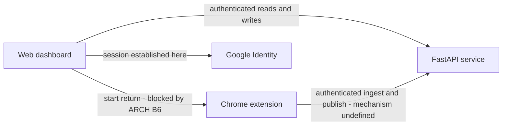
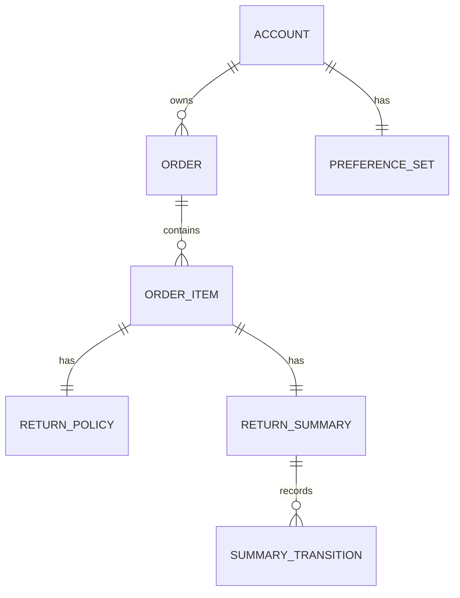
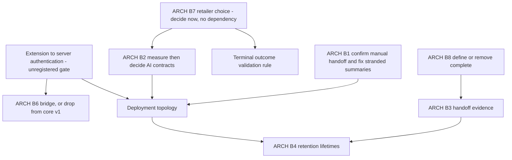
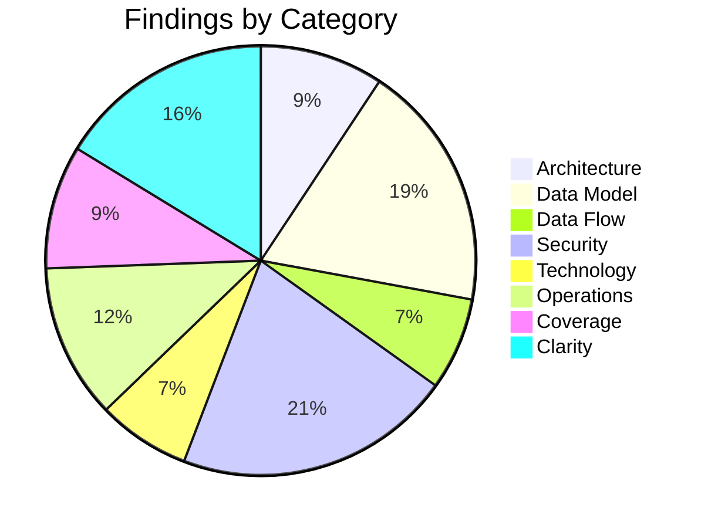

# High-Level Design Review: Boomerang

**Document Reviewed:** `design/boomerang-high-level-design.md`
**Requirements Reference:** `design/boomerang-requirements.md`
**Supporting Inputs:** `design/boomerang-api-contract.md`, `design/boomerang-data-model.md`,
`design/boomerang-low-level-design.md`, `docs/SKETCH.md`, `docs/ARCHITECTURE.md`,
`docs/RETURN_WORKFLOW.md`, `docs/README.md`, `plan/boomerang-milestones.md`,
`plan/boomerang-decisions.md`, `AGENTS.md`, `infra/AGENTS.md`
**Review Date:** 2026-09-13
**Reviewer:** Claude (Automated Review)

> **Scope note.** This is a fresh first review of the design rewritten in the 2026-09-06
> architecture migration. The other files in `reviews/` were written between 2026-08-26 and
> 2026-08-30 against the superseded extension-local, carrier-pickup, no-database design. Nothing
> they marked resolved is treated as resolved here, and no finding below is carried over from them.

---

## Executive Summary

The rewritten design is unusually disciplined about the thing it exists to protect: the browser is
the only component that can touch a retailer session, the database is the only component that holds
durable account data, and neither one is allowed to impersonate the other. The migration away from
carrier pickup, extension-local order history, and selector-first driving is clean — I found no
surviving carrier-pickup semantics in the design set, and the one place where the old world is still
alive (`infra/`) is called out as stale by the document itself.

The design's central weakness is that its most-asserted security property is also its least
specified one. Every authenticated interface in the frozen wire contract names the extension as a
caller, and the trust-boundary table records that crossing as "authenticated" — but no document in
the repository says how a browser extension obtains, stores, presents, or loses an application
credential. That decision is not deferred to a named blocker; it is simply absent, which means
nobody is holding it. It also silently determines several other unmade decisions (cross-origin
posture, cookie-versus-bearer, credential storage in extension local storage, revocation on
sign-out), and it is on the critical path for work the milestone plan marks as ready to start now.

Close behind it is a delivery problem rather than a security one: in the current design there is no
un-blocked way for a user to start a return. The dashboard start control depends on the undesigned
dashboard-to-extension bridge, and the design never names an alternative initiator, yet starting and
observing a supervised return is part of the stated definition of core v1.

**Overall Verdict:** Needs targeted fixes before proceeding — seven blocking findings, all of which
are decisions rather than rewrites. The document's structure, boundaries, and honesty about what it
has not decided are sound enough that the low-level design can follow quickly once they are made.

---

## Section Verdicts

| Review Area | Verdict | Findings |
|-------------|---------|----------|
| Architecture & Component Design | Partially Addressed | 4 |
| Data Model Soundness | Partially Addressed | 8 |
| Data Flow Integrity | Partially Addressed | 3 |
| Security Architecture | Insufficient | 9 |
| Technology Choices | Partially Addressed | 3 |
| Deployment & Operational Readiness | Insufficient | 5 |
| Requirements Coverage | Sufficient | 4 |
| Specification Clarity | Partially Addressed | 7 |

---

## 1. Architecture & Component Design

### Current State

Four components, cleanly separated by capability rather than by layer: a dashboard that owns
account-level presentation, an extension that owns everything requiring a live retailer session, a
FastAPI service that owns authentication and durable account records, and an agent pipeline that
owns normalization and per-step proposals. The decomposition matches the problem well — the split is
drawn along the one boundary the product cannot cross, not along an arbitrary tier line.

Communication patterns are stated directionally and the document is explicit that the server can
never initiate. Ownership is unambiguous for every record except extension connection state.

### Strengths

- The authority model is stated as an invariant rather than a behavior: agent output is a proposal,
  trusted extension code is the only executor, and a selector match can never become an action.
  This survives every document in the set consistently.
- The design refuses to let the backend reconstruct browser progress from a stored summary, which
  closes the most tempting shortcut in a system with two sources of truth.
- The blocker register is carried into the design rather than hidden, and each unfinished contract
  names the gate that owns it. Very few designs at this stage are this legible about their own
  incompleteness.
- The dashboard-to-extension arrow in the context diagram is explicitly labelled conceptual rather
  than drawn as though it were settled.

### Gaps and Recommendations

| ID | Gap | Priority | Recommendation |
|----|-----|----------|----------------|
| ARCH-1 | No un-blocked path exists for a user to start a return. The dashboard start control is gated on `ARCH-B6`; the return-execution flow opens with an unattributed "User starts a return" and never names an alternative initiator. Starting and observing one supervised run is part of the stated definition of core v1, and the frozen wire contract already ships `start_return` and `focus_active_return` action codes and labels for a control that cannot currently be invoked from anywhere. | **Must Address** | The design SHALL name the v1 return initiator explicitly. The cheapest resolution is to make the extension popup the core-v1 initiator (the user is already on the retailer page, and no new trust boundary is required), which demotes `ARCH-B6` from a core-v1 blocker to a dashboard-convenience gate. If the dashboard must be the initiator, `ARCH-B6` SHALL be re-classified as blocking the core milestone rather than blocking a later integration. |
| ARCH-2 | The closed action vocabulary was widened from five verbs to six by adding `report_outcome`, and that verb is the only one whose effect crosses into durable account state. Its sole guard is extension-side terminal-page validation, which the design describes only as "validated terminal outcome" — it never states what structural evidence distinguishes a QR outcome from a label outcome on a live page, and a concrete validator cannot be written until `ARCH-B7` selects a retailer. Meanwhile `AGENTS.md`, the repo-wide guardrail document, still states the five-verb vocabulary, so the normative guardrail and the design set disagree about the size of the attack surface. | **Must Address** | The design SHALL state the retailer-agnostic acceptance rule for a terminal outcome (what must be true of the live page before the extension may publish) and SHALL state the fail-closed default when that rule cannot be evaluated. `AGENTS.md` SHALL be updated to carry the six-verb vocabulary with the reason the sixth was added, so the guardrail and the design cannot drift further. Consider whether the outcome classification needs the model at all, given that the terminal page is exactly the case where a retailer-specific structural check is most reliable and the model adds a durable-write path. |
| ARCH-3 | The agent pipeline is a hard single point of failure on both durable paths — every ingestion and every step of every return run blocks on it — and this is nowhere acknowledged. The design also carries no cost or abuse ceiling. The superseded topology bounded worst-case model spend with reserved concurrency; the migration removed that mechanism and replaced it with authentication alone, which bounds who can spend but not how much. | **Should Address** | The design SHOULD state the degradation posture for an agent outage explicitly (the requirements already imply it: hand control to the user, never fall back to selector-only execution) and SHOULD name a per-account rate and volume ceiling as an architectural control, with the concrete numbers deferred to `ARCH-B2`. |
| ARCH-4 | Extension connection state has no owning store. The logical model records it as undecided under `ARCH-B6`; the API contract resolves it differently, stating that connection state is composed client-side and is not a server field. A requirement obliges the connection to be bound to the intended account *and* browser context, which implies durable state somewhere, but no component is assigned it. | **Should Address** | The design SHOULD state whether account-to-browser binding requires a durable server record at all. If the binding is purely local (the extension holds an account-scoped credential and reports its own state), say so — that materially shrinks `ARCH-B6` and removes an implied database table nobody has designed. |

The diagram below shows the two crossings the design asserts but does not specify. Both are solid
arrows in the component diagram; neither has a defined mechanism.

### Verdict: **Partially Addressed**

---

## 2. Data Model Soundness

### Current State

The logical model in the design is deliberately thin and delegates to a separate data-model
contract, which is considerably more rigorous than most documents at this stage: closed
vocabularies, integer minor-unit money, explicit null semantics, provenance on every derived fact,
an exact predicate for the closing-soon metric, and a normative precedence table for next actions.
Entity coverage matches the requirements. Cardinalities are stated for every relationship.

The gaps are not in what the model describes but in what it leaves to be discovered during
implementation: record identity, re-ingestion behavior, and the lifecycle of a summary whose run was
abandoned.

### Strengths

- Identity keyed by the stable subject claim, with the subject never exposed on the wire and email
  explicitly barred from selecting or merging an account.
- Cross-account lookups behave as not-found rather than forbidden, which closes the existence-oracle
  leak by design rather than by convention.
- Derived values (urgency, days remaining, metrics, next action) are explicitly non-authoritative
  projections, so no client can persist a stale calculation as fact.
- Filled-field records carry semantic names and never values, and the checkpoint references an
  in-memory observation rather than retaining page content.

### Gaps and Recommendations

| ID | Gap | Affected Entity | Priority | Recommendation |
|----|-----|-----------------|----------|----------------|
| DATA-1 | Order and item identity across repeated scans is undefined. `retailer_order_reference` is unique within account and retailer only *when available*, and it is explicitly nullable; `OrderItem` has no natural key at all. Nothing defines what makes a second scan of the same page an update rather than a new order. Duplicated orders silently inflate `returnable_value_by_currency` and `closing_soon_count`, and the milestone plan defers "identity and rescan rules" to `ARCH-B7` — but this is a core data-model question, not a retailer-specific one. | `Order`, `OrderItem` | **Must Address** | The design SHALL define the account-scoped identity rule for orders and items and the upsert semantics for a rescan, including the case where the retailer order reference is unknown. It SHALL state which component computes the identity (trusted extension recognition, or server-side matching), because the answer determines whether model output can influence record identity. |
| DATA-2 | `retailer_key` provenance is unspecified. It is a stable internal identifier and a de facto join key, but no document says who assigns it. If it arrives from normalization output, untrusted model output becomes a durable key. | `Order` | **Should Address** | The design SHOULD state that `retailer_key` is assigned by trusted extension or server recognition from a closed, bundled registry, and that a normalization result naming an unknown retailer fails validation rather than creating a new key. |
| DATA-3 | Re-normalization conflict behavior is undefined. `ReturnPolicy` carries a concurrency version described as being for "reconciling normalization updates", but no rule says whether a rescan may overwrite a deadline while a run is in flight against it, what happens to items that no longer appear on the page, or how a version conflict is resolved. | `ReturnPolicy`, `OrderItem` | **Should Address** | The design SHOULD state the reconciliation rule for a repeat scan: which fields a newer parse may overwrite, whether absent items are retained or soft-removed, and whether a rescan is refused while a return summary is in progress for that item. |
| DATA-4 | A run abandoned under the accepted interruption policy strands the durable summary permanently. The transition table is monotonic and refuses backward transitions, so an item published as in-progress whose run is then handed off to the user has no legal path to any other state until a QR or label outcome is validated. The user's dashboard will show a return in progress indefinitely, and the in-progress metric will over-count. Nothing in the blocker register covers this: the interruption gate is scoped to browser behavior, not to the durable projection it leaves behind. | `ReturnSummary` | **Must Address** | The design SHALL define the terminal disposition of an in-progress summary when the run ends without an outcome. Options are a permitted in-progress-to-not-started transition published by the extension after a validated handoff, a staleness rule that ages an in-progress summary out of the metric, or an explicit user-initiated reset. This SHOULD be folded into `ARCH-B1` as an explicit sub-decision so it is not lost between the browser gate and the retention gate. |
| DATA-5 | Account switching in one browser is unaddressed. The extension-local workflow record is account-scoped, but no rule requires the extension to discard or partition local workflow state on sign-out or when a different account signs in. On a shared machine one user's item identifiers, selected method, and confirmed reason remain readable to the next. | `WorkflowSession` | **Should Address** | The design SHOULD state that extension-local workflow state is cleared or partitioned on sign-out and on account change, and that a workflow record whose account does not match the current principal is discarded rather than resumed. |
| DATA-6 | Account deletion leaves orphaned extension-local records. Deleting the account removes the server records and invalidates the session, but the extension retains workflow sessions and checkpoints referencing now-deleted item identifiers. The stated clearing semantics cover only the reverse direction. | `WorkflowSession` | **Consider** | State the deletion behavior in both directions, even if the local half is best-effort and depends on the extension being present. |
| DATA-7 | The carrier-handoff count and the handoff view are structurally always empty in v1, because writes to that state are blocked. The dashboard is required to present a handoff area, so v1 ships a permanently empty surface with no explanatory copy specified. | `DashboardMetrics` | **Consider** | Specify the empty-state copy for the handoff view, or defer the surface until its evidence gate closes, so the dashboard does not appear broken. |
| DATA-8 | There is no transition history. The summary is a single mutable row with a write timestamp. Both the handoff-evidence gate and the complete-state gate turn on *provenance of a transition*, and neither can be answered — or audited afterwards — from a model that keeps only the current value and its most recent source. | `ReturnSummary` | **Should Address** | The design SHOULD introduce an append-only return-summary transition record (state, source, evidence, observed time, write time) as an explicit entity. It is a prerequisite for resolving both blocked states honestly and for supporting a user who disputes a status. |

`SUMMARY_TRANSITION` is the proposed addition from DATA-8; every other relationship above is already
in the current contract.

### Verdict: **Partially Addressed**

---

## 3. Data Flow Integrity

### Current State

Three flows are documented with diagrams — sign-in and connection, scan and normalize, and return
execution — plus prose for dashboard reads, summary publication, and the deferred Calendar path.
The return-execution flow is the strongest: it shows the validation decision points, the
confirmation gate for irreversible proposals, and the fail-to-manual edge from every failure branch.

The weakness is uniform across the other flows: they document the happy path and the security
refusals, but not the operational failures. Findings in this section use `DATA-*` identifiers,
continuing the numbering above.

### Gaps and Recommendations

| ID | Gap | Flow | Priority | Recommendation |
|----|-----|------|----------|----------------|
| DATA-9 | Summary publication has no defined behavior when the server is unreachable. The milestone plan says detailed workflow truth stays local when summary synchronization fails, but nothing says whether the extension retries, queues, drops, or surfaces the failure — and a queued publication replayed later would violate the rule that a summary reflects a validated live page rather than a remembered one. | Return-summary publication | **Should Address** | The design SHOULD state that a failed publication is retried only while the observation that produced it is still valid, and is otherwise surfaced to the user and discarded. A queued publication SHALL NOT be replayed against a page the extension can no longer see. |
| DATA-10 | The scan-and-normalize flow has no failure branches. Requirements oblige honest failure with no partial or fabricated parse stored, and oblige a visible pending state, but the flow shows only the success path — no timeout, no validation-failure, no unrecognized-page, no partial-normalization branch. | Scan, normalize, persist | **Should Address** | The design SHOULD extend the ingestion flow with the timeout, validation-failure, and unrecognized-page branches and state that each is a no-write outcome, so the low-level design does not have to infer the transaction boundary. |
| DATA-11 | No idempotency mechanism is described anywhere. A requirement states that retrying a request must not duplicate an irreversible retailer action, but the design names no request identifier, no observation binding, and no server-side deduplication for repeated ingestion. With the retry policy itself deferred to `ARCH-B2`, there is nothing that prevents a retried ingestion from creating a second order or a retried step from re-executing an action. | Ingestion; per-step agent request | **Should Address** | The design SHOULD state idempotency as an architectural property: ingestion carries a client-generated request identifier that the server deduplicates within a window, and a per-step proposal is bound to the observation that produced it and is executable at most once. The concrete window and identifier format belong to `ARCH-B2`; the property does not. |

### Verdict: **Partially Addressed**

---

## 4. Security Architecture

### Current State

| Aspect | Status | Notes |
|--------|--------|-------|
| Authentication | Partial | Identity provider, identity key, and scope restraint are settled. Token verification requirements are unstated; session transport is deliberately unfrozen; the extension's authentication path is entirely undefined. |
| Authorization | Defined | Every route scoped to the authenticated principal; caller cannot select an account; cross-account access is indistinguishable from not-found. |
| Trust Boundaries | Partial | The boundary table is the strongest section of the document, but it asserts the extension-to-API crossing is authenticated without defining the mechanism, and it does not model the retailer page as an attacker-influenced source reaching the model. |
| Encryption in Transit | Missing | Not stated anywhere in the design. |
| Encryption at Rest | Missing | Not stated anywhere in the design; the database product is itself unselected. |
| Secrets Management | Missing | Listed as an unsettled deployment fact with no owning blocker. |
| Input Validation | Defined | Model output validated for shape, type, length, plausibility and permitted markup before persistence; unknown request fields rejected; page-derived text rendered as text. |

### Strengths

- The prohibited-crossing column of the boundary table is specific and exhaustive rather than
  gestural — cookies, authorization headers, passwords, payment fields, file inputs, raw artifacts,
  QR contents, addresses, barcodes, and protected URLs are each named.
- Structured output is explicitly not trusted, and the design states separately what server
  validation protects (the database) and what extension validation protects (the retailer page).
- Identity and Calendar authority are separated at the architectural level rather than at the
  consent-screen level, and no Gmail relationship exists anywhere in the document set.
- The terminal-page egress guard is defined as a distinct control with its own removal list rather
  than folded into general sanitization.

### Gaps and Recommendations

| ID | Gap | Priority | Recommendation |
|----|-----|----------|----------------|
| SEC-1 | **How the extension authenticates to the API is undefined, and no blocker owns it.** The frozen wire contract names the extension as a caller of the profile, dashboard, item-detail, preferences, and summary-publication interfaces, and states that every one requires an authenticated application principal. The design states the extension holds no server, model-provider, Calendar-client, or retailer secret. It never reconciles those two statements. The bridge gate does not cover this: ingestion and summary publication need extension-to-server authentication even if the dashboard never speaks to the extension at all. | **Must Address** | The design SHALL specify how the extension obtains an application credential (most plausibly minted by the server for a browser that has completed a dashboard sign-in), where it is stored, its lifetime, how it is revoked on sign-out and account deletion, and what an extension without one may do. This SHOULD be added to the blocker register as a named gate rather than left implicit, since it is a prerequisite for milestone work already classified as ready to start. |
| SEC-2 | Cross-origin posture is undefined for an API serving both a web origin and an extension origin. Whether the session is a cookie or a bearer token is deliberately unfrozen, but the two choices have materially different security architectures: a cookie requires an explicit allowlist of origins with credentials and CSRF defenses on every mutating route, while a bearer token requires a storage decision in extension local storage and an exfiltration analysis. The design treats this as an implementation detail. | **Must Address** | The design SHALL state the cross-origin model: the exact set of permitted origins, whether credentials cross origins, and the CSRF posture for mutating routes. It is acceptable to leave cookie-versus-bearer open only if both branches are specified; today neither is. |
| SEC-3 | Google identity assertion verification is unstated. Nothing in the design or requirements names issuer validation, audience binding to the Boomerang client, expiry, nonce or replay handling, or what happens when a subject claim is absent. | **Should Address** | The design SHOULD state the verification obligations for the identity assertion as an architectural requirement, since accepting an unvalidated assertion is an account-takeover path that no downstream authorization check can catch. |
| SEC-4 | Encryption in transit and at rest is never mentioned. | **Should Address** | State transport security for all three legs (extension to API, dashboard to API, API to model provider) and the at-rest expectation for the account database, so the database selection is made against a stated requirement. |
| SEC-5 | The secret store is listed among unsettled deployment facts with no owning blocker, while the server already holds model-provider credentials, database credentials, and a Google client secret. | **Should Address** | Assign secret custody to a named gate alongside the deployment topology decision, and state the invariant already implied elsewhere — that no secret is ever present in the extension bundle. |
| SEC-6 | No payload ceiling or rate limit is specified for the ingestion or per-step interfaces, both of which invoke a paid model on behalf of an authenticated caller. The error contract defines a rate-limited response but nothing defines when it is produced. | **Should Address** | The design SHOULD name per-account request and payload ceilings as architectural controls with values deferred to `ARCH-B2`, and SHOULD state that exceeding them is a refusal rather than a truncation. |
| SEC-7 | Durable model-invocation logging is prohibited by the boundary table, but with the infrastructure workspace stale that prohibition now has no enforcement owner. In the superseded topology it was asserted explicitly in infrastructure code precisely because the default-off setting would otherwise silently capture the user's page content. | **Should Address** | The design SHOULD record that model-invocation logging is disabled as a deployed control that must be asserted in whatever topology is selected, so the requirement moves with the architecture rather than dying with the old one. |
| SEC-8 | `fill` restricts targets but not values. Password, payment, and file inputs are excluded as targets, but nothing constrains the *content* the model may write into a permitted field, and that content is derived from attacker-influenceable retailer page text. | **Consider** | Consider stating that fill values are bounded in length, are plain text, and — where a field maps to a known semantic (reason, quantity) — are validated against a closed set or the field's own options before execution. |
| SEC-9 | Observation binding is not stated as an architectural invariant. The step loop's safety depends on an action being executed at most once against the observation that produced it, and the extension-local checkpoint already carries an observation identifier, but the design describes staleness handling only as validating "against the current live DOM". A late response arriving after the page has moved is caught only if the validator happens to notice. | **Should Address** | The design SHOULD state that every proposal is bound to the identifier of the observation that produced it, that a proposal whose observation is no longer current executes nothing, and that an observation is consumed by at most one action. |

### Verdict: **Insufficient**

---

## 5. Technology Choices

### Assessment

| Technology | Choice | Rationale Provided? | Alternatives Considered? | Concerns |
|------------|--------|---------------------|--------------------------|----------|
| Identity provider | Google, keyed by subject claim | Yes | Partial | Sole provider; no stated position on what happens if a user has no Google account. Key choice is well justified and externally sourced. |
| Browser platform | Chrome, Manifest V3 | Yes | Yes — other browsers explicitly deferred | Permission posture is the product's review strategy; correctly treated as a constraint rather than a preference. |
| Backend framework | FastAPI | No | No | Inherited from the pre-migration design without restatement; low risk. |
| Model platform | Bedrock | No | No | On the critical path for every ingestion and every return step; no rationale, no alternatives, no exit path recorded. |
| Database | Unnamed | N/A | No | The design leaves the product unselected while the server workspace already commits to PostgreSQL. |
| Dashboard framework | Not named in the design | No | No | A Next.js application exists in the repository; the design never mentions the dashboard's technology or rendering model. |

### Gaps and Recommendations

| ID | Gap | Priority | Recommendation |
|----|-----|----------|----------------|
| TECH-1 | The design leaves the database product unselected, but the server workspace guidance already states PostgreSQL and describes ORM model work in progress, and the milestone plan classifies account persistence as ready to start now. The design is behind the implementation on a decision it claims to own. | **Should Address** | Either record the relational database selection in the design (which nothing in the current blocker set prevents — the open retention gate constrains lifetimes, not engine choice), or state explicitly that persistence work proceeds against a portable relational subset until the deployment decision lands. The present silence lets a de facto choice harden without review. |
| TECH-2 | The dashboard's technology and rendering model are absent from the design entirely, even though the deployment section lists frontend hosting mode as an open question. A hosting-mode decision cannot be made without knowing whether the dashboard is statically exportable or requires a server runtime. | **Consider** | Name the dashboard framework and state whether the account session is established and read client-side or server-side; that single fact constrains both the hosting decision and the cross-origin posture in SEC-2. |
| TECH-3 | No rationale or alternatives are recorded for the model platform, and vendor lock-in is unacknowledged across two providers (model platform and identity provider). | **Consider** | Record a one-paragraph rationale and the exit cost for the model platform. The design already isolates the pipeline behind a gateway seam, so the exit cost is probably low — saying so is what makes the choice reviewable. |

### Verdict: **Partially Addressed**

---

## 6. Deployment & Operational Readiness

### Current State

The deployment section is candid rather than complete: it lists what the documents settle (the
components exist, account interfaces are authenticated, page content is transient, credentials stay
in the browser) and states plainly that the compute topology, database product, network layout,
hosting mode, secret store, environment split, and pipeline are all unselected. It correctly refuses
to carry forward the superseded serverless topology, since that design's central no-database
assumption has been replaced.

That candour is right, but it leaves the operational posture close to empty: there is no
observability strategy, no infrastructure failure analysis, no scaling statement, and no backup or
recovery position at any level.

### Gaps and Recommendations

| ID | Gap | Priority | Recommendation |
|----|-----|----------|----------------|
| OPS-1 | `infra/` is not merely stale, it is actively misleading. Its workspace guidance instructs an implementer to build a specific superseded target — a serverless function with a public function URL, no VPC, no database, an unauthenticated endpoint bounded by reserved concurrency, and carrier credential parameters — and it justifies that instruction by citing sections of the high-level design that the rewrite deleted. An agent or engineer following the repository's own layered guidance convention reads that file as current, and the cited sections no longer exist to contradict it. The design acknowledges the scaffold is not the target; the scaffold does not acknowledge the design. | **Must Address** | The superseded workspace guidance SHALL be reduced to a stop notice pointing at the current design, and its dangling section references SHALL be removed, before any deployment work begins. This is the single highest-risk stale artifact left by the migration: every other stale file is marked as historical, and this one is written as an instruction. |
| OPS-2 | No observability strategy exists at any altitude. There is no logging model, no metrics, no tracing position, and no statement of how a failed normalization or a stuck return run is diagnosed — in a system whose central data cannot be logged. That constraint makes the observability design harder than usual, not optional. | **Should Address** | The design SHOULD state what is observable given the never-persist rules: structured events keyed by the request correlation identifier already in the error contract, counts and latencies for normalization and per-step proposals, outcome and failure-reason distributions, and an explicit prohibition list. The correlation identifier is already specified on the wire; nothing currently says anything consumes it. |
| OPS-3 | The sequencing position is internally inconsistent. The design says core-v1 deployment choices should be made after the data model, authentication flow, AI runtime, and the blocked bridge contract are sufficiently defined, while the milestone plan classifies database and account-API work as ready to start now. Persistence work is therefore proceeding ahead of the decision that determines where it runs and what it runs on. | **Should Address** | The design SHOULD separate the decisions that genuinely depend on the open gates (compute sizing, timeout ceiling, sync-versus-async hosting fit) from those that do not (database engine family, environment split, secret store, transport security). Deferring the second group buys nothing and is already being overtaken. |
| OPS-4 | No backup, recovery, or availability position is stated. The retention gate presumes backups exist by asking how they expire, but nothing decides that they do, and the design makes no availability or durability commitment for the account database that is now the product's source of truth. | **Consider** | State the durability and availability expectation for the account store, even provisionally, so the retention gate has something to constrain. |
| OPS-5 | The local development story is described only as permission to keep using existing scaffolds without treating them as the target. The repository has a working Compose setup, but the design does not say what a developer can exercise locally — in particular whether the model pipeline and the identity flow have local substitutes. | **Consider** | State which components have local test doubles, since a design where every return step calls a hosted model needs an offline path to be testable at all. |

### Verdict: **Insufficient**

---

## 7. Requirements Coverage

### Coverage Matrix

| Requirement | Addressed In Design? | Where | Notes |
|-------------|---------------------|-------|-------|
| AUTH-01, AUTH-02, AUTH-03 | Yes | Components; Google services; trust boundaries | Identity key, scope restraint, and retailer separation all stated. |
| AUTH-04 | Yes | API capability boundaries | Account-scoped access stated; mechanism gap tracked as SEC-1. |
| CONN-01 | Partial | Web dashboard | Connection display stated; the state has no owning store (ARCH-4). |
| CONN-02, CONN-03, CONN-04 | Blocked | Sign-in flow | Correctly gated on `ARCH-B6`. |
| EXT-01 | No | — | The minimal manifest posture is a hard product constraint and appears nowhere in the design (COV-1). |
| EXT-02, EXT-03, EXT-04 | Partial | Chrome extension | Gesture-first access and later contextual host permission are described; the decline path is not. |
| INGEST-01 to INGEST-07 | Yes | Scan flow; trust boundaries | Live-page origin, bounding, minimization, transience, validation, and persistence all covered. |
| INGEST-08 | Partial | — | Honest failure is required but no failure branch appears in the flow (DATA-10). |
| INGEST-09 | Blocked | Scan flow | Correctly gated on `ARCH-B2`. |
| DATA-01 to DATA-05 | Yes | Logical data model | Ownership split and state vocabulary are consistent across all documents. |
| DATA-06, DATA-07 | Blocked | Return-summary state | Correctly gated on `ARCH-B3` and `ARCH-B8`, and correctly kept independent of each other. |
| DASH-01 to DASH-06 | Yes | Web dashboard; dashboard use | Carrier-neutral handoff view and privacy honesty are explicit. |
| PREF-01 to PREF-05 | Yes | Dashboard use; design constraints | Ranking-without-authority is stated as a constraint, not just a behavior. |
| RETURN-01 to RETURN-12 | Yes | Return execution | The strongest-covered family; every clause maps to a step or a guard in the flow. |
| OUTCOME-01 to OUTCOME-05 | Partial | Return execution; publication | Outcome semantics covered; the validation rule that gates publication is unspecified (ARCH-2). |
| CAL-01 to CAL-04 | Deferred | Google services | Correctly gated on `ARCH-B5` with the product boundary preserved. |
| PRIV-01 to PRIV-06 | Yes | Trust boundaries; capability boundaries | Never-persist list is complete and consistent with the requirements. |
| PRIV-07 | Blocked | Capability boundaries | Correctly gated on `ARCH-B4`. |
| SEC-01 to SEC-05 | Yes | Trust boundaries and security | Untrusted-input posture stated at both validation points. |
| SEC-06 | Partial | Trust boundaries | Durable model logging is prohibited; general log and telemetry exclusion is not restated (COV-2). |
| REL-01, REL-02, REL-03 | Yes | Return execution; data model | Manual route preserved; state stores kept non-interchangeable. |
| REL-04 | No | — | No idempotency mechanism exists (DATA-11). |
| PERF-01, PERF-02 | Partial | Return execution | The no-selector-fallback rule is explicit; the pending state and the timeout-to-handoff edge are not shown (COV-3). |
| PERF-03 | Blocked | Open blockers | Correctly gated on `ARCH-B2`. |
| COMP-01 | No | — | Store-disclosure parity has no owning component (COV-4). |
| COMP-02, COMP-03 | Yes | Google services; dashboard use | Consent separation and honest-claim rules are architectural, not just copy rules. |

### Gaps

| ID | Requirement | Status | Priority | Recommendation |
|----|-------------|--------|----------|----------------|
| COV-1 | EXT-01 | Missing | **Should Address** | The design SHOULD state the manifest permission posture explicitly. It is one of the product's hardest constraints — it is the reason the extension's review strategy works — and a design that omits it invites a low-level design to add a broad host permission for convenience. |
| COV-2 | SEC-06 | Partial | **Consider** | Restate the log and telemetry exclusion alongside the durable model-logging prohibition, so the rule covers application logs rather than only the model platform. |
| COV-3 | PERF-01, PERF-02 | Partial | **Consider** | Show the pending state and the agent-timeout edge in the flows, so that the timeout path is visibly the same manual-handoff edge as a validation failure. |
| COV-4 | COMP-01 | Missing | **Consider** | Assign ownership of disclosure parity between the store listing, the privacy surface, and the extension disclosure to a named component or process; today it is required of nobody. |

### Verdict: **Sufficient** — coverage is broad and the deliberate exclusions are all traceable to a
named gate. The four gaps above are omissions within otherwise-covered families.

---

## 8. Specification Clarity

### Items Requiring Clarification

| ID | Item | Location | Issue | Priority | Question |
|----|------|----------|-------|----------|----------|
| UNCLEAR-1 | Account session capability recorded as having no blocker at this level | API capability boundaries | Contradictory | **Should Address** | The session establishment row claims nothing is blocked, while the wire contract leaves session transport and the credential-exchange route deliberately unfrozen and the extension's authentication path is undefined. Which is it — settled, or two unmade decisions with no gate? |
| UNCLEAR-2 | Extension connection record | Logical data model vs API contract | Contradictory | **Consider** | The logical model says the store is undecided; the API contract says connection state is composed client-side and is not a server field. Has the client-side answer already been chosen, and if so does the blocker still cover storage? |
| UNCLEAR-3 | "User starts a return" | Return-execution flow | Ambiguous | **Should Address** | Which surface initiates a return in core v1 — the dashboard (blocked) or the extension popup (not blocked)? The supporting architecture document says "from the dashboard or extension"; the design names neither. |
| UNCLEAR-4 | "local development may keep using the existing scaffolds" | Deployment posture | Ambiguous | **Consider** | Which scaffolds, and until when? The statement currently extends to an infrastructure workspace that provisions a topology the same section says cannot be carried forward. |
| UNCLEAR-5 | Size of the closed action vocabulary | Design set vs repo guardrail | Contradictory | **Should Address** | The repo-wide guardrail states five verbs; the design, requirements, architecture record, and workflow document all state six. The addition is recorded as a decision in one place and contradicted in another — which document is normative for an implementer reading the guardrail first? |
| UNCLEAR-6 | Whether QR outcome handling is core or priority 1 | Scope; return-summary state; definition of done | Ambiguous | **Consider** | The design covers the QR status as priority 1 and the delivery plan says core requires label support while priority 1 adds QR — but the wire contract accepts both states identically and the terminal validator would have to recognize both to fail closed. Must the core-v1 extension implement QR recognition in order to refuse it safely? |
| UNCLEAR-7 | Diagram syntax portability | Context diagram; component diagram in the architecture record | Rendering defect | **Consider** | The diagrams use bidirectional arrows, embedded newline escapes in labels, and (in the architecture record) HTML line breaks inside node labels. Older Mermaid renderers used by common repository viewers fail on these. Replace bidirectional arrows with two directed arrows and move detail out of labels. |

### Verdict: **Partially Addressed**

---

## 9. Architecture Blocker Assessment

The eight gates were assessed individually against the whole repository. None has a recorded
resolution anywhere, and none has a named owner or target date. Three observations apply across all
of them:

- Two gates are substantively decided in prose but not marked as such, which makes the register
  look larger than the real decision debt.
- One decision of the same weight — extension-to-server authentication — is missing from the
  register entirely, so the register is not currently a complete list of what is unmade.
- The gates are not ordered by cost or by unblocking value. The cheapest one to close unblocks the
  most downstream work and needs no engineering at all.

| Gate | Genuinely open? | Assessment | What specifically must be decided |
|---|---|---|---|
| `ARCH-B1` Interruption policy | **Partly — the choice is de facto made** | The three-way choice the gate poses (manual handoff, stop-only, resumable) is already answered consistently in four documents: the requirements forbid promising recovery, the architecture record keeps the resumable proposal explicitly non-current, the workflow document files it as a deferred appendix, and the wire contract's monotonic transition table has no resumption path. What is genuinely missing is not the policy but its consequences. | Record manual-handoff-with-no-recovery as decided. Then decide the two unanswered consequences: what the extension does with a workflow record whose run was abandoned, and how a durable in-progress summary reaches any other state when no outcome ever arrives (DATA-4). The second is invisible in the current framing because the gate is scoped to browser behavior while the damage lands in the database. |
| `ARCH-B2` AI runtime and contracts | **Yes — fully open, and the largest engineering unknown** | Nothing measurable exists anywhere in the repository. This gate is unusual in that it cannot be closed by deciding — it requires measurement first, and the measurement requires a retailer page, which means it is transitively gated on the retailer choice. It also carries more than it appears to: the per-step contract determines whether a supervised return feels interactive, since every step of every run waits on a model round trip through the server. | Measure realistic minimized payloads and end-to-end latency for both uses. Then decide: payload ceiling and refusal behavior, per-step and normalization latency budgets, timeout values, retry policy compatible with the idempotency property (DATA-11), observation binding (SEC-9), whether normalization stays synchronous, and the hosting timeout the chosen topology imposes. Sequence this immediately after the retailer choice. |
| `ARCH-B3` Handoff evidence | **Yes — but narrower than it looks** | The evidence vocabulary is already fixed at user-confirmed or retailer-observed, the invariant tying evidence to state is written, and the write is refused with a specific blocked-state response. Only the selection remains. Note that the data model has already pre-committed to an answer the API surface cannot express: the update-source vocabulary includes a user-confirmed value, but there is no route through which a dashboard user could assert one — the only summary-publication route is the extension's. | Decide which of the two evidence sources v1 accepts and which component may publish it. If user-confirmed is chosen (the only one available without carrier integration or a retailer revisit), a dashboard-originated summary write must be added to the contract, which is a wire change, not just a gate closure. Also decide whether handoff is reversible after a user mis-taps it. |
| `ARCH-B4` Retention details | **Yes — fully open** | The baseline is agreed and consistent everywhere; only lifetimes are open. This gate is partly downstream of the deployment decision: backup expiry and recovery periods cannot be chosen before the database and its hosting are chosen, so the current sequencing that defers deployment until after several other gates also defers half of this one. | Decide lifetimes for completed, expired and abandoned orders; whether single-order deletion exists and what cascades; when completed local workflow state and checkpoints are cleared; whether account deletion has a recovery period; how backups expire. Split the gate: the application-level lifetimes can be decided now, the backup and recovery halves cannot. |
| `ARCH-B5` Calendar design | **Yes — and correctly left alone** | This is the healthiest gate in the register. It is genuinely deferred to a later priority, it blocks no core work, and the one constraint that must hold now is already a requirement elsewhere: no Calendar scope may be requested at sign-in. | Decide nothing now. When priority 2 begins: component ownership, scope selection, token custody, refresh and revocation, event-update behavior, and wire contract. The only present obligation is that the selected deployment topology leaves room for a server-side credential if that is where custody lands. |
| `ARCH-B6` Dashboard-to-extension bridge | **Yes — and the most load-bearing gate in the register** | It blocks the visible connection state, the account-to-browser binding, the narrow command surface, and the dashboard start control — and through that last one it currently blocks the stated definition of core v1 (ARCH-1). The frozen wire contract already ships action codes and display labels for controls this gate must enable, which is a commitment made ahead of the decision. It is also frequently conflated with the separate and unregistered extension-authentication decision (SEC-1); untangling the two is the first step to closing it. | First decide whether it blocks core v1 at all, by naming the extension popup as the v1 initiator. Then decide: transport, how the dashboard addresses the correct browser, how the binding is established and revoked on sign-out and account change, the enumerated command list, and acknowledgement semantics. Decide extension-to-server authentication separately and first, since ingestion needs it regardless. |
| `ARCH-B7` Retailer target | **Yes — and it is the cheapest to close and unblocks the most** | This is a product choice with no technical dependency. Nothing in the repository prevents making it today, and it currently blocks the adapter, the selector hints, the fixtures, the rescan and identity rules, the terminal-outcome validator that guards the only model-driven durable write (ARCH-2), all real-browser acceptance, and — transitively, because measurement needs a real page — the entire AI runtime gate. | Choose the first retailer. Then derive: URL and DOM recognition signatures, the order identity and rescan rules, safe synthetic fixtures that comply with the no-durable-page-content rule, the terminal-page acceptance rule, and acceptance criteria. This should be closed before any other gate; it is the constraint that makes several others answerable. |
| `ARCH-B8` Complete-state semantics | **Yes — but the architecture has already narrowed the answer to one option** | Correctly kept independent of the handoff gate. The important observation is that the current architecture contains no evidence source capable of establishing completion: there is no mail access, no carrier tracking, no retailer polling, and the server may never initiate anything. The only signal available is a user assertion or a retailer page the user happens to revisit with the extension active. The gate is therefore not really a design space — it is a choice between a user-asserted state and no state. | Decide between defining completion as user-asserted only, or removing the state from the v1 vocabulary and reintroducing it when an evidence source exists. Removing it is the more honest option and costs one enum value; both closed vocabularies and the defensive next-action rows would need the corresponding edit. Nothing in core v1 depends on the state existing. |

### Recommended gate ordering

---

## Summary of Recommendations

### Must Address (Blocking — resolve before low-level design)

1. **SEC-1:** Specify how the extension authenticates to the API, and add that decision to the
   blocker register. It is asserted as settled in the trust boundary table, is required by five
   frozen interfaces, and is owned by nobody.
2. **SEC-2:** Specify the cross-origin model — permitted origins, whether credentials cross them,
   and the CSRF posture for mutating routes — for an API serving both a web origin and an extension.
3. **ARCH-1:** Name the core-v1 return initiator. If it is the dashboard, the bridge gate blocks the
   definition of done; if it is the extension popup, say so and the gate stops blocking core v1.
4. **ARCH-2:** State the retailer-agnostic terminal-outcome acceptance rule that guards the one
   agent tool with a durable write path, and reconcile the five-verb guardrail with the six-verb
   design.
5. **DATA-1:** Define account-scoped order and item identity and rescan upsert semantics, including
   the nullable-reference case. This is a core modelling question that the retailer gate does not
   cover.
6. **DATA-4:** Define how an in-progress summary leaves that state when its run is abandoned. The
   monotonic transition table currently has no exit.
7. **OPS-1:** Reduce the superseded infrastructure workspace guidance to a stop notice. It instructs
   an implementer to build the replaced topology and cites design sections that no longer exist.

### Should Address (High Priority)

1. **ARCH-3:** Acknowledge the agent pipeline as a single point of failure; state degradation and a
   spend or rate ceiling.
2. **ARCH-4:** Decide whether account-to-browser binding needs a durable server record at all.
3. **DATA-2:** State that retailer keys come from a trusted closed registry, never from model output.
4. **DATA-3:** Define re-normalization conflict rules for policies, missing items, and version
   conflicts.
5. **DATA-5:** Require extension-local workflow state to be cleared or partitioned on sign-out and
   account change.
6. **DATA-8:** Add an append-only summary transition record; two blocked gates depend on provenance
   a single mutable row cannot carry.
7. **DATA-9:** Define publication retry and offline behavior, and forbid replaying a publication
   against a page the extension can no longer see.
8. **DATA-10:** Add failure branches to the ingestion flow.
9. **DATA-11:** State idempotency as an architectural property for ingestion and step execution.
10. **SEC-3:** State identity assertion verification obligations.
11. **SEC-4:** State transport and at-rest encryption expectations.
12. **SEC-5:** Give secret custody an owning gate.
13. **SEC-6:** Name payload and rate ceilings as controls, with values deferred.
14. **SEC-7:** Re-home the model-invocation-logging prohibition as a deployed control.
15. **SEC-9:** Make observation binding an explicit invariant.
16. **TECH-1:** Either record the database selection or state that persistence proceeds against a
    portable relational subset.
17. **OPS-2:** Define an observability strategy compatible with the never-persist rules.
18. **OPS-3:** Separate deployment decisions that genuinely depend on open gates from those that do
    not.
19. **COV-1:** State the manifest permission posture in the design.
20. **UNCLEAR-1, UNCLEAR-3, UNCLEAR-5:** Resolve the session-blocker contradiction, name the return
    initiator, and reconcile the vocabulary size across documents.

### Consider (Medium Priority)

1. **DATA-6:** State deletion behavior for extension-local records.
2. **DATA-7:** Specify empty-state copy for the permanently empty handoff view, or defer it.
3. **SEC-8:** Constrain fill values, not only fill targets.
4. **TECH-2:** Name the dashboard framework and session-handling model.
5. **TECH-3:** Record model-platform rationale and exit cost.
6. **OPS-4:** State durability and availability expectations for the account store.
7. **OPS-5:** Describe the local development substitutes for the model and identity paths.
8. **COV-2, COV-3, COV-4:** Restate log exclusion, show pending and timeout edges, assign disclosure
   parity ownership.
9. **UNCLEAR-2, UNCLEAR-4, UNCLEAR-6, UNCLEAR-7:** Resolve the connection-record contradiction,
   bound the scaffold permission, clarify whether QR recognition is core, and fix diagram
   portability.

---

## Findings Summary

| Area | Verdict | Must | Should | Consider |
|------|---------|------|--------|----------|
| Architecture & Components | Partially Addressed | 2 | 2 | 0 |
| Data Model | Partially Addressed | 2 | 4 | 2 |
| Data Flows | Partially Addressed | 0 | 3 | 0 |
| Security | Insufficient | 2 | 6 | 1 |
| Technology Choices | Partially Addressed | 0 | 1 | 2 |
| Deployment & Ops | Insufficient | 1 | 2 | 2 |
| Requirements Coverage | Sufficient | 0 | 1 | 3 |
| Specification Clarity | Partially Addressed | 0 | 3 | 4 |
| **Total** | | **7** | **22** | **14** |

---

## Migration Consistency Check

The brief asked specifically whether pre-migration assumptions survived. They largely did not.

| Superseded assumption | Status in the current design set |
|---|---|
| Carrier pickup, eligibility, scheduling, cancellation, tracking | Fully removed from the design, requirements, data model, wire contract, and milestone plan. The handoff view is carrier-neutral and the wire contract states explicitly that a label implies no carrier eligibility. |
| Extension-local order history as the dashboard's source | Fully removed. The dashboard reads account data and the extension is barred from being a local account database. |
| Selector-first driving with the model as fallback | Fully removed, and actively guarded: four documents state that a selector match can never produce an action and that a timeout must not fall back to a selector path. |
| No-database serverless topology | Removed from the design and the plan; **still present and still instructional in the infrastructure workspace** (OPS-1). This is the only place the old architecture survives as guidance rather than as history. |
| Carrier credentials in parameter storage | Removed from the design; still described in the infrastructure workspace guidance. |
| Prefilled Calendar template URL instead of the Calendar API | Replaced by the API-with-incremental-consent decision, recorded with its supersession. |
| Email as an identity key | Never present in the current set; the subject claim is used consistently and the exclusion of email as a selector is explicit. |

The design and data-model documents agree with each other throughout. The one substantive
disagreement between the design and the wire contract is the extension-connection record (UNCLEAR-2),
and the one disagreement between the design set and the repository guardrail is the vocabulary size
(UNCLEAR-5). Both are small, but both are the kind of drift that hardens if the next document is
written from whichever copy the author happened to open.
