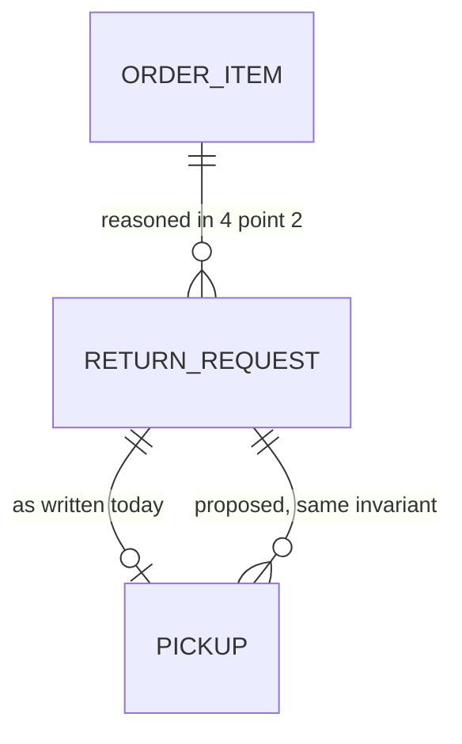
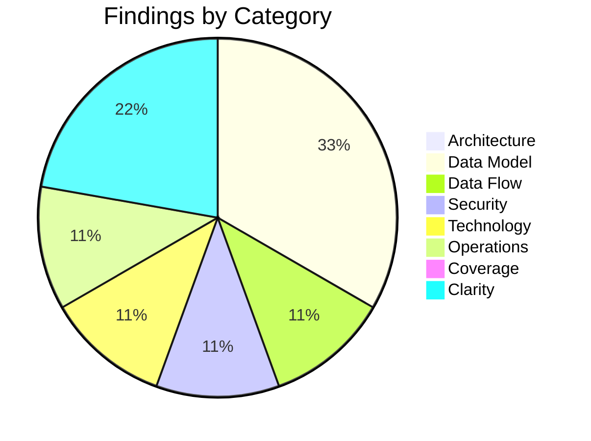

# High-Level Design Review: Boomerang

**Document Reviewed:** `design/boomerang-high-level-design.md`
**Requirements Reference:** `design/boomerang-requirements.md`
**Review Date:** 2026-08-26
**Reviewer:** Claude (Automated Review)

---

## Executive Summary

This is the fifth review of this design, and the first in which every finding from the previous
round has been resolved — all thirty-five, including the eighteen Should-Address items. The
resolutions are not acknowledgements; each one is a structural change with its reasoning written
down. `DRIVER_SESSION` became a real entity with a paragraph explaining why `tab_url` is stored
beside `tab_id`. `PICKUP` gained an `Abandoned` state and a named interval to reach it. Section 3.1
gained an Execution context column, and the two paragraphs under it turn what was a deployment note
into the security argument it needed to be. The spend ceiling was actually multiplied out.

That last one deserves separate mention, because the author computed a number that made their own
position worse and published it anyway: reserved concurrency of five bounds worst-case spend at
roughly **$300 to $3,500 per hour**, and the faster the model responds the worse the ceiling gets.
The design then does the right thing with it — derives the Budget threshold from legitimate traffic
rather than from the ceiling, and separates the `Throttles` alarm from the spend alarms because a
saturation attack produces a flat bill. This is the single most valuable page in the document.

Nine findings remain, none blocking. Seven are new, and most of them are the second-order
consequences of this round's own additions — which is the expected shape of a revision this large.
The one worth doing first is a cardinality that the document's own reasoning already refutes:
§4.2 argues at length that an item must be allowed more than one return request because terminal
states would otherwise strand it, then leaves `RETURN_REQUEST ||--o| PICKUP` one-to-one, which
strands a return whose pickup was cancelled or abandoned in exactly the same way. The design works
around it by deleting cancelled pickups outright — which in turn makes the `Cancelled` state and
part of the eviction carve-out unreachable text.

**Overall Verdict:** Ready for low-level design

---

## What This Revision Resolved

All 35 findings from the previous round. Grouped by what changed rather than listed one per row:

| Prior IDs | What was resolved | How |
|---|---|---|
| DATA-1, DATA-2, DATA-3, DATA-4 | Every data-model finding | `ORDER_ITEM \|\|--o{ RETURN_REQUEST` with a stated "at most one non-terminal" invariant; `DRIVER_SESSION` added as an entity with all five recommended attributes; `first_seen_at` added and marked never-updated-by-merge; `Abandoned` added with `BOOKING_ABANDONED_AFTER_HOURS`, and the eviction carve-out reworded to match |
| ARCH-1 | Execution contexts | §3.1 gained an Execution context column, plus "The middle column is a security boundary, not a deployment note" and a paragraph on why the validator cannot run in the page |
| ARCH-2 | Configuration home | §8.4: everything is a build-time constant resolved per environment at bundle time; nothing is fetched |
| SEC-1 | Bedrock invocation logging | §8.3 lists it explicitly disabled, asserted in Terraform rather than left unset, with the reason it is a security control and not a cost one |
| SEC-2 | `fill` bounds | §6.8 gives `fill` its own subsection — adapter-declared target by key, length and character bounds, confirmation for the selector-targeted form |
| SEC-3 | CORS allowlist | The dashboard origin is gone from both documents; both now read "the single pinned `chrome-extension://` origin" |
| SEC-4, SEC-5, SEC-6 | Remaining security items | `sender.origin` checked in every `onMessageExternal` handler; `content_security_policy.extension_pages` declared; the private key housed at a named `SecureString` path readable by the release role and not the Lambda role, with an offline `prod` copy |
| TECH-2, TECH-3 | Runtime and model selection | Mangum named, with lifespan on and an explanation of what silently breaks when it is off; NFR-6.4 now carries two call sites with real budgets — 10 s parse, **5 s fallback** — and makes exceeding the fallback budget a `report_stuck` rather than a wait |
| TECH-4 | Spend ceiling | Computed: ~65 K input tokens per worst-case request, 300 to 3,600 requests per hour, ~$300 to ~$3,500 per hour, with the counter-intuitive result that lower latency raises the ceiling |
| TECH-5, OPS-6, UNCLEAR-4 | §8.3 placeholders | Static hosting constrained to hosts allowing per-path response headers, with the `frame-ancestors` reason; CloudWatch retention set to 30 days explicitly, never the account default |
| OPS-1, OPS-2, OPS-3, OPS-4, OPS-5 | Every operational finding | Dev and prod columns through §8.3; `request_id` in the error shape, every log line and the failure copy; a `Throttles` alarm with the argument for why the spend alarms structurally cannot cover it; a compatibility rule with a `client-too-old` reason code; `MAX_INGEST_BYTES` coupled as server-ceiling/client-constant with lowering named a breaking change |
| FLOW-1, FLOW-2, FLOW-3 | Every flow finding | Three new failure rows — ineligible at the schedule call with the label already printed, calendar tab fails to open, pickup cancelled returns the request to `LabelReady` — plus `reminder_offered_at` so only the offer is recorded |
| COV-1, COV-2, COV-3, COV-4 | Every coverage finding | `.ics` fallback designed in §5.2 and given a failure row; `consented_at` and `consent_extension_version` on `PICKUP`; "When the prices cannot be read" specifying unknown-price presentation and no auto-selection; the `window_inferred` presentation rule specified in NFR-6.4 down to the rendered wording |
| UNCLEAR-1, UNCLEAR-2, UNCLEAR-3, UNCLEAR-5 | Every clarity item | "comfortably past" became `PICKUP_SETTLED_AFTER_DAYS`; the iframe exception was deleted outright — "There is no exception"; "behind a flag" defined as a build-time constant; the failed-validation order is surfaced by name rather than silently discarded, with the reason |

Two things are worth recording beyond the table. §5.2's "Ineligibility, and what the design can
honestly offer" **narrows a requirement rather than pretending to meet it** — FR-3.4.2 asked for
nearest drop-off locations and a priced alternative, and the design says plainly that no component
sources locations and that paid pickup is out of scope by the requirements' own boundary. And §6.2's
ceiling computation ends with "*Faster responses make the ceiling worse*, which is the opposite of
the usual intuition and the reason this is written out rather than asserted." Both are the document
arguing against its own earlier convenience, which is the habit that has made each round shorter.

---

## Section Verdicts

**Sufficient** here means the area carries no Must and no Should findings.

| Review Area | Verdict | Findings |
|-------------|---------|----------|
| Architecture & Component Design | Sufficient | 0 |
| Data Model Soundness | Partially Addressed | 3 |
| Data Flow Integrity | Partially Addressed | 1 |
| Security Architecture | Partially Addressed | 1 |
| Technology Choices | Partially Addressed | 1 |
| Deployment & Operational Readiness | Partially Addressed | 1 |
| Requirements Coverage | Sufficient | 0 |
| Specification Clarity | Sufficient | 2 |

---

## 1. Architecture & Component Design

### Current State

An MV3 extension holding all durable state and a stateless FastAPI-on-Lambda service holding all
credentials. Section 3.1 now gives seven subcomponents an execution context, a responsibility and a
communication list; §3.2 covers the server handlers; §3.4 gives each external dependency a failure
posture. Two subsections cover service worker ephemerality and why retailer adapters ship in the
bundle rather than being fetched.

### Strengths

- The Execution context column converts §6.8's security claim into something checkable. The
  paragraph that follows — the validator must not run in the page, because a page that could reach
  it could disable it and thereby launder its own content into authorised actions — states the
  attack rather than the mitigation, which is the harder and more useful direction.
- The rejection of API-served selectors is argued on the right grounds: it would grant a compromised
  server the exact capability §6.8 exists to deny the model, inside a live authenticated session.
- The `runtime.connect` port is explicitly labelled an optimisation and the persisted record the
  correctness guarantee, so nothing depends on the port surviving.
- "The consequence is stated rather than hidden: adapter update latency is store review latency" —
  the resilience story is named as a limitation instead of being presented as a design feature.

### Gaps and Recommendations

No findings. Component boundaries, execution contexts, ownership and the ephemerality story are all
specified, and each single point of failure is acknowledged where it exists.

### Verdict: **Sufficient**

---

## 2. Data Model Soundness

### Current State

Seven entities — `ORDER`, `ORDER_ITEM`, `RETURN_REQUEST`, `PICKUP`, `DRIVER_SESSION`,
`BOOKED_ADDRESS`, `ADDRESS` — identical across design §4.1 and requirements §2.2, every attribute
named and every cardinality stated. Section 4.2 explains the `ADDRESS`/`BOOKED_ADDRESS` split, the
multi-request cardinality, the full `PICKUP` lifecycle including `Abandoned`, five load-bearing
attributes and the `DRIVER_SESSION` rationale. Section 4.3 covers creation, update, eviction and
deletion with the live-booking carve-out.

### Strengths

- The absence of an `INSTALL` entity is argued rather than left implicit: `chrome.storage.local` is
  already per-profile, so the key would restate the storage boundary and nothing reads it.
- `tab_url` beside `tab_id`, with the reason — a tab ID alone cannot be validated after a restart
  because IDs are reused — is the kind of detail that is normally discovered during debugging.
- `BOOKED_ADDRESS.standardized` distinguishes a provisional client snapshot from a USPS-confirmed
  one, and §4.2 makes a refresh or cancel against an unstandardized snapshot ask the user first.
- The `Abandoned` argument is complete: it names why the `Collected` inference cannot fire for such
  a record, why it can never be `Cancelled`, and what the state honestly means.

### Gaps and Recommendations

| ID | Gap | Affected Entity | Priority | Recommendation |
|----|-----|-----------------|----------|----------------|
| DATA-1 | `RETURN_REQUEST \|\|--o\| PICKUP` allows a return at most one pickup, ever. §4.2 makes exactly the opposite argument one paragraph earlier for `ORDER_ITEM`: terminal states plus a one-to-one cardinality strand the parent. A pickup reaching `Cancelled` or `Abandoned` is terminal, and §5.4's own copy invites the user to "book again". The two adjacent relationships are reasoned differently for no stated reason. | `RETURN_REQUEST` to `PICKUP` | Should Address | Relax to `\|\|--o{` and carry over the invariant §4.2 already wrote for return requests: **at most one pickup per return may be in a non-terminal state**, and that one is current. Requirements §2.2 SHALL be updated in the same edit, since the two diagrams are maintained as copies. |
| DATA-2 | Cancelled pickups are deleted, which makes `Cancelled` unreachable. §5.3's diagram ends `Note over SW: remove pickup from local storage` and §5.4's row reads "Pickup removed". But §4.2 enumerates `Cancelled` as a state, and §4.3's eviction carve-out exempts a pickup that "has not been cancelled, collected or abandoned" — a clause that can never match a record that no longer exists. Three places model cancelled pickups as persisting; one deletes them. The deletion also destroys the only local evidence that a cancellation was attempted, which is the precise hazard §4.3 spends a paragraph arguing against for bookings. | `PICKUP` | Should Address | Decide one way and make all four agree. Retaining the record in `Cancelled` is the better fit: it keeps the eviction clause meaningful, preserves the trail if USPS did not in fact cancel, and — once DATA-1 is relaxed — removes the need to delete the old row before booking a replacement. If deletion is genuinely intended, `Cancelled` SHALL be removed from the state enumeration and from the carve-out in both documents. |
| DATA-3 | Requirements §2.2's `PICKUP.state` bullet lists the vocabulary as "`Booking`, `Confirmed`, `Cancelled`, `Collected`" — omitting `Abandoned`, which the same document's FR-3.1.5 requires a transition to and which HLD §4.2 and §4.3 both depend on. The state vocabulary *is* the schema, and one document disagrees with itself about it. | `PICKUP` | Should Address | Add `Abandoned` to the §2.2 bullet. Since the enumeration now appears in at least four places across two documents, consider naming one of them normative and having the others reference it. |

### Verdict: **Partially Addressed**

---

## 3. Data Flow Integrity

### Current State

Design §5 documents ingestion, return and pickup, cancellation as its own flow, and a twenty-six-row
failure table. Requirements §4.3 and §4.4 carry matching sequence diagrams. Section 5.2 now includes
subsections on how `label_carrier` is determined, why the address snapshot must come from the server,
why there is no idempotency key, what happens when prices cannot be read, and what ineligibility can
honestly offer.

### Strengths

- The failure table gives user-visible copy per row, and several rows are classified "Not a failure"
  — a QR-only return ending at `DroppedOff`, a declined host permission — which keeps the table
  about outcomes rather than error codes.
- "User closes the calendar tab without saving | Indistinguishable from saving, by design" records
  a limitation D3 creates instead of implying an observation the design cannot make.
- The lost-schedule-response reasoning is complete: why an idempotency key cannot help given a
  stateless server, why the mitigation lives on the client, and why no automatic retry exists.

### Gaps and Recommendations

| ID | Gap | Flow | Priority | Recommendation |
|----|-----|------|----------|----------------|
| FLOW-1 | The cancellation flow has no failure row. §5.3 is a two-step refresh-then-delete, and the interesting failure is between the steps: the refresh succeeds, the `DELETE` does not, and USPS still holds a live booking. §5.4's only cancellation row is the success case, and it says the pickup is *removed* — so a client that removes on optimistic success leaves a real carrier visit booked that the user has been told is cancelled. This is the mirror of the lost-schedule-response case the design handles carefully, and it is the more dangerous direction: a failed booking disappoints, a failed cancellation sends a carrier to someone's home. | Cancellation | Should Address | Add §5.4 rows for a failed refresh and a failed delete. The record SHALL NOT be removed or marked `Cancelled` until USPS confirms the cancellation, and the copy SHALL tell the user the booking may still stand, with the confirmation number, as §4.3's booking-copy rule already does for the forward path. |

### Verdict: **Partially Addressed**

---

## 4. Security Architecture

### Current State

| Aspect | Status | Notes |
|--------|--------|-------|
| Authentication | Defined | Deliberately none, with the reasoning and the residual named; open question 2 keeps launch acceptability open with a recommendation |
| Authorization | Defined | No accounts, no cross-user data; `externally_connectable` origin treated as the privilege boundary and `sender.origin` verified per message |
| Trust Boundaries | Defined | §7.2 covers both egress paths and the Google egress; the dashboard iframe exception was deleted outright |
| Encryption in Transit | Defined | TLS on every hop, stated per data category |
| Encryption at Rest | Defined | `chrome.storage.local` unencrypted by design and stated so; CloudWatch encrypted with 30-day retention set explicitly; Bedrock invocation logging explicitly disabled |
| Secrets Management | Defined | SSM `SecureString`, KMS, execution-role-only read; the extension private key at a named path readable by the release role and not the Lambda role, with an offline `prod` copy |
| Input Validation | Defined | §7.4 and NFR-6.5 agree; `fill` now bounded by target, length and character class; model output rendered as text, never markup |

### Strengths

- §6.2 names itself the weakest point in the architecture and then computes the number that proves
  it, rather than asserting a ceiling and moving on.
- The `Throttles` alarm is justified by the observation that reserved concurrency makes a saturation
  attack produce a *flat* bill — "the spend alarm is silent precisely when the outage is happening",
  and without it the control's success and failure look identical from the console.
- Two controls from an earlier draft were removed with the reason they cannot be built, including
  that WAF does not attach to Function URLs and that a "Bedrock spend alarm" does not exist.
- FR-3.4.4's client-integrity checks are described as catching our own bugs rather than as
  enforcement, with the residual — a forged request booking a real carrier visit for an unpostaged
  box — stated in full.

### Gaps and Recommendations

| ID | Gap | Priority | Recommendation |
|----|-----|----------|----------------|
| SEC-1 | The computed ceiling has detection but no response. §6.2 now establishes that sustained abuse costs $300 to $3,500 per hour, and answers it with an `InputTokenCount` alarm and a daily $20 Budget alert. Neither document says what happens when one fires, who is on the other end, or how quickly. At the fast-path figure an alarm answered in an hour is a $3,500 event, and the Budget — which the design itself notes lags by hours — would report it after the fact. A ceiling worth computing is worth attaching an action to. | Should Address | State the response in §8.3 alongside the alarms: setting `reserved_concurrent_executions` to zero is a single API call that stops both the spend and the abuse outright, and at PoC scale disabling the endpoint is a cheaper mistake than a four-figure bill. SHOULD name where the alarm goes and what the responder does; MAY note whether any part of it is automated. Without this, §6.2's argument that the ceiling makes an unauthenticated endpoint acceptable rests on a human noticing an email. |

### Verdict: **Partially Addressed**

---

## 5. Technology Choices

### Assessment

| Technology | Choice | Rationale Provided? | Alternatives Considered? | Concerns |
|------------|--------|---------------------|--------------------------|----------|
| Extension framework | WXT, Manifest V3 | Yes | Yes | None; termination handled by `DRIVER_SESSION` |
| Backend runtime | Python 3.13, FastAPI | Yes | Yes | None |
| ASGI-to-Lambda adapter | **Mangum**, lifespan on | Yes | Yes | Resolved this round, with the silent-failure mode named |
| Compute | Lambda, Function URL, ARM, no VPC | Yes | Yes | Reserved concurrency framed as the ceiling; the availability trade is open question 2 |
| Model access | Bedrock, **regional inference profile**, per-call-site selection | Yes | Yes | The HLD is correct; requirements §5.1 still carries the bare-ID default — TECH-1 |
| Local storage | `chrome.storage.local` | Yes | Yes | None |
| Frontend | Next.js 16 static export, Tailwind 4, shadcn | Yes | Yes | Host constrained to per-path response headers |
| Secrets | SSM `SecureString`, split release and execution roles | Yes | Yes | None |
| IaC | Terraform | Yes | Yes | Existing `infra/` describes a different system; open question 3 carries a recommendation |
| Carrier | USPS Carrier Pickup only in v1 | Yes | Yes | D4 settled; UPS flag now defined as a build-time constant |

### Gaps and Recommendations

| ID | Gap | Priority | Recommendation |
|----|-----|----------|----------------|
| TECH-1 | The two documents now contradict each other on the model identifier. HLD §8 states that recent Anthropic models are invocable only through a `us.`-prefixed profile, that a bare ID raises a validation error at invoke time on a user's first parse, and that `BEDROCK_MODEL` therefore has **no default in code**. Requirements §5.1 still reads `BEDROCK_MODEL` \| "Model identifier, carries the `anthropic.` prefix on Bedrock" \| default `anthropic.claude-opus-5` — the exact value the design says cannot work, presented as the default. §5.1 is the normative configuration table, so an implementer working from it ships the failure the HLD was rewritten to prevent. | Should Address | Update the §5.1 row to state that the value is a regional inference profile identifier, region-specific, **required with no default**. The HLD's handling is otherwise exemplary — the startup check naming `ListInferenceProfiles`, and the explicit *Unverified* callout with the CLI command to confirm it, are the right treatment for a value that cannot be checked from this workspace. Confirming the string against a live account remains the open half of question 10. |

### Verdict: **Partially Addressed**

---

## 6. Deployment & Operational Readiness

### Current State

Design §8 covers production, local development, infrastructure and extension release, with dev and
prod carried as separate columns and a note on why sharing one extension key across environments is
exactly wrong. Section 8.4 covers the release path, the private key's home, the `MAX_INGEST_BYTES`
coupling and the server-compatibility rule. Requirements §5.1 and §5.2 carry server and extension
configuration parameters with defaults.

### Strengths

- The per-environment split is argued from the consequence: a shared key would make the prod CORS
  allowlist admit every developer's unpacked build.
- The release role and the Lambda execution role are separated at the parameter level, so the
  function that talks to Bedrock cannot read the signing key.
- The `MAX_INGEST_BYTES` coupling is directional and explicit — server ceiling, client constant that
  SHALL NOT exceed it, lowering it a breaking change under the compatibility rule.
- The static-host requirement is defended as a real constraint, with `frame-ancestors` as the
  specific thing a meta-tag CSP cannot deliver.

### Gaps and Recommendations

| ID | Gap | Priority | Recommendation |
|----|-----|----------|----------------|
| OPS-1 | Two configuration parameters introduced this round appear in no configuration table. `PICKUP_SETTLED_AFTER_DAYS` and `BOOKING_ABANDONED_AFTER_HOURS` are used as normative parameter names in HLD §4.2 and §8.3 and in requirements FR-3.1.5, with PoC values of three days and 24 hours given in prose only. Requirements §5 is where every other tunable lives, and both of these govern client-side lifecycle — so they belong in §5.2 beside `MAX_STORED_ORDERS`, which they interact with directly: both decide when a pickup stops pinning an order against eviction. | Should Address | Add both to requirements §5.2 with their PoC defaults. Values that only exist in prose get reimplemented as literals at each call site, and these two are exactly the kind that need tuning once real pickups are observed. |

### Verdict: **Partially Addressed**

---

## 7. Requirements Coverage

### Coverage Matrix

| Requirement | Addressed In Design? | Section | Notes |
|-------------|---------------------|---------|-------|
| FR-3.1.1 to FR-3.1.2 (page recognition, extraction) | Yes | §3.1, §5.1 | Isolated-world content script, debounced to one ingest per visit |
| FR-3.1.3 (payload minimisation, all paths) | Yes | §5.2, §7.2, §7.3 | Two obligations of different strengths; §5.2 relies on the read-but-do-not-transmit distinction for `label_carrier` |
| FR-3.1.4 to FR-3.1.5 (structured extraction, accumulation, eviction) | Yes | §4.3 | Carve-out now reads "not cancelled, collected or abandoned"; see DATA-2 on the cancelled half |
| FR-3.2.1 to FR-3.2.4 (windows, urgency, inference) | Yes | §4.2, NFR-6.4 | Presentation rule specified down to the rendered wording; window-unknown orders listed rather than omitted |
| FR-3.3.1 to FR-3.3.3 (driving the return flow) | Yes | §6.8, §3.1 | Selector-first, closed vocabulary, validator in the service worker, nothing resumes by itself |
| FR-3.3.4 (present methods with prices) | Yes | §5.2 | Unknown prices shown as unknown, never hidden, never auto-selected |
| FR-3.3.5 to FR-3.3.7 (carrier recording, fallback) | Yes | §5.2 | Three-source `label_carrier` derivation in preference order; no schedule call when undetermined |
| FR-3.3.9 (driver session durability) | Yes | §3.1, §4.1 | `DRIVER_SESSION` entity plus rehydration rules |
| FR-3.4.1 to FR-3.4.3 (eligibility, standardized address) | Yes | §5.2 | Server-side snapshot with the two-step write and the promotion rule |
| FR-3.4.4 (label precondition) | Yes | §6.2 | Client-integrity framing with the residual stated |
| FR-3.4.5 to FR-3.4.8 (schedule params, ETag, cancel, location) | Partial | §5.3, §6.5 | Refresh-then-cancel designed; the partial-failure path is missing — FLOW-1 |
| FR-3.5.1 to FR-3.5.4 (calendar reminder, `.ics`) | Yes | §5.2, §5.4 | Both paths designed, `reminder_offered_at` records only the offer |
| FR-3.6.1 to FR-3.6.2 (permissions, consent) | Yes | §6.6, §4.1 | In-context host permissions; consent recorded on `PICKUP` with the extension version |
| FR-3.7.1 to FR-3.7.3 (pinned identity, disclosure) | Yes | §6.6, §8.4 | Pinned `key` per environment, private key housed, no correlator |
| NFR-6.1 to NFR-6.2 (privacy, compliance) | Yes | §7.3, §8.3 | Logging boundary enforcement; invocation logging disabled |
| NFR-6.3 to NFR-6.4 (resilience, performance) | Yes | §3.1, NFR-6.4 | Adapter latency named as store-review latency; two call sites with real budgets |
| NFR-6.5 to NFR-6.7 (security, infra, abuse) | Yes | §6.2, §8.3 | Ceiling computed, four alarms, Budget derived from legitimate use |

### Gaps

No coverage gaps. FR-3.5.3 and FR-3.4.2 — the two requirements previously unaddressed — are now
resolved in opposite directions, and both correctly: the `.ics` fallback was designed and given a
failure row, while FR-3.4.2's drop-off locations and priced alternative were **narrowed in the
requirement itself** on the grounds that no component sources locations and that paid pickup is out
of scope by the same document's boundary. Narrowing a requirement that cannot be met, and recording
the deferral in §10, is the correct resolution rather than a coverage failure.

### Verdict: **Sufficient**

---

## 8. Specification Clarity

Every clarity item from the previous round is resolved, and one — the dashboard iframe exception —
was resolved by deletion rather than definition, which is the stronger outcome. The open questions
carry recommendations where a recommendation is possible and explicitly decline to invent an answer
where it is not; question 4 is struck through in place with its answer, which is a good pattern. The
two items below are editing residue from a large revision, not ambiguities in the design.

### Items Requiring Clarification

| ID | Item | Section | Issue | Question |
|----|------|---------|-------|----------|
| UNCLEAR-1 | "Five attributes deserve a note" followed by eight bullets, with `window_inferred` appearing twice | Requirements §2.2 | Contradictory | The first `window_inferred` bullet carries the new presentation rule; the second carries the superseded provenance-only text. Delete the second and correct the count. A reader who stops at the first stale bullet gets the version this round was written to replace. |
| UNCLEAR-2 | Open question 5, "Can the return driver read the price of each return method?" | §11 | Ambiguous | The question still says "the fallback is presenting the options without prices, which is materially worse", as though undesigned — but §5.2's "When the prices cannot be read" now specifies exactly that fallback, with unknown-price labelling and no auto-selection. The feasibility half is genuinely open; the design half is answered. Split it, or annotate it the way question 4 was. |

### Verdict: **Sufficient**

---

## Summary of Recommendations

### Must Address (Blocking — resolve before low-level design)

None. All thirty-five findings from the previous round are resolved, and nothing in this round
prevents proceeding to low-level design.

### Should Address (High Priority)

1. **DATA-1:** Relax `RETURN_REQUEST` to `PICKUP` to one-to-many with the non-terminal invariant §4.2 already wrote for return requests.
2. **DATA-2:** Reconcile cancelled-pickup deletion with the `Cancelled` state and the eviction carve-out — three places say persist, one says delete.
3. **FLOW-1:** Add failure rows for the two-step cancellation; a failed `DELETE` leaves a live carrier visit the user believes is cancelled.
4. **SEC-1:** Attach a response, and a responder, to the alarms now that the ceiling is known to be $300–$3,500 per hour.
5. **TECH-1:** Fix requirements §5.1's `BEDROCK_MODEL` row, which still specifies the bare ID the HLD says cannot be invoked.
6. **DATA-3:** Add `Abandoned` to requirements §2.2's `PICKUP.state` vocabulary.
7. **OPS-1:** Add `PICKUP_SETTLED_AFTER_DAYS` and `BOOKING_ABANDONED_AFTER_HOURS` to requirements §5.2.

### Consider (Medium Priority)

1. **UNCLEAR-1:** Delete the duplicated `window_inferred` bullet in requirements §2.2 and correct the "Five attributes" count.
2. **UNCLEAR-2:** Annotate open question 5 — its design half is answered in §5.2; only the feasibility half is open.

---

## Findings Summary

| Area | Verdict | Must | Should | Consider |
|------|---------|------|--------|----------|
| Architecture & Components | Sufficient | 0 | 0 | 0 |
| Data Model | Partially Addressed | 0 | 3 | 0 |
| Data Flows | Partially Addressed | 0 | 1 | 0 |
| Security | Partially Addressed | 0 | 1 | 0 |
| Technology Choices | Partially Addressed | 0 | 1 | 0 |
| Deployment & Ops | Partially Addressed | 0 | 1 | 0 |
| Requirements Coverage | Sufficient | 0 | 0 | 0 |
| Specification Clarity | Sufficient | 0 | 0 | 2 |
| **Total** | | **0** | **7** | **2** |
