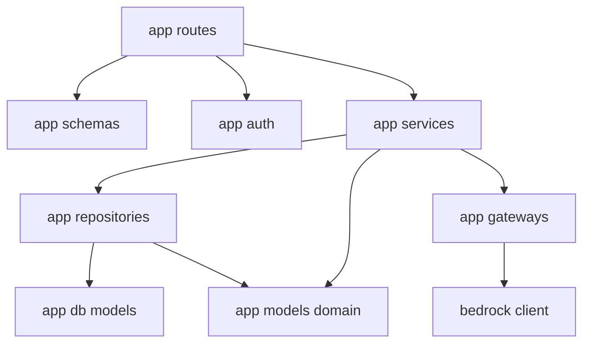
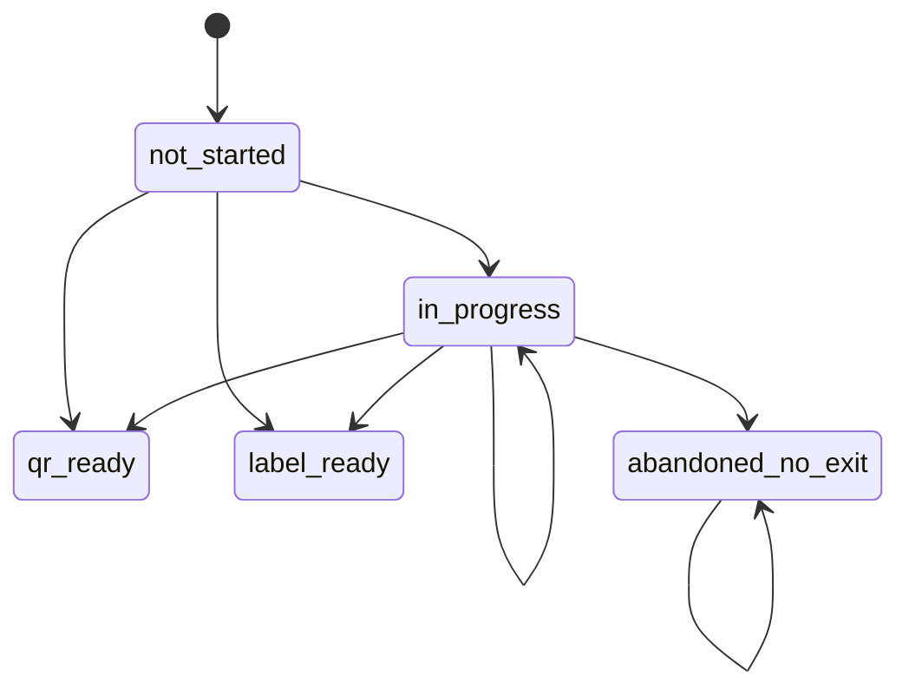
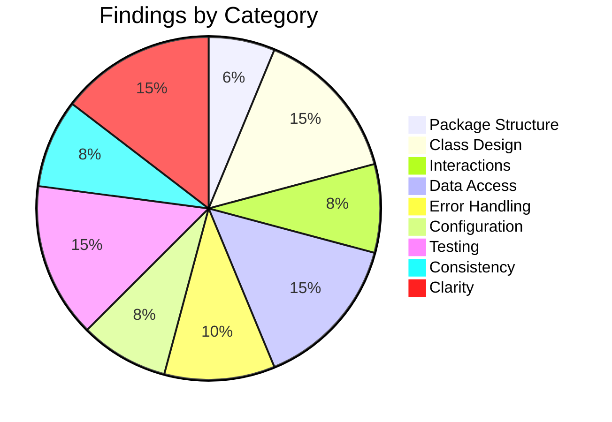

# Low-Level Design Review: Boomerang

**Document Reviewed:** `design/boomerang-low-level-design.md`
**Requirements Reference:** `design/boomerang-requirements.md`
**High-Level Design Reference:** `design/boomerang-high-level-design.md`
**Supporting Inputs:** `design/boomerang-api-contract.md`, `design/boomerang-data-model.md`,
`plan/boomerang-milestones.md`, `plan/boomerang-decisions.md`, `AGENTS.md`, `server/AGENTS.md`,
and the implemented server code under `server/app/`
**Review Date:** 2026-09-13
**Reviewer:** Claude (Automated Review)

> **Scope note.** This is a fresh first review of the low-level design as rewritten in the
> 2026-09-06 architecture migration. The files in `reviews/` dated 2026-08-26 through 2026-08-30
> review the superseded extension-local, carrier-pickup, no-database design; nothing they marked
> resolved is treated as resolved here.
>
> A high-level design review was completed today
> (`reviews/boomerang-high-level-design-review-2026-09-13.md`). Its findings are **not** restated.
> Where an architectural finding has a concrete low-level consequence, that consequence is traced
> and reported here under a new identifier, with the parent finding named for reference only. Two
> such traces were requested explicitly and are answered in their own section below.

> **Repository snapshot.** Findings were established against the working tree as of 2026-09-13
> midday on branch `feature/backend`. Three untracked or modified artifacts appeared in the tree
> during the review and are accounted for where they bear on a finding: a server-only CI workflow
> (TEST-3), a modified infrastructure workspace guide, and
> `design/boomerang-extension-auth-proposal.md`. That last file states on its own first line that it
> is a proposal, is not accepted, and amends no accepted document; TRACE-1 is therefore reported
> against the design as it stands, and the proposal is noted rather than credited.

---

## Executive Summary

This document is a careful and unusually honest **ownership and boundary specification**. It is not
yet a low-level design. It names no class, no type, no module path, no method signature with a typed
parameter, and no sequence diagram; its structural content is introduced as "recommended", and its
own summary describes it as a target whose reconciliation with the code, the task files, and the
workspace guidance has not yet happened. Everything it does say about who owns what is correct and
worth keeping — the trouble is that almost none of it is checkable against an implementation, and in
every place where implementation has already run ahead of it, the implementation has silently
answered the question the design most needed to answer.

The single most serious problem is that **account scoping — the isolation property the design
asserts first and hardest — has no specified enforcement device and the built schema makes the
correct query the non-obvious one.** `OrderItemRow` carries no account column; `ReturnPolicyRow` and
`ReturnSummaryRow` are keyed by item identifier alone. Every item-addressed route in the frozen wire
contract must therefore reach the owning account through a two-level join that nothing in the design
or the code requires, while the naive single-table lookup compiles, passes type checking, and
returns another account's row with a `200`. The design states the invariant and provides no
mechanism; the schema provides the shape that makes violating it the path of least resistance.

Close behind it, three questions the design defers are already decided in committed code, two of
them wrongly: repeated scans of an order with no retailer reference create duplicate orders forever
(a nullable column inside a unique constraint), account deletion cannot execute at all (no cascade
in the ORM relationships and no `ondelete` on any foreign key), and application startup validates
the configuration the design marks blocked while never touching the database configuration the
current milestone depends on.

**Overall Verdict:** Needs significant rework before implementation — not because the boundaries are
wrong, but because the document operates one abstraction level above where implementation decisions
are being made, and that gap is currently being filled by defaults.

---

## Section Verdicts

| Review Area | Verdict | Findings |
|-------------|---------|----------|
| Package/Module Structure | Insufficient | 3 |
| Class/Type Design | Insufficient | 7 |
| Class Interactions & Workflows | Insufficient | 4 |
| Data Access Layer | Insufficient | 7 |
| Error Handling | Insufficient | 5 |
| Configuration & Wiring | Insufficient | 4 |
| Testing Completeness | Insufficient | 7 |
| Consistency with High-Level Design | Partially Addressed | 4 |
| Specification Clarity | Partially Addressed | 7 |

---

## 1. Package/Module Structure

### Current State

The document describes four runtime boundaries — web application, browser extension, backend
service, database — and gives each a table of named responsibilities. The web application gets six
boundaries, the extension gets four execution contexts and ten modules with a "must not do" column,
the backend gets nine boundaries plus a four-node dependency flowchart. No boundary is given a
directory, a package name, or a file. The document states this deliberately: framework layout
"should follow the installed web stack", and the web boundaries "are ownership boundaries, not
prescribed filenames".

The only backend dependency rule is one sentence of prose: routes may depend on schemas,
authentication, and services; services may depend on persistence and gateways; persistence and
gateways must not depend on HTTP or UI code.

### Strengths

- The extension's "must not do" column is the best structural device in the document. Naming the
  forbidden capability next to the granted one is what makes a boundary reviewable, and several of
  the entries (workflow store must not be an account database, adapter registry must not construct
  actions, bridge endpoint must not expose arbitrary tab access) encode the migration's whole point.
- The three-context split of the extension — popup, content script, service worker — is the right
  primary decomposition, and putting network egress, trusted validation and tab control exclusively
  in the service worker is correct.
- The backend dependency direction is stated in the right direction: persistence and gateways are
  the leaves, not the roots.

### Gaps and Recommendations

| ID | Gap | Package(s) | Priority | Recommendation |
|----|-----|------------|----------|----------------|
| PKG-1 | No boundary in any of the four runtimes is mapped to a module path, and the one workspace where code exists has invented a layout that the design cannot confirm or contradict. The server is `app/{models,db,api,routes}` plus a root-level `app/bedrock.py`; `app/api/` and `app/routes/` are both empty placeholders whose docstrings claim overlapping jobs ("request/response wiring shared by route modules" and "HTTP route modules"). Seven of the nine named backend boundaries — authentication/session, ingestion, orders, preferences, return-step agent, return-summary, and the persistence layer itself — have no home anywhere in that tree, and nothing distinguishes what belongs in `api/` from what belongs in `routes/`. The design is explicitly written to support parallel implementation; two implementers working from it will produce two different trees. | server `app/`, client, extension | **Must Address** | The design SHALL map each named backend boundary to a module path, and SHALL state whether a boundary is one module or a package. It SHALL resolve the `api/` versus `routes/` split by naming what each holds, or collapse them. The same treatment SHALL be given to the extension's ten modules, which face the harder constraint of three execution contexts. |
| PKG-2 | Dependency direction is prose-only, unenforceable, and already violated at the one place it could be checked. The ASGI entrypoint imports the model gateway module directly and calls it from the lifespan, so the provider-specific integration is reachable from transport with no application service in between — the exact inversion the stated rule forbids. No import-boundary linting is specified for any workspace, and the server's lint posture (every ruff rule minus a short ignore list) does not include one. | server `app/main.py`, `app/bedrock.py` | **Should Address** | State the dependency rule as a checkable constraint and name the tool that checks it (an import-linter contract in the Python workspace, an ESLint boundaries rule in the browser workspaces). A dependency rule that only exists in prose is a rule that is discovered to be broken during review, not during the commit that breaks it. |
| PKG-3 | The extension's module table gives every module a responsibility but assigns an execution context to only four of them, and the two places that matter most are ambiguous. The egress guard is listed as a module with no context; the ingestion flow places it between extraction and the service worker's send, which reads as "in the content script"; the context table places network egress and trusted validation in the service worker. Which side of that line the guard runs on decides whether the sensitive-content filter executes in the isolated world adjacent to attacker-influenced page script or in the trusted worker. The same ambiguity applies to the proposal validator and the adapter registry. | extension | **Should Address** | Add an execution-context column to the extension module table, and state the rule that no module performing a trust decision may be loaded into a content script. See UNCLEAR-2 for the specific egress-guard contradiction. |

A minimal mapping that would close PKG-1 on the backend, consistent with what is already built:



`app/repositories/`, `app/services/`, `app/auth/`, `app/gateways/` and `app/schemas/` do not exist
today. `app/api/` and `app/routes/` do exist, are empty, and have no assigned meaning.

### Verdict: **Insufficient**

---

## 2. Class/Type Design

### Current State

The document contains no class diagram, no type definition, and no class name. Its interface section
gives sixteen free-function signatures in a pseudocode block; parameters are bare identifiers with
no types (`normalize_order_page(account, page_url, minimized_page_content)`), and return values are
named concepts (`normalized_order_result`, `exactly_one_proposed_tool_call`) that are defined
nowhere in the document. Its data section gives six durable records as bullet lists of "required
concepts", and one extension-local record as a flat list of field names with no types.

Meanwhile, the server workspace already contains a complete and well-built type layer: eighteen
Pydantic domain records and enums in `server/app/models/domain.py`, eight SQLAlchemy row types in
`server/app/db/models.py`, and pure conversion functions between them in `server/app/db/mappers.py`.
That layer is stricter than the design asks for — closed models with `extra="forbid"` and
`strict=True`, timezone-aware timestamps enforced by validator, money in integer minor units,
cross-field invariants on summaries and preference sets.

### Strengths

- The separation the code implements — strict domain records, separate storage rows, pure mappers
  between them — is exactly right and is worth promoting from a workspace convention into the
  design, since it is currently written down only in `server/AGENTS.md`.
- The closed tool union is genuinely closed: six kinds, enumerated, with a validation rule list that
  covers required and forbidden fields, target restrictions, and value bounding.
- Preferences are correctly modelled as a set, not a list, with uniqueness enforced rather than
  array order being reinterpreted as priority.

### Gaps and Recommendations

| ID | Gap | Class/Type | Priority | Recommendation |
|----|-----|------------|----------|----------------|
| CLASS-1 | The document names no class, defines no type, and gives no typed signature — so the review checks that matter at this layer (single responsibility, God objects, primitive obsession, sum types for states, mutability, diagram-to-interaction agreement) have nothing to evaluate. Sixteen interfaces are specified as untyped free functions whose inputs and outputs are English phrases. The one workspace with code has already defined a type layer that the design can neither confirm nor contradict, and the two most security-critical objects in the system — the sanitized observation and the proposed tool call — have no representation at all. | all | **Must Address** | The design SHALL specify, for each named boundary, the types that cross it: at minimum the observation, the proposal, the principal, the normalized order graph, and the failure type. It SHALL adopt the already-implemented domain/row/mapper split as a stated rule rather than leaving it in workspace guidance. Until a reader can tell what object a boundary receives, the boundaries are advisory. |
| CLASS-2 | Six interfaces take a first parameter named `account` with no type and no definition. The built code has both an internal `Account.id` and a `google_subject`; the wire contract forbids a client from submitting an account identifier at all. Which value crosses the service boundary decides whether a route handler can accidentally accept a caller-supplied account, and the design does not say. | `Account` | **Should Address** | Define one principal type produced only by the authentication boundary and never deserialized from a request body, and make it the first parameter of every account-scoped service call. Name it in the design so the repository layer can require it (see DAL-2). |
| CLASS-3 | The summary publication interface is already incompatible with the frozen contract and with the built model. It is specified as taking state, update source and an optional `evidence_source`; the wire request requires `observed_at`, the data model marks `observed_at` required, and the implemented `ReturnSummary` record makes it non-optional. The evidence parameter is also named differently from the contract, the data model, and the code, which all say `handoff_evidence`. An implementer working from the design alone writes a service that cannot construct the record that exists. | `ReturnSummary` | **Should Address** | Correct the signature to carry the observation timestamp and use the contract's field name, or delete the restatement and point at the contract. The second option is better: see CONSIST-3. |
| CLASS-4 | The durable record inventory is behind both the data model and the code on ownership questions the document says may not change. Policy facts are described as associating with "the applicable order or item"; the data model and the built schema admit item only, one-to-one, keyed by item identifier. Return-relevance and eligibility facts are listed as item concepts; both live on the policy record in the data model and the code. The summary record omits the observation timestamp. The item record omits quantity, which the code requires and constrains to be positive. | `ReturnPolicy`, `OrderItem`, `ReturnSummary` | **Should Address** | Reconcile the record inventory with the data model, or reduce it to a pointer. An order-level versus item-level policy association is precisely the "ownership and relationship" class of decision the document says it is fixing, and it is currently fixed in code and open in the design. |
| CLASS-5 | The extension-local workflow record omits the two fields that make its own rules enforceable. It has no account identifier — yet the return-start flow requires the extension to verify that an item belongs to its authenticated account binding, and there is nothing to compare against. It has no schema version field, although the surrounding prose requires the store to use one. The data model marks both required. The record's state field is also named differently from the data model's (`workflow_state` versus `run_status`) and the design never states the closed four-value run vocabulary the data model defines, so an implementer reading the design invents a run state machine. | `WorkflowSession` | **Should Address** | Add the account identifier and schema version to the record, adopt the data model's run-status name and vocabulary, and state the rule that a record whose account does not match the current principal is discarded rather than resumed. |
| CLASS-6 | The proposal target has no representation, and it is the single highest-risk value in the system. The validation rules require that a target "resolve to an element visible in the current validated step" and that password, payment and file-upload targets are always rejected — but whether a target is a CSS selector, a role-and-name pair, or an opaque handle minted by the extractor is left open, and the three have materially different security properties. Only the last makes "the agent cannot name an element it was not shown" true by construction rather than by a check that must not be forgotten. | closed tool union | **Should Address** | Specify the target representation. An opaque handle issued by the extractor for each element included in the observation, valid only for that observation, SHOULD be preferred: it makes an out-of-observation target unrepresentable, makes the observation-binding rule mechanical, and removes selector-string parsing from the trusted path entirely. |
| CLASS-7 | Blocked states are fully materialized in code with no layer that rejects them. `ReturnState` includes both blocked members, `HandoffEvidence` is a complete two-value enum, and the implemented summary validator *requires* handoff evidence when the state is carrier handoff — that is, the domain layer accepts the state the contract says must return a conflict. The database check constraint accepts it too. The rejection must therefore live in a service that does not exist, and the design assigns it to no component; it appears only as a line in the unit-coverage table. The milestone plan states that no gate is resolved by creating a placeholder enum, and two gates now have one. | `ReturnState`, `HandoffEvidence`, `ReturnSummary` | **Should Address** | Name the component that owns blocked-state rejection and state that it is the only place the rule lives, so it cannot be satisfied by a check constraint in one release and forgotten in the next. Consider modelling the publishable subset as a distinct type from the readable subset, so a blocked state is unrepresentable in a write path rather than rejected by it. |

### Verdict: **Insufficient**

---

## 3. Class Interactions & Workflows

### Current State

The document contains exactly one diagram: a four-node backend flowchart. There are no sequence
diagrams. The two principal workflows — order ingestion and the agent-first step loop — are given as
numbered prose lists, seven and ten steps respectively, each crossing three execution contexts and
two trust boundaries.

### Gaps and Recommendations

| ID | Gap | Workflow | Priority | Recommendation |
|----|-----|----------|----------|----------------|
| INTERACT-1 | The step loop's ten steps are almost entirely unattributed. Only one step names its executor ("in the extension's trusted context"); the other nine leave it to the reader to infer whether the content script, the service worker, or the server performs them. In a loop whose safety rests entirely on which side of the content-script boundary each decision runs, an unattributed step is a latent security defect, not a documentation gap — if validation of the tool kind, page state and confirmation rules runs in the content script, the page's own script shares that world. The ingestion flow has the same problem at the egress-guard step. | Agent-first step loop, order ingestion | **Must Address** | Render both flows as sequence diagrams with one lane per execution context (page, content script, service worker, API, model gateway, database), so every step has exactly one owner. This is the highest-value single addition available to this document. |
| INTERACT-2 | Both flows are happy-path only. Ingestion has eight sequential steps with no branch for gateway failure, validation rejection, or transaction rollback, and the release of the transient page representation is the last step rather than a guaranteed one — on any failure between steps three and seven, the design does not say the representation is discarded. The step loop has one failure branch and no path for the case where outcome publication fails after a terminal page has been validated, which leaves the local record asserting an achieved outcome while the server row says the run is in progress. The error section names a category for this ("preserve local workflow truth, show dashboard sync pending") but assigns no component, no retry owner, and no reconciliation. | order ingestion, outcome publication | **Should Address** | Add failure branches to both flows. State that transient representation release is unconditional. State which component retries a failed publication, on what schedule, and why a retry is safe — the contract's repeatable same-state rows already make it safe, and the design should say so rather than leaving a reader to work it out. |
| INTERACT-3 | Concurrency is unaddressed in three places. Nothing says a second run for the same item is refused, and the durable summary is a single row per item with no run identifier and no version column, so two runs in two tabs cannot be distinguished after the fact. Nothing says a rescan is refused while a run is in flight against the item it would rewrite; the rescan rule says only that a rescan "must not overwrite newer explicit user state with an ambiguous parse", which is a principle with no mechanism — there is no lock, no compare-and-set, and the policy record's version field has no stated protocol. Nothing addresses the server side, where a publication and a rescan can interleave. | rescan, step loop, publication | **Should Address** | State the concurrency rules: one active run per item, a rescan refused or deferred while an item has an active run, and a compare-and-set protocol for the policy version field that currently exists with no user. |
| INTERACT-4 | The extension's entire trusted coordination layer is placed in a Manifest V3 service worker, and the design never mentions that such a worker is terminated when idle. Every step of the loop waits on a model round trip, which is exactly when a worker has no pending extension API call holding it alive. The consequence is concrete and contradicts the data model: the safe checkpoint's observation identifier is documented there as referencing "an in-memory observation for the active run only" — an in-memory reference stored inside the record whose purpose is to survive. After an eviction the checkpoint points at nothing, and the design's rule that a proposal must be validated against the observation that produced it becomes unverifiable exactly when it matters most. | step loop, checkpoint writes | **Must Address** | State the worker-lifetime model. Either the observation is serialized into the checkpoint so a revived worker can re-validate, or the design states that an evicted worker ends the run and hands off — which makes worker eviction a case of the interruption gate rather than an unexamined assumption underneath it. This also determines whether the in-progress strand in TRACE-2 is a rare event or the common path. |

### Missing Workflow Coverage

| Requirement | Workflow Documented? | Notes |
|-------------|---------------------|-------|
| `AUTH-04` | No | No interaction shows how an authenticated principal is established or attached on either caller. |
| `CONN-01` | Partial | Disconnected and unknown rendering is buildable now and is a milestone-2 exit item, but no interaction describes it. |
| `INGEST-06` .. `INGEST-09` | No | Ingestion failure handling has no branch in the documented flow. |
| `REL-02` | No | Nothing describes how a retailer-specific failure is contained so unrelated data stays available. |
| `PERF-01` | No | The pending state during normalization has no interaction and no owning component on either surface. |
| `PERF-02` | Partial | The rule is asserted; no interaction shows the timeout path or who surfaces it. |
| `PRIV-04` (deletion) | No | Account deletion is one interface line with no interaction, and it cannot execute against the built schema (DAL-4). |

### Verdict: **Insufficient**

---

## 4. Data Access Layer

### Current State

The design names a "persistence layer" that "owns database transactions and account scoping", states
that the order graph is written in one application transaction, and defers physical selection,
migrations, indexes, backups and retention until the retention gate is "resolved sufficiently to
define their lifecycle". No repository, unit of work, session lifecycle, query pattern or index is
specified.

The built persistence layer is substantially further along than that: eight tables with
deterministic constraint naming, check constraints for money-column pairing, currency format,
confidence ranges, positive quantities and version, native PostgreSQL enum types for all six closed
vocabularies, and `lazy="raise"` on every relationship. Session construction is two free functions
in `server/app/db/session.py` that build an async engine and a session factory.

### Gaps and Recommendations

| ID | Gap | Priority | Recommendation |
|----|-----|----------|----------------|
| DAL-1 | There is no repository, no unit of work, and no session lifecycle owner. The design requires the ingestion write to be one transaction but specifies no interface at which a transaction begins or ends, and no rule about whether a service or a route owns the boundary. In the code, `build_async_engine` and `build_session_factory` have no caller anywhere: the application never constructs an engine, never disposes one, and exposes no per-request session dependency. Pool sizing, timeout and recycle are entirely defaulted; `pool_pre_ping` is the only tuning present. | **Must Address** | Specify the persistence interface: a session provided per request, a transaction scope owned by the service layer (not the route and not the repository), explicit engine construction and disposal in the application lifespan, and stated pool bounds. Ingestion's single-transaction requirement is currently a sentence with nothing to attach to. |
| DAL-2 | **Account scoping is asserted everywhere and mechanized nowhere, and the built schema makes the unsafe query the obvious one.** `OrderItemRow` has no account column; reaching an item's owner requires joining through `orders`. `ReturnPolicyRow` and `ReturnSummaryRow` are keyed by item identifier alone with no account column at all. The contract requires another account's item to be indistinguishable from absent, so every item-addressed route — item detail and summary publication — must remember that join, and a direct primary-key lookup on the summary table returns another account's row with a success status. `lazy="raise"` catches an unloaded relationship traversal, but not a query that never traverses one. The design names no guard: no account-scoped repository base, no query filter, no row-level security. | **Must Address** | The design SHALL specify the enforcement device. The cheapest is a repository base whose only constructor takes the principal and whose every query method applies the account predicate, with direct session access forbidden above it; row-level security is the stronger alternative if the deployment target supports it. It SHALL also require a test that enumerates every item-addressed route and asserts the cross-account result, rather than testing isolation once. |
| DAL-3 | Rescan identity is deferred in the design and already decided in the schema — incorrectly for the nullable case. The unique constraint is on account, retailer key and retailer order reference; that reference is explicitly nullable ("when available"), and PostgreSQL treats nulls in a unique constraint as distinct. Every rescan of an order whose reference could not be read therefore inserts a new order with new item identifiers, new policies and new summaries. Returnable value and closing-soon counts inflate without bound, and the duplicate is indistinguishable from a genuine second order. The design defers this to the retailer gate as retailer-specific; null-key semantics are not retailer-specific. Nothing states who mints order and item identifiers either — both are caller-supplied opaque text primary keys, which leaves open whether model output can influence record identity. | **Must Address** | Define the account-scoped identity rule including the unknown-reference case (a partial unique index plus an explicit fallback key, or a rule that an order with no readable reference is never upserted and is surfaced as a rescan failure). State that identifiers are minted by trusted server code and never taken from normalization output. This is the low-level half of the parent finding DATA-1 and is blocking for the ingestion milestone. |
| DAL-4 | Account deletion cannot execute against the built schema. Every relationship declares `cascade="save-update, merge"` — no `delete`, no `delete-orphan` — and no foreign key declares `ondelete`. Deleting an account row raises a foreign-key violation; the required cascade must be hand-written in reverse dependency order across a five-level chain (account, orders, items, policies, policy rules, preference sets, preference values, summaries), and there is no repository to hold it. The design treats deletion as a single interface line and the contract treats it as a frozen, no-content response. There is also no operation anywhere for deleting or resetting a single summary, which matters for TRACE-2. | **Must Address** | Specify the deletion path explicitly: which layer owns it, the order of operations, whether it is a database cascade or an application cascade, and how it is verified to be complete. State the rule that adding a table that references account data requires extending the deletion path in the same change, and back it with a test that asserts no rows survive for a deleted account across all tables. |
| DAL-5 | There is no migration tooling and none is specified. No migration library is a dependency; the integration tests construct the schema with a metadata `create_all`, which the workspace guidance correctly labels test infrastructure only. Six native PostgreSQL enum types are already committed — the least migration-friendly construct available — so resolving either blocked state, or adding the transition record the architectural review recommends, requires type-altering DDL in a project with no migration history to write it into. The design defers migrations until the retention gate resolves, but that gate is about record lifetimes, not schema evolution, and the schema is being written now. | **Should Address** | Decouple migrations from the retention gate and adopt a migration tool at the first persisted table. State whether closed vocabularies are stored as native enums (fast, rigid) or as constrained text (portable, cheap to extend); the answer interacts directly with two open gates that will add enum members. |
| DAL-6 | Query patterns are unspecified for the single heaviest read in v1. The dashboard response returns every candidate plus account-wide metrics computed over a *different*, unfiltered population, drawn from a five-table graph on which every relationship raises rather than lazy-loads. The design does not say whether metrics are aggregated in SQL or computed in application code over a full load, does not specify an eager-loading strategy, does not mention pagination, and does not enumerate the sort and filter values its own list interface accepts while the contract freezes them. The closing-soon threshold and the urgency legend thresholds are server-owned values on the wire with no stated configuration home (see CONF-2). | **Should Address** | Specify the dashboard read: one query or two, aggregation location, eager-load strategy, index expectations, and the enumerated sort and filter vocabulary. State explicitly that metrics are computed over the unfiltered account population, since the contract requires it and the obvious implementation gets it wrong. |
| DAL-7 | The policy version field exists with no protocol. It is a positive integer documented as internal metadata for reconciling normalization updates, but nothing increments it, nothing compares it, and the ORM mapping does not declare it as a version column. It is currently a field that looks like optimistic concurrency and is not. | **Consider** | Either specify the compare-and-set protocol and map it as a version column, or remove it until the reconciliation rule it exists for is written. |

### Verdict: **Insufficient**

---

## 5. Error Handling

### Current State

The design requires every user-visible failure to carry a stable machine-readable category, a
concise message, a safe next action, and an opaque request reference. It gives nine behavioral
categories with a safe-behavior column, states that retry behavior is operation-specific, forbids
automatic repetition of irreversible retailer actions, and lists what logs may and may not contain.

### Strengths

- The category table is organized around what the user should do next rather than around HTTP status
  codes, which is the right organizing principle for a product with three surfaces.
- The rule that a transport failure or timeout hands control to the user and never authorizes a
  local deterministic action is stated in two separate places and is the most important error rule
  in the system.
- Irreversible-action retry is correctly forbidden at the design level rather than left to a client.

### Gaps and Recommendations

| ID | Gap | Priority | Recommendation |
|----|-----|----------|----------------|
| ERR-1 | **Three unmapped error vocabularies are live in the repository simultaneously, and nothing maps any of them onto any other.** The design defines nine behavioral categories. The frozen wire contract defines nine snake-case reason codes on a body that includes a structured `details` object. The server workspace guidance — the file an implementer is instructed to read before writing server code — defines a *third*, kebab-case set built around the superseded carrier work, on a body with no `details`, and instructs that the UI branches on it. Two of the design's categories are extension-local and correctly have no wire code, but the design never says which vocabulary belongs to which layer or how a category becomes a code. | **Must Address** | Adopt the wire contract's codes as the transport vocabulary, state that the design's categories are the presentation vocabulary, and give the mapping table explicitly — including which categories are extension-local and therefore never appear on the wire. Reduce the third vocabulary in workspace guidance to a stop notice (see CONSIST-1). |
| ERR-2 | There is no error type hierarchy and no specified point at which an internal failure becomes a response. The design asks for a "stable machine-readable category" without naming a base type, a taxonomy, or a translation boundary. The built code raises bare `ValueError` and `RuntimeError` with long, deliberately actionable inline messages — the lint configuration disables the rule that would discourage them, on purpose. Those messages are diagnostic, not user-safe, while the contract states that the wire `message` field is safe to display. Nothing says which exceptions may reach it. The contract's redaction obligation on `details` (no raw upstream responses, stack traces, DOM, tokens, artifact contents, addresses or protected URLs) has no specified enforcement point at all. | **Must Address** | Define the failure taxonomy: a base application error carrying category, user-safe message and retryability; the rule that only that type may produce a response body; a single exception-to-response handler as the sole translation boundary; and a default that maps every unclassified exception to the internal-error code with a generated message. State that the redaction obligation is enforced at that handler, not at call sites. |
| ERR-3 | Retryability is deferred wholesale to the AI-runtime gate, which defers more than that gate owns. Whether an operation is *safe* to retry is a property of the operation — an idempotent read, a repeatable same-state publication, an irreversible retailer action — not of a latency budget. The design already reasons correctly about the irreversible case and then blocks the classification of everything else. | **Should Address** | Classify each named interface now as safe-to-retry, retry-only-after-revalidation, or never-retry, and defer only the numeric budgets and backoff to the runtime gate. The publication interface in particular is safe to retry today, because the contract's repeatable same-state rows make it so. |
| ERR-4 | Request correlation and log redaction are stated as obligations with no mechanism. The contract requires an opaque request identifier on every response and echoed in every error body; the workspace guidance requires it on every log line and — usefully — specifies that redaction be enforced by a formatter rather than at call sites. The design mentions a request reference in passing and drops the formatter rule, leaving the strongest privacy guarantee in the product ("logs must exclude raw or bounded sanitized representations, credentials, sensitive fields, tokens, and agent payloads") dependent on every author remembering it. | **Should Address** | Name the middleware that generates and attaches the request identifier, state that it propagates into the model gateway call, and specify the redacting log formatter as a required component with the field allowlist the design already gives. A prohibition with no enforcement point is not a control. |
| ERR-5 | The categories do not distinguish a model gateway timeout from a model gateway rejection. Both collapse into "normalization failed, store no partial success, allow a deliberate retry", while the contract distinguishes them sharply — one is temporarily unavailable and retryable, the other is a validation failure and is not. | **Consider** | Split the normalization category into upstream-unavailable and normalization-rejected, since the safe next action differs (retry now versus do not retry this page). |

### Verdict: **Insufficient**

---

## 6. Configuration & Wiring

### Current State

The design asks that configuration be typed, validated at startup or build time, and grouped by
owner, then gives a four-row table naming categories of configuration per owner (web app, extension,
API, data lifecycle) with a blocker column. No parameter names, types, defaults, or required flags
appear. Secrets must not be compiled into browser bundles; retailer adapters are bundled reviewed
data, never remotely fetched behavior.

The implemented startup sequence is a FastAPI lifespan that calls one function: the model gateway's
configuration check.

### Gaps and Recommendations

| ID | Gap | Priority | Recommendation |
|----|-----|----------|----------------|
| CONF-1 | **The implemented startup validates the configuration the design marks blocked and never touches the configuration the current milestone requires.** The lifespan verifies the model identifier for both call sites, so the process refuses to start without values the design defers to the AI-runtime gate — while the database, which the design lists as API-owned configuration and which the account milestone depends on now, is never read, never validated, and never connected at startup. There is no settings type anywhere: configuration is environment reads scattered across modules, one of them evaluated at import time, and the database URL is a raw string parameter validated only for its driver prefix. The consequences are both directions of the failure the design's own rule exists to prevent: a dashboard-only deployment cannot boot without an unrelated model identifier, and a wrong database URL fails on a user's first request instead of at startup. | **Must Address** | Specify a single typed settings object per runtime, loaded and validated once in the lifespan, with every parameter named, typed, and marked required or defaulted. State the ordering rule (environment over file over default) and the rule that a service validates only the configuration its enabled capabilities require, so a blocked capability's configuration does not gate startup. |
| CONF-2 | The configuration table names categories, not parameters, and omits several values the frozen contract has already made server-owned and observable. The closing-soon threshold is returned on the wire; the urgency legend's per-level day bounds are returned on the wire; neither has a configuration home. Nor do the identity client identifier and accepted audience, the permitted origins, the payload ceiling, or the request-size limits. Two of those are normative wire values whose source is currently undefined. | **Should Address** | Replace the category table with a parameter inventory: name, owner, type, default, required, validation rule, and gate where one applies. Any value that appears in a frozen response body must have a row. |
| CONF-3 | There is no composition root and no dependency-injection story for the nine named backend boundaries. The entrypoint constructs a bare application and one route and reaches into the model gateway module directly. The gateway itself is a cached module-level singleton function, which means application services would import a global rather than receive a collaborator — undermining the design's own requirement that the gateway hide provider details from services, and making it hard to substitute in exactly the "model gateway seam" tests the ingestion milestone depends on. The existing test suite works around this by clearing the gateway's environment variables before each test, which is a symptom: the seam is environmental, not structural. | **Should Address** | Specify the composition root and the injection mechanism (FastAPI dependencies over module globals), and define the gateway as an interface with a provider implementation, so a fake can be supplied structurally rather than by environment manipulation. |
| CONF-4 | The superseded deployment topology survives inside the server package as a declared dependency and a load-bearing comment. The ASGI-to-Lambda adapter is a project dependency that nothing imports, and the lifespan's own note explains itself in terms of Lambda cold starts and a future credential fetch from parameter storage. The design excludes a fixed serverless, no-database topology from its scope. | **Consider** | Remove the unused adapter dependency or state that the topology is provisional, and rewrite the lifespan note in topology-neutral terms. This is the last place the replaced architecture is still instructing a reader inside the code (the architectural review made the equivalent finding for the infrastructure workspace). |

### Verdict: **Insufficient**

---

## 7. Testing Completeness

### 7.1 Unit Test Assessment

The design's unit verification section is a nine-row table of area names and one-line "minimum
coverage" phrases. The phrases are well chosen — several encode the exact invariant that matters
(`sub` is the identity key, all visible methods preserved, unknown facts remain unknown, agent
called for every step) — but none is a test description with setup, exercise and assertion, and none
names a class, because no class is named anywhere in the document.

| ID | Gap | Class | Requirement | Priority | Recommendation |
|----|-----|-------|-------------|----------|----------------|
| TEST-1 | **There is no requirement-level traceability anywhere.** The coverage map has fifteen rows, one per requirement *family*. Not one of the eighty-four individual requirement identifiers appears anywhere in the low-level design. The milestone plan is candid that its own table is "workstream-level traceability only". The result is that no artifact in the repository says which test discharges which requirement, and there is no mechanical way to detect an uncovered requirement — the first check this review is supposed to perform cannot be performed. | — | all | **Must Address** | Produce a requirement-level matrix: one row per requirement identifier, its implementation home, its unit coverage, its integration coverage, and its gate where one applies. Family-level mapping is adequate for a milestone plan and is not adequate for a design that precedes implementation. |
| TEST-5 | The most test-dense logic in v1 receives one line of guidance. The normative next-action precedence table (eight rows with canonical wire labels), the closing-soon predicate (four conjuncts with boundary cases the contract enumerates at minus one, zero, the threshold, and threshold plus one), the returnable-value predicate, multi-currency separation, and filter-independence of account-wide metrics together account for the bulk of the contract's required server tests. The design covers all of it with one table row reading "database-backed metrics, urgency presentation, privacy copy, connection state". Neither the next-action derivation nor the closing-soon predicate is named anywhere in the design, and no component is assigned to derive them. | dashboard projections | `DASH-01`..`DASH-06` | **Should Address** | Name the projection component, state that it is server-side, and expand the unit coverage row into the individual predicates and boundary cases the contract already enumerates. This is the whole of the second milestone and it currently has less written coverage guidance than the preference ranker. |

### 7.2 Integration Test Assessment

The integration section lists ten properties to prove. They are good properties — several are
negative security properties that are easy to omit and hard to retrofit (a selector cannot create an
action without a current proposal; a terminal-page request excludes label artifacts and protected
URLs; an outcome report carries no artifact). None is specified to the level of setup, exercise and
assert, and none names the harness it runs in.

| ID | Gap | Requirement | Priority | Recommendation |
|----|-----|-------------|----------|----------------|
| TEST-2 | **The client workspace has no test runner, and most of the design's verification lives there.** `client/package.json` declares no test script and no test framework; the repo-wide pre-commit dispatcher runs lint and format for client changes and nothing else. Five of the design's nine unit areas (extraction, tool validation, return driver, local store, dashboard) execute in a browser. Its contract verification requires caller and server tests to consume the same canonical examples — there is no caller test runner to consume them. Six of its ten integration properties are extension-side assertions. None of this is executable today and the design never says what would make it so. Verification rigor is exactly inverted relative to risk: the server enforces a 95% line-and-branch floor currently sitting at 100%, on a package containing no routes, while the browser code that touches attacker-influenced DOM has no runner at all. | `EXT-*`, `RETURN-*`, `OUTCOME-*`, `DASH-*` | **Must Address** | The design SHALL name the browser-side test stack — unit runner, DOM environment, extension API fakes, and the end-to-end driver — and state the coverage expectation for the extension's trusted modules. The validator and the egress guard are pure functions over an observation and are the cheapest high-value tests in the project; there is currently no place to put them. |
| TEST-6 | Several suites are marked blocked when their unblocked half is testable today. The tool union's six-kind validation, the outcome restriction to the two retailer states, artifact rejection, blocked-state conflict responses, and the egress guard's exclusion list are all retailer-independent and runtime-independent. The design lists them under unit and integration coverage but blanket-blocks the contract suites under the AI-runtime gate, which reads to an implementer as "no contract tests yet". | `OUTCOME-01`..`OUTCOME-05`, `SEC-01`, `SEC-05` | **Should Address** | Split each blocked suite into the part the gate actually blocks (wire shape, timing, retry, payload ceiling) and the part it does not (vocabulary, validation, rejection, redaction), and mark only the former blocked. |

### 7.3 Requirements Traceability Gaps

Requirements whose verification home is named only at the family level and which have no identifiable
test in the design:

| Requirement | Unit Tests? | Integration Tests? | Gap | Recommendation |
|-------------|-------------|-------------------|-----|----------------|
| `AUTH-04` | Partial | Partial | Account isolation is named once as a property; no test enumerates the routes it must hold for, and the schema makes the unsafe query natural (DAL-2). | Require a per-route cross-account test, generated from the route table rather than written once. |
| `CONN-01` | No | No | Disconnected and unknown rendering is buildable now and is a milestone exit item; the design's only connection coverage is a phrase in the dashboard row. | Specify the client-side extension-state seam and its states as testable now, independent of the bridge gate. |
| `DASH-04`, `DASH-05` | No | No | The handoff view is structurally always empty in v1 because writes to that state are blocked, and no test covers the empty state or the carrier-neutral copy. | Add an empty-state test and a copy assertion; this is a surface a user will see on day one. |
| `PREF-05` | Partial | No | Derived-versus-stated deadline distinction is a provenance rule that reaches the wire; the preference row covers ranking only. | Add coverage asserting that a derived deadline renders differently from a retailer-stated one. |
| `REL-02` | No | No | Retailer-scoped failure containment appears in no unit area, no integration property, and no acceptance item. | Add an integration property: a failure scoped to one retailer leaves other retailers' data readable. |
| `REL-04` | Partial | No | Non-duplication of irreversible actions on retry is asserted as a rule with no test and no idempotency mechanism named. | Specify the mechanism (observation consumed at most once) and test it directly; see CLASS-6 and the observation-binding point. |
| `PERF-01` | No | No | The pending state during normalization has no owning component and no test on either surface. | Assign it and cover it; it is the only user-visible behavior during the longest operation in the product. |
| `PERF-02` | Partial | No | The no-selector-fallback-on-timeout rule is the single most important negative property in the migration and has no named test. | Add an explicit test: gateway timeout produces a user handoff and zero executed actions. |
| `COMP-01` | No | No | Store-disclosure and product-copy parity is assigned to "privacy review" with no owner and no artifact. | Name the artifact that is compared and who owns it, or state that it is a release checklist item rather than a test. |

### 7.4 Test Infrastructure Assessment

| ID | Gap | Priority | Recommendation |
|----|-----|----------|----------------|
| TEST-3 | Continuous integration covers one of three workspaces, and the design's verification strategy never mentions CI at all. An untracked server workflow appeared in the working tree during this review (see the scope note): it runs format, lint, type check, the coverage floor and the PostgreSQL integration suite on changes under the server directory only, with the dependency audit advisory. Nothing runs for the client or the extension, which is where most of the design's stated verification lives and where there is no runner to run (TEST-2). The only other gate is a local pre-commit dispatcher with a documented bypass flag, whose client branch degrades to a printed warning when the toolchain is absent. The milestone plan lists CI under work that may proceed now; the design's verification strategy is silent on it, so every claim it makes about browser-side verification remains a claim about what a developer will remember to run locally. | **Should Address** | State CI as part of the verification strategy: which gates run, on what trigger, and which are blocking, per workspace. Extend coverage to the browser workspaces once TEST-2 gives them a runner, and state whether a workspace with no gate is permitted to merge. |
| TEST-4 | No test doubles, fixtures or harnesses are specified. There is no named fake for the model gateway, the identity verifier, extension storage, the retailer tab, or the extractor; no statement of what integration tests run against (the server's disposable PostgreSQL container exists and the design never mentions it); and no statement of how the browser acceptance run is driven. The contract-verification rule — both sides consume the same canonical examples, generated from neither implementation — is exactly right and has no implementation: the design does not say where the examples live, in what format, or who owns them, while the contract document already nominates a canonical fixture the design never references. | **Should Address** | Name the doubles for each boundary, name the integration substrate per workspace, and designate a single fixture directory as the shared contract corpus with a stated format and owner. |
| TEST-7 | The never-persist and never-log properties are stated as things to verify with no statement of how. These are negative properties over an entire system, and the only practical implementations are a shared log-capturing assertion used by every suite and a schema-level assertion that no column can hold page content — both of which are infrastructure, not per-module tests. Left unspecified they will be written once, in one module, and drift. | **Consider** | Specify them as shared harness components rather than as per-area coverage lines. |

### Verdict: **Insufficient**

---

## 8. Consistency with High-Level Design

### Alignment Check

| High-Level Element | Low-Level Correspondence | Status | Notes |
|-------------------|-------------------------|--------|-------|
| Web application component | Six named ownership boundaries | Aligned | No module paths, but the split matches. |
| Browser extension component | Three execution contexts, ten modules | Aligned | Contexts assigned to only four modules (PKG-3). |
| Backend service component | Nine boundaries and a dependency rule | Aligned | No module paths and no composition root (PKG-1, CONF-3). |
| Database component | Ownership rules; all physical design deferred | Misaligned | The physical design the document defers is already committed, including a unique key with a null-admitting column and no migration path (DAL-3, DAL-5). |
| Model gateway | Two capabilities, structured output, no durable prompt logging | Partially aligned | No interface, no seam; the implementation is a cached provider singleton reachable from the entrypoint (CONF-3, PKG-2). |
| Durable data model | Six records as concept lists | Misaligned | Behind the data model on three ownership points and one required field (CLASS-3, CLASS-4). |
| Extension-local workflow record | Flat field list | Misaligned | Omits the account identifier and schema version the data model requires; renames the run-status field and omits its vocabulary (CLASS-5). |
| Wire contract | Interface restatement without HTTP paths | Partially aligned | The restatement has drifted from the frozen contract it points at (CLASS-3, CONSIST-3). |
| Ingestion data flow | Seven-step prose list | Partially aligned | No component attribution, no failure branches (INTERACT-1, INTERACT-2). |
| Return-execution data flow | Ten-step prose list | Partially aligned | Same, plus an unexamined worker-lifetime assumption (INTERACT-4). |
| Trust boundaries | Restated as design goals and a "must not do" column | Aligned | The strongest part of the document. |
| Extension-to-server authentication | Absent | **Missing** | See TRACE-1. |
| Summary transition policy | Deferred to three gates | **Missing an exit** | See TRACE-2. |

### Gaps and Recommendations

| ID | Gap | Priority | Recommendation |
|----|-----|----------|----------------|
| CONSIST-1 | **Workspace guidance instructs an implementer to build the architecture this design replaced, and it contradicts the design's central safety rule by name.** The repository-wide guide states that selectors are tried first and the model is asked only when they miss, and lists a five-verb vocabulary without the outcome verb — the design states the exact opposite in its goals, in the step loop, and again in its explicit exclusions. The server guide's rules section instructs the reader to implement carrier eligibility before scheduling, confirmation and tag handling, postage-carrier gating, package-location vocabularies, and an unauthenticated ingestion endpoint, all of which the design excludes. By the repository's own convention these files are read first and before the design. The design acknowledges the gap in a single sentence and leaves the contradictory instructions operative. | **Must Address** | Reduce both guides' superseded sections to a stop notice pointing at the current design, in the same change that closes the other blocking findings. An instruction file that contradicts the design is worse than a stale one: it will be followed. |
| CONSIST-2 | The superseded model survives inside the model gateway code. Its two call sites are named for a parse and an "action fallback", with a comment explaining that the action call happens mid-flow as a fallback — the model-as-fallback design the document excludes — and a second note explaining the token ceiling in terms of an unauthenticated function URL, which contradicts the contract's requirement of an authenticated principal on every route. The two call sites happen to match the design's two gateway capabilities in number, which makes the mismatch easy to miss. | **Should Address** | Rename the call sites to the design's capabilities (normalization and per-step proposal) and rewrite both notes. Leaving them is how the replaced design re-enters through implementation detail, which the exclusions section exists to prevent. |
| CONSIST-3 | The design restates the data model and the wire contract in looser language while pointing at both as authoritative, and never says that its own restatement is non-normative. Because the restatements have already drifted (CLASS-3, CLASS-4, CLASS-5), a reader who works from this document alone builds the wrong record and the wrong signature. | **Should Address** | State the precedence rule explicitly at each restatement, or delete the restatements and keep only the ownership rules that the other documents do not carry. |
| CONSIST-4 | The deletion interface says account deletion removes "any stored Calendar credential", while the record section states that no Calendar credential record is defined and the Calendar interface section states that no credential record exists. The deletion contract references a record the design says does not exist. | **Consider** | Remove the reference, or state that it is a forward obligation on the deferred Calendar design rather than a current behavior. |

### Verdict: **Partially Addressed**

---

## 9. Specification Clarity

### Items Requiring Clarification

| ID | Item | Section | Issue | Question |
|----|------|---------|-------|----------|
| UNCLEAR-2 | Egress guard execution context | Runtime boundaries; order ingestion | Contradictory | The extension context table places network egress and trusted validation in the service worker, while the ingestion sequence places the guard's size and sensitive-content enforcement before the service worker sends. Does the guard run in the content script, in the worker, or in both? If any part runs in the content script, it runs in a world adjacent to attacker-influenced page script, and the design's claim that sanitization precedes egress becomes a claim about untrusted-adjacent code. **Must Address** — this is a trust-boundary question, not a wording question. |
| UNCLEAR-1 | "Recommended" boundaries | Runtime boundaries | Ambiguous | Every structural table in the document is introduced as "recommended", and the goals are things the design "should make difficult to violate". Nothing in the document is normative. Which boundaries are required for an implementation to be conformant, and which are advice? **Should Address.** |
| UNCLEAR-3 | "Bundled selectors may assist resolution" | Return-step agent; step loop | Ambiguous | "Assist resolution" is undefined in the one place it decides a security property. If the agent proposes a target and a bundled selector assists in resolving it, the selector is partly choosing the element. Is the intended rule that a selector may only confirm or reject the proposal's target, and that a selector resolving to a different element is a validation failure rather than a substitution? **Should Address.** |
| UNCLEAR-4 | "Configured reversible field kinds" | Closed tool union | Undefined | The fill verb is permitted only for configured reversible field kinds, and that configuration appears in no configuration table, in no adapter responsibility, and in no data model. Where does the list live, who reviews it, and is it retailer-specific (and therefore gated) or generic? **Should Address.** |
| UNCLEAR-5 | Publication idempotency key | Publishing a projection | Ambiguous | Publication "should be idempotent for the same item, state, source, and evidence" — but the observation timestamp is part of both the request and the stored record and is not part of that key. Are two publications differing only in that timestamp the same publication? The answer decides whether a retry after a transport failure is a no-op or an update. **Consider.** |
| UNCLEAR-6 | "A decaying countdown should not be the authoritative stored value" | Dashboard reads | Ambiguous | Stated as a recommendation here, as an absolute in the data model ("never an authoritative stored fact") and as a hard rule in workspace guidance. Is there a case where storing it is acceptable? **Consider.** |
| UNCLEAR-7 | "Ready for schema exploration" | Implementation-readiness matrix | Ambiguous | Every other ready row reads "ready for detailed planning"; the database row is weaker, while the milestone plan says persistence may proceed now and the schema is in fact already written and committed. Is the database row intended to be weaker than the others, and if so what does "exploration" permit that "planning" does not? **Consider.** |

### Verdict: **Partially Addressed**

---

## 10. Traced Architectural Findings

The brief asked for two architectural findings to be traced into this layer. Neither is restated;
both are followed to their concrete low-level and data-level consequences.

### TRACE-1 — Extension-to-server authentication

**What the low-level design assumes.** It assumes the problem is already solved, in three separate
places, without noticing that it has.

1. Six of its sixteen interfaces take a resolved `account` as their first parameter. Three of those
   — normalization, per-step proposal, and summary publication — are called by the extension. The
   parameter is untyped and its provenance is never described, so the document reads as though an
   authenticated principal simply arrives.
2. The identity interfaces (establish a session, read the current account, end the session) are
   written entirely from the web application's perspective: a Google identity assertion is exchanged
   for an application session. Nothing says how a service worker in a different origin obtains one.
   The extension's module table gives it an "Account API client" whose stated prohibition is "send
   retailer cookies or credentials" — it never says what credential it *does* send.
3. The document then **files the question under the wrong gate**. The return-start flow requires the
   extension to verify that an item belongs to "its authenticated account binding", and the note
   underneath attributes that binding protocol to the dashboard-to-extension bridge gate. That gate
   owns how a dashboard addresses an extension. It does not own how an extension authenticates to
   the API — which is needed for ingestion and for summary publication even if the dashboard never
   speaks to the extension at all. Because the design assigns it there, no gate will ever surface it.

**What breaks.** The consequences are sharper at this layer than at the architectural one, because a
stated requirement already constrains the answer:

- **The requirement set forbids the obvious solution.** A security requirement states that the
  extension SHALL hold no server, model-provider, Calendar-client, or retailer secret. A long-lived
  bearer token minted by the server and stored in extension local storage is, on a plain reading,
  a server-issued secret held by the extension. The design never notices the tension. Either the
  requirement needs a stated carve-out distinguishing a user-scoped credential from a service
  secret, or the answer must be a cookie — and a cookie on an API called from a `chrome-extension://`
  origin brings cross-origin credential and forgery questions the design does not mention.
- **The configuration inventory has no row for it.** The extension's configuration is listed as API
  origin, manifest identity, payload bound, and bundled adapters. A credential-bearing extension
  needs at minimum a token storage location, a lifetime, a refresh path, and — if the answer is a
  cookie — a pinned extension identity, because the allowed origin cannot be written down until the
  extension's key is fixed at build time. None of that has a home.
- **The error taxonomy cannot express the failure that matters.** There is one authentication
  category: ask the user to sign in again. But an extension credential expiring *mid-run* is not the
  same event as a dashboard session expiring: a return is half-driven in a visible tab, and the
  extension's UI boundary is specified as "scan gesture, connection state, local workflow prompts" —
  no sign-in surface is assigned to it. As written, a mid-run credential expiry ends the run with no
  publication, which is precisely the input to TRACE-2.
- **Contract testing cannot start.** The contract-verification rule requires caller and server tests
  over shared examples. Every extension-side example needs an authenticated request, so the shape of
  the caller half is unknown.

**What would have to change once a scheme is chosen.** The following artifacts in this document, at
minimum:

| Artifact | Change required |
|---|---|
| Extension module table | A credential-custody module, with its own "must not do" row, and a stated execution context (service worker only). |
| Extension-local record | Either a credential field, or an explicit statement that the credential lives outside the workflow store — needed regardless, because the record is per-workflow and the credential is per-account. |
| Backend authentication boundary | Currently one line ("verify Google identity, resolve the current user"); needs minting, refresh, revocation on sign-out, and revocation on account deletion. |
| Account identity interfaces | A credential-issuance operation and its revocation counterpart; today there is only a web sign-in exchange. |
| Configuration tables (web and extension) | Origin allowlist, credential storage, lifetime, and — under a cookie scheme — a pinned extension identity as build-time configuration. |
| Error categories | A distinct mid-run credential-expiry category whose safe behavior preserves the run and the checkpoint rather than abandoning them. |
| Contract verification | The blocked-suite list needs a row for the authentication contract, which today it does not have. |
| Blocker register | A new gate. The bridge gate cannot absorb this; the design's attempt to file it there is the reason it is currently unowned. |

**Status note.** An unaccepted proposal covering this decision appeared in the design directory during this review. It is explicitly non-normative and changes nothing in the artifacts reviewed here; the finding stands until an option is accepted and the artifacts in the table above are amended.

**Assessment.** The low-level design does not merely omit this decision — it actively mis-files it,
which is worse, because a gate register that appears complete is the mechanism by which the project
expects unresolved decisions to surface. This is a blocking prerequisite for the ingestion and
publication work the milestone plan marks ready to start.

### TRACE-2 — The abandoned run and the stranded summary

**Verification against the state and consistency rules.** The design confirms the strand rather than
resolving it, at four separate points:

- The return-start flow publishes the in-progress state as soon as the live flow is validated.
- The interruption rule is conservative by design: no new action starts, the tab stays with the
  user, the checkpoint stays local. It specifies **no summary write** on the way out.
- The page-diverged error category says to execute nothing, retain the checkpoint, and hand off. It
  specifies **no summary write** either.
- The consistency rule says a stale or repeated update must not move an item backward "without an
  explicit reconciliation rule", and the transition policy is then deferred to three gates — none of
  which owns this case. The interruption gate is scoped to browser behavior; the retention gate is
  scoped to lifetimes; the handoff and complete gates are scoped to states this item will never
  reach.

The frozen contract closes the loop: the only transitions out of in-progress are to itself, to the
QR-ready state, or to the label-ready state; backward transitions return a conflict; and the
not-started state is server-created and "cannot be requested through this endpoint."

**The precise data-level consequence, against the schema that is actually built.** The summary is a
single mutable row keyed by item identifier, with no run identifier, no history table, no expiry
column, and no version column. After an abandoned run that row is permanently:

```text
state           = in_progress
update_source   = extension_live_page
handoff_evidence= NULL
observed_at     = frozen at the moment of the abandoned run
updated_at      = frozen at the same moment
```

Four things follow, and the last two are new at this layer:

1. **The dashboard shows a permanent false affordance.** The next-action derivation is normative and
   precedence-ordered; an in-progress item derives the continue-return action with its canonical
   label, ahead of every eligibility and deadline rule. The contract also specifies that whether the
   action can actually be invoked is determined from local extension state, not from the server — and
   the local workflow record is gone. So the user sees a Continue button, forever, that can never be
   invoked, on an item whose tab, workflow record and checkpoint no longer exist.
2. **Two account-wide metrics are permanently wrong.** The in-progress count includes the item
   forever. The closing-soon count also continues to include it, because its predicate excludes only
   the handoff and complete states — so an abandoned run keeps consuming the user's attention budget
   on the one number the product exists to make trustworthy.
3. **There is no remedy short of deleting the account.** The interface inventory contains no summary
   reset, no single-item deletion (explicitly deferred to the retention gate), and no administrative
   correction. Whole-account deletion is the only operation that removes the row. An implementer
   looking for the escape hatch will find that the design has none, and the temptation will be to add
   an unspecified one.
4. **It compounds with the duplicate-order defect (DAL-3).** If the user recovers by rescanning the
   order page — the natural user response — and the retailer reference was not readable, the null
   admitted by the unique constraint produces a *second* order with new item identifiers and fresh
   not-started summaries. The dashboard then shows the same physical item twice: one copy stuck on
   "Continue return" forever, one copy offering "Start return", with the value counted twice. Neither
   the architectural review nor the design anticipates this interaction, and it is reachable today
   from committed code plus a documented product behavior.



`abandoned_no_exit` is not a state in the vocabulary — it is the in-progress row after the run ends
without an outcome. The diagram shows it separately only to make visible that nothing leaves it.

**Recommendation.** The design SHALL define the terminal disposition of an in-progress summary whose
run ends without an outcome, and SHALL place it inside the interruption gate as an explicit
sub-decision so it cannot fall between the browser gate and the retention gate again. Of the
available shapes, the one that costs least and fits the existing contract is a validated
extension-published reset: the extension, having just validated that it is handing off, publishes a
transition back to not-started with an explicit user-confirmed source, which the server accepts only
from that source and only from the in-progress state. That requires one new row in the transition
table and one relaxation of the rule that not-started is server-created only. The alternatives —
ageing an in-progress summary out of the metrics after a fixed interval, or a user-initiated reset
from the dashboard — both require more: the first needs the retention gate, the second needs a new
interface and a new wire route.

Whichever is chosen, the architectural review's recommendation of an append-only transition record
becomes more valuable, not less: a reset that leaves no trace is indistinguishable from a run that
never started, and the user who disputes a status has nothing to appeal to.

---

## Summary of Recommendations

### Must Address (Blocking — resolve before implementation)

1. **DAL-2:** Specify the account-scoping enforcement device. The schema makes the unsafe query the
   natural one on every item-addressed route.
2. **DAL-3:** Define account-scoped order and item identity including the unknown-reference case. The
   committed unique constraint admits nulls and duplicates orders on every rescan.
3. **DAL-4:** Specify the deletion path. Account deletion cannot execute against the built schema.
4. **DAL-1:** Specify the persistence interface, transaction boundary, and session lifecycle. Nothing
   currently constructs a database engine.
5. **TRACE-2 / summary transitions:** Define how an in-progress summary leaves that state when its
   run is abandoned, inside the interruption gate.
6. **TRACE-1 / extension authentication:** Specify how the extension obtains, stores, presents, and
   loses an application credential — and open a gate for it, rather than filing it under the bridge
   gate where it is currently lost.
7. **CLASS-1:** Specify the types that cross each boundary, starting with the observation, the
   proposal, and the principal.
8. **PKG-1:** Map each named boundary to a module path, and resolve the empty `api/` versus `routes/`
   split.
9. **INTERACT-1:** Render the ingestion and step-loop flows as sequence diagrams with one lane per
   execution context, so every step has exactly one owner.
10. **INTERACT-4:** State the Manifest V3 service-worker lifetime model; the checkpoint currently
    stores an in-memory reference that cannot survive eviction.
11. **UNCLEAR-2:** Resolve whether the egress guard runs in the content script or the service worker.
12. **ERR-1:** Map the three live error vocabularies onto each other and say which layer owns which.
13. **ERR-2:** Define the failure taxonomy and the single exception-to-response boundary that owns
    redaction.
14. **CONF-1:** Specify typed settings validated at startup; today startup validates the blocked
    model configuration and never touches the database.
15. **CONSIST-1:** Reduce the superseded sections of the repository and server workspace guides to a
    stop notice. They currently instruct the opposite of this design's central rule.
16. **TEST-1:** Produce requirement-level traceability. Family-level mapping is not sufficient before
    implementation.
17. **TEST-2:** Name the browser-side test stack. Most of the design's verification lives in a
    workspace with no test runner.

### Should Address (High Priority)

1. **CLASS-2:** Define one principal type produced only by the authentication boundary.
2. **CLASS-3:** Correct the summary publication signature, or delete the restatement.
3. **CLASS-4:** Reconcile the durable record inventory with the data model, especially the policy
   association.
4. **CLASS-5:** Add the account identifier and schema version to the extension workflow record; adopt
   the data model's run-status vocabulary.
5. **CLASS-6:** Specify the proposal target representation; prefer an extractor-minted opaque handle.
6. **CLASS-7:** Name the component that owns blocked-state rejection.
7. **PKG-2:** Make the dependency rule checkable and name the tool that checks it.
8. **PKG-3:** Assign an execution context to every extension module.
9. **INTERACT-2:** Add failure branches to both flows and name the publication retry owner.
10. **INTERACT-3:** State the concurrency rules for runs, rescans, and publications.
11. **DAL-5:** Adopt migrations at the first persisted table, decoupled from the retention gate.
12. **DAL-6:** Specify the dashboard read: aggregation location, eager loading, and the sort and
    filter vocabulary.
13. **ERR-3:** Classify retryability per operation now; defer only the numeric budgets.
14. **ERR-4:** Name the request-correlation middleware and the redacting log formatter.
15. **CONF-2:** Replace the configuration category table with a parameter inventory.
16. **CONF-3:** Specify the composition root and injection mechanism; make the model gateway an
    interface.
17. **CONSIST-2:** Rename the model gateway's call sites and rewrite its superseded notes.
18. **CONSIST-3:** State the precedence rule at each restatement of the contract and data model.
19. **TEST-3:** Bring CI into the verification strategy, per workspace; only the server has a gate.
20. **TEST-4:** Name the test doubles, the integration substrate, and the shared contract fixture
    corpus.
21. **TEST-5:** Expand dashboard-projection coverage to the individual predicates and boundaries.
22. **TEST-6:** Split blocked suites into their blocked and unblocked halves.
23. **UNCLEAR-1:** State which boundaries are normative.
24. **UNCLEAR-3:** Define what a bundled selector may and may not do during target resolution.
25. **UNCLEAR-4:** Say where the reversible-field-kind configuration lives.

### Consider (Medium Priority)

1. **DAL-7:** Give the policy version field a protocol or remove it.
2. **ERR-5:** Split normalization failure into unavailable and rejected.
3. **CONF-4:** Remove the unused serverless adapter dependency and its lifespan note.
4. **CONSIST-4:** Remove the Calendar credential reference from the deletion interface.
5. **TEST-7:** Specify the never-persist and never-log assertions as shared harness components.
6. **UNCLEAR-5:** Settle whether the observation timestamp participates in publication idempotency.
7. **UNCLEAR-6:** Align the stored-countdown prohibition with the data model's absolute form.
8. **UNCLEAR-7:** Clarify "ready for schema exploration" against a schema that is already written.

---

## Findings Summary



| Area | Verdict | Must | Should | Consider |
|------|---------|------|--------|----------|
| Package/Module Structure | Insufficient | 1 | 2 | 0 |
| Class/Type Design | Insufficient | 1 | 6 | 0 |
| Interactions & Workflows | Insufficient | 2 | 2 | 0 |
| Data Access Layer | Insufficient | 4 | 2 | 1 |
| Error Handling | Insufficient | 2 | 2 | 1 |
| Configuration & Wiring | Insufficient | 1 | 2 | 1 |
| Testing Completeness | Insufficient | 2 | 4 | 1 |
| HLD Consistency | Partially Addressed | 1 | 2 | 1 |
| Specification Clarity | Partially Addressed | 1 | 3 | 3 |
| **Total** | | **15** | **25** | **8** |

The two traced architectural findings are counted within Data Access (the summary strand) and
Consistency (extension authentication) in the blocking list above; they are numbered as TRACE items
rather than given new category identifiers, because their parents already exist in the
high-level review.

---

## Implementation Divergence Register

Places where committed code has already decided, or already contradicts, something the low-level
design leaves open or specifies differently. This is the register the design's own closing note asks
for when it says the current code must be reconciled against it separately.

| # | Design position | Implemented position | Severity | Finding |
|---|---|---|---|---|
| 1 | Order identity deferred as retailer-specific | Unique key on account, retailer key and order reference, with the reference nullable — duplicates on every rescan of an order with no readable reference | Blocking | DAL-3 |
| 2 | Account deletion removes orders, items, policy facts, preferences and summaries | No delete cascade in any relationship and no `ondelete` on any foreign key; the operation raises rather than cascading | Blocking | DAL-4 |
| 3 | Persistence layer owns transactions and account scoping | No repository; item, policy and summary tables carry no account column; engine and session factory have no caller | Blocking | DAL-1, DAL-2 |
| 4 | Configuration typed and validated at startup, grouped by owner | No settings type; scattered environment reads, one at import time; startup validates the gated model configuration and never reads the database configuration | Blocking | CONF-1 |
| 5 | Handoff evidence values blocked pending a gate | Both values committed as a native enum, and the domain validator *requires* evidence for the blocked state rather than rejecting it | High | CLASS-7 |
| 6 | Complete-state semantics blocked pending a gate | Committed as an enum member with no layer that refuses a write to it | High | CLASS-7 |
| 7 | Fact provenance is retailer-stated or derived | Three values committed, including a user-confirmed origin the design does not mention | Medium | CLASS-4 |
| 8 | Summary carries state, source, update time and evidence | Also carries an observation timestamp, required, which the design's interface cannot supply | High | CLASS-3 |
| 9 | Policy facts associate with the applicable order or item | Committed as item-only, one-to-one, keyed by item identifier | Medium | CLASS-4 |
| 10 | Profile fields "required by the product" | Email, display name and avatar URL committed as stored account columns; the design never states that an email address is persisted, while the product's privacy surface must describe actual collection | Medium | CLASS-4 |
| 11 | Model gateway hides provider details from services | Provider client is a cached module singleton called directly from the ASGI lifespan | High | PKG-2, CONF-3 |
| 12 | Selector-first driving and model-as-fallback explicitly excluded | Gateway call sites named for a parse and an "action fallback", with a comment describing the fallback flow | High | CONSIST-2 |
| 13 | No fixed serverless, no-database topology assumed | Serverless adapter is a declared dependency (unused) and the lifespan note explains itself in cold-start and parameter-store terms | Medium | CONF-4 |
| 14 | Migrations designed after the retention gate | Six native PostgreSQL enum types and eight tables committed, with no migration tool and schema created by metadata reflection in tests | High | DAL-5 |
| 15 | Errors carry a stable machine-readable category | Bare value and runtime errors with long diagnostic messages, and a lint rule disabled to permit them; no translation boundary | High | ERR-2 |

---

## Untested Requirements

Requirements with no identifiable unit or integration coverage anywhere in the verification strategy,
beyond family-level assignment:

| Requirement | Description | Why It Matters |
|-------------|-------------|----------------|
| `REL-02` | A retailer-specific failure must not make unrelated retailer data unavailable | The product's first target is one retailer; this property is only testable once a second exists, and if it is not designed for now, the failure mode is a total dashboard outage caused by one adapter. |
| `PERF-01` | Both surfaces must show a clear pending state while normalization runs | The longest operation in the product, on the first-run path, with no owning component and no test. A missing pending state reads to a user as a broken scan. |
| `PERF-02` | A browser action must not wait indefinitely on inference, and must never take a selector-only fallback | This is the single most important negative property of the migration. It is asserted three times in prose and tested nowhere. |
| `COMP-01` | Store disclosures and product privacy copy must describe the same behavior | Assigned to "privacy review" with no owner, no artifact, and no gate. A mismatch here is a store-review rejection, not a bug. |
| `DASH-04`, `DASH-05` | Carrier-neutral handoff view and honest status language | The handoff view is structurally always empty in v1 because writes to that state are blocked, and nothing covers the empty state or the copy. |
| `CONN-01` | The dashboard shows whether a compatible extension is connected | The disconnected and unknown renderings are buildable and testable now; only the live connected state depends on the bridge gate. Currently the whole requirement is treated as gated. |
