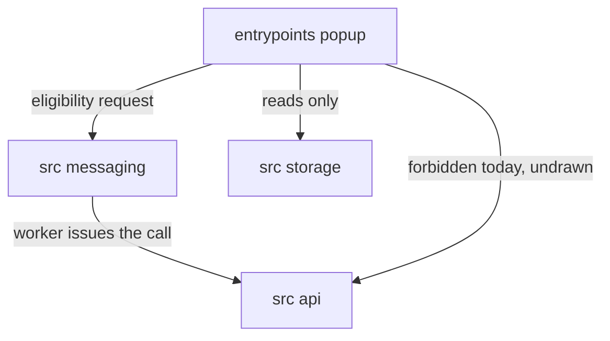
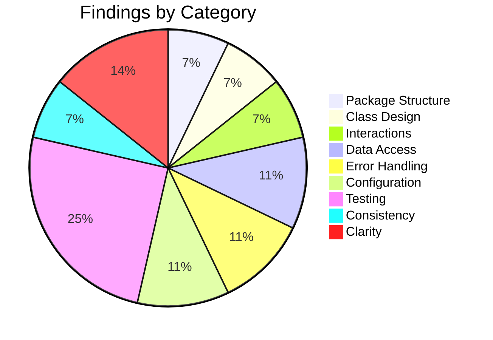

# Low-Level Design Review: Boomerang

**Document Reviewed:** `design/boomerang-low-level-design.md`
**Requirements Reference:** `design/boomerang-requirements.md`
**High-Level Design Reference:** `design/boomerang-high-level-design.md`
**Review Date:** 2026-08-27
**Reviewer:** Claude (Automated Review)

---

## Executive Summary

This is the sixth review of a document that has already absorbed five, and the standard it holds is
high: the module graphs declare themselves exhaustive, the error taxonomy is closed, the storage
layer reasons about its own failure modes in bytes, and §10 records what it declines and why. The
findings below are therefore narrow and specific, and most of them are of one shape — a rule stated
correctly in one section and contradicted, unwired, or uncited in another.

The single most important finding is that **three sections disagree about who makes FR-3.4.2's
pre-offer eligibility call.** §4.3 puts the call site in the popup; §7.2 states the popup constructs
no `src/api/` and "has no egress"; §2.2's dependency graph — which declares that an undrawn edge is
forbidden — draws no popup-to-api edge and enumerates no message that would route it through the
worker. One of those three is wrong, and the requirement they disagree about is the one that decides
whether a user is ever offered a pickup that cannot be booked.

**Overall Verdict:** Needs targeted fixes before proceeding

---

## Section Verdicts

| Review Area | Verdict | Findings |
|-------------|---------|----------|
| Package/Module Structure | Partially Addressed | 2 |
| Class/Type Design | Sufficient | 2 |
| Class Interactions & Workflows | Partially Addressed | 2 |
| Data Access Layer | Partially Addressed | 3 |
| Error Handling | Partially Addressed | 3 |
| Configuration & Wiring | Partially Addressed | 3 |
| Testing Completeness | Partially Addressed | 7 |
| Consistency with High-Level Design | Sufficient | 2 |
| Specification Clarity | Partially Addressed | 4 |

---

## 1. Package/Module Structure

### Current State

Two workspaces. The server is one layered Python package with a one-directional layering rule drawn
in §2.1 and a fourteen-row module table; routes call services, services call carriers and bedrock,
nothing calls upward, and `middleware` is explicitly placed around the app rather than above it. The
extension is one WXT package whose §2.2 graph is declared **complete** — "an edge that is not drawn
is not permitted" — with two named leaf exemptions, `src/types/` and `src/config.ts`, justified by a
property rather than by fiat.

### Strengths

- The completeness claim on the extension graph is the strongest structural device in the document.
  It converts every later omission into a detectable contradiction rather than a silent gap, which
  is exactly how PKG-1 below became findable.
- The `src/extract/` two-context split is reasoned from where the payload is at the moment it would
  leave, not from where the module happens to live, and the purity of the scan is what makes the
  split work rather than a coincidence it relies on.
- `middleware` being drawn out of the layering with a stated reason prevents the most likely
  misreading of a layered graph.
- The server table names exports per module, so the layering rule is checkable against imports.

### Gaps and Recommendations

| ID | Gap | Package(s) | Priority | Recommendation |
|----|-----|------------|----------|----------------|
| PKG-1 | §2.2's graph declares itself exhaustive and draws no edge from `entrypoints popup` to `src api`. §4.3 states the opposite in prose: "The extension also calls `POST /pickups/eligibility` on its own, once, before it offers the pickup at all. **The call site is the popup.**" §7.2 states a third thing: "The popup constructs no `src/api/`, no `src/driver/` and no `src/adapters/` — it has no egress." All three cannot hold. The requirement at stake is FR-3.4.2, whose whole content is that the unserviceable answer arrives *before* the offer rather than after the user says yes | `entrypoints/popup/`, `src/api/`, `src/messaging/` | **Must Address** | The document SHALL pick one call site and make the other two sections agree. The recommended resolution is that the **worker** owns the call, because §2.2's single-egress rule and §7.2's no-egress-in-the-popup rule are both load-bearing and the popup is the surface that dies most often: §2.2 SHALL keep the popup with no api edge, §4.3 SHALL be reworded so the popup *requests* the check through `src/messaging/` and the worker issues it, and §7.2's messaging enumeration SHALL name that message. If instead the popup is to call directly, §2.2 SHALL draw `POPUP --> API` and §7.2's "no egress" sentence SHALL be struck |
| PKG-2 | `app/carriers/usps/` exports `UspsAdapter` **and** `ScriptedUspsAdapter` (§2.1 module table), so the strict test double is packaged into the deployed artefact. §7.1 and §8.2 then spend a flowchart assertion and a unit row proving that no value of `CARRIER_ADAPTER` constructs it. §10 declines merging the two doubles on the grounds that "a single class with a `strict` flag would ship the strict path's failure mode into production" — but the strict class is shipped regardless, and the guard against constructing it is a test rather than a boundary | `app/carriers/usps/` | **Should Address** | `ScriptedUspsAdapter` SHOULD live in the server test tree and be imported by tests only, so that "no deployment can construct it" is a packaging fact rather than an asserted one. The §8.2 row SHOULD be kept — it costs nothing and it catches a re-introduction — but it SHOULD NOT be the primary control. This does not reopen §10's decline, which is about merging the two classes, not about where the double lives |

### Verdict: **Partially Addressed**

---

## 2. Class/Type Design

### Current State

Five class diagrams — server carriers and services, the model boundary, the extension driver, the
extension storage layer — plus §3.5, which defines the eleven types the diagrams invent and
deliberately defers every entity to high-level design §4.2 rather than restating it. Type discipline
is used where it earns its keep: `EvictedOrders` and `ReclaimedBytes` are distinct newtypes
specifically so a caller that swapped them fails to compile, `ValidatedAction` is a construction
rule rather than a shape, and `derive_label_carrier` returns `str or None` so that a miss is
explicitly not a value.

### Strengths

- One clock instance injected twice rather than two clocks, with the failure that motivates it
  stated — a bug that would surface only under a test advancing one and not the other.
- `save_intent(request, consent)` takes the consent stamp as an argument so that NFR-6.2's record is
  structurally inseparable from the thing it consents to; the reasoning that a `clock` call inside
  the repository would record the wrong instant is exactly right.
- `clear_all` returning `ClearResult` rather than `void`, because the carve-out is impossible to
  honour from a call site that got nothing back.
- The two repositories that reason about time take a clock and `ReturnRepository` does not, because
  it stamps nothing. Dependencies are minimal rather than uniform.

### Gaps and Recommendations

| ID | Gap | Class/Type | Priority | Recommendation |
|----|-----|------------|----------|----------------|
| CLASS-1 | `list_unsettled() list` declares neither an element type nor the predicate that decides membership, and it is the most consequential signature in the storage layer: §5.2's eviction carve-out, §5.2's rebuild carve-out and §4.3's clear carve-out are all keyed on what it returns. High-level design §4.3 supplies a definition — "neither cancelled, collected nor abandoned" — but this document never restates or cites it, and this document is where the derived states that complicate it are introduced | `PickupRepository` (§3.4) | **Should Address** | The signature SHALL read `list_unsettled() list~Pickup~` and §3.4 SHALL state the predicate in one sentence, citing high-level design §4.3, and SHALL say explicitly whether the predicate is evaluated against the **derived** state or the **stored** one. See DAL-2 — the two answers produce different eviction behaviour |
| CLASS-2 | §7.2 says the popup constructs a **read-only** `StorageCoordinator` and "never calls `transact`, `evict_to_fit`, `evict_if_over_cap` or `clear_all`". That is the rule that keeps the serialising queue meaningful, and it is enforced by prose alone: the class the popup holds exposes all four methods, so the single-writer invariant survives only as long as everyone remembers it | `StorageCoordinator` (§3.4), the popup graph (§7.2) | **Should Address** | §3.4 SHOULD declare a narrow read interface — the four repository read methods and nothing else — and §7.2 SHOULD state that the popup is wired against that interface rather than against `StorageCoordinator`. The single-writer rule is the one invariant in the extension whose violation is invisible at runtime, and it is the one currently held by a sentence |

### Verdict: **Sufficient**

---

## 3. Class Interactions & Workflows

### Current State

Six sequence diagrams: ingestion first run, the adapter miss with its fail-closed egress scan,
scheduling with the provisional record, rehydration after worker termination, cancellation as
refresh-then-delete with three branches, and the label choice with carrier derivation. Failure paths
are drawn rather than described — §4.5 in particular carries the already-collected branch and the
cancel-refused branch, and §4.2 carries the branch where the scan itself throws.

### Strengths

- §4.5 exists because refresh-before-cancel is an *ordering* constraint, and §10 says so; the
  document adds diagrams for ordering and declines them for decoration, which is the right rule.
- §4.2's fail-closed branch covers both a flagged payload and a scan that cannot complete, and the
  ordering rationale is stated rather than implied.
- §4.4's rehydration returns `chosen_option`, closing the window a previous round opened when
  derivation moved to the label page.

### Gaps and Recommendations

| ID | Gap | Workflow | Priority | Recommendation |
|----|-----|----------|----------|----------------|
| INTERACT-1 | No workflow shows FR-3.4.2's pre-offer eligibility call at all. §4.3's diagram shows only the server-side gate inside `schedule`; the client-side check that decides *what to show* appears in one paragraph of prose and in no diagram, no message enumeration, and no dependency edge. §8.2's `src/messaging/` row asserts that "only enumerated messages" are served, so a message that no section enumerates cannot be sent — which means the flow as written in §4.3 is unimplementable through the messaging boundary and forbidden through the graph. This is the workflow half of PKG-1 | FR-3.4.2 pre-offer eligibility | **Must Address** | §4.3 SHALL gain a short sequence — popup asks, worker issues `POST /pickups/eligibility`, worker answers, popup renders the offer or the second answer — or the call SHALL be folded into an existing diagram with its participants named. Whichever call site PKG-1 settles on, the message or the edge SHALL be enumerated where §2.2 and §7.2 can see it |
| INTERACT-2 | §4.3 draws `SW->>SW: confirmation screen, consent captured`, collapsing the user's gesture and the recorder of that gesture into one participant. The confirmation screen is a UI surface and the service worker is not one, so the diagram hides the boundary crossing on which NFR-6.2 turns: where `consented_at` is sampled, where `consent_extension_version` is read from the manifest, and how both reach `save_intent` without passing through a `clock` call in the repository — which §3.4 explicitly forbids | §4.3 scheduling; NFR-6.2 | **Should Address** | §4.3's diagram SHOULD carry the surface that renders the confirmation screen as its own participant, with the consent stamp shown crossing to the worker as data. §3.4 already states the three properties that make the stamp correct; the diagram SHOULD show the one hop where all three could be lost |

### Missing Workflow Coverage

| Requirement | Workflow Documented? | Notes |
|-------------|---------------------|-------|
| FR-3.4.2 graceful second answer | No | The server-side gate is drawn in §4.3; the client-side pre-offer check that the requirement is actually about is prose only. See INTERACT-1 |
| NFR-6.2 consent capture | Partial | Drawn, but with the gesture and the recorder as one participant. See INTERACT-2 |
| FR-3.1.1 to FR-3.1.5 ingestion | Yes | §4.1, with the validation edge drawn |
| FR-3.3.5 carrier derivation | Yes | §4.6, three sources with the miss as a complete outcome |
| FR-3.3.9 state machine | Yes | §4.6 for the three choice edges, §4.5 for the collection branch |
| FR-3.4.6 cancellation | Yes | §4.5, all three branches |
| FR-3.7.2 two-tier permissions | Yes | §4.1 first run, with the offer after the scan |

### Verdict: **Partially Addressed**

---

## 4. Data Access Layer

### Current State

The server has none, stated in one line in §5.1 and correct. The extension's store is
`chrome.storage.local` behind four repositories and a `StorageCoordinator` that owns everything
crossing entities. `transact(fn)` is honestly named as a serialising queue rather than a
transaction, with the third guarantee — rollback — explicitly withheld. Two evictors exist because
they answer different questions in different units, quota rejection is a failure the user is told
about, and two state transitions are derived at read time because nothing exists to fire an event.

### Strengths

- Refusing to call `transact` a transaction, and stating precisely which two guarantees it gives and
  which one it withholds, is the most valuable paragraph in the section.
- The eviction carve-out is derived from the ERD join path rather than asserted, and the refusal to
  denormalise `order_id` onto `PICKUP` is argued from the consequence — two paths to one answer that
  can disagree about the record holding a booked carrier visit.
- `evict_to_fit` measuring a candidate by serialising it, admitting the figure is an estimate, and
  checking the truth once with `getBytesInUse` rather than per candidate.
- The rebuild carve-out for unsettled pickups, and the insistence that a quota-exceeded write is
  never swallowed.

### Gaps and Recommendations

| ID | Gap | Priority | Recommendation |
|----|-----|----------|----------------|
| DAL-1 | The quota-repair path can undo its own repair. §5.2 says `evict_to_fit` performs "its reads and its single eviction `set` **directly**, not through `transact`", inside the still-held transaction slot, and then "the coordinator calls `evict_to_fit` once and retries the write a single time". But `transact` "commits **every touched key** in a single `set`", and the composed object was built by `fn` from a read taken **before** the eviction. The commonest quota trigger is an ingest upsert, which touches the orders key — the very key `evict_to_fit` just rewrote. Re-issuing that composed `set` writes the pre-eviction orders collection back, restoring every evicted order and presenting a write of the same size, so the retry fails identically. That is precisely the "retry loop that cannot converge" the document rejects `evict_if_over_cap` for, arrived at from the other direction | **Must Address** | §5.2 SHALL state that the retry **re-runs `fn`** against post-eviction state rather than re-issuing the composed write, and §3.4 SHALL record the consequence in `transact`'s contract: `fn` must be re-runnable and must not be assumed to run exactly once. If `fn` is instead required to be run once, then `evict_to_fit` SHALL NOT be permitted to write any key the pending composed write also touches, and the document SHALL say which keys those are |
| DAL-2 | `Booking → Abandoned` is **derived by a clock at read time**, and an `Abandoned` pickup is outside the eviction carve-out — §4.3 says so explicitly: "`BOOKING_ABANDONED_AFTER_HOURS` is what stops the record pinning its order against eviction forever." So `BOOKING_ABANDONED_AFTER_HOURS` after a lost schedule response, the order becomes evictable with no observation of any kind, and eviction deletes the `PICKUP` that carries NFR-6.2's `consented_at` and `consent_extension_version` for a booking that may be live at USPS. §5.2 elsewhere states the opposite priority: "a dropped `save_intent` or `promote` costs a booked carrier visit the product can no longer see, which is the failure this whole layer is built to prevent." §5.2 also says the only writes that follow are "the ones that follow a real observation — `mark_abandoned` when the user is shown the abandoned record and confirms it" — but by then the record may be gone, so `mark_abandoned` can have no subject | **Should Address** | The carve-out predicate SHOULD read against the **stored** state rather than the derived one, so that an order is unpinned by `mark_abandoned` — the write that follows the user actually being shown the record — rather than by the clock alone. High-level design §4.3's wording ("a pickup that has not been cancelled, collected **or abandoned**") is satisfied either way, because it names states rather than the moment they are decided; this is a low-level choice, and the current one discards a compliance record for a possibly-real booking without anyone seeing it |
| DAL-3 | `getBytesInUse` is called once before and once after the eviction batch and the difference is what the retry decision uses, but the eviction runs inside a transaction that holds the write slot while a **content script and a popup may be reading**. Nothing in §5.2 says whether a concurrent write from outside the coordinator is possible — §2.2's single-writer rule says it is not — but if it ever became possible the before-and-after difference would attribute another writer's change to the eviction | **Consider** | §5.2 MAY state that the before-and-after measurement is sound *because* of the single-writer rule, tying the two together explicitly. It is a one-sentence cross-reference and it makes the measurement's precondition visible to whoever next relaxes the single-writer rule |

### Verdict: **Partially Addressed**

---

## 5. Error Handling

### Current State

One server hierarchy of nine subclasses, each the sole owner of one reason code, converted once by a
single FastAPI handler that no route bypasses. The status code is explicitly disclaimed as the branch
key — five reasons share 409 — and `reason` is named as the contract. On the extension, nine handling
classes with a mapping table that claims to be **total** over every failure the high-level design
enumerates, plus a redaction allowlist argued from the failure mode of a denylist.

### Strengths

- "A negative eligibility answer is not an error, and the eligibility endpoint never raises one" —
  with the argument that modelling it as an error would leave `EligibilityResult.eligible` with no
  reachable `false` case. That is a type-level argument for a product rule and it is the right one.
- The retry asymmetry, and the separate reasoning for why `DELETE /pickups/...` is not retried: a
  bare retry carries a token USPS has already seen and is *guaranteed* to be refused.
- `WrongCarrierLabel` explicitly recorded as a backstop, with the dependency written down so the
  reverse cannot be read into it.
- Redaction as an allowlist, with the accepted cost stated plainly.

### Gaps and Recommendations

| ID | Gap | Priority | Recommendation |
|----|-----|----------|----------------|
| ERR-1 | §6.2's mapping table declares itself total — "Every failure path the high-level design enumerates lands in one of the nine rows above. The mapping is deliberately total" — and then does not classify a transport failure on `POST /returns/next-step`. The read-only row is scoped to "ingest, eligibility, refresh, or any read", and the two no-retry rows name `POST /pickups` and `DELETE /pickups/...`. Worse, two client deadlines both apply to that call with no stated precedence: `API_REQUEST_TIMEOUT_MS` at 12000 ms bounds "a single request to the server", and `MODEL_FALLBACK_TIMEOUT_MS` at 5000 ms bounds the action call site. §8.3's "Fallback timeout becomes report stuck" row silently assumes both that the shorter one wins and that no retry follows — neither of which any rule states | **Must Address** | §6.2 SHALL add a row for the action fallback: bounded by `MODEL_FALLBACK_TIMEOUT_MS`, **not retried**, and exhaustion becomes `report_stuck`. §7.2 SHALL state that `MODEL_FALLBACK_TIMEOUT_MS` supersedes `API_REQUEST_TIMEOUT_MS` on that one route rather than adding to it. Retrying that call three times would also multiply Bedrock spend by three on an unauthenticated endpoint with five reserved slots, which NFR-6.7 has an interest in |
| ERR-2 | The invariant that the client outlasts the server is justified per *deadline* and then applied per *request*, and the arithmetic fails on the one endpoint where it matters most. §7.2: "`API_REQUEST_TIMEOUT_MS` is set above the server's own longest upstream deadline — the parse budget of `BEDROCK_TIMEOUT_PARSE_MS` plus request overhead", giving 12000 against 9000. But `POST /pickups` makes **two sequential USPS calls** — §4.3 and FR-3.4.1 require eligibility inside `schedule`, with no cache — each bounded at `USPS_TIMEOUT_MS` of 8000 ms, for a legitimate server-side worst case of 16000 ms before any token fetch on a cold container. The client abandons at 12000 ms, and `POST /pickups` is the one call with **no retry**: the intent record stays in `Booking`, the user is told it could not be confirmed, and USPS may nonetheless have booked the pickup. This is the exact failure the write-ahead intent record exists to make survivable, reached through a deadline mismatch rather than a lost response | **Must Address** | Either `API_REQUEST_TIMEOUT_MS` SHALL be raised above the schedule path's *composed* worst case — `2 x USPS_TIMEOUT_MS` plus overhead — or `USPS_TIMEOUT_MS` SHALL be lowered so that two sequential calls fit inside it, or the schedule route SHALL carry its own longer client deadline. Requirements §5.2's wording ("above the server's longest upstream deadline") reads per-deadline and SHOULD be amended to say per-request, in the same manner §10 records for the other four upstream amendments. Whichever is chosen, §7.2's justifying sentence SHALL be rewritten, because it currently proves a weaker claim than the one it is used for |
| ERR-3 | Requirements §4.2 documents `upstream-unavailable` as "USPS or Bedrock failed; **safe to retry**", and §6.2 correctly does not retry it on `POST /pickups` — where a retry could double-book — or on the cancel route. The reason code's documented meaning and the client's actual behaviour therefore diverge, and the divergence is not noted anywhere | **Consider** | §6.2 MAY note that `upstream-unavailable` is safe to retry *on the read-only routes only*, and requirements §4.2's gloss MAY be narrowed to match. Nothing is currently wrong in the code this would produce; the risk is a future client reading the reason table and retrying a schedule |

### Verdict: **Partially Addressed**

---

## 6. Configuration & Wiring

### Current State

Server startup is a flowchart from Mangum through cold-start branching, model verification, adapter
selection and conditional SSM fetch, ending with settings and adapter on application state. One
typed `Settings` object with seventeen validated fields. The extension wires by constructor injection
in `entrypoints/background.ts` with no DI framework, every configuration value a build-time constant,
and the popup wired separately with its own smaller graph.

### Strengths

- "This table restates requirements §5.2; it does not extend it", with the four constants that
  previously violated that rule named and the going-forward rule stated: a value a deployment can
  change belongs upstream first. That paragraph is the single best governance device in the document.
- An unrecognised `CARRIER_ADAPTER` failing the cold start with no default arm, argued from the fact
  that the plausible default is wrong in both directions.
- Selecting the mock logging at `WARNING` rather than `INFO`, because it is the default and therefore
  the case nobody reads a log line about.
- `min_client_version` compared component-wise with `0.10.0` against `0.9.0` named explicitly, and an
  absent version treated as below rather than as unrestricted.
- `request_id` cleared in a `finally`, with the warm-container reasoning that makes "the next request
  overwrites it anyway" not a guarantee.
- The production bundle asserted by deriving the extension ID from the emitted manifest rather than
  by scanning for the dev key's bytes — the stronger check, and the one matching the failure.

### Gaps and Recommendations

| ID | Gap | Priority | Recommendation |
|----|-----|----------|----------------|
| CONF-1 | `contracts/` is given two incompatible definitions. §8.1: "`contracts/` is a shared fixture directory, **not a code artefact**, and that is the point", holding "canonical request and response JSON per endpoint". §7.2: "`MOCK_CONFIRMATION_PREFIX` is **imported**, not declared here... the constant is the server's and travels in `contracts/`; a second copy declared in `src/config.ts` would drift apart from the first." An import requires an exported symbol, which a JSON fixture directory does not have, and the mechanism by which a TypeScript module and a Python module both consume one string from a directory of JSON is nowhere specified. The same problem applies to `X-Boomerang-Client-Version`, which §8.1 says the payloads "carry" | **Should Address** | §8.1 SHALL say how a shared *value* is published from a directory of shared *payloads* — a `constants.json` read by both suites, a generated single-line module per workspace, or the string appearing only inside the payloads and being asserted rather than imported. The third option is the one consistent with "the files are the contract", and it would mean §7.2's "imported" is the sentence to change |
| CONF-2 | `MOCK_CONFIRMATION_PREFIX` is a requirements §5.1 parameter and has no field in §7.1's `Settings` table. §8.2's `app/config.py` row asserts that "a `Settings` built from a fully populated environment matches the §7.1 table field for field — the test that catches a row added to the table and never to the class", and D18's sweep checks every `_PREFIX` constant "against the requirements' §5 tables and against the code that reads it". §3.1 says the mock adapter exports it as a module constant, which is a fourth location and not one either check looks at | **Should Address** | §7.1 SHOULD either add the field to `Settings` — the simplest reconciliation, since requirements §5.1 is where it is declared — or state in one line why a §5.1 row deliberately has no `Settings` field, so that D18's sweep has a documented exemption to read rather than a discrepancy to report. Requirements §5.1 already hints at the answer with "Not configurable per deployment", which suggests §5.1 may be the wrong table for it |
| CONF-3 | §7.1's flowchart puts `verify bedrock model config` in the lifespan **after** `build Settings from the environment`, while the `Settings` table declares `bedrock_model` "none, required; non-empty". If construction already rejects an absent model, the lifespan branch labelled "absent or empty" is unreachable; if it does not, the table's validation column overstates. The prose then attributes the `ListInferenceProfiles` message to the startup check without saying which of the two produces it | **Consider** | §7.1 MAY state that `Settings` enforces presence and non-emptiness while `verify_config` enforces only the regional-prefix warning, and the flowchart's first branch MAY be relabelled accordingly. As written, the two checks overlap and the §8.2 row asserting that "an absent `BEDROCK_MODEL` fails startup" does not say which one it is asserting against |

### Verdict: **Partially Addressed**

---

## 7. Testing Completeness

This is the most critical section of the low-level design review.

The strategy itself is strong and unusually honest. Doubles are chosen by what they must be able to
refuse, not by what they must return: `ScriptedUspsAdapter` raises on an unscripted call and fails at
teardown on an undrained one; the storage fake must be able to **say no** to a quota; `WorkerLifecycle`
exists so a test can *cause* the worker's death rather than simulate a fresh reader. §8.5 names what
is deliberately untested and refuses to point at suites that do not exist. Both workspaces now carry a
95% line and branch floor, with `entrypoints/` excluded by an explicit named list rather than a glob.

The findings below are almost entirely about the **traceability table**, which is the control §10
leans on hardest and is the artefact most likely to be read as coverage.

### 7.1 Unit Test Assessment

| ID | Gap | Class | Requirement | Priority | Recommendation |
|----|-----|-------|-------------|----------|----------------|
| TEST-1 | **FR-3.4.5b is absent from §8.4's traceability table.** The table opens by asserting "Every functional requirement maps to at least one test above", and every other requirement from FR-3.1.1 to FR-3.7.3 has a row, including FR-3.4.5a. Two §8.2 rows do test it — `src/popup/` simulated bookings and `app/carriers/mock.py` — so the tests exist and only the trace is missing, but the table is exactly the artefact D18's sweep and §10's "every `FR-` upstream is cited somewhere here" rule are meant to protect, and the newest requirement is the one it dropped | `src/popup/`, `app/carriers/mock.py` | **Must Address** | §8.4 SHALL gain an `FR-3.4.5b` row citing both existing unit rows, and SHALL note that the determination is made from the confirmation number rather than the build environment, which is the property the requirement turns on. §10's proposed sweep SHALL be run against this table before the next revision, since it would have caught this in seconds |
| TEST-2 | **§8.4's NFR-6.5 row cites a test that §8.2 struck.** The row reads "Order validator; `app/models/` strictness rows; **`sender.origin` refusal**; the CORS configuration row" — but §8.2's `src/messaging/` row struck `sender.origin` mismatch refused on 2026-08-27 under D6, because `externally_connectable` is absent and `onMessageExternal` is never registered. So the traceability table cites a deleted test for a security NFR. The consequence is worse than a stale reference: NFR-6.5's obligation "no origin but the pinned ones is served" is now left with only the CORS row, which §8.3 **explicitly disclaims** — "The CORS row asserts configuration, not protection" — so the obligation has no live verifier at all | `src/messaging/` | **Must Address** | §8.4's NFR-6.5 row SHALL drop the `sender.origin` citation and SHALL replace it with the FR-3.7.1 manifest assertion that `externally_connectable` is absent, which is the stronger property §8.2 says it is. The row SHALL also restate the origin obligation honestly: with no external sender surface and CORS disclaimed as a control, what actually holds the boundary is the bounded payload, the reserved concurrency and the token ceiling — and the row SHOULD say so rather than implying an assertion exists |
| TEST-3 | §8.2's coordinator row asserts "a quota rejection calls `evict_to_fit` once, retries once, then **raises**" and that "`evict_to_fit` frees at least the requested bytes and still honours the carve-out". Neither assertion covers what the **retried write contains**, which is where DAL-1 lives. A suite with these rows passes against an implementation that re-issues the pre-eviction composed object and therefore never converges | `StorageCoordinator` | **Should Address** | §8.2 SHALL add: after a quota rejection and a successful eviction, the retried write **does not contain the evicted orders** — asserted by reading the store after the retry succeeds, not by inspecting the call. This is the assertion that makes DAL-1's fix verifiable and its absence detectable |
| TEST-4 | No unit row covers the composed schedule deadline of ERR-2. `app/config.py`'s row asserts that each of the three upstream deadlines is below `function_timeout_ms`, which is the weaker of the two constraints; nothing asserts that the schedule path's two sequential USPS calls fit inside the client's own per-attempt deadline | `app/config.py`, `app/services/pickup.py` | **Should Address** | Once ERR-2 is resolved, §8.2 SHOULD carry the resulting arithmetic as a validation: whichever relationship is chosen between `USPS_TIMEOUT_MS`, `API_REQUEST_TIMEOUT_MS` and the number of carrier calls on the schedule path SHOULD be a rejected-value test in `app/config.py`, so the invariant cannot be broken by a later deploy-time tuning |

### 7.2 Integration Test Assessment

| ID | Gap | Requirement | Priority | Recommendation |
|----|-----|-------------|----------|----------------|
| TEST-5 | FR-3.4.2's client-side pre-offer eligibility check has no integration row. "Ineligible address" sets up "Mock returns not serviceable" and asserts the answer is "presented as a normal second answer" — but that exercises the server's answer, not the **ordering** the requirement is about: that the check happens before the offer is rendered, so the user is never offered a pickup that cannot be booked. With INTERACT-1 unresolved, there is also no wiring for such a test to drive | FR-3.4.2 | **Should Address** | §8.3 SHOULD gain a row asserting the ordering directly: with the address scripted unserviceable, **no "schedule a free pickup?" affordance is ever rendered**, and the second answer appears in its place — asserted against the rendered surface, so the constraint holds however the flow is later restructured. The negative assertion is the one the requirement asks for, in the same spirit as the existing "no return begins without a naming gesture" row |
| TEST-6 | §8.3's "Clear all data with a live pickup" asserts one of high-level design §4.3's three clear-path obligations. The high-level design requires: enumerate and offer to cancel; **and if the user clears anyway, show the confirmation numbers and scheduled dates one last time so they can be kept**; and booking copy that tells the user the number is theirs to keep. Only the first is asserted, and the second is the one that decides whether a user who proceeds is left able to phone USPS | FR-3.4.6, high-level design §4.3 | **Consider** | §8.3 MAY extend the row: after the user declines cancellation and confirms the clear, the confirmation numbers and their dates are displayed before deletion. See CONSIST-1 — the obligation may be worth carrying into this document's prose first, since it currently appears only upstream |

### 7.3 Requirements Traceability Gaps

| Requirement | Unit Tests? | Integration Tests? | Gap | Recommendation |
|-------------|-------------|-------------------|-----|----------------|
| FR-3.4.5b simulated bookings disclose themselves | Yes | No | Tested by two unit rows and **traced by none** — absent from §8.4 entirely. No integration row asserts the marker surviving a full mock-backed booking | Add the §8.4 row (TEST-1). An integration row is not required; the unit rows cover both halves and the prod-bundle case |
| FR-3.4.2 graceful second answer | No | Partial | The server's negative answer is covered; the client's pre-offer ordering is not, and has no wiring to be covered by | Add the ordering row (TEST-5) once PKG-1 and INTERACT-1 settle the call site |
| NFR-6.5 security | Partial | Partial | The origin half of the obligation cites a struck test and is otherwise carried only by a row that disclaims itself | Retrace to the manifest absence assertion and restate the obligation honestly (TEST-2) |
| FR-3.6.2 landing page | No | No | Explicitly out of this document's scope — a `client/` surface with its own tests. §8.4 records the gap as deliberate | No action. The declaration is the right treatment |
| FR-3.6.3 dashboard | No | No | Out of PoC scope as of 2026-08-27 under D6. The row was removed rather than skipped, since a skipped test claims the feature exists | No action. Removal rather than skipping is the correct choice |
| NFR-6.6 infrastructure | No | No | Terraform properties; no infrastructure test tier exists in this document. Now owned by plan Tasks I.1 and I.2 | No action here. The ownership transfer under D7 and D8 is the honest resolution |
| NFR-6.7 abuse and spend | No | No | Same owner, same reasoning; §10 also declines a load test against reserved concurrency on the grounds that it would confirm AWS works | No action here |

### 7.4 Test Infrastructure Assessment

| ID | Gap | Priority | Recommendation |
|----|-----|----------|----------------|
| TEST-7 | §8.1 requires the storage fake to reproduce atomic per-`set` semantics and to be able to refuse on quota, both correctly justified. It does not say what the fake's `getBytesInUse` returns. §5.2's retry decision uses the before-and-after difference on the orders key as ground truth, and the "evict until the freed estimate reaches the requested bytes **plus a margin**" rule exists precisely because the fake's accounting and Chrome's will differ | **Consider** | §8.1 MAY state the fake's accounting model in one line — key length plus serialised value length, or whatever is chosen — so that the margin in §5.2 is calibrated against something stated rather than against an implementation detail of the fake. A test that passes because the fake under-reports overhead would pass for the wrong reason |

### Verdict: **Partially Addressed**

---

## 8. Consistency with High-Level Design

### Alignment Check

| High-Level Element | Low-Level Correspondence | Status | Notes |
|-------------------|-------------------------|--------|-------|
| §3 components — extension, stateless service | §2.1 layered server package, §2.2 extension graph | Aligned | Boundaries match; the extension graph is stricter than the high-level design requires, which is the right direction |
| §4.2 ERD, seven entities | §3.5 defers every entity upward and defines only the eleven types this document invents | Aligned | The refusal to restate entity fields is correct and is the reason `label_carrier` was findable as an orphan in an earlier round |
| §4.3 data lifecycle and eviction carve-out | §5.2 eviction, two evictors, the join walk | Partially aligned | The carve-out predicate matches on paper. The **moment** it is evaluated does not — see DAL-2 |
| §4.3 clear path, three obligations | §4.3 carve-out, `ClearResult`, one §8.3 row | Misaligned | Only the enumerate-and-offer obligation is carried. See CONSIST-1 |
| §5.1 to §5.4 data flows and the failure-path table | §4.1 to §4.6, §6.2's totality mapping | Partially aligned | Every enumerated failure lands somewhere, but the mapping omits the action-fallback transport failure. See ERR-1 |
| §6.3 stateless server, no idempotency key | §4.3, §5.2, §10's accepted-and-left-open finding | Aligned | Correctly identified as an upstream decision this document is downstream of |
| §7.4 model output is untrusted input | §3.2 model boundary, `ValidatedAction`, closed vocabulary | Aligned | Construction rule rather than a shape is the stronger encoding |
| §8.1 to §8.4 deployment, Mangum lifespan, build-time constants | §7.1 startup order, §7.2 extension wiring | Aligned | The lifespan-must-stay-on warning and the silent-failure note are exactly right |
| §8.4 UPS build-time flag | Not carried; §10 declines reconciling it | Aligned | The decline is sound — an unimplemented switch that is off documents a seam and contradicts nothing |
| §11 open questions | §9, three answered and one narrowed | Aligned | Struck rather than deleted, with the answer attached to the question |

### Gaps and Recommendations

| ID | Gap | Priority | Recommendation |
|----|-----|----------|----------------|
| CONSIST-1 | High-level design §4.3 states three obligations on the clear path. This document carries the first — enumerate uncancelled pickups and offer cancellation, via `ClearResult` and §4.3's carve-out — and neither of the other two: that a user who clears anyway is shown the confirmation numbers and scheduled dates **one last time**, and that booking confirmation copy tells the user the number is theirs to keep rather than implying Boomerang can retrieve it. Both are user-facing consequences of the same local-only-state hazard the carve-out exists for, and the second is a copy rule of exactly the kind FR-3.4.7 is treated as | **Should Address** | §5.2 or §4.3 SHOULD carry the show-one-last-time obligation, since `ClearResult` is the type that would have to convey it and this document owns that type. The copy obligation SHOULD be named alongside FR-3.4.7's copy gate in §8.5, where the other human review gates are recorded, so it is not mistaken for something a test covers |
| CONSIST-2 | High-level design §4.3 says pickups are exempt from eviction until "cancelled, collected or abandoned", naming states without saying when they are decided. This document introduces read-time derivation for two of the three transitions, which is a genuine low-level addition, and it silently changes what the upstream sentence means in the abandoned case | **Consider** | Once DAL-2 is resolved, §5.2 MAY note that read-time derivation is this document's addition and state which carve-outs read the derived state and which read the stored one. The document's own standard — "upstream wins; it is not that upstream is never wrong" — suggests naming the divergence rather than absorbing it |

### Verdict: **Sufficient**

---

## 9. Specification Clarity

The document is, by a wide margin, more precise than most designs at this stage. It states contracts
rather than intentions, argues from failure modes rather than from preference, and §10 records what
it declined so the next reader does not re-derive it. Ambiguous modal language is essentially absent:
there is no "TBD", no "TODO", and no "choose an appropriate strategy". The items below are the
remaining places where an implementer would have to guess.

### Items Requiring Clarification

| ID | Item | Section | Issue | Question |
|----|------|---------|-------|----------|
| UNCLEAR-1 | "unsettled", "uncancelled", "non-terminal" | §4.3, §5.2, §8.2, §8.3 | Ambiguous | Three words govern three carve-outs — eviction, rebuild, and the clear path — and none is defined in this document. §5.2's eviction says "an unsettled pickup"; §8.2's storage row says "clear enumerates **uncancelled** pickups"; §8.3's clear row sets up "one **uncancelled** pickup". Are these one set or three? High-level design §4.3 defines one of them; which of the three does it define, and do the other two mean the same thing? |
| UNCLEAR-2 | `transact(fn)` | §3.4 | Undefined contract | May `fn` be invoked more than once for a single `transact` call? DAL-1 turns entirely on the answer, and §3.4 states what `transact` guarantees about `set` batching without stating anything about `fn`'s own invocation. Relatedly: what makes a key "touched" — read, written, or either? |
| UNCLEAR-3 | "plus a margin" | §5.2 | Undefined | `evict_to_fit` evicts "until the freed estimate reaches the requested bytes **plus a margin**, rather than stopping at the first candidate whose arithmetic just barely covers the write." The margin is neither a number, a proportion, nor a named constant, so two implementers produce two different eviction volumes and the §8.2 assertion "frees at least the requested bytes" cannot distinguish them. Is the margin a fixed percentage, a fixed byte count, or one more candidate? |
| UNCLEAR-4 | "read-only `StorageCoordinator`" | §7.2 | Ambiguous | Is this a distinct type, a differently-constructed instance of the same class, or the same class with four methods that the popup is trusted not to call? §7.2's sentence supports all three readings and the single-writer invariant depends on which one is meant. See CLASS-2 |

### Verdict: **Partially Addressed**

---

## Summary of Recommendations

### Must Address (Blocking — resolve before implementation)

1. **PKG-1:** Three sections disagree on the call site for FR-3.4.2's pre-offer eligibility check — §4.3 says the popup, §7.2 says the popup has no egress, §2.2's exhaustive graph draws no such edge. Pick one and reconcile all three.
2. **INTERACT-1:** That same call has no sequence diagram, no enumerated message, and no dependency edge, so it is unimplementable through the messaging boundary as written.
3. **DAL-1:** The quota retry can re-issue the pre-eviction composed write, restoring every evicted order and producing the non-converging retry loop the document rejects `evict_if_over_cap` for. State that the retry re-runs `fn` against post-eviction state.
4. **ERR-1:** §6.2's mapping table declares itself total and does not classify a transport failure on `POST /returns/next-step`; two client deadlines apply to that call with no precedence rule.
5. **ERR-2:** `API_REQUEST_TIMEOUT_MS` of 12000 ms is justified against one upstream deadline of 9000 ms, but the schedule path makes two sequential USPS calls at 8000 ms each. The client can abandon at 12000 ms a `POST /pickups` the server is still completing — on the one route with no retry.
6. **TEST-1:** FR-3.4.5b is missing from §8.4's traceability table, which asserts that every functional requirement maps to at least one test.
7. **TEST-2:** §8.4's NFR-6.5 row cites the `sender.origin` refusal that §8.2 struck under D6, leaving the origin obligation with no verifier that is not self-disclaimed.

### Should Address (High Priority)

1. **PKG-2:** `ScriptedUspsAdapter` is exported from the deployed server package; relocate it to the test tree so "no deployment constructs it" is a boundary rather than an assertion.
2. **CLASS-1:** `list_unsettled()` declares no element type and no predicate, and three carve-outs depend on it.
3. **CLASS-2:** The popup's "read-only `StorageCoordinator`" is enforced by prose over a class exposing all four mutating methods.
4. **INTERACT-2:** §4.3 collapses the consent gesture and its recorder into one participant, hiding the boundary NFR-6.2 turns on.
5. **DAL-2:** Read-time derived `Abandoned` unpins an order from the eviction carve-out with no observation, deleting the consent record for a booking that may be live at USPS.
6. **CONF-1:** `contracts/` is "not a code artefact" in §8.1 and a source of imports in §7.2.
7. **CONF-2:** `MOCK_CONFIRMATION_PREFIX` is a requirements §5.1 parameter with no `Settings` field, against a §8.2 row asserting field-for-field agreement.
8. **TEST-3:** No assertion covers what the retried write contains after an eviction — the gap that lets DAL-1 ship green.
9. **TEST-4:** No validation covers the composed schedule deadline once ERR-2 is resolved.
10. **TEST-5:** FR-3.4.2's pre-offer ordering has no integration row.
11. **CONSIST-1:** Two of high-level design §4.3's three clear-path obligations are not carried here.
12. **UNCLEAR-1:** "unsettled", "uncancelled" and "non-terminal" govern three carve-outs and are defined nowhere in this document.
13. **UNCLEAR-2:** `transact(fn)` does not say whether `fn` may run more than once.
14. **UNCLEAR-4:** The popup's "read-only `StorageCoordinator`" admits three readings — a distinct type, a differently-constructed instance, or the same class trusted not to be misused.

### Consider (Medium Priority)

1. **DAL-3:** Tie the before-and-after `getBytesInUse` measurement explicitly to the single-writer rule that makes it sound.
2. **ERR-3:** `upstream-unavailable` is documented upstream as "safe to retry" and is correctly not retried on two routes.
3. **CONF-3:** The `BEDROCK_MODEL` presence check appears in both `Settings` construction and the lifespan; say which owns which half.
4. **TEST-6:** Extend the clear-path integration row to the show-one-last-time obligation.
5. **TEST-7:** State the storage fake's byte-accounting model, since §5.2's margin is calibrated against it.
6. **CONSIST-2:** Name read-time derivation as this document's addition to high-level design §4.3's state list.
7. **UNCLEAR-3:** Quantify `evict_to_fit`'s margin.

---

## Findings Summary

| Area | Verdict | Must | Should | Consider |
|------|---------|------|--------|----------|
| Package/Module Structure | Partially Addressed | 1 | 1 | 0 |
| Class/Type Design | Sufficient | 0 | 2 | 0 |
| Interactions & Workflows | Partially Addressed | 1 | 1 | 0 |
| Data Access Layer | Partially Addressed | 1 | 1 | 1 |
| Error Handling | Partially Addressed | 2 | 0 | 1 |
| Configuration & Wiring | Partially Addressed | 0 | 2 | 1 |
| Testing Completeness | Partially Addressed | 2 | 3 | 2 |
| HLD Consistency | Sufficient | 0 | 1 | 1 |
| Specification Clarity | Partially Addressed | 0 | 3 | 1 |
| **Total** | | **7** | **14** | **7** |

---

## Untested Requirements

Two requirements have no test coverage of any kind and are deliberately out of this document's scope;
they are listed for completeness rather than as findings, because §8.4 already declares both. The
third and fourth rows are the ones that matter: a requirement whose tests exist but whose trace does
not, and a requirement whose trace exists but whose test does not.

| Requirement | Description | Why It Matters |
|-------------|-------------|----------------|
| FR-3.4.5b | A simulated booking SHALL disclose itself by a `MOCK_CONFIRMATION_PREFIX` on the confirmation number | **Tested but untraced.** Two §8.2 rows cover both halves; §8.4 has no row at all. The traceability table is the control §10 relies on to prove no requirement was missed, and the requirement it dropped is the newest one — the exact pattern §10 says survives every consistency check, because a requirement that is never mentioned cannot be contradicted |
| NFR-6.5 (origin half) | No origin but the pinned ones is served | **Traced but untested.** §8.4 cites the `sender.origin` refusal that §8.2 struck under D6; the only surviving citation is the CORS row, which §8.3 explicitly disclaims as configuration rather than protection. A security obligation whose sole remaining verifier disclaims itself reads as covered and is not |
| FR-3.6.2 | Landing page and install funnel | No coverage, deliberately: a `client/` surface outside this document's scope, per §1. Recorded so the gap is chosen rather than missed — which is the right treatment, and worth preserving |
| FR-3.6.3 | Dashboard | No coverage because nothing implements it — out of PoC scope as of 2026-08-27 under D6. The integration row was **removed rather than skipped**, on the correct reasoning that a skipped test claims the feature exists and is untested |

**NFR-6.6 and NFR-6.7** are also untested here, and correctly so: both are Terraform properties, this
document defines no infrastructure tier, and §8.5 refuses to name a suite that does not exist. Under
D7 and D8 they are owned by plan Tasks I.1 and I.2 — declared and verified by `terraform plan`, then
applied and smoke-tested. That is an ownership transfer rather than a coverage claim, and §8.5 says so
in exactly those terms.

---

## Closing Note

Six rounds in, the defects this review found are no longer design defects. Five of the seven blockers
are **one section contradicting another** — a call site named in three incompatible ways, a mapping
table that declares itself total and is not, a traceability row citing a test that was struck in the
same revision that struck it, a deadline justified per-call and applied per-request, a retry that
undoes its own repair. Every one of them is mechanically findable, and §9's fourth question already
proposes the machinery: a sweep that checks not only that every cited identifier exists, but that
every upstream identifier is cited. TEST-1 and TEST-2 would both have been caught by it before a
reviewer opened the file. Running that check as a repository gate is likely to retire this class of
finding entirely, which is a better outcome than a seventh round.
