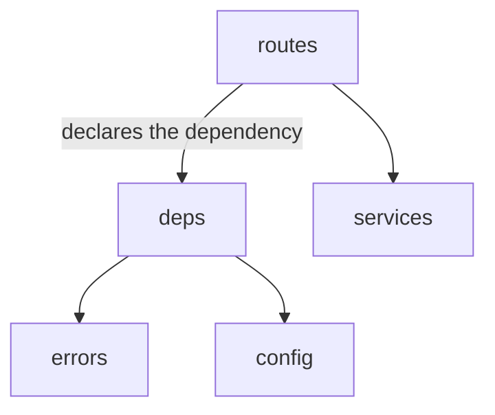
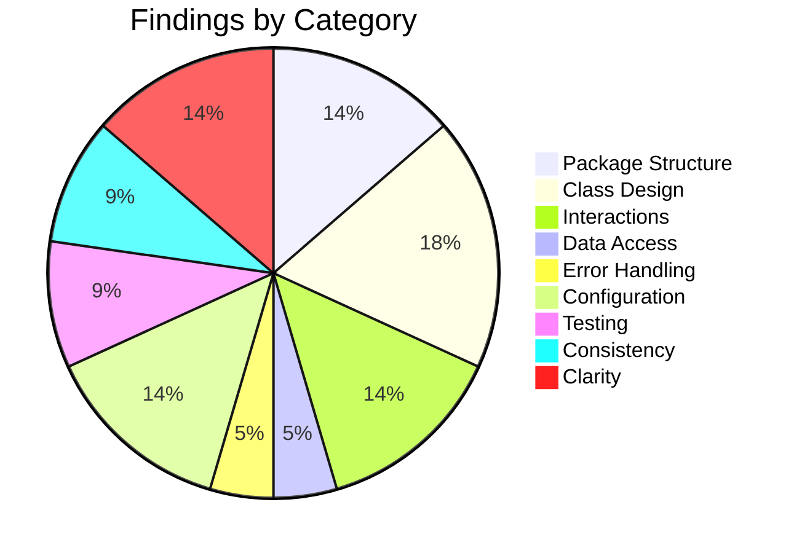

# Low-Level Design Review: Boomerang

**Document Reviewed:** `design/boomerang-low-level-design.md`
**Requirements Reference:** `design/boomerang-requirements.md`
**High-Level Design Reference:** `design/boomerang-high-level-design.md`
**Review Date:** 2026-08-28
**Reviewer:** Claude (Automated Review)

---

## Executive Summary

This is the seventh round against a 2,940-line document, and the first to run against the ~505 lines
the sixth revision added — the `deps` module and its client-version gate, `RetailerPolicy` /
`DerivedWindow` / `DeriveWindow` and the four-row return-window precedence table, the re-keyed
`PickupRepository` and the `ReadOnlyStore` type, the new §4.7 eligibility diagram, and the rewritten
§8.2–§8.5 traceability rows. Those additions close real gaps and most of them close them well: the
traceability table is now complete for all thirty-nine upstream requirement identifiers, and the
sixth round's retraction of its own false positives was correct — every one of the four requirements
it had called untested does in fact carry a §8.4 row.

The single most important finding is **CONF-1**: §3.2's new precedence table enumerates four sources
for `return_by` and FR-3.2.1 names a fifth. The requirement derives the window "from the delivery
date and **the retailer's stated policy where the page exposes one**, and from a configured
per-retailer default where it does not." The table has a page-stated *deadline date* (row 1, not
inferred) and the configured default (rows 2–3); a page-exposed *policy in days* has neither a row,
a field on `OrderSchema`, nor a field on `RetailerPolicy` to carry it. A retailer page advertising
sixty-day returns will be assigned thirty. The implementation plan's Task 3.7 reproduces the same
four branches, so this is a case where plan and design agree and both are wrong against upstream.

The second theme is narrower and more mechanical: three of the sixth round's fixes were applied to
the section that raised them and not to the sections that cite them. `ReadOnlyStore` is defined twice
in one paragraph with two different surfaces; `UserPrompt.ask` returns `PendingQuestion` in §3.3 and
§9 and `Answer` in §3.5; the new single-`set` law is stated in §3.4 and not propagated to the §4.5
branch it now governs. That is the same half-applied-amendment pattern §10 itself names, one round
later.

**Overall Verdict:** Needs targeted fixes before proceeding

---

## Section Verdicts

| Review Area | Verdict | Findings |
|-------------|---------|----------|
| Package/Module Structure | Partially Addressed | 3 |
| Class/Type Design | Partially Addressed | 4 |
| Class Interactions & Workflows | Partially Addressed | 3 |
| Data Access Layer | Sufficient | 1 |
| Error Handling | Sufficient | 1 |
| Configuration & Wiring | Partially Addressed | 3 |
| Testing Completeness | Sufficient | 2 |
| Consistency with High-Level Design | Partially Addressed | 2 |
| Specification Clarity | Partially Addressed | 3 |

---

## 1. Package/Module Structure

### Current State

Two graphs, both declared normative and both scheduled to become mechanically enforced contracts by
plan Task 10.3. §2.1 draws the server's layering across nine nodes, gaining a `deps` node and an
`app/deps.py` module row this revision. §2.2 draws every permitted extension edge and declares itself
complete — "an edge that is not drawn is not permitted" — and gains, this revision, a statement that
`chrome.tabs` and `chrome.scripting` have monopoly holders in the same way `chrome.storage` does.

### Strengths

- The `app/deps.py` addition is the right fix for the right reason: a module owning the version gate
  had no row, no node and no test row while the gate itself had cost a requirements amendment.
- The `no-egress-from-popup` property is now stated as a property rather than implied by the absence
  of an arrow, and §4.7 draws the one flow that previously had no drawn path.
- The `src/extract/` two-context split, and the assignment of the FR-3.1.3 scan to `src/extract/`
  with the abort decision to `src/driver/`, remains the clearest module-boundary argument in the
  document.

### Gaps and Recommendations

| ID | Gap | Package(s) | Priority | Recommendation |
|----|-----|------------|----------|----------------|
| PKG-1 | **The new `deps` edge points the opposite way from every other solid edge in §2.1's graph.** The graph is introduced as "the only structural invariant worth enforcing in review" and its solid arrows are import edges: `R --> S` is routes importing services, `S --> C` is services importing carriers, `D --> E` is deps importing errors. But `D["deps"] -- "client version gate, app-state accessors" --> R["routes"]` is not an import — the prose confirms it, saying `deps` "imports `config` and `errors` and nothing below routes." The real import runs the other way: a route or a router declares `Depends(require_supported_client)`. So one node emits two solid arrows with opposite meanings. Plan Task 10.3 encodes this graph as `import-linter` contracts; encoded literally it would permit `app.deps` importing `app.routes` — the cycle the layering exists to forbid — and would not permit the edge that actually exists | `app/deps`, `app/routes` | **Must** | The graph SHALL carry one edge semantics. Either reverse the arrow to `R --> D` and move the "runs before the handler body" ordering into the prose that already argues it, or mark the ordering edge visually distinct (as `ALL -.-> R` already is for the config relation) and state in the caption which arrow style is an import and which is not. Task 10.3 needs an unambiguous source |
| PKG-2 | **§2.2 declares itself complete and then declares two monopolies it does not draw.** The new paragraph states that only `src/driver/` and `src/permissions/` may reach `chrome.tabs` and `chrome.scripting`, and the pre-existing rule states `src/storage/` is the only module permitted to import `chrome.storage`. The graph contains one platform node, `CHROME["chrome permissions and scripting APIs"]`, with exactly one inbound edge, `PERM --> CHROME`. There is no `DRIVER --> CHROME` edge and no storage-to-platform node at all. Under the graph's own completeness rule the driver's `TabHandle` and `StepExecutor` reach an API by a path the graph forbids | `src/driver`, `src/storage` | **Should** | Draw the edges the monopolies assert, or state explicitly that platform APIs sit outside the completeness rule and are governed by the prose monopolies instead. The paragraph's stated motive — that the higher-privilege APIs "deserve at least the structural treatment `chrome.storage` already had" — is only delivered once the structure exists |
| PKG-3 | The same paragraph says "Only `src/driver/` and `src/permissions/` may reach them" and then, two sentences later, names a third holder: "`entrypoints/background.ts` makes the two calls §2.2 already names — the one-shot `executeScript` of a first-run scan and `chrome.tabs.create` for the calendar template." Three holders stated as two | `entrypoints/background.ts` | Consider | Restate as three named holders with their named purposes. The exception is real and justified; only the count is wrong, and Task 10.3 will encode the count |

The above is PKG-1's recommended direction for the `deps` edge only: `routes` depends on `deps`, and
the "resolves before the handler body" ordering is a runtime property stated in prose rather than an
arrow in an import graph.

### Verdict: **Partially Addressed**

---

## 2. Class/Type Design

### Current State

§3.2 gains `RetailerPolicy`, `DerivedWindow` and a `DeriveWindow` pure-function node, and
`OrderSchema` gains `delivered_at`. §3.4 gains a second class diagram for `ReadOnlyStore` and re-keys
`PickupRepository` on `booking_intent_id` with `pickup_id` deleted. §3.5 states a new rule for what
this document may define locally: "a key this document addresses records by is part of the entity and
belongs upstream; a shape this document invents belongs in the table below."

### Strengths

- The `EvictedOrders` / `ReclaimedBytes` split, and the argument that two `int` returns would make a
  swapped caller type-correct and wrong, is exactly the right use of newtype wrappers.
- `ValidationOutcome` as a sum type with `ValidatedAction` constructible only by the validator is a
  correct type-level encoding of a security boundary.
- The `pickup_id` deletion is well reasoned: one record with two identities diverging on the
  lost-response branch was a real defect, and removing the redundant key rather than declaring it
  upstream was the right of the two available fixes.

### Gaps and Recommendations

| ID | Gap | Class/Type | Priority | Recommendation |
|----|-----|------------|----------|----------------|
| CLASS-1 | **`ReadOnlyStore` is given two incompatible surfaces in one paragraph, and the diagram's return types are undefined.** The class diagram declares four accessors — `orders() OrderReads`, `pickups() PickupReads`, `returns() ReturnReads`, `address() Address`. The prose immediately beneath declares a different surface: "`ReadOnlyStore` exposes the getters and nothing else — `list`, `get`, `find_item`, `active_for_item`, `list_unsettled`, `address()`." Those are not the same type. Worse, `OrderReads`, `PickupReads` and `ReturnReads` each appear **exactly once in the entire document** — inside that diagram — and zero times in the implementation plan. They are named and never defined, in a document whose §3.5 exists to guarantee that every type it names is defined somewhere. Plan Task 4.7 step 5 carries only the prose version, correctly: "the getter half of the coordinator's surface — the repository reads, `find_item`, `active_for_item`" | `ReadOnlyStore` | **Must** | Pick one surface. The prose version is the one the plan builds and the one §8.2's structural test can enumerate; the diagram SHALL be redrawn to match it, or the three `*Reads` types SHALL be given rows in §3.5 with their fields. A type with two definitions is a type the two workspaces will implement differently |
| CLASS-2 | **`DriverSession` is an upstream entity sitting inside a table whose preamble says its members are not.** §3.5 introduces the table as "Eleven types are *not* upstream entities — they exist only because of a decision in this document, so they are defined here and nowhere else," and the `DriverSession` row then describes itself as "The concrete form of high-level design §4.2's `DriverSession`." It is both. And the fields matter: high-level design §4.2 and requirements §2.2 both declare `DRIVER_SESSION` with five attributes — adapter, step, tab ID, tab URL, last-progress time. The row here adds seven persisted fields neither ERD carries: `state`, `item_id`, `order_id`, `chosen_option`, `attempt_count`, `started_at` and `schema_version`. Under §3.5's own new rule these are "a field that is neither" — not a key belonging upstream, not a shape this document invents — which the paragraph directly above names as "the gap that had opened." The sixth round escalated exactly this shape for `item_id` and `return_request_id` and amended both ERDs; the same defect on the entity whose durability the design depends on most was not caught. The half-application is visible in the amendment record itself: `RETURN_ATTEMPT_LIMIT`, the *bound* on `attempt_count`, was added to requirements §5.2, while `attempt_count`, the *field it bounds*, was not added to `DRIVER_SESSION` | `DriverSession` | **Must** | Either amend both ERDs to carry the seven fields, as the sixth round did for `item_id`, or state in §3.5 why `DRIVER_SESSION` is exempt from the rule the same section states one paragraph earlier. Silence is the one option the document's own header rule forbids |
| CLASS-3 | **§3.5's completeness claim was not updated for the types this revision invented.** "Eleven types are *not* upstream entities... defined here and nowhere else" is now false: `RetailerPolicy`, `DerivedWindow` and `ReadOnlyStore` are all shapes this document invents, all added 2026-08-28, and none has a row. `RetailerPolicy` in particular is a persisted-configuration shape whose fields the server must agree on with requirements §5.3's table | `RetailerPolicy`, `DerivedWindow`, `ReadOnlyStore` | **Should** | Add the three rows and update the count, or restrict the claim to the extension types it actually covers. As written, a reader applying §3.5's rule concludes the three new types are upstream entities and goes looking for them in the ERDs |
| CLASS-4 | **`UserPrompt.ask` has two stated return types, and one of them is the reading the sixth round explicitly retired.** §3.3's diagram says `ask(question, choices) PendingQuestion`; §3.3's prose, added this revision, says "**`Answer` is the payload of `advance`, not the return of `ask`**"; §9's new clarity answer says `ask` "records a pending question and returns a `PendingQuestion`; it does not block." §3.5 was not amended and still reads: "`StepResult` and `Answer` are the return types of `StepExecutor.execute` and `UserPrompt.ask`." That is the pre-fix reading, and it is the one that implies a blocking call in a runtime that terminates its worker after thirty seconds | `UserPrompt`, `Answer`, `PendingQuestion` | **Should** | Amend §3.5's sentence to name `PendingQuestion`, and give `PendingQuestion` a row of its own — it is a shape this document invents and CLASS-3 applies to it too |

### Verdict: **Partially Addressed**

---

## 3. Class Interactions & Workflows

### Current State

Seven sequence diagrams, one added this revision. §4.7 draws the pre-offer eligibility check across
five participants and settles the call site the sixth round found specified three incompatible ways.
§4.5 draws cancellation with both failure branches. §4.4 draws rehydration.

### Gaps and Recommendations

| ID | Gap | Workflow | Priority | Recommendation |
|----|-----|----------|----------|----------------|
| INTERACT-1 | **§3.4's new law is not propagated to the §4.5 branch it now governs.** The law reads: "**Every invariant that spans more than one record SHALL be written in a single `set`.**" §4.5's already-collected branch writes two records — `SW->>PR: mark Collected` on the `PICKUP`, and `SW->>SW: return request moves to LabelPrinted` on the `RETURN_REQUEST` — and the surrounding prose calls the pair one fact: "the box is gone, the label went with it." That is an invariant spanning two records, and §4.5, which was not revised this round, says nothing about a single `set`. A worker dying between the two leaves a collected pickup whose return request still shows a live label, and §5.2's eviction carve-out then keeps protecting an order that is finished | §4.5 cancellation, collected branch | **Should** | State that the `mark_collected` and `LabelPrinted` writes happen in one `transact` and one `set`, as `transition` and `save_intent` already do. The law was added precisely so "the next one is correct by default instead of by someone remembering," and this is the next one |
| INTERACT-2 | **§4.7's claim that every hop is a permitted §2.2 edge does not hold for one hop.** The diagram draws `M->>BG: routed to the worker`. §2.2 draws `BG --> MSG` and no reverse edge, and §2.2 declares that "an edge that is not drawn is not permitted." The paragraph names only two of the six hops when it makes the claim: "`POPUP --> MSG` carries the request, `BG --> API` carries the egress." The hop is almost certainly fine — it is runtime message delivery, not an import — but the document nowhere separates the two kinds of relation, which is the same root ambiguity as PKG-1 and the one plan Task 10.3 has to resolve to write a lint rule | §4.7 eligibility check | **Should** | Either draw the messaging return path in §2.2 or state, once, that §2.2's graph constrains imports and that runtime message delivery between an entrypoint and `src/messaging/` is outside it. Then narrow §4.7's claim to the hops it actually covers |
| INTERACT-3 | §4.7's diagram carries `P->>P: eligible: render the pickup offer not eligible: render the second answer, no offer`. It is the only ` ` in the whole low-level design, and older Mermaid renderers used by GitLab and some VS Code extensions do not parse it inside a sequence message. The same markup was introduced into high-level design §5.2's flowchart node in the same revision | §4.7 eligibility check | Consider | Split into two `P->>P:` messages, or move the branch into a `Note over P:` and the detail into the prose beneath, which is where the paragraph after it already puts it |

### Missing Workflow Coverage

| Requirement | Workflow Documented? | Notes |
|-------------|---------------------|-------|
| FR-3.2.1 window derivation | Partial | §3.2 gives the precedence table and §4.1 the ingest sequence. The branch CONF-1 identifies — a page-exposed policy in days — has no representation in either |
| FR-3.4.2 pickup offer ordering | Yes | Newly drawn in §4.7; the ordering constraint the requirement actually imposes is now explicit |
| FR-3.4.6 cancellation | Yes | §4.5, both failure branches, but see INTERACT-1 and CONSIST-1 |
| FR-3.3.10 one active return per item | Yes | Covered structurally by `active_for_item` and asserted in §8.2 |

### Verdict: **Partially Addressed**

---

## 4. Data Access Layer

### Current State

Four repositories plus `SessionStore`, one key each, coordinated by `StorageCoordinator` whose
`transact` is honestly described as a serialising queue rather than a transaction. The two
cross-entity operations belong to the coordinator. Two states are derived at read rather than written
by a timer, and this revision moves the derivation inside `PickupRepository` so it applies on every
read path.

### Strengths

- Naming `transact` a queue and stating what it withholds — no rollback — is the single most
  important honesty in the document, and the corollary rule that a write needing to survive a later
  failure must be ordered last follows from it correctly.
- Moving the derived-state projection into the repository, on `get` as well as `list_unsettled`, is
  the right fix for the sixth round's DAL-1: it removes the possibility of two callers reporting the
  same pickup in two states.
- The explicit statement that there is no startup repair pass, with the reason it is not needed, is
  the kind of negative specification that stops an implementer inventing one.

### Gaps and Recommendations

| ID | Gap | Priority | Recommendation |
|----|-----|----------|----------------|
| DAL-1 | **The new single-`set` law has no enforcement point and no test.** §8.2's coordinator row asserts that "`transact` commits every touched key in one `set`" — that is a property of the mechanism, and it was already true. The law is a constraint on the *authors of invariants*: it says a multi-record invariant must not be split across two `transact` calls. Nothing asserts that. Compare `ReadOnlyStore`, which got a structural test in the same revision precisely because a prose rule "a future popup feature can break without a single signature changing." The single-`set` law is in exactly that position, and INTERACT-1 is an instance of it already being unpropagated within the document itself | **Should** | Add a §8.2 row that enumerates the invariant-bearing write sites — `transition`, `save_intent`, `clear_all`, and §4.5's collected branch once INTERACT-1 is resolved — and asserts one `set` call per site against the fake browser's call log. That is the same shape as the assertions already written for `save_intent` and `promote`, extended from "must not fail silently" to "must not split" |

### Verdict: **Sufficient**

---

## 5. Error Handling

### Current State

One `BoomerangError` hierarchy behind the requirements §4.2 shape, each subclass mapped to a `reason`
code and an HTTP status in §6.1's table, with §6.2 carrying the extension-side rows. `ClientTooOld`
maps to `client-too-old` at 426. Rejection from the action validator is a returned value rather than
a raise.

### Strengths

- The `client-too-old` gate's malformed-input enumeration is now total and the reason is stated
  correctly: every path that does not end in a refusal is a path on which the gate fails open.
- `WrongCarrierLabel` as a server-side backstop behind a client-side derivation, with a §8.3 row
  asserting an empty adapter call log, is a well-placed defence.
- The cancellation path's `EtagExpired` handling states the correct next step rather than a generic
  retry, which is the distinction that matters against a carrier's concurrency token.

### Gaps and Recommendations

| ID | Gap | Priority | Recommendation |
|----|-----|----------|----------------|
| ERR-1 | **§4.7 prescribes a retry for a failure that retrying cannot fix.** Its closing paragraph lists three failure modes for the eligibility call — "the worker is unreachable, the network is down, **the version gate refuses**" — and prescribes one response for all three: "It surfaces the failure and offers to retry." A `client-too-old` refusal is deterministic; the same client version will be refused every time, and requirements §4.2's own copy for the code is "The installed extension predates a required API change; **updating** fixes it." §8.3's row for the same condition specifies the correct behaviour elsewhere: "Update prompt shown; the flow stops rather than degrading." Two sections now prescribe different handling for one status | **Should** | Separate the version-gate case from the transport cases in §4.7. Transport failures get the retry; a 426 gets §8.3's update prompt. The paragraph's underlying point — that "we could not ask" and "USPS will not come" are different sentences — is right and survives the split |

### Verdict: **Sufficient**

---

## 6. Configuration & Wiring

### Current State

Server configuration is one typed `Settings` object built in the lifespan and held on application
state, with a seventeen-row table and a startup flowchart that branches on `CARRIER_ADAPTER`.
Extension configuration is build-time substitution only, with three constants added this revision and
declared upstream first. The client-version gate is a FastAPI dependency in `app/deps.py`, registered
on the router rather than per handler, covering `/health`.

### Strengths

- The rule that "a value that a deployment can change belongs upstream first," applied retroactively
  to four constants that had violated it, is the correct governance and it is now being followed.
- Making `carrier_adapter` an explicit validated field rather than an inference from credential
  presence removes two asymmetric silent failure modes, and the reasoning for why the inference is
  wrong in both directions is exactly right.
- Registering the gate on the router rather than per route, and asserting it route-by-route over the
  app's own route table, is a control that stays correct as routes are added.

### Gaps and Recommendations

| ID | Gap | Priority | Recommendation |
|----|-----|----------|----------------|
| CONF-1 | **§3.2's precedence table drops a source FR-3.2.1 names, and no type carries it.** The requirement: "The server SHALL derive `return_by` from the delivery date **and the retailer's stated policy where the page exposes one**, and from a configured per-retailer default where it does not." That is a page-exposed policy *in days*, distinct from both a page-stated deadline *date* and a configured default. The table's four rows are: a page-stated deadline (`window_inferred: false`), `default_return_days` from `delivered_at`, `default_return_days` from `ordered_at`, and undetermined. The page-exposed policy has no row. It also has nowhere to live: `OrderSchema` carries no policy field, and `RetailerPolicy` carries only `retailer_key` and `default_return_days`. Requirements §5.3 corroborates the distinction by defining `default_return_days` as the "Assumed window when the page states no policy" — the fallback, not the primary. Folding a stated policy into row 1 does not work either: row 1 is `window_inferred: false`, and FR-3.2.1's second bullet requires that "the server SHALL mark **any derived window** as inferred," which a policy-plus-date computation is. Plan Task 3.7 step 2 reproduces the same four branches, so both documents are wrong together and neither will catch the other | **Must** | Add the fifth row — a page-exposed policy in days counted from `delivered_at`, or from `ordered_at` when it is absent, marked inferred and taking precedence over `default_return_days` — and give it a field to travel in on `OrderSchema` or `RetailerPolicy`. If the PoC deliberately does not extract page-stated policies, say so in §10's decline record and amend FR-3.2.1 upstream under the header rule, rather than leaving a SHALL with no design behind it |
| CONF-2 | **The `/health` version gate is specified three ways, and two implementation tasks will write contradictory tests.** Requirements §4.1: "Every request SHALL carry the header `X-Boomerang-Client-Version`... on every endpoint **including `/health`**." This document agrees, twice: §2.1's module row says "on every endpoint including `/health`," and §8.2's new `app/deps.py` row says the gate is asserted "route by route over the full route table read from the app... and `/health` is in the table like every other route." Plan Task 3.8 step 3 agrees: "`/health` is inside the gate like everything else." But plan Task 6.1 step 2 says the opposite — "`/health` performs **no** upstream call and **requires no client version** — a version-gated health check is unusable from a load balancer" — and plan Task 7.3's integration row repeats it: "`GET /health` needs no version header and makes no upstream call." Task 3.8's route-table assertion and Task 6.1's unit test cannot both pass. Plan Task I.2's deployed smoke test ("`/health` returns 200 over the Function URL") also fails as written unless it sends the header. **Here the design is right and the plan is wrong**: the requirement is unambiguous and was amended into §4.1 deliberately under plan decision D16 | **Must** | The design needs no change on the substance. It SHOULD add one sentence naming the consequence the plan's dissenting tasks are reacting to — that a gated `/health` cannot be probed by a bare load-balancer check — so the decision is visibly taken rather than merely stated. Plan Tasks 6.1, 7.3 and I.2 must be corrected to match, and this review flags it because Task 3.8 cites this document's §7.1 as its authority |
| CONF-3 | **The per-retailer policy table is assigned to `app/config.py` and appears in no configuration table, with no owner for the lookup.** §3.2 states that `RetailerPolicy` is resolved "by `IngestService` from the `page_url` it already receives, against the per-retailer table requirements §5.3 defines" and that "The table is **configuration and lives in `app/config.py`** with the rest of it." §7.1's `Settings` table — introduced as "Configuration is one typed `Settings` object, validated at construction" — has no row for it, no source, no default and no validation rule. Nor does any module own the URL-to-`retailer_key` resolution the sentence requires: the extension has `AdapterRegistry.for_url`, and §2.1's server module table has no equivalent. So a value the document calls configuration is absent from the table that enumerates configuration, and a lookup the document assigns to a service has no stated mechanism | **Should** | Add a `Settings` row for the retailer policy table with its source and validation, and state how `IngestService` maps a page URL to a `retailer_key` — a host-suffix map in `app/config.py` is the obvious answer and needs one sentence. Without it, an unrecognised host silently yields the system default of 30 and nothing says whether that is intended |

### Verdict: **Partially Addressed**

---

## 7. Testing Completeness

This is the most critical section of the low-level design review.

### 7.1 Unit Test Assessment

| ID | Gap | Class | Requirement | Priority | Recommendation |
|----|-----|-------|-------------|----------|----------------|
| TEST-1 | §8.2's new row asserts `ReadOnlyStore` "exposes the getters and nothing else... asserted structurally, by enumerating the view's surface and requiring it to contain no member that writes." The surface it must enumerate is the one CLASS-1 shows is defined twice, incompatibly, in the same paragraph. A structural test written against the diagram's four accessors and a popup built against the prose's six repository methods would both pass their own suites and disagree | `ReadOnlyStore` | FR-3.1.5, NFR-6.3 | **Should** | Resolve CLASS-1 first; the test row is correct in shape and cannot be implemented until the type has one definition |

### 7.2 Integration Test Assessment

| ID | Gap | Requirement | Priority | Recommendation |
|----|-----|-------------|----------|----------------|
| TEST-2 | §8.4's FR-3.2.1 row now reads "all four rows of §3.2's precedence table, including **the `delivered_at`-absent branch**." It is accurate about the four rows and will report FR-3.2.1 as fully covered, while the clause CONF-1 identifies has no design and therefore no test. This is the failure mode §9's own new third sweep direction exists to catch — a traceability table answering "is this requirement covered?" with a yes that is true of the design and false of the requirement | FR-3.2.1 | Consider | Once CONF-1 is resolved, extend the row to the fifth branch and add the discriminating negative the row already uses elsewhere: a page that states a policy in days must not derive from `default_return_days` |

### 7.3 Requirements Traceability Gaps

All thirty-nine `FR-` and `NFR-` identifiers in the requirements document resolve to a row in §8.4.
This was verified by extracting every requirement heading and matching it against §8.4's rows; the
set difference is empty in the direction that matters. The sixth round's retraction of its claim that
four requirements were untested was correct.

| Requirement | Unit Tests? | Integration Tests? | Gap | Recommendation |
|-------------|-------------|-------------------|-----|----------------|
| FR-3.2.1 | Partial | No | Four of five sources tested; the page-exposed-policy source has no design to test — CONF-1 | Add the branch, then the assertion |
| FR-3.4.6 | Yes | Yes | The `Cancelled` state the upstream ERDs declare is never written and never asserted — CONSIST-1 | Resolve the state-vocabulary divergence first |
| NFR-6.6 | No | No | Terraform properties; owned by plan Tasks I.1 and I.2 and excused in §8.5 | No action — the excusal is explicit and now has an owner |
| NFR-6.7 | No | No | As above | No action |

### 7.4 Test Infrastructure Assessment

| ID | Gap | Priority | Recommendation |
|----|-----|----------|----------------|
| — | No findings. The `ScriptedUspsAdapter` / `MockCarrierAdapter` split is correctly motivated and the assertion that no `CARRIER_ADAPTER` value reaches the scripted double is the right guard. The §8.5 statement of what excluding `entrypoints/` from the coverage floor costs is a model of an honest test-infrastructure caveat | — | — |

### Verdict: **Sufficient**

---

## 8. Consistency with High-Level Design

### Alignment Check

| High-Level Element | Low-Level Correspondence | Status | Notes |
|-------------------|-------------------------|--------|-------|
| HLD §4.2 `ORDER.delivered_at` | `OrderSchema.delivered_at` | Aligned | Added this revision; the field the derivation starts from is now present in the document that computes it |
| HLD §4.2 `ORDER_ITEM.item_id`, `RETURN_REQUEST.return_request_id` | `find_item`, `active_for_item`, `ReturnDriver.start(item_id)` | Aligned | Declared upstream this revision with type, generation and uniqueness scope |
| HLD §4.2 `PICKUP.booking_intent_id` as sole key | `PickupRepository` keyed on it throughout | Aligned | `pickup_id` removed; the upstream paragraph stating there is deliberately no second key was added in the same revision |
| HLD §4.2 `PICKUP.state` vocabulary | §4.5 deletes the record on cancel; §5.2 derives `Abandoned` | **Misaligned** | See CONSIST-1. `Cancelled` is declared upstream and written by nothing here |
| HLD §4.2 `DRIVER_SESSION` attributes | §3.5's twelve-field `DriverSession` | **Misaligned** | See CLASS-2. Seven persisted fields declared in neither ERD |
| HLD §5.2 eligibility node execution context | §4.7's sequence diagram | Aligned | The upstream annotation and the new diagram were made in the same revision and agree |
| HLD §6.3 all persistent state on the client | §5.1 "The server has none" | Aligned | Stated as a section because its absence is a decision |
| HLD §8.4 build-time configuration only | §7.2's constant table | Aligned | Three constants added upstream first, per the stated rule |

### Gaps and Recommendations

| ID | Gap | Priority | Recommendation |
|----|-----|----------|----------------|
| CONSIST-1 | **The `PICKUP` state vocabulary differs from both upstream ERDs in both directions, and §10 records neither divergence.** Requirements §2.2: "`PICKUP.state`... carry the booking lifecycle — `Booking`, `Confirmed`, `Cancelled`, `Collected`." High-level design §4.2: "`state` runs over `Booking`, `Confirmed`, `Cancelled`, `Collected` and `Abandoned`," and it reasons *from* `Cancelled` being written on the normal path when it explains why a stranded `Booking` record "is also never `Cancelled`, because there is no number to cancel with." §4.5 deletes the pickup record on a successful cancel, so no component in this design ever writes `Cancelled`; the string appears exactly once in the low-level design, in the paragraph arguing for the deletion. The argument is a good one — a cancelled pickup and a pickup never booked are the same fact, and a terminal row in front of `list_unsettled` would need a new eviction exception. What is missing is the record. §10's two amendment tables exist for exactly this, and this revision added five new rows to them for smaller divergences, so the omission is not a policy of silence | **Must** | Either record it as a sixteenth upstream amendment — strike `Cancelled` from both ERDs with the §4.5 reasoning — or keep the state and write it. The document's own header rule is that upstream wins and that upstream can be wrong, in which case it is corrected rather than routed around. This is currently the third option: routed around silently, on the one entity whose lifecycle the eviction carve-out reads |
| CONSIST-2 | Requirements §2.2's `PICKUP` note lists four states and omits `Abandoned`, while high-level design §4.2 lists five and requirements FR-3.4.x and §5.3's `BOOKING_ABANDONED_AFTER_HOURS` row both depend on `Abandoned` existing. This is an upstream internal inconsistency, but this design's `mark_abandoned` and its `Booking → Abandoned` derivation rest on the state being declared, and the document does not flag it | Consider | Note it in §10 alongside CONSIST-1's fix, which touches the same requirements sentence |

### Verdict: **Partially Addressed**

---

## 9. Specification Clarity

### Items Requiring Clarification

| ID | Item | Section | Issue | Question |
|----|------|---------|-------|----------|
| UNCLEAR-1 | `evict_to_fit` and `transact` | §3.5, §5.2 | Contradictory | §3.5 says `evict_to_fit` "is the only one that runs **outside** `transact`." §5.2 says it "runs **inside** the failing `transact` and must not re-enter it," performing "its reads and its single eviction `set` **directly**, not through `transact`." These are reconcilable — called from within a transaction, but bypassing the queue — but the two sentences use "inside" and "outside" for the same fact. Which is it: outside the queue, or inside the transaction? |
| UNCLEAR-2 | "every invariant that spans more than one record" | §3.4 | Undefined | The law is stated as a SHALL and the document supplies three examples, but never says what qualifies as an invariant. Is a pickup and its consent stamp one because NFR-6.2 says so? Is a pickup and the order it pins one? An implementer deciding whether a given pair needs one `set` has the examples and no criterion. What is the test for whether a rule is an invariant under this law? |
| UNCLEAR-3 | Derived state versus stored state on write paths | §3.4, §4.5 | Ambiguous | §3.4 says `PickupRepository` applies the derivation "on every read" and that "the stored value is left alone; the derivation is a read-time projection, not a write." §4.5 then loads a pickup, branches on the *carrier's* refreshed state, and calls `mark_collected`. What does `mark_collected` do to a record that already reads as `Collected` because `PICKUP_SETTLED_AFTER_DAYS` elapsed — is it a no-op, an idempotent write, or an error? And does any path ever persist a derived state, or does the stored value stay `Confirmed` forever? |

### Verdict: **Partially Addressed**

---

## Summary of Recommendations

### Must Address (Blocking — resolve before implementation)

1. **CONF-1:** §3.2's precedence table omits FR-3.2.1's page-exposed retailer policy, and no type carries it. The plan reproduces the same omission, so neither document will catch it.
2. **CONF-2:** `/health` inside the version gate is specified correctly here and contradicted by plan Tasks 6.1, 7.3 and I.2, which will produce mutually unpassable tests.
3. **CLASS-1:** `ReadOnlyStore` has two incompatible surfaces in one paragraph and three return types defined nowhere in the document or the plan.
4. **CLASS-2:** `DriverSession` adds seven persisted fields that neither upstream ERD declares, and sits in a table whose preamble says its members are not upstream entities — the exact gap §3.5's own new rule names.
5. **CONSIST-1:** `PICKUP.state` diverges from both upstream ERDs in both directions and §10 records neither, on the entity the eviction carve-out reads.
6. **PKG-1:** §2.1's new `deps --> routes` edge means the opposite of every other solid edge in a graph plan Task 10.3 will encode as import contracts.

### Should Address (High Priority)

1. **PKG-2:** §2.2 declares completeness and then declares two platform monopolies it does not draw.
2. **CLASS-3:** §3.5's "eleven types, defined here and nowhere else" was not updated for `RetailerPolicy`, `DerivedWindow` and `ReadOnlyStore`.
3. **CLASS-4:** §3.5 still gives `UserPrompt.ask` the return type §3.3 and §9 retired this revision.
4. **INTERACT-1:** the new single-`set` law was not propagated to §4.5's collected branch, which writes two records carrying one fact.
5. **INTERACT-2:** §4.7's "every hop is an edge §2.2 already permits" does not hold for the messaging-to-worker hop, because the document never separates import edges from runtime delivery.
6. **DAL-1:** the single-`set` law has no test and no enforcement point, unlike the `ReadOnlyStore` rule added in the same revision.
7. **ERR-1:** §4.7 prescribes a retry for a `client-too-old` refusal, which cannot succeed and contradicts §8.3.
8. **CONF-3:** the per-retailer policy table is called configuration, has no row in the `Settings` table, and its URL-to-retailer lookup has no owning module.
9. **TEST-1:** §8.2's `ReadOnlyStore` structural test has no single surface to enumerate until CLASS-1 is resolved.

### Consider (Medium Priority)

1. **PKG-3:** three `chrome.tabs` monopoly holders stated as two.
2. **INTERACT-3:** ` ` in §4.7's sequence message breaks older Mermaid renderers.
3. **TEST-2:** §8.4's FR-3.2.1 row will report full coverage of a requirement one clause of which has no design.
4. **CONSIST-2:** requirements §2.2's `PICKUP` note omits `Abandoned` that the rest of the requirements and the HLD both use.
5. **UNCLEAR-1:** `evict_to_fit` described as both inside and outside `transact`.
6. **UNCLEAR-2:** "invariant" is undefined in a law stated as a SHALL.
7. **UNCLEAR-3:** whether a derived pickup state is ever written, and what `mark_collected` does to a record already deriving as collected.

---

## Findings Summary

| Area | Verdict | Must | Should | Consider |
|------|---------|------|--------|----------|
| Package/Module Structure | Partially Addressed | 1 | 1 | 1 |
| Class/Type Design | Partially Addressed | 2 | 2 | 0 |
| Interactions & Workflows | Partially Addressed | 0 | 2 | 1 |
| Data Access Layer | Sufficient | 0 | 1 | 0 |
| Error Handling | Sufficient | 0 | 1 | 0 |
| Configuration & Wiring | Partially Addressed | 2 | 1 | 0 |
| Testing Completeness | Sufficient | 0 | 1 | 1 |
| HLD Consistency | Partially Addressed | 1 | 0 | 1 |
| Specification Clarity | Partially Addressed | 0 | 0 | 3 |
| **Total** | | **6** | **9** | **7** |

**Where the findings land.** Nineteen of the twenty-two findings are against material added or
rewritten in the sixth revision — the `deps` node and module row, the `RetailerPolicy` /
`DerivedWindow` / `DeriveWindow` classes and the precedence table, the `ReadOnlyStore` diagram, the
`chrome.tabs` monopoly paragraph, §3.5's new deferral rule, §4.7 in its entirety, and the new §8.2
and §8.4 rows. Three are against pre-existing material: CONSIST-1 and CONSIST-2 on the pickup state
vocabulary, and UNCLEAR-1 on `evict_to_fit`. The concentration is expected rather than alarming —
those ~505 lines had never been read by a reviewer — but it means the round-six revision has not yet
had the scrutiny the five rounds before it received.

**On false positives.** Every finding above was checked against the current text of the three design
documents and, where relevant, against the implementation plan, before being written. The claim that
all thirty-nine requirements carry a §8.4 row was verified mechanically rather than by reading. Three
candidate findings were dropped during that check and are recorded here so they are not raised again:
that `/health` inside the gate was a design error (it is upstream, requirements §4.1, and the design
is right); that the `min_client_version` default of `0.1.0` leaves the gate inert (it does not — an
absent header is below any floor, which is the intended behaviour); and that `evict_to_fit` bypassing
`transact` is a queue violation (it is not — the calling transaction still holds the slot, and §5.2
argues this correctly).

---

## Untested Requirements

None. Every `FR-` and `NFR-` identifier in `design/boomerang-requirements.md` resolves to a row in
§8.4, and the two requirements with no test in this document — NFR-6.6 and NFR-6.7 — are explicitly
excused in §8.5 with a named owner outside it (plan Tasks I.1 and I.2, per plan decisions D7 and D8),
which is an excusal rather than a gap.

The one caveat is not a missing row but a row that will over-report:

| Requirement | Description | Why It Matters |
|-------------|-------------|----------------|
| FR-3.2.1 | Window derivation from the delivery date, a page-exposed retailer policy, or a configured default | §8.4 reports it covered by four unit branches, which is true of the design and false of the requirement. The page-exposed-policy clause has no design, no field and therefore no test, and the traceability table is the artefact a reader consults to find that out — see CONF-1 and TEST-2 |
