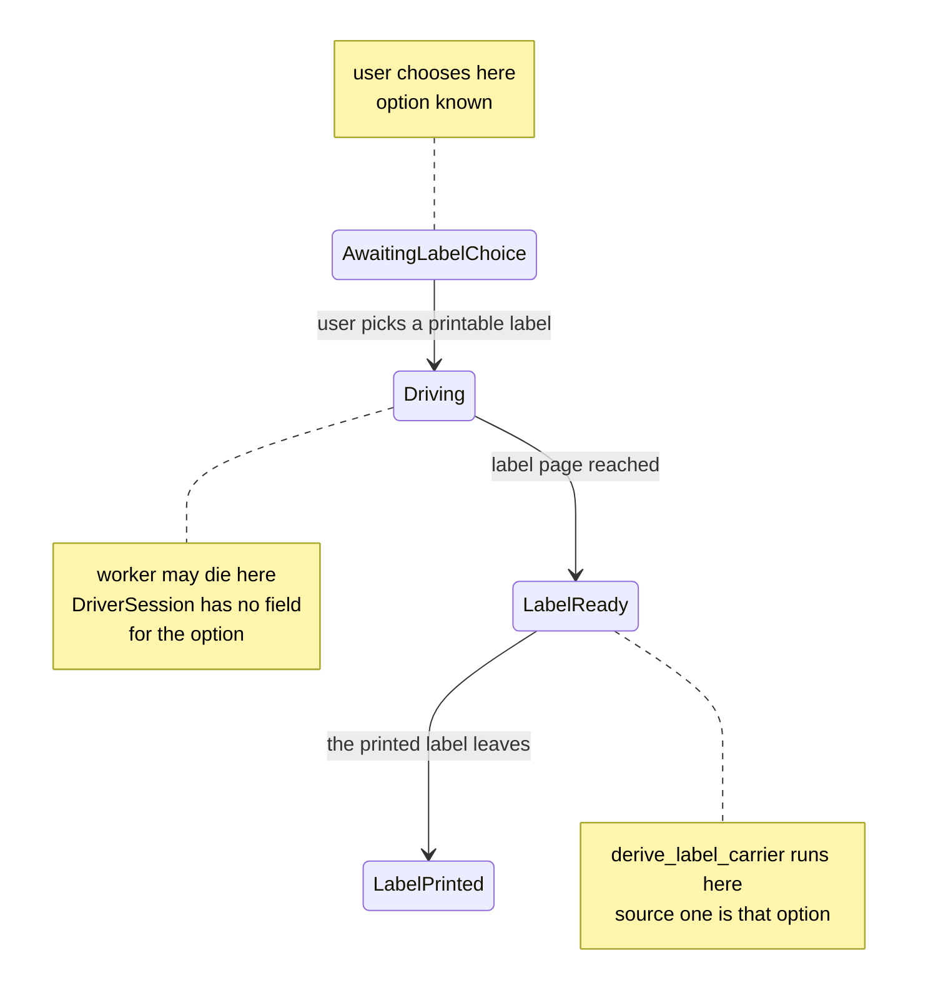
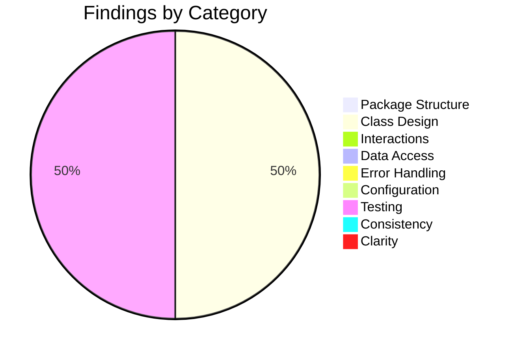

# Low-Level Design Review: Boomerang

**Document Reviewed:** `design/boomerang-low-level-design.md`
**Requirements Reference:** `design/boomerang-requirements.md`
**High-Level Design Reference:** `design/boomerang-high-level-design.md`
**Review Date:** 2026-08-26
**Reviewer:** Claude (Automated Review)

---

## Executive Summary

This is the sixth review of a document now at 2,234 lines, and the first that finds no blocking
defect. All eight findings from the fifth round are closed, several more completely than they were
raised: `src/extract/` is now a declared consumer of `src/driver/` with the FR-3.1.3 egress scan
drawn as the first step of the fallback path; §4.6 splits the label choice into the three
FR-3.3.9 edges it actually has; and the `NFR-` prefix fix upstream turned §9's proposed citation
sweep from a source of false positives into a check that now runs clean — 45 identifiers defined,
45 cited, zero discrepancies.

**Two findings remain, and they are two halves of one defect that the fifth round's own fix
introduced.** Closing CONSIST-1 moved `derive_label_carrier` from the moment of the user's choice
to the label page. That relocation is correct and better argued than the recommendation that
prompted it. But it opens a window — `AwaitingLabelChoice` to `Driving` to `LabelReady` — across
which the user's chosen option must now survive, because that option is *source one* of FR-3.3.5's
mandated ordering. §4.6 says the driver "carries the chosen option forward"; nothing persists it.
`DriverSession` has no field for it, §4.4's rehydration does not return it, and §8.3's only
worker-termination row kills the worker somewhere else. A worker death in that window silently
demotes a SHALL-ordered derivation to its second and third sources.

This is the pattern §10 already names about round three — "two were regressions introduced by round
two's own fixes." Neither finding blocks implementation: the failure degrades to a question rather
than to a wrong carrier, and FR-3.3.5's SHALL NOT (never default to USPS) is not reachable through
it. Both are single-line fixes to types and tables that already exist.

**Overall Verdict:** Ready for implementation

---

## Section Verdicts

| Review Area | Verdict | Findings |
|-------------|---------|----------|
| Package/Module Structure | Sufficient | 0 |
| Class/Type Design | Partially Addressed | 1 |
| Class Interactions & Workflows | Sufficient | 0 |
| Data Access Layer | Sufficient | 0 |
| Error Handling | Sufficient | 0 |
| Configuration & Wiring | Sufficient | 0 |
| Testing Completeness | Partially Addressed | 1 |
| Consistency with High-Level Design | Sufficient | 0 |
| Specification Clarity | Sufficient | 0 |

---

## Status of the Fifth Round

All eight findings are closed. Recorded here so the next reader does not re-derive it.

| ID | Priority | Status | How it was closed |
|----|----------|--------|-------------------|
| PKG-1 | Must | **Closed** | §2.2's graph now carries `DRIVER -- "egress scan on the fallback payload" --> EXTRACT`, and the `src/extract/` module row states both contexts explicitly — extraction runs injected with the content script, the scan runs in the worker where the payload is |
| CONSIST-1 | Must | **Closed** | §4.6's terminal `alt` is gone. The choice now branches into exactly three FR-3.3.9 edges, with the `Driving` intermediate drawn and the rule stated: "printable and non-printable are different edges, not one edge with a flag" |
| INTERACT-1 | Should | **Closed** | §4.2 gained an `extract egress scan` participant, a fail-closed branch covering both a flagged payload and a scan that cannot complete, and the ordering rationale — "the scan is the first thing on this path and the call is the second" |
| CLASS-1 | Should | **Closed** | Line 485 now reads `-derive_label_carrier(adapter, tab) str or None`, and §3.3 states "a miss at source three is not a value" |
| CLASS-2 | Should | **Closed** | Line 564 declares `StepExecutor` "the only module that executes a model-proposed action against a retailer page" |
| DAL-1 | Should | **Closed** | The contradicting "Both are `int` in the §3.4 diagram" paragraph is deleted from §5.2; `EvictedOrders` and `ReclaimedBytes` now have one definition each |
| TEST-1 | Should | **Closed** | Three §8.3 rows added, not the two recommended. "Undetermined carrier still ends at `LabelPrinted`" encodes CONSIST-1's distinction as a runnable assertion rather than restating it as prose |
| UNCLEAR-1 | Consider | **Closed** | Requirements §6 headings now read `### NFR-6.1` through `### NFR-6.7`. §9 generalises the fix into a rule: "the check and the naming convention are one control, not two" |

§10 adds no fifth-round decline section, which is consistent with all eight being taken.

---

## 1. Package/Module Structure

### Current State

Fourteen extension modules and seven server modules, each with a stated owner, a stated execution
context, and a cited requirement. §2.2's dependency graph is declared complete and prohibitive:
an edge not drawn is a dependency not permitted.

### Strengths

- **The graph is now honest about the FR-3.1.3 scan.** The fifth round's PKG-1 was that §2.2
  declared itself complete while omitting the one edge that made a mandated control reachable.
  `DRIVER --> EXTRACT` is drawn, labelled with what crosses it, and the module row explains why
  `src/extract/` is the only module with **both** execution contexts — the extraction runs where
  the DOM is, the scan runs where the payload is.
- **Split ownership of one control is stated rather than implied.** `src/extract/` owns the scan;
  `src/driver/` owns the abort. §8.2 pairs the two test rows and names the pairing as the point.
- **The prohibition is enforceable by reading.** Every module row cites the requirements it serves,
  so a module that gained an undeclared dependency would show as an uncited edge.

### Gaps and Recommendations

No findings this round.

### Verdict: **Sufficient**

---

## 2. Class/Type Design

### Current State

Twenty-two defined types across §3.3 and §3.5, with §3.5's table giving fields and a rationale for
each. Types this document invents are defined here; types the high-level design owns are cited
rather than restated, on the stated ground that a second definition is the one that drifts.

### Strengths

- **`ValidatedAction` remains constructible only through `ActionValidator`**, which makes an
  unvalidated action unrepresentable at the call site rather than merely forbidden.
- **`derive_label_carrier` can now express "nothing determinable"** — `str or None` — and §3.3
  states the consequence: the driver does not schedule, and the flow completes as a drop-off.
- **`StepExecutor`'s monopoly on page execution is now a written rule**, not an inference from the
  absence of other callers.
- **`ReturnMethodOptions` is four selectors and a map**, with `carrier_by_option` identified as
  FR-3.3.5's first source at the point of definition.

### Gaps and Recommendations

| ID | Gap | Class/Type | Priority | Recommendation |
|----|-----|------------|----------|----------------|
| CLASS-3 | `DriverSession`'s eleven fields carry no record of the return method the user chose, yet FR-3.3.5 makes that choice **source one** of a derivation §4.6 now performs two state transitions later. §4.6 says only that "the driver carries the chosen option forward" — in worker memory, across `AwaitingLabelChoice` to `Driving` to `LabelReady`. §4.4's rehydration returns `state, tab id, tab url, step key` and nothing else, so a worker death anywhere in that window loses source one and derivation silently begins at source two | `DriverSession` (§3.5, line 834); the "carries forward" claim in §4.6 | **Should** | §3.5 SHALL add a `chosen_option` field to `DriverSession`, written in the same `transact` as the `AwaitingLabelChoice --> Driving` transition, and §4.4's rehydration list SHALL include it. §4.6's diagram SHALL show the option being persisted with the state rather than carried, and the prose SHALL replace "carries the chosen option forward" with the persistence claim. The field is nullable: the free-drop-off branch never sets it |

The window the relocation opened, and where the value is currently held:

The failure is quiet rather than loud, which is the reason to close it. Nothing raises; a
rehydrated worker simply finds no mapping and proceeds to `label_carrier_patterns`, then to the
user. The observable symptom is a question the adapter could have answered — indistinguishable
from the unmapped-option case the design already handles correctly. §8.2 asserts
"persist-before-act on every transition" and that `transition` writes the session and the request
in one `set`; this is a value consumed after a transition that the persisted record does not carry,
which makes it an exception to the document's own rule rather than a new rule.

### Verdict: **Partially Addressed**

---

## 3. Class Interactions & Workflows

### Current State

Six sequence diagrams in §4 — ingest and rank, the fallback next-step call, pickup scheduling, the
worker-death rehydration, cancellation, and the return-method choice with carrier derivation.
Failure paths are drawn, not only happy paths.

### Strengths

- **§4.2 now draws the scan before the call and says why.** "The scan is the first thing on this
  path and the call is the second. Drawing it anywhere earlier would attest to a payload that is
  not the one sent." Both failure modes are covered — a flagged payload and a scan that cannot
  complete — and the diagram states that neither reaches `api-service`.
- **§4.6's three branches are the three edges FR-3.3.9 draws, and the document says so.** The
  earlier merge of printable and non-printable into one `LabelReady` edge is named as the defect
  it was.
- **The relocation of `derive_label_carrier` is argued from the requirement, not from convenience.**
  Source two matches against the label page, which does not exist until `Driving --> LabelReady`;
  deriving at the choice would make source two unreachable and push every unmapped option to a
  question the page was about to answer. This is a better reason than the fifth round gave for
  raising CONSIST-1 in the first place.
- **§4.6 distinguishes "drop-off only" from `DroppedOff`** — what is offered versus what state the
  return is in — and names the terminal for each.

### Gaps and Recommendations

No findings this round. CLASS-3's §4.6 correction is tracked under Class/Type Design because the
missing field is the cause and the diagram text is the symptom.

### Missing Workflow Coverage

| Requirement | Workflow Documented? | Notes |
|-------------|---------------------|-------|
| FR-3.1.2 / FR-3.1.3 | Yes | §4.1 ingest, §4.2 fallback with the egress scan as the first step |
| FR-3.3.4 / FR-3.3.5 | Yes | §4.6, with all three sources in the requirement's order |
| FR-3.3.9 | Yes | §4.4 rehydration, §4.6 the three choice edges; every terminal is reachable in a drawn flow |
| FR-3.4.x | Yes | §4.3 schedule, §4.5 refresh-before-cancel |
| FR-3.3.1 | Prose plus §8.3 | The negative requirement — asserted against the store, not a diagram, which is the right instrument |

### Verdict: **Sufficient**

---

## 4. Data Access Layer

### Current State

`chrome.storage.local` on the extension, no store at all on the server. §5.2 states the layout rule
— one key per collection, singletons for the address and the session — and is explicit that
`StorageCoordinator.transact` is a serialising queue rather than a transaction.

### Strengths

- **The `int` contradiction is gone.** `EvictedOrders` and `ReclaimedBytes` each have exactly one
  definition, in §3.5, and §5.2 no longer instructs the reader to prefer a paragraph over a diagram.
- **The rollback limitation is stated as a limitation**, with the consequent ordering rule and the
  single call pair it governs named in §5.2 and asserted in §8.2.
- **`schema_version` makes the defensive read possible**, and the unrecognised-version path rebuilds
  rather than migrates while preserving unsettled pickups and their booked addresses.

### Gaps and Recommendations

No findings this round.

### Verdict: **Sufficient**

---

## 5. Error Handling

### Current State

§6 maps each failure to a user-visible consequence and states which are retryable. The fail-closed
cases are called out as fail-closed rather than left to inference.

### Strengths

- **"The scan's own error is a positive result, not a skip"** is the correct reading of fail-closed
  and is written down where a reader would otherwise assume the opposite.
- **`WrongCarrierLabel` is documented as a second line, not the control.** §6 records that before
  §3.3 gave `derive_label_carrier` an owner, the server backstop was the only place a wrong carrier
  could be caught, and states the reverse must not be read into it.
- **A dropped ingest and a dropped write are distinguished by consequence**, not treated as one
  quota failure.

### Gaps and Recommendations

No findings this round.

### Verdict: **Sufficient**

---

## 6. Configuration & Wiring

### Current State

§7 covers server startup under Mangum with lifespan on, extension entrypoint wiring, and the
constants each side reads. Parameters invented by earlier drafts of this document were pushed
upstream into requirements §5.1 and §5.2 rather than kept here.

### Strengths

- **`BEDROCK_MODEL` has no default**, so a misconfigured deployment fails at startup rather than at
  the first inference call.
- **The upstream amendments are recorded in §10 with the reason each was upstream**, which keeps the
  header rule ("upstream wins") from hardening into "upstream is never wrong."
- **The popup owns `chrome.permissions.request` because a worker has no gesture to spend** — a
  platform constraint stated as the reason for a wiring decision.

### Gaps and Recommendations

No findings this round.

**Upstream observation, unchanged from the fifth round and not counted as a finding here:** three
paragraphs governing requirements §5.1 **server** parameters still sit physically inside §5.2
**Extension configuration** — the per-call-site Bedrock deadline rule (requirements line 957), the
USPS-credentials and `CARRIER_ADAPTER` rule (line 964), and the `BEDROCK_MODEL` no-default rule
(line 976), all within §5.2's span of lines 933 to 992. This is a defect in the requirements
document, not in this one, and the rules themselves are correct. It is repeated here only so it is
not lost.

### Verdict: **Sufficient**

---

## 7. Testing Completeness

### 7.1 Unit Test Assessment

No unit-test findings this round. §8.2's `src/driver/` row covers persist-before-act on every
transition, each edge of the FR-3.3.9 machine, and rehydration with a matching tab, a missing tab,
and a reused ID with a different URL. The FR-3.3.5 row asserts the ordering source by source and
asserts the SHALL NOT directly — running every miss path against an adapter whose patterns and
mapping both contain USPS and confirming the result is still undetermined.

### 7.2 Integration Test Assessment

| ID | Gap | Requirement | Priority | Recommendation |
|----|-----|-------------|----------|----------------|
| TEST-2 | §8.3 has exactly one worker-termination row, and it kills the worker at `AwaitingConfirm`. Since §4.6 moved derivation to the label page, the interval between the user's choice and `LabelReady` is a second window in which a worker death loses state — specifically FR-3.3.5's source one. No row exercises it, so CLASS-3 would ship undetected: the suite would pass with the option lost, because losing it produces a legal outcome | FR-3.3.5, FR-3.3.9 | **Should** | §8.3 SHALL gain a row: kill the worker after the user picks a printable option and before the label page is reached, then assert that on rehydration `derive_label_carrier` still resolves through `carrier_by_option` — that source one survives the death rather than the flow merely completing. The adapter fixture SHALL map the chosen option to a carrier its `label_carrier_patterns` do **not** match, so a fallthrough to source two is a visible failure rather than a silent equivalent |

The distinction that makes the fixture design load-bearing: with an adapter whose patterns would
also recognise the carrier, both the correct path and the degraded path produce the same
`label_carrier`, and the test passes either way. FR-3.3.5's SHALL is about the *order*, so the
assertion has to be able to see the order.

### 7.3 Requirements Traceability Gaps

§8.4 accounts for every `FR-` in the requirements document. The mechanical sweep §9 proposes now
runs clean in both directions — every identifier cited here is defined upstream, and every
identifier defined upstream is cited here or explicitly excused.

| Requirement | Unit Tests? | Integration Tests? | Gap | Recommendation |
|-------------|-------------|-------------------|-----|----------------|
| FR-3.3.5 | Yes | Partial | The three sources and the SHALL NOT are asserted. Source one's **survival across a worker death** is not — the only case where the mandated ordering silently changes at runtime | Add the TEST-2 row |

No requirement is without coverage. The gap above is a coverage depth gap within a requirement that
is otherwise tested from several directions.

### 7.4 Test Infrastructure Assessment

No findings this round. `WorkerLifecycle.terminate()` as an injected capability already gives the
suite the ability to cause the death TEST-2 needs; the row is missing, not the mechanism.

### Verdict: **Partially Addressed**

---

## 8. Consistency with High-Level Design

### Alignment Check

| High-Level Element | Low-Level Correspondence | Status | Notes |
|-------------------|-------------------------|--------|-------|
| Extension and broker split | §2.2's fourteen extension modules and seven server modules | Aligned | Every module cites the requirement it serves |
| `RETURN_REQUEST.label_carrier` (HLD §4.2) | `derive_label_carrier` (§3.3), `ReturnMethodOptions.carrier_by_option` (§3.5), the §4.6 flow, the §8.4 FR-3.3.5 row | Aligned | Closed in the fifth revision; §10 records that an absent field disagrees with nothing, which is why it survived four rounds |
| FR-3.3.9 state machine | §4.4 and §4.6 | Aligned | The three edges out of `AwaitingLabelChoice` are drawn as three edges. `DroppedOff` is reached directly and never through `LabelReady` |
| `LabelReady --> LabelPrinted` semantics | §4.6's terminal note, the §8.3 undetermined-carrier row | Aligned | The upstream amendment ("the printed label leaves") is reflected in both documents, per §10 |
| Stateless server (HLD §6.3) | No server store in §5; the client-side booking intent record | Aligned | §10 records the deduplication limitation as accepted and left open rather than papered over |
| Zero-OAuth, no user data server-side | FR-3.1.3 egress scan owned across `src/extract/` and `src/driver/`, drawn in §4.2 | Aligned | Closed by the PKG-1 and INTERACT-1 fixes |
| `DriverSession` (HLD §4.2) | §3.5's eleven fields | Aligned | Field renames are documented — `adapter_step_key` to `step_key`, `last_progress_at` to `last_written_at`. CLASS-3's proposed field is new to both documents and does not create a divergence |

### Gaps and Recommendations

No findings this round.

### Verdict: **Sufficient**

---

## 9. Specification Clarity

### Items Requiring Clarification

No findings this round.

The citation sweep §9 question 4 proposes now resolves every identifier it checks. The fifth
round's UNCLEAR-1 — bare `### 6.1` headings upstream against `NFR-6.1` citations here — is fixed at
the source, and §9 records the generalisation rather than only the fix: a sweep is only as good as
the definitions it can see, so any future identifier scheme has to be greppable from the heading
that defines it. That is the right lesson, and it is stated in the document that would suffer if it
were forgotten.

One phrase is worth watching without being a finding. §4.6's "the driver carries the chosen option
forward" is unambiguous about *what* happens and silent about *where the value lives*, which is
exactly the ambiguity CLASS-3 turns into a defect. Fixing CLASS-3 removes it.

### Verdict: **Sufficient**

---

## Summary of Recommendations

### Must Address (Blocking — resolve before implementation)

None.

### Should Address (High Priority)

1. **CLASS-3:** Add a `chosen_option` field to `DriverSession`, persisted with the
   `AwaitingLabelChoice --> Driving` transition and returned by §4.4's rehydration, so FR-3.3.5's
   source one survives a worker death in the window §4.6's relocation opened.
2. **TEST-2:** Add a §8.3 row that kills the worker between the label choice and the label page and
   asserts that derivation still resolves through `carrier_by_option`, against an adapter fixture
   whose `label_carrier_patterns` would not match the same carrier.

### Consider (Medium Priority)

None.

---

## Findings Summary

| Area | Verdict | Must | Should | Consider |
|------|---------|------|--------|----------|
| Package/Module Structure | Sufficient | 0 | 0 | 0 |
| Class/Type Design | Partially Addressed | 0 | 1 | 0 |
| Interactions & Workflows | Sufficient | 0 | 0 | 0 |
| Data Access Layer | Sufficient | 0 | 0 | 0 |
| Error Handling | Sufficient | 0 | 0 | 0 |
| Configuration & Wiring | Sufficient | 0 | 0 | 0 |
| Testing Completeness | Partially Addressed | 0 | 1 | 0 |
| HLD Consistency | Sufficient | 0 | 0 | 0 |
| Specification Clarity | Sufficient | 0 | 0 | 0 |
| **Total** | | **0** | **2** | **0** |

Findings by round: 64, 30, 29, 34, 8, 2.

---

## Untested Requirements

No requirement in `design/boomerang-requirements.md` is without test coverage. §8.4 accounts for
every `FR-` identifier, and the sweep in both directions is clean.

The one depth gap is within a covered requirement:

| Requirement | Description | Why It Matters |
|-------------|-------------|----------------|
| FR-3.3.5 | Derive `label_carrier` in order of preference: the chosen return method, then adapter recognition on the label page, then asking the user | The three sources and the never-default-to-USPS prohibition are asserted. What is not asserted is that source one **survives** the two state transitions that now separate the user's choice from the derivation. The ordering is a SHALL; a worker death currently changes it, and no test would notice because the degraded path produces a legal answer |

---

## Closing Note

Six rounds in, the finding count has gone 64, 30, 29, 34, 8, 2, and the character of what remains
has changed with it. The first rounds found design defects and then absences — requirements with no
owning module, which survive every consistency check precisely because a requirement never
mentioned cannot be contradicted. What is left now is neither: it is a consequence of a fix, in a
document that fixed the right thing for a better reason than the review gave.

That is worth naming, because §10 has already noticed the pattern once — "two were regressions
introduced by round two's own fixes" — and this round is a third instance. The structural answer is
narrower than §9's citation sweep and probably belongs beside it: when a call site moves across a
state transition, the values it reads have to move with it, and the persisted record is the only
thing that carries them. `derive_label_carrier` moved two transitions downstream and its first input
did not follow.

The document is ready to build against. Both remaining findings are single-line additions to a type
table and a test table, and neither changes a structure or an interface.
